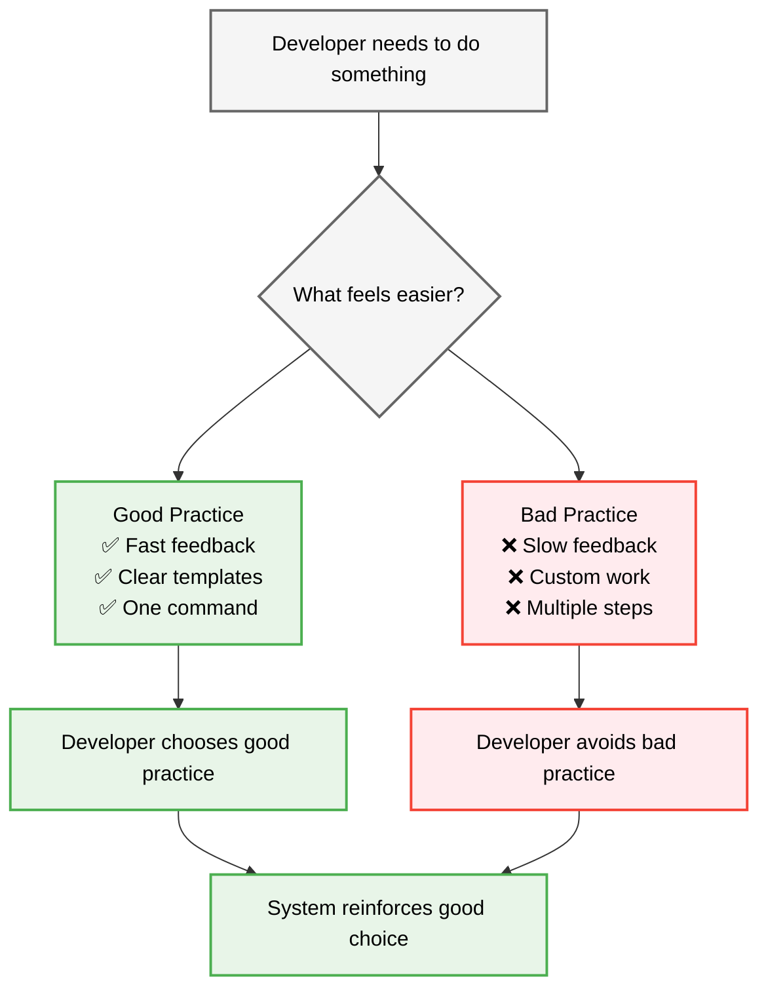
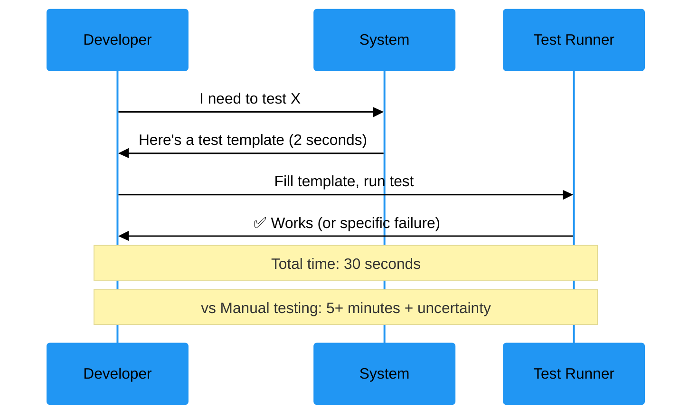
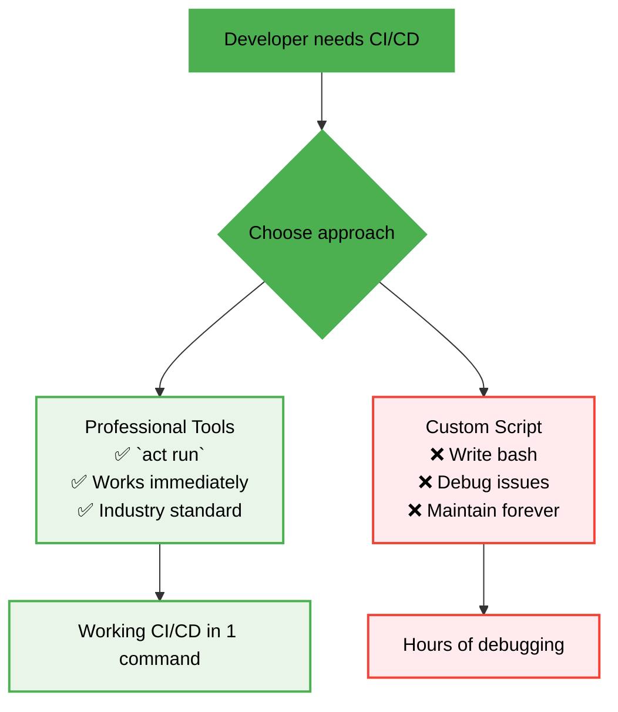
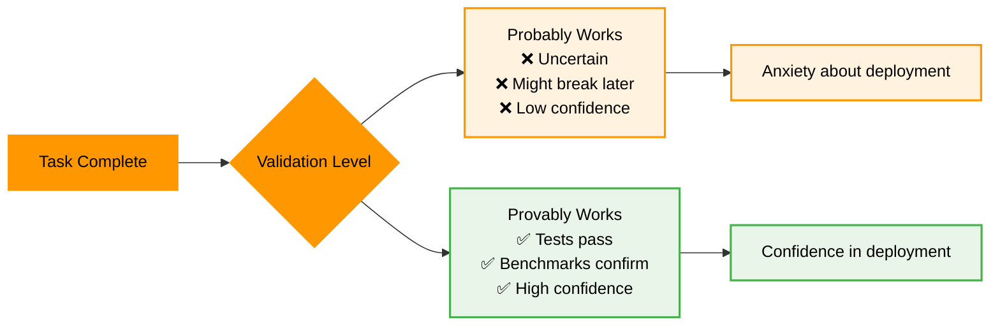

# Design Document: S03 - Reflect, Learn, Improve Standard Operating Procedure

## Overview

**The Design**: Create three simple systems that make good engineering practices feel easier than bad ones.

**Shreyas Doshi Principle**: "The best design is the one that makes the right choice the obvious choice."

## Architecture



## The Three Systems

### System 1: Test-First Feels Faster

**Problem**: Manual testing felt faster than automated testing  
**Solution**: Make automated testing actually faster



**Implementation**:
- Pre-built test templates for common patterns
- One-command test generation: `cargo test --template`
- Instant feedback loops
- Clear pass/fail results

### System 2: Professional Tools Feel Simpler

**Problem**: Custom scripts felt simpler than professional tools  
**Solution**: Make professional tools actually simpler



**Implementation**:
- One-command setup for professional tools
- Pre-configured templates that just work
- Clear documentation with copy-paste commands
- Automatic suggestions when custom scripts are detected

### System 3: "Provably Works" Feels More Satisfying

**Problem**: "It works" felt sufficient  
**Solution**: Make "provably works" more satisfying



**Implementation**:
- Task completion requires passing tests
- Performance claims require benchmarks
- Deployment requires validation
- Clear confidence indicators

## Components and Interfaces

### Friction Detection System

```rust
/// Detects when good practices feel harder than bad practices
pub trait FrictionDetector {
    /// Identifies friction points in current workflow
    async fn detect_friction_points(&self) -> Vec<FrictionPoint>;
    
    /// Suggests improvements to reduce friction
    async fn suggest_improvements(&self, friction: FrictionPoint) -> Vec<Improvement>;
}

pub struct FrictionPoint {
    pub activity: String,
    pub good_practice_effort: Duration,
    pub bad_practice_effort: Duration,
    pub why_bad_feels_easier: String,
}

pub struct Improvement {
    pub description: String,
    pub implementation: String,
    pub expected_effort_reduction: Duration,
}
```

### Template Generation System

```rust
/// Generates templates that make good practices easier
pub trait TemplateGenerator {
    /// Creates test templates for common patterns
    async fn generate_test_template(&self, pattern: TestPattern) -> String;
    
    /// Creates benchmark templates for performance claims
    async fn generate_benchmark_template(&self, claim: PerformanceClaim) -> String;
    
    /// Creates CI/CD templates using professional tools
    async fn generate_cicd_template(&self, requirements: CICDRequirements) -> String;
}
```

### Forcing Function System

```rust
/// Creates systems that make bad practices harder
pub trait ForcingFunctions {
    /// Requires tests before task completion
    async fn require_tests_for_completion(&self, task: Task) -> Result<(), CompletionError>;
    
    /// Requires benchmarks for performance claims
    async fn require_benchmarks_for_claims(&self, claim: PerformanceClaim) -> Result<(), ClaimError>;
    
    /// Suggests professional alternatives to custom scripts
    async fn suggest_professional_alternatives(&self, script: CustomScript) -> Vec<Alternative>;
}
```

## Data Models

### Simple State Tracking

```rust
#[derive(Debug, Clone)]
pub struct DeveloperChoice {
    pub situation: String,
    pub good_option: Practice,
    pub bad_option: Practice,
    pub chosen: Practice,
    pub why_chosen: String,
}

#[derive(Debug, Clone)]
pub struct Practice {
    pub name: String,
    pub perceived_effort: Duration,
    pub actual_effort: Duration,
    pub confidence_level: f64,
    pub satisfaction_score: f64,
}

#[derive(Debug, Clone)]
pub struct SystemImprovement {
    pub friction_point: String,
    pub solution: String,
    pub effort_reduction: Duration,
    pub confidence_increase: f64,
}
```

## Error Handling

### Simple Error Types

```rust
#[derive(Error, Debug)]
pub enum ReflectionError {
    #[error("Friction point not identified: {activity}")]
    FrictionNotFound { activity: String },
    
    #[error("Template generation failed: {reason}")]
    TemplateGenerationFailed { reason: String },
    
    #[error("Forcing function not implemented: {function}")]
    ForcingFunctionMissing { function: String },
}
```

## Testing Strategy

### Test the System, Not the Process

```rust
#[cfg(test)]
mod tests {
    use super::*;
    
    #[tokio::test]
    async fn test_automated_testing_feels_faster() {
        // ARRANGE: Time both approaches
        let manual_time = measure_manual_testing_time().await;
        let automated_time = measure_automated_testing_time().await;
        
        // ASSERT: Automated is actually faster
        assert!(automated_time < manual_time, 
                "Automated testing took {:?}, manual took {:?}", 
                automated_time, manual_time);
    }
    
    #[tokio::test]
    async fn test_professional_tools_feel_simpler() {
        // ARRANGE: Compare setup complexity
        let custom_steps = count_custom_script_steps().await;
        let professional_steps = count_professional_tool_steps().await;
        
        // ASSERT: Professional tools are simpler
        assert!(professional_steps < custom_steps,
                "Professional tools: {} steps, custom: {} steps",
                professional_steps, custom_steps);
    }
    
    #[tokio::test]
    async fn test_provably_works_more_satisfying() {
        // ARRANGE: Measure satisfaction scores
        let probably_satisfaction = measure_probably_works_satisfaction().await;
        let provably_satisfaction = measure_provably_works_satisfaction().await;
        
        // ASSERT: Provably works is more satisfying
        assert!(provably_satisfaction > probably_satisfaction,
                "Provably works: {}, probably works: {}",
                provably_satisfaction, probably_satisfaction);
    }
}
```

## Implementation Strategy

### Phase 1: Measure Current Friction (1 week)
- Time how long manual testing actually takes
- Count steps in custom scripts vs professional tools
- Survey satisfaction with "probably works" vs "provably works"

### Phase 2: Build Templates (1 week)
- Create test templates for common patterns
- Create benchmark templates for performance claims
- Create CI/CD templates using professional tools

### Phase 3: Add Forcing Functions (1 week)
- Require tests for task completion
- Require benchmarks for performance claims
- Suggest professional alternatives automatically

### Phase 4: Validate Improvement (1 week)
- Measure new friction levels
- Confirm good practices feel easier
- Adjust based on feedback

## Success Criteria

**Week 1**: We know exactly where good practices feel harder than bad practices  
**Week 2**: We have templates that make good practices easier  
**Week 3**: We have systems that make bad practices harder  
**Week 4**: New developers naturally choose good practices

## The Design Philosophy

**Shreyas Doshi Insight**: "Don't change people's preferences. Change what feels preferable."

This design doesn't try to convince developers to do TDD. It makes TDD feel faster, simpler, and more satisfying than the alternatives.

**Result**: Developers choose TDD because it's obviously better, not because they're disciplined.