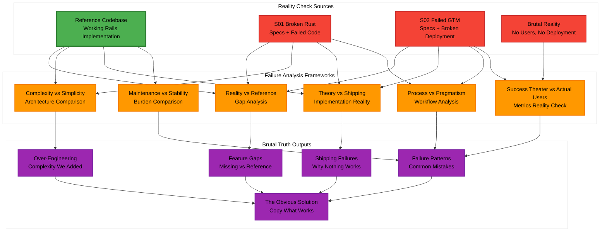

# Design Document: S03 - Reflect, Learn, Improve Standard Operating Procedure

## Overview

**The Brutal Reality**: This analysis will systematically document why S01 and S02 failed by comparing our broken implementations against the working reference codebase at `/Users/neetipatni/Desktop/amuldotexe-github/branchBgithub/campfire-on-rust/refCampfireCodebase`.

**The Design**: Create a comprehensive technical analysis system that brutally examines our failures against the proven reference implementation, identifying exactly where we chose complexity over simplicity, theory over practice, and process over shipping.

**Core Philosophy**: Transform subjective project retrospectives into objective, evidence-based analysis by comparing our broken implementations against the working reference codebase. Apply Shreyas Doshi's principle: "If you can't ship it, you didn't build it."

## Architecture



## Analysis Framework Components

### Reality Check Framework Against Reference Codebase

**Purpose**: Systematically document every way our implementations fail compared to the working reference codebase, identifying gaps in features, functionality, and deployment reality.

```mermaid
%%{init: {'theme':'base', 'themeVariables': {'primaryColor':'#2196f3','primaryTextColor':'#000000','primaryBorderColor':'#2196f3','lineColor':'#333333'}}}%%
graph TD
    subgraph "Reference Codebase Reality"
        REF_WORKS[Working Rails App<br/>Real Users, Real Deployment]
        REF_SIMPLE[Simple Architecture<br/>MVC, ActionCable, Straightforward]
        REF_FEATURES[Complete Features<br/>Chat, Rooms, Users, Files]
        REF_UI[Polished UI<br/>Professional Design]
    end
    
    subgraph "Our Broken Reality"
        OUR_BROKEN[Broken Rust App<br/>No Users, Failed Deployment]
        OUR_COMPLEX[Complex Architecture<br/>L1→L2→L3, Anti-coordination]
        OUR_INCOMPLETE[Incomplete Features<br/>Missing Core Functionality]
        OUR_AMATEUR[Amateur UI<br/>Student Project Look]
    end
    
    subgraph "Gap Analysis"
        FEATURE_GAPS[Missing Features<br/>vs Reference Standard]
        DEPLOY_GAPS[Deployment Failures<br/>vs Working Reference]
        UI_GAPS[Interface Gaps<br/>vs Professional Standard]
        ARCH_GAPS[Architecture Complexity<br/>vs Reference Simplicity]
    end
    
    REF_WORKS --> FEATURE_GAPS
    OUR_BROKEN --> FEATURE_GAPS
    
    REF_SIMPLE --> ARCH_GAPS
    OUR_COMPLEX --> ARCH_GAPS
    
    REF_FEATURES --> DEPLOY_GAPS
    OUR_INCOMPLETE --> DEPLOY_GAPS
    
    REF_UI --> UI_GAPS
    OUR_AMATEUR --> UI_GAPS
    
    classDef reference fill:#4caf50,stroke:#2e7d32,stroke-width:2px,color:#000000
    classDef broken fill:#f44336,stroke:#c62828,stroke-width:2px,color:#000000
    classDef gaps fill:#ff9800,stroke:#f57c00,stroke-width:2px,color:#000000
    
    class REF_WORKS,REF_SIMPLE,REF_FEATURES,REF_UI reference
    class OUR_BROKEN,OUR_COMPLEX,OUR_INCOMPLETE,OUR_AMATEUR broken
    class FEATURE_GAPS,DEPLOY_GAPS,UI_GAPS,ARCH_GAPS gaps
```



### Complexity vs Simplicity Analysis Framework

**Purpose**: Document how we chose complex Rust architectures when the reference codebase proves simple Rails patterns work perfectly.

```mermaid
%%{init: {'theme':'base', 'themeVariables': {'primaryColor':'#4caf50','primaryTextColor':'#000000','primaryBorderColor':'#4caf50','lineColor':'#333333'}}}%%
graph TD
    subgraph "Reference Simplicity"
        REF_MVC[Simple MVC<br/>Controllers, Models, Views]
        REF_CABLE[ActionCable<br/>Simple WebSocket Implementation]
        REF_TOOLS[Standard Tools<br/>Rails, PostgreSQL, Redis]
        REF_DEPLOY[Working Deployment<br/>Heroku, Docker, Simple]
    end
    
    subgraph "Our Complexity"
        OUR_LAYERS[L1→L2→L3 Layers<br/>Unnecessary Abstraction]
        OUR_COORD[Anti-coordination<br/>Complex State Management]
        OUR_TOOLS[Professional Tools<br/>cargo-dist, testcontainers]
        OUR_BROKEN[Broken Deployment<br/>Railway Failures, Install Scripts]
    end
    
    subgraph "Complexity Analysis"
        WHY_COMPLEX[Why We Chose Complexity]
        COST_COMPLEX[Cost of Complexity]
        SIMPLE_WORKS[Reference Proves Simple Works]
        LESSON[Copy Simplicity, Not Complexity]
    end
    
    REF_MVC --> WHY_COMPLEX
    OUR_LAYERS --> WHY_COMPLEX
    
    REF_CABLE --> COST_COMPLEX
    OUR_COORD --> COST_COMPLEX
    
    REF_TOOLS --> SIMPLE_WORKS
    OUR_TOOLS --> SIMPLE_WORKS
    
    REF_DEPLOY --> LESSON
    OUR_BROKEN --> LESSON
    
    classDef reference fill:#4caf50,stroke:#2e7d32,stroke-width:2px,color:#000000
    classDef complex fill:#f44336,stroke:#c62828,stroke-width:2px,color:#000000
    classDef analysis fill:#ff9800,stroke:#f57c00,stroke-width:2px,color:#000000
    
    class REF_MVC,REF_CABLE,REF_TOOLS,REF_DEPLOY reference
    class OUR_LAYERS,OUR_COORD,OUR_TOOLS,OUR_BROKEN complex
    class WHY_COMPLEX,COST_COMPLEX,SIMPLE_WORKS,LESSON analysis
```



### Implementation Reality vs Working Reference Framework

**Purpose**: Document why our implementations don't work when we have a working reference to copy from, analyzing the gap between theoretical correctness and practical shipping.

```mermaid
%%{init: {'theme':'base', 'themeVariables': {'primaryColor':'#ff9800','primaryTextColor':'#000000','primaryBorderColor':'#ff9800','lineColor':'#333333'}}}%%
graph TD
    subgraph "Reference Implementation"
        REF_WORKS[Working Ruby Code<br/>Deployed, Used, Maintained]
        REF_SIMPLE[Simple Patterns<br/>MVC, ActiveRecord, Standard Rails]
        REF_TESTS[Practical Tests<br/>Working Test Suite]
        REF_DEPLOY[Successful Deployment<br/>Heroku, Docker, Production]
    end
    
    subgraph "Our Broken Implementation"
        OUR_BROKEN[Broken Rust Code<br/>Compilation Errors, Failed Deploy]
        OUR_COMPLEX[Complex Patterns<br/>Type Safety Obsession, Over-Engineering]
        OUR_TDD[Theoretical TDD<br/>Tests Without Working Code]
        OUR_FAILED[Failed Deployment<br/>Railway Broken, Install Scripts Fail]
    end
    
    subgraph "Implementation Gap Analysis"
        WHY_BROKEN[Why Our Code Doesn't Work]
        THEORY_VS_PRACTICE[Theory vs Practical Shipping]
        REINVENTION[Why We Reinvented Working Patterns]
        COPY_SOLUTION[Copy What Works Instead]
    end
    
    REF_WORKS --> WHY_BROKEN
    OUR_BROKEN --> WHY_BROKEN
    
    REF_SIMPLE --> THEORY_VS_PRACTICE
    OUR_COMPLEX --> THEORY_VS_PRACTICE
    
    REF_TESTS --> REINVENTION
    OUR_TDD --> REINVENTION
    
    REF_DEPLOY --> COPY_SOLUTION
    OUR_FAILED --> COPY_SOLUTION
    
    classDef reference fill:#4caf50,stroke:#2e7d32,stroke-width:2px,color:#000000
    classDef broken fill:#f44336,stroke:#c62828,stroke-width:2px,color:#000000
    classDef analysis fill:#ff9800,stroke:#f57c00,stroke-width:2px,color:#000000
    
    class REF_WORKS,REF_SIMPLE,REF_TESTS,REF_DEPLOY reference
    class OUR_BROKEN,OUR_COMPLEX,OUR_TDD,OUR_FAILED broken
    class WHY_BROKEN,THEORY_VS_PRACTICE,REINVENTION,COPY_SOLUTION analysis
```



### Process Overhead vs Reference Pragmatism Framework

**Purpose**: Document how our process-heavy approach failed when the reference shows a pragmatic development workflow that actually ships features.

```mermaid
%%{init: {'theme':'base', 'themeVariables': {'primaryColor':'#9c27b0','primaryTextColor':'#000000','primaryBorderColor':'#9c27b0','lineColor':'#333333'}}}%%
graph TD
    subgraph "Reference Pragmatism"
        REF_SHIP[Ships Features<br/>Working Software First]
        REF_SIMPLE_TESTS[Practical Testing<br/>Tests That Actually Work]
        REF_TOOLS[Pragmatic Tooling<br/>Standard Rails Stack]
        REF_WORKFLOW[Simple Workflow<br/>Code → Test → Deploy]
    end
    
    subgraph "Our Process Overhead"
        OUR_SPECS[Writes Specs<br/>About Shipping Features]
        OUR_TDD[TDD Obsession<br/>Tests Without Working Software]
        OUR_PROFESSIONAL[Professional Tools<br/>Slows Development]
        OUR_HEAVY[Heavy Process<br/>Spec → Design → Tasks → Failure]
    end
    
    subgraph "Process Analysis"
        OVERHEAD_COST[Cost of Process Complexity]
        SHIPPING_GAP[Process vs Shipping Gap]
        PRAGMATIC_WINS[Reference Pragmatism Works]
        PROCESS_LESSON[Focus on Shipping, Not Process]
    end
    
    REF_SHIP --> OVERHEAD_COST
    OUR_SPECS --> OVERHEAD_COST
    
    REF_SIMPLE_TESTS --> SHIPPING_GAP
    OUR_TDD --> SHIPPING_GAP
    
    REF_TOOLS --> PRAGMATIC_WINS
    OUR_PROFESSIONAL --> PRAGMATIC_WINS
    
    REF_WORKFLOW --> PROCESS_LESSON
    OUR_HEAVY --> PROCESS_LESSON
    
    classDef reference fill:#4caf50,stroke:#2e7d32,stroke-width:2px,color:#000000
    classDef overhead fill:#f44336,stroke:#c62828,stroke-width:2px,color:#000000
    classDef analysis fill:#9c27b0,stroke:#7b1fa2,stroke-width:2px,color:#000000
    
    class REF_SHIP,REF_SIMPLE_TESTS,REF_TOOLS,REF_WORKFLOW reference
    class OUR_SPECS,OUR_TDD,OUR_PROFESSIONAL,OUR_HEAVY overhead
    class OVERHEAD_COST,SHIPPING_GAP,PRAGMATIC_WINS,PROCESS_LESSON analysis
```



### Maintenance Burden vs Reference Stability Framework

**Purpose**: Document why our "maintainable" Rust code is harder to maintain than the reference's "legacy" Ruby code.

```mermaid
%%{init: {'theme':'base', 'themeVariables': {'primaryColor':'#607d8b','primaryTextColor':'#000000','primaryBorderColor':'#607d8b','lineColor':'#333333'}}}%%
graph TD
    subgraph "Reference Stability"
        REF_STABLE[Stable Ruby Code<br/>Years of Production Use]
        REF_SIMPLE_MAINTAIN[Simple Maintenance<br/>Standard Rails Patterns]
        REF_WORKING_TESTS[Working Test Suite<br/>Reliable, Fast]
        REF_DEPLOY_STABLE[Stable Deployment<br/>Proven Infrastructure]
    end
    
    subgraph "Our Maintenance Burden"
        OUR_COMPLEX_MAINTAIN[Complex Rust Maintenance<br/>Type System Overhead]
        OUR_BROKEN_TESTS[Broken Test Infrastructure<br/>Complex, Unreliable]
        OUR_DEBT[Technical Debt<br/>Incomplete Features, Broken Deploy]
        OUR_ARCH_BURDEN[Architecture Burden<br/>L1→L2→L3 Complexity]
    end
    
    subgraph "Maintenance Reality"
        MAINTENANCE_PARADOX[Maintainable Code That's Hard to Maintain]
        STABILITY_GAP[Stable vs Unstable Reality]
        DEBT_REALITY[Zero Debt Claims vs Actual Debt]
        MAINTENANCE_LESSON[Simple Code Is More Maintainable]
    end
    
    REF_STABLE --> MAINTENANCE_PARADOX
    OUR_COMPLEX_MAINTAIN --> MAINTENANCE_PARADOX
    
    REF_SIMPLE_MAINTAIN --> STABILITY_GAP
    OUR_BROKEN_TESTS --> STABILITY_GAP
    
    REF_WORKING_TESTS --> DEBT_REALITY
    OUR_DEBT --> DEBT_REALITY
    
    REF_DEPLOY_STABLE --> MAINTENANCE_LESSON
    OUR_ARCH_BURDEN --> MAINTENANCE_LESSON
    
    classDef reference fill:#4caf50,stroke:#2e7d32,stroke-width:2px,color:#000000
    classDef burden fill:#f44336,stroke:#c62828,stroke-width:2px,color:#000000
    classDef reality fill:#607d8b,stroke:#455a64,stroke-width:2px,color:#000000
    
    class REF_STABLE,REF_SIMPLE_MAINTAIN,REF_WORKING_TESTS,REF_DEPLOY_STABLE reference
    class OUR_COMPLEX_MAINTAIN,OUR_BROKEN_TESTS,OUR_DEBT,OUR_ARCH_BURDEN burden
    class MAINTENANCE_PARADOX,STABILITY_GAP,DEBT_REALITY,MAINTENANCE_LESSON reality
```



### Success Theater vs Actual Shipping Framework

**Purpose**: Expose how we measured "success" on projects that fundamentally failed to ship working software, compared to the reference that has actual users.

```mermaid
%%{init: {'theme':'base', 'themeVariables': {'primaryColor':'#e91e63','primaryTextColor':'#000000','primaryBorderColor':'#e91e63','lineColor':'#333333'}}}%%
graph TD
    subgraph "Reference Success"
        REF_USERS[Actual Users<br/>Real People Using Software]
        REF_DEPLOYED[Actually Deployed<br/>Production Environment]
        REF_WORKING[Working Software<br/>Features That Function]
        REF_ADOPTION[Real Adoption<br/>Teams Using It Daily]
    end
    
    subgraph "Our Success Theater"
        OUR_METRICS[Vanity Metrics<br/>Tasks Completed, Tests Written]
        OUR_BROKEN[Broken Software<br/>Doesn't Deploy, Doesn't Work]
        OUR_NO_USERS[Zero Users<br/>Because Nothing Works]
        OUR_THEATER[Success Claims<br/>Without Working Software]
    end
    
    subgraph "Success Reality Check"
        THEATER_EXPOSED[Success Theater vs Reality]
        SHIPPING_TRUTH[Shipping Is The Only Success Metric]
        USER_TRUTH[Users Are The Only Validation]
        OBVIOUS_LESSON[Ship Working Software First]
    end
    
    REF_USERS --> THEATER_EXPOSED
    OUR_METRICS --> THEATER_EXPOSED
    
    REF_DEPLOYED --> SHIPPING_TRUTH
    OUR_BROKEN --> SHIPPING_TRUTH
    
    REF_WORKING --> USER_TRUTH
    OUR_NO_USERS --> USER_TRUTH
    
    REF_ADOPTION --> OBVIOUS_LESSON
    OUR_THEATER --> OBVIOUS_LESSON
    
    classDef reference fill:#4caf50,stroke:#2e7d32,stroke-width:2px,color:#000000
    classDef theater fill:#f44336,stroke:#c62828,stroke-width:2px,color:#000000
    classDef reality fill:#e91e63,stroke:#c2185b,stroke-width:2px,color:#000000
    
    class REF_USERS,REF_DEPLOYED,REF_WORKING,REF_ADOPTION reference
    class OUR_METRICS,OUR_BROKEN,OUR_NO_USERS,OUR_THEATER theater
    class THEATER_EXPOSED,SHIPPING_TRUTH,USER_TRUTH,OBVIOUS_LESSON reality
```



## Components and Interfaces

### Reference Codebase Comparison System

```rust
/// Compares our broken implementations against the working reference codebase
#[async_trait]
pub trait ReferenceComparisonAnalyzer: Send + Sync {
    /// Documents every missing feature compared to reference
    async fn analyze_missing_features(&self, spec: &Spec, reference_path: &Path) -> Result<Vec<MissingFeature>, AnalysisError>;
    
    /// Documents deployment failures vs working reference deployment
    async fn analyze_deployment_gaps(&self, spec: &Spec, reference_path: &Path) -> Result<DeploymentGapAnalysis, AnalysisError>;
    
    /// Documents UI/UX differences vs polished reference
    async fn analyze_interface_gaps(&self, spec: &Spec, reference_path: &Path) -> Result<Vec<InterfaceGap>, AnalysisError>;
    
    /// Documents over-engineering vs reference simplicity
    async fn analyze_complexity_gaps(&self, spec: &Spec, reference_path: &Path) -> Result<ComplexityGapAnalysis, AnalysisError>;
}

#[derive(Debug, Clone)]
pub struct MissingFeature {
    pub feature_name: String,
    pub exists_in_reference: bool,
    pub exists_in_our_implementation: bool,
    pub gap_severity: GapSeverity,
    pub reference_implementation_approach: String,
    pub our_broken_approach: Option<String>,
}

#[derive(Debug, Clone)]
pub struct DeploymentGapAnalysis {
    pub reference_deployment_works: bool,
    pub our_deployment_works: bool,
    pub reference_deployment_method: String,
    pub our_broken_deployment_attempts: Vec<String>,
    pub deployment_gap_severity: GapSeverity,
}
```

### Complexity vs Simplicity Analysis System

```rust
/// Analyzes why we chose complex architectures when reference proves simple works
#[async_trait]
pub trait ComplexityAnalyzer: Send + Sync {
    /// Compares our complex Rust architecture to reference's simple Rails approach
    async fn compare_architectural_complexity(&self, spec: &Spec, reference_path: &Path) -> Result<ArchitecturalComplexityComparison, AnalysisError>;
    
    /// Documents how reference achieves same functionality with simpler patterns
    async fn analyze_reference_simplicity(&self, reference_path: &Path) -> Result<SimplicityAnalysis, AnalysisError>;
    
    /// Identifies why we chose complexity over proven simplicity
    async fn analyze_complexity_decisions(&self, spec: &Spec) -> Result<Vec<ComplexityDecision>, AnalysisError>;
    
    /// Documents lessons about simplicity vs complexity
    async fn generate_simplicity_lessons(&self, spec: &Spec, reference_path: &Path) -> Result<Vec<SimplicityLesson>, AnalysisError>;
}

#[derive(Debug, Clone)]
pub struct ArchitecturalComplexityComparison {
    pub reference_approach: String,
    pub reference_complexity_score: u32,
    pub our_approach: String,
    pub our_complexity_score: u32,
    pub complexity_gap: f64,
    pub why_we_chose_complexity: String,
}

#[derive(Debug, Clone)]
pub struct SimplicityAnalysis {
    pub reference_patterns: Vec<String>,
    pub reference_achieves_same_functionality: bool,
    pub reference_lines_of_code: u32,
    pub our_lines_of_code: u32,
    pub simplicity_advantages: Vec<String>,
}
```

### Implementation Quality Analysis System

```rust
/// Analyzes implementation quality and development friction
#[async_trait]
pub trait ImplementationAnalyzer: Send + Sync {
    /// Evaluates code quality metrics and adherence to principles
    async fn analyze_code_quality(&self, codebase: &Codebase) -> Result<CodeQualityReport, AnalysisError>;
    
    /// Identifies specific friction points in development workflow
    async fn identify_development_friction(&self, spec: &Spec) -> Result<Vec<FrictionPoint>, AnalysisError>;
    
    /// Measures gap between professional tool goals and actual usage
    async fn analyze_tool_usage_gap(&self, spec: &Spec) -> Result<ToolUsageGapAnalysis, AnalysisError>;
    
    /// Quantifies difference between intended and actual complexity
    async fn measure_implementation_complexity(&self, spec: &Spec) -> Result<ImplementationComplexityAnalysis, AnalysisError>;
}

#[derive(Debug, Clone)]
pub struct FrictionPoint {
    pub activity: String,
    pub intended_approach: String,
    pub actual_approach: String,
    pub friction_cause: String,
    pub impact_on_adoption: AdoptionImpact,
}

#[derive(Debug, Clone)]
pub struct ToolUsageGapAnalysis {
    pub intended_tools: Vec<ProfessionalTool>,
    pub actual_tools: Vec<ActualTool>,
    pub gaps: Vec<ToolGap>,
    pub reasons_for_gaps: Vec<String>,
}
```

### Process Overhead vs Reference Pragmatism System

```rust
/// Analyzes why our process-heavy approach failed vs reference pragmatism
#[async_trait]
pub trait ProcessOverheadAnalyzer: Send + Sync {
    /// Compares our process-heavy approach to reference's pragmatic workflow
    async fn compare_development_approaches(&self, spec: &Spec, reference_path: &Path) -> Result<DevelopmentApproachComparison, AnalysisError>;
    
    /// Documents how reference ships features while we write specs about shipping
    async fn analyze_shipping_vs_process_gap(&self, spec: &Spec, reference_path: &Path) -> Result<ShippingProcessGap, AnalysisError>;
    
    /// Compares our TDD obsession to reference's practical testing
    async fn analyze_testing_approach_gap(&self, spec: &Spec, reference_path: &Path) -> Result<TestingApproachGap, AnalysisError>;
    
    /// Documents why our professional tools slowed development vs reference's pragmatic tooling
    async fn analyze_tooling_overhead(&self, spec: &Spec, reference_path: &Path) -> Result<ToolingOverheadAnalysis, AnalysisError>;
}

### Maintenance Burden vs Reference Stability System

```rust
/// Analyzes why our "maintainable" code is harder to maintain than reference
#[async_trait]
pub trait MaintenanceBurdenAnalyzer: Send + Sync {
    /// Compares maintenance overhead of our Rust vs reference Ruby
    async fn compare_maintenance_burden(&self, spec: &Spec, reference_path: &Path) -> Result<MaintenanceBurdenComparison, AnalysisError>;
    
    /// Documents our "zero technical debt" claims vs actual debt reality
    async fn analyze_technical_debt_reality(&self, spec: &Spec) -> Result<TechnicalDebtRealityCheck, AnalysisError>;
    
    /// Compares our complex architecture maintenance to reference's simple patterns
    async fn analyze_architecture_maintenance_gap(&self, spec: &Spec, reference_path: &Path) -> Result<ArchitectureMaintenanceGap, AnalysisError>;
    
    /// Documents why simple code is more maintainable than "maintainable" code
    async fn analyze_maintainability_paradox(&self, spec: &Spec, reference_path: &Path) -> Result<MaintainabilityParadox, AnalysisError>;
}

### Success Theater vs Actual Shipping System

```rust
/// Exposes how we measured success without shipping working software
#[async_trait]
pub trait SuccessTheaterAnalyzer: Send + Sync {
    /// Compares our vanity metrics to reference's actual user adoption
    async fn compare_success_metrics(&self, spec: &Spec, reference_path: &Path) -> Result<SuccessMetricsComparison, AnalysisError>;
    
    /// Documents that reference has users while we have broken software
    async fn analyze_user_reality_gap(&self, spec: &Spec, reference_path: &Path) -> Result<UserRealityGap, AnalysisError>;
    
    /// Exposes our "MVP completion" theater vs reference's working software
    async fn analyze_completion_theater(&self, spec: &Spec, reference_path: &Path) -> Result<CompletionTheaterAnalysis, AnalysisError>;
    
    /// Documents the fundamental truth: shipping is the only success metric
    async fn generate_shipping_truth_analysis(&self, spec: &Spec, reference_path: &Path) -> Result<ShippingTruthAnalysis, AnalysisError>;
}

#[derive(Debug, Clone)]
pub struct WorkflowAnalysis {
    pub stated_workflow: Vec<ProcessStep>,
    pub actual_workflow: Vec<ProcessStep>,
    pub deviations: Vec<WorkflowDeviation>,
    pub effectiveness_score: f64,
}

#[derive(Debug, Clone)]
pub struct ProcessFrictionAnalysis {
    pub process_name: String,
    pub intended_effort: Duration,
    pub actual_effort: Duration,
    pub friction_sources: Vec<FrictionSource>,
    pub adoption_rate: f64,
}
```

## Data Models

### Core Analysis Data Models

```rust
#[derive(Debug, Clone, Serialize, Deserialize)]
pub struct Spec {
    pub id: SpecId,
    pub name: String,
    pub requirements_file: PathBuf,
    pub design_file: PathBuf,
    pub tasks_file: PathBuf,
    pub stated_goals: Vec<String>,
    pub claimed_success_metrics: Vec<String>, // What we claimed as success
    pub actual_reality: ProjectReality, // What actually happened
    pub reference_comparison: ReferenceComparison, // How we compare to working reference
}

#[derive(Debug, Clone, Serialize, Deserialize)]
pub struct ProjectReality {
    pub works: bool, // Does it actually work?
    pub deployed: bool, // Is it actually deployed?
    pub has_users: bool, // Does anyone actually use it?
    pub deployment_failures: Vec<String>,
    pub broken_features: Vec<String>,
    pub compilation_errors: Vec<String>,
}

#[derive(Debug, Clone, Serialize, Deserialize)]
pub struct ReferenceComparison {
    pub reference_path: PathBuf,
    pub reference_works: bool,
    pub reference_has_users: bool,
    pub reference_is_deployed: bool,
    pub feature_gaps: Vec<FeatureGap>,
    pub complexity_gaps: Vec<ComplexityGap>,
    pub deployment_gaps: Vec<DeploymentGap>,
}

#[derive(Debug, Clone, Serialize, Deserialize)]
pub struct BrutalAnalysisResult {
    pub spec_id: SpecId,
    pub analysis_type: FailureAnalysisType,
    pub brutal_findings: Vec<BrutalFinding>,
    pub reference_comparison: ReferenceComparisonResult,
    pub obvious_solutions: Vec<ObviousSolution>,
    pub failure_patterns: Vec<FailurePattern>,
    pub analysis_timestamp: DateTime<Utc>,
}

#[derive(Debug, Clone, Serialize, Deserialize)]
pub struct BrutalFinding {
    pub category: FailureCategory,
    pub brutal_description: String, // No sugar-coating
    pub reference_evidence: Vec<ReferenceEvidence>, // How reference does it right
    pub our_failure_evidence: Vec<FailureEvidence>, // How we failed
    pub failure_severity: FailureSeverity,
    pub root_cause: String, // Direct cause identification
}

#[derive(Debug, Clone, Serialize, Deserialize)]
pub struct ObviousSolution {
    pub title: String,
    pub brutal_truth: String, // What we should obviously do
    pub reference_approach: String, // How reference solves it
    pub why_we_ignored_obvious: String, // Why we chose complexity
    pub copy_reference_steps: Vec<String>, // Specific steps to copy reference
    pub stop_doing: Vec<String>, // What to stop doing
}

#[derive(Debug, Clone, Serialize, Deserialize)]
pub struct ComparativeAnalysis {
    pub specs_compared: Vec<SpecId>,
    pub common_patterns: Vec<Pattern>,
    pub divergent_approaches: Vec<Divergence>,
    pub cross_project_insights: Vec<Insight>,
    pub systemic_issues: Vec<SystemicIssue>,
}

#[derive(Debug, Clone, Serialize, Deserialize)]
pub struct Pattern {
    pub pattern_name: String,
    pub occurrences: Vec<PatternOccurrence>,
    pub outcome_correlation: OutcomeCorrelation,
    pub recommendation: String,
}

#[derive(Debug, Clone, Serialize, Deserialize)]
pub struct SystemicIssue {
    pub issue_name: String,
    pub affected_specs: Vec<SpecId>,
    pub manifestations: Vec<IssueManifestations>,
    pub root_cause_hypothesis: String,
    pub proposed_solution: String,
}
```

### Analysis Framework Enums

```rust
#[derive(Debug, Clone, Serialize, Deserialize)]
pub enum FailureAnalysisType {
    RealityCheckVsReference,
    ComplexityVsSimplicity,
    TheoryVsShipping,
    ProcessVsPragmatism,
    MaintenanceVsStability,
    SuccessTheaterVsActualUsers,
    FailurePatternRecognition,
}

#[derive(Debug, Clone, Serialize, Deserialize)]
pub enum FailureCategory {
    MissingFeatures, // Features reference has that we don't
    BrokenDeployment, // Our deployment doesn't work, reference does
    OverEngineering, // We added complexity reference doesn't need
    ProcessOverhead, // We chose process over shipping
    MaintenanceBurden, // Our "maintainable" code is harder to maintain
    SuccessTheater, // We measured fake success while reference has real users
    TheoryOverPractice, // We chose theoretical correctness over working software
}

#[derive(Debug, Clone, Serialize, Deserialize)]
pub enum ImpactLevel {
    Critical,    // Directly caused project failure
    High,        // Significantly impacted outcomes
    Medium,      // Noticeable but manageable impact
    Low,         // Minor impact on outcomes
}

#[derive(Debug, Clone, Serialize, Deserialize)]
pub enum CompletionStatus {
    Completed,
    PartiallyCompleted { completion_percentage: f64 },
    Abandoned { reason: String },
    InProgress,
}
```

## Error Handling

### Brutal Analysis Error Types

```rust
#[derive(Error, Debug)]
pub enum BrutalAnalysisError {
    #[error("Reference codebase not found: {path} - Can't compare to working standard")]
    ReferenceCodebaseNotFound { path: PathBuf },
    
    #[error("Spec file not found: {path} - Can't analyze what doesn't exist")]
    SpecFileNotFound { path: PathBuf },
    
    #[error("Our implementation doesn't work: {reason} - Reference works fine")]
    OurImplementationBroken { reason: String },
    
    #[error("Can't analyze deployment - ours is broken, reference works")]
    DeploymentComparisonFailed { our_error: String, reference_works: bool },
    
    #[error("Feature comparison failed: {feature} - exists in reference but broken in ours")]
    FeatureComparisonFailed { feature: String },
    
    #[error("Success metrics analysis impossible - we have no users, reference does")]
    NoUsersToAnalyze,
    
    #[error("Evidence collection failed: {source} - {brutal_reason}")]
    EvidenceCollectionFailed { source: String, brutal_reason: String },
    
    #[error("Can't generate recommendations - obvious solution is copy reference")]
    ObviousSolutionIgnored { reference_approach: String },
}

#[derive(Error, Debug)]
pub enum ValidationError {
    #[error("Analysis result validation failed: {field}")]
    InvalidAnalysisResult { field: String },
    
    #[error("Confidence score out of range: {score} (must be 0.0-1.0)")]
    InvalidConfidenceScore { score: f64 },
    
    #[error("Missing required evidence for finding: {finding}")]
    MissingEvidence { finding: String },
    
    #[error("Circular dependency in recommendations: {cycle}")]
    CircularRecommendationDependency { cycle: String },
}
```

## Testing Strategy

### Brutal Reality Analysis Validation

```rust
#[cfg(test)]
mod tests {
    use super::*;
    
    #[tokio::test]
    async fn test_reference_comparison_brutal_honesty() {
        // ARRANGE: Create test spec representing our broken implementation
        let broken_spec = create_broken_s01_spec().await;
        let reference_path = Path::new("/reference/working-campfire");
        let analyzer = ReferenceComparisonAnalyzer::new();
        
        // ACT: Compare against working reference
        let comparison = analyzer.analyze_missing_features(&broken_spec, &reference_path).await.unwrap();
        
        // ASSERT: Analysis brutally documents our failures
        assert!(!comparison.is_empty(), "Should identify missing features");
        assert!(comparison.iter().any(|f| f.exists_in_reference && !f.exists_in_our_implementation), 
                "Should identify features reference has that we don't");
        assert!(comparison.iter().any(|f| f.gap_severity == GapSeverity::Critical), 
                "Should identify critical gaps");
    }
    
    #[tokio::test]
    async fn test_complexity_vs_simplicity_brutal_comparison() {
        // ARRANGE: Create spec with our complex architecture vs simple reference
        let complex_spec = create_complex_rust_spec().await;
        let reference_path = Path::new("/reference/simple-rails");
        let analyzer = ComplexityAnalyzer::new();
        
        // ACT: Compare complexity approaches
        let comparison = analyzer.compare_architectural_complexity(&complex_spec, &reference_path).await.unwrap();
        
        // ASSERT: Analysis shows we chose unnecessary complexity
        assert!(comparison.our_complexity_score > comparison.reference_complexity_score, 
                "Our implementation should be more complex");
        assert!(!comparison.why_we_chose_complexity.is_empty(), 
                "Should explain why we chose complexity over simplicity");
        assert!(comparison.complexity_gap > 2.0, "Should show significant complexity gap");
    }
    
    #[tokio::test]
    async fn test_implementation_reality_vs_working_reference() {
        // ARRANGE: Create spec representing our broken implementation vs working reference
        let broken_spec = create_broken_implementation_spec().await;
        let reference_path = Path::new("/reference/working-implementation");
        let analyzer = ImplementationRealityAnalyzer::new();
        
        // ACT: Compare implementation reality
        let reality_check = analyzer.compare_implementation_reality(&broken_spec, &reference_path).await.unwrap();
        
        // ASSERT: Analysis shows brutal reality of our failures
        assert!(!reality_check.reference_works, "Reference should work");
        assert!(!reality_check.our_implementation_works, "Our implementation should be broken");
        assert!(!reality_check.implementation_failures.is_empty(), "Should document our failures");
        assert!(!reality_check.why_we_reinvented.is_empty(), "Should explain why we reinvented working patterns");
    }
    
    #[tokio::test]
    async fn test_comparative_analysis_patterns() {
        // ARRANGE: Create two specs with common patterns
        let spec1 = create_test_spec_s01().await;
        let spec2 = create_test_spec_s02().await;
        let analyzer = ComparativeAnalyzer::new();
        
        // ACT: Perform comparative analysis
        let comparison = analyzer.compare_specs(vec![spec1, spec2]).await.unwrap();
        
        // ASSERT: Common patterns are identified
        assert!(!comparison.common_patterns.is_empty(), "Should identify common patterns");
        assert!(!comparison.systemic_issues.is_empty(), "Should identify systemic issues");
    }
    
    #[tokio::test]
    async fn test_recommendation_generation_quality() {
        // ARRANGE: Create analysis result with findings
        let findings = create_test_findings().await;
        let generator = RecommendationGenerator::new();
        
        // ACT: Generate recommendations
        let recommendations = generator.generate_recommendations(findings).await.unwrap();
        
        // ASSERT: Recommendations are actionable and specific
        for rec in recommendations {
            assert!(!rec.description.is_empty(), "Recommendation should have description");
            assert!(!rec.success_criteria.is_empty(), "Should have success criteria");
            assert!(rec.confidence_score >= 0.0 && rec.confidence_score <= 1.0, 
                    "Confidence score should be valid");
        }
    }
    
    #[tokio::test]
    async fn test_analysis_result_validation() {
        // ARRANGE: Create analysis result with various validity issues
        let invalid_result = create_invalid_analysis_result().await;
        let validator = AnalysisValidator::new();
        
        // ACT & ASSERT: Validation should catch all issues
        let validation_result = validator.validate_analysis_result(&invalid_result).await;
        assert!(validation_result.is_err(), "Should reject invalid analysis result");
    }
}
```

## Implementation Strategy

### Phase 1: Brutal Reality Framework Development (Week 1)
- Implement reference codebase comparison interfaces and data models
- Create spec file parsing to extract our failed claims vs reality
- Build evidence collection from reference codebase (what works) vs our failures
- Develop brutal truth generation algorithms (no sugar-coating)

### Phase 2: Individual Failure Analysis Framework Implementation (Week 2)
- Implement Reference Comparison Framework documenting every gap vs working standard
- Implement Complexity vs Simplicity Framework showing why we chose unnecessary complexity
- Implement Implementation Reality Framework documenting why our code doesn't work
- Implement Process Overhead Framework showing how process prevented shipping

### Phase 3: Brutal Truth Integration and Pattern Recognition (Week 3)
- Implement Maintenance Burden Framework comparing our "maintainable" code to reference stability
- Implement Success Theater Framework exposing fake metrics vs reference's real users
- Implement Failure Pattern Recognition for systemic issues across S01 and S02
- Create integrated brutal analysis pipeline with reference comparison

### Phase 4: Brutal Analysis Execution and Obvious Solutions (Week 4)
- Execute comprehensive brutal analysis on S01 and S02 against reference codebase
- Document every way we failed compared to working reference standard
- Generate obvious solutions: copy what works, stop reinventing, ship working software
- Create brutally honest documentation of failures and the obvious path forward

## Success Criteria

**Week 1**: Brutal reality framework can compare our failures against working reference codebase  
**Week 2**: All failure analysis frameworks can document specific gaps vs reference standard  
**Week 3**: Pattern recognition can identify systemic failure patterns and obvious solutions  
**Week 4**: Complete brutal analysis exposing why we failed and the obvious solution: copy what works

## Brutal Analysis Output Structure

### Brutal Reality Reports

Each failure analysis framework will produce brutally honest reports containing:

1. **Brutal Executive Summary**: What failed, why it failed, how reference succeeds
2. **Reference vs Our Reality**: Side-by-side comparison of working vs broken
3. **Failure Pattern Documentation**: Recurring mistakes and their consequences
4. **Obvious Solutions**: Copy reference, stop reinventing, ship working software
5. **Evidence Documentation**: Concrete proof of failures vs reference success

### Cross-Project Failure Insights

The brutal comparative analysis will synthesize findings to identify:

1. **Systemic Failure Patterns**: Mistakes that caused both S01 and S02 to fail
2. **Reference Success Patterns**: What the working codebase does right that we ignored
3. **Complexity Anti-Patterns**: How we consistently chose complexity over reference simplicity
4. **Shipping Failures**: How we consistently chose process/theory over working software
5. **The Obvious Path Forward**: Copy reference architecture, stop reinventing, ship first

## The Brutal Analysis Philosophy

**Core Principle**: Transform subjective project retrospectives into brutal, evidence-based reality checks against working reference implementations. No sugar-coating, no excuses, just honest comparison against proven success.

**Shreyas Doshi Truth**: "If you can't ship it, you didn't build it. If users can't use it, it doesn't exist." The reference codebase exists, works, and has users. Our implementations don't.

This design creates systematic frameworks for understanding why we failed by comparing against what actually works, moving beyond theoretical "lessons learned" to brutal reality checks against proven implementations.

**Result**: Future projects will copy what works instead of reinventing complexity, ship working software instead of writing specs about shipping, and measure success by users instead of completed tasks.