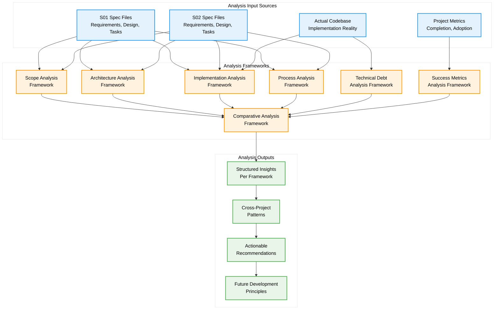
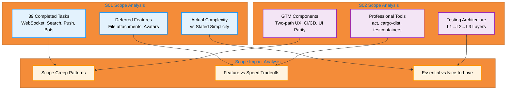
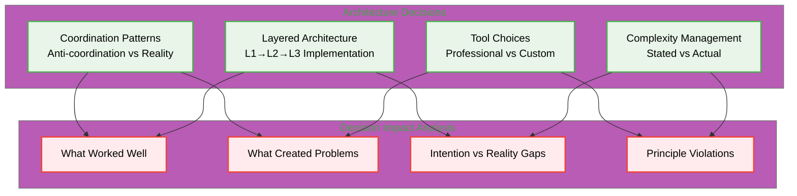
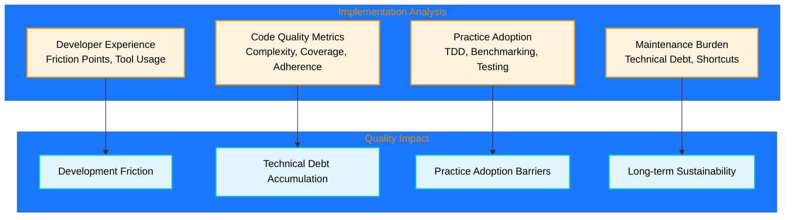

# Design Document: S03 - Reflect, Learn, Improve Standard Operating Procedure

## Overview

**The Design**: Create a comprehensive technical analysis system that systematically examines S01 and S02 to understand why they failed to achieve their intended outcomes, and extract actionable insights for future development.

**Core Philosophy**: Use structured analysis frameworks to transform subjective project "lessons learned" into objective, measurable insights that can guide future architectural and process decisions.

## Architecture



## Analysis Framework Components

### Scope Analysis Framework

**Purpose**: Systematically analyze what was included/excluded in S01 and S02 and why those decisions led to specific outcomes.



### Architecture Decision Analysis Framework

**Purpose**: Understand which architectural choices contributed to success or failure.



### Implementation Quality Analysis Framework

**Purpose**: Analyze implementation patterns that led to maintainability issues or development friction.



## Components and Interfaces

### Scope Analysis System

```rust
/// Analyzes scope decisions and their impact on project outcomes
#[async_trait]
pub trait ScopeAnalyzer: Send + Sync {
    /// Analyzes all features included in a spec
    async fn analyze_included_features(&self, spec: &Spec) -> Result<Vec<FeatureAnalysis>, AnalysisError>;
    
    /// Analyzes features that were excluded or deferred
    async fn analyze_excluded_features(&self, spec: &Spec) -> Result<Vec<ExclusionAnalysis>, AnalysisError>;
    
    /// Identifies scope creep patterns
    async fn identify_scope_creep(&self, spec: &Spec) -> Result<Vec<ScopeCreepPattern>, AnalysisError>;
    
    /// Evaluates trade-offs between feature completeness and delivery speed
    async fn evaluate_scope_tradeoffs(&self, spec: &Spec) -> Result<ScopeTradeoffAnalysis, AnalysisError>;
}

#[derive(Debug, Clone)]
pub struct FeatureAnalysis {
    pub feature_name: String,
    pub complexity_score: u32,
    pub essential_for_goals: bool,
    pub implementation_effort: Duration,
    pub maintenance_burden: MaintenanceBurden,
}

#[derive(Debug, Clone)]
pub struct ScopeCreepPattern {
    pub pattern_type: ScopeCreepType,
    pub features_affected: Vec<String>,
    pub complexity_increase: f64,
    pub timeline_impact: Duration,
}
```

### Architecture Analysis System

```rust
/// Analyzes architectural decisions and their outcomes
#[async_trait]
pub trait ArchitectureAnalyzer: Send + Sync {
    /// Documents major architectural decisions and rationale
    async fn analyze_architectural_decisions(&self, spec: &Spec) -> Result<Vec<ArchitecturalDecision>, AnalysisError>;
    
    /// Measures gap between stated simplicity goals and actual complexity
    async fn measure_complexity_gap(&self, spec: &Spec) -> Result<ComplexityGapAnalysis, AnalysisError>;
    
    /// Identifies violations of stated architectural principles
    async fn identify_principle_violations(&self, spec: &Spec) -> Result<Vec<PrincipleViolation>, AnalysisError>;
    
    /// Analyzes coordination patterns and their effectiveness
    async fn analyze_coordination_patterns(&self, spec: &Spec) -> Result<CoordinationAnalysis, AnalysisError>;
}

#[derive(Debug, Clone)]
pub struct ArchitecturalDecision {
    pub decision_name: String,
    pub rationale: String,
    pub alternatives_considered: Vec<String>,
    pub outcome: DecisionOutcome,
    pub impact_on_complexity: ComplexityImpact,
}

#[derive(Debug, Clone)]
pub struct ComplexityGapAnalysis {
    pub stated_complexity_goal: String,
    pub actual_complexity_score: u32,
    pub gap_magnitude: f64,
    pub contributing_factors: Vec<ComplexityFactor>,
}
```

### Implementation Quality Analysis System

```rust
/// Analyzes implementation quality and development friction
#[async_trait]
pub trait ImplementationAnalyzer: Send + Sync {
    /// Evaluates code quality metrics and adherence to principles
    async fn analyze_code_quality(&self, codebase: &Codebase) -> Result<CodeQualityReport, AnalysisError>;
    
    /// Identifies specific friction points in development workflow
    async fn identify_development_friction(&self, spec: &Spec) -> Result<Vec<FrictionPoint>, AnalysisError>;
    
    /// Measures gap between professional tool goals and actual usage
    async fn analyze_tool_usage_gap(&self, spec: &Spec) -> Result<ToolUsageGapAnalysis, AnalysisError>;
    
    /// Quantifies difference between intended and actual complexity
    async fn measure_implementation_complexity(&self, spec: &Spec) -> Result<ImplementationComplexityAnalysis, AnalysisError>;
}

#[derive(Debug, Clone)]
pub struct FrictionPoint {
    pub activity: String,
    pub intended_approach: String,
    pub actual_approach: String,
    pub friction_cause: String,
    pub impact_on_adoption: AdoptionImpact,
}

#[derive(Debug, Clone)]
pub struct ToolUsageGapAnalysis {
    pub intended_tools: Vec<ProfessionalTool>,
    pub actual_tools: Vec<ActualTool>,
    pub gaps: Vec<ToolGap>,
    pub reasons_for_gaps: Vec<String>,
}
```

### Process Analysis System

```rust
/// Analyzes development processes and their effectiveness
#[async_trait]
pub trait ProcessAnalyzer: Send + Sync {
    /// Documents actual development workflow vs stated methodology
    async fn analyze_development_workflow(&self, spec: &Spec) -> Result<WorkflowAnalysis, AnalysisError>;
    
    /// Identifies where stated methodologies were abandoned
    async fn identify_methodology_abandonment(&self, spec: &Spec) -> Result<Vec<MethodologyGap>, AnalysisError>;
    
    /// Quantifies time and effort costs of following best practices
    async fn measure_process_friction(&self, spec: &Spec) -> Result<ProcessFrictionAnalysis, AnalysisError>;
    
    /// Evaluates effectiveness of testing and validation workflows
    async fn evaluate_validation_effectiveness(&self, spec: &Spec) -> Result<ValidationEffectivenessReport, AnalysisError>;
}

#[derive(Debug, Clone)]
pub struct WorkflowAnalysis {
    pub stated_workflow: Vec<ProcessStep>,
    pub actual_workflow: Vec<ProcessStep>,
    pub deviations: Vec<WorkflowDeviation>,
    pub effectiveness_score: f64,
}

#[derive(Debug, Clone)]
pub struct ProcessFrictionAnalysis {
    pub process_name: String,
    pub intended_effort: Duration,
    pub actual_effort: Duration,
    pub friction_sources: Vec<FrictionSource>,
    pub adoption_rate: f64,
}
```

## Data Models

### Core Analysis Data Models

```rust
#[derive(Debug, Clone, Serialize, Deserialize)]
pub struct Spec {
    pub id: SpecId,
    pub name: String,
    pub requirements_file: PathBuf,
    pub design_file: PathBuf,
    pub tasks_file: PathBuf,
    pub stated_goals: Vec<String>,
    pub success_metrics: Vec<SuccessMetric>,
    pub completion_status: CompletionStatus,
}

#[derive(Debug, Clone, Serialize, Deserialize)]
pub struct AnalysisResult {
    pub spec_id: SpecId,
    pub analysis_type: AnalysisType,
    pub findings: Vec<Finding>,
    pub recommendations: Vec<Recommendation>,
    pub confidence_score: f64,
    pub analysis_timestamp: DateTime<Utc>,
}

#[derive(Debug, Clone, Serialize, Deserialize)]
pub struct Finding {
    pub category: FindingCategory,
    pub description: String,
    pub evidence: Vec<Evidence>,
    pub impact_level: ImpactLevel,
    pub root_cause: Option<String>,
}

#[derive(Debug, Clone, Serialize, Deserialize)]
pub struct Recommendation {
    pub title: String,
    pub description: String,
    pub rationale: String,
    pub implementation_effort: EffortEstimate,
    pub expected_impact: ImpactEstimate,
    pub success_criteria: Vec<String>,
}

#[derive(Debug, Clone, Serialize, Deserialize)]
pub struct ComparativeAnalysis {
    pub specs_compared: Vec<SpecId>,
    pub common_patterns: Vec<Pattern>,
    pub divergent_approaches: Vec<Divergence>,
    pub cross_project_insights: Vec<Insight>,
    pub systemic_issues: Vec<SystemicIssue>,
}

#[derive(Debug, Clone, Serialize, Deserialize)]
pub struct Pattern {
    pub pattern_name: String,
    pub occurrences: Vec<PatternOccurrence>,
    pub outcome_correlation: OutcomeCorrelation,
    pub recommendation: String,
}

#[derive(Debug, Clone, Serialize, Deserialize)]
pub struct SystemicIssue {
    pub issue_name: String,
    pub affected_specs: Vec<SpecId>,
    pub manifestations: Vec<IssueManifestations>,
    pub root_cause_hypothesis: String,
    pub proposed_solution: String,
}
```

### Analysis Framework Enums

```rust
#[derive(Debug, Clone, Serialize, Deserialize)]
pub enum AnalysisType {
    Scope,
    Architecture,
    Implementation,
    Process,
    TechnicalDebt,
    SuccessMetrics,
    Comparative,
}

#[derive(Debug, Clone, Serialize, Deserialize)]
pub enum FindingCategory {
    ScopeCreep,
    ArchitecturalComplexity,
    ImplementationFriction,
    ProcessDeviation,
    TechnicalDebtAccumulation,
    MetricsMismatch,
    PatternViolation,
}

#[derive(Debug, Clone, Serialize, Deserialize)]
pub enum ImpactLevel {
    Critical,    // Directly caused project failure
    High,        // Significantly impacted outcomes
    Medium,      // Noticeable but manageable impact
    Low,         // Minor impact on outcomes
}

#[derive(Debug, Clone, Serialize, Deserialize)]
pub enum CompletionStatus {
    Completed,
    PartiallyCompleted { completion_percentage: f64 },
    Abandoned { reason: String },
    InProgress,
}
```

## Error Handling

### Analysis Framework Error Types

```rust
#[derive(Error, Debug)]
pub enum AnalysisError {
    #[error("Spec file not found: {path}")]
    SpecFileNotFound { path: PathBuf },
    
    #[error("Invalid spec format: {reason}")]
    InvalidSpecFormat { reason: String },
    
    #[error("Analysis framework not implemented: {analysis_type:?}")]
    FrameworkNotImplemented { analysis_type: AnalysisType },
    
    #[error("Insufficient data for analysis: {missing_data}")]
    InsufficientData { missing_data: String },
    
    #[error("Analysis computation failed: {computation} - {error}")]
    ComputationFailed { computation: String, error: String },
    
    #[error("Comparative analysis requires at least 2 specs, got {count}")]
    InsufficientSpecsForComparison { count: usize },
    
    #[error("Evidence collection failed: {source} - {reason}")]
    EvidenceCollectionFailed { source: String, reason: String },
    
    #[error("Recommendation generation failed: {finding} - {reason}")]
    RecommendationGenerationFailed { finding: String, reason: String },
}

#[derive(Error, Debug)]
pub enum ValidationError {
    #[error("Analysis result validation failed: {field}")]
    InvalidAnalysisResult { field: String },
    
    #[error("Confidence score out of range: {score} (must be 0.0-1.0)")]
    InvalidConfidenceScore { score: f64 },
    
    #[error("Missing required evidence for finding: {finding}")]
    MissingEvidence { finding: String },
    
    #[error("Circular dependency in recommendations: {cycle}")]
    CircularRecommendationDependency { cycle: String },
}
```

## Testing Strategy

### Analysis Framework Validation

```rust
#[cfg(test)]
mod tests {
    use super::*;
    
    #[tokio::test]
    async fn test_scope_analysis_completeness() {
        // ARRANGE: Create test spec with known scope characteristics
        let test_spec = create_test_spec_with_scope_creep().await;
        let analyzer = ScopeAnalyzer::new();
        
        // ACT: Perform scope analysis
        let analysis = analyzer.analyze_included_features(&test_spec).await.unwrap();
        
        // ASSERT: Analysis identifies all expected scope issues
        assert!(!analysis.is_empty(), "Analysis should identify features");
        assert!(analysis.iter().any(|f| f.essential_for_goals == false), 
                "Should identify non-essential features");
    }
    
    #[tokio::test]
    async fn test_architecture_complexity_measurement() {
        // ARRANGE: Create spec with known complexity gap
        let test_spec = create_spec_with_complexity_gap().await;
        let analyzer = ArchitectureAnalyzer::new();
        
        // ACT: Measure complexity gap
        let gap_analysis = analyzer.measure_complexity_gap(&test_spec).await.unwrap();
        
        // ASSERT: Gap is accurately measured
        assert!(gap_analysis.gap_magnitude > 0.0, "Should detect complexity gap");
        assert!(!gap_analysis.contributing_factors.is_empty(), 
                "Should identify contributing factors");
    }
    
    #[tokio::test]
    async fn test_implementation_friction_identification() {
        // ARRANGE: Create spec with known friction points
        let test_spec = create_spec_with_friction_points().await;
        let analyzer = ImplementationAnalyzer::new();
        
        // ACT: Identify friction points
        let friction_points = analyzer.identify_development_friction(&test_spec).await.unwrap();
        
        // ASSERT: All expected friction points are identified
        assert!(!friction_points.is_empty(), "Should identify friction points");
        assert!(friction_points.iter().any(|fp| fp.impact_on_adoption == AdoptionImpact::High),
                "Should identify high-impact friction");
    }
    
    #[tokio::test]
    async fn test_comparative_analysis_patterns() {
        // ARRANGE: Create two specs with common patterns
        let spec1 = create_test_spec_s01().await;
        let spec2 = create_test_spec_s02().await;
        let analyzer = ComparativeAnalyzer::new();
        
        // ACT: Perform comparative analysis
        let comparison = analyzer.compare_specs(vec![spec1, spec2]).await.unwrap();
        
        // ASSERT: Common patterns are identified
        assert!(!comparison.common_patterns.is_empty(), "Should identify common patterns");
        assert!(!comparison.systemic_issues.is_empty(), "Should identify systemic issues");
    }
    
    #[tokio::test]
    async fn test_recommendation_generation_quality() {
        // ARRANGE: Create analysis result with findings
        let findings = create_test_findings().await;
        let generator = RecommendationGenerator::new();
        
        // ACT: Generate recommendations
        let recommendations = generator.generate_recommendations(findings).await.unwrap();
        
        // ASSERT: Recommendations are actionable and specific
        for rec in recommendations {
            assert!(!rec.description.is_empty(), "Recommendation should have description");
            assert!(!rec.success_criteria.is_empty(), "Should have success criteria");
            assert!(rec.confidence_score >= 0.0 && rec.confidence_score <= 1.0, 
                    "Confidence score should be valid");
        }
    }
    
    #[tokio::test]
    async fn test_analysis_result_validation() {
        // ARRANGE: Create analysis result with various validity issues
        let invalid_result = create_invalid_analysis_result().await;
        let validator = AnalysisValidator::new();
        
        // ACT & ASSERT: Validation should catch all issues
        let validation_result = validator.validate_analysis_result(&invalid_result).await;
        assert!(validation_result.is_err(), "Should reject invalid analysis result");
    }
}
```

## Implementation Strategy

### Phase 1: Analysis Framework Development (Week 1)
- Implement core analysis interfaces and data models
- Create spec file parsing and validation systems
- Build evidence collection and finding generation systems
- Develop recommendation generation algorithms

### Phase 2: Individual Analysis Framework Implementation (Week 2)
- Implement Scope Analysis Framework with feature categorization
- Implement Architecture Analysis Framework with complexity measurement
- Implement Implementation Analysis Framework with friction detection
- Implement Process Analysis Framework with workflow deviation detection

### Phase 3: Comparative Analysis and Integration (Week 3)
- Implement Comparative Analysis Framework for cross-project patterns
- Build Technical Debt Analysis Framework for maintenance burden assessment
- Implement Success Metrics Analysis Framework for outcome evaluation
- Create integrated analysis pipeline and reporting system

### Phase 4: Analysis Execution and Validation (Week 4)
- Execute comprehensive analysis on S01 and S02 specs
- Validate analysis results against known project outcomes
- Generate final recommendations and improvement principles
- Create structured documentation of findings and insights

## Success Criteria

**Week 1**: Analysis framework interfaces and core systems are implemented and tested  
**Week 2**: All individual analysis frameworks can process spec files and generate findings  
**Week 3**: Comparative analysis can identify patterns across projects and generate systemic insights  
**Week 4**: Complete analysis of S01 and S02 with actionable recommendations for future development

## Analysis Output Structure

### Structured Analysis Reports

Each analysis framework will produce structured reports containing:

1. **Executive Summary**: Key findings and their impact levels
2. **Detailed Findings**: Evidence-backed analysis with root cause identification
3. **Pattern Identification**: Recurring themes and their outcomes
4. **Recommendations**: Specific, actionable improvements with success criteria
5. **Validation Metrics**: Confidence scores and evidence quality assessments

### Cross-Project Insights

The comparative analysis will synthesize findings to identify:

1. **Systemic Issues**: Problems that affected both S01 and S02
2. **Successful Patterns**: Approaches that worked well across projects
3. **Anti-Patterns**: Consistently problematic approaches to avoid
4. **Architectural Principles**: Guidelines derived from analysis findings
5. **Process Improvements**: Workflow changes to prevent identified issues

## The Analysis Philosophy

**Core Principle**: Transform subjective project retrospectives into objective, measurable analysis that can guide future architectural and process decisions.

This design creates systematic frameworks for understanding why projects succeed or fail, moving beyond anecdotal "lessons learned" to evidence-based insights that can be validated and applied consistently.

**Result**: Future projects can avoid identified pitfalls and leverage successful patterns based on structured analysis rather than intuition.