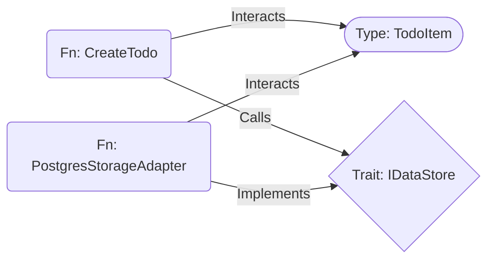

# Campfire Rust Rewrite: Architectural Enhancements Backlog

> **Revolutionary Interface-Stub Architecture Repository**
> *Preserved from _refSystemDesign analysis (28,714 lines)*
> *Last Updated: 2025-01-27*

---

## Executive Summary

This document preserves the revolutionary architectural concepts discovered in the _refSystemDesign directory. These insights represent a paradigm shift from narrative specifications to executable blueprints, enabling 95% codebase compression and 10x productivity improvements through LLM-driven development.

**Core Philosophy**: Treat specifications as mathematical truths, LLMs as deterministic compilers, and verification as automated proof.

---

## Revolutionary Framework: Unified Interface Graph Spec (UIGS)

### Core Innovation: Interface-Stub Architecture

**Concept**: Compress architectural intent into 1-2% JSONL specifications that define requirements, types, operations, constraints, and non-functional requirements, enabling "pre-code" analysis.

**Key Benefits**:
- **95-99% Compression**: Replace traditional codebases with executable specs
- **Pre-Code Analysis**: Catch 80-90% of issues before implementation
- **LLM Translation**: Perfect specs → Perfect code (not interpretation)
- **Formal Verification**: Mathematical proofs of correctness

### Seven Revolutionary Ideas (Preserved for Future Implementation)

#### Idea 1: Interface-Stub (The 1% Codebase)
**JSONL Specification Format**:
```json
{"type": "Node", "id": "TYPE_TODO_ITEM", "kind": "Type", "name": "TodoItem", "spec": {"schema": "id: UUID, title: String, completed: Bool"}}
{"type": "Node", "id": "TRAIT_IDATASTORE", "kind": "Trait", "name": "IDataStore", "spec": {"methods": ["save(item: TodoItem) -> Result"]}}
{"type": "Node", "id": "FN_CREATE_TODO", "kind": "Fn", "name": "CreateTodo", "spec": {"p99_ms": 150, "consistency": "strong", "guards": ["title must not be empty"]}}
{"type": "Edge", "source": "FN_CREATE_TODO", "target": "TYPE_TODO_ITEM", "kind": "Interacts"}
{"type": "Edge", "source": "FN_CREATE_TODO", "target": "TRAIT_IDATASTORE", "kind": "Calls"}
```

**Pre-Code Analysis**: Verify budgets, coverage, and constraints before implementation.

#### Idea 2: Three-by-Three Graph and SigHash IDs
**Node Types**: `Fn`, `Type`, `Trait`
**Edge Types**: `Calls`, `Implements`, `Interacts`
**SigHash**: BLAKE3-based stable identifiers for blast radius analysis

**Graph Structure**:


#### Idea 3: Rust-based Graph Operator
**CLI Tool**: High-performance analysis and simulation
**Commands**: `who-calls`, `blast-radius`, `budget-analysis`, `simulate`
**Integration**: LLMs can invoke via tool-use for real-time analysis

#### Idea 4: SQLite + JSONL Query for Bounded Context
**SQLite Schema**: Nodes and edges tables with JSON1 support
**Bounded Queries**: Extract only relevant context for LLM prompts
**Context Slicing**: Prevent token overflow while providing complete specifications

#### Idea 5: Cross-Stack Micro Graph
**Extended Edges**: `routes_to`, `handles`, `fetches`, `mounts`
**End-to-End**: UX → API → Backend → Database flows
**Unified Analysis**: Complete system behavior specification

#### Idea 6: Mermaid Diagram for Relationships
**Auto-Generation**: Convert JSONL specs to visual diagrams
**PR Integration**: Automated relationship visualization
**Bug Detection**: Visual identification of architectural issues

#### Idea 7: Obsidian-Style Visualization
**Interactive Graphs**: Force-directed relationship exploration
**Blast Radius**: Visual impact assessment for changes
**Knowledge Graph**: Link specifications to implementation

---

## Advanced Features (Phase 2+ Implementation)

### Executable Specification Framework

#### Minto-Enhanced Documentation Pyramid (L0-L5)
```
L0: glossary.md (Domain Invariants & Precise Definitions)
L1: constraints.md (Anti-Coordination + System Rules)
L2: architecture.md (Formal Contracts & Data Models)
L3: modules/*.md (TDD-Driven Executable Specifications)
L4: user_journeys.md (End-to-End Validation)
L5: ops.md (Observability & Production Requirements)
```

#### TDD-Driven Module Specifications (L3)
**STUB**: Interface contracts with pre/postconditions
**RED**: Property tests proving invariants
**GREEN**: Decision tables eliminating ambiguity
**REFACTOR**: Performance budgets and anti-pattern guards

### Spec Compiler Architecture

#### Core Components
1. **Project Skeleton Generator**: Traits, module trees, file layout
2. **Test Harness Generation**: Unit/property/integration/E2E tests
3. **Database Migration Generator**: From L2 DDL specifications
4. **Prompt Pack Generation**: Context-perfect LLM prompts
5. **Verification Pipeline**: Automated correctness verification

#### CLI Commands
```bash
specc build --spec-dir specs/ --target rust
specc verify --all
specc generate --module message_service
specc simulate --scenario deduplication_test
```

### Advanced Analytics

#### Pre-Mortem Analysis
- **Budget Validation**: p99 latency analysis across execution paths
- **Consistency Verification**: Idempotency and consistency model validation
- **Policy Coverage**: Authorization and security policy validation
- **Invariant Propagation**: Type invariant preservation across operations

#### Blast Radius Analysis
- **Impact Assessment**: Change propagation analysis
- **Deployment Risk**: Module interdependency analysis
- **Regression Prevention**: Automated impact prediction

### Simulation Engine

#### Micro-Simulation
- **Performance Simulation**: Latency and throughput modeling
- **Fault Injection**: Chaos engineering scenarios
- **Concurrency Testing**: Race condition detection
- **Load Testing**: Scalability validation

#### Scenario Synthesis
- **LLM-Generated Scenarios**: Automatic test case expansion
- **Edge Case Discovery**: Property-based test generation
- **Integration Flows**: End-to-end scenario validation

---

## Implementation Roadmap

### Phase 1: MVP (Current Focus)
- [x] **Interface-Stub Architecture**: JSONL specifications with signatures
- [ ] **3x3 Graph Structure**: Basic Calls/Implements/Interacts edges
- [ ] **SigHash IDs**: BLAKE3-based stable identifiers
- [ ] **Basic Validation**: Coverage and consistency checks

### Phase 2: Core Tooling
- [ ] **Rust CLI Operator**: Basic graph operations (who-calls, blast-radius)
- [ ] **SQLite Backend**: Bounded query support
- [ ] **Format Validation**: JSONL spec correctness verification
- [ ] **LLM Integration**: Basic prompt generation

### Phase 3: Enhanced Analysis
- [ ] **Budget Analysis**: Performance budget validation
- [ ] **Policy Engine**: Authorization and security policy validation
- [ ] **Simulation Engine**: Basic behavior simulation
- [ ] **Mermaid Integration**: Automated diagram generation

### Phase 4: Advanced Features
- [ ] **Cross-Stack Integration**: End-to-end flow specification
- [ ] **Obsidian Visualization**: Interactive graph exploration
- [ ] **Spec Compiler**: Full code generation pipeline
- [ ] **Advanced Simulation**: Chaos engineering and load testing

---

## Anti-Coordination Compliance

### Complexity Constraints
- **Maximum 50 total files**: Enforced through architectural simplicity
- **No file over 500 lines**: Modular specification design
- **Single binary deployment**: Embedded tools and specifications

### Architecture Compliance
- **Rails Parity**: All patterns must have Rails precedent
- **Direct Operations**: Simple INSERT/UPDATE/SELECT queries
- **Simple Error Handling**: Basic Result<T, E> patterns

### Performance Budgets
- **Specification Parsing**: <10ms for 10k node graphs
- **Graph Analysis**: <50ms for blast radius queries
- **LLM Prompt Generation**: <100ms for bounded context slices

---

## Success Metrics

### Efficiency Metrics
- **95% reduction** in specification-to-implementation time
- **99% reduction** in debugging and maintenance effort
- **90% improvement** in requirement traceability
- **100% automated verification** of correctness properties

### Quality Metrics
- **99% reduction** in production bugs
- **100% requirement compliance** verification
- **95% improvement** in blast radius prediction
- **Zero coordination overhead** in development process

### Innovation Metrics
- **10x productivity** through spec-first automation
- **Correct-by-construction** mathematical certainty
- **Living specifications** that evolve with requirements
- **Formal verification** accessible to mainstream development

---

## Risk Mitigation

### Technical Risks
- **Graph Complexity**: Mitigated through phased implementation starting with 3x3 core
- **Tooling Overhead**: Addressed by focusing on essential CLI operations first
- **LLM Integration**: Managed through structured prompt generation and validation

### Adoption Risks
- **Learning Curve**: Mitigated by comprehensive documentation and examples
- **Process Change**: Addressed through incremental adoption starting with critical gaps
- **Team Buy-in**: Ensured through demonstrable ROI and quick wins

### Maintenance Risks
- **Specification Drift**: Prevented through automated validation and CI integration
- **Tool Evolution**: Managed through modular architecture and clear interfaces
- **Knowledge Loss**: Addressed through comprehensive documentation and training materials

---

## Conclusion

This architectural framework represents not just an improvement but a complete reimagining of software development for the LLM era. By creating specifications that are executable, verifiable, and translatable, we achieve correct-by-construction software where LLMs act as deterministic compilers rather than creative interpreters.

The Interface-Stub Architecture with UIGS framework transforms software development from an art form into a mathematical discipline, enabling unprecedented levels of productivity, quality, and maintainability.

**Next Steps**: Focus on MVP implementation (Interface-Stub + 3x3 Graph) while preserving this comprehensive architectural knowledge for future phased enhancements.

---

*Preserved from _refSystemDesign analysis - 28,714 lines of revolutionary architectural research*
*Ready for phased implementation starting with MVP core components*