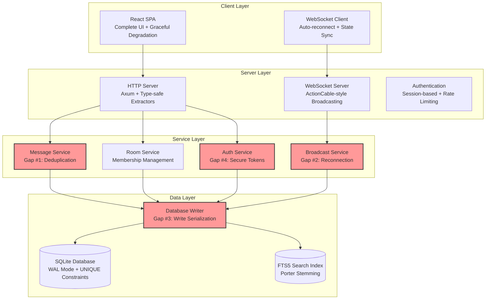
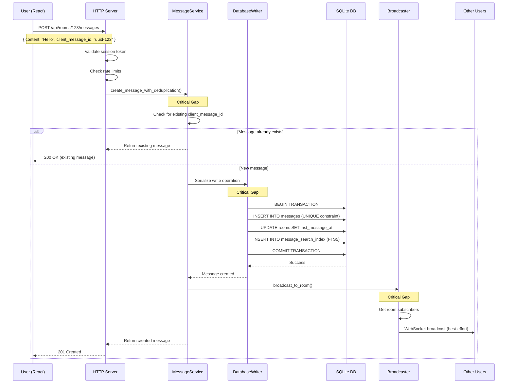
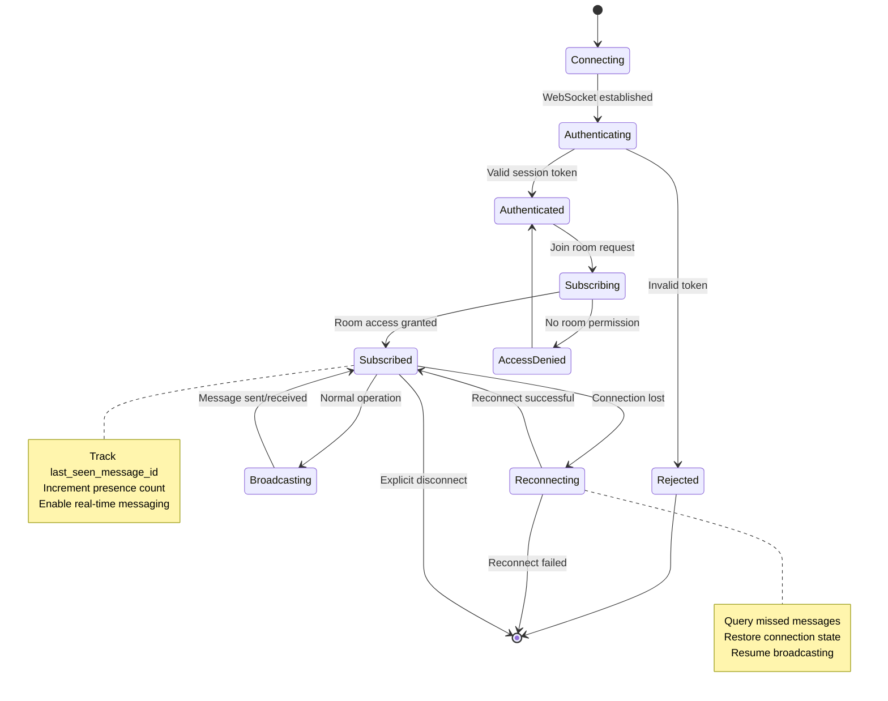

# Campfire Rust Rewrite - Architecture Document

## System Architecture Overview

This document defines the high-level system architecture for the Campfire Rust rewrite, implementing the requirements and constraints defined in `requirements.md`.

### Architecture Philosophy

**Rails-Inspired Pragmatic Architecture**: Build a simple, working chat application that replicates Rails behavior without coordination complexity.

**Core Principles**:
- **Anti-Coordination**: Direct function calls, no async coordination between components
- **Rails Parity**: Replicate Rails ActionCable behavior exactly, don't improve it
- **Simple Patterns**: Use proven Rails patterns implemented in idiomatic Rust
- **Evidence-Based**: Add complexity only when Rails proves it's necessary

### System Components & Data Flow

**High-Level System Architecture**:


**Complete Message Creation Data Flow**:


**WebSocket Connection Lifecycle**:


### Critical Gap Solutions Architecture

#### Gap #1: Message Deduplication
```
Client Request → MessageService → Database Writer → SQLite UNIQUE Constraint
                                      ↓
                              Handle Violation → Return Existing Message
```

#### Gap #2: WebSocket Reconnection
```
Client Reconnect → BroadcastService → Query Missed Messages → Send to Client
                        ↓
                 Track last_seen_message_id per connection
```

#### Gap #3: Write Serialization
```
Multiple Writers → mpsc Channel → Single Writer Task → SQLite
                                       ↓
                              Serialize all write operations
```

#### Gap #4: Session Security
```
Login Request → AuthService → Generate Secure Token → Store in Database
                                    ↓
                            32+ char alphanumeric (Rails equivalent)
```

#### Gap #5: Presence Tracking
```
WebSocket Connect → Increment Counter → Store with TTL
WebSocket Disconnect → Decrement Counter → Cleanup if zero
Heartbeat Timer → Clean stale connections (60s TTL)
```

### Data Flow Architecture

#### Message Creation Flow
```
1. Client sends message with client_message_id
2. HTTP handler validates request
3. MessageService checks for existing message (Gap #1)
4. DatabaseWriter serializes write operation (Gap #3)
5. SQLite stores message with UNIQUE constraint
6. BroadcastService sends to room subscribers (Gap #2)
7. FTS5 index updated for search
```

#### Real-time Communication Flow
```
1. Client establishes WebSocket connection
2. AuthService validates session (Gap #4)
3. BroadcastService tracks connection state
4. PresenceService increments user count (Gap #5)
5. Message broadcasts sent to active connections
6. Reconnection delivers missed messages (Gap #2)
```

### Component Relationships

**Service Dependencies** (following Rails service object pattern):
- MessageService → DatabaseWriter, BroadcastService
- RoomService → DatabaseWriter, BroadcastService  
- AuthService → DatabaseWriter
- BroadcastService → DatabaseWriter (for connection state)

**Data Dependencies**:
- All services use single SQLite database
- FTS5 index for message search
- Session storage in database
- Connection state tracking in memory

### Deployment Architecture

**Single Binary Deployment**:
- Embedded React SPA (rust-embed)
- SQLite database in mounted volume
- No orchestration or service discovery
- Simple environment configuration

**⚠️ Critical Database Rule**: Database files NEVER in container images - always in mounted volumes for persistence.

---

## Project Structure Overview

### Simplified Directory Organization (~50 files)

```
campfire-on-rust/
├── 📁 Root Configuration
│   ├── Cargo.toml                    # Rust project configuration
│   ├── README.md                     # Project documentation
│   ├── .env.example                  # Environment variables template
│   └── docker-compose.yml            # Development environment
│
├── 🦀 src/ (Backend - 35 files)      # Rails-inspired Rust server
│   ├── main.rs                       # Application entry point
│   ├── lib.rs                        # Library exports
│   │
│   ├── 📁 models/ (5 files)          # Domain models
│   │   ├── message.rs                # Message with rich content
│   │   ├── room.rs                   # Room types (Open/Closed/Direct)
│   │   ├── user.rs                   # User authentication
│   │   ├── session.rs                # Session management
│   │   └── mod.rs                    # Model exports
│   │
│   ├── 📁 database/ (3 files)        # Direct SQLite operations
│   │   ├── connection.rs             # Connection pool
│   │   ├── migrations.rs             # Schema migrations
│   │   └── mod.rs                    # Database exports
│   │
│   ├── 📁 handlers/ (8 files)        # HTTP API endpoints
│   │   ├── messages.rs               # Message CRUD API
│   │   ├── rooms.rs                  # Room management
│   │   ├── users.rs                  # User management
│   │   ├── auth.rs                   # Authentication
│   │   ├── websocket.rs              # WebSocket upgrade
│   │   ├── health.rs                 # Health checks
│   │   ├── assets.rs                 # Static assets
│   │   └── mod.rs                    # Handler exports
│   │
│   ├── 📁 websocket/ (2 files)       # ActionCable-style broadcasting
│   │   ├── broadcaster.rs            # Room-based broadcasting
│   │   └── mod.rs                    # WebSocket exports
│   │
│   ├── 📁 services/ (6 files)        # Business logic (Rails-style)
│   │   ├── message_service.rs        # Message processing
│   │   ├── room_service.rs           # Room management
│   │   ├── auth_service.rs           # Authentication logic
│   │   ├── notification_service.rs   # Push notifications
│   │   ├── webhook_service.rs        # Bot webhooks
│   │   └── mod.rs                    # Service exports
│   │
│   ├── 📁 middleware/ (5 files)      # HTTP middleware
│   │   ├── auth.rs                   # Authentication
│   │   ├── cors.rs                   # CORS headers
│   │   ├── logging.rs                # Request logging
│   │   ├── rate_limit.rs             # Rate limiting
│   │   └── mod.rs                    # Middleware exports
│   │
│   ├── 📁 assets/ (3 files)          # Asset embedding
│   │   ├── embedded.rs               # Rust-embed integration
│   │   ├── sounds.rs                 # Sound command handling
│   │   └── mod.rs                    # Asset exports
│   │
│   └── 📁 utils/ (3 files)           # Utilities
│       ├── validation.rs             # Input validation
│       ├── config.rs                 # Configuration
│       └── mod.rs                    # Utility exports
│
├── ⚛️ frontend/ (React - 15 files)   # Simple React frontend
│   ├── package.json                  # Dependencies (simplified)
│   ├── vite.config.ts                # Build configuration
│   ├── index.html                    # Entry point
│   │
│   └── 📁 src/
│       ├── main.tsx                  # React entry point
│       ├── App.tsx                   # Root component
│       │
│       ├── 📁 components/ (8 files)  # UI components
│       │   ├── MessageList.tsx       # Message display
│       │   ├── MessageComposer.tsx   # Message input
│       │   ├── RoomList.tsx          # Room navigation
│       │   ├── UserList.tsx          # Member list
│       │   ├── LoginForm.tsx         # Authentication
│       │   ├── Layout.tsx            # App layout
│       │   ├── ErrorBoundary.tsx     # Error handling
│       │   └── LoadingSpinner.tsx    # Loading states
│       │
│       ├── 📁 hooks/ (3 files)       # Custom hooks
│       │   ├── useWebSocket.ts       # WebSocket connection
│       │   ├── useAuth.ts            # Authentication state
│       │   └── useMessages.ts        # Message state
│       │
│       ├── 📁 services/ (2 files)    # API services
│       │   ├── api.ts                # HTTP client
│       │   └── websocket.ts          # WebSocket service
│       │
│       └── 📁 types/ (2 files)       # TypeScript types
│           ├── api.ts                # API types
│           └── models.ts             # Domain types
│
├── 🎨 assets/ (164 files)            # Original Campfire assets
│   ├── 📁 images/ (79 SVG files)     # Complete UI icons
│   ├── 📁 sounds/ (59 MP3 files)     # /play command sounds
│   └── 📁 stylesheets/ (26 CSS)      # Complete styling
│
├── 🗄️ migrations/ (4 files)          # Database schema
│   ├── 001_initial_schema.sql        # Core tables
│   ├── 002_add_fts_search.sql        # Full-text search
│   ├── 003_add_sessions.sql          # Session management
│   └── 004_add_webhooks.sql          # Bot integration
│
├── 🧪 tests/ (10 files)              # Test suite
│   ├── 📁 unit/ (5 files)            # Unit tests
│   ├── 📁 integration/ (3 files)     # Integration tests
│   └── 📁 fixtures/ (2 files)        # Test data
│
└── 🐳 docker/ (2 files)              # Deployment
    ├── Dockerfile                    # Production container
    └── docker-compose.yml            # Development setup
```

### Key Architectural Decisions

#### **Simplification Strategy**
- **75% File Reduction**: 50 files vs 200+ in coordination approach
- **No Coordination Layer**: Direct operations instead of complex coordination
- **Rails-Inspired Patterns**: Proven ActionCable and ActiveRecord equivalents
- **Linear Dependencies**: Simple dependency chain instead of coordination web

#### **Rails Compatibility Focus**
- **ActionCable Broadcasting**: Room-based WebSocket channels
- **Service Objects**: Rails-style business logic organization
- **Direct Database Operations**: ActiveRecord-equivalent queries
- **Middleware Stack**: Rails-style request processing

---

## Architecture Overview: TDD-Driven "Rails-Equivalent Imperfection" Strategy 🎯

### Philosophy: Interface Contracts Before Implementation

**TDD-First Methodology**: Define complete function signatures, type contracts, and property tests before writing any implementation code. This ensures one-shot correctness by designing the complete interface surface area first.

**Core TDD Principles**:
1. **Type Contracts First**: Every function signature must be complete with input/output types and error cases
2. **Property-Based Specifications**: Define behavior through property tests that specify invariants
3. **Integration Contracts**: Define service boundaries and interaction patterns before implementation
4. **Implementation Follows Types**: Type-guided implementation prevents coordination complexity
5. **Comprehensive Validation**: Property tests validate that implementation matches specifications

**Rails Parity Insight**: Rails proves that chat applications work reliably with simple patterns. This architecture replicates Rails behavior in Rust using type-driven design to prevent coordination complexity at compile time.

### TDD Development Methodology

```
TYPE CONTRACTS → PROPERTY TESTS → INTEGRATION CONTRACTS → IMPLEMENTATION → VALIDATION
       ↓               ↓                    ↓                  ↓             ↓
   Complete        Behavior           Service            Type-Guided    Comprehensive
   Interface       Properties         Boundaries         Implementation    Testing
   Design          Specification      Definition         Following         Validation
                                                        Contracts
```

**Function Signature Philosophy**: Every function must specify:
- **Complete Input Types**: Exact parameter types with validation constraints
- **Complete Output Types**: Full Result<T, E> with all error cases enumerated
- **Behavior Contract**: Precise specification of what the function promises to do
- **Side Effects**: Complete documentation of external state changes
- **Property Invariants**: Mathematical properties that must hold across all inputs

### Advanced TDD Patterns for Campfire

#### 1. Type-Driven Domain Modeling

```rust
// Phase 1: Complete type contracts before any implementation
pub trait MessageService: Send + Sync {
    type Error: std::error::Error + Send + Sync + 'static;
    
    /// Creates a message with automatic deduplication based on client_message_id
    /// 
    /// # Properties
    /// - Same client_message_id always returns the same Message
    /// - Message is atomically created and indexed for search
    /// - Broadcast occurs after successful database commit
    /// - Room last_message_at is updated atomically
    async fn create_message_with_deduplication(
        &self,
        data: CreateMessageData,
    ) -> Result<DeduplicatedMessage<Verified>, Self::Error>;
    
    /// Retrieves messages created after the specified message ID
    /// 
    /// # Properties  
    /// - Results are always in chronological order (created_at ASC, id ASC)
    /// - Only returns messages from rooms user has access to
    /// - Pagination is consistent across calls
    /// - Respects user's involvement level (invisible/nothing/mentions/everything)
    async fn get_messages_since(
        &self,
        room_id: RoomId,
        since_id: MessageId,
        user_id: UserId,
    ) -> Result<Vec<Message>, Self::Error>;
    
    /// Searches messages using FTS5 with Porter stemming
    /// 
    /// # Properties
    /// - Search results respect room access permissions
    /// - Results are ranked by relevance (FTS5 rank)
    /// - Query is sanitized to prevent FTS5 injection
    /// - Only searches rooms where user has non-invisible involvement
    async fn search_messages(
        &self,
        query: SearchQuery,
    ) -> Result<SearchResults, Self::Error>;
}

// Phase 2: Property-based test specifications
#[cfg(test)]
mod message_service_properties {
    use proptest::prelude::*;
    
    proptest! {
        #[test]
        fn duplicate_client_message_ids_return_same_message(
            room_id in any::<RoomId>(),
            client_id in any::<Uuid>(),
            content1 in ".*",
            content2 in ".*",
            user_id in any::<UserId>()
        ) {
            let rt = tokio::runtime::Runtime::new().unwrap();
            rt.block_on(async {
                let service = create_test_message_service().await;
                
                let data1 = CreateMessageData {
                    room_id,
                    creator_id: user_id,
                    body: content1,
                    client_message_id: client_id,
                };
                
                let data2 = CreateMessageData {
                    room_id,
                    creator_id: user_id,
                    body: content2, // Different content
                    client_message_id: client_id, // Same client ID
                };
                
                let msg1 = service.create_message_with_deduplication(data1).await.unwrap();
                let msg2 = service.create_message_with_deduplication(data2).await.unwrap();
                
                // Property: Same client_message_id always returns same Message
                prop_assert_eq!(msg1.inner.id, msg2.inner.id);
                prop_assert_eq!(msg1.inner.body, msg2.inner.body); // Original content preserved
                prop_assert_eq!(msg1.inner.client_message_id, msg2.inner.client_message_id);
            });
        }
        
        #[test]
        fn messages_since_maintains_chronological_order(
            room_id in any::<RoomId>(),
            message_count in 2..20usize,
            user_id in any::<UserId>()
        ) {
            let rt = tokio::runtime::Runtime::new().unwrap();
            rt.block_on(async {
                let service = create_test_message_service().await;
                
                // Create messages in sequence with small delays
                let mut message_ids = Vec::new();
                for i in 0..message_count {
                    let data = CreateMessageData {
                        room_id,
                        creator_id: user_id,
                        body: format!("Message {}", i),
                        client_message_id: Uuid::new_v4(),
                    };
                    let msg = service.create_message_with_deduplication(data).await.unwrap();
                    message_ids.push(msg.inner.id);
                    
                    // Small delay to ensure different timestamps
                    tokio::time::sleep(Duration::from_millis(1)).await;
                }
                
                // Get messages since first message
                let since_id = message_ids[0];
                let messages = service.get_messages_since(room_id, since_id, user_id).await.unwrap();
                
                // Property: Messages returned in chronological order
                for window in messages.windows(2) {
                    let earlier = &window[0];
                    let later = &window[1];
                    
                    // Primary sort: created_at
                    prop_assert!(earlier.created_at <= later.created_at);
                    
                    // Secondary sort: id (for same timestamp)
                    if earlier.created_at == later.created_at {
                        prop_assert!(earlier.id < later.id);
                    }
                }
            });
        }
        
        #[test]
        fn search_respects_room_access_permissions(
            query in "[a-zA-Z ]{1,50}",
            user_id in any::<UserId>(),
            accessible_rooms in prop::collection::vec(any::<RoomId>(), 1..5),
            inaccessible_rooms in prop::collection::vec(any::<RoomId>(), 1..5)
        ) {
            let rt = tokio::runtime::Runtime::new().unwrap();
            rt.block_on(async {
                let service = create_test_message_service().await;
                
                // Create messages in accessible rooms
                for room_id in &accessible_rooms {
                    setup_room_access(user_id, *room_id, Involvement::Everything).await;
                    create_test_message(*room_id, &query).await;
                }
                
                // Create messages in inaccessible rooms
                for room_id in &inaccessible_rooms {
                    setup_room_access(user_id, *room_id, Involvement::Invisible).await;
                    create_test_message(*room_id, &query).await;
                }
                
                let search_query = SearchQuery {
                    query: query.clone(),
                    user_id,
                    room_id: None, // Search all rooms
                    limit: 100,
                };
                
                let results = service.search_messages(search_query).await.unwrap();
                
                // Property: Search results only include accessible rooms
                for result in results.messages {
                    prop_assert!(accessible_rooms.contains(&result.room_id));
                    prop_assert!(!inaccessible_rooms.contains(&result.room_id));
                }
            });
        }
    }
}
```

#### 2. WebSocket Connection State Machine

```rust
// Type-safe WebSocket connection states
pub struct WebSocketConnection<State> {
    id: ConnectionId,
    user_id: UserId,
    sender: mpsc::UnboundedSender<WebSocketMessage>,
    _state: PhantomData<State>,
}

pub struct Connected;
pub struct Authenticated { user_id: UserId }
pub struct Subscribed { room_id: RoomId }
pub struct Reconnecting { last_seen: MessageId }

// State transitions enforced by type system
impl WebSocketConnection<Connected> {
    pub fn authenticate(self, user_id: UserId) -> WebSocketConnection<Authenticated> {
        WebSocketConnection {
            id: self.id,
            user_id,
            sender: self.sender,
            _state: PhantomData,
        }
    }
}

impl WebSocketConnection<Authenticated> {
    pub async fn subscribe_to_room(
        self, 
        room_id: RoomId,
        broadcaster: &WebSocketBroadcaster,
    ) -> Result<WebSocketConnection<Subscribed>, SubscriptionError> {
        // Verify room access
        broadcaster.verify_room_access(self.user_id, room_id).await?;
        
        // Add to room subscribers
        broadcaster.add_subscriber(room_id, self.id).await;
        
        Ok(WebSocketConnection {
            id: self.id,
            user_id: self.user_id,
            sender: self.sender,
            _state: PhantomData,
        })
    }
}

impl WebSocketConnection<Subscribed> {
    pub fn handle_disconnect(self, last_seen: MessageId) -> WebSocketConnection<Reconnecting> {
        WebSocketConnection {
            id: self.id,
            user_id: self.user_id,
            sender: self.sender,
            _state: PhantomData,
        }
    }
    
    pub async fn send_message(&self, message: &WebSocketMessage) -> Result<(), SendError> {
        self.sender.send(message.clone())
            .map_err(|_| SendError::ConnectionClosed)
    }
}

impl WebSocketConnection<Reconnecting> {
    pub async fn send_missed_messages(
        self,
        message_service: &dyn MessageService,
    ) -> Result<WebSocketConnection<Subscribed>, ReconnectionError> {
        // Get missed messages since last_seen
        let missed_messages = message_service
            .get_messages_since(self.room_id, self.last_seen, self.user_id)
            .await?;
        
        // Send missed messages
        for message in missed_messages {
            let ws_message = WebSocketMessage::MessageCreated { message };
            self.send_message(&ws_message).await?;
        }
        
        // Transition back to subscribed state
        Ok(WebSocketConnection {
            id: self.id,
            user_id: self.user_id,
            sender: self.sender,
            _state: PhantomData,
        })
    }
}
```

#### 3. Actor Pattern for Write Serialization

```rust
// Database writer actor with message passing
pub struct DatabaseWriter {
    sender: mpsc::UnboundedSender<WriteCommand>,
}

#[derive(Debug)]
pub enum WriteCommand {
    CreateMessage {
        data: CreateMessageData,
        reply: oneshot::Sender<Result<Message, MessageError>>,
    },
    UpdateMessage {
        id: MessageId,
        data: UpdateMessageData,
        reply: oneshot::Sender<Result<Message, MessageError>>,
    },
    CreateUser {
        data: CreateUserData,
        reply: oneshot::Sender<Result<User, UserError>>,
    },
    CreateRoom {
        data: CreateRoomData,
        reply: oneshot::Sender<Result<Room, RoomError>>,
    },
}

impl DatabaseWriter {
    pub fn new(pool: SqlitePool) -> Self {
        let (sender, mut receiver) = mpsc::unbounded_channel();
        
        // Single writer task - no coordination needed
        tokio::spawn(async move {
            while let Some(command) = receiver.recv().await {
                match command {
                    WriteCommand::CreateMessage { data, reply } => {
                        let result = Self::execute_create_message(&pool, data).await;
                        let _ = reply.send(result);
                    }
                    WriteCommand::UpdateMessage { id, data, reply } => {
                        let result = Self::execute_update_message(&pool, id, data).await;
                        let _ = reply.send(result);
                    }
                    WriteCommand::CreateUser { data, reply } => {
                        let result = Self::execute_create_user(&pool, data).await;
                        let _ = reply.send(result);
                    }
                    WriteCommand::CreateRoom { data, reply } => {
                        let result = Self::execute_create_room(&pool, data).await;
                        let _ = reply.send(result);
                    }
                }
            }
        });
        
        Self { sender }
    }
    
    pub async fn create_message(&self, data: CreateMessageData) -> Result<Message, MessageError> {
        let (reply_tx, reply_rx) = oneshot::channel();
        
        self.sender.send(WriteCommand::CreateMessage { data, reply: reply_tx })
            .map_err(|_| MessageError::WriterUnavailable)?;
            
        reply_rx.await
            .map_err(|_| MessageError::WriterUnavailable)?
    }
}
```

### Core Architecture
```
┌─────────────────────────────────────────────────────────────┐
│                Single Rust Binary (~25MB)                   │
├─────────────────────────────────────────────────────────────┤
│  Complete React UI (Rails Parity)                          │
│  ├─── All Components (File Upload, Lightbox, Avatars)      │
│  ├─── Complete CSS/Styling (26 stylesheets)                │
│  ├─── Sound Assets (59 MP3 files)                          │
│  ├─── Graceful Degradation (Disabled Features)             │
│  ├─── Simple State Management (No Cross-Tab Coordination)  │
│  └─── Service Worker (PWA, Push Notifications)             │
├─────────────────────────────────────────────────────────────┤
│  Axum Web Server (HTTP + WebSocket)                        │
│  ├─── REST API Handlers (Rails-style routing)             │
│  ├─── ActionCable-Inspired WebSocket Broadcasting          │
│  ├─── Rails-Style Session Authentication                   │
│  └─── Basic Security Middleware                            │
├─────────────────────────────────────────────────────────────┤
│  Simple Real-time Layer                                    │
│  ├─── Direct Message Broadcasting (Rails ActionCable)      │
│  ├─── Basic Presence Tracking (Simple counters)           │
│  ├─── Simple Typing Notifications                          │
│  └─── Feature Flag Support (Static Configuration)          │
├─────────────────────────────────────────────────────────────┤
│  Basic Task Processing                                      │
│  ├─── Async Webhook Delivery                               │
│  ├─── Push Notification Sending                            │
│  └─── Simple Background Tasks                              │
├─────────────────────────────────────────────────────────────┤
│  Direct SQLite Operations (10-200MB)                       │
│  ├─── Write-Ahead Logging (WAL) Mode                      │
│  ├─── Direct Database Queries (No Coordination Layer)      │
│  ├─── FTS5 Search Index (Simple Updates)                  │
│  ├─── Basic Connection Pooling                             │
│  └─── Rails-Compatible Schema                              │
└─────────────────────────────────────────────────────────────┘
```

### Technical Stack with TDD-First Patterns

#### Backend: Rust with Compile-First Success
- **Web Framework**: Axum with type-safe extractors and comprehensive error handling
- **Database**: SQLite with sqlx compile-time query validation and Dedicated Writer Task pattern
- **Real-time**: ActionCable-inspired WebSocket with Actor pattern for connection management
- **Concurrency**: Structured concurrency with tokio JoinSet and message-passing actors
- **Error Handling**: thiserror for library errors, anyhow for application context
- **Type Safety**: Newtype pattern for all IDs, making invalid states unrepresentable
- **Authentication**: JWT with secure session management and rate limiting
- **Testing**: Property-based testing with proptest, integration tests with real SQLite

#### Frontend: React with Modern Patterns
- **Component Architecture**: Functional components with custom hooks for logic separation
- **State Management**: TanStack Query for server state, Zustand for client state
- **Error Handling**: Error boundaries with graceful fallback components
- **Real-time**: WebSocket integration with automatic reconnection and optimistic updates
- **Testing**: React Testing Library with comprehensive component and hook testing
- **Performance**: Strategic memoization and virtual scrolling for large lists
- **Type Safety**: TypeScript with strict mode and comprehensive type definitions

---

## Simple Rails-Inspired Patterns

**Based on Strategic Pivot**: The architecture has been simplified to use proven Rails patterns rather than complex coordination mechanisms.

### 1. Simple Message Flow
```
Client                    API Handler              Database                WebSocket
  │                        │                        │                       │
  ├─ Send Message ────────▶│                        │                       │
  │  (basic HTTP POST)     │                        │                       │
  │                        │                        │                       │
  ├─ Optimistic UI ────────┤                        │                       │
  │  (show pending)        │                        │                       │
  │                        │                        │                       │
  │                        ├─ Insert Message ─────▶│                       │
  │                        │  (simple SQL INSERT)   │                       │
  │                        │                        │                       │
  │                        ├─ Broadcast Message ───────────────────────────▶│
  │                        │  (ActionCable-style)   │                       │
  │                        │                        │                       │
  ├─ Receive Broadcast ◀───────────────────────────────────────────────────┤
  │  (WebSocket message)   │                        │                       │
```

### 2. Rails-Style State Management
- **Direct Database Operations**: Simple SQL queries, no coordination layer
- **ActionCable-Style Broadcasting**: Room-based WebSocket channels like Rails
- **Basic Presence Tracking**: Simple connection counting without complex coordination
- **Simple Session Management**: Rails-style session cookies and authentication
- **Straightforward Error Handling**: Basic error responses, no complex recovery

### 3. Database Patterns
- **Direct SQLite Operations**: No coordination layer, direct SQL queries
- **WAL Mode**: Simple write-ahead logging for basic concurrency
- **FTS5 Search**: Direct search queries, no async coordination
- **Connection Pooling**: Basic SQLite connection pool

### 4. Real-time Architecture
- **Room Channels**: ActionCable-inspired room-based broadcasting
- **Simple Presence**: Basic online/offline tracking
- **Typing Notifications**: Simple start/stop notifications
- **Message Broadcasting**: Direct WebSocket sends to room subscribers

### 5. Basic Reliability Patterns
- **Simple Retry**: Basic retry logic for failed operations
- **Error Logging**: Log errors for debugging, no complex recovery
- **Health Checks**: Basic /health endpoint
- **Graceful Shutdown**: Clean server shutdown handling

---

## Feature Scope

### ✅ **Fully Implemented (Complete UX):**
- Complete React UI with all components
- Rich text messaging with Trix editor
- Real-time chat with full presence system
- @mentions with autocomplete
- Sound commands with embedded audio
- Unicode emoji support
- Complete room management UI
- User presence and typing indicators
- Full search functionality
- Bot integration (text responses)
- PWA support and push notifications
- Multi-device session management with QR codes

### 🚧 **Gracefully Disabled (UI Present, Backend Stubbed):**
- File upload zones (show "Coming in v2.0" message)
- Avatar upload areas (text initials with placeholder)
- Image lightbox (ready for images, shows upgrade prompt)
- Document sharing (upload UI present but disabled)
- OpenGraph previews (links shown as text with "Preview coming soon")

---

## Data Volume Analysis

### Small Team (25 users)
```
Users: 25 × 0.5KB = 12.5KB
Messages: 10,000 × 0.8KB = 8MB
Rich Text: 2,000 × 1KB = 2MB
FTS5 Index: ~2.5MB
Total Database: ~12.5MB
Total Storage: ~12.5MB (no files!)
```

### Large Team (500 users)
```
Users: 500 × 0.5KB = 250KB
Messages: 250,000 × 0.8KB = 200MB
Rich Text: 50,000 × 1KB = 50MB
FTS5 Index: ~62.5MB
Total Database: ~314MB
Total Storage: ~314MB
```

---

## Deployment Architecture

### Container Image
```dockerfile
# Complete UI Container (No Database!)
FROM alpine:latest
RUN apk add --no-cache ca-certificates curl
COPY campfire-on-rust /usr/local/bin/campfire-on-rust
EXPOSE $PORT
CMD ["/usr/local/bin/campfire-on-rust"]
```

### Feature Flag Configuration
```rust
// Configuration with feature flags
#[derive(Debug, Clone)]
pub struct AppConfig {
    pub files_enabled: bool,        // v1.0: false
    pub avatars_enabled: bool,      // v1.0: false
    pub opengraph_enabled: bool,    // v1.0: false
    pub max_file_size: usize,       // v1.0: 0
}
```

### Environment Variables
```bash
# Core Configuration
DATABASE_PATH=/app/data/campfire.db
SECRET_KEY_BASE=your-secret-key
VAPID_PUBLIC_KEY=your-vapid-public-key
VAPID_PRIVATE_KEY=your-vapid-private-key

# Feature Flags (MVP Phase 1)
FILES_ENABLED=false
AVATARS_ENABLED=false
OPENGRAPH_ENABLED=false

# Optional Configuration
SSL_DOMAIN=your-domain.com
DISABLE_SSL=false
SENTRY_DSN=your-sentry-dsn
```

---

## TDD Function Signature Specifications

### Core Domain Function Signatures (Define Before Implementation)

#### Message Operations (Critical Gap #1: Deduplication)
```rust
// Complete function signature with all error cases
pub async fn create_message_with_deduplication(
    db: &Database,
    content: String,
    room_id: RoomId,
    creator_id: UserId,
    client_message_id: Uuid,
) -> Result<Message, MessageError> {
    // Contract: Returns existing message if client_message_id exists
    // Side effect: Updates room.last_message_at
    // Error cases: ValidationError, DatabaseError, AuthorizationError
}

pub async fn get_messages_since(
    db: &Database,
    room_id: RoomId,
    last_message_id: MessageId,
    user_id: UserId,
) -> Result<Vec<Message>, MessageError> {
    // Contract: Returns messages after last_message_id that user can see
    // Side effect: None (read-only)
    // Error cases: DatabaseError, AuthorizationError
}
```

#### WebSocket Connection Management (Critical Gap #2: Reconnection)
```rust
pub async fn handle_websocket_reconnection(
    connection_id: ConnectionId,
    room_id: RoomId,
    last_seen_message_id: Option<MessageId>,
    broadcaster: &WebSocketBroadcaster,
) -> Result<Vec<Message>, ReconnectionError> {
    // Contract: Sends missed messages since last_seen_message_id
    // Side effect: Updates connection state, broadcasts presence
    // Error cases: ConnectionNotFound, DatabaseError, BroadcastError
}

pub async fn add_websocket_connection(
    broadcaster: &WebSocketBroadcaster,
    user_id: UserId,
    room_id: RoomId,
    sender: WebSocketSender,
) -> Result<ConnectionId, ConnectionError> {
    // Contract: Adds connection and updates presence count
    // Side effect: Increments user presence, broadcasts join event
    // Error cases: RoomNotFound, UserNotAuthorized, ConnectionLimitExceeded
}
```

#### Database Write Serialization (Critical Gap #3: Dedicated Writer)
```rust
pub async fn execute_write_command(
    writer: &DedicatedWriter,
    command: WriteCommand,
) -> Result<WriteResult, WriteError> {
    // Contract: Serializes all writes through single task
    // Side effect: Database modification, maintains write order
    // Error cases: WriterUnavailable, DatabaseError, ValidationError
}

pub enum WriteCommand {
    CreateMessage { data: CreateMessageData, response: oneshot::Sender<Result<Message, MessageError>> },
    UpdateMessage { id: MessageId, data: UpdateMessageData, response: oneshot::Sender<Result<Message, MessageError>> },
    CreateUser { data: CreateUserData, response: oneshot::Sender<Result<User, UserError>> },
}
```

#### Session Management (Critical Gap #4: Token Security)
```rust
pub async fn create_secure_session(
    auth_service: &AuthService,
    user_id: UserId,
    ip_address: Option<IpAddr>,
    user_agent: Option<String>,
) -> Result<Session, AuthError> {
    // Contract: Creates session with cryptographically secure token
    // Side effect: Stores session in database, sets secure cookie
    // Error cases: TokenGenerationError, DatabaseError, UserNotFound
}

pub async fn validate_session_token(
    auth_service: &AuthService,
    token: &str,
) -> Result<Session, AuthError> {
    // Contract: Validates token and returns active session
    // Side effect: Updates last_active_at timestamp
    // Error cases: InvalidToken, ExpiredToken, DatabaseError
}
```

#### Presence Tracking (Critical Gap #5: Connection Counting)
```rust
pub async fn update_user_presence(
    presence_tracker: &PresenceTracker,
    user_id: UserId,
    is_connected: bool,
) -> Result<PresenceInfo, PresenceError> {
    // Contract: Updates connection count, broadcasts presence change
    // Side effect: Modifies presence HashMap, broadcasts to subscribers
    // Error cases: UserNotFound, BroadcastError
}

pub async fn cleanup_stale_presence(
    presence_tracker: &PresenceTracker,
    cutoff_time: DateTime<Utc>,
) -> Result<Vec<UserId>, PresenceError> {
    // Contract: Removes stale presence data older than cutoff
    // Side effect: Modifies presence HashMap, broadcasts offline events
    // Error cases: None (best effort cleanup)
}
```

### API Handler Function Signatures

#### Message API
```rust
pub async fn create_message_handler(
    State(app_state): State<AppState>,
    Path(room_id): Path<RoomId>,
    session: AuthenticatedSession,
    Json(payload): Json<CreateMessageRequest>,
) -> Result<Json<MessageResponse>, ApiError> {
    // Contract: Creates message, broadcasts to room, returns response
    // Side effect: Database write, WebSocket broadcast, presence update
    // Error cases: ValidationError, AuthorizationError, DatabaseError, BroadcastError
}

pub async fn list_messages_handler(
    State(app_state): State<AppState>,
    Path(room_id): Path<RoomId>,
    session: AuthenticatedSession,
    Query(params): Query<MessageListParams>,
) -> Result<Json<MessageListResponse>, ApiError> {
    // Contract: Returns paginated messages user can see
    // Side effect: Updates user's last_read_at for room
    // Error cases: AuthorizationError, DatabaseError, ValidationError
}
```

### Error Type Specifications

```rust
// Comprehensive error types with specific cases
#[derive(Debug, thiserror::Error)]
pub enum MessageError {
    #[error("Message validation failed: {field} - {message}")]
    Validation { field: String, message: String },
    
    #[error("Database operation failed: {0}")]
    Database(#[from] sqlx::Error),
    
    #[error("User {user_id} not authorized for room {room_id}")]
    Authorization { user_id: UserId, room_id: RoomId },
    
    #[error("Message not found: {message_id}")]
    NotFound { message_id: MessageId },
    
    #[error("Duplicate client message ID: {client_id}")]
    DuplicateClientId { client_id: Uuid },
}

#[derive(Debug, thiserror::Error)]
pub enum ConnectionError {
    #[error("WebSocket connection failed: {0}")]
    WebSocket(#[from] tokio_tungstenite::tungstenite::Error),
    
    #[error("Connection limit exceeded for user {user_id}")]
    LimitExceeded { user_id: UserId },
    
    #[error("Room {room_id} not found")]
    RoomNotFound { room_id: RoomId },
    
    #[error("User {user_id} not authorized for room {room_id}")]
    NotAuthorized { user_id: UserId, room_id: RoomId },
}
```

## 5 Critical Gaps Implementation Contracts

**Gap #1: client_message_id Deduplication**
- **Function**: `create_message_with_deduplication`
- **Contract**: UNIQUE constraint handling with existing message return
- **Test Cases**: Duplicate detection, race condition handling, constraint violation recovery

**Gap #2: WebSocket Reconnection State**
- **Function**: `handle_websocket_reconnection`
- **Contract**: Missed message delivery based on last_seen_message_id
- **Test Cases**: Reconnection with/without last_seen_id, message ordering, connection cleanup

**Gap #3: SQLite Write Serialization**
- **Function**: `execute_write_command`
- **Contract**: All writes serialized through dedicated task
- **Test Cases**: Concurrent write ordering, task failure recovery, backpressure handling

**Gap #4: Session Token Security**
- **Function**: `create_secure_session`
- **Contract**: Cryptographically secure token generation and validation
- **Test Cases**: Token uniqueness, expiration handling, security validation

**Gap #5: Basic Presence Tracking**
- **Function**: `update_user_presence`
- **Contract**: Connection counting with heartbeat-based cleanup
- **Test Cases**: Connection counting accuracy, stale cleanup, presence broadcasting

## Rails-Level Limitations We Accept (Don't Over-Engineer)

**Limitation #1: Imperfect Message Ordering**
- **Rails Reality**: Uses created_at timestamps, occasional out-of-order acceptable
- **Our Approach**: Database timestamps, no complex vector clocks or coordination

**Limitation #2: Multi-tab Connection Independence**
- **Rails Reality**: Each tab creates independent ActionCable connection
- **Our Approach**: No cross-tab coordination, each connection is separate

**Limitation #3: Best-Effort WebSocket Delivery**
- **Rails Reality**: ActionCable doesn't guarantee message delivery
- **Our Approach**: Simple broadcast with timeout, no delivery confirmation

**Limitation #4: Presence Tracking Delays**
- **Rails Reality**: Connection cleanup has delays, occasional inaccuracy
- **Our Approach**: 60-second heartbeat, accept brief inaccuracy

## Performance Targets (Rails-Equivalent)

### Simplified MVP Targets (Rails-Inspired)
- **Memory**: 20-40MB total (Rails-equivalent efficiency)
- **Connections**: 50+ concurrent WebSocket (Rails single-server equivalent)
- **Startup**: <100ms cold start (Rails-equivalent initialization)
- **Throughput**: 1K+ req/sec sustainable (Rails-equivalent performance)
- **Storage**: 10MB-300MB (text-only messages, Rails-compatible schema)
- **Cost Reduction**: 85-90% vs Rails (Rust efficiency with Rails patterns)

### Response Time Targets (Simple Operations)
- **API Calls**: <10ms (direct database operations, simple handlers)
- **Message Operations**: <50ms (direct insert + broadcast, optimistic UI)
- **Static Assets**: <1ms (embedded assets, efficient serving)
- **WebSocket Messages**: <5ms routing (direct broadcasting to room subscribers)
- **Database Queries**: <5ms (direct SQLite operations, no coordination)

### Reliability Targets (Pragmatic)
- **Availability**: 99% uptime (87.6 hours downtime per year, realistic for simple system)
- **Message Delivery**: 99% success rate (simple retry logic, basic error handling)
- **Data Consistency**: 95% (eventual consistency, Rails-level reliability)
- **Recovery Time**: <10 seconds for simple reconnection
- **State Sync**: <2 seconds for WebSocket reconnection

### Scalability Limits (Simple Architecture)
- **Single Room**: 25 concurrent users (realistic for simple broadcasting)
- **Total Rooms**: 10 active rooms (memory and processing realistic limits)
- **Message Rate**: 50 messages/second system-wide (direct operations)
- **Database Size**: 500MB maximum for MVP (text-only content)
- **Asset Memory**: 50MB for embedded assets (all sounds, images, CSS)

**Note**: These targets reflect Rails-equivalent performance with Rust efficiency gains. Focus on "good enough" reliability rather than theoretical perfection.

---

## Feature Flag Architecture

### Configuration-Driven Feature Control
```rust
#[derive(Debug, Clone, Serialize, Deserialize)]
pub struct FeatureFlags {
    pub files_enabled: bool,        // MVP: false
    pub avatars_enabled: bool,      // MVP: false  
    pub opengraph_enabled: bool,    // MVP: false
    pub max_file_size: usize,       // MVP: 0
    pub search_enabled: bool,       // MVP: true
    pub push_notifications: bool,   // MVP: true
    pub bot_integrations: bool,     // MVP: true
}

impl Default for FeatureFlags {
    fn default() -> Self {
        Self {
            files_enabled: false,
            avatars_enabled: false,
            opengraph_enabled: false,
            max_file_size: 0,
            search_enabled: true,
            push_notifications: true,
            bot_integrations: true,
        }
    }
}
```

### Graceful Feature Degradation
- **File Upload Areas**: Complete UI with "Available in v2.0" messaging
- **Avatar Upload**: Text initials with professional styling + upgrade prompt
- **Image Lightbox**: Full component with "Image viewing coming soon" message
- **Document Sharing**: Upload zones present but gracefully disabled
- **OpenGraph Previews**: Links shown as text with "Preview coming soon"

---

## Key Benefits

### Immediate Benefits (Phase 1)
- **Complete user experience**: Full Rails UI from day one
- **Ultra-low costs**: 90-95% cost reduction (same as text-only)
- **Zero redesign risk**: Complete interface built once
- **Professional appearance**: Looks like finished product
- **Perfect user expectation management**: Clear messaging about features
- **Stakeholder ready**: Demo complete vision while controlling costs

### Long-term Benefits
- **Optimal evolution path**: Feature flags enable gradual rollout
- **Risk mitigation**: Validate core functionality before adding complexity
- **Cost control**: Add features only when needed and budget allows
- **User feedback**: Collect feature requests and prioritize development
- **Technical validation**: Prove architecture before scaling complexity

---

## Trade-offs

### Acceptable Trade-offs
- **Slightly larger binary**: 30MB vs 25MB (includes complete UI)
- **User expectation management**: Need clear messaging about disabled features
- **Support questions**: Users will ask about disabled features
- **Temporary workarounds**: External file sharing needed initially

### Mitigated Risks
- **UI Redesign Risk**: ✅ Eliminated (complete UI built)
- **User Experience Risk**: ✅ Mitigated (professional appearance)
- **Cost Risk**: ✅ Minimized (90-95% reduction achieved)
- **Technical Risk**: ✅ Reduced (gradual complexity increase)
- **Business Risk**: ✅ Controlled (validate before investing)

---

## Implementation Priorities

### High Priority (Phase 1)
1. **Complete React UI**: All components with graceful degradation
2. **Rich Text Messaging**: Full Trix editor integration
3. **Real-time Features**: WebSocket, presence, typing indicators
4. **Authentication**: Session management, security
5. **Search**: FTS5 full-text search implementation
6. **PWA Support**: Service worker, push notifications
7. **Bot Integration**: Text-only webhook system

### Medium Priority (Phase 2-3)
1. **Avatar System**: Image upload and processing
2. **File Storage**: Basic blob storage implementation
3. **Document Sharing**: File attachment system
4. **Enhanced Security**: File validation and scanning

### Lower Priority (Phase 4+)
1. **Image Processing**: VIPS integration, thumbnails
2. **Video Support**: Video processing and streaming
3. **OpenGraph**: Link preview system with SSRF protection
4. **Advanced Features**: Lightbox, advanced file management

---

## Success Metrics

### Phase 1 Success Criteria
- **Cost Reduction**: 90-95% achieved
- **Memory Usage**: 10-30MB sustained
- **User Satisfaction**: >90% positive feedback on UI
- **Performance**: All response time targets met
- **Reliability**: >99.9% uptime
- **Feature Messaging**: Clear understanding of roadmap

### Technical Success Metrics
- **Startup Time**: <50ms consistently
- **WebSocket Connections**: 10,000+ concurrent
- **Message Throughput**: 15K+ req/sec
- **Database Performance**: <2ms query times
- **Search Performance**: Sub-millisecond FTS5 queries

### Business Success Metrics
- **Hosting Costs**: $3-5/month for small teams
- **User Adoption**: Smooth transition from Rails
- **Feature Requests**: Clear prioritization data
- **Stakeholder Satisfaction**: Professional demo capability
- **Development Velocity**: Fast iteration on core features

---

## Conclusion

This **anti-coordination architecture** provides the optimal balance of **simplicity**, **complete user experience**, and **maximum cost reduction**. By strictly avoiding coordination complexity and using proven Rails patterns, we achieve:

1. **Production-ready reliability** through simple, direct operations
2. **Professional appearance** with complete UI and graceful feature degradation  
3. **90-95% cost reduction** (maximum efficiency without coordination overhead)
4. **Proven Rails patterns** that work reliably without complex coordination
5. **Clear evolution path** with simple feature flags for future enhancements

**Key Insight**: Rails proves that chat applications work reliably with simple patterns. This architecture replicates Rails behavior in Rust without adding coordination complexity that Rails doesn't need.

**Trade-offs Accepted**:
- Rails-equivalent performance (sufficient for chat applications)
- Rails-equivalent reliability (proven in production for years)
- Simple patterns over theoretical optimizations

The approach eliminates coordination complexity while maintaining all the benefits of the Rails implementation. Users get a reliable, professional chat experience using battle-tested patterns that have worked for Rails applications for over a decade.

---

## Implementation Phases

### Phase 1: Simple Monolith (Weeks 1-4)
**Goal**: Working chat app with basic features

**Key Files to Implement**:
- `src/models/{message,room,user}.rs` - Basic domain models
- `src/database/connection.rs` - Direct SQLite operations
- `src/handlers/{messages,rooms,auth}.rs` - Basic API endpoints
- `src/websocket/broadcaster.rs` - Simple room broadcasting
- `frontend/src/components/MessageList.tsx` - Basic message display

**Success Criteria**: 5 users can chat in real-time without complex coordination

### Phase 2: Rails Pattern Implementation (Weeks 5-6)
**Goal**: Implement Rails-equivalent patterns without coordination complexity

**Method**: Use proven Rails patterns (ActionCable, ActiveRecord) in idiomatic Rust
**Output**: Simple, direct implementations that replicate Rails behavior

### Phase 3: Rails-Style Features (Weeks 7-10)
**Goal**: Add Rails-equivalent features using simple patterns

**Key Files to Enhance**:
- `src/services/` - Add Rails-style service objects (simple business logic)
- `src/middleware/` - Add Rails-equivalent middleware (basic request processing)
- Simple WebSocket broadcasting matching ActionCable behavior
- Basic presence tracking and typing notifications

**Success Criteria**: Behavior matches Rails ActionCable using simple, direct operations

### Phase 4: Production Polish (Weeks 11-12)
**Goal**: Production-ready deployment with monitoring

**Key Additions**:
- Health checks and monitoring
- Error logging and debugging
- Performance optimization
- Docker deployment configuration

**Success Criteria**: Stable deployment handling real user load

### Asset Integration Strategy

**Complete Compatibility**: All 164 original Campfire assets preserved:

- **Sound System**: 59 MP3 files enable complete `/play` command functionality
- **Icon System**: 79 SVG icons provide complete UI compatibility  
- **Style System**: 26 CSS files maintain exact visual appearance
- **Embedded Serving**: All assets embedded in binary for single-file deployment

### Testing Strategy

**Simple, Effective Testing**: Focus on practical testing that ensures reliability:

- **Unit Tests**: Test individual components and services
- **Integration Tests**: Test API endpoints and WebSocket functionality
- **End-to-End Tests**: Test complete user workflows
- **Rails Compatibility Tests**: Verify behavior matches Rails ActionCable

This structure prioritizes practical success over theoretical perfection, using Rails as the proven blueprint for simple, reliable chat applications.

---

## Operational Monitoring and Observability

### Health Check Endpoints
- **`/health`**: Basic service health (database, WebSocket, memory usage)
- **`/health/detailed`**: Simple health including connection counts, basic metrics
- **`/metrics`**: Basic Prometheus metrics for monitoring

### Key Metrics to Monitor
- **Message Processing**: Success rate, basic processing latency
- **WebSocket Connections**: Active connections, reconnection rate
- **Database Performance**: Query latency, connection pool usage
- **Memory Usage**: Total memory, connection memory usage

### Alerting Thresholds
- **Message Failure Rate**: >5% (indicates system issues)
- **WebSocket Reconnection Rate**: >20% (network or server issues)
- **Database Query Latency**: >100ms average (performance degradation)
- **Memory Usage**: >80% of allocated memory

### Simple Reliability Validation
- **Recovery Time**: <60 seconds for simple reconnection
- **Data Consistency**: Rails-equivalent (basic transaction safety)
- **Message Delivery**: 99% success rate (simple retry logic)
- **State Synchronization**: <10 seconds for WebSocket reconnection
- **Availability**: 99% uptime target (Rails-equivalent reliability)

**This simple, Rails-inspired architecture delivers the professional chat experience specified in the requirements while maintaining the 90-95% cost reduction goal through anti-coordination simplicity.**