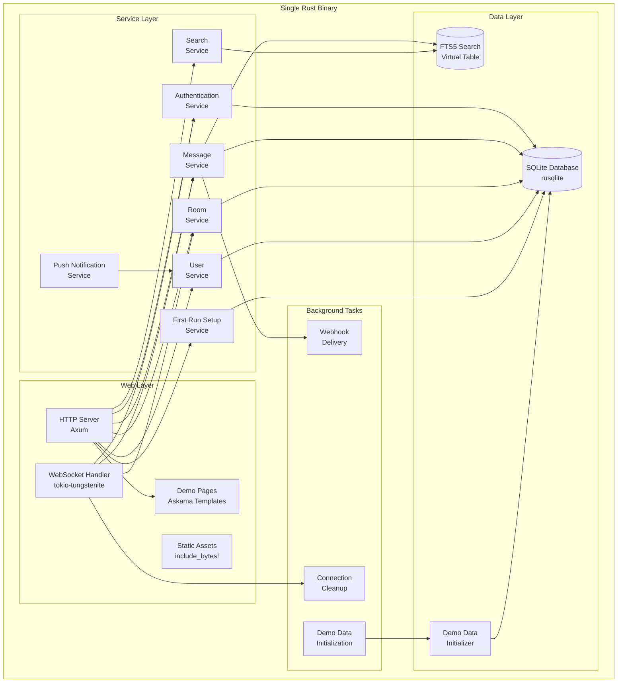
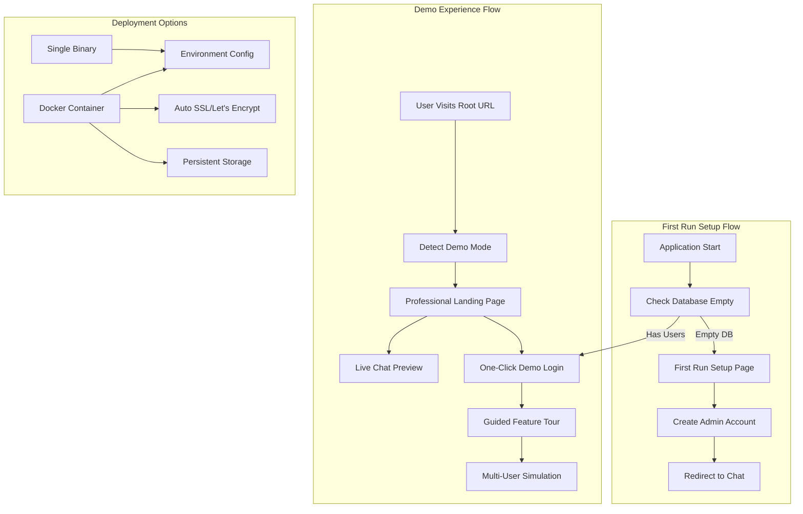

# Design Document - Campfire Rust Rewrite MVP Phase 1

## IMPORTANT FOR VISUALS AND DIAGRAMS

ALL DIAGRAMS WILL BE IN MERMAID ONLY TO ENSURE EASE WITH GITHUB - DO NOT SKIP THAT

## Overview

> v0.1 note: Avatar uploads and Attachments/Uploads have been moved to .Slate/SlateBacklogIdentified20250924120426.md


This design document specifies the architecture for rewriting the Ruby on Rails Campfire chat application in Rust, following the **MVP-First Rigor** pattern with **Rails-Compatible Simplicity**. The design prioritizes proven patterns over architectural innovation, ensuring rapid delivery of a working chat application with Rust's performance benefits.

**Core Design Philosophy:**
- **Rails Parity Rule**: If Rails doesn't do it, we don't do it - replicate Rails patterns exactly using idiomatic Rust
- **Anti-Coordination Mandates**: No coordination layers, event buses, or distributed complexity
- **Single Binary Deployment**: Embedded assets using Rust's compile-time inclusion
- **Type Safety First**: Leverage Rust's type system to prevent bugs at compile-time

## Architecture

### System Architecture Overview



### Demo and Deployment Architecture



### Technology Stack

**Core Framework:**
- **Web Server**: Axum (async, type-safe routing)
- **WebSocket**: tokio-tungstenite (Rails ActionCable equivalent)
- **Database**: SQLite with rusqlite (direct operations, no ORM)
- **Templates**: Askama (compile-time HTML templates)
- **Async Runtime**: Tokio (for WebSocket and background tasks)

**Key Libraries:**
- **Authentication**: bcrypt for password hashing, secure session tokens
- **Search**: SQLite FTS5 virtual tables
- **Push Notifications**: web-push crate with VAPID keys
- **Error Handling**: thiserror for structured errors, anyhow for application context
- **Serialization**: serde for JSON APIs

### Layered Architecture (L1→L2→L3)

Following the Design101 principles:

**L1 Core (Rust Language Features):**
- Ownership and borrowing for memory safety
- Result<T, E> for error handling
- Newtype pattern for type safety (UserId, RoomId, MessageId)
- RAII for resource management

**L2 Standard Library:**
- Collections (HashMap, Vec) for in-memory state
- Arc<Mutex<T>> for shared mutable state
- Channels (mpsc) for background task communication

**L3 External Dependencies:**
- Tokio for async runtime
- Axum for HTTP server
- SQLite for persistence
- Serde for serialization

## Components and Interfaces

### Core Data Models

```rust
// Type-safe ID wrappers
#[derive(Debug, Clone, Copy, PartialEq, Eq, Hash, Serialize, Deserialize)]
pub struct UserId(pub Uuid);

#[derive(Debug, Clone, Copy, PartialEq, Eq, Hash, Serialize, Deserialize)]
pub struct RoomId(pub Uuid);

#[derive(Debug, Clone, Copy, PartialEq, Eq, Hash, Serialize, Deserialize)]
pub struct MessageId(pub Uuid);

// Core domain models
#[derive(Debug, Clone, Serialize, Deserialize)]
pub struct User {
    pub id: UserId,
    pub name: String,
    pub email: String,
    pub password_hash: String,
    pub bio: Option<String>,
    pub admin: bool,
    pub bot_token: Option<String>,
    pub created_at: DateTime<Utc>,
}

#[derive(Debug, Clone, Serialize, Deserialize)]
pub struct Room {
    pub id: RoomId,
    pub name: String,
    pub topic: Option<String>,
    pub room_type: RoomType,
    pub created_at: DateTime<Utc>,
    pub last_message_at: Option<DateTime<Utc>>,
}

#[derive(Debug, Clone, Serialize, Deserialize)]
pub enum RoomType {
    Open,    // Anyone can join
    Closed,  // Invitation only
    Direct,  // Two-person direct message
}

#[derive(Debug, Clone, Serialize, Deserialize)]
pub struct Message {
    pub id: MessageId,
    pub room_id: RoomId,
    pub creator_id: UserId,
    pub content: String,
    pub client_message_id: Uuid,
    pub created_at: DateTime<Utc>,
}

#[derive(Debug, Clone, Serialize, Deserialize)]
pub struct Membership {
    pub room_id: RoomId,
    pub user_id: UserId,
    pub involvement_level: InvolvementLevel,
    pub created_at: DateTime<Utc>,
}

#[derive(Debug, Clone, Serialize, Deserialize)]
pub enum InvolvementLevel {
    Member,
    Admin,
}
```

### Service Layer Interfaces

```rust
// Message Service - Core chat functionality
#[async_trait]
pub trait MessageService: Send + Sync {
    /// Creates message with deduplication (Critical Gap #1)
    /// 
    /// # Preconditions
    /// - User authenticated with room access
    /// - Content: 1-10000 chars, sanitized HTML
    /// - client_message_id: valid UUID
    /// 
    /// # Postconditions  
    /// - Returns Ok(Message) on success
    /// - Inserts row into 'messages' table
    /// - Updates room.last_message_at timestamp
    /// - Broadcasts to room subscribers via WebSocket
    /// - Deduplication: returns existing if client_message_id exists
    /// 
    /// # Error Conditions
    /// - MessageError::Authorization if user lacks room access
    /// - MessageError::InvalidContent if content violates constraints
    /// - MessageError::Database on persistence failure
    async fn create_message_with_deduplication(
        &self,
        content: String,
        room_id: RoomId,
        user_id: UserId,
        client_message_id: Uuid,
    ) -> Result<Message, MessageError>;
    
    /// Retrieves message history for a room
    async fn get_room_messages(
        &self,
        room_id: RoomId,
        user_id: UserId,
        limit: u32,
        before: Option<MessageId>,
    ) -> Result<Vec<Message>, MessageError>;
    
    /// Broadcasts message to room subscribers
    async fn broadcast_message(
        &self,
        message: &Message,
        room_id: RoomId,
    ) -> Result<(), BroadcastError>;
}

// Room Service - Room management
#[async_trait]
pub trait RoomService: Send + Sync {
    /// Creates a new room
    async fn create_room(
        &self,
        name: String,
        topic: Option<String>,
        room_type: RoomType,
        creator_id: UserId,
    ) -> Result<Room, RoomError>;
    
    /// Adds user to room
    async fn add_member(
        &self,
        room_id: RoomId,
        user_id: UserId,
        added_by: UserId,
        involvement_level: InvolvementLevel,
    ) -> Result<(), RoomError>;
    
    /// Checks if user has access to room
    async fn check_room_access(
        &self,
        room_id: RoomId,
        user_id: UserId,
    ) -> Result<Option<InvolvementLevel>, RoomError>;
    
    /// Gets rooms for user
    async fn get_user_rooms(
        &self,
        user_id: UserId,
    ) -> Result<Vec<Room>, RoomError>;
}

// Authentication Service - Session management
#[async_trait]
pub trait AuthService: Send + Sync {
    /// Authenticates user with email/password
    async fn authenticate(
        &self,
        email: String,
        password: String,
    ) -> Result<Session, AuthError>;
    
    /// Creates secure session token (Critical Gap #4)
    async fn create_session(
        &self,
        user_id: UserId,
    ) -> Result<Session, AuthError>;
    
    /// Validates session token
    async fn validate_session(
        &self,
        token: String,
    ) -> Result<User, AuthError>;
    
    /// Revokes session
    async fn revoke_session(
        &self,
        token: String,
    ) -> Result<(), AuthError>;
}

// WebSocket Connection Manager - Real-time features
#[async_trait]
pub trait ConnectionManager: Send + Sync {
    /// Adds WebSocket connection for user
    async fn add_connection(
        &self,
        user_id: UserId,
        connection_id: ConnectionId,
        sender: WebSocketSender,
    ) -> Result<(), ConnectionError>;
    
    /// Removes WebSocket connection
    async fn remove_connection(
        &self,
        connection_id: ConnectionId,
    ) -> Result<(), ConnectionError>;
    
    /// Broadcasts message to room subscribers
    async fn broadcast_to_room(
        &self,
        room_id: RoomId,
        message: WebSocketMessage,
    ) -> Result<(), BroadcastError>;
    
    /// Gets presence information for room (Critical Gap #5)
    async fn get_room_presence(
        &self,
        room_id: RoomId,
    ) -> Result<Vec<UserId>, ConnectionError>;
    
    /// Handles missed messages on reconnection (Critical Gap #2)
    async fn send_missed_messages(
        &self,
        user_id: UserId,
        connection_id: ConnectionId,
        last_seen_message_id: Option<MessageId>,
    ) -> Result<(), ConnectionError>;
}
```

### Database Schema

```sql
-- Users table
CREATE TABLE users (
    id TEXT PRIMARY KEY,
    name TEXT NOT NULL,
    email TEXT UNIQUE NOT NULL,
    password_hash TEXT NOT NULL,
    bio TEXT,
    admin BOOLEAN NOT NULL DEFAULT FALSE,
    bot_token TEXT UNIQUE,
    created_at DATETIME NOT NULL DEFAULT CURRENT_TIMESTAMP
);

-- Rooms table
CREATE TABLE rooms (
    id TEXT PRIMARY KEY,
    name TEXT NOT NULL,
    topic TEXT,
    room_type TEXT NOT NULL CHECK (room_type IN ('open', 'closed', 'direct')),
    created_at DATETIME NOT NULL DEFAULT CURRENT_TIMESTAMP,
    last_message_at DATETIME
);

-- Messages table with deduplication constraint (Critical Gap #1)
CREATE TABLE messages (
    id TEXT PRIMARY KEY,
    room_id TEXT NOT NULL REFERENCES rooms(id),
    creator_id TEXT NOT NULL REFERENCES users(id),
    content TEXT NOT NULL,
    client_message_id TEXT NOT NULL,
    created_at DATETIME NOT NULL DEFAULT CURRENT_TIMESTAMP,
    UNIQUE(client_message_id, room_id) -- Prevents duplicate messages
);

-- Room memberships
CREATE TABLE room_memberships (
    room_id TEXT NOT NULL REFERENCES rooms(id),
    user_id TEXT NOT NULL REFERENCES users(id),
    involvement_level TEXT NOT NULL CHECK (involvement_level IN ('member', 'admin')),
    created_at DATETIME NOT NULL DEFAULT CURRENT_TIMESTAMP,
    PRIMARY KEY (room_id, user_id)
);

-- Sessions table for authentication
CREATE TABLE sessions (
    token TEXT PRIMARY KEY,
    user_id TEXT NOT NULL REFERENCES users(id),
    created_at DATETIME NOT NULL DEFAULT CURRENT_TIMESTAMP,
    expires_at DATETIME NOT NULL
);

-- FTS5 virtual table for message search
CREATE VIRTUAL TABLE messages_fts USING fts5(
    content,
    content=messages,
    content_rowid=id
);

-- Triggers to keep FTS5 in sync
CREATE TRIGGER messages_fts_insert AFTER INSERT ON messages BEGIN
    INSERT INTO messages_fts(rowid, content) VALUES (new.id, new.content);
END;

CREATE TRIGGER messages_fts_delete AFTER DELETE ON messages BEGIN
    DELETE FROM messages_fts WHERE rowid = old.id;
END;

CREATE TRIGGER messages_fts_update AFTER UPDATE ON messages BEGIN
    DELETE FROM messages_fts WHERE rowid = old.id;
    INSERT INTO messages_fts(rowid, content) VALUES (new.id, new.content);
END;
```

## Data Models

### Type Safety Through Newtypes

All domain IDs use the newtype pattern to prevent ID confusion:

```rust
// Prevents accidentally using UserId where RoomId is expected
impl UserId {
    pub fn new() -> Self {
        Self(Uuid::new_v4())
    }
}

impl From<Uuid> for UserId {
    fn from(uuid: Uuid) -> Self {
        Self(uuid)
    }
}

impl From<UserId> for Uuid {
    fn from(user_id: UserId) -> Self {
        user_id.0
    }
}
```

### State Machines for Message Processing

```rust
// Type-state pattern for message validation
pub struct Message<State> {
    pub id: MessageId,
    pub room_id: RoomId,
    pub creator_id: UserId,
    pub content: String,
    pub client_message_id: Uuid,
    pub created_at: DateTime<Utc>,
    _state: PhantomData<State>,
}

pub struct Unvalidated;
pub struct Validated;
pub struct Persisted;

impl Message<Unvalidated> {
    pub fn validate(self) -> Result<Message<Validated>, ValidationError> {
        // Content length validation (1-10000 chars)
        if self.content.is_empty() || self.content.len() > 10000 {
            return Err(ValidationError::InvalidContentLength);
        }
        
        // HTML sanitization
        let sanitized_content = sanitize_html(&self.content);
        
        Ok(Message {
            id: self.id,
            room_id: self.room_id,
            creator_id: self.creator_id,
            content: sanitized_content,
            client_message_id: self.client_message_id,
            created_at: self.created_at,
            _state: PhantomData,
        })
    }
}

impl Message<Validated> {
    pub async fn persist(self, db: &Database) -> Result<Message<Persisted>, DatabaseError> {
        // Database insertion with deduplication
        // Returns existing message if client_message_id already exists
        todo!()
    }
}
```

## Error Handling

### Comprehensive Error Hierarchies

```rust
// Library-level errors using thiserror
#[derive(Error, Debug)]
pub enum MessageError {
    #[error("User {user_id} not authorized for room {room_id}")]
    Authorization { user_id: UserId, room_id: RoomId },
    
    #[error("Invalid content: {reason}")]
    InvalidContent { reason: String },
    
    #[error("Content too long: {length} chars (max: 10000)")]
    ContentTooLong { length: usize },
    
    #[error("Content too short: must not be empty")]
    ContentTooShort,
    
    #[error("Database operation failed: {0}")]
    Database(#[from] rusqlite::Error),
    
    #[error("WebSocket broadcast failed: {0}")]
    Broadcast(#[from] BroadcastError),
    
    #[error("Rate limit exceeded: {limit} messages per {window}")]
    RateLimit { limit: u32, window: String },
}

#[derive(Error, Debug)]
pub enum RoomError {
    #[error("Room not found: {room_id}")]
    NotFound { room_id: RoomId },
    
    #[error("User {user_id} already member of room {room_id}")]
    AlreadyMember { user_id: UserId, room_id: RoomId },
    
    #[error("User {user_id} not authorized to add members to room {room_id}")]
    NotAuthorized { user_id: UserId, room_id: RoomId },
    
    #[error("Database operation failed: {0}")]
    Database(#[from] rusqlite::Error),
}

#[derive(Error, Debug)]
pub enum AuthError {
    #[error("Invalid credentials")]
    InvalidCredentials,
    
    #[error("Session not found or expired")]
    SessionExpired,
    
    #[error("User not found: {email}")]
    UserNotFound { email: String },
    
    #[error("Database operation failed: {0}")]
    Database(#[from] rusqlite::Error),
    
    #[error("Password hashing failed: {0}")]
    PasswordHash(#[from] bcrypt::BcryptError),
}

#[derive(Error, Debug)]
pub enum ConnectionError {
    #[error("Connection not found: {connection_id}")]
    NotFound { connection_id: ConnectionId },
    
    #[error("WebSocket send failed: {0}")]
    SendFailed(String),
    
    #[error("User {user_id} not found")]
    UserNotFound { user_id: UserId },
}

#[derive(Error, Debug)]
pub enum BroadcastError {
    #[error("No connections found for room {room_id}")]
    NoConnections { room_id: RoomId },
    
    #[error("Failed to serialize message: {0}")]
    Serialization(#[from] serde_json::Error),
    
    #[error("WebSocket send failed to {connection_count} connections")]
    PartialFailure { connection_count: usize },
}
```

## Testing Strategy

### Test-Driven Development Approach

Following the TDD-First philosophy from the requirements:

**1. Type Contracts Before Code**: Define complete function signatures with all error cases first
**2. Property-Based Specifications**: Specify behavior through property tests that validate invariants
**3. Rails Parity Rule**: If Rails doesn't do it perfectly, we don't need to either - but we specify it completely
**4. Integration Test Validation**: All service boundaries tested with real dependencies

### Test Organization

```rust
#[cfg(test)]
mod tests {
    use super::*;
    
    mod unit_tests {
        use super::*;
        
        #[test]
        fn test_message_validation() {
            // Test individual validation functions
        }
        
        #[test]
        fn test_user_id_newtype_safety() {
            // Test that UserId and RoomId cannot be confused
        }
    }
    
    mod integration_tests {
        use super::*;
        
        #[tokio::test]
        async fn test_message_creation_flow() {
            // Test complete message creation with database
        }
        
        #[tokio::test]
        async fn test_websocket_broadcast() {
            // Test real-time message broadcasting
        }
    }
    
    mod property_tests {
        use super::*;
        use proptest::prelude::*;
        
        proptest! {
            #[test]
            fn message_deduplication_idempotent(
                content in "[a-zA-Z0-9 ]{1,1000}",
                room_id in any::<Uuid>().prop_map(RoomId),
                user_id in any::<Uuid>().prop_map(UserId),
                client_id in any::<Uuid>(),
            ) {
                // Property: Same client_message_id always returns same message
                let rt = tokio::runtime::Runtime::new().unwrap();
                rt.block_on(async {
                    let service = create_test_service().await;
                    
                    let msg1 = service.create_message_with_deduplication(
                        content.clone(), room_id, user_id, client_id
                    ).await.unwrap();
                    
                    let msg2 = service.create_message_with_deduplication(
                        "different content".to_string(), room_id, user_id, client_id
                    ).await.unwrap();
                    
                    // Same client_message_id should return same message
                    prop_assert_eq!(msg1.id, msg2.id);
                    prop_assert_eq!(msg1.content, msg2.content); // Original preserved
                });
            }
        }
    }
}
```

### Critical Gap Testing

Each of the 5 critical gaps identified in requirements must have specific tests:

```rust
#[tokio::test]
async fn test_critical_gap_1_message_deduplication() {
    // Test UNIQUE constraint on (client_message_id, room_id)
    let service = create_test_service().await;
    let client_id = Uuid::new_v4();
    
    // First message should succeed
    let msg1 = service.create_message_with_deduplication(
        "First message".to_string(),
        room_id,
        user_id,
        client_id,
    ).await.unwrap();
    
    // Second message with same client_id should return existing
    let msg2 = service.create_message_with_deduplication(
        "Second message".to_string(),
        room_id,
        user_id,
        client_id,
    ).await.unwrap();
    
    assert_eq!(msg1.id, msg2.id);
    assert_eq!(msg1.content, "First message"); // Original preserved
}

#[tokio::test]
async fn test_critical_gap_2_websocket_reconnection() {
    // Test missed message delivery on reconnection
    let connection_manager = create_test_connection_manager().await;
    
    // Simulate connection drop and reconnection
    // Verify missed messages are delivered
    todo!()
}

#[tokio::test]
async fn test_critical_gap_3_sqlite_write_serialization() {
    // Test concurrent writes are properly serialized
    let service = create_test_service().await;
    
    // Spawn multiple concurrent write operations
    let handles: Vec<_> = (0..100).map(|i| {
        let service = service.clone();
        tokio::spawn(async move {
            service.create_message_with_deduplication(
                format!("Message {}", i),
                room_id,
                user_id,
                Uuid::new_v4(),
            ).await
        })
    }).collect();
    
    // All operations should succeed without conflicts
    for handle in handles {
        assert!(handle.await.unwrap().is_ok());
    }
}

#[tokio::test]
async fn test_critical_gap_4_secure_session_tokens() {
    // Test Rails-equivalent secure token generation
    let auth_service = create_test_auth_service().await;
    
    let session1 = auth_service.create_session(user_id).await.unwrap();
    let session2 = auth_service.create_session(user_id).await.unwrap();
    
    // Tokens should be unique and cryptographically secure
    assert_ne!(session1.token, session2.token);
    assert!(session1.token.len() >= 32); // Minimum entropy
}

#[tokio::test]
async fn test_critical_gap_5_presence_tracking() {
    // Test basic presence tracking with TTL cleanup
    let connection_manager = create_test_connection_manager().await;
    
    // Add connection
    connection_manager.add_connection(user_id, connection_id, sender).await.unwrap();
    
    // Verify presence
    let presence = connection_manager.get_room_presence(room_id).await.unwrap();
    assert!(presence.contains(&user_id));
    
    // Simulate connection timeout (60 seconds)
    tokio::time::advance(Duration::from_secs(61)).await;
    
    // Verify cleanup
    let presence = connection_manager.get_room_presence(room_id).await.unwrap();
    assert!(!presence.contains(&user_id));
}
```

## Design Decisions and Rationales

### 1. SQLite Over PostgreSQL for MVP

**Decision**: Use SQLite with rusqlite for direct database operations
**Rationale**: 
- Eliminates deployment complexity (single binary)
- Sufficient for MVP scale (Rails uses similar approach for development)
- FTS5 provides excellent search capabilities
- Direct SQL operations avoid ORM complexity
- Easy to migrate to PostgreSQL later if needed

### 2. Axum Over Other Web Frameworks

**Decision**: Use Axum for HTTP server
**Rationale**:
- Type-safe routing with compile-time validation
- Excellent async performance with Tokio integration
- Tower middleware ecosystem for common functionality
- Clear separation of concerns with extractors
- Strong community adoption and maintenance

### 3. No ORM - Direct SQL Operations

**Decision**: Use rusqlite directly instead of an ORM like Diesel or SQLx
**Rationale**:
- Follows anti-coordination mandate (no complex abstractions)
- Rails uses ActiveRecord, but we prioritize simplicity over feature parity
- Direct control over SQL for performance optimization
- Easier to implement the 5 critical gaps with raw SQL
- Compile-time query validation can be added later if needed

### 4. Embedded Assets Over CDN

**Decision**: Use `include_bytes!` macro to embed all static assets
**Rationale**:
- Single binary deployment (zero coordination overhead)
- No external dependencies for asset serving
- Rust's compile-time inclusion is efficient
- Eliminates asset pipeline complexity
- Easy to switch to CDN later for scaling

### 5. tokio-tungstenite Over Higher-Level WebSocket Libraries

**Decision**: Use tokio-tungstenite directly for WebSocket handling
**Rationale**:
- Direct control over connection management (Critical Gap #2)
- Rails ActionCable equivalent - simple broadcast patterns
- No hidden coordination complexity
- Easy to implement presence tracking (Critical Gap #5)
- Predictable performance characteristics

### 6. Askama Templates Over Runtime Templating

**Decision**: Use Askama for compile-time HTML template compilation
**Rationale**:
- Compile-time template validation prevents runtime errors
- Better performance than runtime template engines
- Type-safe template context
- Familiar syntax similar to Jinja2/Django templates
- Integrates well with Rust's type system

### 7. Session-Based Authentication Over JWT

**Decision**: Use traditional session cookies with database storage
**Rationale**:
- Rails-equivalent pattern (session cookies)
- Simpler to implement securely than JWT
- Easy session revocation
- No coordination complexity
- Familiar security model

### 8. In-Memory Connection Tracking

**Decision**: Use `Arc<Mutex<HashMap>>` for WebSocket connection tracking
**Rationale**:
- Simple implementation of Critical Gap #5 (presence tracking)
- No external dependencies (Redis, etc.)
- Sufficient for single-instance deployment
- Easy to migrate to distributed solution later
- Follows Rails pattern of in-memory session storage

### 9. Background Tasks with Tokio Spawn

**Decision**: Use `tokio::spawn` for background tasks instead of job queues
**Rationale**:
- Follows anti-coordination mandate (no message queues)
- Rails uses similar approach with background jobs
- Sufficient for webhook delivery and cleanup tasks
- No external dependencies
- Easy to monitor and debug

### 10. Graceful Feature Deferrals

**Decision**: Show "Coming in v2.0" messaging for file attachments, avatars, and OpenGraph
**Rationale**:
- Maintains complete UI parity with original Campfire
- Clear user expectations about future features
- Allows focus on core chat functionality
- Provides upgrade path messaging
- Reduces MVP complexity while preserving user experience

## Implementation Priority

### Phase 1: Core Infrastructure (Week 1)
1. Database schema and migrations
2. Basic HTTP server with Axum
3. Authentication service with session management
4. User and room services
5. Basic HTML templates with Askama

### Phase 2: Real-Time Features (Week 2)
1. WebSocket connection management
2. Message service with deduplication (Critical Gap #1)
3. Real-time message broadcasting
4. Presence tracking (Critical Gap #5)
5. Missed message delivery (Critical Gap #2)

### Phase 3: Advanced Features (Week 3)
1. Full-text search with FTS5
2. Push notifications with Web Push
3. Sound system with embedded MP3 files
4. Rich text formatting and @mentions
5. Bot API integration

### Phase 4: Polish and Testing (Week 4)
1. Comprehensive test suite
2. Performance optimization
3. Security hardening
4. Documentation completion
5. Deployment preparation

This design provides a solid foundation for implementing the Campfire Rust rewrite while adhering to the anti-coordination constraints and Rails parity requirements specified in the requirements document.
