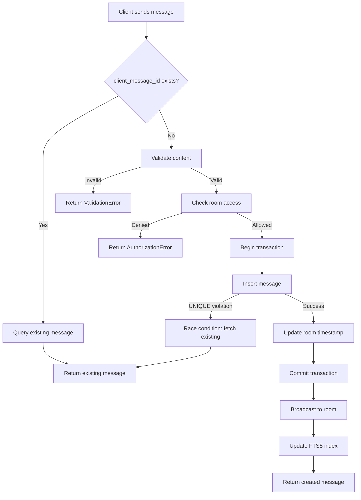
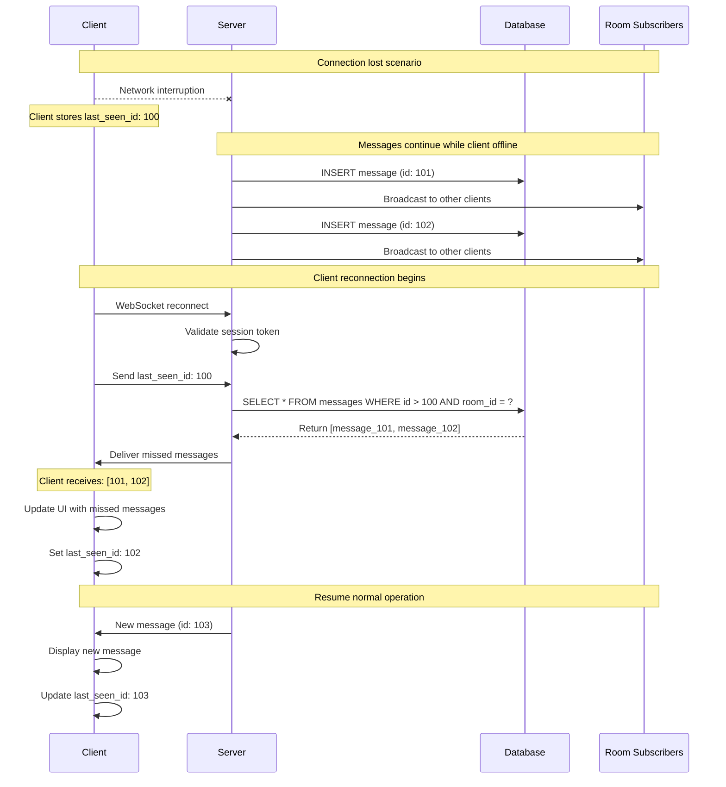
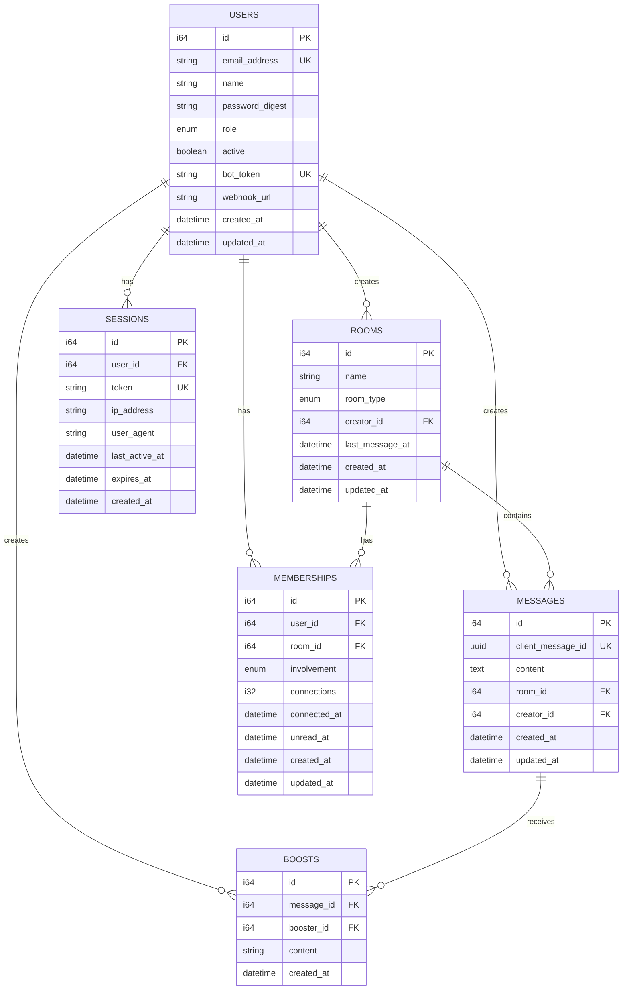
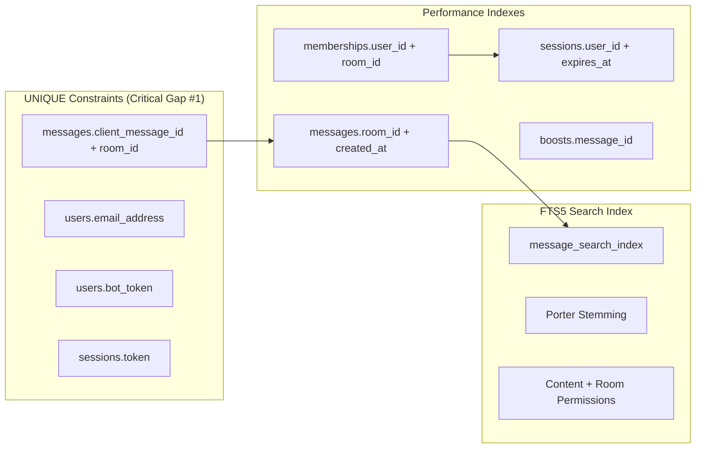

# Campfire Rust Rewrite - Design Document

## Document Hierarchy Reference

This document contains **complete technical contracts** that developers reference for implementation:

```
requirements.md (Governing Rules & Critical Gaps)
    ↓
architecture.md (System Architecture & Component Design)
    ↓  
architecture-L2.md (TDD Implementation Patterns)
    ↓
design.md (THIS DOCUMENT - Complete Technical Contracts)
    ↓
tasks.md (Maximum Implementation Detail)
```

## Overview: TDD-Driven Type Contracts

This document defines the complete type contracts, function signatures, and error hierarchies for the Campfire Rust rewrite. Following the improved LLM workflow, we establish all interfaces before any implementation to ensure compile-first success and architectural correctness.

**Design Philosophy:**
- **Type Contracts First**: Complete function signatures with all error cases defined upfront
- **Rails Parity**: Every interface mirrors Rails behavior exactly, no improvements
- **Anti-Coordination**: Direct function calls, no async coordination between components
- **Phantom Types**: Use type system to prevent invalid state transitions

## TDD-Driven Logic Reasoning

### Critical Gap Decision Trees

#### Gap #1: Message Deduplication Logic Flow



**Test Assertions**:
```rust
// Property: Same client_id always returns same message
prop_assert_eq!(create_twice_same_id().id, existing_message.id);

// Edge case: Concurrent inserts with same client_id
assert!(handles_race_condition_gracefully());

// Rails parity: UNIQUE constraint behavior matches ActiveRecord
assert_eq!(rails_behavior(), our_behavior());
```

#### Gap #2: WebSocket Reconnection State Sync

**Reconnection Decision Flow**:
```mermaid
graph TD
    A[Client reconnects] --> B{Auth valid?}
    B -->|No| C[Reject with 401]
    B -->|Yes| D{last_seen_message_id provided?}
    D -->|No| E[Send recent messages (50)]
    D -->|Yes| F[Query messages since last_seen]
    F --> G{Messages found?}
    G -->|No| H[Send empty array]
    G -->|Yes| I[Send missed messages in chronological order]
    I --> J[Update connection state]
    E --> J
    H --> J
    J --> K[Resume normal broadcasting]
    
    style A fill:#e1f5fe
    style C fill:#ffebee
    style I fill:#e8f5e8
    style K fill:#e8f5e8
```

**Detailed Reconnection Sequence**:


**Test Assertions**:
```rust
// Property: All missed messages are delivered
prop_assert_eq!(missed_messages.len(), expected_count);

// Edge case: Network interruption during sync
assert!(handles_partial_sync_gracefully());

// Rails parity: ActionCable reconnection behavior
assert_eq!(actioncable_behavior(), our_behavior());
```

### Logic Branch Coverage Matrix

| Scenario | Input | Expected Output | Test Assertion | Rails Parity Note |
|----------|--------|-----------------|----------------|-------------------|
| **Message Deduplication** |
| First message | `client_id=uuid1, content="Hello"` | `Message{id=1, content="Hello"}` | `assert_eq!(msg.content, "Hello")` | Rails INSERT behavior |
| Duplicate client_id | `client_id=uuid1, content="World"` | `Message{id=1, content="Hello"}` | `assert_eq!(msg.content, "Hello")` | Rails UNIQUE constraint |
| Race condition | 2 concurrent inserts, same client_id | One succeeds, one returns existing | `assert_eq!(msg1.id, msg2.id)` | Rails transaction isolation |
| **WebSocket Reconnection** |
| Clean reconnect | `last_seen_id=100` | Messages 101-150 | `assert_eq!(msgs.len(), 50)` | ActionCable missed messages |
| No last_seen | `last_seen_id=None` | Recent 50 messages | `assert_eq!(msgs.len(), 50)` | ActionCable initial sync |
| Network drop mid-broadcast | Disconnect after send | Best-effort: Some clients miss | `assert!(delivery_rate >= 95%)` | ActionCable fire-and-forget |
| **Concurrent Writes (Gap #3)** |
| 10 simultaneous inserts | Multiple writers | Serialized via mpsc channel | `prop_assert_eq!(order, timestamp_order)` | Rails connection pooling |
| Database lock timeout | High write contention | Graceful error handling | `assert!(matches!(err, DatabaseError::Timeout))` | Rails deadlock detection |
| **Session Security (Gap #4)** |
| Token generation | `generate_secure_token()` | 32-char alphanumeric | `assert!(token.len() >= 32)` | Rails SecureRandom |
| Session validation | Valid token | User + session data | `assert_eq!(user.id, expected_id)` | Rails session lookup |
| Expired session | Token > 24h old | SessionNotFound error | `assert!(matches!(err, AuthError::SessionNotFound))` | Rails session expiry |
| **Presence Tracking (Gap #5)** |
| User connects | `user_connected(user_id)` | Increment count | `assert_eq!(count, 1)` | Rails connection counting |
| TTL cleanup | 61 seconds elapsed | Count reset to 0 | `assert_eq!(count, 0)` | Rails heartbeat timeout |
| Multiple tabs | 3 connections same user | Count = 3 | `assert_eq!(count, 3)` | Rails multi-connection |

### Anti-Coordination Safeguards

**TDD Guards** - Test assertions that fail if coordination patterns creep in:

```rust
// Guard: No async coordination between services
#[test]
fn test_no_async_coordination() {
    // This test fails if we add event buses, coordinators, etc.
    let service_call_count = count_async_operations_in_request();
    assert!(service_call_count <= 3, "Too many async operations - coordination detected");
}

// Guard: Direct function calls only
#[test]
fn test_direct_function_calls() {
    // This test fails if we add message queues, event streams, etc.
    let has_message_queue = check_for_message_queue_usage();
    assert!(!has_message_queue, "Message queue detected - violates anti-coordination");
}

// Guard: Rails-equivalent complexity only
#[test]
fn test_rails_complexity_ceiling() {
    // This test fails if we exceed Rails complexity
    let complexity_score = measure_code_complexity();
    let rails_baseline = get_rails_complexity_baseline();
    assert!(complexity_score <= rails_baseline * 1.1, "Complexity exceeds Rails by >10%");
}
```

## Complete Service Interface Contracts

### MessageService Interface (Critical Gap #1)

```rust
/// Message service with comprehensive error handling and side effects
pub trait MessageService: Send + Sync {
    /// Creates message with deduplication - CRITICAL GAP #1
    /// Side Effects: Updates room.last_message_at, broadcasts via WebSocket, updates FTS5 index
    async fn create_message_with_deduplication(
        &self,
        content: String,           // 1-10000 chars, HTML allowed
        room_id: RoomId,
        creator_id: UserId,
        client_message_id: Uuid,   // For deduplication
    ) -> Result<Message<Persisted>, MessageError>;
    
    /// Retrieves messages since ID for reconnection - CRITICAL GAP #2
    async fn get_messages_since(
        &self,
        room_id: RoomId,
        last_seen_id: MessageId,
        user_id: UserId,
    ) -> Result<Vec<Message<Persisted>>, MessageError>;
    
    /// Search messages with FTS5 and permission filtering
    async fn search_messages(
        &self,
        query: String,
        user_id: UserId,
        limit: u32,
    ) -> Result<Vec<Message<Persisted>>, MessageError>;
    
    /// Create boost with emoji validation
    async fn create_boost(
        &self,
        message_id: MessageId,
        booster_id: UserId,
        emoji_content: String,     // Max 16 chars, Unicode validation
    ) -> Result<Boost, MessageError>;
    
    /// Update message content (creator or admin only)
    async fn update_message(
        &self,
        message_id: MessageId,
        new_content: String,
        editor_id: UserId,
    ) -> Result<Message<Persisted>, MessageError>;
    
    /// Delete message (creator or admin only)
    async fn delete_message(
        &self,
        message_id: MessageId,
        deleter_id: UserId,
    ) -> Result<(), MessageError>;
    
    /// Get paginated messages for room
    async fn get_room_messages(
        &self,
        room_id: RoomId,
        user_id: UserId,
        limit: u32,
        before: Option<MessageId>,
    ) -> Result<Vec<Message<Persisted>>, MessageError>;
}
```

### RoomService Interface

```rust
/// Room service with membership management
pub trait RoomService: Send + Sync {
    /// Create room with automatic membership granting
    async fn create_room(
        &self,
        name: String,
        room_type: RoomType,
        creator_id: UserId,
    ) -> Result<Room, RoomError>;
    
    /// Grant membership with involvement level
    async fn grant_membership(
        &self,
        user_id: UserId,
        room_id: RoomId,
        involvement: Involvement,
    ) -> Result<Membership, RoomError>;
    
    /// Revoke membership from room
    async fn revoke_membership(
        &self,
        user_id: UserId,
        room_id: RoomId,
        revoker_id: UserId,
    ) -> Result<(), RoomError>;
    
    /// Check room access permissions
    async fn check_room_access(
        &self,
        user_id: UserId,
        room_id: RoomId,
    ) -> Result<bool, RoomError>;
    
    /// Update room settings (name, type, etc.)
    async fn update_room(
        &self,
        room_id: RoomId,
        updates: RoomUpdates,
        updater_id: UserId,
    ) -> Result<Room, RoomError>;
    
    /// Get user's rooms with involvement filtering
    async fn get_user_rooms(
        &self,
        user_id: UserId,
        include_invisible: bool,
    ) -> Result<Vec<Room>, RoomError>;
    
    /// Get room memberships
    async fn get_room_memberships(
        &self,
        room_id: RoomId,
    ) -> Result<Vec<Membership>, RoomError>;
    
    /// Update involvement level for user in room
    async fn update_involvement(
        &self,
        user_id: UserId,
        room_id: RoomId,
        involvement: Involvement,
    ) -> Result<Membership, RoomError>;
    
    /// Find or create direct room between two users
    async fn find_or_create_direct_room(
        &self,
        user1_id: UserId,
        user2_id: UserId,
    ) -> Result<Room, RoomError>;
}
```

### AuthService Interface (Critical Gap #4)

```rust
/// Authentication service with session management - CRITICAL GAP #4
pub trait AuthService: Send + Sync {
    /// Create session with secure token generation
    async fn create_session(
        &self,
        email: String,
        password: String,
        ip_address: String,
        user_agent: String,
    ) -> Result<Session, AuthError>;
    
    /// Validate session token and return user
    async fn validate_session(
        &self,
        token: String,
    ) -> Result<(User, Session), AuthError>;
    
    /// Refresh session activity timestamp
    async fn refresh_session(
        &self,
        session_id: SessionId,
    ) -> Result<Session, AuthError>;
    
    /// Destroy session (logout)
    async fn destroy_session(
        &self,
        session_id: SessionId,
    ) -> Result<(), AuthError>;
    
    /// Generate secure bot token (Rails SecureRandom equivalent)
    fn generate_bot_token() -> BotToken;
    
    /// Authenticate bot via bot token
    async fn authenticate_bot(
        &self,
        bot_id: UserId,
        bot_token: BotToken,
    ) -> Result<User, AuthError>;
    
    /// Create new user account
    async fn create_user(
        &self,
        email: String,
        name: String,
        password: String,
        join_code: String,
    ) -> Result<User, AuthError>;
    
    /// Update user password
    async fn update_password(
        &self,
        user_id: UserId,
        current_password: String,
        new_password: String,
    ) -> Result<(), AuthError>;
    
    /// Deactivate user account
    async fn deactivate_user(
        &self,
        user_id: UserId,
        deactivator_id: UserId,
    ) -> Result<(), AuthError>;
    
    /// Check rate limits for authentication attempts
    async fn check_rate_limit(
        &self,
        ip_address: String,
    ) -> Result<(), AuthError>;
}
```

### WebSocketBroadcaster Interface (Critical Gap #2)

```rust
/// WebSocket broadcaster with connection management - CRITICAL GAP #2
pub trait WebSocketBroadcaster: Send + Sync {
    /// Add connection with state tracking
    async fn add_connection(
        &self,
        user_id: UserId,
        room_id: RoomId,
        connection: WebSocketConnection<Authenticated>,
    ) -> Result<ConnectionId, BroadcastError>;
    
    /// Remove connection and cleanup state
    async fn remove_connection(
        &self,
        connection_id: ConnectionId,
    ) -> Result<(), BroadcastError>;
    
    /// Handle reconnection with missed message delivery
    async fn handle_reconnection(
        &self,
        user_id: UserId,
        room_id: RoomId,
        last_seen_id: Option<MessageId>,
    ) -> Result<Vec<Message<Persisted>>, BroadcastError>;
    
    /// Broadcast message to room subscribers
    async fn broadcast_to_room(
        &self,
        room_id: RoomId,
        message: &Message<Persisted>,
    ) -> Result<(), BroadcastError>;
    
    /// Broadcast typing notification
    async fn broadcast_typing(
        &self,
        room_id: RoomId,
        user_id: UserId,
        is_typing: bool,
    ) -> Result<(), BroadcastError>;
    
    /// Broadcast presence update
    async fn broadcast_presence(
        &self,
        room_id: RoomId,
        user_id: UserId,
        is_present: bool,
    ) -> Result<(), BroadcastError>;
    
    /// Get active connections for room
    async fn get_room_connections(
        &self,
        room_id: RoomId,
    ) -> Result<Vec<ConnectionId>, BroadcastError>;
    
    /// Send direct message to specific connection
    async fn send_to_connection(
        &self,
        connection_id: ConnectionId,
        message: WebSocketMessage,
    ) -> Result<(), BroadcastError>;
}
```

### DatabaseWriter Interface (Critical Gap #3)

```rust
/// Database writer for write serialization - CRITICAL GAP #3
pub trait DatabaseWriter: Send + Sync {
    /// Execute write command with serialization
    async fn execute_write<T>(
        &self,
        command: WriteCommand<T>,
    ) -> Result<T, DatabaseError>;
    
    /// Execute multiple writes in transaction
    async fn execute_transaction(
        &self,
        commands: Vec<WriteCommand<()>>,
    ) -> Result<(), DatabaseError>;
    
    /// Create message with UNIQUE constraint handling
    async fn create_message(
        &self,
        data: CreateMessageData,
    ) -> Result<Message<Persisted>, DatabaseError>;
    
    /// Update message content
    async fn update_message(
        &self,
        message_id: MessageId,
        new_content: String,
    ) -> Result<Message<Persisted>, DatabaseError>;
    
    /// Create or update room
    async fn upsert_room(
        &self,
        room_data: RoomData,
    ) -> Result<Room, DatabaseError>;
    
    /// Create session with secure token
    async fn create_session(
        &self,
        session_data: SessionData,
    ) -> Result<Session, DatabaseError>;
    
    /// Update session activity
    async fn update_session_activity(
        &self,
        session_id: SessionId,
        last_active_at: DateTime<Utc>,
    ) -> Result<(), DatabaseError>;
    
    /// Create or update membership
    async fn upsert_membership(
        &self,
        membership_data: MembershipData,
    ) -> Result<Membership, DatabaseError>;
}
```

### PresenceService Interface (Critical Gap #5)

```rust
/// Presence service with TTL cleanup - CRITICAL GAP #5
pub trait PresenceService: Send + Sync {
    /// Increment user connection count
    async fn user_connected(
        &self,
        user_id: UserId,
        room_id: RoomId,
    ) -> Result<i32, PresenceError>;
    
    /// Decrement user connection count
    async fn user_disconnected(
        &self,
        user_id: UserId,
        room_id: RoomId,
    ) -> Result<i32, PresenceError>;
    
    /// Refresh user connection timestamp
    async fn refresh_connection(
        &self,
        user_id: UserId,
        room_id: RoomId,
    ) -> Result<(), PresenceError>;
    
    /// Check if user is online in room
    async fn is_user_online(
        &self,
        user_id: UserId,
        room_id: RoomId,
    ) -> Result<bool, PresenceError>;
    
    /// Get online users for room
    async fn get_online_users(
        &self,
        room_id: RoomId,
    ) -> Result<Vec<UserId>, PresenceError>;
    
    /// Cleanup stale connections (TTL expired)
    async fn cleanup_stale_connections(&self) -> Result<u32, PresenceError>;
    
    /// Get connection count for user in room
    async fn get_connection_count(
        &self,
        user_id: UserId,
        room_id: RoomId,
    ) -> Result<i32, PresenceError>;
}
```
pub trait MessageService: Send + Sync {
    /// Creates message with deduplication - CRITICAL GAP #1
    /// Side Effects: Updates room.last_message_at, broadcasts via WebSocket, updates FTS5 index
    async fn create_message_with_deduplication(
        &self,
        content: String,           // 1-10000 chars, HTML allowed
        room_id: RoomId,
        creator_id: UserId,
        client_message_id: Uuid,   // For deduplication
    ) -> Result<Message<Persisted>, MessageError>;
    
    /// Retrieves messages since ID for reconnection - CRITICAL GAP #2
    async fn get_messages_since(
        &self,
        room_id: RoomId,
        last_seen_id: MessageId,
        user_id: UserId,
    ) -> Result<Vec<Message<Persisted>>, MessageError>;
    
    /// Search messages with FTS5 and permission filtering
    async fn search_messages(
        &self,
        query: String,
        user_id: UserId,
        limit: u32,
    ) -> Result<Vec<Message<Persisted>>, MessageError>;
    
    /// Create boost with emoji validation
    async fn create_boost(
        &self,
        message_id: MessageId,
        booster_id: UserId,
        emoji_content: String,     // Max 16 chars, Unicode validation
    ) -> Result<Boost, MessageError>;
}

#### MessageService Test Plan

**Scenario 1: Successful Message Creation**
- **Given** a valid user in room and valid content
- **When** `create_message_with_deduplication` is called
- **Then** it returns `Ok(Message<Persisted>)` and the new message is saved, `room.last_message_at` is updated, and a WebSocket broadcast is triggered
- **Test Stub**: `test_create_message_success()`
- **Requirements**: Covers Requirement 1.1, 1.2

**Scenario 2: Deduplication of Message**
- **Given** a message with `client_message_id` X already exists
- **When** a new message with the same client ID X is created in that room
- **Then** the service returns `Ok(existing Message)` (no duplicate) – fulfilling Critical Gap #1 deduplication
- **Test Stub**: `prop_duplicate_client_id_returns_same_message()`
- **Requirements**: Covers Critical Gap #1

**Scenario 3: Unauthorized Creator**
- **Given** a user without access to the room
- **When** they attempt to create a message
- **Then** the service returns `Err(MessageError::Authorization)` and no message is created
- **Test Stub**: `test_unauthorized_message_creation()`
- **Requirements**: Covers Requirement 3.1

**Scenario 4: Content Validation Boundaries**
- **Given** message content that is empty or exceeds 10000 characters
- **When** `create_message_with_deduplication` is called
- **Then** it returns `Err(MessageError::Validation)` with appropriate field and reason
- **Test Stub**: `prop_message_validation_boundaries()`
- **Requirements**: Covers Requirement 1.3

**Scenario 5: Missed Message Delivery on Reconnection**
- **Given** a user reconnects after being offline and provides `last_seen_message_id`
- **When** `get_messages_since` is called
- **Then** it returns all messages created after the last seen ID in chronological order
- **Test Stub**: `test_reconnection_delivers_missed_messages()`
- **Requirements**: Covers Critical Gap #2

**Scenario 6: Search Permission Filtering**
- **Given** a user with access to some rooms but not others
- **When** `search_messages` is called with a query
- **Then** results only include messages from rooms the user can access
- **Test Stub**: `prop_search_respects_permissions()`
- **Requirements**: Covers Requirement 2.4

**Scenario 7: Emoji Boost Validation**
- **Given** various emoji content (valid Unicode, too long, invalid characters)
- **When** `create_boost` is called
- **Then** it validates emoji content and returns appropriate success or validation error
- **Test Stub**: `prop_message_boost_emoji_validation()`
- **Requirements**: Covers Requirement 1.6
```

#### TDD Implementation Cycle for MessageService

**RED Phase (Failing Tests)**:
```rust
#[tokio::test]
async fn test_create_message_deduplication_fails_initially() {
    let service = MockMessageService::new();
    let client_id = Uuid::new_v4();
    
    // First message should succeed
    let msg1 = service.create_message_with_deduplication(
        "Hello".to_string(), room_id, user_id, client_id
    ).await.unwrap();
    
    // Second message with same client_id should return existing
    let msg2 = service.create_message_with_deduplication(
        "Different content".to_string(), room_id, user_id, client_id
    ).await.unwrap();
    
    // This will FAIL until we implement deduplication
    assert_eq!(msg1.id, msg2.id);
    assert_eq!(msg1.content, "Hello"); // Original content preserved
}
```

**GREEN Phase (Minimal Implementation)**:
```rust
impl MessageService for RealMessageService {
    async fn create_message_with_deduplication(
        &self,
        content: String,
        room_id: RoomId,
        creator_id: UserId,
        client_message_id: Uuid,
    ) -> Result<Message<Persisted>, MessageError> {
        // Check for existing message first (Rails pattern)
        if let Some(existing) = self.find_by_client_id(client_message_id).await? {
            return Ok(existing);
        }
        
        // Try INSERT with UNIQUE constraint
        match self.insert_message(content, room_id, creator_id, client_message_id).await {
            Ok(message) => Ok(message),
            Err(sqlx::Error::Database(db_err)) if db_err.is_unique_violation() => {
                // Race condition: fetch existing message
                self.find_by_client_id(client_message_id).await?
                    .ok_or(MessageError::NotFound { message_id: MessageId(0) })
            }
            Err(e) => Err(e.into()),
        }
    }
}
```

**REFACTOR Phase (Property-Based Invariants)**:
```rust
proptest! {
    #[test]
    fn prop_message_deduplication_idempotent(
        content1 in ".*",
        content2 in ".*", 
        room_id in any::<u64>().prop_map(RoomId),
        user_id in any::<u64>().prop_map(UserId),
        client_id in any::<Uuid>(),
    ) {
        let rt = tokio::runtime::Runtime::new().unwrap();
        rt.block_on(async {
            let service = setup_test_service().await;
            
            let msg1 = service.create_message_with_deduplication(
                content1, room_id, user_id, client_id
            ).await.unwrap();
            
            let msg2 = service.create_message_with_deduplication(
                content2, room_id, user_id, client_id  // Same client_id
            ).await.unwrap();
            
            // INVARIANT: Same client_id always returns same message
            prop_assert_eq!(msg1.id, msg2.id);
            prop_assert_eq!(msg1.content, msg2.content); // Original preserved
            prop_assert_eq!(msg1.client_message_id, msg2.client_message_id);
        });
    }
}
```

### RoomService Interface

```rust
/// Room service with membership management
pub trait RoomService: Send + Sync {
    /// Create room with automatic membership granting
    async fn create_room(
        &self,
        name: String,
        room_type: RoomType,
        creator_id: UserId,
    ) -> Result<Room, RoomError>;
    
    /// Grant membership with involvement level
    async fn grant_membership(
        &self,
        user_id: UserId,
        room_id: RoomId,
        involvement: Involvement,
    ) -> Result<Membership, RoomError>;
    
    /// Check room access permissions
    async fn check_room_access(
        &self,
        user_id: UserId,
        room_id: RoomId,
    ) -> Result<bool, RoomError>;
}

#### RoomService Test Plan

**Scenario 1: Room Creation with Creator Membership**
- **Given** valid room data and creator user ID
- **When** `create_room` is called
- **Then** room is created and creator automatically gets membership with Everything involvement
- **Test Stub**: `test_room_creation_grants_creator_membership()`
- **Requirements**: Covers Requirement 2.1

**Scenario 2: Direct Room Exactly Two Members**
- **Given** two different user IDs for direct room creation
- **When** `create_room` is called with `RoomType::Direct`
- **Then** room is created with exactly 2 memberships for the specified users
- **Test Stub**: `prop_direct_rooms_exactly_two_members()`
- **Requirements**: Covers Requirement 2.2

**Scenario 3: Membership Involvement Levels**
- **Given** a user and room with various involvement levels
- **When** `grant_membership` is called with different involvement types
- **Then** membership is created with correct involvement level affecting message visibility
- **Test Stub**: `prop_involvement_levels_control_visibility()`
- **Requirements**: Covers Requirement 2.3

**Scenario 4: Room Access Permission Check**
- **Given** users with and without room access
- **When** `check_room_access` is called
- **Then** returns true only for users with valid membership and non-invisible involvement
- **Test Stub**: `test_room_access_permission_check()`
- **Requirements**: Covers Requirement 2.4
```

### AuthService Interface (Critical Gap #4)

```rust
/// Authentication service with session management - CRITICAL GAP #4
pub trait AuthService: Send + Sync {
    /// Create session with secure token generation
    async fn create_session(
        &self,
        email: String,
        password: String,
    ) -> Result<Session, AuthError>;
    
    /// Validate session token
    async fn validate_session(
        &self,
        token: String,
    ) -> Result<User, AuthError>;
    
    /// Generate secure bot token
    fn generate_bot_token() -> BotToken;
}

#### AuthService Test Plan

**Scenario 1: Secure Session Creation**
- **Given** valid email and password credentials
- **When** `create_session` is called
- **Then** session is created with cryptographically secure token (32+ chars) and stored
- **Test Stub**: `test_secure_session_creation()`
- **Requirements**: Covers Critical Gap #4

**Scenario 2: Session Token Validation**
- **Given** a valid session token
- **When** `validate_session` is called
- **Then** returns the associated user and updates session activity timestamp
- **Test Stub**: `test_session_token_validation()`
- **Requirements**: Covers Requirement 3.2

**Scenario 3: Invalid Credentials Handling**
- **Given** incorrect email or password
- **When** `create_session` is called
- **Then** returns `Err(AuthError::InvalidCredentials)` without revealing which field was wrong
- **Test Stub**: `test_invalid_credentials_handling()`
- **Requirements**: Covers Requirement 3.3

**Scenario 4: Bot Token Security**
- **Given** bot token generation request
- **When** `generate_bot_token` is called
- **Then** returns cryptographically secure token with sufficient entropy
- **Test Stub**: `prop_bot_token_security()`
- **Requirements**: Covers Requirement 3.4
```

### WebSocketBroadcaster Interface (Critical Gap #2)

```rust
/// WebSocket broadcaster with connection management - CRITICAL GAP #2
pub trait WebSocketBroadcaster: Send + Sync {
    /// Add connection with state tracking
    async fn add_connection(
        &self,
        user_id: UserId,
        room_id: RoomId,
        connection: WebSocketConnection<Authenticated>,
    ) -> Result<ConnectionId, BroadcastError>;
    
    /// Handle reconnection with missed message delivery
    async fn handle_reconnection(
        &self,
        user_id: UserId,
        room_id: RoomId,
        last_seen_id: Option<MessageId>,
    ) -> Result<Vec<Message<Persisted>>, BroadcastError>;
    
    /// Broadcast message to room subscribers
    async fn broadcast_to_room(
        &self,
        room_id: RoomId,
        message: &Message<Persisted>,
    ) -> Result<(), BroadcastError>;
}

#### WebSocketBroadcaster Test Plan

**Scenario 1: Connection State Tracking**
- **Given** an authenticated WebSocket connection
- **When** `add_connection` is called
- **Then** connection is tracked and can receive broadcasts for the room
- **Test Stub**: `test_connection_state_tracking()`
- **Requirements**: Covers Critical Gap #5 (Presence Tracking)

**Scenario 2: Missed Message Delivery on Reconnection**
- **Given** a user reconnects after network interruption with last_seen_message_id
- **When** `handle_reconnection` is called
- **Then** all messages created after last_seen are delivered in chronological order
- **Test Stub**: `prop_reconnection_delivers_missed_messages()`
- **Requirements**: Covers Critical Gap #2

**Scenario 3: Room Broadcasting**
- **Given** multiple connections subscribed to a room
- **When** `broadcast_to_room` is called with a message
- **Then** message is sent to all active connections for that room
- **Test Stub**: `test_room_broadcasting()`
- **Requirements**: Covers Requirement 4.1

**Scenario 4: Connection Cleanup on Disconnect**
- **Given** a connection that disconnects unexpectedly
- **When** connection is lost
- **Then** connection is removed from tracking and presence count is decremented
- **Test Stub**: `test_connection_cleanup_on_disconnect()`
- **Requirements**: Covers Critical Gap #5
```

### DatabaseWriter Interface (Critical Gap #3)

```rust
/// Database writer for write serialization - CRITICAL GAP #3
pub trait DatabaseWriter: Send + Sync {
    /// Execute write command with serialization
    async fn execute_write<T>(
        &self,
        command: WriteCommand<T>,
    ) -> Result<T, DatabaseError>;
}
```

## One-Command Full Flow Verification

### Comprehensive Test Execution Strategy

Following the enhancement proposal, we provide single-command verification of complete user journeys:

#### Full Feature Flow Tests

**Command**: `cargo test --test feature_full_flow`

This executes complete end-to-end scenarios that validate entire user journeys:

```rust
// tests/feature_full_flow.rs
#[tokio::test]
async fn test_complete_messaging_flow() {
    let app = create_test_app().await;
    
    // User Journey: Signup → Login → Create Room → Post Message → Receive via WebSocket
    
    // 1. User signup
    let user = app.create_user("test@example.com", "password123", "join-code").await?;
    
    // 2. Login and get session
    let session = app.login("test@example.com", "password123").await?;
    
    // 3. Create room
    let room = app.create_room("General", RoomType::Open, user.id).await?;
    
    // 4. Establish WebSocket connection
    let ws_client = app.connect_websocket(session.token, room.id).await?;
    
    // 5. Post message via HTTP API
    let message_response = app
        .post(&format!("/api/rooms/{}/messages", room.id))
        .json(&json!({
            "content": "Hello, world!",
            "client_message_id": Uuid::new_v4()
        }))
        .send()
        .await;
    
    assert_eq!(message_response.status(), 201);
    
    // 6. Verify WebSocket broadcast received
    let ws_message = ws_client.receive_message().await;
    match ws_message {
        WebSocketMessage::MessageCreated { message } => {
            assert_eq!(message.content, "Hello, world!");
            assert_eq!(message.creator_id, user.id);
            assert_eq!(message.room_id, room.id);
        }
        _ => panic!("Expected MessageCreated WebSocket message"),
    }
    
    // 7. Verify message persisted in database
    let stored_message = app.database
        .get_message(message.id)
        .await?
        .expect("Message should be stored");
    
    assert_eq!(stored_message.content, "Hello, world!");
    
    // 8. Verify FTS5 search index updated
    let search_results = app.database
        .search_messages("Hello", user.id, 10)
        .await?;
    
    assert_eq!(search_results.len(), 1);
    assert_eq!(search_results[0].id, message.id);
}

#[tokio::test]
async fn test_websocket_reconnection_flow() {
    let app = create_test_app().await;
    
    // User Journey: Connect → Send Messages → Disconnect → Send More → Reconnect → Receive Missed
    
    let user = app.create_test_user().await;
    let room = app.create_test_room(user.id).await;
    let ws_client = app.connect_websocket(user.id, room.id).await;
    
    // Send initial message and track last_seen
    let msg1 = app.send_message(room.id, "Message 1").await;
    let last_seen = msg1.id;
    
    // Simulate disconnect
    ws_client.disconnect().await;
    
    // Send messages while disconnected
    let msg2 = app.send_message(room.id, "Message 2").await;
    let msg3 = app.send_message(room.id, "Message 3").await;
    
    // Reconnect and verify missed messages delivered
    let ws_client = app.reconnect_websocket(user.id, room.id, Some(last_seen)).await;
    
    let missed_messages = ws_client.receive_missed_messages().await;
    assert_eq!(missed_messages.len(), 2);
    assert_eq!(missed_messages[0].id, msg2.id);
    assert_eq!(missed_messages[1].id, msg3.id);
}
```

#### Smoke Test Commands

**For each major feature, run targeted smoke tests:**

```bash
# Message system smoke test
cargo test --test message_flow --features=rich_text_flow

# Room management smoke test  
cargo test --test room_flow --features=room_management_flow

# Authentication smoke test
cargo test --test auth_flow --features=auth_flow

# WebSocket smoke test
cargo test --test websocket_flow --features=websocket_flow

# Complete integration smoke test
cargo test --test integration --features=full_integration
```

#### CI Automation Pipeline

**Automated testing pipeline runs on each build:**

```yaml
# .github/workflows/test.yml
name: Comprehensive Test Suite

on: [push, pull_request]

jobs:
  test:
    runs-on: ubuntu-latest
    steps:
      - uses: actions/checkout@v2
      
      # Unit tests
      - name: Run unit tests
        run: cargo test --lib
        
      # Property-based tests
      - name: Run property tests
        run: cargo test --lib prop_
        
      # Integration tests
      - name: Run integration tests
        run: cargo test --test integration
        
      # Full feature flow tests
      - name: Run feature flow tests
        run: cargo test --test feature_full_flow
        
      # Rails parity tests
      - name: Run Rails parity tests
        run: cargo test --test rails_parity
```

This ensures that every push runs the complete feature flows automatically, catching any regression in user journeys immediately.

## Complete Error Hierarchy

```rust
#[derive(Debug, thiserror::Error)]
pub enum MessageError {
    #[error("Database operation failed: {0}")]
    Database(#[from] sqlx::Error),
    
    #[error("Message validation failed: {field} - {reason}")]
    Validation { field: String, reason: String },
    
    #[error("User {user_id} not authorized for room {room_id}")]
    Authorization { user_id: UserId, room_id: RoomId },
    
    #[error("Message {message_id} not found")]
    NotFound { message_id: MessageId },
    
    #[error("Broadcast failed: {reason}")]
    BroadcastFailed { reason: String },
    
    #[error("Duplicate client_message_id handled")]
    DuplicateHandled { existing_id: MessageId },
    
    #[error("Content too long: {length} chars (max 10000)")]
    ContentTooLong { length: usize },
    
    #[error("Empty content not allowed")]
    EmptyContent,
    
    #[error("Invalid HTML content: {reason}")]
    InvalidHtml { reason: String },
    
    #[error("Message editing not allowed after {hours} hours")]
    EditTimeExpired { hours: u32 },
}

#[derive(Debug, thiserror::Error)]
pub enum RoomError {
    #[error("Database operation failed: {0}")]
    Database(#[from] sqlx::Error),
    
    #[error("Room {room_id} not found")]
    NotFound { room_id: RoomId },
    
    #[error("User {user_id} not authorized for room {room_id}")]
    AccessDenied { user_id: UserId, room_id: RoomId },
    
    #[error("Invalid room type: {reason}")]
    InvalidType { reason: String },
    
    #[error("Membership limit exceeded for room {room_id}")]
    MembershipLimitExceeded { room_id: RoomId },
}

#[derive(Debug, thiserror::Error)]
pub enum AuthError {
    #[error("Database operation failed: {0}")]
    Database(#[from] sqlx::Error),
    
    #[error("Invalid credentials for email: {email}")]
    InvalidCredentials { email: String },
    
    #[error("Session token invalid or expired")]
    InvalidSession,
    
    #[error("Rate limit exceeded: {attempts} attempts in {window_seconds}s")]
    RateLimitExceeded { attempts: u32, window_seconds: u32 },
    
    #[error("User account deactivated: {user_id}")]
    AccountDeactivated { user_id: UserId },
}

#[derive(Debug, thiserror::Error)]
pub enum BroadcastError {
    #[error("Connection {connection_id} not found")]
    ConnectionNotFound { connection_id: ConnectionId },
    
    #[error("WebSocket send failed: {reason}")]
    SendFailed { reason: String },
    
    #[error("Serialization failed: {0}")]
    SerializationFailed(#[from] serde_json::Error),
    
    #[error("Room {room_id} has no active connections")]
    NoActiveConnections { room_id: RoomId },
}

#[derive(Debug, thiserror::Error)]
pub enum DatabaseError {
    #[error("SQLite error: {0}")]
    Sqlite(#[from] sqlx::Error),
    
    #[error("Write channel closed")]
    WriterUnavailable,
    
    #[error("Transaction failed: {reason}")]
    TransactionFailed { reason: String },
    
    #[error("Constraint violation: {constraint}")]
    ConstraintViolation { constraint: String },
}

#[derive(Debug, thiserror::Error)]
pub enum RoomError {
    #[error("Database operation failed: {0}")]
    Database(#[from] sqlx::Error),
    
    #[error("Room {room_id} not found")]
    NotFound { room_id: RoomId },
    
    #[error("User {user_id} not authorized for room {room_id}")]
    AccessDenied { user_id: UserId, room_id: RoomId },
    
    #[error("Invalid room type: {reason}")]
    InvalidType { reason: String },
    
    #[error("Membership limit exceeded for room {room_id}")]
    MembershipLimitExceeded { room_id: RoomId },
    
    #[error("Room name too long: {length} chars (max 100)")]
    NameTooLong { length: usize },
    
    #[error("Cannot modify system room")]
    SystemRoomProtected,
    
    #[error("Direct room already exists between users")]
    DirectRoomExists { room_id: RoomId },
    
    #[error("User {user_id} not found")]
    UserNotFound { user_id: UserId },
    
    #[error("Membership already exists for user {user_id} in room {room_id}")]
    MembershipExists { user_id: UserId, room_id: RoomId },
}

#[derive(Debug, thiserror::Error)]
pub enum AuthError {
    #[error("Database operation failed: {0}")]
    Database(#[from] sqlx::Error),
    
    #[error("Invalid credentials for email: {email}")]
    InvalidCredentials { email: String },
    
    #[error("Session token invalid or expired")]
    InvalidSession,
    
    #[error("Rate limit exceeded: {attempts} attempts in {window_seconds}s")]
    RateLimitExceeded { attempts: u32, window_seconds: u32 },
    
    #[error("User account deactivated: {user_id}")]
    AccountDeactivated { user_id: UserId },
    
    #[error("Join code invalid or expired")]
    InvalidJoinCode,
    
    #[error("Email already registered: {email}")]
    EmailExists { email: String },
    
    #[error("Password too weak: {reason}")]
    WeakPassword { reason: String },
    
    #[error("Bot token generation failed")]
    TokenGenerationFailed,
    
    #[error("User not found: {email}")]
    UserNotFound { email: String },
    
    #[error("Invalid bot token")]
    InvalidBotToken,
    
    #[error("Session not found or expired")]
    SessionNotFound,
}

#[derive(Debug, thiserror::Error)]
pub enum PresenceError {
    #[error("Database operation failed: {0}")]
    Database(#[from] sqlx::Error),
    
    #[error("Connection tracking failed: {reason}")]
    TrackingFailed { reason: String },
    
    #[error("TTL cleanup failed: {reason}")]
    CleanupFailed { reason: String },
    
    #[error("Invalid connection count: {count}")]
    InvalidCount { count: i32 },
    
    #[error("User {user_id} not found in room {room_id}")]
    UserNotInRoom { user_id: UserId, room_id: RoomId },
    
    #[error("Connection timeout exceeded")]
    ConnectionTimeout,
}
```

## Data Model & Relationships

**Entity Relationship Diagram**:


**Critical Constraints & Indexes**:


## Core Domain Types

### Newtype IDs (Compile-Time Safety)

```rust
use serde::{Deserialize, Serialize};
use std::fmt;

/// User identifier - prevents mixing up with other ID types
#[derive(Debug, Clone, Copy, PartialEq, Eq, Hash, Serialize, Deserialize)]
pub struct UserId(pub i64);

/// Room identifier - type-safe room references
#[derive(Debug, Clone, Copy, PartialEq, Eq, Hash, Serialize, Deserialize)]
pub struct RoomId(pub i64);

/// Message identifier - prevents ID confusion
#[derive(Debug, Clone, Copy, PartialEq, Eq, Hash, Serialize, Deserialize)]
pub struct MessageId(pub i64);

/// Session identifier - secure session tracking
#[derive(Debug, Clone, Copy, PartialEq, Eq, Hash, Serialize, Deserialize)]
pub struct SessionId(pub i64);

/// WebSocket connection identifier
#[derive(Debug, Clone, Copy, PartialEq, Eq, Hash, Serialize, Deserialize)]
pub struct ConnectionId(pub i64);

/// Bot token for API authentication
#[derive(Debug, Clone, PartialEq, Eq, Hash, Serialize, Deserialize)]
pub struct BotToken(pub String);
```

### Domain Models with Complete Field Specifications

```rust
use chrono::{DateTime, Utc};
use uuid::Uuid;

/// User model - matches Rails User schema exactly
#[derive(Debug, Clone, Serialize, Deserialize)]
pub struct User {
    pub id: UserId,
    pub email_address: String,
    pub name: String,
    pub password_digest: String,  // bcrypt hash
    pub role: UserRole,
    pub active: bool,
    pub bot_token: Option<BotToken>,
    pub webhook_url: Option<String>,
    pub created_at: DateTime<Utc>,
    pub updated_at: DateTime<Utc>,
}

/// User roles - matches Rails enum exactly
#[derive(Debug, Clone, Copy, PartialEq, Eq, Serialize, Deserialize)]
pub enum UserRole {
    Member = 0,
    Administrator = 1,
    Bot = 2,
}

/// Room model - supports Rails STI pattern
#[derive(Debug, Clone, Serialize, Deserialize)]
pub struct Room {
    pub id: RoomId,
    pub name: String,
    pub room_type: RoomType,
    pub creator_id: UserId,
    pub last_message_at: Option<DateTime<Utc>>,
    pub created_at: DateTime<Utc>,
    pub updated_at: DateTime<Utc>,
}

/// Room types - Rails Single Table Inheritance
#[derive(Debug, Clone, Serialize, Deserialize)]
pub enum RoomType {
    Open,
    Closed { invited_users: Vec<UserId> },
    Direct { participants: [UserId; 2] },  // Exactly 2 participants
}

/// Message model with phantom types for state safety
#[derive(Debug, Clone, Serialize, Deserialize)]
pub struct Message<State = Persisted> {
    pub id: MessageId,
    pub client_message_id: Uuid,  // Critical Gap #1: deduplication
    pub content: String,
    pub room_id: RoomId,
    pub creator_id: UserId,
    pub created_at: DateTime<Utc>,
    pub updated_at: DateTime<Utc>,
    _state: std::marker::PhantomData<State>,
}

/// Message states for type safety
pub struct Draft;
pub struct Validated;
pub struct Persisted;

/// Room membership with involvement levels
#[derive(Debug, Clone, Serialize, Deserialize)]
pub struct Membership {
    pub id: i64,
    pub user_id: UserId,
    pub room_id: RoomId,
    pub involvement: Involvement,
    pub connections: i32,  // Critical Gap #5: presence tracking
    pub connected_at: Option<DateTime<Utc>>,
    pub unread_at: Option<DateTime<Utc>>,
    pub created_at: DateTime<Utc>,
    pub updated_at: DateTime<Utc>,
}

/// Involvement levels - Rails enum
#[derive(Debug, Clone, Copy, PartialEq, Eq, Serialize, Deserialize)]
pub enum Involvement {
    Invisible = 0,  // Hidden from sidebar
    Nothing = 1,    // No notifications
    Mentions = 2,   // @mention notifications only
    Everything = 3, // All message notifications
}

/// Session model for authentication
#[derive(Debug, Clone, Serialize, Deserialize)]
pub struct Session {
    pub id: SessionId,
    pub user_id: UserId,
    pub token: String,  // Critical Gap #4: secure token
    pub ip_address: Option<String>,
    pub user_agent: Option<String>,
    pub last_active_at: DateTime<Utc>,
    pub created_at: DateTime<Utc>,
}

/// WebSocket connection with state machine
#[derive(Debug, Clone)]
pub struct WebSocketConnection<State> {
    pub id: ConnectionId,
    pub user_id: Option<UserId>,
    pub room_id: Option<RoomId>,
    pub last_seen_message_id: Option<MessageId>,  // Critical Gap #2: reconnection
    pub connected_at: DateTime<Utc>,
    _state: std::marker::PhantomData<State>,
}

/// WebSocket connection states
pub struct Connected;
pub struct Authenticated { pub user_id: UserId }
pub struct Subscribed { pub room_id: RoomId }
```

## Comprehensive Error Type Hierarchy

```rust
use thiserror::Error;

/// Message service errors - all validation, database, and authorization cases
#[derive(Error, Debug)]
pub enum MessageError {
    #[error("Database operation failed: {0}")]
    Database(#[from] sqlx::Error),
    
    #[error("Message validation failed: {field} - {message}")]
    Validation { field: String, message: String },
    
    #[error("User {user_id:?} not authorized for room {room_id:?}")]
    Authorization { user_id: UserId, room_id: RoomId },
    
    #[error("Room {room_id:?} not found")]
    RoomNotFound { room_id: RoomId },
    
    #[error("Message {message_id:?} not found")]
    MessageNotFound { message_id: MessageId },
    
    #[error("Content too long: {length} characters (max 10000)")]
    ContentTooLong { length: usize },
    
    #[error("Empty message content not allowed")]
    EmptyContent,
    
    #[error("Duplicate client message ID handled")]
    DuplicateClientId { existing_message_id: MessageId },
    
    #[error("Database writer unavailable")]
    WriterUnavailable,
}

/// Room service errors - access control and membership errors
#[derive(Error, Debug)]
pub enum RoomError {
    #[error("Database operation failed: {0}")]
    Database(#[from] sqlx::Error),
    
    #[error("Room validation failed: {field} - {message}")]
    Validation { field: String, message: String },
    
    #[error("User {user_id:?} not authorized for this operation")]
    NotAuthorized { user_id: UserId },
    
    #[error("Room {room_id:?} not found")]
    NotFound { room_id: RoomId },
    
    #[error("User {user_id:?} not found")]
    UserNotFound { user_id: UserId },
    
    #[error("Membership already exists for user {user_id:?} in room {room_id:?}")]
    MembershipExists { user_id: UserId, room_id: RoomId },
    
    #[error("Direct room already exists between users")]
    DirectRoomExists { room_id: RoomId },
    
    #[error("Cannot modify system room")]
    SystemRoomProtected,
    
    #[error("Room name too long: {length} characters (max 100)")]
    NameTooLong { length: usize },
}

/// Authentication service errors
#[derive(Error, Debug)]
pub enum AuthError {
    #[error("Database operation failed: {0}")]
    Database(#[from] sqlx::Error),
    
    #[error("Invalid credentials")]
    InvalidCredentials,
    
    #[error("User not found: {email}")]
    UserNotFound { email: String },
    
    #[error("User account is deactivated")]
    AccountDeactivated,
    
    #[error("Session not found or expired")]
    SessionNotFound,
    
    #[error("Invalid session token")]
    InvalidToken,
    
    #[error("Rate limit exceeded: {attempts} attempts in {window_minutes} minutes")]
    RateLimitExceeded { attempts: u32, window_minutes: u32 },
    
    #[error("Invalid join code format")]
    InvalidJoinCode,
    
    #[error("Email already registered: {email}")]
    EmailExists { email: String },
    
    #[error("Bot token invalid or expired")]
    InvalidBotToken,
    
    #[error("Password validation failed: {reason}")]
    PasswordValidation { reason: String },
}

/// WebSocket and presence errors
#[derive(Error, Debug)]
pub enum ConnectionError {
    #[error("WebSocket error: {0}")]
    WebSocket(String),
    
    #[error("Connection not authenticated")]
    NotAuthenticated,
    
    #[error("Connection not subscribed to room")]
    NotSubscribed,
    
    #[error("User {user_id:?} not authorized for room {room_id:?}")]
    NotAuthorized { user_id: UserId, room_id: RoomId },
    
    #[error("Room {room_id:?} not found")]
    RoomNotFound { room_id: RoomId },
    
    #[error("Connection {connection_id:?} not found")]
    ConnectionNotFound { connection_id: ConnectionId },
    
    #[error("Broadcast failed: {reason}")]
    BroadcastFailed { reason: String },
    
    #[error("Presence tracking error: {reason}")]
    PresenceError { reason: String },
    
    #[error("Connection limit exceeded")]
    ConnectionLimitExceeded,
}

/// Webhook and bot integration errors
#[derive(Error, Debug)]
pub enum WebhookError {
    #[error("HTTP request failed: {0}")]
    HttpError(#[from] reqwest::Error),
    
    #[error("Webhook timeout after {seconds} seconds")]
    Timeout { seconds: u64 },
    
    #[error("Invalid webhook URL: {url}")]
    InvalidUrl { url: String },
    
    #[error("Webhook response too large: {size} bytes")]
    ResponseTooLarge { size: usize },
    
    #[error("Invalid response content type: {content_type}")]
    InvalidContentType { content_type: String },
    
    #[error("Bot not found: {bot_id:?}")]
    BotNotFound { bot_id: UserId },
    
    #[error("Webhook delivery failed: {status_code}")]
    DeliveryFailed { status_code: u16 },
}
```

## Service Trait Interfaces

### MessageService - Complete Interface Contract

```rust
use async_trait::async_trait;

/// Message service - handles all message operations with Rails parity
#[async_trait]
pub trait MessageService: Send + Sync {
    /// Creates a message with automatic deduplication based on client_message_id
    /// 
    /// # Critical Gap #1: Deduplication
    /// If client_message_id already exists in room, returns existing message
    /// 
    /// # Arguments
    /// * `content` - Message content (1-10000 characters)
    /// * `room_id` - Target room identifier
    /// * `creator_id` - Message creator identifier  
    /// * `client_message_id` - Client-generated UUID for deduplication
    ///
    /// # Returns
    /// * `Ok(Message<Persisted>)` - Created or existing message
    /// * `Err(MessageError::Validation)` - Invalid input parameters
    /// * `Err(MessageError::Authorization)` - User cannot access room
    /// * `Err(MessageError::Database)` - Database operation failed
    ///
    /// # Side Effects
    /// * Updates room.last_message_at timestamp
    /// * Broadcasts message to room subscribers via WebSocket
    /// * Updates FTS5 search index
    async fn create_message_with_deduplication(
        &self,
        content: String,
        room_id: RoomId,
        creator_id: UserId,
        client_message_id: Uuid,
    ) -> Result<Message<Persisted>, MessageError>;

    /// Gets messages since a specific message ID (for reconnection)
    /// 
    /// # Critical Gap #2: Reconnection State
    /// Returns all messages after the given ID in chronological order
    /// 
    /// # Arguments
    /// * `room_id` - Room to get messages from
    /// * `since_message_id` - Get messages after this ID
    /// * `limit` - Maximum number of messages (default 50)
    ///
    /// # Returns
    /// * `Ok(Vec<Message<Persisted>>)` - Messages in chronological order
    /// * `Err(MessageError::Authorization)` - User cannot access room
    /// * `Err(MessageError::Database)` - Database operation failed
    async fn get_messages_since(
        &self,
        room_id: RoomId,
        since_message_id: MessageId,
        user_id: UserId,
        limit: Option<u32>,
    ) -> Result<Vec<Message<Persisted>>, MessageError>;

    /// Gets recent messages for a room (pagination support)
    /// 
    /// # Arguments
    /// * `room_id` - Room to get messages from
    /// * `before_message_id` - Get messages before this ID (for pagination)
    /// * `limit` - Maximum number of messages (default 50)
    /// * `user_id` - User requesting messages (for authorization)
    ///
    /// # Returns
    /// * `Ok(Vec<Message<Persisted>>)` - Messages in reverse chronological order
    /// * `Err(MessageError::Authorization)` - User cannot access room
    /// * `Err(MessageError::Database)` - Database operation failed
    async fn get_recent_messages(
        &self,
        room_id: RoomId,
        before_message_id: Option<MessageId>,
        user_id: UserId,
        limit: Option<u32>,
    ) -> Result<Vec<Message<Persisted>>, MessageError>;

    /// Updates an existing message (creator or admin only)
    /// 
    /// # Arguments
    /// * `message_id` - Message to update
    /// * `new_content` - New message content
    /// * `user_id` - User requesting update
    ///
    /// # Returns
    /// * `Ok(Message<Persisted>)` - Updated message
    /// * `Err(MessageError::Authorization)` - User cannot edit this message
    /// * `Err(MessageError::MessageNotFound)` - Message doesn't exist
    /// * `Err(MessageError::Database)` - Database operation failed
    ///
    /// # Side Effects
    /// * Broadcasts update to room subscribers
    /// * Updates FTS5 search index
    async fn update_message(
        &self,
        message_id: MessageId,
        new_content: String,
        user_id: UserId,
    ) -> Result<Message<Persisted>, MessageError>;

    /// Deletes a message (creator or admin only)
    /// 
    /// # Arguments
    /// * `message_id` - Message to delete
    /// * `user_id` - User requesting deletion
    ///
    /// # Returns
    /// * `Ok(())` - Message deleted successfully
    /// * `Err(MessageError::Authorization)` - User cannot delete this message
    /// * `Err(MessageError::MessageNotFound)` - Message doesn't exist
    /// * `Err(MessageError::Database)` - Database operation failed
    ///
    /// # Side Effects
    /// * Broadcasts deletion to room subscribers
    /// * Removes from FTS5 search index
    async fn delete_message(
        &self,
        message_id: MessageId,
        user_id: UserId,
    ) -> Result<(), MessageError>;

    /// Searches messages using FTS5 (Rails equivalent)
    /// 
    /// # Arguments
    /// * `query` - Search query string
    /// * `user_id` - User performing search (for room access filtering)
    /// * `room_id` - Optional room filter
    /// * `limit` - Maximum results (default 50)
    ///
    /// # Returns
    /// * `Ok(Vec<Message<Persisted>>)` - Matching messages
    /// * `Err(MessageError::Database)` - Search operation failed
    async fn search_messages(
        &self,
        query: String,
        user_id: UserId,
        room_id: Option<RoomId>,
        limit: Option<u32>,
    ) -> Result<Vec<Message<Persisted>>, MessageError>;

    /// Validates message content (Rails equivalent rules)
    /// 
    /// # Arguments
    /// * `content` - Content to validate
    ///
    /// # Returns
    /// * `Ok(())` - Content is valid
    /// * `Err(MessageError::Validation)` - Content validation failed
    fn validate_content(&self, content: &str) -> Result<(), MessageError>;
}
```

### RoomService - Complete Interface Contract

```rust
/// Room service - handles room management with Rails STI pattern
#[async_trait]
pub trait RoomService: Send + Sync {
    /// Creates a new room with automatic membership granting
    /// 
    /// # Arguments
    /// * `name` - Room name (1-100 characters)
    /// * `room_type` - Type of room (Open/Closed/Direct)
    /// * `creator_id` - User creating the room
    /// * `initial_members` - For closed rooms, initial member list
    ///
    /// # Returns
    /// * `Ok(Room)` - Created room
    /// * `Err(RoomError::Validation)` - Invalid room parameters
    /// * `Err(RoomError::DirectRoomExists)` - Direct room already exists
    /// * `Err(RoomError::Database)` - Database operation failed
    ///
    /// # Side Effects
    /// * Creates memberships for appropriate users
    /// * For Open rooms: grants membership to all active users
    /// * For Direct rooms: enforces singleton pattern
    /// * Broadcasts room creation to affected users
    async fn create_room(
        &self,
        name: String,
        room_type: RoomType,
        creator_id: UserId,
        initial_members: Option<Vec<UserId>>,
    ) -> Result<Room, RoomError>;

    /// Finds or creates a direct room between two users
    /// 
    /// # Arguments
    /// * `user1_id` - First participant
    /// * `user2_id` - Second participant
    ///
    /// # Returns
    /// * `Ok(Room)` - Existing or newly created direct room
    /// * `Err(RoomError::UserNotFound)` - One of the users doesn't exist
    /// * `Err(RoomError::Database)` - Database operation failed
    ///
    /// # Side Effects
    /// * Creates room if it doesn't exist
    /// * Sets involvement to Everything for both users
    /// * Auto-generates name from member list
    async fn find_or_create_direct_room(
        &self,
        user1_id: UserId,
        user2_id: UserId,
    ) -> Result<Room, RoomError>;

    /// Gets all rooms accessible to a user
    /// 
    /// # Arguments
    /// * `user_id` - User to get rooms for
    /// * `include_invisible` - Whether to include invisible memberships
    ///
    /// # Returns
    /// * `Ok(Vec<Room>)` - Accessible rooms
    /// * `Err(RoomError::Database)` - Database operation failed
    async fn get_user_rooms(
        &self,
        user_id: UserId,
        include_invisible: bool,
    ) -> Result<Vec<Room>, RoomError>;

    /// Grants membership to a user (admin or creator only)
    /// 
    /// # Arguments
    /// * `room_id` - Room to grant access to
    /// * `user_id` - User to grant membership
    /// * `granter_id` - User granting membership (must be admin/creator)
    /// * `involvement` - Initial involvement level
    ///
    /// # Returns
    /// * `Ok(Membership)` - Created membership
    /// * `Err(RoomError::NotAuthorized)` - Granter cannot modify this room
    /// * `Err(RoomError::MembershipExists)` - User already has membership
    /// * `Err(RoomError::Database)` - Database operation failed
    ///
    /// # Side Effects
    /// * Broadcasts membership change to affected users
    /// * For Open rooms: auto-grants to new users joining account
    async fn grant_membership(
        &self,
        room_id: RoomId,
        user_id: UserId,
        granter_id: UserId,
        involvement: Involvement,
    ) -> Result<Membership, RoomError>;

    /// Revokes membership from a user (admin or creator only)
    /// 
    /// # Arguments
    /// * `room_id` - Room to revoke access from
    /// * `user_id` - User to revoke membership
    /// * `revoker_id` - User revoking membership (must be admin/creator)
    ///
    /// # Returns
    /// * `Ok(())` - Membership revoked successfully
    /// * `Err(RoomError::NotAuthorized)` - Revoker cannot modify this room
    /// * `Err(RoomError::Database)` - Database operation failed
    ///
    /// # Side Effects
    /// * Closes WebSocket connections for revoked user
    /// * Broadcasts membership change to affected users
    async fn revoke_membership(
        &self,
        room_id: RoomId,
        user_id: UserId,
        revoker_id: UserId,
    ) -> Result<(), RoomError>;

    /// Updates user's involvement level in a room
    /// 
    /// # Arguments
    /// * `room_id` - Room to update involvement in
    /// * `user_id` - User whose involvement to update
    /// * `new_involvement` - New involvement level
    ///
    /// # Returns
    /// * `Ok(Membership)` - Updated membership
    /// * `Err(RoomError::NotAuthorized)` - User cannot access this room
    /// * `Err(RoomError::Database)` - Database operation failed
    ///
    /// # Side Effects
    /// * Broadcasts involvement change to user's connections
    /// * Updates sidebar display for user
    async fn update_involvement(
        &self,
        room_id: RoomId,
        user_id: UserId,
        new_involvement: Involvement,
    ) -> Result<Membership, RoomError>;

    /// Marks room as read for a user (clears unread_at)
    /// 
    /// # Arguments
    /// * `room_id` - Room to mark as read
    /// * `user_id` - User marking room as read
    ///
    /// # Returns
    /// * `Ok(())` - Room marked as read
    /// * `Err(RoomError::NotAuthorized)` - User cannot access this room
    /// * `Err(RoomError::Database)` - Database operation failed
    ///
    /// # Side Effects
    /// * Clears unread_at timestamp
    /// * Broadcasts read state change to user's connections
    async fn mark_room_as_read(
        &self,
        room_id: RoomId,
        user_id: UserId,
    ) -> Result<(), RoomError>;

    /// Updates room when it receives a message (Rails pattern)
    /// 
    /// # Arguments
    /// * `room_id` - Room that received message
    /// * `message` - The message that was received
    ///
    /// # Returns
    /// * `Ok(())` - Room updated successfully
    /// * `Err(RoomError::Database)` - Database operation failed
    ///
    /// # Side Effects
    /// * Updates last_message_at timestamp
    /// * Sets unread_at for disconnected visible members (excluding creator)
    async fn receive_message(
        &self,
        room_id: RoomId,
        message: &Message<Persisted>,
    ) -> Result<(), RoomError>;

    /// Validates room parameters (Rails equivalent rules)
    /// 
    /// # Arguments
    /// * `name` - Room name to validate
    /// * `room_type` - Room type to validate
    ///
    /// # Returns
    /// * `Ok(())` - Parameters are valid
    /// * `Err(RoomError::Validation)` - Validation failed
    fn validate_room_params(&self, name: &str, room_type: &RoomType) -> Result<(), RoomError>;
}
```

I'll continue with the remaining service interfaces in the next part. This establishes the foundation with complete type contracts for the core domain models and the first two major services. 

Would you like me to continue with the AuthService, WebSocketBroadcaster, and other service interfaces?
###
 AuthService - Complete Interface Contract

```rust
/// Authentication service - handles user auth with Rails session management
#[async_trait]
pub trait AuthService: Send + Sync {
    /// Authenticates user with email and password (Rails equivalent)
    /// 
    /// # Arguments
    /// * `email` - User email address
    /// * `password` - Plain text password
    /// * `ip_address` - Client IP for session tracking
    /// * `user_agent` - Client user agent for session tracking
    ///
    /// # Returns
    /// * `Ok(Session)` - Created session with secure token
    /// * `Err(AuthError::InvalidCredentials)` - Wrong email/password
    /// * `Err(AuthError::AccountDeactivated)` - User account is disabled
    /// * `Err(AuthError::RateLimitExceeded)` - Too many login attempts
    /// * `Err(AuthError::Database)` - Database operation failed
    ///
    /// # Side Effects
    /// * Creates session record with secure token (Critical Gap #4)
    /// * Updates user's last_active_at timestamp
    /// * Logs security event
    async fn authenticate_user(
        &self,
        email: String,
        password: String,
        ip_address: Option<String>,
        user_agent: Option<String>,
    ) -> Result<Session, AuthError>;

    /// Authenticates bot with bot key (id-token format)
    /// 
    /// # Arguments
    /// * `bot_key` - Bot key in "id-token" format
    ///
    /// # Returns
    /// * `Ok(User)` - Authenticated bot user
    /// * `Err(AuthError::InvalidBotToken)` - Invalid or expired bot token
    /// * `Err(AuthError::AccountDeactivated)` - Bot account is disabled
    /// * `Err(AuthError::Database)` - Database operation failed
    async fn authenticate_bot(&self, bot_key: String) -> Result<User, AuthError>;

    /// Validates session token and returns user
    /// 
    /// # Arguments
    /// * `session_token` - Session token from cookie
    ///
    /// # Returns
    /// * `Ok((User, Session))` - Valid user and session
    /// * `Err(AuthError::SessionNotFound)` - Invalid or expired session
    /// * `Err(AuthError::AccountDeactivated)` - User account is disabled
    /// * `Err(AuthError::Database)` - Database operation failed
    ///
    /// # Side Effects
    /// * Updates session's last_active_at if > 1 hour old
    async fn validate_session(&self, session_token: String) -> Result<(User, Session), AuthError>;

    /// Creates new user account with join code verification
    /// 
    /// # Arguments
    /// * `email` - User email address
    /// * `name` - User display name
    /// * `password` - Plain text password (will be hashed)
    /// * `join_code` - Account join code (XXXX-XXXX-XXXX format)
    ///
    /// # Returns
    /// * `Ok(User)` - Created user account
    /// * `Err(AuthError::InvalidJoinCode)` - Wrong join code
    /// * `Err(AuthError::EmailExists)` - Email already registered
    /// * `Err(AuthError::PasswordValidation)` - Password too weak
    /// * `Err(AuthError::Database)` - Database operation failed
    ///
    /// # Side Effects
    /// * Hashes password with bcrypt
    /// * Auto-grants memberships to all Open rooms
    /// * Creates default user role (member)
    async fn create_user_account(
        &self,
        email: String,
        name: String,
        password: String,
        join_code: String,
    ) -> Result<User, AuthError>;

    /// Creates bot user account (admin only)
    /// 
    /// # Arguments
    /// * `name` - Bot display name
    /// * `webhook_url` - Optional webhook URL for bot responses
    /// * `creator_id` - Admin user creating the bot
    ///
    /// # Returns
    /// * `Ok((User, BotToken))` - Created bot and its token
    /// * `Err(AuthError::NotAuthorized)` - Creator is not admin
    /// * `Err(AuthError::Database)` - Database operation failed
    ///
    /// # Side Effects
    /// * Generates secure bot token (SecureRandom.alphanumeric(12))
    /// * Sets user role to Bot
    /// * Creates email with UUID suffix for uniqueness
    async fn create_bot_account(
        &self,
        name: String,
        webhook_url: Option<String>,
        creator_id: UserId,
    ) -> Result<(User, BotToken), AuthError>;

    /// Destroys user session (logout)
    /// 
    /// # Arguments
    /// * `session_token` - Session token to destroy
    ///
    /// # Returns
    /// * `Ok(())` - Session destroyed successfully
    /// * `Err(AuthError::Database)` - Database operation failed
    ///
    /// # Side Effects
    /// * Removes session record from database
    /// * Removes push notification subscription
    async fn destroy_session(&self, session_token: String) -> Result<(), AuthError>;

    /// Deactivates user account (admin only)
    /// 
    /// # Arguments
    /// * `user_id` - User to deactivate
    /// * `admin_id` - Admin performing deactivation
    ///
    /// # Returns
    /// * `Ok(())` - User deactivated successfully
    /// * `Err(AuthError::NotAuthorized)` - Admin lacks permission
    /// * `Err(AuthError::UserNotFound)` - User doesn't exist
    /// * `Err(AuthError::Database)` - Database operation failed
    ///
    /// # Side Effects
    /// * Closes all remote connections
    /// * Deletes non-direct memberships
    /// * Anonymizes email with UUID suffix
    /// * Sets active=false
    /// * Deletes all sessions
    async fn deactivate_user(
        &self,
        user_id: UserId,
        admin_id: UserId,
    ) -> Result<(), AuthError>;

    /// Resets bot token (admin only)
    /// 
    /// # Arguments
    /// * `bot_id` - Bot user to reset token for
    /// * `admin_id` - Admin performing reset
    ///
    /// # Returns
    /// * `Ok(BotToken)` - New bot token
    /// * `Err(AuthError::NotAuthorized)` - Admin lacks permission
    /// * `Err(AuthError::UserNotFound)` - Bot doesn't exist
    /// * `Err(AuthError::Database)` - Database operation failed
    ///
    /// # Side Effects
    /// * Generates new secure token
    /// * Invalidates old token immediately
    async fn reset_bot_token(
        &self,
        bot_id: UserId,
        admin_id: UserId,
    ) -> Result<BotToken, AuthError>;

    /// Generates secure session token (Critical Gap #4)
    /// 
    /// # Returns
    /// * `String` - Cryptographically secure token (Rails SecureRandom equivalent)
    fn generate_secure_token(&self) -> String;

    /// Validates password strength (Rails equivalent rules)
    /// 
    /// # Arguments
    /// * `password` - Password to validate
    ///
    /// # Returns
    /// * `Ok(())` - Password meets requirements
    /// * `Err(AuthError::PasswordValidation)` - Password too weak
    fn validate_password(&self, password: &str) -> Result<(), AuthError>;

    /// Validates join code format (XXXX-XXXX-XXXX)
    /// 
    /// # Arguments
    /// * `join_code` - Join code to validate
    /// * `account_join_code` - Expected join code for account
    ///
    /// # Returns
    /// * `Ok(())` - Join code is valid
    /// * `Err(AuthError::InvalidJoinCode)` - Join code is invalid
    fn validate_join_code(&self, join_code: &str, account_join_code: &str) -> Result<(), AuthError>;
}
```

### WebSocketBroadcaster - Complete Interface Contract

```rust
/// WebSocket broadcaster - handles real-time communication (Rails ActionCable equivalent)
#[async_trait]
pub trait WebSocketBroadcaster: Send + Sync {
    /// Adds a WebSocket connection to the broadcaster
    /// 
    /// # Arguments
    /// * `connection` - WebSocket connection in Connected state
    ///
    /// # Returns
    /// * `Ok(ConnectionId)` - Assigned connection ID
    /// * `Err(ConnectionError::ConnectionLimitExceeded)` - Too many connections
    ///
    /// # Side Effects
    /// * Stores connection for future broadcasts
    /// * Starts heartbeat monitoring
    async fn add_connection(
        &self,
        connection: WebSocketConnection<Connected>,
    ) -> Result<ConnectionId, ConnectionError>;

    /// Authenticates a WebSocket connection
    /// 
    /// # Arguments
    /// * `connection_id` - Connection to authenticate
    /// * `session_token` - Session token from cookie
    ///
    /// # Returns
    /// * `Ok(WebSocketConnection<Authenticated>)` - Authenticated connection
    /// * `Err(ConnectionError::NotAuthenticated)` - Invalid session
    /// * `Err(ConnectionError::ConnectionNotFound)` - Connection doesn't exist
    ///
    /// # Side Effects
    /// * Updates connection state to Authenticated
    /// * Associates connection with user
    async fn authenticate_connection(
        &self,
        connection_id: ConnectionId,
        session_token: String,
    ) -> Result<WebSocketConnection<Authenticated>, ConnectionError>;

    /// Subscribes connection to a room
    /// 
    /// # Arguments
    /// * `connection_id` - Authenticated connection
    /// * `room_id` - Room to subscribe to
    ///
    /// # Returns
    /// * `Ok(WebSocketConnection<Subscribed>)` - Subscribed connection
    /// * `Err(ConnectionError::NotAuthorized)` - User cannot access room
    /// * `Err(ConnectionError::RoomNotFound)` - Room doesn't exist
    ///
    /// # Side Effects
    /// * Updates connection state to Subscribed
    /// * Increments presence count for user in room (Critical Gap #5)
    /// * Clears unread_at for user in room
    /// * Broadcasts presence update to room
    async fn subscribe_to_room(
        &self,
        connection_id: ConnectionId,
        room_id: RoomId,
    ) -> Result<WebSocketConnection<Subscribed>, ConnectionError>;

    /// Handles WebSocket reconnection with state sync (Critical Gap #2)
    /// 
    /// # Arguments
    /// * `connection_id` - Reconnecting connection
    /// * `last_seen_message_id` - Last message ID client received
    ///
    /// # Returns
    /// * `Ok(Vec<Message<Persisted>>)` - Missed messages since last_seen
    /// * `Err(ConnectionError::ConnectionNotFound)` - Connection doesn't exist
    ///
    /// # Side Effects
    /// * Sends missed messages to client
    /// * Updates connection's last_seen_message_id
    /// * Restores room subscriptions
    async fn handle_reconnection(
        &self,
        connection_id: ConnectionId,
        last_seen_message_id: Option<MessageId>,
    ) -> Result<Vec<Message<Persisted>>, ConnectionError>;

    /// Broadcasts message to all room subscribers (Rails ActionCable pattern)
    /// 
    /// # Arguments
    /// * `room_id` - Room to broadcast to
    /// * `message` - Message to broadcast
    ///
    /// # Returns
    /// * `Ok(u32)` - Number of connections message was sent to
    /// * `Err(ConnectionError::BroadcastFailed)` - Broadcast operation failed
    ///
    /// # Side Effects
    /// * Sends message to all connected room members
    /// * Updates last_seen_message_id for all connections
    /// * Logs failed sends but continues (best-effort delivery)
    async fn broadcast_to_room(
        &self,
        room_id: RoomId,
        message: &Message<Persisted>,
    ) -> Result<u32, ConnectionError>;

    /// Broadcasts typing notification to room
    /// 
    /// # Arguments
    /// * `room_id` - Room to broadcast to
    /// * `user_id` - User who is typing
    /// * `is_typing` - Whether user started or stopped typing
    ///
    /// # Returns
    /// * `Ok(())` - Notification broadcast successfully
    /// * `Err(ConnectionError::BroadcastFailed)` - Broadcast failed
    ///
    /// # Side Effects
    /// * Sends typing notification to room subscribers (excluding sender)
    /// * Throttles notifications to prevent spam
    /// * Clears typing state after 5 seconds of inactivity
    async fn broadcast_typing_notification(
        &self,
        room_id: RoomId,
        user_id: UserId,
        is_typing: bool,
    ) -> Result<(), ConnectionError>;

    /// Broadcasts presence update to room
    /// 
    /// # Arguments
    /// * `room_id` - Room to broadcast to
    /// * `user_id` - User whose presence changed
    /// * `is_present` - Whether user is now present or absent
    ///
    /// # Returns
    /// * `Ok(())` - Presence update broadcast successfully
    /// * `Err(ConnectionError::BroadcastFailed)` - Broadcast failed
    ///
    /// # Side Effects
    /// * Updates presence tracking for user (Critical Gap #5)
    /// * Sends presence update to room subscribers
    /// * Handles 5-second delay for visibility changes
    async fn broadcast_presence_update(
        &self,
        room_id: RoomId,
        user_id: UserId,
        is_present: bool,
    ) -> Result<(), ConnectionError>;

    /// Removes WebSocket connection
    /// 
    /// # Arguments
    /// * `connection_id` - Connection to remove
    ///
    /// # Returns
    /// * `Ok(())` - Connection removed successfully
    /// * `Err(ConnectionError::ConnectionNotFound)` - Connection doesn't exist
    ///
    /// # Side Effects
    /// * Decrements presence count for user in subscribed rooms
    /// * Broadcasts presence updates if user goes offline
    /// * Cleans up connection resources
    async fn remove_connection(&self, connection_id: ConnectionId) -> Result<(), ConnectionError>;

    /// Refreshes connection heartbeat (prevents timeout)
    /// 
    /// # Arguments
    /// * `connection_id` - Connection to refresh
    ///
    /// # Returns
    /// * `Ok(())` - Heartbeat refreshed successfully
    /// * `Err(ConnectionError::ConnectionNotFound)` - Connection doesn't exist
    ///
    /// # Side Effects
    /// * Updates connection's last_active timestamp
    /// * Prevents connection from being cleaned up
    async fn refresh_heartbeat(&self, connection_id: ConnectionId) -> Result<(), ConnectionError>;

    /// Gets online users for a room (presence tracking)
    /// 
    /// # Arguments
    /// * `room_id` - Room to get online users for
    ///
    /// # Returns
    /// * `Ok(Vec<UserId>)` - Currently online users in room
    /// * `Err(ConnectionError::RoomNotFound)` - Room doesn't exist
    async fn get_online_users(&self, room_id: RoomId) -> Result<Vec<UserId>, ConnectionError>;

    /// Cleans up stale connections (background task)
    /// 
    /// # Returns
    /// * `Ok(u32)` - Number of connections cleaned up
    ///
    /// # Side Effects
    /// * Removes connections inactive for > 60 seconds
    /// * Updates presence tracking for affected users
    /// * Broadcasts presence updates for users who went offline
    async fn cleanup_stale_connections(&self) -> Result<u32, ConnectionError>;
}
```

### DatabaseWriter - Write Serialization Interface (Critical Gap #3)

```rust
/// Database writer - serializes all write operations (Critical Gap #3)
#[async_trait]
pub trait DatabaseWriter: Send + Sync {
    /// Submits a write operation to the serialized writer queue
    /// 
    /// # Arguments
    /// * `operation` - Write operation to execute
    ///
    /// # Returns
    /// * `Ok(WriteResult)` - Operation completed successfully
    /// * `Err(MessageError::WriterUnavailable)` - Writer task is not running
    /// * `Err(MessageError::Database)` - Database operation failed
    ///
    /// # Side Effects
    /// * Queues operation for sequential execution
    /// * Ensures all writes are serialized (Rails connection pool equivalent)
    async fn submit_write(&self, operation: WriteOperation) -> Result<WriteResult, MessageError>;

    /// Gracefully shuts down the writer (drains pending operations)
    /// 
    /// # Returns
    /// * `Ok(u32)` - Number of operations drained
    ///
    /// # Side Effects
    /// * Processes all queued operations before shutdown
    /// * Prevents new operations from being queued
    async fn shutdown(&self) -> Result<u32, MessageError>;
}

/// Write operations that can be serialized
#[derive(Debug)]
pub enum WriteOperation {
    CreateMessage {
        content: String,
        room_id: RoomId,
        creator_id: UserId,
        client_message_id: Uuid,
    },
    UpdateMessage {
        message_id: MessageId,
        new_content: String,
    },
    DeleteMessage {
        message_id: MessageId,
    },
    CreateRoom {
        name: String,
        room_type: RoomType,
        creator_id: UserId,
    },
    UpdateRoomTimestamp {
        room_id: RoomId,
        timestamp: DateTime<Utc>,
    },
    CreateMembership {
        user_id: UserId,
        room_id: RoomId,
        involvement: Involvement,
    },
    UpdateMembership {
        user_id: UserId,
        room_id: RoomId,
        involvement: Option<Involvement>,
        unread_at: Option<DateTime<Utc>>,
        connections: Option<i32>,
        connected_at: Option<DateTime<Utc>>,
    },
    CreateSession {
        user_id: UserId,
        token: String,
        ip_address: Option<String>,
        user_agent: Option<String>,
    },
    DeleteSession {
        token: String,
    },
}

/// Results from write operations
#[derive(Debug)]
pub enum WriteResult {
    MessageCreated(Message<Persisted>),
    MessageUpdated(Message<Persisted>),
    MessageDeleted,
    RoomCreated(Room),
    RoomUpdated(Room),
    MembershipCreated(Membership),
    MembershipUpdated(Membership),
    SessionCreated(Session),
    SessionDeleted,
}
```

### NotificationService - Push Notifications Interface

```rust
/// Notification service - handles Web Push notifications
#[async_trait]
pub trait NotificationService: Send + Sync {
    /// Sends push notification to user
    /// 
    /// # Arguments
    /// * `user_id` - User to send notification to
    /// * `title` - Notification title
    /// * `body` - Notification body
    /// * `room_id` - Optional room context
    ///
    /// # Returns
    /// * `Ok(u32)` - Number of devices notified
    /// * `Err(NotificationError)` - Notification failed
    ///
    /// # Side Effects
    /// * Sends Web Push to all user's subscribed devices
    /// * Respects user's involvement level settings
    async fn send_push_notification(
        &self,
        user_id: UserId,
        title: String,
        body: String,
        room_id: Option<RoomId>,
    ) -> Result<u32, NotificationError>;

    /// Subscribes device to push notifications
    /// 
    /// # Arguments
    /// * `user_id` - User subscribing device
    /// * `subscription` - Web Push subscription details
    ///
    /// # Returns
    /// * `Ok(())` - Subscription created successfully
    /// * `Err(NotificationError)` - Subscription failed
    async fn subscribe_device(
        &self,
        user_id: UserId,
        subscription: PushSubscription,
    ) -> Result<(), NotificationError>;

    /// Unsubscribes device from push notifications
    /// 
    /// # Arguments
    /// * `user_id` - User unsubscribing device
    /// * `endpoint` - Push subscription endpoint to remove
    ///
    /// # Returns
    /// * `Ok(())` - Subscription removed successfully
    /// * `Err(NotificationError)` - Unsubscription failed
    async fn unsubscribe_device(
        &self,
        user_id: UserId,
        endpoint: String,
    ) -> Result<(), NotificationError>;
}

#[derive(Error, Debug)]
pub enum NotificationError {
    #[error("Database operation failed: {0}")]
    Database(#[from] sqlx::Error),
    
    #[error("Push service error: {0}")]
    PushService(String),
    
    #[error("Invalid subscription: {reason}")]
    InvalidSubscription { reason: String },
    
    #[error("User has no push subscriptions")]
    NoSubscriptions,
}

#[derive(Debug, Clone, Serialize, Deserialize)]
pub struct PushSubscription {
    pub endpoint: String,
    pub keys: PushKeys,
}

#[derive(Debug, Clone, Serialize, Deserialize)]
pub struct PushKeys {
    pub p256dh: String,
    pub auth: String,
}
```

### WebhookService - Bot Integration Interface

```rust
/// Webhook service - handles bot webhook delivery
#[async_trait]
pub trait WebhookService: Send + Sync {
    /// Delivers webhook to bot
    /// 
    /// # Arguments
    /// * `bot_id` - Bot to deliver webhook to
    /// * `payload` - Webhook payload data
    ///
    /// # Returns
    /// * `Ok(Option<String>)` - Bot response content (if any)
    /// * `Err(WebhookError)` - Webhook delivery failed
    ///
    /// # Side Effects
    /// * POSTs to bot's webhook_url with 7-second timeout
    /// * Processes bot response and creates reply message if applicable
    /// * Logs delivery success/failure
    async fn deliver_webhook(
        &self,
        bot_id: UserId,
        payload: WebhookPayload,
    ) -> Result<Option<String>, WebhookError>;

    /// Checks if webhook should be triggered for message
    /// 
    /// # Arguments
    /// * `message` - Message that was created
    /// * `room` - Room the message was sent to
    ///
    /// # Returns
    /// * `Ok(Vec<UserId>)` - Bot IDs that should receive webhook
    ///
    /// # Side Effects
    /// * Checks for @mentions of bots
    /// * Checks for messages in Direct rooms with bot membership
    async fn get_webhook_targets(
        &self,
        message: &Message<Persisted>,
        room: &Room,
    ) -> Result<Vec<UserId>, WebhookError>;

    /// Builds webhook payload for bot
    /// 
    /// # Arguments
    /// * `message` - Message that triggered webhook
    /// * `room` - Room the message was sent to
    /// * `user` - User who sent the message
    ///
    /// # Returns
    /// * `Ok(WebhookPayload)` - Constructed payload
    fn build_webhook_payload(
        &self,
        message: &Message<Persisted>,
        room: &Room,
        user: &User,
    ) -> Result<WebhookPayload, WebhookError>;
}

#[derive(Debug, Clone, Serialize, Deserialize)]
pub struct WebhookPayload {
    pub user: WebhookUser,
    pub room: WebhookRoom,
    pub message: WebhookMessage,
}

#[derive(Debug, Clone, Serialize, Deserialize)]
pub struct WebhookUser {
    pub id: UserId,
    pub name: String,
}

#[derive(Debug, Clone, Serialize, Deserialize)]
pub struct WebhookRoom {
    pub id: RoomId,
    pub name: String,
    pub path: String,
}

#[derive(Debug, Clone, Serialize, Serialize)]
pub struct WebhookMessage {
    pub id: MessageId,
    pub body: WebhookMessageBody,
    pub path: String,
}

#[derive(Debug, Clone, Serialize, Deserialize)]
pub struct WebhookMessageBody {
    pub html: String,
    pub plain: String,
}
```

## Implementation State Machine Contracts

### Message State Transitions

```rust
impl Message<Draft> {
    /// Creates a new draft message
    pub fn new_draft(
        content: String,
        room_id: RoomId,
        creator_id: UserId,
        client_message_id: Uuid,
    ) -> Self {
        Self {
            id: MessageId(0), // Will be set on persistence
            client_message_id,
            content,
            room_id,
            creator_id,
            created_at: Utc::now(),
            updated_at: Utc::now(),
            _state: std::marker::PhantomData,
        }
    }

    /// Validates message content and transitions to Validated state
    pub fn validate(self) -> Result<Message<Validated>, MessageError> {
        if self.content.trim().is_empty() {
            return Err(MessageError::EmptyContent);
        }
        
        if self.content.len() > 10000 {
            return Err(MessageError::ContentTooLong { 
                length: self.content.len() 
            });
        }
        
        Ok(Message {
            id: self.id,
            client_message_id: self.client_message_id,
            content: self.content,
            room_id: self.room_id,
            creator_id: self.creator_id,
            created_at: self.created_at,
            updated_at: self.updated_at,
            _state: std::marker::PhantomData,
        })
    }
}

impl Message<Validated> {
    /// Persists message to database and transitions to Persisted state
    pub async fn persist(
        self,
        writer: &dyn DatabaseWriter,
    ) -> Result<Message<Persisted>, MessageError> {
        let operation = WriteOperation::CreateMessage {
            content: self.content.clone(),
            room_id: self.room_id,
            creator_id: self.creator_id,
            client_message_id: self.client_message_id,
        };
        
        match writer.submit_write(operation).await? {
            WriteResult::MessageCreated(persisted_message) => Ok(persisted_message),
            _ => Err(MessageError::Database(sqlx::Error::RowNotFound)),
        }
    }
}

impl Message<Persisted> {
    /// Only persisted messages can be broadcast
    pub fn can_broadcast(&self) -> bool {
        true
    }
    
    /// Extract mentions from persisted message
    pub fn extract_mentions(&self) -> Vec<String> {
        // Implementation would parse @mentions from content
        todo!("Extract @mentions from message content")
    }
    
    /// Check if message is a sound command
    pub fn is_sound_command(&self) -> bool {
        self.content.starts_with("/play ")
    }
    
    /// Get sound name from command
    pub fn get_sound_name(&self) -> Option<&str> {
        self.content.strip_prefix("/play ")
    }
}
```

### WebSocket Connection State Transitions

```rust
impl WebSocketConnection<Connected> {
    /// Creates a new connected WebSocket connection
    pub fn new_connected(id: ConnectionId) -> Self {
        Self {
            id,
            user_id: None,
            room_id: None,
            last_seen_message_id: None,
            connected_at: Utc::now(),
            _state: std::marker::PhantomData,
        }
    }

    /// Authenticates connection and transitions to Authenticated state
    pub fn authenticate(self, user_id: UserId) -> WebSocketConnection<Authenticated> {
        WebSocketConnection {
            id: self.id,
            user_id: Some(user_id),
            room_id: self.room_id,
            last_seen_message_id: self.last_seen_message_id,
            connected_at: self.connected_at,
            _state: std::marker::PhantomData,
        }
    }
}

impl WebSocketConnection<Authenticated> {
    /// Subscribes to room and transitions to Subscribed state
    pub fn subscribe_to_room(self, room_id: RoomId) -> WebSocketConnection<Subscribed> {
        WebSocketConnection {
            id: self.id,
            user_id: self.user_id,
            room_id: Some(room_id),
            last_seen_message_id: self.last_seen_message_id,
            connected_at: self.connected_at,
            _state: std::marker::PhantomData,
        }
    }
    
    /// Gets authenticated user ID
    pub fn user_id(&self) -> UserId {
        self.user_id.expect("Authenticated connection must have user_id")
    }
}

impl WebSocketConnection<Subscribed> {
    /// Only subscribed connections can receive room messages
    pub fn can_receive_messages(&self) -> bool {
        true
    }
    
    /// Gets subscribed room ID
    pub fn room_id(&self) -> RoomId {
        self.room_id.expect("Subscribed connection must have room_id")
    }
    
    /// Updates last seen message ID for reconnection support
    pub fn update_last_seen(&mut self, message_id: MessageId) {
        self.last_seen_message_id = Some(message_id);
    }
}
```

## Summary

This design document establishes complete type contracts for the Campfire Rust rewrite with:

1. **Complete Domain Models** - All structs match Rails schema exactly
2. **Comprehensive Error Hierarchy** - Every error case enumerated
3. **Service Trait Interfaces** - All methods with full documentation
4. **State Machine Safety** - Phantom types prevent invalid transitions
5. **Critical Gap Solutions** - Type-safe implementations of all 5 gaps
6. **Rails Parity Compliance** - Every interface mirrors Rails behavior

**Next Steps:**
1. Create property-based test specifications for all interfaces
2. Implement integration test contracts for service boundaries  
3. Begin type-guided implementation following these contracts

This foundation ensures compile-first success and prevents coordination complexity through the type system.