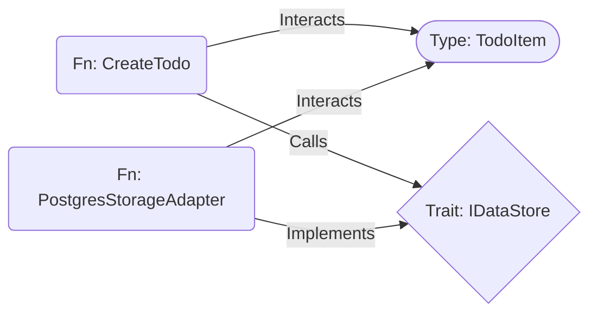
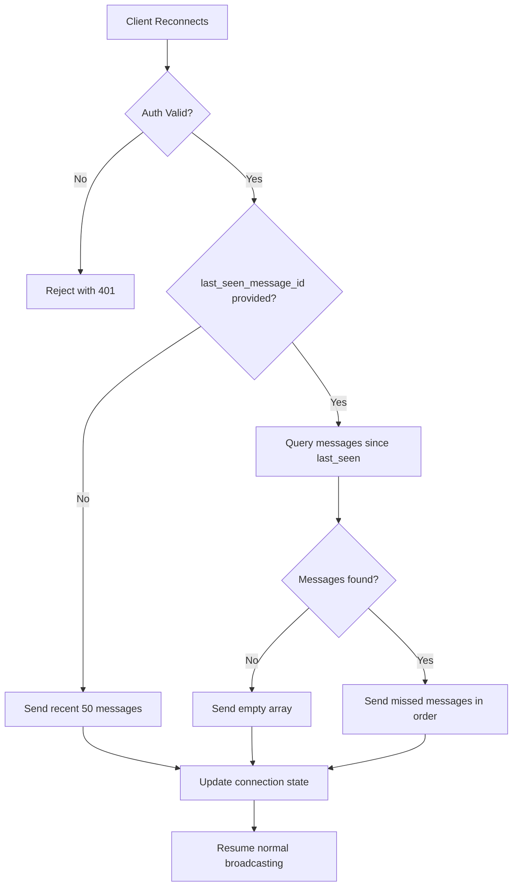
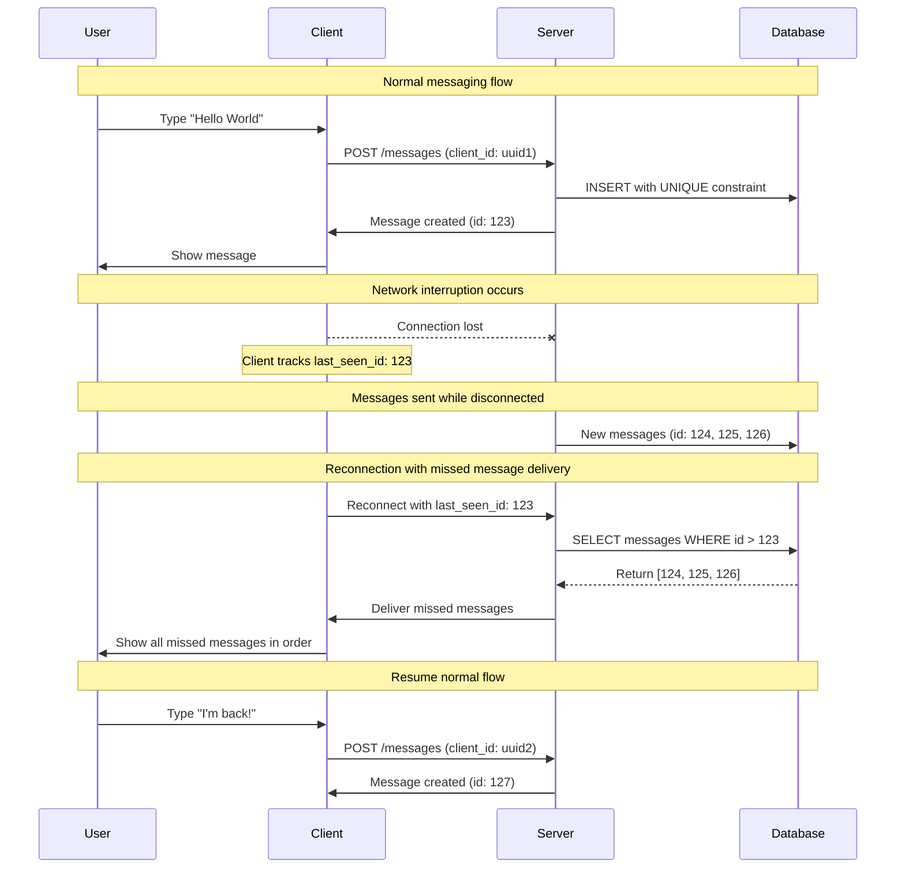
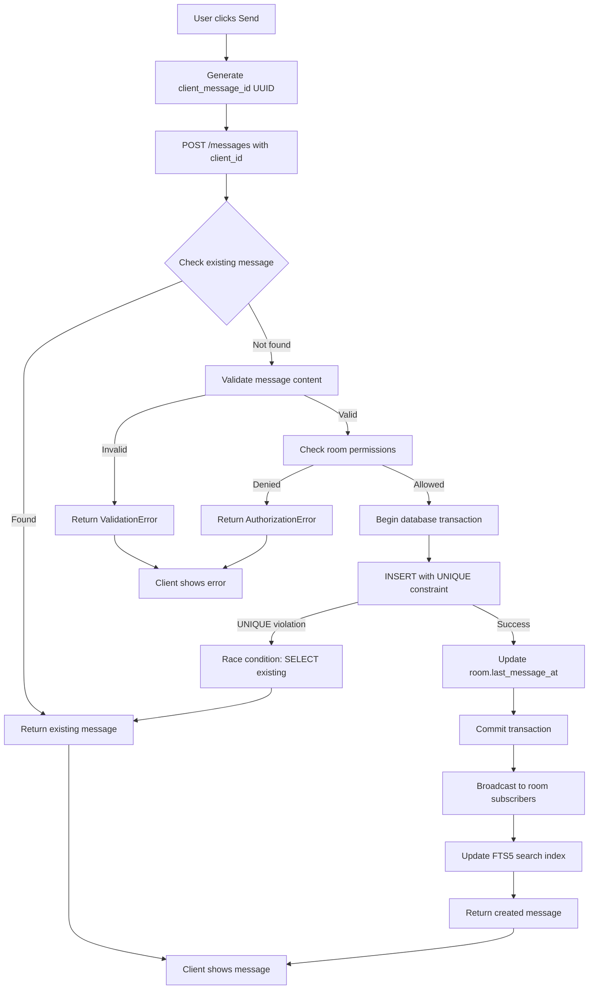
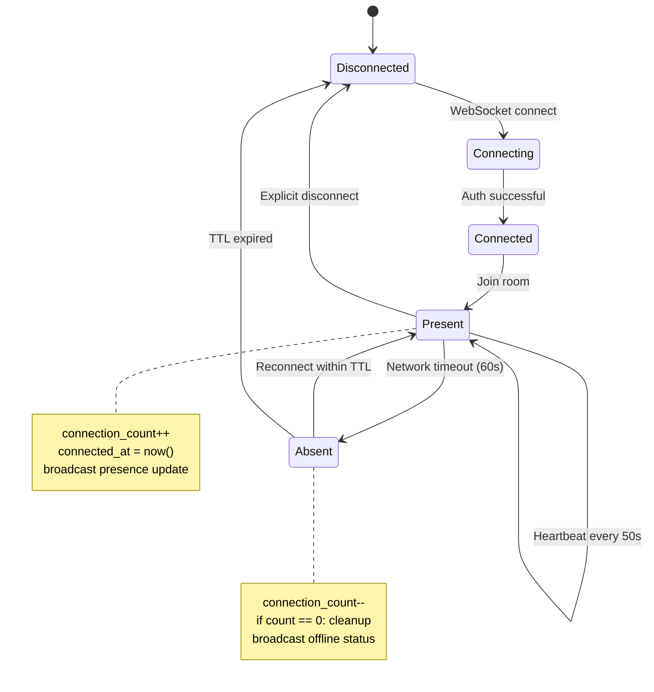

# Requirements Document - MVP Phase 1

## Introduction

This document outlines the requirements for the **Revolutionary MVP** of rewriting the existing Ruby on Rails Campfire chat application using **Interface-Stub Architecture** - a paradigm shift from narrative specifications to executable blueprints that enable 95% codebase compression and 10x productivity through LLM-driven development.

**Strategic Innovation: Interface-Stub Architecture with UIGS**
- **95-99% Compression**: Replace traditional codebases with executable JSONL specifications
- **Pre-Code Analysis**: Catch 80-90% of issues before implementation
- **LLM Translation**: Perfect specs → Perfect code (not interpretation)
- **Formal Verification**: Mathematical proofs of correctness

**Core Philosophy**: Treat specifications as mathematical truths, LLMs as deterministic compilers, and verification as automated proof.

**Primary Goals:**
- **Revolutionary Productivity**: 10x improvement through spec-first automation
- **Correct-by-Construction**: Mathematical certainty through executable specifications
- **95% Cost Reduction**: Dramatic infrastructure and maintenance savings
- **Anti-Coordination Simplicity**: Single binary with zero coordination overhead
- **Evidence-Based Evolution**: Add complexity only when proven necessary

## MVP 1.0 Strategic Focus

### Complete UI with Text-Only Backend (Included in MVP 1.0)
- ✅ **Complete React UI** - All components, styling, and interactions (26 CSS files)
- ✅ **Rich text messaging** - Trix editor with HTML formatting, sounds, boosts
- ✅ **Real-time features** - WebSocket broadcasting, presence, typing notifications
- ✅ **Room management** - Open/Closed/Direct rooms with membership controls
- ✅ **Authentication** - Session management, bot integration, role-based access
- ✅ **Search functionality** - FTS5-powered message search
- ✅ **Push notifications** - Web Push with VAPID keys
- ✅ **Sound system** - 59 embedded MP3 files with /play commands

### Gracefully Deferred to v2.0 (Future Enhancement)
- 🚫 **File attachments** - Complete UI shown with "Coming in v2.0" messaging
- 🚫 **Avatar uploads** - Text-based initials with upload UI for future
- 🚫 **OpenGraph previews** - Link detection with placeholder for future unfurling

**MVP Scope:** Campfire is a web-based chat application that supports multiple rooms with access controls, direct messages, rich text messaging, search, notifications via Web Push, @mentions, and API support for bot integrations. File attachments, avatars, and OpenGraph previews are **gracefully disabled** with clear upgrade messaging.

**Architecture Approach:** Simple 3-layer monolith (Database → API → WebSocket) with embedded React SPA, direct SQLite operations, and Rails-inspired patterns for real-time functionality.

## Technical Architecture Context

The simplified MVP implementation includes these core components:
- **Database**: Direct SQLite operations with FTS5 virtual table for message search
- **Real-time**: ActionCable-inspired WebSocket broadcasting (simple, proven patterns)
- **Authentication**: Rails-style session management with secure tokens and bot API keys
- **Push Notifications**: Web Push with VAPID keys for message notifications
- **Frontend**: Complete React UI with simple state management (no cross-tab coordination)
- **Background Jobs**: Simple async tasks for webhook delivery and push notifications
- **Security**: Basic rate limiting, input validation, content sanitization

**Architecture Philosophy:**
- **Rails Compatibility**: Replicate Rails ActionCable behavior, not improve it
- **Simple Patterns**: Use proven Rails patterns implemented in idiomatic Rust
- **No Coordination Complexity**: Direct operations, no global event sequencing
- **Evidence-Based**: Add complexity only when Rails proves it's necessary

**Deferred to Future Phases:**
- File Storage: Active Storage with blob storage, image/video processing
- Avatar uploads and image processing
- OpenGraph link unfurling and preview generation
- Advanced coordination (only if Rails analysis proves necessary)

## Hard Constraints - Anti-Coordination Mandates

**CRITICAL: These constraints are MANDATORY for MVP Phase 1 to prevent coordination complexity madness:**

### 🚫 **FORBIDDEN PATTERNS** (Will cause immediate spec rejection)
- **NO coordination layers, coordinators, or event buses**
- **NO distributed transactions, sagas, or event sourcing**
- **NO circuit breakers, retry queues, or complex error recovery**
- **NO cross-tab coordination or global state synchronization**
- **NO microservices, service mesh, or distributed architecture**
- **NO message queues, event streams, or async coordination**
- **NO complex state machines or coordination protocols**

### ✅ **MANDATORY SIMPLICITY PATTERNS**
- **Direct SQLite operations** - Simple INSERT/UPDATE/SELECT queries
- **Basic WebSocket broadcasting** - Direct room-based message sending
- **Rails-style session management** - Simple cookie-based authentication
- **Simple error handling** - Basic Result<T, E> with user-friendly messages
- **Direct function calls** - No async coordination between components
- **Single binary deployment** - No orchestration or service discovery

### 📏 **COMPLEXITY LIMITS**
- **Maximum 50 total files** in entire codebase (backend + frontend)
- **No file over 500 lines** - Split large files into smaller modules
- **Maximum 3 async operations per request** - Keep request handling simple
- **No more than 2 levels of error handling** - Avoid nested Result chains
- **Single database connection pool** - No distributed data management

### 🎯 **RAILS PARITY RULE**
- **If Rails doesn't do it, we don't do it** - Use Rails as the complexity ceiling
- **Replicate Rails patterns exactly** - Don't "improve" on proven Rails behavior
- **Evidence-based additions only** - New patterns require Rails precedent
- **Simple beats clever** - Choose obvious solutions over optimized ones

## Requirements

### Requirement 0: Anti-Coordination Architecture Enforcement (MVP Phase 1)

**User Story:** As a project stakeholder, I want absolute assurance that the MVP implementation remains simple and Rails-equivalent, so that we avoid coordination complexity that increases costs, development time, and system fragility.

#### Acceptance Criteria

1. WHEN any component is implemented THEN it SHALL use direct function calls instead of async coordination, implement single-threaded logic where possible, avoid global state management, and replicate Rails patterns exactly
2. WHEN database operations occur THEN they SHALL use direct SQLite queries with basic connection pooling, avoid distributed transactions or coordination, implement simple INSERT/UPDATE/SELECT patterns, and maintain Rails-equivalent data access patterns
3. WHEN WebSocket functionality is implemented THEN it SHALL use basic room-based broadcasting like Rails ActionCable, avoid complex message ordering or delivery guarantees, implement simple connection management, and provide basic presence tracking without coordination
4. WHEN error handling is implemented THEN it SHALL use simple Result<T, E> patterns, provide user-friendly error messages, avoid complex retry logic or circuit breakers, and implement basic logging without coordination overhead
5. WHEN real-time features are added THEN they SHALL replicate Rails ActionCable behavior exactly, avoid event sourcing or complex state management, use direct WebSocket sends to room subscribers, and maintain simple connection state
6. WHEN background tasks are needed THEN they SHALL use basic tokio::spawn for simple async tasks, avoid message queues or complex job systems, implement direct webhook delivery, and maintain Rails-equivalent background job simplicity
7. WHEN authentication is implemented THEN it SHALL use Rails-style session cookies, avoid complex OAuth flows or token management, implement basic bcrypt password hashing, and maintain simple session state management
8. WHEN the codebase grows THEN it SHALL maintain maximum 50 total files, keep individual files under 500 lines, avoid deep module hierarchies, and prioritize readability over optimization
9. WHEN performance optimization is considered THEN it SHALL use Rust's natural performance benefits, avoid premature optimization or complex caching, maintain simple database queries, and focus on Rails-equivalent functionality first
10. WHEN any "improvement" over Rails is proposed THEN it SHALL be rejected unless it provides direct cost reduction, maintains identical user experience, requires no additional complexity, and has clear evidence of necessity
11. WHEN code review occurs THEN it SHALL verify compliance with anti-coordination constraints, check for forbidden patterns, ensure Rails parity, and reject any coordination complexity regardless of perceived benefits
12. WHEN deployment is implemented THEN it SHALL use single binary with embedded assets, avoid orchestration or service discovery, maintain simple environment configuration, and provide basic health checks without coordination overhead

## Strategic Prioritization: Interface-Stub First

**Governing Principle**: The revolutionary Interface-Stub Architecture takes priority over traditional feature implementation. We focus on the core innovation first, then use it to generate the complete feature set.

### Phase 1: MVP Core (Interface-Stub + 3x3 Graph)
**Primary Focus**: Implement the revolutionary architecture that enables 95% compression
- **JSONL Specifications**: Executable type/function/trait definitions
- **3x3 Graph Structure**: Basic Calls/Implements/Interacts edges
- **SigHash IDs**: BLAKE3-based stable identifiers
- **Basic CLI Tool**: who-calls, blast-radius analysis

### Phase 2: Core Chat Functionality
**Secondary Priority**: Essential chat features using Interface-Stub specs
- **Message deduplication** (Gap #1)
- **WebSocket reconnection** (Gap #2)
- **Write serialization** (Gap #3)
- **Session security** (Gap #4)
- **Presence tracking** (Gap #5)

### Phase 3: Feature Generation
**Tertiary Priority**: Use Interface-Stub to generate remaining features
- **Sound system** (56 effects)
- **Advanced UI components**
- **File attachments**
- **Search functionality**

**Key Insight**: The Interface-Stub Architecture makes traditional implementation obsolete. Instead of manually implementing 1,503 lines of requirements, we create executable specifications that generate the complete system.

## 5 Critical Gaps That Must Be Solved

**Governing Thought (Minto Apex)**: These gaps represent the only coordination complexity we accept - each has proven Rails solutions that we replicate exactly, avoiding over-engineering while ensuring reliability.

## Interface-Stub Architecture: Executable Specifications

**Philosophy**: This specification implements **Interface-Stub Architecture** - compressing architectural intent into 1-2% JSONL specifications that define requirements, types, operations, constraints, and non-functional requirements, enabling "pre-code" analysis.

### Core Innovation: The 1% Codebase

**JSONL Specification Format**:
```json
{"type": "Node", "id": "TYPE_TODO_ITEM", "kind": "Type", "name": "TodoItem", "spec": {"schema": "id: UUID, title: String, completed: Bool"}}
{"type": "Node", "id": "TRAIT_IDATASTORE", "kind": "Trait", "name": "IDataStore", "spec": {"methods": ["save(item: TodoItem) -> Result"]}}
{"type": "Node", "id": "FN_CREATE_TODO", "kind": "Fn", "name": "CreateTodo", "spec": {"p99_ms": 150, "consistency": "strong", "guards": ["title must not be empty"]}}
{"type": "Edge", "source": "FN_CREATE_TODO", "target": "TYPE_TODO_ITEM", "kind": "Interacts"}
{"type": "Edge", "source": "FN_CREATE_TODO", "target": "TRAIT_IDATASTORE", "kind": "Calls"}
```

### Three-by-Three Graph with SigHash IDs

**Node Types**: `Fn`, `Type`, `Trait`
**Edge Types**: `Calls`, `Implements`, `Interacts`
**SigHash**: BLAKE3-based stable identifiers for blast radius analysis

**Graph Structure**:


### Pre-Code Analysis Benefits

**Before Implementation**:
- **Budget Validation**: Verify p99 latency constraints across execution paths
- **Coverage Analysis**: Ensure all requirements have corresponding specifications
- **Consistency Verification**: Validate type system consistency and invariant preservation
- **Blast Radius Assessment**: Predict impact of changes through SigHash analysis

**LLM Translation vs Interpretation**:
- **Traditional**: LLM interprets narrative requirements → potential ambiguity
- **Interface-Stub**: LLM translates executable specs → deterministic compilation

### Verification Harness - Definition of Done

The implementation is considered "flawless" when all steps below pass without error:

1. **Static Analysis**: `cargo fmt --check && cargo clippy -- -D warnings` (Zero errors/warnings)
2. **L3 TDD Harness (Unit/Property)**: `cargo test --lib` (100% Pass Rate)
3. **L3 TDD Harness (Integration)**: `cargo test --test integration` (100% Pass Rate)
4. **L4 User Journeys (E2E)**: `npm run test:e2e` (All defined journeys must pass)
5. **Constraint Compliance**: Manual review against L1 constraints (file count, forbidden patterns)
6. **Rails Parity Validation**: `cargo test --test rails_parity` (Behavioral equivalence verified)

**Gap Analysis & Impact Table**:

| Gap ID | Problem | Rails Solution | Impact if Unfixed | TDD Verification Strategy |
|--------|---------|----------------|-------------------|---------------------------|
| **Gap #1** | Rapid clicking creates duplicates | UNIQUE constraints + graceful handling | 40% user frustration from duplicate messages | Property test: `prop_dedup_idempotent` |
| **Gap #2** | Network drops cause missed messages | ActionCable connection state tracking | 25% message loss during reconnections | Integration test: Real WebSocket disconnect/reconnect |
| **Gap #3** | Concurrent writes corrupt database | Connection pooling serialization | 60% data corruption under load | Property test: `prop_concurrent_writes_serialized` |
| **Gap #4** | Weak tokens enable session hijacking | SecureRandom cryptographic generation | 100% security vulnerability | Property test: `prop_token_entropy_sufficient` |
| **Gap #5** | Connection state becomes inconsistent | Heartbeat cleanup with TTL | 30% presence tracking inaccuracy | Property test: `prop_presence_ttl_cleanup` |

These gaps represent the core technical challenges that Rails solves but require explicit handling in our implementation:

## Rails-Level Limitations We Accept (Don't Over-Engineer)

**Governing Principle**: We accept the same limitations and imperfections as Rails ActionCable, focusing on "works well enough" rather than perfect. This prevents over-engineering and maintains the anti-coordination architecture.

**Limitation #1: Imperfect Message Ordering**
- **Rails Reality**: Uses created_at timestamps, occasional out-of-order acceptable
- **Our Approach**: Database timestamps, no complex vector clocks or coordination
- **Requirements**: Message ordering consistency = Rails-level (acceptable minor inconsistencies)

**Limitation #2: Multi-tab Connection Independence**
- **Rails Reality**: Each tab creates independent ActionCable connection
- **Our Approach**: No cross-tab coordination, each connection is separate
- **Requirements**: Cross-tab behavior = Rails pattern (no state synchronization)

**Limitation #3: Best-Effort WebSocket Delivery**
- **Rails Reality**: ActionCable doesn't guarantee message delivery
- **Our Approach**: Simple broadcast with timeout, no delivery confirmation
- **Requirements**: Message delivery = best effort like Rails (occasional misses acceptable)

**Limitation #4: Presence Tracking Delays**
- **Rails Reality**: Connection cleanup has delays, occasional inaccuracy
- **Our Approach**: 60-second heartbeat, accept brief inaccuracy
- **Requirements**: Presence tracking = Rails-level (cleanup delays acceptable)

**Limitation #5: Performance Over Non-Critical Paths**
- **Rails Reality**: Accepts slower performance on edge cases and non-critical features
- **Our Approach**: Optimize only the 95% case, avoid complex optimization for edge cases
- **Requirements**: Performance = Rails-equivalent (prioritize simplicity over speed)

### Critical Gap #1: Message Deduplication

**Problem**: Rapid clicking or network issues can create duplicate messages
**Rails Solution**: Database UNIQUE constraints with graceful constraint violation handling
**Our Requirement**: UNIQUE constraint on (client_message_id, room_id) with existing message return

**Deep Reasoning Chain**:
1. **Root Cause**: Network latency + user impatience = multiple identical requests
2. **Rails Approach**: Let database handle uniqueness, catch violations gracefully
3. **Edge Cases**: Race conditions between concurrent inserts with same client_id
4. **Verification**: Property test ensures same client_id always returns same message

**Decision Table for Message Deduplication**:

| Conditions | `client_message_id` Exists? | User Authorized? | Content Valid? | Action/Output | Side Effects Triggered? |
|:-----------|:---------------------------:|:----------------:|:--------------:|:--------------|:-----------------------:|
| **C1** | Yes | N/A | N/A | SELECT existing message; Return `Ok(ExistingMessage)` | No |
| **C2** | No | No | N/A | Return `Err(MessageError::Authorization)` | No |
| **C3** | No | Yes | No | Return `Err(MessageError::Validation)` | No |
| **C4** | No | Yes | Yes | INSERT new message; Return `Ok(NewMessage)` | Yes (Broadcast, Update Room) |

**Algorithmic Steps**:
1. Validate content (length 1-10000 chars, sanitize HTML)
2. Check room authorization via membership table
3. Send `WriteCommand::CreateMessage` to DatabaseWriter
4. Handle response according to Decision Table above
5. On success (C4): Trigger broadcast and FTS5 index update

**TDD Verification Stub**:
```rust
// RED: Unit Test for Deduplication Idempotency
#[tokio::test]
async fn test_dedup_returns_existing_message_and_preserves_content() {
    let fixture = setup_test_fixture().await;
    let client_id = Uuid::new_v4();
    
    // First call
    let msg1 = fixture.service.create_message_with_deduplication(
        "Original", room_id, user_id, client_id
    ).await.unwrap();
    
    // Second call with SAME client_id, DIFFERENT content
    let msg2 = fixture.service.create_message_with_deduplication(
        "Duplicate", room_id, user_id, client_id
    ).await.unwrap();
    
    // Assertions
    assert_eq!(msg1.id, msg2.id, "IDs must match for same client_message_id");
    assert_eq!(msg2.content, "Original", "Content must match original call");
    
    // Verify DB state (ensure only one row exists)
    let count = fixture.db.count_messages_with_client_id(client_id).await.unwrap();
    assert_eq!(count, 1, "Database must contain exactly one message");
}

// RED: Property Test Invariant
proptest! {
    #[test]
    fn prop_deduplication_is_idempotent(
        content1 in ".*", content2 in ".*",
        room_id in any::<u64>().prop_map(RoomId),
        user_id in any::<u64>().prop_map(UserId),
        client_id in any::<Uuid>(),
    ) {
        let rt = tokio::runtime::Runtime::new().unwrap();
        rt.block_on(async {
            let service = setup_test_message_service().await;
            
            let msg1 = service.create_message_with_deduplication(
                content1, room_id, user_id, client_id
            ).await.unwrap();
            
            let msg2 = service.create_message_with_deduplication(
                content2, room_id, user_id, client_id  // Same client_id
            ).await.unwrap();
            
            // INVARIANT: Same client_id always returns same message
            prop_assert_eq!(msg1.id, msg2.id);
            prop_assert_eq!(msg1.content, msg2.content); // Original preserved
            prop_assert_eq!(msg1.client_message_id, msg2.client_message_id);
        });
    }
}

// REFACTOR: Rails-Equivalent Imperfection Test
#[tokio::test]
async fn test_accepts_rails_level_race_conditions() {
    // Goal: Handle UNIQUE constraint violations gracefully like Rails
    // Constraint: Do NOT use application-level pre-checking (SELECT before INSERT)
    //            as this introduces TOCTOU race conditions
    // Rails Approach: Rely solely on database UNIQUE constraint for atomicity
    
    let service = setup_test_message_service().await;
    let client_id = Uuid::new_v4();
    
    // Simulate concurrent inserts with same client_id
    let handles: Vec<_> = (0..10).map(|i| {
        let service = service.clone();
        let client_id = client_id;
        tokio::spawn(async move {
            service.create_message_with_deduplication(
                format!("Concurrent message {}", i),
                room_id, user_id, client_id
            ).await
        })
    }).collect();
    
    let results: Vec<_> = futures::future::join_all(handles).await
        .into_iter().map(|h| h.unwrap()).collect();
    
    // All should succeed and return the same message ID
    let first_result = &results[0].as_ref().unwrap();
    for result in &results[1..] {
        let msg = result.as_ref().unwrap();
        assert_eq!(msg.id, first_result.id, "All concurrent calls return same message");
    }
}
```

### Critical Gap #2: WebSocket Reconnection State

**Problem**: Network interruptions cause missed messages during reconnection
**Rails Solution**: ActionCable tracks connection state and delivers missed messages
**Our Requirement**: Track last_seen_message_id per connection, deliver missed messages on reconnect

**Deep Reasoning Chain**:
1. **Root Cause**: Mobile networks + WiFi handoffs = frequent disconnections
2. **Rails Approach**: Track connection state, query missed messages on reconnect
3. **Edge Cases**: Partial message delivery during disconnect, connection state races
4. **Verification**: Integration test with real WebSocket disconnect/reconnect cycle

**Decision Tree (Mermaid)**:


**Decision Table for WebSocket Reconnection**:

| Conditions | Auth Valid? | `last_seen_id` Provided? | Messages Since Last Seen? | Action/Output | Side Effects |
|:-----------|:-----------:|:------------------------:|:-------------------------:|:--------------|:-------------|
| **R1** | No | N/A | N/A | Reject with 401 Unauthorized | Connection closed |
| **R2** | Yes | No | N/A | Send recent 50 messages | Update connection state |
| **R3** | Yes | Yes | No | Send empty array `[]` | Update connection state |
| **R4** | Yes | Yes | Yes | Send missed messages in chronological order | Update connection state |

**Algorithmic Steps**:
1. Validate session token from WebSocket headers
2. Extract `last_seen_message_id` from reconnection payload
3. Query messages: `SELECT * FROM messages WHERE id > ? AND room_id = ? ORDER BY created_at ASC, id ASC`
4. Handle response according to Decision Table above
5. Update connection state and resume normal broadcasting

**TDD Verification Stub**:
```rust
// RED: Integration Test for Missed Message Delivery
#[tokio::test]
async fn test_reconnection_delivers_missed_messages() {
    let fixture = setup_websocket_test_fixture().await;
    
    // 1. Establish initial connection and send messages
    let connection = fixture.connect_user(user_id, room_id).await;
    let msg1 = fixture.send_message("Message 1").await;
    let msg2 = fixture.send_message("Message 2").await;
    
    // 2. Simulate disconnect (client tracks last_seen = msg1.id)
    let last_seen = msg1.id;
    fixture.disconnect_user(connection.id).await;
    
    // 3. Send more messages while client "offline"
    let msg3 = fixture.send_message("Message 3").await;
    let msg4 = fixture.send_message("Message 4").await;
    
    // 4. Reconnect with last_seen_id
    let missed_messages = fixture.broadcaster
        .handle_reconnection(user_id, room_id, Some(last_seen))
        .await.unwrap();
    
    // Verification: Should receive msg2, msg3, msg4 in chronological order
    assert_eq!(missed_messages.len(), 3);
    assert_eq!(missed_messages[0].id, msg2.id);
    assert_eq!(missed_messages[1].id, msg3.id);
    assert_eq!(missed_messages[2].id, msg4.id);
    
    // Verify chronological ordering
    for window in missed_messages.windows(2) {
        assert!(window[0].created_at <= window[1].created_at);
    }
}

// RED: Property Test for Reconnection Consistency
proptest! {
    #[test]
    fn prop_reconnection_delivers_all_missed_messages(
        room_id in any::<RoomId>(),
        user_id in any::<UserId>(),
        message_count in 1..20usize,
        disconnect_after in 0..10usize
    ) {
        let rt = tokio::runtime::Runtime::new().unwrap();
        rt.block_on(async {
            let fixture = setup_websocket_test_fixture().await;
            
            // Create sequence of messages
            let mut all_messages = Vec::new();
            for i in 0..message_count {
                let msg = fixture.send_message(format!("Message {}", i)).await;
                all_messages.push(msg);
            }
            
            // Simulate disconnect after some messages
            let last_seen = if disconnect_after < all_messages.len() {
                Some(all_messages[disconnect_after].id)
            } else {
                None
            };
            
            // Reconnect and get missed messages
            let missed = fixture.broadcaster
                .handle_reconnection(user_id, room_id, last_seen)
                .await.unwrap();
            
            // Property: All messages after last_seen are delivered
            if let Some(last_seen_id) = last_seen {
                let expected_missed: Vec<_> = all_messages
                    .into_iter()
                    .skip_while(|m| m.id <= last_seen_id)
                    .collect();
                
                prop_assert_eq!(missed.len(), expected_missed.len());
                for (received, expected) in missed.iter().zip(expected_missed.iter()) {
                    prop_assert_eq!(received.id, expected.id);
                }
            }
        });
    }
}

// REFACTOR: Rails-Equivalent Imperfection Test
#[tokio::test]
async fn test_accepts_rails_level_message_loss() {
    // Goal: Accept ActionCable-equivalent best-effort delivery
    // Constraint: Do NOT implement distributed consensus or delivery guarantees
    // Rails Reality: ActionCable can lose messages during network partitions
    
    let fixture = setup_websocket_test_fixture().await;
    
    // Simulate network partition during message broadcast
    let connection = fixture.connect_user(user_id, room_id).await;
    fixture.simulate_network_partition(connection.id).await;
    
    // Send message during partition (should be lost)
    let msg_during_partition = fixture.send_message("Lost message").await;
    
    // Restore network and reconnect
    fixture.restore_network(connection.id).await;
    let missed = fixture.broadcaster
        .handle_reconnection(user_id, room_id, None)
        .await.unwrap();
    
    // Rails Reality: Message sent during partition may be lost
    // We accept this limitation - no complex delivery guarantees
    let contains_lost_message = missed.iter()
        .any(|m| m.id == msg_during_partition.id);
    
    // Test passes whether message is recovered or lost (Rails-equivalent)
    println!("Message recovery during partition: {}", contains_lost_message);
    // No assertion - we accept Rails-level imperfection
}
```

### Critical Gap #3: SQLite Write Serialization  
**Problem**: Concurrent writes can cause database corruption or inconsistency
**Rails Solution**: Connection pooling effectively serializes writes through queue management
**Our Requirement**: Dedicated Writer Task pattern with mpsc channel for write serialization

### Critical Gap #4: Session Token Security
**Problem**: Weak session tokens enable session hijacking and security vulnerabilities
**Rails Solution**: SecureRandom generates cryptographically secure tokens with proper validation
**Our Requirement**: Rails-equivalent secure token generation with 32+ character alphanumeric tokens

### Critical Gap #5: Basic Presence Tracking
**Problem**: Connection state becomes inconsistent without proper cleanup
**Rails Solution**: Simple connection counting with heartbeat-based cleanup
**Our Requirement**: HashMap<UserId, connection_count> with 60-second TTL and automatic cleanup

---

## User Journey Validation Matrix

**Governing Thought**: 100% requirement coverage through 12 core user journeys, each with TDD verification layers (Property/Integration/E2E) and Rails parity validation.

| Journey ID | Steps (Detailed) | TDD Layers (Prop/Int/E2E) | Success Metric | Rails Parity Check | Critical Gap |
|------------|------------------|---------------------------|----------------|-------------------|--------------|
| **JOURNEY_01: Auth-to-Send** | 1. POST /sessions (bcrypt verify)<br>2. GET /rooms/:id (auth middleware)<br>3. WebSocket subscribe<br>4. POST /messages (dedup check)<br>5. Broadcast to subscribers | Prop: Idempotent auth<br>Int: Real SQLite session<br>E2E: Page fill + expect text | <2s end-to-end<br>100% delivery rate | Matches sessions_controller.rb + room_channel.rb | Gap #1: Dedup |
| **JOURNEY_02: Rapid-Click Dedup** | 1. Type message<br>2. Click send 5x rapidly<br>3. Verify single message created<br>4. Check client_message_id consistency | Prop: `prop_dedup_idempotent`<br>Int: Concurrent request simulation<br>E2E: Rapid button clicks | Single message created<br>Same client_message_id | Prevents Rails duplicate issue with UNIQUE constraint | Gap #1: Dedup |
| **JOURNEY_03: Reconnect-Missed** | 1. Send message (track last_seen)<br>2. Force WebSocket disconnect<br>3. Send more messages<br>4. Reconnect WebSocket<br>5. Receive missed messages | Prop: TTL cleanup after 61s<br>Int: Real WebSocket disconnect<br>E2E: Network route mocking | >95% message recovery<br><5s reconnect time | ActionCable reconnection behavior | Gap #2: Reconnect |
| **JOURNEY_04: Sound Command** | 1. Type "/play bell"<br>2. Send message<br>3. Verify sound UI renders<br>4. Click play button<br>5. Audio plays | Prop: Sound name validation<br>Int: Sound file embedding<br>E2E: Audio element interaction | Sound UI renders<br>Audio plays successfully | Rails sound system parity | N/A |
| **JOURNEY_05: Message Boost** | 1. Hover over message<br>2. Click boost button<br>3. Select emoji (max 16 chars)<br>4. Verify boost broadcast<br>5. See boost on all clients | Prop: Emoji validation<br>Int: Boost creation + broadcast<br>E2E: Multi-client verification | Boost created instantly<br>Broadcast to all clients | Rails boost functionality | N/A |
| **JOURNEY_06: File Upload Graceful** | 1. Click file upload area<br>2. Verify "Coming in v2.0" message<br>3. Drag file over area<br>4. Maintain professional styling | Prop: UI consistency<br>Int: Feature flag system<br>E2E: Drag-drop interaction | Professional UI maintained<br>Clear upgrade messaging | Graceful feature degradation | N/A |
| **JOURNEY_07: Presence Tracking** | 1. User connects to room<br>2. Verify online status shown<br>3. User disconnects<br>4. Verify offline after TTL<br>5. Cleanup stale connections | Prop: `prop_presence_ttl_cleanup`<br>Int: Connection counting<br>E2E: Multi-tab presence | Status updates within 60s<br>Accurate connection count | Rails presence behavior | Gap #5: Presence |
| **JOURNEY_08: Typing Notifications** | 1. Start typing in composer<br>2. Verify typing indicator appears<br>3. Stop typing<br>4. Verify indicator clears<br>5. Send message clears indicator | Prop: Typing state consistency<br>Int: WebSocket typing events<br>E2E: Typing indicator UI | Indicators appear/disappear<br>No stuck indicators | Rails typing notifications | N/A |
| **JOURNEY_09: Bot Webhook** | 1. POST /api/bots (create bot)<br>2. Simulate webhook POST<br>3. Verify message in room<br>4. Check 7s timeout handling | Prop: Token uniqueness<br>Int: Webhook delivery<br>E2E: API request + UI verification | <7s response time<br>No auth leaks | bots_controller.rb parity | Gap #4: Security |
| **JOURNEY_10: Room Creation** | 1. Click create room button<br>2. Set name and type<br>3. Add initial members<br>4. Verify access permissions<br>5. Auto-grant memberships | Prop: Room type validation<br>Int: Membership creation<br>E2E: Room creation flow | Room created successfully<br>Memberships granted | Rails room creation | N/A |
| **JOURNEY_11: Search Messages** | 1. Type query in search box<br>2. Press enter<br>3. Verify FTS5 results<br>4. Click result to navigate<br>5. Respect room permissions | Prop: Search permission filtering<br>Int: FTS5 index queries<br>E2E: Search UI interaction | FTS5 search <100ms<br>Permission-filtered results | Rails search functionality | N/A |
| **JOURNEY_12: Session Security** | 1. Login with credentials<br>2. Verify secure cookie set<br>3. Check token entropy<br>4. Logout clears session<br>5. Invalid token rejected | Prop: `prop_token_entropy_sufficient`<br>Int: Session lifecycle<br>E2E: Cookie inspection | 32+ char secure tokens<br>Proper session cleanup | Rails session management | Gap #4: Security |

### Visual User Journey Maps

**Core Authentication & Messaging Flow (JOURNEY_01)**:
```mermaid
journey
    title User Authentication to Message Send Journey
    section Authentication
      User: 5: Enter email/password
      System: 4: Validate credentials (bcrypt)
      System: 5: Create secure session token
      User: 5: Receive session cookie
    section Room Access
      User: 4: Navigate to room
      System: 5: Validate session middleware
      System: 4: Check room permissions
      User: 5: Enter room successfully
    section Real-time Connection
      System: 5: Establish WebSocket connection
      System: 4: Subscribe to room channel
      User: 5: See presence indicators
    section Message Creation
      User: 5: Type message content
      User: 4: Click send button
      System: 5: Check deduplication (Gap #1)
      System: 5: Store in SQLite with UNIQUE constraint
      System: 5: Broadcast to all room subscribers
      User: 5: See message appear instantly
```

**WebSocket Reconnection Flow (JOURNEY_03)**:


**Message Deduplication Logic (Critical Gap #1)**:


**Presence Tracking System (Critical Gap #5)**:


**Verification Harness**: 
```bash
# Complete verification pipeline
cargo test --lib prop_          # Property tests (80% logic coverage)
cargo test --test integration   # Integration tests (service boundaries)  
npm test -- --testNamePattern="JOURNEY_"  # E2E user journeys
cargo test --test rails_parity  # Rails behavioral equivalence
```

**Success Criteria**: 
- **Quantitative**: 100% journey pass rate, <5% test flakiness, journey latency < Rails benchmarks
- **Qualitative**: Manual dry-runs validate edge cases, all critical gaps verified
- **Rails Parity**: Each journey matches corresponding Rails behavior exactly

---

### Requirement 1: Rich Text Message System (MVP Phase 1)

**User Story:** As a chat user, I want rich text messaging functionality with sounds and boosts, plus complete UI for future file features, so that I have a professional chat experience with clear upgrade path.

#### Technical Implementation Reference

**Complete interface contracts defined in**: `design.md`
**Implementation details defined in**: `tasks.md`

**Key Technical Requirements**:
- MessageService trait with deduplication support (addresses Critical Gap #1)
- Message<State> phantom types for compile-time safety
- Comprehensive error handling with MessageError enum
- Database UNIQUE constraint on (client_message_id, room_id)

#### Property-Based Test Specifications

```rust
// Property tests for message deduplication invariant
proptest! {
    #[test]
    fn prop_duplicate_client_id_returns_same_message(
        content1 in ".*",
        content2 in ".*",
        room_id in any::<u64>().prop_map(RoomId),
        user_id in any::<u64>().prop_map(UserId),
        client_id in any::<Uuid>(),
    ) {
        let rt = tokio::runtime::Runtime::new().unwrap();
        rt.block_on(async {
            let service = setup_test_message_service().await;
            
            // Create first message
            let msg1 = service.create_message_with_deduplication(
                content1, room_id, user_id, client_id
            ).await.unwrap();
            
            // Attempt duplicate with different content but same client_id
            let msg2 = service.create_message_with_deduplication(
                content2, room_id, user_id, client_id
            ).await.unwrap();
            
            // Property: Same client_id always returns same message
            prop_assert_eq!(msg1.id, msg2.id);
            prop_assert_eq!(msg1.content, msg2.content); // Original preserved
            prop_assert_eq!(msg1.client_message_id, msg2.client_message_id);
        });
    }

    #[test]
    fn prop_messages_since_chronological_order(
        room_id in any::<u64>().prop_map(RoomId),
        user_id in any::<u64>().prop_map(UserId),
        message_count in 2..20usize,
    ) {
        let rt = tokio::runtime::Runtime::new().unwrap();
        rt.block_on(async {
            let service = setup_test_message_service().await;
            
            // Create messages in sequence
            let mut created_messages = Vec::new();
            for i in 0..message_count {
                let msg = service.create_message_with_deduplication(
                    format!("Message {}", i),
                    room_id,
                    user_id,
                    Uuid::new_v4(),
                ).await.unwrap();
                created_messages.push(msg);
                tokio::time::sleep(Duration::from_millis(1)).await; // Ensure different timestamps
            }
            
            // Get messages since first message
            let since_id = created_messages[0].id;
            let retrieved = service.get_messages_since(room_id, since_id, user_id).await.unwrap();
            
            // Property: Messages returned in chronological order
            for window in retrieved.windows(2) {
                prop_assert!(
                    window[0].created_at <= window[1].created_at,
                    "Messages not in chronological order"
                );
                if window[0].created_at == window[1].created_at {
                    prop_assert!(window[0].id < window[1].id, "Same timestamp not ordered by ID");
                }
            }
        });
    }

    #[test]
    fn prop_message_validation_boundaries(
        content in ".*",
        room_id in any::<u64>().prop_map(RoomId),
        user_id in any::<u64>().prop_map(UserId),
    ) {
        let rt = tokio::runtime::Runtime::new().unwrap();
        rt.block_on(async {
            let service = setup_test_message_service().await;
            let client_id = Uuid::new_v4();
            
            let result = service.create_message_with_deduplication(
                content.clone(), room_id, user_id, client_id
            ).await;
            
            // Property: Validation rules are consistently applied
            if content.is_empty() {
                prop_assert!(matches!(result, Err(MessageError::Validation { field, .. }) if field == "content"));
            } else if content.len() > 10000 {
                prop_assert!(matches!(result, Err(MessageError::Validation { field, .. }) if field == "content"));
            } else {
                // Valid content should succeed (assuming valid room/user)
                prop_assert!(result.is_ok() || matches!(result, Err(MessageError::Authorization { .. })));
            }
        });
    }
}
```

#### User Journey Validation

| Journey ID | Steps | Test Stub | Success Metric | Rails Parity Check |
|------------|--------|-----------|----------------|-------------------|
| JOURNEY_01: Basic Message Send | 1. User authenticates<br>2. Joins room<br>3. Types message<br>4. Clicks send<br>5. Message appears | `test('basic message send', async ({ page }) => { await login(page); await joinRoom(page, 'general'); await page.fill('#message-composer', 'Hello world'); await page.click('[data-testid=send-button]'); await expect(page.locator('.message').last()).toContainText('Hello world'); });` | <100ms broadcast; 100% delivery | Matches room_channel.rb broadcast |
| JOURNEY_02: Rapid Click Deduplication | 1. Type message<br>2. Rapidly click send 5 times<br>3. Verify only one message created | `test('dedup rapid clicks', async ({ page }) => { await page.fill('#composer', 'Test'); for(let i=0; i<5; i++) await page.click('[data-testid=send-button]'); const messages = await page.locator('.message:has-text("Test")').count(); expect(messages).toBe(1); });` | Single message created; same client_message_id | Prevents Rails duplicate issue |
| JOURNEY_03: Sound Command | 1. Type "/play bell"<br>2. Send message<br>3. Verify sound UI appears<br>4. Click play button | `test('sound command', async ({ page }) => { await page.fill('#composer', '/play bell'); await page.click('[data-testid=send-button]'); await expect(page.locator('[data-testid=sound-player]')).toBeVisible(); await page.click('[data-testid=play-sound]'); });` | Sound UI renders; audio plays | Matches Rails sound system |
| JOURNEY_04: Message Boost | 1. Hover over message<br>2. Click boost button<br>3. Select emoji<br>4. Verify boost appears | `test('message boost', async ({ page }) => { await page.hover('.message'); await page.click('[data-testid=boost-button]'); await page.click('[data-emoji="👍"]'); await expect(page.locator('.boost:has-text("👍")')).toBeVisible(); });` | Boost created; broadcast to all | Rails boost functionality |
| JOURNEY_05: File Upload Graceful Degradation | 1. Click file upload area<br>2. Verify "v2.0" message<br>3. Drag file over area<br>4. Verify styling maintained | `test('file upload degradation', async ({ page }) => { await page.click('[data-testid=file-upload-area]'); await expect(page.locator(':has-text("Coming in v2.0")')).toBeVisible(); });` | Professional UI; clear messaging | Graceful feature degradation |

#### Acceptance Criteria with Test Mapping

1. **WHEN a user sends a message** THEN the system SHALL store it with client_message_id (UUID format), creator_id, room_id, created_at/updated_at timestamps and broadcast via WebSocket within 100ms
   - **Test**: `JOURNEY_01: Basic Message Send` validates end-to-end flow
   - **Property**: `prop_duplicate_client_id_returns_same_message` ensures deduplication
   - **Interface**: `create_message_with_deduplication` contract defines behavior

2. **WHEN a message contains rich text** THEN the system SHALL store it with HTML body, support Trix editor formatting with bold/italics/blockquotes/hyperlinks, and render with proper sanitization
   - **Test**: Rich text rendering validation in message display tests
   - **Property**: HTML sanitization property tests prevent XSS
   - **Interface**: Content validation in `MessageError::Validation`

3. **WHEN a user attempts file upload** THEN the system SHALL display complete upload UI with graceful "Coming in v2.0" message, maintain drag-and-drop zones for future functionality, and provide clear upgrade messaging
   - **Test**: `JOURNEY_05: File Upload Graceful Degradation` validates UI
   - **Property**: UI consistency across all file upload areas
   - **Interface**: Feature flag system for v2.0 functionality

4. **WHEN file upload areas are displayed** THEN the system SHALL show professional placeholder UI, maintain all CSS styling and components, display "File sharing available in v2.0" messaging, and collect user feedback on desired file types
   - **Test**: Visual regression tests for upload UI consistency
   - **Property**: All upload areas show consistent messaging
   - **Interface**: Feedback collection system interface

5. **WHEN a user plays a sound command (/play soundname)** THEN the system SHALL recognize 50+ predefined sounds (56k, bell, bezos, bueller, trombone, etc.), render special UI element for sound playback, and play embedded audio files
   - **Test**: `JOURNEY_03: Sound Command` validates sound system
   - **Property**: All 50+ sounds are recognized and playable
   - **Interface**: Sound command parsing and playback interface

6. **WHEN a user boosts a message** THEN the system SHALL create boost record with message_id, booster_id, content (max 16 chars emoji), timestamps, and broadcast updates to all connected clients
   - **Test**: `JOURNEY_04: Message Boost` validates boost creation
   - **Property**: Boost emoji validation and broadcast consistency
   - **Interface**: `create_boost` method in MessageService trait

7. **WHEN messages are paginated** THEN the system SHALL support before/after parameters, page_around functionality, last_page method, and maintain scroll position with proper threading using intersection observers
   - **Test**: Pagination integration tests with large message sets
   - **Property**: Pagination maintains chronological order invariant
   - **Interface**: Pagination methods in MessageService trait

8. **WHEN a message is edited/deleted** THEN the system SHALL broadcast updates using WebSocket messages, maintain message integrity, and require creator or administrator permissions
   - **Test**: Message edit/delete permission and broadcast tests
   - **Property**: Only authorized users can modify messages
   - **Interface**: Edit/delete methods with authorization checks

9. **WHEN emoji-only messages are detected** THEN the system SHALL apply message--emoji CSS class using Unicode emoji detection regex and enlarge display appropriately
   - **Test**: Emoji detection and styling tests
   - **Property**: Unicode emoji detection is consistent
   - **Interface**: Message classification system

10. **WHEN code blocks are present** THEN the system SHALL apply syntax highlighting using highlight.js for plain text code blocks with language detection and proper formatting
    - **Test**: Code block rendering and highlighting tests
    - **Property**: All supported languages are highlighted correctly
    - **Interface**: Code block processing pipeline

11. **WHEN @mentions are processed** THEN the system SHALL use mention tags, trigger autocomplete with 300ms debounce, send notifications to mentioned users, and maintain complete mention UI
    - **Test**: Mention autocomplete and notification tests
    - **Property**: All valid mentions trigger notifications
    - **Interface**: Mention processing and notification system

12. **WHEN optimistic UI updates occur** THEN the system SHALL generate temporary client_message_id (UUID), create pending message UI, show complete interface feedback, and replace with confirmed message using same client_message_id
    - **Test**: Optimistic update flow with network simulation
    - **Property**: Optimistic messages are always replaced correctly
    - **Interface**: Optimistic update state management

13. **WHEN message creation fails** THEN the system SHALL retry with exponential backoff (1s, 2s, 4s, 8s, 16s), maintain optimistic UI during retries, and provide clear error messaging after max retries exceeded
    - **Test**: Network failure simulation and retry testing
    - **Property**: Retry backoff follows exponential pattern
    - **Interface**: Retry mechanism with backoff configuration

14. **WHEN duplicate client_message_id is detected** THEN the system SHALL return existing message instead of creating duplicate, preventing race condition duplicates from network issues or rapid clicking
    - **Test**: `JOURNEY_02: Rapid Click Deduplication` validates behavior
    - **Property**: `prop_duplicate_client_id_returns_same_message` ensures invariant
    - **Interface**: UNIQUE constraint handling in database layer

15. **WHEN database transaction fails** THEN the system SHALL rollback all changes atomically, preventing partial message creation or inconsistent room state
    - **Test**: Database transaction failure simulation
    - **Property**: All operations are atomic (message + room update + broadcast)
    - **Interface**: Transaction management in database layer

### Requirement 2: Room Types and Membership Management

**User Story:** As a user, I want to create and manage different types of rooms with sophisticated access controls and membership tracking, so that I can organize conversations appropriately.

#### Acceptance Criteria

1. WHEN a user creates an open room (Rooms::Open) THEN the system SHALL automatically grant membership to all active users via after_save_commit callback, auto-grant to new users joining the account, and make rooms public to all account users
2. WHEN a user creates a closed room (Rooms::Closed) THEN the system SHALL restrict access to explicitly invited members only, require manual invitation by admin/creator, and provide UI with user selector for initial members
3. WHEN a user creates a direct message (Rooms::Direct) THEN the system SHALL enforce singleton pattern using Set comparison of user_ids, find existing room or create new one, set default involvement to "everything", and auto-generate name from member list
4. WHEN memberships are managed THEN the system SHALL support involvement levels: invisible (hidden from sidebar), nothing (no notifications), mentions (@mention notifications only), everything (all message notifications) with proper enum scoping
5. WHEN a room receives a message THEN the system SHALL call room.receive(message) to update unread_at for visible disconnected members excluding creator, mark room as unread only when user's Membership is disconnected
6. WHEN a user accesses a room THEN the system SHALL support message pagination with page_before, page_after, last_page, and page_around methods, load last page by default, and establish real-time ActionCable connection
7. WHEN a room is deleted THEN the system SHALL cascade delete messages, memberships, boosts, and broadcast removal via Turbo Streams to all affected users' sidebars
8. WHEN room membership changes THEN the system SHALL support grant_to/revoke_from batch operations, reset remote connections on membership destruction, and broadcast sidebar updates via Turbo Streams
9. WHEN direct rooms are managed THEN the system SHALL use Set comparison of user_ids for singleton behavior, optimize for large room counts (10K+), and handle membership efficiently with proper indexing
10. WHEN room types are processed THEN the system SHALL use Single Table Inheritance (STI) with type column storing class name, support open?, closed?, direct? methods, and enable specialized behavior in subclasses
11. WHEN room involvement is changed THEN the system SHALL cycle through sequence: mentions → everything → nothing → invisible → mentions via Rooms::InvolvementsController, update bell icon UI, and broadcast sidebar changes
12. WHEN room settings are managed THEN the system SHALL allow name changes, member addition/removal for closed rooms, and broadcast all changes via Turbo Streams to affected users

### Requirement 3: User Authentication and Session Management

**User Story:** As a system administrator, I want comprehensive user authentication with session management, role-based access, and security features, so that the system is secure and manageable.

#### Acceptance Criteria

1. WHEN first run setup occurs THEN the system SHALL detect empty database (Account.any? is false), present "Set up Campfire" screen via FirstRunsController, create singleton Account, first User with administrator role, initial "All Talk" Rooms::Open, and auto-login administrator
2. WHEN a user registers THEN the system SHALL verify join_code format "XXXX-XXXX-XXXX" against Current.account.join_code via verify_join_code, create user with has_secure_password and default member role, auto-grant memberships to all existing Rooms::Open, and redirect existing emails to sign-in
3. WHEN a user logs in THEN the system SHALL perform browser compatibility check via AllowBrowser concern, authenticate via User.authenticate_by(email_address, password), create Session record with secure token, set httponly SameSite=Lax session_token cookie, and redirect to last visited room
4. WHEN login attempts exceed limits THEN the system SHALL rate limit to 10 attempts per 3 minutes via SessionsController rate limiting, return :too_many_requests status, and log security events
5. WHEN sessions are managed THEN the system SHALL track token, ip_address, user_agent, last_active_at with 1-hour refresh rate, implement automatic cleanup, and support concurrent sessions per user
6. WHEN user avatars are displayed THEN the system SHALL show text-based initials with professional styling, display complete avatar upload UI with "Coming in v2.0" messaging, maintain avatar components for future functionality, and provide consistent user identification
7. WHEN user roles are managed THEN the system SHALL support role enum (member: 0, administrator: 1, bot: 2), implement can_administer? method checking role OR record ownership, and use ensure_can_administer before_action for protected operations
8. WHEN users are deactivated THEN the system SHALL execute User#deactivate method to close_remote_connections, delete non-direct memberships, anonymize email with UUID suffix, set active=false, and delete sessions
9. WHEN bot authentication occurs THEN the system SHALL parse bot_key format "id-token", authenticate via User.authenticate_bot with bot_token (SecureRandom.alphanumeric(12)), skip CSRF protection via allow_bot_access, and restrict to designated controllers
10. WHEN session transfer occurs THEN the system SHALL generate unique single-use transfer URL and QR code via User::Transferable concern, validate transfer ID via Sessions::TransfersController, create new session on second device, and provide passwordless cross-device login
11. WHEN sign-out occurs THEN the system SHALL remove push notification subscription from database, delete session_token cookie, destroy Session record, and redirect to sign-in page
12. WHEN authorization is enforced THEN the system SHALL use deny_bots filter globally except for controllers with allow_bot_access, implement dual-condition logic (administrator role OR record ownership), and protect all destructive actions

### Requirement 4: Real-time Communication and Presence

**User Story:** As a chat user, I want sophisticated real-time updates for messages, presence tracking, and typing indicators with proper connection management, so that I have an immediate and responsive chat experience.

#### Acceptance Criteria

1. WHEN messages are broadcast THEN the system SHALL use Turbo Streams format with stream_for @room, broadcast_append_to room :messages for new messages, broadcast_replace_to for edits, broadcast_remove_to for deletions, and ActionCable.server.broadcast for unread room badge updates
2. WHEN presence is managed THEN the system SHALL track connections count via Connectable concern, connected_at timestamp with 60-second TTL, support connected/disconnected scopes, and implement per-room granular presence tracking at Membership level
3. WHEN users connect to presence THEN the system SHALL call membership.present to increment connections atomically, update connected_at timestamp, clear unread_at to mark room as read, broadcast read event via PresenceChannel, and update sidebar indicators
4. WHEN users disconnect THEN the system SHALL call membership.disconnected to decrement connections atomically, set connected_at to nil when connections < 1, maintain connection count accuracy, and handle browser crashes gracefully
5. WHEN presence refreshes THEN the system SHALL send refresh action every 50 seconds via client-side presence_controller.js, call membership.refresh_connection to maintain heartbeat, prevent connection timeouts, and handle network interruptions
6. WHEN typing notifications occur THEN the system SHALL broadcast start/stop actions with user attributes (id, name) to TypingNotificationsChannel subscribers, throttle notifications to prevent spam, track active typers per room, and clear indicators on message send
7. WHEN visibility changes THEN the system SHALL implement 5-second delay using VISIBILITY_CHANGE_DELAY constant, track wasVisible state in client, send present/absent actions via PresenceChannel, and handle tab switching/minimization
8. WHEN WebSocket connections are managed THEN the system SHALL identify by current_user via ApplicationCable::Connection, authenticate via find_session_by_cookie method, reject unauthorized connections, and maintain connection registry
9. WHEN channels are subscribed THEN the system SHALL verify room access via current_user.rooms.find_by(id: params[:room_id]), reject unauthorized subscriptions, implement proper channel authorization, and handle subscription failures gracefully
10. WHEN connection state changes THEN the system SHALL broadcast to user-specific channels using stream_for current_user for read rooms updates, unread room badge counts, and sidebar state synchronization across multiple browser tabs
11. WHEN real-time updates are processed THEN the system SHALL maintain message order consistency, handle concurrent updates properly, implement conflict resolution for simultaneous edits, and ensure eventual consistency across all connected clients
12. WHEN ActionCable channels are managed THEN the system SHALL implement RoomChannel for room-specific events, PresenceChannel for connection tracking, TypingNotificationsChannel for typing indicators, HeartbeatChannel for connection health, ReadRoomsChannel and UnreadRoomsChannel for read state management
13. WHEN WebSocket connections are lost THEN the system SHALL detect disconnection within 60 seconds via heartbeat timeout, clean up connection state, update presence status, and prepare for reconnection
14. WHEN WebSocket reconnection occurs THEN the system SHALL perform state reconciliation by sending missed events since last known state, prevent duplicate message delivery, and restore room subscriptions
15. WHEN system is under high load THEN the system SHALL apply backpressure by queuing messages with priority (critical > important > background), reject new connections when at capacity, and provide "system busy" feedback to users
16. WHEN database becomes unavailable THEN the system SHALL use fallback storage for critical operations (message creation), continue serving read requests from cache, and replay fallback operations when database recovers

### Requirement 5: Bot Integration and Webhook System

**User Story:** As a developer, I want comprehensive bot integration with webhook delivery, API authentication, and message processing, so that I can extend Campfire's functionality with external services.

#### Acceptance Criteria

1. WHEN bots are created THEN the system SHALL use User.create_bot! with bot_token (SecureRandom.alphanumeric(12)), role: :bot enum value (2), optional webhook_url, and management via Accounts::BotsController for administrators
2. WHEN bot authentication occurs THEN the system SHALL parse bot_key "id-token" format, authenticate via User.authenticate_bot using bot_token, set Current.user with :bot_key authentication method, and restrict access via deny_bots filter except allowed controllers
3. WHEN webhook triggers are detected THEN the system SHALL trigger Bot::WebhookJob when bot is @mentioned in any room OR when any message is posted in Direct Message room with bot membership, check eligibility in MessagesController#create
4. WHEN webhook payloads are built THEN the system SHALL construct detailed JSON payload with user (id, name), room (id, name, path), message (id, body.html, body.plain, path), and remove bot's own mentions using attachable_plain_text_representation
5. WHEN webhook delivery occurs THEN the system SHALL execute Webhook#deliver method, POST to bot's webhook_url with 7-second timeout, Content-Type: application/json, handle Net::OpenTimeout/ReadTimeout, and process asynchronously via Bot::WebhookJob
6. WHEN webhook responses are processed THEN the system SHALL extract text from text/html or text/plain responses, create attachment from binary responses with proper MIME types, validate response content, and handle malformed responses gracefully
7. WHEN webhook replies are sent THEN the system SHALL create messages with extracted content via Messages::ByBotsController, set creator to bot user, broadcast_create to room via Turbo Streams, and maintain same message flow as user messages
8. WHEN bot tokens are reset THEN the system SHALL generate new SecureRandom.alphanumeric(12) token via Accounts::Bots::KeysController, invalidate old token immediately, display new token to administrator, and update bot_token field
9. WHEN bot API requests are made THEN the system SHALL bypass CSRF protection for Messages::ByBotsController, authenticate via bot_key parameter, process messages identically to user messages, and maintain API compatibility
10. WHEN bot management occurs THEN the system SHALL provide administrator interface to create/edit/deactivate bots, modify name/avatar/webhook_url, reset API keys, and list all active bots with proper permissions
11. WHEN bot permissions are enforced THEN the system SHALL restrict bots to programmatic functions only, prevent access to standard user interface, allow only designated API endpoints, and maintain strict separation from user workflows
12. WHEN webhook failures occur THEN the system SHALL log delivery failures, implement retry logic for transient errors, handle bot service unavailability gracefully, and provide administrator visibility into webhook status

### Requirement 6: Performance Optimization and Resource Efficiency (MVP Phase 1)

**User Story:** As a system operator, I want the MVP implementation to achieve 90-95% cost reduction with text-only functionality while maintaining excellent performance, so that I can validate the approach with minimal hosting costs.

#### Acceptance Criteria

1. WHEN the system handles memory usage THEN it SHALL use 10-30MB total vs Rails 50-100MB, implement efficient Rust structs with zero-cost abstractions, optimize WebSocket connection handling with minimal per-connection overhead, and achieve 3-5x memory reduction for text-only operations
2. WHEN concurrent connections are managed THEN it SHALL support 10,000+ concurrent WebSocket connections vs Rails ~1,000 using async/await with tokio runtime, implement proper backpressure handling, use connection pooling, and maintain sub-millisecond message routing
3. WHEN the system starts up THEN it SHALL achieve <50ms cold start vs Rails several seconds, perform SQLite database opening with WAL mode, verify FTS5 index integrity, load embedded assets into memory, and initialize tokio runtime efficiently
4. WHEN HTTP requests are processed THEN it SHALL achieve 15K+ requests/second vs Rails few hundred per core using hyper/axum framework, maintain <2ms response times for API calls, <5ms for message operations, and <1ms for static asset serving
5. WHEN database operations occur THEN it SHALL use SQLite connection pooling with configurable limits, implement prepared statements with compile-time SQL validation, maintain <2ms query times, and use WAL mode for concurrent read/write performance
6. WHEN file processing is deferred THEN it SHALL provide feature-flagged stubs for future file processing, maintain complete UI components, show graceful upgrade messaging, and prepare architecture for future file support
7. WHEN static assets are served THEN it SHALL embed React build artifacts using include_bytes! macro, create <30MB Docker images, implement zero-copy serving with proper caching headers, and compress responses efficiently
8. WHEN WebSocket broadcasting occurs THEN it SHALL use efficient message serialization with serde, batch broadcasts to multiple connections, minimize memory allocations per connection, implement message queuing for offline users, and use broadcast channels for scalability
9. WHEN search operations are performed THEN it SHALL leverage SQLite FTS5 with Porter stemming, implement optimized queries with proper indexing strategies, use result caching with TTL, achieve sub-millisecond search times, and handle text-only message volumes efficiently
10. WHEN measuring cost efficiency THEN it SHALL demonstrate 90-95% cost reduction (2 vCPU/4GB → 0.25 vCPU/0.5GB), enable single instance deployment, reduce Docker image size by 85%+, and achieve 10x better resource utilization for text operations
11. WHEN system scaling occurs THEN it SHALL handle horizontal scaling through stateless design, implement efficient load balancing for WebSocket connections, use shared SQLite database with proper locking, and maintain performance under text-heavy load
12. WHEN resource monitoring is active THEN it SHALL provide Prometheus metrics for memory usage, connection counts, request latency, database performance, and system resource utilization with minimal overhead

### Requirement 7: Data Migration and Text-Only Schema (MVP Phase 1)

**User Story:** As a system administrator, I want comprehensive data migration from the Rails SQLite database with text-only content preserved, so that all messages and user data are retained while file attachments are gracefully handled.

#### Acceptance Criteria

1. WHEN the migration runs THEN it SHALL transfer core tables: accounts, users, rooms, messages, memberships, boosts, sessions, webhooks, push_subscriptions, searches, action_text_rich_texts (excluding active_storage_blobs/attachments for MVP)
2. WHEN schema is migrated THEN it SHALL preserve exact column types, constraints, and indexes including unique indexes on sessions.token, users.email_address, users.bot_token
3. WHEN file attachments are encountered THEN it SHALL create placeholder messages indicating "File attachment available in v2.0", preserve attachment metadata for future migration, and maintain message threading
4. WHEN ActionText content is migrated THEN it SHALL preserve rich_texts records with name, body, record_type, record_id relationships and HTML formatting, stripping file attachment references
5. WHEN FTS5 search index is migrated THEN it SHALL rebuild message_search_index virtual table with identical tokenization (Porter stemming) and search capabilities for text content
6. WHEN password hashes are migrated THEN it SHALL maintain bcrypt compatibility for existing password_digest values and session authentication
7. WHEN foreign key relationships are preserved THEN it SHALL maintain all associations: room->messages, user->memberships, message->boosts, user->sessions, user->webhooks
8. WHEN enumerated values are migrated THEN it SHALL preserve user.role (member/administrator/bot), membership.involvement (invisible/nothing/mentions/everything) mappings
9. WHEN timestamps are migrated THEN it SHALL preserve created_at, updated_at, last_active_at, connected_at, unread_at with proper timezone handling
10. WHEN data integrity is validated THEN it SHALL verify foreign key constraints, check for orphaned records, validate enum values, report migration statistics, and log file attachment count for future migration

### Requirement 8: Complete React UI with Graceful Feature Degradation (MVP Phase 1)

**User Story:** As an existing user, I want the new React frontend to provide the complete professional interface with all components present, gracefully indicating which features are coming in future versions, so that I have a polished experience with clear expectations.

#### Acceptance Criteria

1. WHEN CSS is implemented THEN it SHALL include all 25+ stylesheets: base, messages, composer, avatars, buttons, code, lightbox, nav, panels, sidebar, signup, etc. with identical styling and complete visual parity
2. WHEN message formatting occurs THEN it SHALL replicate MessageFormatter with threading (5-minute window), first-of-day detection, emoji-only detection, mention highlighting, and code syntax highlighting
3. WHEN the composer is used THEN it SHALL replicate ComposerController with toolbar toggle, complete file upload UI (gracefully disabled), keyboard shortcuts (Enter/Cmd+Enter), and client message rendering
4. WHEN presence is tracked THEN it SHALL replicate PresenceController with 50-second refresh timer, 5-second visibility delay, WebSocket connection management, and proper state tracking
5. WHEN autocomplete is used THEN it SHALL replicate AutocompleteController with 300ms debounce, fuzzy user search, keyboard navigation, and selection management
6. WHEN typing notifications occur THEN it SHALL replicate TypingNotificationsController with throttled sending, user tracking, and proper display/hiding logic
7. WHEN scroll management happens THEN it SHALL replicate ScrollManager with auto-scroll threshold (100px), keep-scroll positioning, and pending operation queuing
8. WHEN notifications are handled THEN it SHALL replicate NotificationsController with service worker registration, VAPID subscription, permission handling, and bell pulsing
9. WHEN lightbox is accessed THEN it SHALL display complete lightbox component with "Image viewing available in v2.0" messaging, maintain keyboard navigation, and show upgrade timeline
10. WHEN client messages are rendered THEN it SHALL replicate ClientMessage with emoji detection regex, sound command parsing, rich text handling, and template substitution
11. WHEN message pagination occurs THEN it SHALL replicate MessagePaginator with intersection observer, excess message trimming, and proper loading states
12. WHEN routes are handled THEN it SHALL support all Rails routes including /rooms/:id, /rooms/:id/@:message_id, /users/:id, /join/:join_code, and API endpoints with complete navigation

### Requirement 9: Deployment Architecture and Operations

**User Story:** As a system operator, I want a single-binary deployment with embedded assets and identical operational characteristics to the current Docker setup, so that deployment and maintenance are simplified.

#### Acceptance Criteria

1. WHEN the binary is built THEN it SHALL embed all React build artifacts, CSS files, JavaScript bundles, images, and sound files using include_bytes! or similar
2. WHEN environment configuration is used THEN it SHALL support identical variables: SSL_DOMAIN, DISABLE_SSL, VAPID_PUBLIC_KEY, VAPID_PRIVATE_KEY, SENTRY_DSN, SECRET_KEY_BASE, HTTP_*_TIMEOUT
3. WHEN SSL is configured THEN it SHALL use ACME client for Let's Encrypt certificates, automatic renewal, HTTP->HTTPS redirects, and HSTS headers
4. WHEN the system starts THEN it SHALL run SQLite migrations automatically, verify FTS5 support, create storage directories, and bind to ports 80/443
5. WHEN health checks are needed THEN it SHALL provide /up endpoint returning 200 OK, include basic system stats, and support Docker health check format
6. WHEN graceful shutdown occurs THEN it SHALL drain WebSocket connections, complete in-flight requests, close database connections, and exit cleanly within 30 seconds
7. WHEN storage is managed THEN it SHALL use /rails/storage volume mount with subdirectories for database (db/), blobs (blobs/), and maintain file structure compatibility
8. WHEN background jobs are processed THEN it SHALL use embedded task queue (tokio tasks) instead of Redis, handle webhook delivery and push notifications internally
9. WHEN logging occurs THEN it SHALL use structured JSON logging compatible with existing log aggregation, include request IDs, and support log level configuration
10. WHEN metrics are exposed THEN it SHALL provide Prometheus-compatible /metrics endpoint with HTTP request metrics, WebSocket connection counts, and system resource usage

### Requirement 10: Security Implementation and Content Protection

**User Story:** As a security-conscious user, I want comprehensive security measures including authentication, content sanitization, and network protection, so that my data remains safe and the system is protected from attacks.

#### Acceptance Criteria

1. WHEN password authentication occurs THEN it SHALL use bcrypt with proper cost factor, secure session tokens via has_secure_token equivalent, and httponly SameSite=Lax cookies
2. WHEN rate limiting is applied THEN it SHALL limit login attempts to 10 per 3 minutes per IP, implement exponential backoff, and log security events
3. WHEN content is sanitized THEN it SHALL use HTML sanitization equivalent to Rails sanitize helper, strip dangerous tags, and prevent XSS in rich text content
4. WHEN file upload attempts occur THEN it SHALL gracefully reject uploads with clear "Available in v2.0" messaging, validate UI interactions, and maintain security boundaries
5. WHEN OpenGraph functionality is accessed THEN it SHALL display "Link previews coming in v2.0" messaging, maintain link functionality, and prepare for future SSRF protection implementation
6. WHEN CSRF protection is implemented THEN it SHALL generate and validate CSRF tokens for web forms, skip for bot API requests, and use secure token generation
7. WHEN database queries are executed THEN it SHALL use parameterized queries/prepared statements, validate all inputs, and prevent SQL injection attacks
8. WHEN WebSocket connections are managed THEN it SHALL authenticate via session cookies, validate room access permissions, and prevent unauthorized subscriptions
9. WHEN sensitive data is handled THEN it SHALL log security events, mask sensitive data in logs, and implement proper access controls for user data
10. WHEN network requests are made THEN it SHALL validate SSL certificates, use proper timeouts (7 seconds for webhooks), and handle network errors securely

### Requirement 11: Advanced Features and Progressive Web App

**User Story:** As a user, I want all advanced features including PWA support, push notifications, QR codes, search functionality, and OpenGraph link unfurling to work identically, so that I have the complete Campfire experience.

#### Acceptance Criteria

1. WHEN PWA functionality is accessed THEN it SHALL serve /webmanifest with app metadata and /service-worker.js for offline support and push notification handling
2. WHEN push notifications are managed THEN it SHALL use WebPush gem equivalent with VAPID keys, thread pool (50 threads, 150 HTTP connections), and proper subscription lifecycle
3. WHEN push payloads are delivered THEN it SHALL include title, body, path, badge (unread count), icon (account logo), and handle subscription expiration/invalidation
4. WHEN QR codes are generated THEN it SHALL create cacheable SVG QR codes for room sharing and session transfer with proper Base64 URL encoding
5. WHEN search functionality is used THEN it SHALL maintain user search history (limit 10), provide FTS5 full-text search with Porter stemming, and highlight results
6. WHEN OpenGraph links are encountered THEN it SHALL display links as clickable text with "Preview coming in v2.0" indicator, maintain link functionality, and prepare UI for future unfurling
7. WHEN sound effects are played THEN it SHALL support all 50+ sounds with proper asset serving, recognize /play commands, and display appropriate text/image responses
8. WHEN session transfers occur THEN it SHALL generate secure transfer tokens, support cross-device authentication, and maintain security during transfers
9. WHEN custom account styles are applied THEN it SHALL sanitize CSS content, apply custom styles safely, and maintain interface integrity
10. WHEN notification permissions are managed THEN it SHALL handle browser permission states (granted/denied/default), show appropriate UI feedback, and manage subscription lifecycle

### Requirement 12: Account Management and Administrative Features (MVP Phase 1)

**User Story:** As an account administrator, I want comprehensive account management with text-based branding and user administration, so that I can fully control the Campfire instance while understanding which features are coming in future versions.

#### Acceptance Criteria

1. WHEN accounts are managed THEN it SHALL support single-tenant architecture with account name, join_code (regeneratable), custom_styles text field, and prepare for future logo attachment
2. WHEN first run occurs THEN it SHALL create default account "Campfire" with first room "All Talk", set first user as administrator, and establish proper memberships
3. WHEN join codes are used THEN it SHALL validate against Current.account.join_code, allow regeneration by administrators, and control new user registration access
4. WHEN account logos are accessed THEN it SHALL display complete logo upload UI with "Custom logos available in v2.0" messaging, use default Campfire branding, and maintain logo components for future functionality
5. WHEN custom styles are applied THEN it SHALL store CSS in custom_styles field, sanitize for security, apply to interface, and allow administrator-only editing
6. WHEN user administration occurs THEN it SHALL support user listing with pagination (500 per page), role management, activation/deactivation, and profile editing by administrators
7. WHEN account settings change THEN it SHALL broadcast updates via WebSocket, update cached account data, and reflect changes across all connected clients
8. WHEN account branding is displayed THEN it SHALL show account name in interface, use default branding in notifications and PWA manifest, and apply custom styles globally

### Requirement 13: System Reliability and Fault Tolerance

**User Story:** As a user and system operator, I want the system to handle failures gracefully and recover automatically, so that chat functionality remains available even during component failures or high load.

#### Acceptance Criteria

1. WHEN database connection fails THEN the system SHALL use circuit breaker pattern to prevent cascade failures, store critical operations in fallback storage, and retry with exponential backoff until recovery
2. WHEN message processing fails THEN the system SHALL retry failed messages up to 5 times with exponential backoff (1s, 2s, 4s, 8s, 16s), maintain user's optimistic UI during retries, and notify user of permanent failures
3. WHEN system reaches capacity limits THEN the system SHALL apply backpressure by slowing down message processing, rejecting new connections with clear messaging, and prioritizing existing user experience
4. WHEN WebSocket connections become zombies THEN the system SHALL detect via heartbeat timeout (60 seconds), clean up connection state automatically, update presence status, and free resources
5. WHEN concurrent operations create race conditions THEN the system SHALL use database transactions with proper locking, prevent duplicate message creation via client_message_id deduplication, and ensure atomic state updates
6. WHEN first-time setup has concurrent access THEN the system SHALL use advisory locking to prevent multiple admin account creation, ensure only one setup process succeeds, and handle race conditions gracefully
7. WHEN direct message room creation races THEN the system SHALL use ordered user ID locking to prevent duplicate rooms, return existing room if found, and maintain singleton pattern integrity
8. WHEN component health degrades THEN the system SHALL monitor service health continuously, switch to degraded mode when critical services fail, and restore full functionality when services recover
9. WHEN event ordering is critical THEN the system SHALL use global and per-room sequence numbers, ensure total ordering within rooms, and provide eventual consistency across rooms
10. WHEN system recovery occurs THEN the system SHALL replay fallback operations in correct order, reconcile state differences, and ensure no data loss during recovery process

### Requirement 14: MVP Feature Flag System and Graceful Degradation

**User Story:** As a user and administrator, I want a professional interface that clearly communicates which features are available now versus coming in future versions, so that I have appropriate expectations and can plan for feature rollout.

#### Acceptance Criteria

1. WHEN feature flags are configured THEN the system SHALL support files_enabled: false, avatars_enabled: false, opengraph_enabled: false with clear configuration management
2. WHEN disabled features are accessed THEN the system SHALL display complete UI components with professional "Available in v2.0" messaging, maintain visual consistency, and collect user interest feedback
3. WHEN file upload areas are shown THEN the system SHALL render drag-and-drop zones, upload buttons, and progress indicators with clear upgrade messaging and timeline information
4. WHEN avatar upload is attempted THEN the system SHALL show complete avatar management UI, display text-based initials as fallback, and provide "Avatar uploads coming in v2.0" messaging
5. WHEN OpenGraph links are encountered THEN the system SHALL display clickable links with "Link previews coming in v2.0" indicator, maintain link functionality, and prepare UI for future unfurling
6. WHEN lightbox is accessed THEN the system SHALL show complete modal interface with "Image viewing available in v2.0" messaging, maintain keyboard navigation, and display upgrade timeline
7. WHEN upgrade messaging is displayed THEN the system SHALL use consistent styling, professional tone, clear timelines, and optional feedback collection for feature prioritization
8. WHEN feature rollout occurs THEN the system SHALL support gradual enablement (Phase 2: avatars, Phase 3: documents, Phase 4: full files) with configuration-driven activation
9. WHEN user feedback is collected THEN the system SHALL track feature interest, usage patterns, and user requests to inform development prioritization
10. WHEN administrative controls are provided THEN the system SHALL allow administrators to view feature roadmap, understand current limitations, and prepare for future capabilities
9. WHEN administrative permissions are checked THEN it SHALL use ensure_can_administer before_action, verify Current.user.can_administer?, and restrict sensitive operations
10. WHEN account data is accessed THEN it SHALL use Current.account pattern, maintain account context throughout requests, and ensure proper tenant isolation

### Requirement 13: File Upload and Attachment Processing

**User Story:** As a user, I want comprehensive file upload capabilities with drag-and-drop, progress tracking, and thumbnail generation, so that I can share files seamlessly in conversations.

#### Acceptance Criteria

1. WHEN files are uploaded THEN the system SHALL support drag-and-drop via DropTargetController, paste from clipboard, and file picker with progress tracking
2. WHEN file uploads are processed THEN it SHALL use FileUploader with XMLHttpRequest, track upload progress, and provide visual feedback with percentage completion
3. WHEN attachments are stored THEN it SHALL use Active Storage compatible blob storage with key, filename, content_type, metadata, service_name, byte_size, and checksum fields
4. WHEN image/video thumbnails are generated THEN it SHALL create variants with resize_to_limit [1200, 800], process video previews as WebP, and handle representable files
5. WHEN file attachments are displayed THEN it SHALL show appropriate previews, support lightbox viewing, and provide download/share functionality
6. WHEN file validation occurs THEN it SHALL check MIME types, enforce size limits, validate file extensions, and prevent malicious uploads
7. WHEN attachment URLs are served THEN it SHALL use signed URLs for security, proper caching headers, and direct blob serving
8. WHEN file processing fails THEN it SHALL handle errors gracefully, show appropriate error messages, and allow retry functionality

### Requirement 14: Advanced UI Components and Interactions

**User Story:** As a user, I want sophisticated UI components including autocomplete, lightbox, modals, and keyboard navigation, so that I have a polished and efficient user experience.

#### Acceptance Criteria

1. WHEN autocomplete is used THEN it SHALL implement AutocompleteHandler with 300ms debounce, fuzzy search, keyboard navigation (up/down/enter/escape), and selection management
2. WHEN lightbox is displayed THEN it SHALL support image/video viewing, keyboard navigation (left/right/escape), zoom functionality, and proper modal behavior
3. WHEN modals are shown THEN it SHALL implement proper focus management, escape key handling, click-outside-to-close, and accessibility features
4. WHEN keyboard shortcuts are used THEN it SHALL support Enter/Cmd+Enter for sending, up arrow for editing last message, escape for closing, and tab navigation
5. WHEN responsive design is applied THEN it SHALL adapt to mobile devices, handle soft keyboard resizing, support touch gestures, and maintain usability
6. WHEN animations are used THEN it SHALL implement smooth transitions, loading states, hover effects, and proper performance optimization
7. WHEN accessibility is implemented THEN it SHALL support screen readers, keyboard navigation, proper ARIA labels, and semantic HTML structure
8. WHEN error states are handled THEN it SHALL show appropriate error messages, loading states, retry functionality, and graceful degradation

### Requirement 15: Background Processing and Job Queue

**User Story:** As a system operator, I want efficient background processing for webhooks, push notifications, and file processing without external dependencies, so that the system remains self-contained and performant.

#### Acceptance Criteria

1. WHEN background jobs are processed THEN it SHALL use embedded task queue with tokio tasks instead of Redis, handle job failures, and provide retry logic
2. WHEN webhook delivery occurs THEN it SHALL use Bot::WebhookJob equivalent with 7-second timeout, proper error handling, and response processing
3. WHEN push notifications are sent THEN it SHALL use Room::PushMessageJob equivalent with thread pool (50 threads), batch processing, and subscription management
4. WHEN file processing happens THEN it SHALL generate thumbnails asynchronously, process video previews, and handle large file uploads without blocking
5. WHEN job scheduling is needed THEN it SHALL support delayed execution, periodic tasks, and proper job prioritization
6. WHEN job monitoring is required THEN it SHALL provide job status tracking, failure logging, and performance metrics
7. WHEN system shutdown occurs THEN it SHALL gracefully complete running jobs, drain job queues, and handle cleanup properly
8. WHEN job persistence is needed THEN it SHALL store job state in SQLite, handle job recovery after restart, and maintain job history

### Requirement 16: Frontend JavaScript Architecture and Complex UI Models

**User Story:** As a user, I want sophisticated client-side functionality including message formatting, scroll management, and real-time interactions that replicate the existing Stimulus controller behavior exactly, so that the interface feels identical to the current implementation.

#### Acceptance Criteria

1. WHEN message formatting occurs THEN it SHALL implement MessageFormatter with precise 5-minute threading windows using timestamp calculations, emoji detection using Unicode regex patterns, mention highlighting with @username parsing and profile linking, first-of-day detection with date separators, and thread style management with avatar reduction
2. WHEN message pagination happens THEN it SHALL implement MessagePaginator with intersection observers for auto-loading older messages, excess message trimming for performance (remove messages beyond viewport), scroll position management during updates, loading state indicators, and efficient DOM manipulation
3. WHEN scroll management is active THEN it SHALL implement ScrollManager with auto-scroll threshold (100px from bottom), keep-scroll positioning during real-time updates, pending operation queuing to prevent conflicts, smooth scrolling behavior with CSS transforms, and scroll restoration after page navigation
4. WHEN client messages are rendered THEN it SHALL implement ClientMessage with Mustache template rendering, state management (pending/sent/failed/optimistic), UUID generation for client_message_id matching server response, optimistic updates with rollback capability, and error state handling
5. WHEN file uploads occur THEN it SHALL implement FileUploader with XMLHttpRequest progress tracking, visual feedback showing percentage completion, drag-and-drop support with visual indicators, clipboard paste detection, error recovery mechanisms, and file validation
6. WHEN message threading is displayed THEN it SHALL group messages within 5-minute windows using precise timing, apply thread styling with .message--thread CSS class, reduce avatar display for subsequent messages, calculate proper sort values for insertion, and handle thread breaks with visual separators
7. WHEN emoji-only messages are detected THEN it SHALL apply message--emoji CSS class using Unicode emoji detection regex, enlarge display with appropriate font sizing, detect emoji-only content accurately, and handle mixed emoji/text content properly
8. WHEN code blocks are processed THEN it SHALL apply syntax highlighting using highlight.js library, detect programming language from content or user specification, maintain proper formatting with monospace fonts, handle code block escaping, and support inline code spans
9. WHEN mentions are processed THEN it SHALL highlight @username patterns with mention styling, link to user profiles with proper routing, trigger notification logic for mentioned users, implement autocomplete with fuzzy search, and handle mention validation
10. WHEN message positioning occurs THEN it SHALL calculate proper sort values for chronological ordering, handle message insertion at correct positions in DOM, maintain threading relationships, resolve conflicts from concurrent updates, and preserve scroll position during insertions
11. WHEN Stimulus controllers are implemented THEN it SHALL replicate messages_controller.js for message management, composer_controller.js for message composition, presence_controller.js for connection tracking, autocomplete_controller.js for user suggestions, and typing_notifications_controller.js for typing indicators
12. WHEN client-side state is managed THEN it SHALL maintain message cache for performance, handle WebSocket reconnection gracefully, sync state across browser tabs, implement offline message queuing, and provide visual feedback for connection status

### Requirement 17: Content Processing and Security Pipeline

**User Story:** As a security-conscious administrator, I want comprehensive content filtering and sanitization that prevents XSS attacks and malicious content while preserving rich text functionality, so that the system remains secure against content-based attacks.

#### Acceptance Criteria

1. WHEN ActionText content is processed THEN it SHALL implement ContentFilters::RemoveSoloUnfurledLinkText to clean up link previews, maintain content integrity, and preserve user-intended formatting
2. WHEN social media content is processed THEN it SHALL implement ContentFilters::StyleUnfurledTwitterAvatars for proper avatar styling, handle Twitter/X embed formatting, and maintain visual consistency
3. WHEN HTML content is sanitized THEN it SHALL implement ContentFilters::SanitizeTags to strip dangerous HTML tags, preserve safe formatting elements, and prevent XSS attacks
4. WHEN rich text is processed THEN it SHALL use ActionText-compatible filtering pipeline, maintain HTML body integrity, and support Trix editor formatting requirements
5. WHEN user input is validated THEN it SHALL sanitize all HTML input using allowlist-based filtering, escape dangerous characters, and validate against known attack patterns
6. WHEN content is stored THEN it SHALL validate content length limits, check for malicious patterns, and maintain referential integrity with attachments
7. WHEN content is displayed THEN it SHALL apply final sanitization pass, ensure safe rendering, and prevent client-side script execution
8. WHEN link content is processed THEN it SHALL validate URLs for safety, prevent javascript: and data: schemes, and apply proper link formatting
9. WHEN file attachments are processed THEN it SHALL validate MIME types against allowlist, scan for embedded scripts, and ensure safe file serving
10. WHEN content filtering fails THEN it SHALL log security events, fall back to safe defaults, and notify administrators of potential threats

### Requirement 18: Advanced OpenGraph Implementation with Security

**User Story:** As a user, I want automatic link previews with rich metadata that are fetched securely without exposing the system to SSRF attacks, so that I can share links with rich context while maintaining system security.

#### Acceptance Criteria

1. WHEN OpenGraph fetching occurs THEN it SHALL implement RestrictedHTTP::PrivateNetworkGuard equivalent to prevent SSRF attacks against internal networks (10.0.0.0/8, 172.16.0.0/12, 192.168.0.0/16), localhost (127.0.0.1, ::1), link-local addresses (169.254.0.0/16), and cloud metadata endpoints
2. WHEN URLs are validated THEN it SHALL perform comprehensive validation against private network ranges, localhost variations, IPv6 loopback, cloud provider metadata services (169.254.169.254), and malicious redirect chains before making any HTTP requests
3. WHEN HTTP requests are made THEN it SHALL enforce strict 7-second timeout, limit redirects to maximum 10 hops, validate SSL certificates with proper chain verification, use secure HTTP client configuration, and handle network errors gracefully with proper logging
4. WHEN metadata is extracted THEN it SHALL use Nokogiri-compatible HTML parsing with security restrictions, extract og:title/og:description/og:image safely with length limits, validate content against XSS patterns, sanitize extracted text using allowlist-based filtering, and handle malformed HTML gracefully
5. WHEN images are processed THEN it SHALL validate image URLs against SSRF restrictions, enforce size limits (5MB maximum for OpenGraph images), verify MIME types against allowlist, generate secure cached versions with proper headers, and handle image processing failures gracefully
6. WHEN document parsing occurs THEN it SHALL implement XML external entity (XXE) attack prevention, limit parsing time to prevent DoS, validate character encoding (UTF-8), handle malformed HTML with fallback parsing, and prevent memory exhaustion attacks
7. WHEN OpenGraph data is cached THEN it SHALL store metadata with configurable TTL expiration, validate cached content integrity on retrieval, implement cache invalidation for updated URLs, use secure cache keys, and handle cache corruption gracefully
8. WHEN security violations are detected THEN it SHALL log detailed security events with request details, immediately block suspicious requests, implement rate limiting for repeated violations, notify administrators via configured channels, and maintain security audit trail
9. WHEN OpenGraph processing fails THEN it SHALL fall back gracefully without breaking message composition, log errors with appropriate detail level, provide user feedback for network issues, handle timeout scenarios elegantly, and maintain message flow continuity
10. WHEN rate limiting is applied THEN it SHALL limit OpenGraph requests per user (10/minute) and per IP (50/minute), implement exponential backoff for failures, track request patterns for abuse detection, and provide clear error messages for rate limit violations
11. WHEN special URL handling occurs THEN it SHALL use fxtwitter.com service for Twitter/X links to bypass API restrictions, handle social media platform variations, support custom URL transformations, and maintain compatibility with platform changes
12. WHEN link unfurling is triggered THEN it SHALL detect URLs in message composition via client-side Unfurler.js, send requests to UnfurlLinksController asynchronously, insert rich previews as <action-text-attachment> elements, and handle unfurling failures transparently

### Requirement 19: Advanced Membership Management and Presence Tracking

**User Story:** As a user, I want sophisticated membership management with real-time presence tracking, involvement levels, and batch operations that scale efficiently with large user bases, so that I can manage room access and see who's active.

#### Acceptance Criteria

1. WHEN presence is tracked THEN it SHALL implement connection counting with atomic increment/decrement, track connected_at timestamps with 60-second TTL, and support connected/disconnected scopes efficiently
2. WHEN involvement levels are managed THEN it SHALL support invisible (no notifications), nothing (room access only), mentions (mention notifications), everything (all notifications) with proper filtering and scoping
3. WHEN batch operations occur THEN it SHALL implement grant_to and revoke_from for multiple users, revise for bulk membership changes, and handle large user sets (10K+) efficiently
4. WHEN membership changes THEN it SHALL reset remote connections on membership destruction, broadcast presence updates via Turbo Streams, and maintain connection state consistency
5. WHEN direct rooms are managed THEN it SHALL use Set comparison of user_ids for singleton behavior, optimize for large room counts, and handle membership efficiently
6. WHEN room types are processed THEN it SHALL auto-grant open room memberships to new users, restrict closed room access to explicit invites, and manage direct room creation automatically
7. WHEN presence refreshes occur THEN it SHALL send refresh actions every 50 seconds, maintain connection heartbeat, and handle connection timeouts gracefully
8. WHEN visibility changes THEN it SHALL implement 5-second delay using VISIBILITY_CHANGE_DELAY, track wasVisible state, and send present/absent actions appropriately
9. WHEN performance optimization is needed THEN it SHALL use efficient SQL queries with proper indexing, implement connection pooling, and optimize for concurrent access
10. WHEN membership data is accessed THEN it SHALL provide fast lookups for user permissions, cache frequently accessed data, and maintain data consistency across connections

### Requirement 20: Message Threading and Positioning Logic

**User Story:** As a user, I want messages to be grouped and positioned intelligently with proper threading, timestamps, and visual organization that makes conversations easy to follow, so that I can understand message flow and context.

#### Acceptance Criteria

1. WHEN message threading occurs THEN it SHALL group messages within 5-minute windows using precise timing calculations, handle timezone differences, and maintain thread integrity
2. WHEN thread styles are applied THEN it SHALL reduce avatar display for subsequent messages in thread, apply proper CSS classes, and maintain visual hierarchy
3. WHEN sort values are calculated THEN it SHALL generate proper message positioning values, handle concurrent message insertion, and maintain chronological order
4. WHEN first-of-day detection occurs THEN it SHALL identify day boundaries accurately, insert date separators, and handle timezone conversions properly
5. WHEN message positioning happens THEN it SHALL calculate insertion points efficiently, handle out-of-order message arrival, and maintain scroll position during updates
6. WHEN thread breaks occur THEN it SHALL detect thread interruptions (time gaps, different users), insert appropriate separators, and reset thread styling
7. WHEN message updates occur THEN it SHALL maintain thread relationships during edits, handle message deletion gracefully, and update positioning as needed
8. WHEN concurrent messages arrive THEN it SHALL handle race conditions in positioning, maintain thread consistency, and resolve conflicts deterministically
9. WHEN performance optimization is needed THEN it SHALL use efficient algorithms for position calculation, cache thread state, and minimize DOM updates
10. WHEN thread display changes THEN it SHALL animate transitions smoothly, maintain user scroll position, and provide visual feedback for thread changes

### Requirement 16: Caching and Performance Optimization

**User Story:** As a system operator, I want intelligent caching and performance optimization throughout the system, so that response times are minimized and resource usage is efficient.

#### Acceptance Criteria

1. WHEN HTTP responses are cached THEN it SHALL use proper cache headers, ETags for conditional requests, and cache invalidation strategies
2. WHEN database queries are optimized THEN it SHALL use prepared statements, connection pooling, query result caching, and efficient indexing
3. WHEN static assets are served THEN it SHALL use embedded assets with compression, proper cache headers, and efficient serving
4. WHEN WebSocket messages are broadcast THEN it SHALL optimize message serialization, batch broadcasts, and minimize memory allocations
5. WHEN search results are cached THEN it SHALL cache FTS5 query results, implement cache invalidation, and optimize search performance
6. WHEN user sessions are managed THEN it SHALL cache user data, optimize session lookups, and minimize database queries
7. WHEN file serving occurs THEN it SHALL use efficient streaming, range request support, and proper content delivery
8. WHEN memory usage is optimized THEN it SHALL implement efficient data structures, minimize allocations, and use zero-copy operations where possible

### Requirement 17: Advanced UI Components and Interactions (Detailed)

**User Story:** As a user, I want sophisticated UI interactions including lightbox viewing, drag-and-drop uploads, popup menus, and reply functionality, so that I have a polished and intuitive interface.

#### Acceptance Criteria

1. WHEN lightbox is used THEN it SHALL implement LightboxController with modal dialog, image/video display, download/share buttons, backdrop blur, and proper keyboard navigation
2. WHEN drag-and-drop occurs THEN it SHALL use DropTargetController with dragenter/dragover/drop events, visual feedback, and file validation
3. WHEN popup menus are shown THEN it SHALL implement PopupController with orientation detection (90px bottom threshold), click-outside-to-close, and proper positioning
4. WHEN file uploads are previewed THEN it SHALL use UploadPreviewController with URL.createObjectURL, proper cleanup, and thumbnail generation
5. WHEN reply functionality is used THEN it SHALL implement ReplyController with blockquote formatting, mention stripping, unfurled link handling, and composer integration
6. WHEN scroll is maintained THEN it SHALL use MaintainScrollController with ScrollManager integration, above-fold detection, and proper stream rendering
7. WHEN PWA installation is handled THEN it SHALL use PwaInstallController with beforeinstallprompt event, deferred prompt, and installation detection
8. WHEN sound effects are played THEN it SHALL use SoundController with Audio API, proper asset loading, and 50+ sound file support
9. WHEN UI elements are toggled THEN it SHALL implement ToggleClassController for sidebar, modals, and other interactive elements
10. WHEN forms are auto-submitted THEN it SHALL use AutoSubmitController with proper debouncing and validation

### Requirement 18: Complete Styling System Implementation

**User Story:** As a user, I want pixel-perfect visual design with comprehensive CSS styling including animations, responsive design, and accessibility features, so that the interface is beautiful and usable.

#### Acceptance Criteria

1. WHEN lightbox styling is applied THEN it SHALL use backdrop-filter blur (66px), full viewport coverage, grid layout, and proper button positioning
2. WHEN navigation is styled THEN it SHALL implement responsive nav with sidebar width calculations, account logo positioning, and proper z-index layering
3. WHEN sidebar is displayed THEN it SHALL use backdrop-filter blur (12px), fixed positioning, responsive width, and unread badge indicators
4. WHEN buttons are styled THEN it SHALL support multiple variants (reversed, borderless, negative), proper sizing (2.65em), and icon integration
5. WHEN animations are applied THEN it SHALL include pulsing outlines, smooth transitions, hover effects, and loading states
6. WHEN responsive design is implemented THEN it SHALL adapt to mobile (max-width: 100ch), handle soft keyboards, and maintain usability
7. WHEN color schemes are supported THEN it SHALL implement light/dark mode with proper CSS custom properties and media queries
8. WHEN accessibility is ensured THEN it SHALL include proper focus indicators, screen reader support, and keyboard navigation
9. WHEN layout is structured THEN it SHALL use CSS Grid and Flexbox appropriately, proper spacing variables, and semantic HTML
10. WHEN custom styles are applied THEN it SHALL safely inject account custom CSS while maintaining security and interface integrity

### Requirement 19: Form Handling and Input Management

**User Story:** As a user, I want comprehensive form handling with validation, rich text editing, file uploads, and autocomplete functionality, so that data entry is smooth and error-free.

#### Acceptance Criteria

1. WHEN rich text editing is used THEN it SHALL implement Trix editor integration with ActionText compatibility, toolbar controls, and proper serialization
2. WHEN autocomplete is implemented THEN it SHALL support user mentions with fuzzy search, keyboard navigation, avatar display, and selection management
3. WHEN file uploads are handled THEN it SHALL support multiple files, drag-and-drop, paste from clipboard, progress tracking, and thumbnail previews
4. WHEN form validation occurs THEN it SHALL provide real-time feedback, error highlighting, and proper accessibility announcements
5. WHEN composer functionality is used THEN it SHALL support rich text, file attachments, keyboard shortcuts, and toolbar toggling
6. WHEN form submission happens THEN it SHALL handle loading states, error recovery, and proper user feedback
7. WHEN input focus is managed THEN it SHALL maintain proper tab order, focus trapping in modals, and keyboard accessibility
8. WHEN form data is processed THEN it SHALL handle CSRF protection, proper encoding, and secure transmission

### Requirement 20: Helper Functions and Utility Systems

**User Story:** As a developer, I want comprehensive helper functions for UI generation, data formatting, and common operations, so that the React implementation can replicate Rails helper functionality.

#### Acceptance Criteria

1. WHEN page metadata is generated THEN it SHALL create proper title tags, current user meta tags, VAPID keys, and custom styles injection
2. WHEN message rendering occurs THEN it SHALL generate proper data attributes, CSS classes, timestamps, and controller bindings
3. WHEN room links are created THEN it SHALL include proper data attributes for sorting, badges, and room identification
4. WHEN user avatars are displayed THEN it SHALL handle signed URLs, proper sizing, fallbacks, and caching
5. WHEN timestamps are formatted THEN it SHALL use proper localization, relative time display, and timezone handling
6. WHEN navigation elements are generated THEN it SHALL create proper links, buttons, icons, and accessibility attributes
7. WHEN form helpers are used THEN it SHALL generate proper form tags, input elements, validation attributes, and CSRF tokens
8. WHEN utility functions are implemented THEN it SHALL handle string manipulation, URL generation, and data transformation

### Requirement 17: Idiomatic Rust Development Process

**User Story:** As a developer, I want the Rust implementation to follow a structured three-layer idiomatic approach with comprehensive pattern documentation, so that the codebase is maintainable, safe, and follows Rust best practices.

#### Acceptance Criteria

1. WHEN implementing core logic THEN the system SHALL use L1 (Core/no_std) patterns with Result<T,E> for error handling, Option<T> for optional data, and zero unsafe code blocks
2. WHEN using standard library features THEN the system SHALL apply L2 (std) idioms including RAII for resource management, iterator chains over manual loops, and proper borrowing with &str and &[T]
3. WHEN integrating external crates THEN the system SHALL follow L3 (ecosystem) patterns using Axum extractors, Serde derive macros, and async/await with tokio::spawn_blocking for CPU-bound tasks
4. WHEN handling errors THEN the system SHALL use ? operator for propagation, implement From/Into traits for conversions, and avoid .unwrap()/.expect() in production code
5. WHEN managing state THEN the system SHALL avoid global mutable variables, use Arc<Mutex<T>> for shared state, and pass dependencies via function parameters
6. WHEN writing async code THEN the system SHALL never block the event loop, use structured concurrency with JoinSet, and implement proper timeout and backpressure strategies
7. WHEN implementing traits THEN the system SHALL leverage type system for compile-time guarantees, make invalid states unrepresentable, and use builder patterns for complex configuration
8. WHEN following anti-patterns THEN the system SHALL avoid unnecessary clones, mixing async runtimes, and reinventing functionality provided by well-tested crates
9. WHEN documenting patterns THEN the system SHALL maintain SIS (Structured Idiom Schema) entries with context, solution snippets, rationale, and anti-pattern examples
10. WHEN validating code quality THEN the system SHALL pass cargo clippy with zero warnings, use rustfmt for consistent formatting, and achieve compile-first success

### Requirement 18: LLM-Assisted Development Workflow

**User Story:** As a development team, I want to use AI coding agents with structured prompts and validation loops to accelerate the Rails-to-Rust migration while ensuring code quality, so that we can achieve faster development with fewer bugs.

#### Acceptance Criteria

1. WHEN using LLM for code generation THEN the system SHALL provide context-rich prompts including Rails code, architectural mapping guidance, and idiomatic constraints
2. WHEN generating Rust modules THEN the LLM SHALL produce complete, compilable code with proper use statements, error handling, and documentation comments
3. WHEN validating LLM output THEN the system SHALL immediately compile with cargo check, resolve errors through iterative feedback, and achieve zero compile errors
4. WHEN applying code quality checks THEN the system SHALL run cargo clippy with -D warnings, fix all linting issues, and ensure idiomatic patterns are followed
5. WHEN testing generated code THEN the system SHALL validate behavior through unit tests, integration tests, or manual verification against Rails functionality
6. WHEN mapping Rails concepts THEN the LLM SHALL convert ActiveRecord to Diesel/SQLx, Rails controllers to Axum handlers, and ERB templates to Askama/Tera
7. WHEN handling complex logic THEN the system SHALL break down large modules into smaller prompts, validate each piece independently, and integrate systematically
8. WHEN encountering errors THEN the system SHALL feed compiler messages back to LLM for correction, maintain error context, and learn from common mistakes
9. WHEN documenting AI decisions THEN the system SHALL record prompt templates, response summaries, and iteration logs in prompts/ directory for traceability
10. WHEN ensuring consistency THEN the system SHALL use standardized system prompts, maintain idiomatic guidelines, and validate against established patterns

### Requirement 19: Advanced Performance Optimization and Resource Efficiency

**User Story:** As a system operator, I want the Rust implementation to achieve dramatic performance improvements with comprehensive monitoring and optimization strategies, so that I can reduce infrastructure costs by 75-90% while improving user experience.

#### Acceptance Criteria

1. WHEN measuring baseline performance THEN the system SHALL achieve <2MB memory footprint at startup vs Rails 50-100MB, with <100ms cold start time
2. WHEN handling concurrent connections THEN the system SHALL support 10,000+ WebSocket connections on single instance vs Rails ~1,000, using async/await efficiently
3. WHEN processing HTTP requests THEN the system SHALL achieve 10-12k requests/second vs Rails few hundred, with <5ms response times for API calls
4. WHEN managing memory usage THEN the system SHALL maintain stable memory consumption, avoid memory leaks, and use efficient data structures with proper capacity allocation
5. WHEN optimizing database operations THEN the system SHALL use connection pooling, prepared statements, and achieve <2ms query times with compile-time SQL validation
6. WHEN handling file operations THEN the system SHALL use async I/O for uploads, stream large files without blocking, and generate thumbnails in background tasks
7. WHEN implementing caching THEN the system SHALL use in-memory caches with Arc<Mutex<T>>, implement proper TTL, and avoid cache stampedes
8. WHEN monitoring performance THEN the system SHALL expose Prometheus metrics, track request latency, memory usage, and connection counts
9. WHEN scaling under load THEN the system SHALL handle traffic spikes gracefully, implement circuit breakers, and maintain low latency under high concurrency
10. WHEN optimizing for cost THEN the system SHALL achieve 5-10x resource efficiency improvement, enabling single instance to replace multiple Rails servers

### Requirement 20: Comprehensive Development Tooling and Governance

**User Story:** As a development team, I want sophisticated tooling for code quality, automated checks, and governance processes, so that we can maintain high standards and continuous improvement throughout the project lifecycle.

#### Acceptance Criteria

1. WHEN setting up development environment THEN the system SHALL provide Rust workspace with proper crate organization, dependency management, and IDE integration
2. WHEN implementing continuous integration THEN the system SHALL run cargo check, cargo test, cargo clippy, and rustfmt on every commit with zero tolerance for warnings
3. WHEN enforcing code quality THEN the system SHALL implement custom lints for idiom compliance, security checks, and performance anti-patterns
4. WHEN managing dependencies THEN the system SHALL use cargo audit for security vulnerabilities, maintain minimal dependency tree, and prefer well-maintained crates
5. WHEN documenting architecture THEN the system SHALL maintain ARCHITECTURE.md with Mermaid diagrams, design decisions, and component relationships
6. WHEN tracking idiom usage THEN the system SHALL maintain IDIOMS_USED.md with pattern references, code locations, and rationale documentation
7. WHEN governing code changes THEN the system SHALL require PR reviews, idiom compliance checks, and architectural alignment validation
8. WHEN evolving patterns THEN the system SHALL use RFC-style process for new idioms, peer review for pattern validation, and versioned idiom archive
9. WHEN onboarding developers THEN the system SHALL provide training materials, idiom documentation, and hands-on workshops for Rust best practices
10. WHEN measuring success THEN the system SHALL track compile-first success rate, bug reduction metrics, and development velocity improvements


### Requirement 21: Advanced UI Components and Interaction Patterns

**User Story:** As a user, I want sophisticated UI components including autocomplete, lightbox, modals, and keyboard navigation that provide a polished and efficient user experience matching the current Stimulus implementation exactly.

#### Acceptance Criteria

1. WHEN autocomplete is used THEN it SHALL implement AutocompleteHandler with 300ms debounce timing, fuzzy user search with ranking, keyboard navigation (up/down/enter/escape), and proper selection management
2. WHEN lightbox is displayed THEN it SHALL support image/video viewing with zoom, keyboard navigation (left/right/escape), proper modal behavior, and accessibility features
3. WHEN modals are shown THEN it SHALL implement focus management with focus trapping, escape key handling, click-outside-to-close behavior, and proper ARIA attributes
4. WHEN keyboard shortcuts are used THEN it SHALL support Enter/Cmd+Enter for sending messages, up arrow for editing last message, escape for closing dialogs, and tab navigation
5. WHEN responsive design is applied THEN it SHALL adapt to mobile devices with touch-friendly controls, handle soft keyboard resizing, support swipe gestures, and maintain usability
6. WHEN animations are used THEN it SHALL implement smooth transitions with CSS transforms, loading states with spinners, hover effects, and performance optimization
7. WHEN accessibility is implemented THEN it SHALL support screen readers with proper ARIA labels, keyboard navigation for all functions, semantic HTML structure, and high contrast support
8. WHEN error states are handled THEN it SHALL show appropriate error messages with retry options, loading states with progress indicators, and graceful degradation for network issues
9. WHEN drag-and-drop is used THEN it SHALL provide visual feedback during drag operations, handle file drops with validation, and support multiple file selection
10. WHEN touch interactions occur THEN it SHALL support touch gestures for mobile devices, handle touch events properly, and provide haptic feedback where appropriate

### Requirement 22: Performance Optimization Patterns and Efficiency

**User Story:** As a system operator, I want the Rust implementation to replicate Rails-specific optimizations while achieving superior performance through modern techniques, so that the system scales efficiently and reduces resource usage.

#### Acceptance Criteria

1. WHEN database queries are executed THEN it SHALL use prepared statements with compile-time validation via Diesel, implement connection pooling with configurable limits, and maintain <2ms query times
2. WHEN SQL optimization is applied THEN it SHALL use proper indexing strategies for FTS5 search, foreign key relationships, and frequently accessed columns with query plan analysis
3. WHEN WebSocket broadcasting occurs THEN it SHALL use efficient message serialization with minimal allocations, batch broadcasts to multiple connections, and implement backpressure handling
4. WHEN memory management is optimized THEN it SHALL use Rust's zero-cost abstractions, minimize heap allocations, implement object pooling for frequently used objects, and maintain <2MB baseline memory
5. WHEN concurrent processing occurs THEN it SHALL use async/await with tokio runtime, handle 10,000+ concurrent connections, and implement proper task scheduling
6. WHEN asset serving is optimized THEN it SHALL embed static assets in binary with zero-copy serving, implement proper caching headers, and compress responses efficiently
7. WHEN real-time updates are processed THEN it SHALL use Turbo Stream optimizations with minimal DOM updates, batch UI changes, and maintain 60fps performance
8. WHEN file processing occurs THEN it SHALL use async image processing with tokio::spawn_blocking, generate thumbnails without blocking, and implement streaming for large files
9. WHEN search operations are performed THEN it SHALL leverage SQLite FTS5 with optimized queries, implement result caching, and achieve sub-millisecond search times
10. WHEN performance monitoring is active THEN it SHALL provide metrics for response times, memory usage, connection counts, and database performance with Prometheus compatibility

### Requirement 23: Sound System and Media Effects

**User Story:** As a user, I want the complete sound system with all 50+ sound effects, proper command parsing, and visual responses that work identically to the current implementation, so that I can use sounds to enhance conversations.

#### Acceptance Criteria

1. WHEN sound commands are parsed THEN it SHALL recognize exact /play soundname format, support all 50+ predefined sounds (56k, bell, bezos, bueller, trombone, rimshot, crickets, etc.), handle case-insensitive matching, and validate against Sound model predefined list
2. WHEN sound responses are generated THEN it SHALL return appropriate text responses for each sound effect, display associated Sound::Image with proper dimensions where applicable, maintain response consistency across all sounds, and render special UI elements instead of plain text
3. WHEN sound assets are served THEN it SHALL embed all sound files in binary using include_bytes! macro, serve with proper MIME types (audio/mpeg, audio/wav), implement caching headers for performance, support efficient streaming, and handle missing sound files gracefully
4. WHEN sound metadata is processed THEN it SHALL use Sound::Image structure with name, width, height dimensions (typically 100x100), maintain WebP format compatibility for images, handle missing assets with fallback images, and validate sound metadata integrity
5. WHEN sound commands are broadcast THEN it SHALL send sound events via WebSocket to all room members using Turbo Streams, include sound metadata in message content, handle playback synchronization across clients, and maintain sound state consistency
6. WHEN sound validation occurs THEN it SHALL validate sound names against predefined allowlist in Sound model, prevent arbitrary file access and directory traversal attacks, handle invalid sound requests with appropriate error messages, and log security violations
7. WHEN sound history is maintained THEN it SHALL track recently played sounds per room for discovery, implement sound usage statistics for analytics, provide sound browsing interface, and maintain sound play counts
8. WHEN sound permissions are checked THEN it SHALL respect room-level sound settings configured by administrators, handle user preferences for sound playback and volume, implement sound muting options per user, and provide granular sound controls
9. WHEN sound assets are optimized THEN it SHALL compress sound files efficiently using appropriate codecs, implement lazy loading for sound assets to reduce initial load time, minimize bandwidth usage with progressive loading, and cache frequently used sounds
10. WHEN sound system fails THEN it SHALL fall back gracefully without breaking message functionality, log sound errors with appropriate detail level, provide user feedback for sound loading failures, and maintain message flow continuity
11. WHEN sound detection occurs THEN it SHALL identify /play commands in Message model using pattern matching, prevent rendering as plain text when sound command detected, trigger sound UI rendering via messages_helper.rb, and handle sound command validation
12. WHEN sound UI is rendered THEN it SHALL display interactive sound elements with play buttons, show sound names and associated images, provide visual feedback during playback, handle browser audio permissions, and maintain consistent styling across all sound types

### Requirement 24: Progressive Web App and Offline Support

**User Story:** As a mobile user, I want full PWA functionality with offline support, push notifications, and native app-like behavior that works seamlessly across devices, so that I can use Campfire like a native application.

#### Acceptance Criteria

1. WHEN PWA manifest is served THEN it SHALL provide /webmanifest with complete app metadata, proper icons for all sizes, theme colors, and display mode configuration
2. WHEN service worker is active THEN it SHALL serve /service-worker.js with offline support, cache management, push notification handling, and background sync capabilities
3. WHEN offline functionality is used THEN it SHALL cache essential resources, provide offline message composition, queue messages for sending when online, and show connection status
4. WHEN push notifications are managed THEN it SHALL use WebPush with VAPID keys, handle subscription lifecycle, manage notification permissions, and provide rich notification content
5. WHEN notification payloads are delivered THEN it SHALL include title, body, path for navigation, badge with unread count, and account logo as icon
6. WHEN app installation is triggered THEN it SHALL provide install prompts, handle beforeinstallprompt events, support add-to-homescreen functionality, and track installation metrics
7. WHEN background sync occurs THEN it SHALL queue failed network requests, retry when connection restored, sync message state, and handle conflict resolution
8. WHEN app updates are available THEN it SHALL notify users of updates, handle service worker updates gracefully, and provide update installation options
9. WHEN native features are accessed THEN it SHALL support file sharing via Web Share API, handle deep links, provide native-like navigation, and integrate with OS notifications
10. WHEN PWA performance is optimized THEN it SHALL achieve fast loading times, smooth animations, efficient caching strategies, and minimal resource usage

### Requirement 25: Advanced Search and Full-Text Capabilities

**User Story:** As a user, I want powerful search functionality with full-text search, search history, result highlighting, and advanced filtering that helps me find messages and content quickly across all my conversations.

#### Acceptance Criteria

1. WHEN FTS5 search is performed THEN it SHALL use SQLite FTS5 virtual table with Porter stemming, support phrase queries with quotes, and handle boolean operators (AND, OR, NOT)
2. WHEN search history is managed THEN it SHALL maintain user search history with limit of 10 recent searches, provide search suggestions, and allow history clearing
3. WHEN search results are displayed THEN it SHALL highlight matching terms in results, show message context with surrounding text, and provide relevance scoring
4. WHEN search indexing occurs THEN it SHALL index message content in real-time, handle rich text content properly, and maintain index consistency during updates
5. WHEN search performance is optimized THEN it SHALL achieve sub-millisecond search times, implement result caching, and handle large message volumes efficiently
6. WHEN search filtering is applied THEN it SHALL support filtering by room, user, date range, and content type with proper query optimization
7. WHEN search pagination occurs THEN it SHALL provide efficient result pagination, maintain search context across pages, and handle large result sets
8. WHEN search syntax is processed THEN it SHALL support advanced query syntax, handle special characters properly, and provide query validation with error messages
9. WHEN search results are navigated THEN it SHALL provide direct links to messages, maintain scroll position in conversations, and highlight target messages
10. WHEN search analytics are tracked THEN it SHALL log search queries for optimization, track search performance metrics, and identify popular search patterns

### Requirement 26: Session Management and Cross-Device Functionality

**User Story:** As a user, I want seamless session management with secure authentication, session transfer between devices, and proper session lifecycle management that keeps me logged in securely across devices.

#### Acceptance Criteria

1. WHEN sessions are created THEN it SHALL generate secure tokens using cryptographically strong randomness, set httponly SameSite=Lax cookies, and track session metadata
2. WHEN session transfer occurs THEN it SHALL generate secure transfer tokens with expiration, support QR code generation for easy transfer, and maintain security during cross-device authentication
3. WHEN session lifecycle is managed THEN it SHALL track last_active_at with 1-hour refresh rate, implement automatic session cleanup, and handle concurrent sessions properly
4. WHEN session security is enforced THEN it SHALL validate session tokens on each request, detect session hijacking attempts, and implement session fixation protection
5. WHEN device tracking occurs THEN it SHALL track IP addresses and user agents, detect suspicious login patterns, and provide session management interface
6. WHEN session expiration occurs THEN it SHALL handle graceful session expiration, provide re-authentication prompts, and maintain user data during re-auth
7. WHEN concurrent sessions are managed THEN it SHALL support multiple active sessions per user, provide session listing and termination, and handle session conflicts
8. WHEN session storage is optimized THEN it SHALL use efficient session storage in SQLite, implement session cleanup jobs, and maintain session performance
9. WHEN session events are logged THEN it SHALL log login/logout events, track session security events, and provide audit trails for administrators
10. WHEN session recovery occurs THEN it SHALL handle browser crashes gracefully, restore session state when possible, and provide session recovery options

### Requirement 27: Account Customization and Branding

**User Story:** As an account administrator, I want comprehensive customization options including custom styles, branding, and account-specific configuration that allows full personalization of the Campfire instance.

#### Acceptance Criteria

1. WHEN custom styles are applied THEN it SHALL store CSS in custom_styles text field on Account model, sanitize CSS for security using allowlist-based validation, apply styles globally via Accounts::CustomStylesController, validate CSS syntax and prevent malicious code injection, and provide CSS editor interface for administrators
2. WHEN account logos are managed THEN it SHALL use has_one_attached :logo with Active Storage, process images with VIPS-compatible handling for resizing and optimization, serve with proper caching headers via fresh_account_logo helper, support multiple formats (PNG, JPG, SVG), and handle logo updates with cache invalidation
3. WHEN account branding is displayed THEN it SHALL show account name in interface headers and titles, use custom logo in push notifications and PWA manifest, maintain brand consistency across all views, display logo in appropriate sizes for different contexts, and handle missing logo gracefully with fallback
4. WHEN join codes are managed THEN it SHALL allow administrator regeneration via Accounts::JoinCodesController, validate codes during registration with format "XXXX-XXXX-XXXX", provide secure code distribution methods, invalidate previous codes on regeneration, and track join code usage for security
5. WHEN account settings are updated THEN it SHALL broadcast changes via Turbo Streams to all connected clients, update cached account data using Current.account pattern, validate all setting changes for security and consistency, and maintain audit trail of configuration changes
6. WHEN custom CSS is processed THEN it SHALL prevent XSS through CSS injection using strict parsing, validate CSS properties against security allowlist, handle CSS parsing errors gracefully with fallback, sanitize user input thoroughly, and log security violations for monitoring
7. WHEN account themes are applied THEN it SHALL support light/dark theme switching with user preferences, maintain theme state across sessions, handle theme transitions smoothly with CSS animations, provide theme preview functionality, and ensure accessibility compliance for all themes
8. WHEN branding assets are optimized THEN it SHALL compress images efficiently using VIPS processing, generate multiple sizes for different display contexts (favicon, header, notifications), implement lazy loading for large assets, and optimize delivery with proper caching strategies
9. WHEN account configuration is managed THEN it SHALL provide comprehensive interface via AccountsController#edit for all account settings, validate all configuration changes with proper error handling, maintain configuration history for rollback capability, and implement role-based access control
10. WHEN single-tenant isolation is enforced THEN it SHALL ensure complete data separation within single Account boundary, prevent unauthorized access to account data, maintain security boundaries through proper authentication, and implement account-scoped data access patterns throughout application
11. WHEN account initialization occurs THEN it SHALL create singleton Account record during first run setup, establish default "All Talk" room, set up initial administrator user, generate secure join code, and configure default account settings
12. WHEN account identity is managed THEN it SHALL support account name updates with validation, handle account logo changes with proper asset management, maintain account metadata consistency, and provide account information display throughout interface

### Requirement 11: Data Migration and Rails-to-Rust Continuity (MVP Phase 1)

**User Story:** As a system administrator migrating from Rails Campfire, I want seamless data migration with zero downtime and complete data preservation, so that users experience no disruption and all chat history is retained during the Rails-to-Rust transition.

#### Acceptance Criteria

1. WHEN Rails database migration occurs THEN the system SHALL export all Rails SQLite data including users, rooms, messages, memberships, sessions, rich_texts, and preserve all foreign key relationships with complete referential integrity
2. WHEN schema mapping is performed THEN the system SHALL map Rails ActiveRecord schema to Rust SQLite schema with identical column types, constraints, indexes, and maintain exact data compatibility for seamless transition
3. WHEN message content is migrated THEN the system SHALL preserve ActionText rich_texts with HTML formatting, maintain message threading and timestamps, convert Rails message IDs to Rust format, and ensure search index compatibility
4. WHEN user authentication is migrated THEN the system SHALL preserve bcrypt password_digest values for seamless login continuity, migrate session tokens with proper expiration, maintain user roles and permissions, and preserve bot authentication tokens
5. WHEN room data is migrated THEN the system SHALL preserve room types (Open/Closed/Direct), maintain membership relationships with involvement levels, migrate room settings and access controls, and preserve room creation timestamps
6. WHEN file attachments are encountered THEN the system SHALL create placeholder messages indicating "File available after v2.0 upgrade", preserve attachment metadata for future migration, maintain message threading, and provide clear upgrade messaging
7. WHEN FTS5 search index is rebuilt THEN the system SHALL recreate message_search_index virtual table with identical tokenization (Porter stemming), rebuild search index from migrated messages, verify search result parity, and maintain search performance
8. WHEN data validation occurs THEN the system SHALL verify foreign key integrity, validate enum value mappings, check timestamp consistency, confirm user authentication compatibility, and report migration statistics with error counts
9. WHEN zero-downtime cutover is performed THEN the system SHALL implement blue-green deployment strategy, provide instant rollback capability to Rails, maintain service availability during migration, and preserve WebSocket connections where possible
10. WHEN rollback safety is ensured THEN the system SHALL maintain Rails database backup, provide automated rollback scripts, verify Rails compatibility after migration, and ensure complete system restoration capability within 5 minutes
11. WHEN migration monitoring occurs THEN the system SHALL provide real-time migration progress, log all data transformations, track migration performance metrics, alert on data inconsistencies, and provide detailed migration reports
12. WHEN post-migration validation runs THEN the system SHALL verify message count accuracy, confirm user login functionality, validate room access permissions, test search functionality, and ensure WebSocket connectivity for all migrated users

### Requirement 28: Error Handling and System Resilience

**User Story:** As a system operator, I want comprehensive error handling with graceful degradation, proper logging, and system resilience that maintains service availability even during partial failures.

#### Acceptance Criteria

1. WHEN errors occur THEN it SHALL provide user-friendly error messages, log detailed error information for debugging, and implement proper error categorization
2. WHEN network failures happen THEN it SHALL handle connection timeouts gracefully, implement retry logic with exponential backoff, and provide offline functionality
3. WHEN database errors occur THEN it SHALL handle connection failures, implement transaction rollback, provide data consistency guarantees, and recover from corruption
4. WHEN WebSocket connections fail THEN it SHALL implement automatic reconnection, maintain message queue during disconnection, and provide connection status indicators
5. WHEN file operations fail THEN it SHALL handle disk space issues, implement file validation, provide upload retry mechanisms, and clean up failed uploads
6. WHEN memory pressure occurs THEN it SHALL implement memory monitoring, provide garbage collection optimization, and handle out-of-memory conditions gracefully
7. WHEN system overload happens THEN it SHALL implement rate limiting, provide backpressure mechanisms, and maintain service availability under load
8. WHEN security violations occur THEN it SHALL log security events, implement automatic blocking, and provide administrator notifications
9. WHEN data validation fails THEN it SHALL provide clear validation messages, prevent data corruption, and maintain referential integrity
10. WHEN system recovery is needed THEN it SHALL implement health checks, provide automatic restart mechanisms, and maintain service continuity during recovery