# Requirements Document - DHH-Inspired Simple Deployment

## IMPORTANT FOR VISUALS AND DIAGRAMS

ALL DIAGRAMS WILL BE IN MERMAID ONLY TO ENSURE EASE WITH GITHUB - DO NOT SKIP THAT

## Introduction

This document outlines the requirements for implementing **DHH-inspired radical simplicity** as an enhancement to the existing Campfire Rust rewrite, focusing on deployment excellence that works seamlessly both locally and in the cloud. Following DHH's philosophy: "The best demo is the real product working well."

**Context: Building on Existing Architecture**

The current Campfire Rust rewrite (see `.kiro/specs/campfire-rust-rewrite/`) provides:
- ✅ **Complete Chat Functionality**: 26 Askama templates, WebSocket real-time, message search, push notifications
- ✅ **Rails-Inspired Architecture**: 3-layer monolith (Database → API → WebSocket) with proven patterns
- ✅ **Single Binary Deployment**: Embedded assets, SQLite database, zero coordination complexity
- ❌ **Complex Demo Mode**: 8 fake users, 7 fake rooms, pre-loaded conversations (Requirement 10)
- ❌ **Rails-Centric Constraints**: "Rails parity rule" limits innovation and simplification opportunities

**Enhancement Focus: Deployment Excellence**

This spec enhances the existing architecture by:
- **Eliminating Demo Complexity**: Remove fake data systems, focus on excellent first-run experience
- **Universal Deployment Strategy**: Same binary works perfectly locally and in production
- **Progressive Enhancement Path**: Clear evolution from SQLite → PostgreSQL as usage grows
- **Operational Simplicity**: Minimal configuration, maximum reliability across all environments

**Core Philosophy: Radical Simplicity**
- **No Demo Mode**: Eliminate fake data and simulated environments entirely
- **First-Run Excellence**: Make the real product immediately useful and delightful
- **Single Binary Deployment**: One executable that works everywhere
- **Opinionated Defaults**: Pre-configured sensible settings that just work
- **Progressive Disclosure**: Start simple, reveal complexity only when needed

**Strategic Focus: Real Usage From Day One**
- **Immediate Value**: Users create actual rooms and send real messages from first launch
- **Zero Setup Friction**: Single command deployment with automatic configuration
- **Local-First**: Perfect local development and deployment experience
- **Cloud-Ready**: Same binary scales to production without changes
- **Convention Over Configuration**: Sensible defaults eliminate decision paralysis

**Primary Goals:**
- **Excellent First-Run Experience**: Users get immediate value without setup complexity
- **Universal Deployment**: Same approach works for local development, staging, and production
- **Zero Coordination Overhead**: Single binary with embedded assets and SQLite
- **Progressive Enhancement**: Start with SQLite, upgrade to PostgreSQL when needed
- **Operational Simplicity**: Minimal configuration, maximum reliability

**Architecture Evolution Required:**

```mermaid
graph TD
    subgraph "Current Architecture (campfire-rust-rewrite)"
        A1[Rails-Inspired Patterns] --> A2[Complex Demo Mode]
        A2 --> A3[26 Askama Templates]
        A3 --> A4[SQLite + WebSockets]
        A4 --> A5[Single Binary]
    end
    
    subgraph "DHH Enhancement (this spec)"
        B1[Remove Demo Complexity] --> B2[Universal Deployment]
        B2 --> B3[Progressive Database Strategy]
        B3 --> B4[Opinionated Defaults]
        B4 --> B5[Zero Setup Friction]
    end
    
    A5 --> B1
    
    subgraph "Enhanced Result"
        C1[Same Chat Features] --> C2[No Demo Mode]
        C2 --> C3[Excellent First-Run]
        C3 --> C4[Local + Cloud Ready]
        C4 --> C5[SQLite → PostgreSQL Path]
    end
    
    B5 --> C1
```

## Requirements

### Requirement 1: Zero-Setup Local Deployment

**User Story:** As a developer or team lead, I want to run Campfire locally with a single command, so that I can evaluate and use the application immediately without any setup complexity.

#### Acceptance Criteria

1. WHEN I run `./campfire` or `cargo run` THEN the system SHALL start immediately, create a SQLite database if none exists, bind to localhost:3000, and display a startup message with the local URL
2. WHEN I visit http://localhost:3000 for the first time THEN the system SHALL detect the empty state, display a clean welcome page, and prompt me to create the first admin account with email and password
3. WHEN I create the admin account THEN the system SHALL validate the input, create the user with admin privileges, establish a session, and redirect me directly to an empty but functional chat interface
4. WHEN I create the first room THEN the system SHALL provide a simple "Create Room" interface, validate the room name, create the room with me as owner, and immediately show me the empty room ready for messages
5. WHEN I send the first message THEN the system SHALL accept the message, store it in SQLite, display it immediately in the interface, and demonstrate that the chat is fully functional
6. WHEN I invite other users THEN the system SHALL provide a simple invitation flow, allow email-based invites or direct account creation, and enable immediate collaboration
7. WHEN I restart the application THEN it SHALL preserve all data, maintain my session if valid, and continue exactly where I left off with no data loss
8. WHEN I want to reset everything THEN I SHALL be able to delete the SQLite file and restart for a completely fresh installation
9. WHEN I check system requirements THEN the application SHALL run on any modern system with just the single binary, require no external dependencies, and use minimal system resources
10. WHEN I want to share with my team THEN I SHALL be able to bind to 0.0.0.0 with a simple flag and have others connect to my IP address for immediate team testing

### Requirement 2: Opinionated Defaults and Configuration

**User Story:** As a system administrator, I want sensible defaults that work out of the box with minimal configuration options, so that I can focus on using the application rather than configuring it.

#### Acceptance Criteria

1. WHEN the application starts THEN it SHALL use SQLite by default, create the database in a standard location (./data/campfire.db), set reasonable connection limits, and configure automatic backups
2. WHEN I need custom configuration THEN the system SHALL support environment variables for essential settings only (DATABASE_URL, PORT, HOST, SECRET_KEY), ignore complex configuration files, and maintain simplicity
3. WHEN I deploy to production THEN the system SHALL detect PostgreSQL via DATABASE_URL automatically, migrate from SQLite seamlessly, maintain identical functionality, and require no code changes
4. WHEN I set security options THEN the system SHALL use secure defaults (HTTPS redirect, secure cookies, CSRF protection), require minimal security configuration, and provide clear security status indicators
5. WHEN I configure logging THEN the system SHALL log to stdout by default, use structured JSON in production, provide appropriate log levels automatically, and avoid complex logging configuration
6. WHEN I set up SSL THEN the system SHALL support automatic Let's Encrypt certificates when SSL_DOMAIN is set, handle certificate renewal automatically, and fall back to HTTP for local development
7. WHEN I configure sessions THEN the system SHALL use secure session defaults (24-hour expiry, secure cookies, proper rotation), require no session configuration, and handle edge cases gracefully
8. WHEN I deploy multiple instances THEN the system SHALL work behind a load balancer with sticky sessions, share session state via database, and maintain consistency without complex coordination
9. WHEN I need monitoring THEN the system SHALL provide health check endpoints (/health, /ready), expose basic metrics, and integrate with standard monitoring tools without additional configuration
10. WHEN I want to customize behavior THEN the system SHALL limit configuration to truly necessary options, provide clear documentation for each setting, and maintain the principle of convention over configuration

### Requirement 3: Single Binary Cloud Deployment

**User Story:** As a DevOps engineer, I want to deploy the same binary that works locally to any cloud environment, so that I have deployment consistency and operational simplicity.

#### Acceptance Criteria

1. WHEN I build the application THEN it SHALL produce a single static binary with all assets embedded, require no external files or dependencies, and work identically across all environments
2. WHEN I deploy to Docker THEN the system SHALL provide a minimal Dockerfile (FROM scratch or distroless), support multi-arch builds (amd64, arm64), and result in images under 50MB
3. WHEN I deploy to cloud platforms THEN the system SHALL work on any platform that supports binaries (Fly.io, Railway, Render, AWS, GCP, Azure), require no platform-specific configuration, and start in under 5 seconds
4. WHEN I configure for production THEN the system SHALL detect production environment automatically, enable appropriate security settings, use production logging formats, and optimize for performance
5. WHEN I scale horizontally THEN the system SHALL support multiple instances with shared PostgreSQL, maintain session consistency, handle concurrent users properly, and require no coordination between instances
6. WHEN I set up databases THEN the system SHALL migrate from SQLite to PostgreSQL automatically when DATABASE_URL is provided, handle schema migrations on startup, and maintain data integrity during transitions
7. WHEN I configure secrets THEN the system SHALL use environment variables for all secrets, generate secure defaults when possible, validate configuration on startup, and fail fast with clear error messages
8. WHEN I deploy updates THEN the system SHALL support zero-downtime deployments, handle database migrations safely, maintain backward compatibility, and provide rollback capabilities
9. WHEN I monitor production THEN the system SHALL provide structured logs, health check endpoints, basic performance metrics, and integration with standard observability tools
10. WHEN I troubleshoot issues THEN the system SHALL provide clear error messages, detailed startup logs, configuration validation feedback, and simple debugging capabilities

### Requirement 4: Progressive Enhancement Architecture

**User Story:** As a product owner, I want the application to start simple and grow in capability as needed, so that we can begin with minimal complexity and add features based on real usage patterns.

#### Acceptance Criteria

1. WHEN starting with basic usage THEN the system SHALL work perfectly with SQLite for small teams (up to 50 users), provide full functionality, maintain excellent performance, and require no external dependencies
2. WHEN usage grows THEN the system SHALL provide clear indicators when PostgreSQL would be beneficial, support seamless migration, maintain identical functionality, and require no application changes
3. WHEN adding integrations THEN the system SHALL support webhook-based integrations first, provide simple API endpoints, maintain backward compatibility, and avoid complex integration patterns
4. WHEN scaling storage THEN the system SHALL start with local file storage, support cloud storage via environment variables, handle the transition transparently, and maintain file access patterns
5. WHEN adding monitoring THEN the system SHALL provide basic built-in monitoring first, support external monitoring via standard endpoints, maintain performance, and avoid monitoring complexity
6. WHEN implementing caching THEN the system SHALL use application-level caching first, support Redis via environment variables when needed, maintain cache consistency, and avoid cache complexity
7. WHEN adding search THEN the system SHALL use SQLite FTS5 initially, support Elasticsearch via configuration when needed, maintain search functionality, and provide migration paths
8. WHEN implementing notifications THEN the system SHALL use web push notifications first, support email notifications via SMTP configuration, maintain user preferences, and avoid notification complexity
9. WHEN adding authentication THEN the system SHALL use simple email/password authentication first, support SSO via environment configuration when needed, maintain security standards, and avoid authentication complexity
10. WHEN considering new features THEN the system SHALL evaluate each feature against the simplicity principle, require clear user value justification, maintain the single binary approach, and avoid feature bloat

### Requirement 5: Excellent Developer Experience

**User Story:** As a developer working on or with Campfire, I want an excellent development experience that makes it easy to contribute, deploy, and maintain the application.

#### Acceptance Criteria

1. WHEN I clone the repository THEN I SHALL be able to run `cargo run` and have a working application immediately, with no additional setup steps, clear startup messages, and obvious next actions
2. WHEN I make changes THEN the system SHALL support hot reloading in development, provide clear error messages, maintain fast compile times, and offer excellent debugging capabilities
3. WHEN I run tests THEN the system SHALL provide comprehensive test coverage, fast test execution, clear test output, and integration tests that verify real functionality
4. WHEN I want to contribute THEN the system SHALL provide clear contribution guidelines, automated code formatting, comprehensive CI/CD, and welcoming documentation
5. WHEN I deploy locally THEN I SHALL have multiple deployment options (cargo run, Docker, binary), consistent behavior across options, clear deployment documentation, and troubleshooting guides
6. WHEN I need documentation THEN the system SHALL provide clear README instructions, API documentation, deployment guides, and troubleshooting information
7. WHEN I encounter issues THEN the system SHALL provide helpful error messages, clear logging output, debugging tools, and community support channels
8. WHEN I want to extend functionality THEN the system SHALL provide clear extension points, plugin architecture where appropriate, API documentation, and examples
9. WHEN I profile performance THEN the system SHALL provide built-in performance monitoring, profiling capabilities, benchmark tests, and optimization guidance
10. WHEN I maintain the application THEN the system SHALL provide update mechanisms, backup procedures, monitoring dashboards, and maintenance documentation

## Strategic Implementation Approach

**Phase 1: Remove Demo Complexity (Enhance Existing)**
- Remove Requirement 10 (complex demo mode) from existing spec
- Replace with excellent first-run experience using real data
- Maintain all existing chat functionality (26 templates, WebSockets, search)
- Keep single binary deployment with embedded assets

**Phase 2: Universal Deployment Strategy**
- Enhance existing deployment to work identically locally and in cloud
- Add environment-based configuration for production scaling
- Implement SQLite → PostgreSQL migration path
- Add production monitoring and health checks

**Phase 3: Operational Excellence**
- Add zero-setup local deployment (`./campfire` just works)
- Implement opinionated defaults for all configuration
- Add progressive enhancement for scaling features
- Provide excellent developer and operator experience

**Architecture Evolution Strategy:**

**Governing Principle**: Every change must pass the "DHH simplicity test" - does it make the real product better for real users, or does it add complexity for its own sake?

**Compatibility Requirement**: All existing chat functionality must be preserved while eliminating deployment and setup complexity.

## Success Metrics

**Local Deployment Success:**
- Time from download to first message sent: < 2 minutes
- Setup steps required: 1 (run the binary)
- External dependencies: 0
- Configuration files needed: 0

**Cloud Deployment Success:**
- Time from git clone to production deployment: < 10 minutes
- Platform compatibility: Works on any major cloud platform
- Configuration variables needed: < 5 for production
- Binary size: < 50MB

**User Experience Success:**
- Time to first value: < 30 seconds after account creation
- Learning curve: Intuitive for anyone familiar with chat applications
- Feature discovery: Natural progression without tutorials
- Real usage: Users create actual content immediately

## Required Changes to Existing Architecture

**From Current Spec (campfire-rust-rewrite) → DHH Enhancement:**

### 🚫 **Remove These Patterns:**
- **Complex Demo Mode (Requirement 10)**: Eliminate 8 fake users, 7 fake rooms, pre-loaded conversations
- **Rails Parity Constraints**: Remove "if Rails doesn't do it, we don't do it" limitations
- **Demo Data Infrastructure**: Remove demo initialization, fake conversation generation
- **Multi-Mode Complexity**: Eliminate separate demo vs production modes

### ✅ **Enhance These Patterns:**
- **First-Run Setup (Requirement 11)**: Evolve into excellent real-data onboarding
- **Single Binary Deployment**: Add universal local/cloud deployment capability
- **SQLite Foundation**: Add PostgreSQL migration path for scaling
- **Anti-Coordination Architecture**: Maintain simplicity while adding deployment excellence

### 🔄 **Evolution Path:**

```mermaid
graph TD
    subgraph "Current Implementation"
        CI1[26 Askama Templates] --> CI2[WebSocket Real-time]
        CI2 --> CI3[SQLite + FTS5 Search]
        CI3 --> CI4[Push Notifications]
        CI4 --> CI5[Complex Demo Mode]
        CI5 --> CI6[Rails Parity Rules]
    end
    
    subgraph "DHH Enhancement"
        DE1[Same Templates] --> DE2[Same WebSockets]
        DE2 --> DE3[SQLite → PostgreSQL]
        DE3 --> DE4[Same Notifications]
        DE4 --> DE5[Excellent First-Run]
        DE5 --> DE6[Universal Deployment]
    end
    
    CI1 --> DE1
    CI2 --> DE2
    CI3 --> DE3
    CI4 --> DE4
    CI5 --> DE5
    CI6 --> DE6
    
    classDef keep fill:#e8f5e8
    classDef enhance fill:#fff3e0
    classDef remove fill:#fce4ec
    
    class CI1,CI2,CI3,CI4 keep
    class CI5,CI6 remove
    class DE5,DE6 enhance
```

**Key Insight**: We keep all the excellent chat functionality while eliminating demo complexity and adding deployment excellence. The result is the same great chat application with DHH-level deployment simplicity.

This approach eliminates the complexity of demo modes while ensuring the real product is so good it demonstrates itself effectively.