# Design Document: Shreyas Doshi Campfire GTM

## Overview

This design creates a **simple, friction-free GTM approach** for Campfire MVP 0.1:

**Phase 1: Make It Work** - Fix the broken code so people can actually try it
**Phase 2: Make It Clear** - Simple, honest messaging that gets people to working software fast

Shreyas Doshi's actual principles for MVP GTM:
- **Remove friction, don't add complexity**
- **Get users to value as fast as possible**
- **Be honest about what you have vs what you don't**
- **Optimize for clarity, not cleverness**

## Architecture

### Phase 1: Technical Foundation Architecture

```mermaid
%%{init: {'theme':'base', 'themeVariables': {'primaryColor':'#ff6b35','primaryTextColor':'#ffffff','primaryBorderColor':'#ff6b35','lineColor':'#333333','secondaryColor':'#f4f4f4','tertiaryColor':'#ffffff','background':'#ffffff','mainBkg':'#ff6b35','secondBkg':'#f8f9fa','tertiaryBkg':'#ffffff'}}}%%
graph TD
    subgraph "🚨 Critical Issues (Current State)"
        A1["❌ 41 Compilation Errors"]
        A2["❌ Broken Install Commands"]
        A3["❌ Placeholder URLs"]
        A4["❌ Missing Enum Variants"]
        A5["❌ Type Mismatches"]
    end
    
    subgraph "✅ Fixed Foundation (Target State)"
        B1["✅ Clean Compilation"]
        B2["✅ Working Install Script"]
        B3["✅ Actual Repository URLs"]
        B4["✅ Complete Type System"]
        B5["✅ Verified Functionality"]
    end
    
    subgraph "🔧 Fix Process"
        C1["Code Audit & Repair"]
        C2["Installation Testing"]
        C3["Documentation Verification"]
        C4["End-to-End Validation"]
    end
    
    A1 --> C1 --> B1
    A2 --> C2 --> B2
    A3 --> C3 --> B3
    A4 --> C1 --> B4
    A5 --> C1 --> B5
    
    classDef broken fill:#ffebee,stroke:#d32f2f,stroke-width:2px
    classDef fixed fill:#e8f5e8,stroke:#2e7d32,stroke-width:2px
    classDef process fill:#fff3e0,stroke:#ff9800,stroke-width:2px
    
    class A1,A2,A3,A4,A5 broken
    class B1,B2,B3,B4,B5 fixed
    class C1,C2,C3,C4 process
```



### Phase 2: Sample or Deploy GTM

```mermaid
%%{init: {'theme':'base', 'themeVariables': {'primaryColor':'#ff6b35','primaryTextColor':'#ffffff','primaryBorderColor':'#ff6b35','lineColor':'#333333','secondaryColor':'#f4f4f4','tertiaryColor':'#ffffff','background':'#ffffff','mainBkg':'#ff6b35','secondBkg':'#fbe9e7','tertiaryBkg':'#ffffff'}}}%%
graph TD
    A["GitHub Visitor"] --> B{Want to use Campfire?}
    
    B --> C["👀 Try it locally<br/>curl | bash → instant start"]
    B --> D["🚀 Deploy for team<br/>Railway button"]
    
    C --> E["Working on localhost:3000<br/>in 2 minutes"]
    D --> F["Working team chat<br/>in 3 minutes"]
    
    E --> G["Ready to deploy for real?"]
    G --> D
    
    classDef visitor fill:#fbe9e7,stroke:#ff6b35,stroke-width:2px
    classDef choice fill:#fff3e0,stroke:#ff9800,stroke-width:2px
    classDef local fill:#e3f2fd,stroke:#2196f3,stroke-width:2px
    classDef deploy fill:#e8f5e8,stroke:#4caf50,stroke-width:2px
    
    class A visitor
    class B,G choice
    class C,E local
    class D,F deploy
```



**Key Change**: Two equal paths - sample locally or deploy for real. Local sampling leads to deployment.

## Components and Interfaces

### Phase 1: Make It Work (Simple Fixes)

#### 1. Fix Compilation Errors
**Goal**: Get `cargo run` to work
**Approach**: Manual fixes, not automated systems
- Fix the 41 compilation errors one by one
- Add missing enum variants
- Fix type mismatches
- Remove unused imports

#### 2. Create One Working Install Method
**Goal**: One command that actually works
**Approach**: Start simple, not comprehensive
- Fix the curl script to download pre-built binary and start automatically
- Test on one platform first (macOS)
- Expand to other platforms only after first one works

#### 3. Update README to Match Reality
**Goal**: No false promises
**Approach**: Honest documentation
- Remove claims we can't deliver
- Update URLs to actual repository
- Show what actually works vs what's planned

### Phase 2: Make It Clear (Simple GTM)

#### 1. Two Clear Paths: Sample Locally, Deploy for Real
```html
<!-- Two simple options: try it or use it -->
<div class="two-paths">
  <h2>🔥 Get Campfire Working Right Now</h2>
  
  <div class="path-choice">
    <div class="path">
      <h3>👀 Try it on your machine</h3>
      <p>See Campfire working locally in 2 minutes</p>
      <code>curl -sSL https://raw.githubusercontent.com/that-in-rust/campfire-on-rust/main/scripts/install.sh | bash</code>
      <p><small>Then visit localhost:3000</small></p>
    </div>
    
    <div class="path primary">
      <h3>🚀 Deploy for your team</h3>
      <p>Get team chat running in 3 minutes</p>
      <a href="https://railway.app/template/..." class="big-button">
        Deploy on Railway →
      </a>
      <p><small>Free tier • No credit card required</small></p>
    </div>
  </div>
</div>
```

**Shreyas Doshi Principle**: Give people exactly two options - sample it (local) or use it (deploy). No confusion.

#### 2. Working Demo Mode
**Goal**: Show value in 30 seconds
**Approach**: Use existing demo mode, make it better
- Improve the existing `CAMPFIRE_DEMO_MODE=true`
- Add realistic chat conversations
- Make it obvious this is a demo
- Add "Deploy for Real" button

#### 3. Simple Success Tracking
**Goal**: Know what's working
**Approach**: Basic analytics, not complex funnels
- Track: demo views, deploy clicks, successful installs
- Use simple tools (Google Analytics, not custom Rust)
- Focus on: "Are people getting to working software?"

## Simple Implementation Approach

### Phase 1: Basic Fixes (No Complex Models)
- Fix compilation errors manually
- Update README with working commands
- Test one installation method thoroughly
- Remove broken features from documentation

### Phase 2: Simple GTM (Minimal Code)
- Add three-button choice to README
- Improve existing demo mode
- Create working Railway deploy button
- Add basic click tracking (Google Analytics)

**No Complex Data Models Needed**
- No user segmentation engines
- No conversion funnel analytics
- No sophisticated tracking systems
- Just: working software + clear paths to try it

## Error Handling

### Phase 1: Technical Foundation Errors
```rust
#[derive(Error, Debug)]
pub enum FoundationError {
    #[error("Compilation failed: {error_count} errors found")]
    CompilationFailed { error_count: usize, errors: Vec<CompilationError> },
    
    #[error("Installation validation failed: {method} on {platform}")]
    InstallationFailed { method: String, platform: String, details: String },
    
    #[error("Documentation sync failed: {claim} does not match reality")]
    DocumentationMismatch { claim: String, reality: String },
    
    #[error("Performance validation failed: claimed {claimed}, measured {actual}")]
    PerformanceMismatch { claimed: String, actual: String },
}
```

### Phase 2: GTM Experience Errors
```rust
#[derive(Error, Debug)]
pub enum GTMError {
    #[error("Segmentation failed: unable to classify user with confidence")]
    SegmentationFailed { confidence: f64, context: UserContext },
    
    #[error("Demo creation failed: {segment} demo environment unavailable")]
    DemoUnavailable { segment: UserSegment, reason: String },
    
    #[error("Deployment guidance failed: {option} encountered error")]
    DeploymentFailed { option: DeploymentOption, error: String },
    
    #[error("Conversion tracking failed: unable to record {event}")]
    TrackingFailed { event: FunnelEvent, reason: String },
}
```

## Testing Strategy

### Phase 1: Foundation Testing
```rust
#[cfg(test)]
mod foundation_tests {
    use super::*;
    
    #[tokio::test]
    async fn test_compilation_validation() {
        let validator = CompilationValidator::new();
        let report = validator.validate_compilation().await.unwrap();
        
        assert_eq!(report.error_count, 0, "Code must compile without errors");
        assert!(report.warnings.len() < 10, "Minimize warnings for clean code");
    }
    
    #[tokio::test]
    async fn test_installation_methods() {
        let validator = InstallationValidator::new();
        let report = validator.validate_all_methods().await.unwrap();
        
        for method in report.methods {
            assert!(method.success_rate > 0.95, "Installation must be reliable");
            assert!(method.average_time < Duration::from_secs(300), "Installation must be fast");
        }
    }
    
    #[tokio::test]
    async fn test_documentation_accuracy() {
        let sync = DocumentationSync::new();
        let report = sync.validate_claims().await.unwrap();
        
        assert_eq!(report.false_claims.len(), 0, "All claims must be accurate");
        assert!(report.accuracy_score > 0.95, "Documentation must be highly accurate");
    }
}
```

### Phase 2: GTM Experience Testing
```rust
#[cfg(test)]
mod gtm_tests {
    use super::*;
    
    #[tokio::test]
    async fn test_user_segmentation_accuracy() {
        let engine = SegmentationEngine::new();
        let test_contexts = create_test_user_contexts();
        
        for context in test_contexts {
            let segment = engine.detect_segment(context.clone()).await.unwrap();
            let path = engine.route_user(segment).await.unwrap();
            
            assert!(path.success_probability > 0.7, "Routing must be effective");
        }
    }
    
    #[tokio::test]
    async fn test_demo_value_realization() {
        let demo_system = DemoSystem::new();
        
        for segment in UserSegment::all_variants() {
            let session = demo_system.create_demo(segment).await.unwrap();
            let value_report = demo_system.track_value_realization(&session).await.unwrap();
            
            assert!(!value_report.metrics.is_empty(), "Demo must show clear value");
            assert!(value_report.overall_satisfaction > 0.8, "Demo must be satisfying");
        }
    }
    
    #[tokio::test]
    async fn test_conversion_funnel_optimization() {
        let analytics = ConversionAnalytics::new();
        let test_events = create_test_funnel_events();
        
        for event in test_events {
            analytics.track_user_journey(event.user_id, event).await.unwrap();
        }
        
        let insights = analytics.generate_insights().await.unwrap();
        assert!(!insights.opportunities.is_empty(), "Must identify optimization opportunities");
    }
}
```

## Performance Considerations

### Phase 1: Foundation Performance
- **Compilation Time**: Target <30 seconds for clean build
- **Installation Speed**: Target <2 minutes for any installation method
- **Documentation Sync**: Target <5 seconds for validation checks
- **Memory Usage**: Maintain <50MB for development tools

### Phase 2: GTM Experience Performance
- **Segmentation Speed**: Target <100ms for user classification
- **Demo Load Time**: Target <3 seconds for demo environment
- **Deployment Tracking**: Target <1 second for progress updates
- **Analytics Processing**: Target <500ms for real-time insights

## Security Considerations

### Data Privacy
- User segmentation data encrypted at rest
- Minimal data collection for analytics
- GDPR-compliant data retention policies
- Anonymous analytics where possible

### Installation Security
- Signed installation scripts
- Checksum verification for downloads
- Secure HTTPS-only distribution
- Vulnerability scanning for dependencies

## Deployment Strategy

### Phase 1: Foundation Deployment
1. **Code Fixes**: Deploy compilation fixes to development branch
2. **Installation Testing**: Validate on clean test environments
3. **Documentation Updates**: Sync with actual functionality
4. **Verification**: End-to-end testing before main branch merge

### Phase 2: GTM Experience Deployment
1. **Segmentation Engine**: Deploy with A/B testing capability
2. **Demo System**: Gradual rollout with monitoring
3. **Analytics**: Deploy with privacy-first configuration
4. **Optimization**: Continuous improvement based on data

## Success Metrics (Simple & Honest)

### Phase 1: Make It Work
- **Compilation**: `cargo run` works without errors
- **Installation**: At least ONE method works reliably
- **Documentation**: No false claims in README
- **Reality Check**: Everything we say works actually works

### Phase 2: Make It Clear
- **Primary Goal**: People click "Deploy Now" and get working team chat
- **Secondary Goals**: Demo and local install support the primary goal
- **Success Metric**: Number of successful deployments (not clicks or views)
- **User Segment**: Teams who want team chat working immediately

**Shreyas Doshi's Real GTM Principle for MVP:**
*"Get people to working software as fast as possible, with zero bullshit."*

This simplified design removes all the over-engineering and focuses on what actually matters: making the product work and making it easy for people to try.