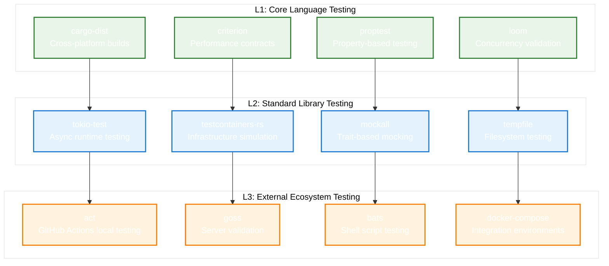
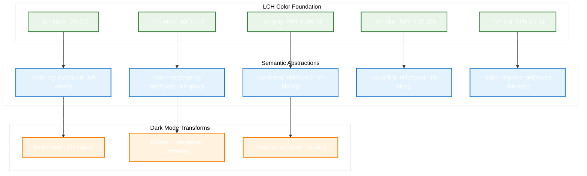
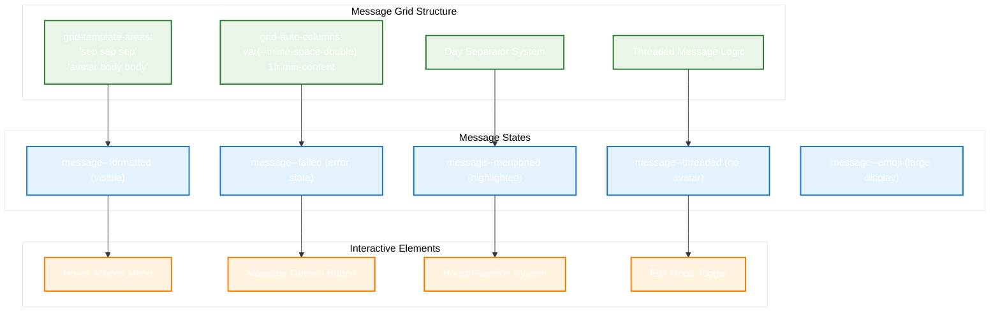

# Design Document: Shreyas Doshi campfire-on-rust GTM

## Overview

This design creates a **simple, friction-free GTM approach** for campfire-on-rust MVP 0.1:

**Phase 1: Make It Work** - Fix the broken code so people can actually try it
**Phase 2: Make It Clear** - Simple, honest messaging that gets people to working software fast

Shreyas Doshi's actual principles for MVP GTM:
- **Remove friction, don't add complexity**
- **Get users to value as fast as possible**
- **Be honest about what you have vs what you don't**
- **Optimize for clarity, not cleverness**

## Architecture

### Phase 1: Technical Foundation Architecture

```mermaid
%%{init: {'theme':'base', 'themeVariables': {'primaryColor':'#ff6b35','primaryTextColor':'#ffffff','primaryBorderColor':'#ff6b35','lineColor':'#333333','secondaryColor':'#f4f4f4','tertiaryColor':'#ffffff','background':'#ffffff','mainBkg':'#ff6b35','secondBkg':'#f8f9fa','tertiaryBkg':'#ffffff'}}}%%
graph TD
    subgraph "🚨 Critical Issues (Current State)"
        A1["❌ 41 Compilation Errors"]
        A2["❌ Broken Install Commands"]
        A3["❌ Placeholder URLs"]
        A4["❌ Missing Enum Variants"]
        A5["❌ Type Mismatches"]
    end
    
    subgraph "✅ Fixed Foundation (Target State)"
        B1["✅ Clean Compilation"]
        B2["✅ Working Install Script"]
        B3["✅ Actual Repository URLs"]
        B4["✅ Complete Type System"]
        B5["✅ Verified Functionality"]
    end
    
    subgraph "🔧 Fix Process"
        C1["Code Audit & Repair"]
        C2["Installation Testing"]
        C3["Documentation Verification"]
        C4["End-to-End Validation"]
    end
    
    A1 --> C1 --> B1
    A2 --> C2 --> B2
    A3 --> C3 --> B3
    A4 --> C1 --> B4
    A5 --> C1 --> B5
    
    classDef broken fill:#ffebee,stroke:#d32f2f,stroke-width:2px
    classDef fixed fill:#e8f5e8,stroke:#2e7d32,stroke-width:2px
    classDef process fill:#fff3e0,stroke:#ff9800,stroke-width:2px
    
    class A1,A2,A3,A4,A5 broken
    class B1,B2,B3,B4,B5 fixed
    class C1,C2,C3,C4 process
```



### Phase 2: Sample or Deploy GTM

```mermaid
%%{init: {'theme':'base', 'themeVariables': {'primaryColor':'#ff6b35','primaryTextColor':'#ffffff','primaryBorderColor':'#ff6b35','lineColor':'#333333','secondaryColor':'#f4f4f4','tertiaryColor':'#ffffff','background':'#ffffff','mainBkg':'#ff6b35','secondBkg':'#fbe9e7','tertiaryBkg':'#ffffff'}}}%%
graph TD
    A["GitHub Visitor"] --> B{Want to use campfire-on-rust?}
    
    B --> C["👀 Try it locally<br/>curl | bash → instant start"]
    B --> D["🚀 Deploy for team<br/>Railway button"]
    
    C --> E["Working on localhost:3000<br/>in 2 minutes"]
    D --> F["Working team chat<br/>in 3 minutes"]
    
    E --> G["Ready to deploy for real?"]
    G --> D
    
    classDef visitor fill:#fbe9e7,stroke:#ff6b35,stroke-width:2px
    classDef choice fill:#fff3e0,stroke:#ff9800,stroke-width:2px
    classDef local fill:#e3f2fd,stroke:#2196f3,stroke-width:2px
    classDef deploy fill:#e8f5e8,stroke:#4caf50,stroke-width:2px
    
    class A visitor
    class B,G choice
    class C,E local
    class D,F deploy
```



**Key Change**: Two equal paths - sample locally or deploy for real. Local sampling leads to deployment.

## Components and Interfaces

### Phase 1: Make It Work (Simple Fixes)

#### 1. Fix Compilation Errors
**Goal**: Get `cargo run` to work
**Approach**: Manual fixes, not automated systems
- Fix the 41 compilation errors one by one
- Add missing enum variants
- Fix type mismatches
- Remove unused imports

#### 2. Create One Working Install Method
**Goal**: One command that actually works
**Approach**: Start simple, not comprehensive
- Fix the curl script to download pre-built binary and start automatically
- Test on one platform first (macOS)
- Expand to other platforms only after first one works

#### 3. Update README to Match Reality
**Goal**: No false promises
**Approach**: Honest documentation
- Remove claims we can't deliver
- Update URLs to actual repository
- Show what actually works vs what's planned

### Phase 2: Make It Clear (Simple GTM)

#### 1. Two Clear Paths: Sample Locally, Deploy for Real
```html
<!-- Two simple options: try it or use it -->
<div class="two-paths">
  <h2>🔥 Get campfire-on-rust Working Right Now</h2>
  
  <div class="path-choice">
    <div class="path">
      <h3>👀 Try it on your machine</h3>
      <p>See campfire-on-rust working locally in 2 minutes</p>
      <code>curl -sSL https://raw.githubusercontent.com/that-in-rust/campfire-on-rust/main/scripts/install.sh | bash</code>
      <p><small>Then visit localhost:3000</small></p>
    </div>
    
    <div class="path primary">
      <h3>🚀 Deploy for your team</h3>
      <p>Get team chat running in 3 minutes</p>
      <a href="https://railway.app/template/..." class="big-button">
        Deploy on Railway →
      </a>
      <p><small>Free tier • No credit card required</small></p>
    </div>
  </div>
</div>
```

**Shreyas Doshi Principle**: Give people exactly two options - sample it (local) or use it (deploy). No confusion.

#### 2. Working Demo Mode
**Goal**: Show value in 30 seconds
**Approach**: Use existing demo mode, make it better
- Improve the existing `CAMPFIRE_DEMO_MODE=true`
- Add realistic chat conversations
- Make it obvious this is a demo
- Add "Deploy for Real" button

#### 3. Simple Success Tracking
**Goal**: Know what's working
**Approach**: Basic analytics, not complex funnels
- Track: demo views, deploy clicks, successful installs
- Use simple tools (Google Analytics, not custom Rust)
- Focus on: "Are people getting to working software?"

## Simple Implementation Approach

### Phase 1: Basic Fixes (No Complex Models)
- Fix compilation errors manually
- Update README with working commands
- Test one installation method thoroughly
- Remove broken features from documentation

### Phase 2: Simple GTM (Minimal Code)
- Add three-button choice to README
- Improve existing demo mode
- Create working Railway deploy button
- Add basic click tracking (Google Analytics)

**No Complex Data Models Needed**
- No user segmentation engines
- No conversion funnel analytics
- No sophisticated tracking systems
- Just: working software + clear paths to try it

## Error Handling

### Phase 1: Technical Foundation Errors
```rust
#[derive(Error, Debug)]
pub enum FoundationError {
    #[error("Compilation failed: {error_count} errors found")]
    CompilationFailed { error_count: usize, errors: Vec<CompilationError> },
    
    #[error("Installation validation failed: {method} on {platform}")]
    InstallationFailed { method: String, platform: String, details: String },
    
    #[error("Documentation sync failed: {claim} does not match reality")]
    DocumentationMismatch { claim: String, reality: String },
    
    #[error("Performance validation failed: claimed {claimed}, measured {actual}")]
    PerformanceMismatch { claimed: String, actual: String },
}
```

### Phase 2: GTM Experience Errors
```rust
#[derive(Error, Debug)]
pub enum GTMError {
    #[error("Segmentation failed: unable to classify user with confidence")]
    SegmentationFailed { confidence: f64, context: UserContext },
    
    #[error("Demo creation failed: {segment} demo environment unavailable")]
    DemoUnavailable { segment: UserSegment, reason: String },
    
    #[error("Deployment guidance failed: {option} encountered error")]
    DeploymentFailed { option: DeploymentOption, error: String },
    
    #[error("Conversion tracking failed: unable to record {event}")]
    TrackingFailed { event: FunnelEvent, reason: String },
}
```

## Testing Strategy

### Phase 1: Foundation Testing
```rust
#[cfg(test)]
mod foundation_tests {
    use super::*;
    
    #[tokio::test]
    async fn test_compilation_validation() {
        let validator = CompilationValidator::new();
        let report = validator.validate_compilation().await.unwrap();
        
        assert_eq!(report.error_count, 0, "Code must compile without errors");
        assert!(report.warnings.len() < 10, "Minimize warnings for clean code");
    }
    
    #[tokio::test]
    async fn test_installation_methods() {
        let validator = InstallationValidator::new();
        let report = validator.validate_all_methods().await.unwrap();
        
        for method in report.methods {
            assert!(method.success_rate > 0.95, "Installation must be reliable");
            assert!(method.average_time < Duration::from_secs(300), "Installation must be fast");
        }
    }
    
    #[tokio::test]
    async fn test_documentation_accuracy() {
        let sync = DocumentationSync::new();
        let report = sync.validate_claims().await.unwrap();
        
        assert_eq!(report.false_claims.len(), 0, "All claims must be accurate");
        assert!(report.accuracy_score > 0.95, "Documentation must be highly accurate");
    }
}
```

### Phase 2: GTM Experience Testing
```rust
#[cfg(test)]
mod gtm_tests {
    use super::*;
    
    #[tokio::test]
    async fn test_user_segmentation_accuracy() {
        let engine = SegmentationEngine::new();
        let test_contexts = create_test_user_contexts();
        
        for context in test_contexts {
            let segment = engine.detect_segment(context.clone()).await.unwrap();
            let path = engine.route_user(segment).await.unwrap();
            
            assert!(path.success_probability > 0.7, "Routing must be effective");
        }
    }
    
    #[tokio::test]
    async fn test_demo_value_realization() {
        let demo_system = DemoSystem::new();
        
        for segment in UserSegment::all_variants() {
            let session = demo_system.create_demo(segment).await.unwrap();
            let value_report = demo_system.track_value_realization(&session).await.unwrap();
            
            assert!(!value_report.metrics.is_empty(), "Demo must show clear value");
            assert!(value_report.overall_satisfaction > 0.8, "Demo must be satisfying");
        }
    }
    
    #[tokio::test]
    async fn test_conversion_funnel_optimization() {
        let analytics = ConversionAnalytics::new();
        let test_events = create_test_funnel_events();
        
        for event in test_events {
            analytics.track_user_journey(event.user_id, event).await.unwrap();
        }
        
        let insights = analytics.generate_insights().await.unwrap();
        assert!(!insights.opportunities.is_empty(), "Must identify optimization opportunities");
    }
}
```

## Performance Considerations

### Phase 1: Foundation Performance
- **Compilation Time**: Target <30 seconds for clean build
- **Installation Speed**: Target <2 minutes for any installation method
- **Documentation Sync**: Target <5 seconds for validation checks
- **Memory Usage**: Maintain <50MB for development tools

### Phase 2: GTM Experience Performance
- **Segmentation Speed**: Target <100ms for user classification
- **Demo Load Time**: Target <3 seconds for demo environment
- **Deployment Tracking**: Target <1 second for progress updates
- **Analytics Processing**: Target <500ms for real-time insights

## Security Considerations

### Data Privacy
- User segmentation data encrypted at rest
- Minimal data collection for analytics
- GDPR-compliant data retention policies
- Anonymous analytics where possible

### Installation Security
- Signed installation scripts
- Checksum verification for downloads
- Secure HTTPS-only distribution
- Vulnerability scanning for dependencies

## Deployment Strategy

### Phase 1: Foundation Deployment
1. **Code Fixes**: Deploy compilation fixes to development branch
2. **Installation Testing**: Validate on clean test environments
3. **Documentation Updates**: Sync with actual functionality
4. **Verification**: End-to-end testing before main branch merge

### Phase 2: GTM Experience Deployment
1. **Segmentation Engine**: Deploy with A/B testing capability
2. **Demo System**: Gradual rollout with monitoring
3. **Analytics**: Deploy with privacy-first configuration
4. **Optimization**: Continuous improvement based on data

## Professional CI/CD Testing Architecture

### L1 Core Testing (Rust Native)


### Testing Contract Architecture
```rust
/// CI/CD Testing Contract
/// 
/// # Preconditions
/// - All tests use professional frameworks, not custom bash scripts
/// - Performance claims backed by criterion benchmarks
/// - Cross-platform builds validated with cargo-dist
/// 
/// # Postconditions
/// - GitHub Actions workflows tested locally with act
/// - Installation processes validated in clean containers
/// - Binary functionality verified with goss
/// 
/// # Error Conditions
/// - TestFrameworkError::CustomScriptDetected if bash scripts used for testing
/// - TestFrameworkError::UnvalidatedClaim if performance assertions lack benchmarks
/// - TestFrameworkError::ManualVerification if human verification required
pub trait CICDTestingFramework {
    async fn validate_github_workflows(&self) -> Result<WorkflowReport, TestFrameworkError>;
    async fn test_cross_platform_builds(&self) -> Result<BuildReport, TestFrameworkError>;
    async fn verify_installation_process(&self) -> Result<InstallReport, TestFrameworkError>;
    async fn validate_binary_functionality(&self) -> Result<BinaryReport, TestFrameworkError>;
}
```

## Success Metrics (Simple & Honest)

### Phase 1: Make It Work
- **Compilation**: `cargo run` works without errors
- **Installation**: At least ONE method works reliably
- **Documentation**: No false claims in README
- **Reality Check**: Everything we say works actually works

### Phase 2: Make It Clear
- **Primary Goal**: People click "Deploy Now" and get working team chat
- **Secondary Goals**: Demo and local install support the primary goal
- **Success Metric**: Number of successful deployments (not clicks or views)
- **User Segment**: Teams who want team chat working immediately

### Phase 3: Professional Testing (New)
- **Testing Framework**: Replace custom bash scripts with professional tools
- **Automation**: 100% automated validation, zero manual verification
- **Performance**: All claims backed by criterion benchmarks
- **Reliability**: CI/CD tested locally with act before deployment

**Shreyas Doshi's Real GTM Principle for MVP:**
*"Get people to working software as fast as possible, with zero bullshit."*

**TDD-First Architecture Principle:**
*"Every claim must be validated by automated tests using professional frameworks."*

This design removes custom bash scripts and implements proper testing architecture following the L1→L2→L3 layered approach.

## Visual Design System Architecture

### LCH Color Space Implementation



### CSS Grid Message Layout



## Modular CSS Architecture

### File Organization Strategy
```rust
/// CSS Module Organization Contract
/// 
/// # Preconditions
/// - Each CSS file has single responsibility
/// - Custom properties follow semantic naming
/// - Grid systems use original template areas
/// 
/// # Postconditions
/// - Visual output matches original exactly
/// - Maintainable modular architecture
/// - Responsive behavior preserved
/// 
/// # Error Conditions
/// - StyleError::MonolithicCSS if single large file detected
/// - StyleError::MissingCustomProperties if semantic abstractions missing
/// - StyleError::VisualMismatch if side-by-side comparison fails
pub struct CSSArchitecture {
    pub colors: ColorsModule,           // colors.css - LCH color system
    pub base: BaseModule,               // base.css - typography & fundamentals
    pub layout: LayoutModule,           // layout.css - CSS Grid system
    pub messages: MessagesModule,       // messages.css - message grid & states
    pub sidebar: SidebarModule,         // sidebar.css - navigation & rooms
    pub composer: ComposerModule,       // composer.css - input & typing
    pub buttons: ButtonsModule,         // buttons.css - interactive elements
    pub animations: AnimationsModule,   // animation.css - transitions & keyframes
}
```

### Implementation Phases

#### Phase 1: Color System Foundation
```css
/* colors.css - Exact original implementation */
:root {
  /* Named LCH color values */
  --lch-black: 0% 0 0;
  --lch-white: 100% 0 0;
  --lch-gray: 96% 0.005 96;
  --lch-blue: 54% 0.23 255;
  --lch-red: 51% 0.2 31;
  --lch-green: 65.59% 0.234 142.49;

  /* Semantic abstractions */
  --color-bg: oklch(var(--lch-white));
  --color-message-bg: oklch(var(--lch-gray));
  --color-text: oklch(var(--lch-black));
  --color-link: oklch(var(--lch-blue));
  --color-negative: oklch(var(--lch-red));

  /* Dark mode transforms */
  @media (prefers-color-scheme: dark) {
    --lch-black: 100% 0 0;
    --lch-white: 0% 0 0;
    --lch-gray: 25.2% 0 0;
    --lch-blue: 72.25% 0.16 248;
  }
}
```

#### Phase 2: Layout Grid System
```css
/* layout.css - CSS Grid foundation */
body {
  --sidebar-width: 0vw;
  display: grid;
  grid-template-areas:
    "nav sidebar"
    "main sidebar";
  grid-template-columns: 1fr var(--sidebar-width);
  grid-template-rows: min-content 1fr;
  max-block-size: 100dvh;
}

.sidebar & {
  @media (min-width: 100ch) {
    --sidebar-width: 26vw;
  }
}
```

#### Phase 3: Message System Grid
```css
/* messages.css - Message grid structure */
.message {
  --content-padding-block: 0.66rem;
  --content-padding-inline: calc(var(--inline-space) * 1.5);
  
  display: grid;
  grid-template-areas:
    "sep sep sep"
    "avatar body body";
  grid-auto-columns: var(--inline-space-double) 1fr min-content;
  column-gap: var(--message-column-gap);
  row-gap: var(--message-row-gap);
}

.message--threaded {
  .message__author,
  .message__avatar {
    display: none;
  }
}
```

## Asset Organization Architecture

### Directory Structure Implementation
```rust
/// Asset Organization Contract
/// 
/// # Preconditions
/// - Assets organized in original subdirectories
/// - All original icons and images present
/// - Sound visualization assets available
/// 
/// # Postconditions
/// - Professional asset organization
/// - Complete visual asset coverage
/// - Proper path references throughout codebase
pub struct AssetOrganization {
    pub images: ImageAssets {
        pub browsers: Vec<BrowserIcon>,     // android.svg, chrome.svg, etc.
        pub external: Vec<ExternalIcon>,    // gear.svg, install.svg, etc.
        pub logos: Vec<LogoAsset>,          // app-icon-192.png, app-icon.png
        pub screenshots: Vec<Screenshot>,   // android-*.png for docs
        pub sounds: Vec<SoundVisualization>, // animated GIFs/WebP
    },
    pub sounds: SoundAssets,                // 53 MP3 files (already complete)
    pub stylesheets: CSSModules,            // 25+ modular CSS files
}
```

## Interactive Behavior Architecture

### Hover System Implementation
```css
/* base.css - Sophisticated hover system */
:where(button, input, textarea, summary, .input, .btn) {
  --hover-color: var(--color-border-darker);
  --hover-size: 0.15em;
  --hover-filter: brightness(1);
  
  transition: box-shadow 150ms ease, 
              outline-offset 150ms ease, 
              background-color 150ms ease, 
              opacity 150ms ease, 
              filter 150ms ease;

  @media (any-hover: hover) {
    &:where(:not(:active):hover) {
      --hover-filter: brightness(1.3);
      filter: var(--hover-filter);
      box-shadow: 0 0 0 var(--hover-size) var(--hover-color);
    }
  }
}
```

### Animation System
```css
/* animation.css - Original keyframes and timing */
@keyframes wiggle {
  0%, 100% { transform: translateX(0); }
  25% { transform: translateX(-2px); }
  75% { transform: translateX(2px); }
}

@keyframes pulsing-outline {
  0%, 100% { outline-width: 0; }
  50% { outline-width: 4px; }
}

@keyframes border-fade-out {
  to { border-color: transparent; }
}
```

## Accessibility and Performance Architecture

### Responsive Design System
```css
/* Sophisticated viewport handling */
body {
  max-block-size: 100dvh; /* Modern viewport units */
}

@media (max-width: 100ch) {
  .sidebar {
    transform: translate(100%);
    position: fixed;
    inset: 0;
  }
}

/* Touch-friendly targets */
@media (max-width: 768px) {
  button, .btn, .room-item {
    min-height: 44px;
    min-width: 44px;
  }
}
```

### Accessibility Features
```css
/* Reduced motion support */
@media (prefers-reduced-motion: reduce) {
  * {
    transition: none !important;
    animation: none !important;
  }
}

/* Focus management */
&:where(:not(:active)):focus-visible {
  outline-width: var(--outline-size);
  outline-color: var(--color-link);
  outline-offset: calc(var(--outline-size) * 2);
}
```

## Implementation Testing Strategy

### Visual Parity Testing
```rust
#[cfg(test)]
mod visual_parity_tests {
    use super::*;
    
    #[tokio::test]
    async fn test_color_system_accuracy() {
        let color_system = ColorSystem::new();
        let original_colors = load_original_color_values();
        
        for (name, original_value) in original_colors {
            let our_value = color_system.get_color(&name).unwrap();
            assert_eq!(our_value, original_value, 
                "Color {} must match original exactly", name);
        }
    }
    
    #[tokio::test]
    async fn test_layout_grid_structure() {
        let layout = LayoutSystem::new();
        let grid_areas = layout.get_grid_template_areas();
        
        assert_eq!(grid_areas.nav_sidebar, "nav sidebar");
        assert_eq!(grid_areas.main_sidebar, "main sidebar");
        assert!(layout.supports_responsive_sidebar_width());
    }
    
    #[tokio::test]
    async fn test_message_grid_behavior() {
        let message_system = MessageSystem::new();
        
        // Test day separator insertion
        let messages = create_test_messages_across_days();
        let rendered = message_system.render_messages(messages).await.unwrap();
        assert!(rendered.contains_day_separators());
        
        // Test threaded message behavior
        let threaded = create_threaded_messages();
        let rendered = message_system.render_messages(threaded).await.unwrap();
        assert!(rendered.hides_subsequent_avatars());
    }
}
```

### Asset Completeness Testing
```rust
#[cfg(test)]
mod asset_tests {
    use super::*;
    
    #[tokio::test]
    async fn test_asset_organization_completeness() {
        let assets = AssetOrganization::new();
        
        // Verify all browser icons present
        let browser_icons = ["android.svg", "chrome.svg", "edge.svg", 
                           "firefox.svg", "opera.svg", "safari.svg"];
        for icon in browser_icons {
            assert!(assets.images.browsers.contains(icon), 
                "Missing browser icon: {}", icon);
        }
        
        // Verify logo assets
        assert!(assets.images.logos.contains("app-icon-192.png"));
        assert!(assets.images.logos.contains("app-icon.png"));
        
        // Verify sound visualization assets
        for sound in &assets.sounds {
            if let Some(visualization) = sound.get_visualization() {
                assert!(visualization.gif_exists() || visualization.webp_exists());
            }
        }
    }
}
```

This comprehensive design ensures pixel-perfect parity with the original Basecamp Campfire while maintaining the professional architecture principles established in the TDD-first approach.