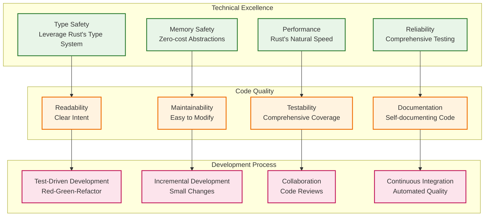
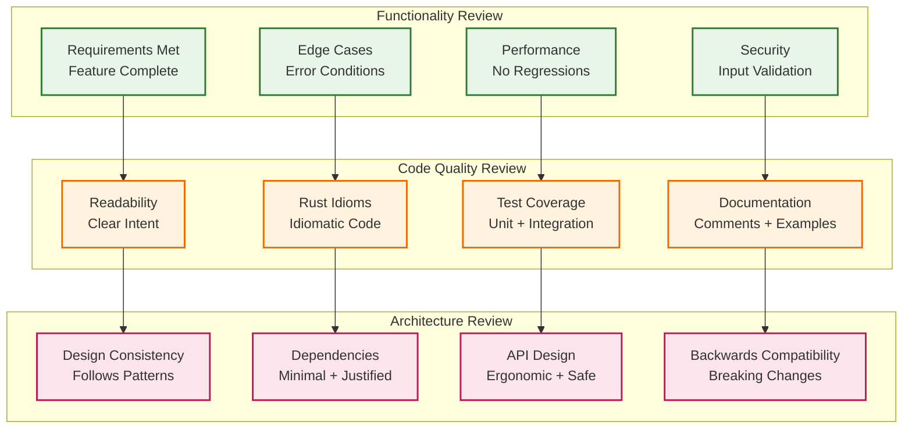
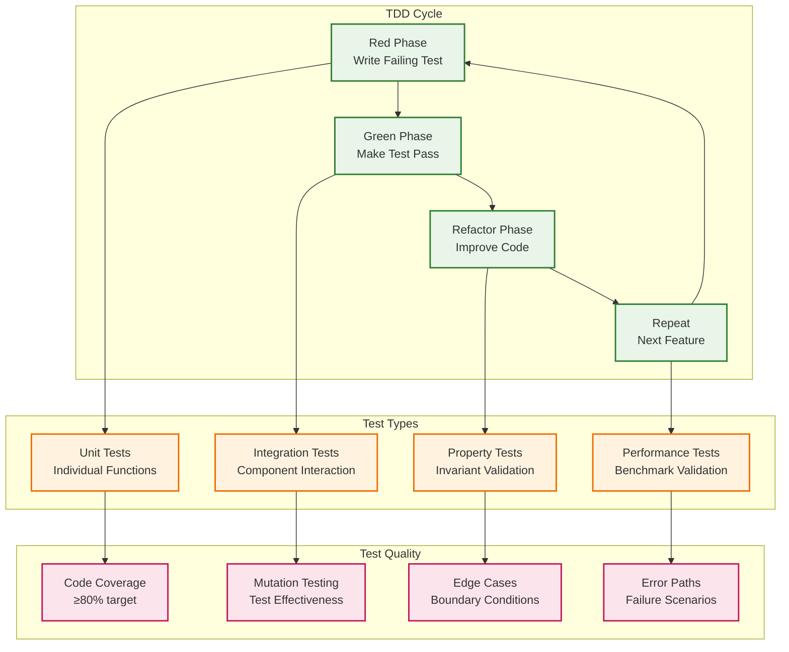
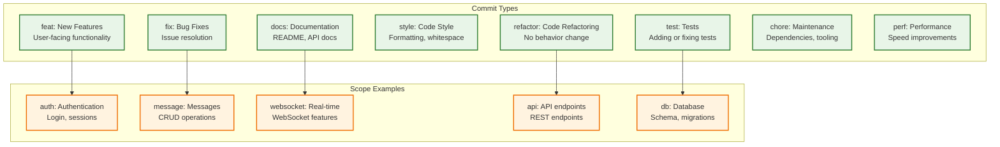
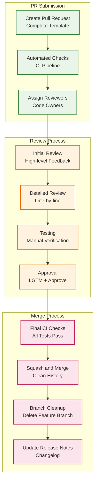
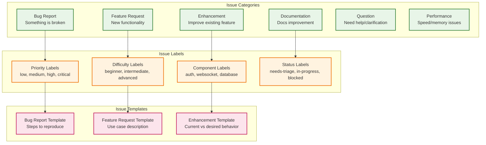

# Contributing to Campfire Rust Rewrite

## Contributing Overview

We welcome contributions to the Campfire Rust rewrite project! This guide outlines our development process, coding standards, and contribution workflow.

## Contribution Workflow

```mermaid
graph TD
    subgraph "Getting Started"
        direction TB
        FORK[Fork Repository<br/>Create Personal Copy]
        CLONE[Clone Fork<br/>Local Development]
        SETUP[Setup Environment<br/>Dependencies + Tools]
        BRANCH[Create Feature Branch<br/>git checkout -b feature/name]
    end
    
    subgraph "Development Process"
        direction TB
        ISSUE[Create/Find Issue<br/>Bug Report or Feature]
        DESIGN[Design Discussion<br/>Architecture Review]
        IMPLEMENT[Implement Changes<br/>TDD Approach]
        TEST[Write Tests<br/>Unit + Integration]
        DOCUMENT[Update Documentation<br/>Code + API Docs]
    end
    
    subgraph "Quality Assurance"
        direction TB
        LINT[Run Linting<br/>cargo clippy]
        FORMAT[Format Code<br/>cargo fmt]
        AUDIT[Security Audit<br/>cargo audit]
        COVERAGE[Test Coverage<br/>≥80% target]
    end
    
    subgraph "Submission Process"
        direction TB
        COMMIT[Commit Changes<br/>Conventional Commits]
        PUSH[Push to Fork<br/>Feature Branch]
        PR[Create Pull Request<br/>Detailed Description]
        REVIEW[Code Review<br/>Feedback Loop]
        MERGE[Merge to Main<br/>Squash Commits]
    end
    
    FORK --> CLONE
    CLONE --> SETUP
    SETUP --> BRANCH
    
    BRANCH --> ISSUE
    ISSUE --> DESIGN
    DESIGN --> IMPLEMENT
    IMPLEMENT --> TEST
    TEST --> DOCUMENT
    
    DOCUMENT --> LINT
    LINT --> FORMAT
    FORMAT --> AUDIT
    AUDIT --> COVERAGE
    
    COVERAGE --> COMMIT
    COMMIT --> PUSH
    PUSH --> PR
    PR --> REVIEW
    REVIEW --> MERGE
    
    classDef start fill:#e8f5e8,stroke:#2e7d32,stroke-width:2px
    classDef dev fill:#fff3e0,stroke:#ef6c00,stroke-width:2px
    classDef quality fill:#e3f2fd,stroke:#1976d2,stroke-width:2px
    classDef submit fill:#fce4ec,stroke:#c2185b,stroke-width:2px
    
    class FORK,CLONE,SETUP,BRANCH start
    class ISSUE,DESIGN,IMPLEMENT,TEST,DOCUMENT dev
    class LINT,FORMAT,AUDIT,COVERAGE quality
    class COMMIT,PUSH,PR,REVIEW,MERGE submit
```



## Development Principles

### Rails-Compatible Simplicity

Our development follows the **Rails Parity Rule**: If Rails doesn't do it, we don't do it. This ensures:

- **Proven Patterns**: Use battle-tested Rails patterns adapted to Rust
- **Predictable Behavior**: Familiar functionality for Rails developers
- **Minimal Complexity**: Avoid over-engineering and premature optimization
- **Evidence-Based**: Add complexity only when Rails proves it's necessary

### Core Development Values



## Getting Started

### Environment Setup

```bash
# 1. Fork the repository on GitHub
# 2. Clone your fork
git clone https://github.com/YOUR_USERNAME/campfire-rust-rewrite.git
cd campfire-rust-rewrite

# 3. Add upstream remote
git remote add upstream https://github.com/ORIGINAL_OWNER/campfire-rust-rewrite.git

# 4. Install Rust toolchain
curl --proto '=https' --tlsv1.2 -sSf https://sh.rustup.rs | sh

# 5. Install development tools
cargo install cargo-watch cargo-audit cargo-outdated cargo-tarpaulin

# 6. Build and test
cargo build
cargo test

# 7. Set up pre-commit hooks (optional but recommended)
cp scripts/pre-commit .git/hooks/pre-commit
chmod +x .git/hooks/pre-commit
```

### Development Workflow Commands

```bash
# Create feature branch
git checkout -b feature/your-feature-name

# Development with hot reload
cargo watch -x run

# Run tests continuously
cargo watch -x test

# Format code
cargo fmt

# Lint code
cargo clippy -- -D warnings

# Security audit
cargo audit

# Test coverage
cargo tarpaulin --out html

# Update dependencies
cargo outdated
```

## Coding Standards

### Rust Code Style

```mermaid
graph TD
    subgraph "Code Organization"
        direction TB
        MODULES[Module Structure<br/>Clear Separation]
        IMPORTS[Import Organization<br/>std, external, local]
        VISIBILITY[Visibility Rules<br/>Minimal pub exposure]
        NAMING[Naming Conventions<br/>snake_case, PascalCase]
    end
    
    subgraph "Type Safety Patterns"
        direction TB
        NEWTYPE[Newtype Pattern<br/>UserId, RoomId]
        ENUMS[Exhaustive Enums<br/>All Possible States]
        RESULT[Result<T, E><br/>Explicit Error Handling]
        OPTION[Option<T><br/>Null Safety]
    end
    
    subgraph "Error Handling"
        direction TB
        THISERROR[thiserror<br/>Library Errors]
        ANYHOW[anyhow<br/>Application Errors]
        CONTEXT[Error Context<br/>Debugging Information]
        PROPAGATION[Error Propagation<br/>? operator]
    end
    
    subgraph "Documentation"
        direction TB
        DOC_COMMENTS[/// Doc Comments<br/>Public APIs]
        EXAMPLES[Code Examples<br/>Usage Patterns]
        CONTRACTS[Function Contracts<br/>Preconditions/Postconditions]
        TESTS_AS_DOCS[Tests as Documentation<br/>Behavior Examples]
    end
    
    MODULES --> NEWTYPE
    IMPORTS --> ENUMS
    VISIBILITY --> RESULT
    NAMING --> OPTION
    
    NEWTYPE --> THISERROR
    ENUMS --> ANYHOW
    RESULT --> CONTEXT
    OPTION --> PROPAGATION
    
    THISERROR --> DOC_COMMENTS
    ANYHOW --> EXAMPLES
    CONTEXT --> CONTRACTS
    PROPAGATION --> TESTS_AS_DOCS
    
    classDef organization fill:#e8f5e8,stroke:#2e7d32,stroke-width:2px
    classDef types fill:#fff3e0,stroke:#ef6c00,stroke-width:2px
    classDef errors fill:#e3f2fd,stroke:#1976d2,stroke-width:2px
    classDef docs fill:#fce4ec,stroke:#c2185b,stroke-width:2px
    
    class MODULES,IMPORTS,VISIBILITY,NAMING organization
    class NEWTYPE,ENUMS,RESULT,OPTION types
    class THISERROR,ANYHOW,CONTEXT,PROPAGATION errors
    class DOC_COMMENTS,EXAMPLES,CONTRACTS,TESTS_AS_DOCS docs
```

### Code Review Checklist



## Testing Guidelines

### Test-Driven Development



### Testing Best Practices

```rust
// ✅ Good: Clear test structure
#[tokio::test]
async fn test_message_creation_with_deduplication() {
    // Arrange
    let service = create_test_message_service().await;
    let client_id = Uuid::new_v4();
    
    // Act
    let result1 = service.create_message_with_deduplication(
        "Test message".to_string(),
        room_id,
        user_id,
        client_id,
    ).await;
    
    let result2 = service.create_message_with_deduplication(
        "Different content".to_string(),
        room_id,
        user_id,
        client_id, // Same client_id
    ).await;
    
    // Assert
    assert!(result1.is_ok());
    assert!(result2.is_ok());
    assert_eq!(result1.unwrap().id, result2.unwrap().id);
}

// ✅ Good: Property-based test
use proptest::prelude::*;

proptest! {
    #[test]
    fn user_id_roundtrip_serialization(id in any::<u64>()) {
        let user_id = UserId(Uuid::from_u128(id as u128));
        let serialized = serde_json::to_string(&user_id)?;
        let deserialized: UserId = serde_json::from_str(&serialized)?;
        prop_assert_eq!(user_id, deserialized);
    }
}
```

## Commit Message Format

### Conventional Commits

We use [Conventional Commits](https://www.conventionalcommits.org/) for consistent commit messages:

```
<type>[optional scope]: <description>

[optional body]

[optional footer(s)]
```

### Commit Types



### Commit Examples

```bash
# Feature addition
feat(auth): add session token validation middleware

# Bug fix
fix(websocket): handle connection cleanup on disconnect

# Documentation update
docs(api): add WebSocket message type examples

# Refactoring
refactor(message): extract validation logic to separate module

# Test addition
test(room): add property tests for membership validation

# Performance improvement
perf(search): optimize FTS5 query performance

# Breaking change
feat(api)!: change message API response format

BREAKING CHANGE: Message API now returns ISO timestamps instead of Unix timestamps
```

## Pull Request Guidelines

### PR Template

```markdown
## Description
Brief description of the changes and their purpose.

## Type of Change
- [ ] Bug fix (non-breaking change which fixes an issue)
- [ ] New feature (non-breaking change which adds functionality)
- [ ] Breaking change (fix or feature that would cause existing functionality to not work as expected)
- [ ] Documentation update
- [ ] Performance improvement
- [ ] Code refactoring

## Testing
- [ ] Unit tests added/updated
- [ ] Integration tests added/updated
- [ ] Property tests added/updated (if applicable)
- [ ] Manual testing completed

## Checklist
- [ ] Code follows the project's coding standards
- [ ] Self-review of code completed
- [ ] Code is commented, particularly in hard-to-understand areas
- [ ] Documentation updated (if applicable)
- [ ] No new warnings introduced
- [ ] Tests pass locally
- [ ] Security considerations addressed

## Related Issues
Closes #123
Related to #456

## Screenshots (if applicable)
Add screenshots for UI changes.

## Additional Notes
Any additional information or context.
```

### PR Review Process



## Issue Guidelines

### Issue Types



## Community Guidelines

### Code of Conduct

We are committed to providing a welcoming and inclusive environment for all contributors. Please read and follow our Code of Conduct:

- **Be respectful**: Treat all community members with respect and kindness
- **Be inclusive**: Welcome newcomers and help them get started
- **Be constructive**: Provide helpful feedback and suggestions
- **Be patient**: Remember that everyone has different experience levels
- **Be collaborative**: Work together to solve problems and improve the project

### Communication Channels

- **GitHub Issues**: Bug reports, feature requests, and discussions
- **Pull Requests**: Code contributions and reviews
- **Discussions**: General questions and community discussions
- **Documentation**: In-code comments and external documentation

## Recognition

We appreciate all contributions to the project! Contributors will be recognized in:

- **CONTRIBUTORS.md**: List of all project contributors
- **Release Notes**: Acknowledgment of significant contributions
- **GitHub Contributors**: Automatic recognition on the repository page

## Getting Help

If you need help with contributing:

1. **Check Documentation**: Review existing docs and guides
2. **Search Issues**: Look for similar questions or problems
3. **Ask Questions**: Create a discussion or issue for help
4. **Join Community**: Participate in project discussions

## Resources

- **[Development Guide](docs/development.md)**: Detailed development workflow
- **[Architecture Guide](docs/architecture.md)**: System architecture overview
- **[API Documentation](docs/api-overview.md)**: Complete API reference
- **[Deployment Guide](docs/deployment.md)**: Deployment and operations

Thank you for contributing to the Campfire Rust rewrite project! Your contributions help make this project better for everyone.