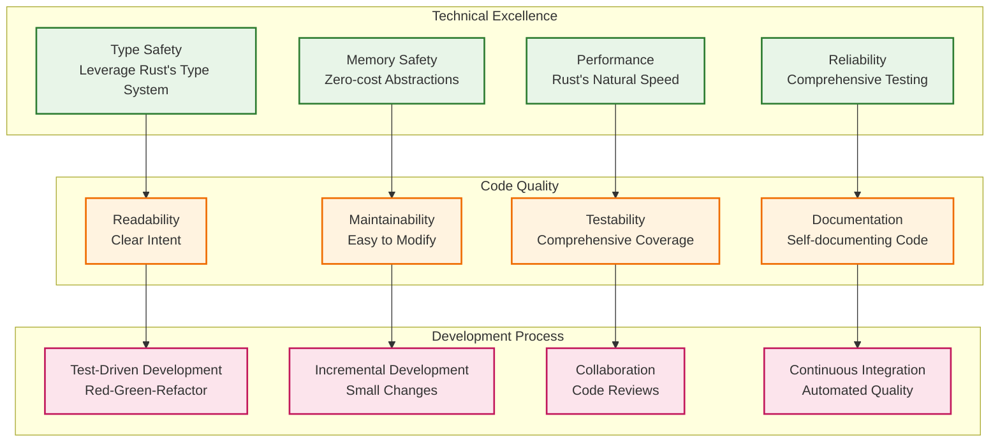
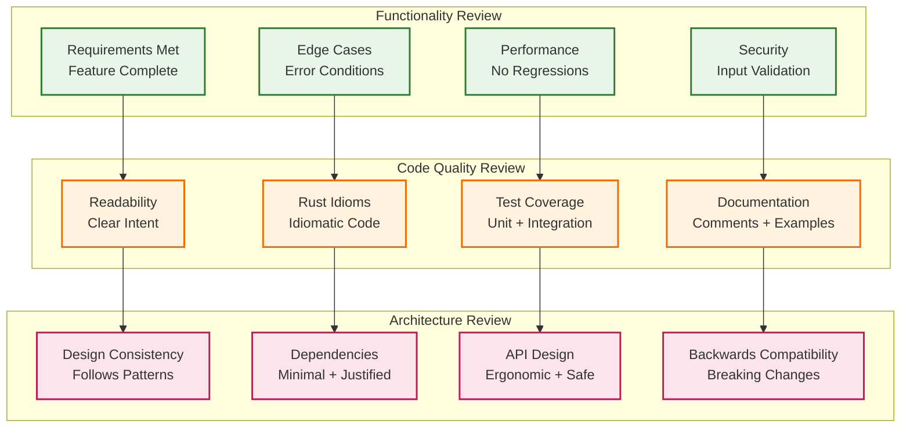
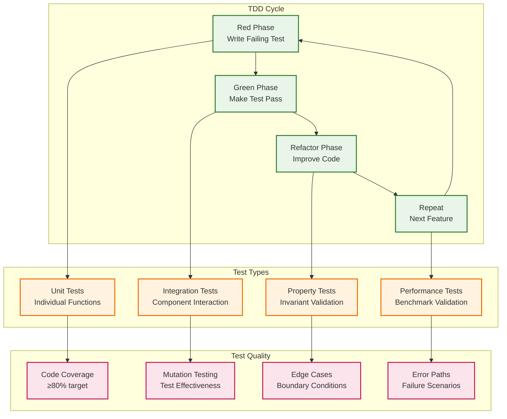
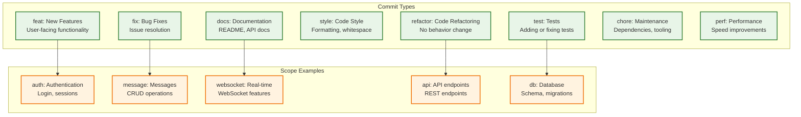
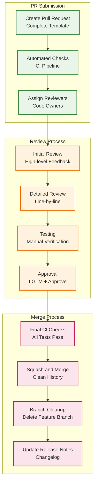
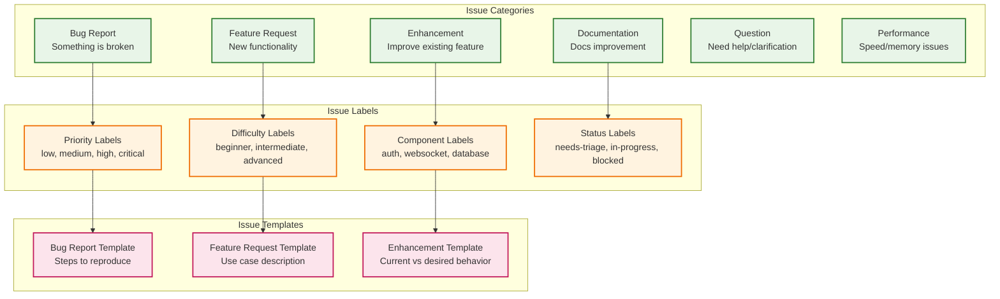
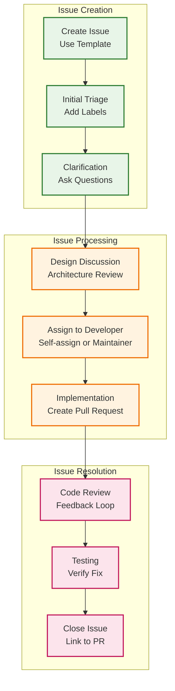

# Contributing to Campfire Rust Rewrite

## Contributing Overview

We welcome contributions to the Campfire Rust rewrite project! This guide outlines our development process, coding standards, and contribution workflow.

## Contribution Workflow

```mermaid
graph TD
    subgraph "Getting Started"
        direction TB
        FORK[Fork Repository<br/>Create Personal Copy]
        CLONE[Clone Fork<br/>Local Development]
        SETUP[Setup Environment<br/>Dependencies + Tools]
        BRANCH[Create Feature Branch<br/>git checkout -b feature/name]
    end
    
    subgraph "Development Process"
        direction TB
        ISSUE[Create/Find Issue<br/>Bug Report or Feature]
        DESIGN[Design Discussion<br/>Architecture Review]
        IMPLEMENT[Implement Changes<br/>TDD Approach]
        TEST[Write Tests<br/>Unit + Integration]
        DOCUMENT[Update Documentation<br/>Code + API Docs]
    end
    
    subgraph "Quality Assurance"
        direction TB
        LINT[Run Linting<br/>cargo clippy]
        FORMAT[Format Code<br/>cargo fmt]
        AUDIT[Security Audit<br/>cargo audit]
        COVERAGE[Test Coverage<br/>≥80% target]
    end
    
    subgraph "Submission Process"
        direction TB
        COMMIT[Commit Changes<br/>Conventional Commits]
        PUSH[Push to Fork<br/>Feature Branch]
        PR[Create Pull Request<br/>Detailed Description]
        REVIEW[Code Review<br/>Feedback Loop]
        MERGE[Merge to Main<br/>Squash Commits]
    end
    
    FORK --> CLONE
    CLONE --> SETUP
    SETUP --> BRANCH
    
    BRANCH --> ISSUE
    ISSUE --> DESIGN
    DESIGN --> IMPLEMENT
    IMPLEMENT --> TEST
    TEST --> DOCUMENT
    
    DOCUMENT --> LINT
    LINT --> FORMAT
    FORMAT --> AUDIT
    AUDIT --> COVERAGE
    
    COVERAGE --> COMMIT
    COMMIT --> PUSH
    PUSH --> PR
    PR --> REVIEW
    REVIEW --> MERGE
    
    classDef start fill:#e8f5e8,stroke:#2e7d32,stroke-width:2px
    classDef dev fill:#fff3e0,stroke:#ef6c00,stroke-width:2px
    classDef quality fill:#e3f2fd,stroke:#1976d2,stroke-width:2px
    classDef submit fill:#fce4ec,stroke:#c2185b,stroke-width:2px
    
    class FORK,CLONE,SETUP,BRANCH start
    class ISSUE,DESIGN,IMPLEMENT,TEST,DOCUMENT dev
    class LINT,FORMAT,AUDIT,COVERAGE quality
    class COMMIT,PUSH,PR,REVIEW,MERGE submit
```



## Development Principles

### Rails-Compatible Simplicity

Our development follows the **Rails Parity Rule**: If Rails doesn't do it, we don't do it. This ensures:

- **Proven Patterns**: Use battle-tested Rails patterns adapted to Rust
- **Predictable Behavior**: Familiar functionality for Rails developers
- **Minimal Complexity**: Avoid over-engineering and premature optimization
- **Evidence-Based**: Add complexity only when Rails proves it's necessary

### Core Development Values



## Getting Started

### Development Environment Setup

#### Prerequisites

- **Rust**: Latest stable version (1.70+)
- **Git**: Version control system
- **SQLite**: Database engine (usually included with system)
- **Node.js**: For frontend tooling (optional)

#### Step-by-Step Setup

```bash
# 1. Fork the repository on GitHub
# Click "Fork" button on the repository page

# 2. Clone your fork
git clone https://github.com/YOUR_USERNAME/campfire-on-rust.git
cd campfire-on-rust

# 3. Add upstream remote for syncing
git remote add upstream https://github.com/that-in-rust/campfire-on-rust.git

# 4. Install Rust toolchain (if not already installed)
curl --proto '=https' --tlsv1.2 -sSf https://sh.rustup.rs | sh
source ~/.cargo/env

# 5. Install required Rust components
rustup component add rustfmt clippy

# 6. Install development tools
cargo install cargo-watch      # Hot reload during development
cargo install cargo-audit      # Security vulnerability scanning
cargo install cargo-outdated   # Check for outdated dependencies
cargo install cargo-tarpaulin  # Code coverage reporting
cargo install cargo-expand     # Macro expansion for debugging
cargo install cargo-bloat      # Binary size analysis

# 7. Set up environment configuration
cp .env.example .env
# Edit .env file with your local settings

# 8. Build the project
cargo build

# 9. Run database migrations
cargo run --bin migrate

# 10. Run tests to verify setup
cargo test

# 11. Set up pre-commit hooks (recommended)
cp scripts/pre-commit .git/hooks/pre-commit
chmod +x .git/hooks/pre-commit

# 12. Start development server
cargo run
# Or with hot reload:
cargo watch -x run
```

#### IDE Setup

##### VS Code (Recommended)

Install these extensions:
- **rust-analyzer**: Rust language server
- **CodeLLDB**: Debugging support
- **Better TOML**: TOML file support
- **Error Lens**: Inline error display
- **GitLens**: Enhanced Git integration

VS Code settings (`.vscode/settings.json`):
```json
{
  "rust-analyzer.cargo.features": "all",
  "rust-analyzer.checkOnSave.command": "clippy",
  "rust-analyzer.checkOnSave.extraArgs": ["--", "-D", "warnings"],
  "editor.formatOnSave": true,
  "editor.rulers": [100],
  "files.trimTrailingWhitespace": true,
  "files.insertFinalNewline": true,
  "rust-analyzer.inlayHints.typeHints.enable": true,
  "rust-analyzer.inlayHints.parameterHints.enable": true
}
```

##### Other IDEs

- **IntelliJ IDEA/CLion**: Install Rust plugin
- **Vim/Neovim**: Use rust-analyzer with LSP client
- **Emacs**: Use rust-analyzer with lsp-mode

### Development Workflow Commands

```bash
# Sync with upstream before starting work
git fetch upstream
git checkout main
git merge upstream/main

# Create feature branch
git checkout -b feature/your-feature-name

# Development with hot reload
cargo watch -x run

# Run tests continuously
cargo watch -x test

# Run specific test module
cargo test --test integration_test

# Format code (required before commit)
cargo fmt

# Lint code (must pass before merge)
cargo clippy -- -D warnings

# Security audit (run regularly)
cargo audit

# Test coverage report
cargo tarpaulin --out html --output-dir coverage

# Check for outdated dependencies
cargo outdated

# Build optimized release binary
cargo build --release

# Run benchmarks
cargo bench

# Generate documentation
cargo doc --open

# Check code without building (faster)
cargo check

# Expand macros for debugging
cargo expand --bin campfire-rust

# Analyze binary size
cargo bloat --release
```

### Code Formatting Requirements

All code must be formatted using `rustfmt` before submission:

```bash
# Format all code
cargo fmt

# Check formatting without changing files
cargo fmt -- --check

# Format specific file
rustfmt src/main.rs
```

**Formatting Configuration** (`.rustfmt.toml`):
```toml
max_width = 100
hard_tabs = false
tab_spaces = 4
newline_style = "Unix"
use_small_heuristics = "Default"
reorder_imports = true
reorder_modules = true
remove_nested_parens = true
edition = "2021"
```

## Code Style Guidelines

### Rust Code Style Standards

```mermaid
graph TD
    subgraph "Code Organization"
        direction TB
        MODULES[Module Structure<br/>Clear Separation]
        IMPORTS[Import Organization<br/>std, external, local]
        VISIBILITY[Visibility Rules<br/>Minimal pub exposure]
        NAMING[Naming Conventions<br/>snake_case, PascalCase]
    end
    
    subgraph "Type Safety Patterns"
        direction TB
        NEWTYPE[Newtype Pattern<br/>UserId, RoomId]
        ENUMS[Exhaustive Enums<br/>All Possible States]
        RESULT[Result<T, E><br/>Explicit Error Handling]
        OPTION[Option<T><br/>Null Safety]
    end
    
    subgraph "Error Handling"
        direction TB
        THISERROR[thiserror<br/>Library Errors]
        ANYHOW[anyhow<br/>Application Errors]
        CONTEXT[Error Context<br/>Debugging Information]
        PROPAGATION[Error Propagation<br/>? operator]
    end
    
    subgraph "Documentation"
        direction TB
        DOC_COMMENTS[/// Doc Comments<br/>Public APIs]
        EXAMPLES[Code Examples<br/>Usage Patterns]
        CONTRACTS[Function Contracts<br/>Preconditions/Postconditions]
        TESTS_AS_DOCS[Tests as Documentation<br/>Behavior Examples]
    end
    
    MODULES --> NEWTYPE
    IMPORTS --> ENUMS
    VISIBILITY --> RESULT
    NAMING --> OPTION
    
    NEWTYPE --> THISERROR
    ENUMS --> ANYHOW
    RESULT --> CONTEXT
    OPTION --> PROPAGATION
    
    THISERROR --> DOC_COMMENTS
    ANYHOW --> EXAMPLES
    CONTEXT --> CONTRACTS
    PROPAGATION --> TESTS_AS_DOCS
    
    classDef organization fill:#e8f5e8,stroke:#2e7d32,stroke-width:2px
    classDef types fill:#fff3e0,stroke:#ef6c00,stroke-width:2px
    classDef errors fill:#e3f2fd,stroke:#1976d2,stroke-width:2px
    classDef docs fill:#fce4ec,stroke:#c2185b,stroke-width:2px
    
    class MODULES,IMPORTS,VISIBILITY,NAMING organization
    class NEWTYPE,ENUMS,RESULT,OPTION types
    class THISERROR,ANYHOW,CONTEXT,PROPAGATION errors
    class DOC_COMMENTS,EXAMPLES,CONTRACTS,TESTS_AS_DOCS docs
```

### Formatting Configuration

Our project uses `rustfmt` with the following configuration (`.rustfmt.toml`):

```toml
# Edition and basic formatting
edition = "2021"
max_width = 100
hard_tabs = false
tab_spaces = 4
newline_style = "Unix"

# Import and module organization
reorder_imports = true
reorder_modules = true
group_imports = "StdExternalCrate"
imports_granularity = "Crate"

# Code style preferences
use_small_heuristics = "Default"
remove_nested_parens = true
normalize_comments = true
wrap_comments = true
comment_width = 80

# Function and control flow formatting
fn_args_layout = "Tall"
brace_style = "SameLineWhere"
control_brace_style = "AlwaysSameLine"
indent_style = "Block"

# Trailing commas and semicolons
trailing_comma = "Vertical"
trailing_semicolon = true

# String and array formatting
overflow_delimited_expr = false
struct_lit_single_line = true
```

### Naming Conventions

#### Variables and Functions
```rust
// ✅ Good: snake_case for variables and functions
let user_count = 42;
let message_content = "Hello, world!";

fn create_user_session() -> Result<Session, AuthError> {
    // Implementation
}

async fn send_message_to_room(room_id: RoomId, message: Message) -> Result<(), MessageError> {
    // Implementation
}
```

#### Types and Structs
```rust
// ✅ Good: PascalCase for types, structs, enums
struct UserSession {
    user_id: UserId,
    expires_at: DateTime<Utc>,
}

enum MessageType {
    Text,
    Image,
    File,
}

type Result<T> = std::result::Result<T, CampfireError>;
```

#### Constants and Statics
```rust
// ✅ Good: SCREAMING_SNAKE_CASE for constants
const MAX_MESSAGE_LENGTH: usize = 10_000;
const DEFAULT_SESSION_DURATION: Duration = Duration::from_secs(3600);

static GLOBAL_CONFIG: OnceLock<Config> = OnceLock::new();
```

#### Modules and Crates
```rust
// ✅ Good: snake_case for modules
mod message_service;
mod user_authentication;
mod websocket_handler;

// ✅ Good: kebab-case for crate names in Cargo.toml
[package]
name = "campfire-rust"
```

### Import Organization

Organize imports in this order:

```rust
// 1. Standard library imports
use std::collections::HashMap;
use std::sync::Arc;
use std::time::Duration;

// 2. External crate imports (alphabetical)
use anyhow::{Context, Result};
use axum::{extract::State, response::Json, routing::get, Router};
use serde::{Deserialize, Serialize};
use tokio::sync::RwLock;
use uuid::Uuid;

// 3. Local crate imports (alphabetical)
use crate::errors::{AuthError, MessageError};
use crate::models::{Message, User};
use crate::services::{AuthService, MessageService};

// 4. Local module imports
use super::handlers::auth;
use super::middleware::session;
```

### Code Structure Guidelines

#### Function Length
- **Preferred**: Functions under 50 lines
- **Maximum**: Functions under 100 lines
- **Exception**: Complex match statements or initialization code

#### Function Parameters
```rust
// ✅ Good: Few parameters with clear types
fn create_message(
    content: String,
    room_id: RoomId,
    user_id: UserId,
) -> Result<Message, MessageError> {
    // Implementation
}

// ✅ Good: Use structs for many parameters
struct CreateMessageRequest {
    content: String,
    room_id: RoomId,
    user_id: UserId,
    client_message_id: Uuid,
}

fn create_message(request: CreateMessageRequest) -> Result<Message, MessageError> {
    // Implementation
}
```

#### Error Handling Patterns
```rust
// ✅ Good: Use ? operator for error propagation
fn process_message(content: &str) -> Result<ProcessedMessage, ValidationError> {
    let sanitized = sanitize_html(content)?;
    let validated = validate_length(&sanitized)?;
    let processed = apply_formatting(validated)?;
    Ok(processed)
}

// ✅ Good: Provide context for errors
fn load_config(path: &Path) -> anyhow::Result<Config> {
    let content = fs::read_to_string(path)
        .with_context(|| format!("Failed to read config file: {}", path.display()))?;
    
    let config: Config = toml::from_str(&content)
        .with_context(|| "Failed to parse config file as TOML")?;
    
    Ok(config)
}
```

#### Documentation Standards
```rust
/// Creates a new message with deduplication support.
///
/// This function implements the core message creation logic with client-side
/// deduplication to prevent duplicate messages from being stored.
///
/// # Arguments
///
/// * `content` - The message content (1-10,000 characters)
/// * `room_id` - The target room identifier
/// * `user_id` - The message author identifier
/// * `client_message_id` - Client-generated UUID for deduplication
///
/// # Returns
///
/// Returns `Ok(Message)` on success, or `MessageError` on failure.
///
/// # Errors
///
/// This function will return an error if:
/// * User lacks permission to post in the room
/// * Content violates length or content restrictions
/// * Database operation fails
///
/// # Examples
///
/// ```rust
/// let message = create_message_with_deduplication(
///     "Hello, world!".to_string(),
///     room_id,
///     user_id,
///     Uuid::new_v4(),
/// ).await?;
/// ```
pub async fn create_message_with_deduplication(
    content: String,
    room_id: RoomId,
    user_id: UserId,
    client_message_id: Uuid,
) -> Result<Message, MessageError> {
    // Implementation
}
```

### Type Safety Best Practices

#### Newtype Pattern
```rust
// ✅ Good: Use newtype pattern for type safety
#[derive(Debug, Clone, Copy, PartialEq, Eq, Hash, Serialize, Deserialize)]
pub struct UserId(pub Uuid);

#[derive(Debug, Clone, Copy, PartialEq, Eq, Hash, Serialize, Deserialize)]
pub struct RoomId(pub Uuid);

// This prevents accidentally using UserId where RoomId is expected
impl UserId {
    pub fn new() -> Self {
        Self(Uuid::new_v4())
    }
}
```

#### Exhaustive Enums
```rust
// ✅ Good: Exhaustive enums for all possible states
#[derive(Debug, Clone, PartialEq, Eq, Serialize, Deserialize)]
pub enum RoomType {
    Open,    // Anyone can join
    Closed,  // Invitation only
    Direct,  // Two-person direct message
}

#[derive(Debug, Clone, PartialEq, Eq, Serialize, Deserialize)]
pub enum MessageStatus {
    Pending,
    Sent,
    Delivered,
    Failed { reason: String },
}
```

#### Builder Pattern
```rust
// ✅ Good: Builder pattern for complex construction
pub struct MessageBuilder {
    content: Option<String>,
    room_id: Option<RoomId>,
    user_id: Option<UserId>,
    client_message_id: Option<Uuid>,
}

impl MessageBuilder {
    pub fn new() -> Self {
        Self {
            content: None,
            room_id: None,
            user_id: None,
            client_message_id: None,
        }
    }
    
    pub fn content(mut self, content: String) -> Self {
        self.content = Some(content);
        self
    }
    
    pub fn room_id(mut self, room_id: RoomId) -> Self {
        self.room_id = Some(room_id);
        self
    }
    
    pub fn build(self) -> Result<Message, BuildError> {
        let content = self.content.ok_or(BuildError::MissingContent)?;
        let room_id = self.room_id.ok_or(BuildError::MissingRoomId)?;
        // ... validation and construction
        Ok(Message { /* ... */ })
    }
}
```

### Code Review Checklist



## Testing Guidelines

### Test-Driven Development



### Testing Best Practices

```rust
// ✅ Good: Clear test structure
#[tokio::test]
async fn test_message_creation_with_deduplication() {
    // Arrange
    let service = create_test_message_service().await;
    let client_id = Uuid::new_v4();
    
    // Act
    let result1 = service.create_message_with_deduplication(
        "Test message".to_string(),
        room_id,
        user_id,
        client_id,
    ).await;
    
    let result2 = service.create_message_with_deduplication(
        "Different content".to_string(),
        room_id,
        user_id,
        client_id, // Same client_id
    ).await;
    
    // Assert
    assert!(result1.is_ok());
    assert!(result2.is_ok());
    assert_eq!(result1.unwrap().id, result2.unwrap().id);
}

// ✅ Good: Property-based test
use proptest::prelude::*;

proptest! {
    #[test]
    fn user_id_roundtrip_serialization(id in any::<u64>()) {
        let user_id = UserId(Uuid::from_u128(id as u128));
        let serialized = serde_json::to_string(&user_id)?;
        let deserialized: UserId = serde_json::from_str(&serialized)?;
        prop_assert_eq!(user_id, deserialized);
    }
}
```

## Commit Message Format

### Conventional Commits

We use [Conventional Commits](https://www.conventionalcommits.org/) for consistent commit messages:

```
<type>[optional scope]: <description>

[optional body]

[optional footer(s)]
```

### Commit Types



### Commit Examples

```bash
# Feature addition
feat(auth): add session token validation middleware

# Bug fix
fix(websocket): handle connection cleanup on disconnect

# Documentation update
docs(api): add WebSocket message type examples

# Refactoring
refactor(message): extract validation logic to separate module

# Test addition
test(room): add property tests for membership validation

# Performance improvement
perf(search): optimize FTS5 query performance

# Breaking change
feat(api)!: change message API response format

BREAKING CHANGE: Message API now returns ISO timestamps instead of Unix timestamps
```

## Pull Request Guidelines

### Before Creating a Pull Request

1. **Sync with upstream**: Ensure your branch is up-to-date
   ```bash
   git fetch upstream
   git rebase upstream/main
   ```

2. **Run quality checks locally**:
   ```bash
   # Format code
   cargo fmt
   
   # Run lints
   cargo clippy -- -D warnings
   
   # Run all tests
   cargo test
   
   # Security audit
   cargo audit
   
   # Check test coverage
   cargo tarpaulin --out html
   ```

3. **Commit message format**: Use conventional commits
   ```
   type(scope): description
   
   Examples:
   feat(auth): add session token validation
   fix(websocket): handle connection cleanup
   docs(api): update search endpoint examples
   ```

### Pull Request Template

When creating a pull request, please use this template:

```markdown
## Description
Brief description of the changes and their purpose.

## Type of Change
- [ ] Bug fix (non-breaking change which fixes an issue)
- [ ] New feature (non-breaking change which adds functionality)
- [ ] Breaking change (fix or feature that would cause existing functionality to not work as expected)
- [ ] Documentation update
- [ ] Performance improvement
- [ ] Code refactoring
- [ ] Security improvement

## Related Issues
- Closes #123
- Related to #456
- Addresses #789

## Changes Made
### Added
- New feature X
- New endpoint Y

### Changed
- Modified behavior of Z
- Updated API response format

### Removed
- Deprecated function A
- Unused dependency B

### Fixed
- Bug in component C
- Memory leak in service D

## Testing
### Automated Tests
- [ ] Unit tests added/updated
- [ ] Integration tests added/updated
- [ ] Property tests added/updated (if applicable)
- [ ] Performance tests added (if applicable)

### Manual Testing
- [ ] Manual testing completed
- [ ] Tested on multiple browsers (if frontend changes)
- [ ] Tested with different data sets
- [ ] Tested error conditions

### Test Coverage
- Current coverage: X%
- Coverage change: +/-Y%

## Performance Impact
- [ ] No performance impact
- [ ] Performance improvement (describe)
- [ ] Performance regression (justify)
- [ ] Benchmarks run and results attached

## Security Considerations
- [ ] No security implications
- [ ] Security review completed
- [ ] Input validation added/updated
- [ ] Authentication/authorization checked
- [ ] Sensitive data handling reviewed

## Breaking Changes
- [ ] No breaking changes
- [ ] Breaking changes documented below

### Breaking Change Details
If this PR introduces breaking changes, describe:
1. What breaks
2. Why the change is necessary
3. Migration path for users

## Documentation
- [ ] Code is self-documenting
- [ ] Inline comments added for complex logic
- [ ] API documentation updated
- [ ] User documentation updated
- [ ] Migration guide updated (if breaking changes)

## Checklist
### Code Quality
- [ ] Code follows project coding standards
- [ ] Self-review completed
- [ ] No debug code or console.log statements
- [ ] Error handling is appropriate
- [ ] Resource cleanup is handled

### Testing
- [ ] All tests pass locally
- [ ] New tests cover edge cases
- [ ] Tests are deterministic (no flaky tests)
- [ ] Test names are descriptive

### Documentation
- [ ] Public APIs are documented
- [ ] Complex algorithms are explained
- [ ] Configuration changes are documented

### CI/CD
- [ ] CI pipeline passes
- [ ] No new linting warnings
- [ ] Security scan passes
- [ ] Build succeeds in release mode

## Screenshots/Videos
If applicable, add screenshots or videos to demonstrate the changes.

## Additional Notes
Any additional information, context, or considerations for reviewers.

## Reviewer Notes
Specific areas where you'd like focused review:
- [ ] Algorithm correctness in file X
- [ ] Error handling in service Y
- [ ] Performance of operation Z
```

### Pull Request Size Guidelines

- **Small PRs** (preferred): <200 lines changed
  - Easier to review
  - Faster to merge
  - Lower risk of conflicts

- **Medium PRs**: 200-500 lines changed
  - Should have clear scope
  - May need multiple reviewers

- **Large PRs**: >500 lines changed
  - Should be exceptional
  - Require detailed description
  - Consider breaking into smaller PRs

### Code Review Requirements

All pull requests must be reviewed by at least one maintainer before merging. The review process includes:

1. **Automated Checks**: CI pipeline must pass
2. **Code Review**: Manual review by maintainer
3. **Testing**: Verify tests cover new functionality
4. **Documentation**: Ensure documentation is updated

### Pull Request Review Process



### Review Criteria

#### Functionality Review
- [ ] **Requirements Met**: Feature works as specified
- [ ] **Edge Cases**: Error conditions handled properly
- [ ] **User Experience**: Intuitive and consistent behavior
- [ ] **Performance**: No significant regressions
- [ ] **Security**: Input validation and authorization checks

#### Code Quality Review
- [ ] **Readability**: Code is clear and well-structured
- [ ] **Rust Idioms**: Follows idiomatic Rust patterns
- [ ] **Error Handling**: Proper use of Result<T, E> and error types
- [ ] **Documentation**: Public APIs documented with examples
- [ ] **Testing**: Comprehensive test coverage

#### Architecture Review
- [ ] **Design Consistency**: Follows established patterns
- [ ] **Dependencies**: New dependencies justified and minimal
- [ ] **API Design**: Ergonomic and type-safe interfaces
- [ ] **Breaking Changes**: Properly documented with migration path

### Review Response Guidelines

#### For Authors
- **Be Responsive**: Address feedback promptly
- **Ask Questions**: Clarify unclear feedback
- **Explain Decisions**: Justify design choices when questioned
- **Stay Professional**: Keep discussions technical and constructive
- **Update Documentation**: Reflect changes in docs and comments

#### For Reviewers
- **Be Constructive**: Suggest improvements, don't just point out problems
- **Explain Reasoning**: Help authors understand the "why" behind feedback
- **Prioritize Issues**: Distinguish between must-fix and nice-to-have
- **Acknowledge Good Work**: Highlight well-written code
- **Be Timely**: Review PRs within 2 business days

### Merge Requirements

Before a PR can be merged, it must have:

1. **✅ All CI Checks Pass**
   - Tests pass
   - Linting passes
   - Security audit passes
   - Build succeeds

2. **✅ Code Review Approval**
   - At least one maintainer approval
   - All requested changes addressed
   - No unresolved discussions

3. **✅ Documentation Updated**
   - API changes documented
   - User-facing changes in changelog
   - Migration guide for breaking changes

4. **✅ Test Coverage Maintained**
   - New code has appropriate tests
   - Coverage doesn't decrease significantly
   - Tests are reliable and deterministic

### Merge Strategy

We use **Squash and Merge** to maintain a clean commit history:

- Multiple commits in a PR are squashed into a single commit
- Commit message follows conventional commit format
- Original PR discussion is preserved in GitHub
- Feature branches are automatically deleted after merge

## Issue Reporting Guidelines

### Issue Types and Templates



### Bug Report Template

When reporting a bug, please use this template:

```markdown
## Bug Description
A clear and concise description of what the bug is.

## Steps to Reproduce
1. Go to '...'
2. Click on '....'
3. Scroll down to '....'
4. See error

## Expected Behavior
A clear and concise description of what you expected to happen.

## Actual Behavior
A clear and concise description of what actually happened.

## Environment
- OS: [e.g. Ubuntu 22.04, macOS 13.0, Windows 11]
- Rust Version: [e.g. 1.70.0]
- Campfire Version: [e.g. v1.0.0 or commit hash]
- Browser: [e.g. Chrome 115, Firefox 116] (if applicable)

## Error Logs
```
Paste any relevant error messages or logs here
```

## Screenshots
If applicable, add screenshots to help explain your problem.

## Additional Context
Add any other context about the problem here.

## Possible Solution
If you have ideas on how to fix this, please share them.
```

### Feature Request Template

When requesting a new feature, please use this template:

```markdown
## Feature Summary
A brief, clear description of the feature you'd like to see added.

## Problem Statement
What problem does this feature solve? What use case does it address?

## Proposed Solution
Describe your preferred solution in detail. How should this feature work?

## Alternative Solutions
Describe any alternative solutions or features you've considered.

## User Stories
- As a [type of user], I want [goal] so that [benefit]
- As a [type of user], I want [goal] so that [benefit]

## Acceptance Criteria
- [ ] Criterion 1
- [ ] Criterion 2
- [ ] Criterion 3

## Technical Considerations
Any technical details, constraints, or implementation ideas.

## Priority
- [ ] Low - Nice to have
- [ ] Medium - Would improve user experience
- [ ] High - Important for core functionality
- [ ] Critical - Blocking other work

## Additional Context
Add any other context, mockups, or examples about the feature request.
```

### Enhancement Template

When suggesting improvements to existing features:

```markdown
## Enhancement Summary
Brief description of the improvement you're suggesting.

## Current Behavior
Describe how the feature currently works.

## Proposed Enhancement
Describe the improved behavior you'd like to see.

## Benefits
- Benefit 1
- Benefit 2
- Benefit 3

## Use Cases
Describe specific scenarios where this enhancement would be valuable.

## Implementation Ideas
If you have technical suggestions, share them here.

## Breaking Changes
Will this enhancement require breaking changes? If so, describe them.

## Additional Context
Any other relevant information.
```

### Performance Issue Template

When reporting performance problems:

```markdown
## Performance Issue Summary
Brief description of the performance problem.

## Environment
- OS: [e.g. Ubuntu 22.04]
- Hardware: [e.g. 8GB RAM, 4-core CPU]
- Rust Version: [e.g. 1.70.0]
- Build Type: [debug/release]

## Reproduction Steps
1. Step 1
2. Step 2
3. Step 3

## Performance Metrics
- Current performance: [e.g. 500ms response time]
- Expected performance: [e.g. <100ms response time]
- Resource usage: [e.g. 80% CPU, 2GB RAM]

## Profiling Data
If you have profiling data, please attach it or provide relevant excerpts.

## Additional Context
Any other relevant information about the performance issue.
```

### Issue Labeling System

#### Priority Labels
- **critical**: System is broken, security issue, or data loss
- **high**: Important feature broken, significant user impact
- **medium**: Minor feature broken, moderate user impact  
- **low**: Cosmetic issue, minimal user impact

#### Difficulty Labels
- **beginner**: Good first issue, minimal Rust experience needed
- **intermediate**: Moderate Rust experience required
- **advanced**: Deep Rust knowledge or complex architecture required

#### Component Labels
- **auth**: Authentication and authorization
- **websocket**: Real-time WebSocket functionality
- **database**: SQLite operations and migrations
- **api**: REST API endpoints
- **frontend**: HTML templates and static assets
- **search**: Full-text search functionality
- **notifications**: Push notifications
- **deployment**: Docker, CI/CD, infrastructure

#### Status Labels
- **needs-triage**: New issue, needs initial review
- **needs-reproduction**: Cannot reproduce the issue
- **needs-design**: Requires design discussion
- **ready-for-work**: Issue is well-defined and ready for implementation
- **in-progress**: Someone is actively working on this
- **blocked**: Waiting on external dependency or decision
- **needs-review**: Pull request needs code review

### Issue Lifecycle



## Community Guidelines

### Code of Conduct

We are committed to providing a welcoming and inclusive environment for all contributors. Please read and follow our Code of Conduct:

- **Be respectful**: Treat all community members with respect and kindness
- **Be inclusive**: Welcome newcomers and help them get started
- **Be constructive**: Provide helpful feedback and suggestions
- **Be patient**: Remember that everyone has different experience levels
- **Be collaborative**: Work together to solve problems and improve the project

### Communication Channels

- **GitHub Issues**: Bug reports, feature requests, and discussions
- **Pull Requests**: Code contributions and reviews
- **Discussions**: General questions and community discussions
- **Documentation**: In-code comments and external documentation

## Recognition

We appreciate all contributions to the project! Contributors will be recognized in:

- **CONTRIBUTORS.md**: List of all project contributors
- **Release Notes**: Acknowledgment of significant contributions
- **GitHub Contributors**: Automatic recognition on the repository page

## Getting Help

If you need help with contributing:

1. **Check Documentation**: Review existing docs and guides
2. **Search Issues**: Look for similar questions or problems
3. **Ask Questions**: Create a discussion or issue for help
4. **Join Community**: Participate in project discussions

## Development Environment Troubleshooting

### Common Setup Issues

#### Rust Installation Issues
```bash
# If rustup installation fails
curl --proto '=https' --tlsv1.2 -sSf https://sh.rustup.rs | sh -s -- --help

# Update Rust to latest stable
rustup update stable

# Set default toolchain
rustup default stable

# Verify installation
rustc --version
cargo --version
```

#### Build Issues
```bash
# Clean build artifacts
cargo clean

# Update dependencies
cargo update

# Check for outdated dependencies
cargo outdated

# Rebuild from scratch
rm -rf target/
cargo build
```

#### Database Issues
```bash
# Reset database
rm campfire.db
cargo run --bin migrate

# Check database schema
sqlite3 campfire.db ".schema"

# Verify migrations
cargo run --bin migrate -- --dry-run
```

#### Test Issues
```bash
# Run tests with output
cargo test -- --nocapture

# Run specific test
cargo test test_message_creation

# Run tests in single thread (for database tests)
cargo test -- --test-threads=1

# Run ignored tests
cargo test -- --ignored
```

### Performance Optimization

#### Development Build Performance
```bash
# Use faster linker (Linux)
sudo apt install lld
export RUSTFLAGS="-C link-arg=-fuse-ld=lld"

# Use faster linker (macOS)
brew install michaeleisel/zld/zld
export RUSTFLAGS="-C link-arg=-fuse-ld=/usr/local/bin/zld"

# Parallel compilation
export CARGO_BUILD_JOBS=8
```

#### Faster Rebuilds
```bash
# Use cargo-watch for hot reload
cargo install cargo-watch
cargo watch -x run

# Use incremental compilation
export CARGO_INCREMENTAL=1

# Use shared target directory
export CARGO_TARGET_DIR=/tmp/cargo-target
```

### IDE-Specific Setup

#### VS Code Configuration
Create `.vscode/launch.json` for debugging:
```json
{
  "version": "0.2.0",
  "configurations": [
    {
      "type": "lldb",
      "request": "launch",
      "name": "Debug Campfire",
      "cargo": {
        "args": ["build", "--bin=campfire-rust"],
        "filter": {
          "name": "campfire-rust",
          "kind": "bin"
        }
      },
      "args": [],
      "cwd": "${workspaceFolder}",
      "env": {
        "RUST_LOG": "debug",
        "RUST_BACKTRACE": "1"
      }
    }
  ]
}
```

#### IntelliJ IDEA/CLion
1. Install Rust plugin
2. Import project as Cargo project
3. Configure run configurations for tests and binary

### Continuous Integration

Our CI pipeline runs these checks:
```bash
# Format check
cargo fmt -- --check

# Linting
cargo clippy -- -D warnings

# Tests
cargo test

# Security audit
cargo audit

# Build release binary
cargo build --release
```

To run the same checks locally:
```bash
# Run all CI checks
./scripts/ci-check.sh

# Or run individually
cargo fmt -- --check
cargo clippy -- -D warnings
cargo test
cargo audit
```

## Resources and Documentation

### Project Documentation
- **[Development Guide](docs/development.md)**: Detailed development workflow and testing strategies
- **[Architecture Guide](docs/architecture.md)**: System architecture overview and design decisions
- **[API Documentation](docs/api-overview.md)**: Complete REST API reference
- **[WebSocket API](docs/websocket-api.md)**: Real-time WebSocket message formats
- **[Deployment Guide](docs/deployment.md)**: Production deployment and operations
- **[Security Guide](docs/security-guide.md)**: Security best practices and considerations
- **[Performance Guide](docs/performance-guide.md)**: Performance optimization strategies
- **[Testing Guide](docs/testing-guide.md)**: Comprehensive testing documentation

### External Resources
- **[Rust Book](https://doc.rust-lang.org/book/)**: Official Rust programming language guide
- **[Rust API Guidelines](https://rust-lang.github.io/api-guidelines/)**: Best practices for Rust APIs
- **[Tokio Tutorial](https://tokio.rs/tokio/tutorial)**: Asynchronous programming with Tokio
- **[Axum Documentation](https://docs.rs/axum/)**: Web framework documentation
- **[SQLite Documentation](https://www.sqlite.org/docs.html)**: Database engine reference

### Community and Support
- **GitHub Issues**: Bug reports and feature requests
- **GitHub Discussions**: General questions and community discussions
- **Pull Requests**: Code contributions and reviews
- **Documentation**: In-code comments and external guides

### Getting Help

If you need help with contributing:

1. **Check Existing Documentation**: Review the guides and documentation listed above
2. **Search Issues**: Look for similar questions or problems in GitHub issues
3. **Ask Questions**: Create a GitHub discussion or issue for help
4. **Join Community**: Participate in project discussions and code reviews

### Recognition and Acknowledgments

We appreciate all contributions to the project! Contributors are recognized through:

- **Contributors List**: Maintained in the repository
- **Release Notes**: Acknowledgment of significant contributions
- **GitHub Contributors**: Automatic recognition on the repository page
- **Code Reviews**: Constructive feedback and learning opportunities

## Conclusion

Thank you for your interest in contributing to the Campfire Rust rewrite project! This project aims to provide a modern, performant, and secure chat application while maintaining the simplicity and elegance that made the original Campfire special.

Your contributions—whether they're bug reports, feature requests, code improvements, or documentation updates—help make this project better for everyone. We're committed to maintaining a welcoming and inclusive community where all contributors can learn, grow, and make meaningful contributions.

By following these guidelines, you help ensure that:
- Code quality remains high
- The project stays maintainable and extensible
- New contributors can easily get involved
- The development process remains efficient and enjoyable

We look forward to your contributions and to building something great together!