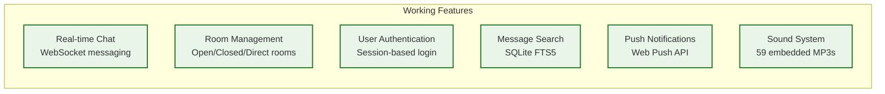

# Campfire Rust

**A Rust-based chat application inspired by Basecamp's Campfire.**

## What Works Now

**Text-based chat with real-time features** - A working approximation of core Campfire functionality. Suitable for teams needing basic chat capabilities.

## Quick Start

```bash
git clone https://github.com/that-in-rust/campfire-on-rust.git
cd campfire-on-rust
cargo run
```

Access at `http://localhost:3000` with `admin@example.com` / `password`

## Current Features



## Implementation Notes

This is a **working approximation** of Campfire's core functionality, not a complete recreation. Key differences:

- **File attachments** - UI shows "Coming in v2.0" messaging
- **Avatar uploads** - Text initials displayed instead  
- **OpenGraph previews** - Links shown without preview cards
- **Architecture** - Uses SQLite instead of PostgreSQL, different session handling
- **Performance** - Likely different characteristics than the original Rails application

## Troubleshooting

**Database locked error:**
```bash
pkill -f campfire
rm -f campfire.db-wal campfire.db-shm
cargo run
```

**Port 3000 in use:**
```bash
export PORT=3001
cargo run
```

## Interface Previews

Preview the interface components at [docs/interface-previews/](docs/interface-previews/):

- [Login Page](docs/interface-previews/01-login-page.html)
- [Main Chat Interface](docs/interface-previews/02-main-chat-interface.html)
- [Room Management](docs/interface-previews/03-room-management.html)
- [Search Interface](docs/interface-previews/04-search-interface.html)
- [User Settings](docs/interface-previews/05-user-settings.html)
- [Mobile Chat](docs/interface-previews/06-mobile-chat.html)
- [Sound System](docs/interface-previews/07-sound-system.html)
- [Push Notifications](docs/interface-previews/08-push-notifications.html)
- [Bot Integration](docs/interface-previews/09-bot-integration.html)
- [Admin Dashboard](docs/interface-previews/10-admin-dashboard.html)
- [Dark Mode](docs/interface-previews/11-dark-mode.html)
- [Error States](docs/interface-previews/12-error-states.html)

## Documentation

- [API Overview](docs/api-overview.md) - REST and WebSocket APIs
- [Deployment Guide](docs/deployment-guide.md) - Production deployment
- [Authentication Guide](docs/authentication-guide.md) - Session management
- [WebSocket Guide](docs/websocket-guide.md) - Real-time features
- [Search Guide](docs/search-guide.md) - Full-text search
- [Bot Integration](docs/bot-integration.md) - API and webhooks

## Acknowledgments

This project was inspired by the original Campfire application from **Basecamp**. Thanks to **DHH** and **Jason Fried** for open-sourcing the original codebase, which provided valuable reference for understanding chat application patterns.