# Campfire 🔥
> **Team chat that works.** Real-time messaging. Zero-friction deployment. Built for teams who value simplicity over complexity.

## 🙏 A Humble Tribute

**Thank you to DHH and Jason Fried** for creating the original Campfire at Basecamp and sharing it with the world. Your vision of simple, effective team communication inspired countless developers and teams.

This project is a **humble fork of Campfire reimagined in Rust** - not an attempt to improve on perfection, but rather a loving tribute that brings the same elegant simplicity to the Rust ecosystem. We've tried to capture the essence of what made Campfire special: **real-time chat that just works**, without the complexity that plagues modern communication tools.

**The Story**: When Basecamp sunset the original Campfire, many teams lost a tool they genuinely loved. This Rust implementation aims to preserve that experience - the same clean interface, the same focus on core functionality, the same "it just works" philosophy that made Campfire beloved by developers worldwide.

**Our Goal**: Keep the Campfire spirit alive with Rust's reliability and performance, while staying true to the original's commitment to simplicity over feature bloat.

---

## 🔥 Get Campfire Working Right Now

Choose your path to working team chat:

```mermaid
%%{init: {'theme':'base', 'themeVariables': {'primaryColor':'#ff6b35','primaryTextColor':'#ffffff','primaryBorderColor':'#ff6b35','lineColor':'#333333','secondaryColor':'#f4f4f4','tertiaryColor':'#ffffff','background':'#ffffff','mainBkg':'#ff6b35','secondBkg':'#f8f9fa','tertiaryBkg':'#ffffff'}}}%%
graph LR
    A["👋 Want Campfire?"] --> B["👀 Try it locally<br/>2 minutes"]
    A --> C["🚀 Deploy for team<br/>3 minutes"]
    
    B --> D["Working on localhost:3000"]
    C --> E["Working team chat"]
    
    D --> F["Ready to deploy for real?"]
    F --> C
    
    classDef choice fill:#fff3e0,stroke:#ff9800,stroke-width:2px
    classDef local fill:#e3f2fd,stroke:#2196f3,stroke-width:2px
    classDef deploy fill:#e8f5e8,stroke:#4caf50,stroke-width:2px
    
    class A,F choice
    class B,D local
    class C,E deploy
```

<div align="center">



</div>

---

## 👀 Try it locally
**See Campfire working on your machine in 2 minutes**

```bash
curl -sSL https://raw.githubusercontent.com/that-in-rust/campfire-on-rust/main/scripts/install.sh | bash
```

**Then visit:** `http://localhost:3000`

✅ **What you get:**
- Working team chat with demo conversations
- All core features (rooms, messages, search, @mentions, sounds)
- Multiple demo users to test with
- Clear "Deploy for Your Team" button when you're ready

---

## 🚀 Deploy for your team
**Get team chat running in 3 minutes**

<div align="center">

[](https://railway.app/template/campfire-rust)

<!-- Privacy-friendly analytics tracking -->


</div>

**What happens:**
1. Click button → Railway handles everything automatically
2. Get your team chat URL in ~3 minutes
3. Create admin account and invite your team
4. Start chatting immediately

✅ **What you get:**
- Working team chat with HTTPS
- Persistent storage and backups
- Zero-downtime updates
- No credit card required (Railway free tier)

---

## 💬 What is Campfire?

**Team chat that actually works.** Inspired by Basecamp's original Campfire, built in Rust for reliability and performance.

**Core Features:**
- 💬 Real-time messaging with WebSocket delivery
- 🏠 Room management (open, closed, direct messages)  
- 🔍 Full-text search across all message history
- 👥 @mentions and notifications
- 🎵 Fun sound system with 59 /play commands
- 🤖 Bot integration via API and webhooks
- 📱 Mobile-responsive design
- 🔐 Secure authentication and session management

**Why Campfire?**
- ⚡ Starts in under 1 second, uses ~20MB RAM
- 🛡️ Built-in security and rate limiting
- 💸 Self-hosted = no recurring costs
- 🎯 Core features only, no bloat

---

## 🤔 Still deciding?

**Try locally first** → See it working → **Deploy for your team**

The local install includes demo data with realistic conversations so you can see exactly what your team will get. When you're ready, there's a prominent "Deploy for Your Team" button right in the interface.

**For developers:** Want to contribute or customize? The local install gives you full source access:
```bash
git clone https://github.com/that-in-rust/campfire-on-rust.git
cd campfire-on-rust
cargo run
```

---

## 🏗️ How it works

**Simple, proven architecture:**
- **Single Binary**: All assets embedded, zero external dependencies
- **SQLite Database**: Proven reliability, zero-configuration, excellent performance  
- **Rust + Async**: Memory-safe concurrency, handles 100+ concurrent users
- **WebSocket**: Real-time messaging with automatic reconnection

**Performance:**
- 🚀 Starts in under 1 second
- 💾 Uses ~20MB RAM + 1MB per active user
- 💬 Handles 100+ concurrent users per instance
- 🔍 Search across 10,000+ messages in <10ms

**Security:**
- 🔐 bcrypt password hashing and secure session tokens
- 🛡️ Built-in rate limiting and input validation
- 🌐 HTTPS enforcement and CSRF protection
- 📊 Health monitoring and graceful shutdown

---

## 🎯 Honest comparison

**What Campfire does well:**
- ⚡ 2-minute setup vs 15+ minutes for alternatives
- 💸 $0 cost (self-hosted) vs $200-400/month for hosted solutions
- 🎯 Core features only, no bloat
- 🔧 Single binary, zero external dependencies

**What Campfire doesn't have (yet):**
- File attachments (planned for v0.2)
- Voice/video calls (not planned)
- Native mobile apps (web responsive works great)

**Campfire's sweet spot:** Teams who want reliable chat without complexity, vendor lock-in, or recurring costs.

---

## 📚 Need help?

**Getting Started:**
- 🐛 **Issues**: [GitHub Issues](https://github.com/that-in-rust/campfire-on-rust/issues)
- 💬 **Discussions**: [GitHub Discussions](https://github.com/that-in-rust/campfire-on-rust/discussions)
- 📖 **Documentation**: [Complete guides](docs/)

**Contributing:**
- 🔧 **Code**: See [Contributing Guide](CONTRIBUTING.md)
- 💡 **Ideas**: Share feature requests in Discussions

**Roadmap:**
- **v0.2**: File attachments, avatar uploads
- **v0.3**: Advanced search, analytics
- **v1.0**: Enterprise features, SSO

---

## 🛠️ Troubleshooting

Having issues? Here are solutions to the most common problems:

### 🚨 Installation Issues

#### "Download failed" or "404 Not Found"
**Problem**: The install script can't download the binary for your platform.

**Solutions**:
1. **Check your platform**: Run `uname -s` and `uname -m` to verify your OS and architecture
2. **Manual download**: Visit [GitHub Releases](https://github.com/that-in-rust/campfire-on-rust/releases) and download directly
3. **Build from source**: 
   ```bash
   git clone https://github.com/that-in-rust/campfire-on-rust.git
   cd campfire-on-rust
   cargo build --release
   ./target/release/campfire-on-rust
   ```

#### "Permission denied" or "Command not found"
**Problem**: Binary isn't executable or not in PATH.

**Solutions**:
1. **Make executable**: `chmod +x ~/.local/bin/campfire-on-rust`
2. **Add to PATH**: Add `export PATH="$PATH:$HOME/.local/bin"` to your shell config
3. **Run directly**: `~/.local/bin/campfire-on-rust`

#### "curl: command not found"
**Problem**: Missing download tools on minimal systems.

**Solutions**:
1. **Install curl**: 
   - Ubuntu/Debian: `sudo apt install curl`
   - CentOS/RHEL: `sudo yum install curl`
   - macOS: `brew install curl`
2. **Use wget instead**: Replace `curl -sSL` with `wget -qO-` in the install command
3. **Manual install**: Download binary directly from GitHub releases

### 🚀 Startup Issues

#### "Address already in use" (Port 3000 busy)
**Problem**: Another service is using port 3000.

**Solutions**:
1. **Change port**: Edit `~/.campfire/.env` and set `CAMPFIRE_PORT=3001`
2. **Find conflicting service**: `lsof -i :3000` or `netstat -tulpn | grep 3000`
3. **Kill conflicting process**: `sudo kill -9 <PID>`

#### "Database locked" or SQLite errors
**Problem**: Database file corruption or permission issues.

**Solutions**:
1. **Reset database**: 
   ```bash
   rm ~/.campfire/campfire.db
   # Restart Campfire - it will recreate the database
   ```
2. **Fix permissions**: `chmod 644 ~/.campfire/campfire.db`
3. **Check disk space**: `df -h ~` (SQLite needs write access)

#### "Failed to bind to address"
**Problem**: Can't bind to the configured host/port.

**Solutions**:
1. **Use localhost**: Set `CAMPFIRE_HOST=127.0.0.1` in `~/.campfire/.env`
2. **Check firewall**: Ensure port 3000 isn't blocked
3. **Run as different user**: Some systems restrict port binding

### 🌐 Railway Deployment Issues

#### "Build failed" or "Deployment timeout"
**Problem**: Railway deployment isn't completing successfully.

**Solutions**:
1. **Check build logs**: Click on your deployment in Railway dashboard → View logs
2. **Retry deployment**: Click "Redeploy" in Railway dashboard
3. **Use different region**: Try deploying to a different Railway region
4. **Contact Railway support**: If persistent, reach out to Railway's support team

#### "Application failed to respond"
**Problem**: Deployment succeeded but app won't start.

**Solutions**:
1. **Check environment variables**: Ensure `PORT` is set correctly (Railway auto-sets this)
2. **View runtime logs**: Check Railway logs for startup errors
3. **Database issues**: Railway auto-provisions PostgreSQL - check connection string
4. **Memory limits**: Ensure your Railway plan has sufficient memory (512MB minimum)

#### "Domain not working" or SSL issues
**Problem**: Can't access your deployed Campfire via the provided URL.

**Solutions**:
1. **Wait for DNS**: New deployments can take 2-5 minutes for DNS propagation
2. **Check deployment status**: Ensure deployment shows "Active" in Railway dashboard
3. **Try direct Railway URL**: Use the `*.railway.app` URL instead of custom domain
4. **Clear browser cache**: Hard refresh (Ctrl+F5) or try incognito mode

### 💻 Browser Issues

#### "WebSocket connection failed"
**Problem**: Real-time messaging isn't working.

**Solutions**:
1. **Check browser console**: Press F12 → Console tab for WebSocket errors
2. **Disable browser extensions**: Ad blockers can interfere with WebSockets
3. **Try different browser**: Test in Chrome, Firefox, or Safari
4. **Check network**: Corporate firewalls often block WebSocket connections

#### "Page won't load" or infinite loading
**Problem**: Campfire interface doesn't appear.

**Solutions**:
1. **Clear browser cache**: Hard refresh (Ctrl+F5) or clear all site data
2. **Disable JavaScript blockers**: Ensure JavaScript is enabled
3. **Check browser compatibility**: Campfire requires modern browsers (Chrome 80+, Firefox 75+)
4. **Try incognito mode**: Rules out extension conflicts

### 📱 Mobile & Tablet Issues

#### "Interface looks broken on mobile"
**Problem**: Layout doesn't work properly on phones or tablets.

**Solutions**:
1. **Check viewport**: Ensure you're accessing `http://localhost:3000` (not `127.0.0.1`)
2. **Rotate device**: Try both portrait and landscape orientations
3. **Clear mobile browser cache**: Mobile browsers cache aggressively
4. **Try mobile Chrome/Safari**: Campfire is optimized for modern mobile browsers

**📱 Mobile-Friendly Design**: Campfire's interface is fully responsive and optimized for mobile devices. The "Deploy on Railway" button is easily tappable on phones, and the entire chat interface works seamlessly on tablets and smartphones.

#### "Can't tap buttons or type messages"
**Problem**: Touch interactions don't work on mobile.

**Solutions**:
1. **Zoom out**: Ensure page isn't zoomed in (pinch to zoom out)
2. **Disable reader mode**: Turn off Safari Reader or similar features
3. **Check for overlays**: Close any browser notifications or overlays
4. **Restart browser**: Force-close and reopen your mobile browser

#### "Virtual keyboard covers message input"
**Problem**: On-screen keyboard hides the message composer.

**Solutions**:
1. **Scroll down**: The interface should auto-adjust, but try scrolling
2. **Rotate to landscape**: Landscape mode provides more screen space
3. **Use external keyboard**: Bluetooth keyboards work great with tablets
4. **Update browser**: Newer mobile browsers handle this better

#### "Slow performance on mobile"
**Problem**: Campfire feels sluggish on phones or tablets.

**Solutions**:
1. **Close other apps**: Free up memory by closing background apps
2. **Check network**: Switch between WiFi and cellular to test connection
3. **Disable animations**: Some browsers have "reduce motion" settings
4. **Try incognito mode**: Rules out extensions and cached data issues

### 🔧 Configuration Issues

#### "Demo mode not working"
**Problem**: `CAMPFIRE_DEMO_MODE=true` doesn't show demo data.

**Solutions**:
1. **Restart after config change**: Stop Campfire (Ctrl+C) and restart
2. **Check .env file location**: Should be `~/.campfire/.env`
3. **Verify syntax**: No spaces around `=` in environment variables
4. **Reset database**: Demo data is only created on first run with empty database

#### "Can't create admin account"
**Problem**: Setup page doesn't work or admin creation fails.

**Solutions**:
1. **Check database permissions**: Ensure `~/.campfire/` directory is writable
2. **Verify password requirements**: Must be at least 8 characters
3. **Clear existing data**: If upgrading, remove old database file
4. **Check logs**: Run Campfire in terminal to see error messages

### 📞 Getting More Help

**Still stuck?** Here's how to get personalized help:

#### 🐛 Report Issues
**For bugs or technical problems:**
- **GitHub Issues**: [Create new issue](https://github.com/that-in-rust/campfire-on-rust/issues/new)
- **Include**: Your OS, browser, error messages, and steps to reproduce
- **Response time**: Usually within 24 hours

#### 💬 Ask Questions  
**For usage questions or deployment help:**
- **GitHub Discussions**: [Start a discussion](https://github.com/that-in-rust/campfire-on-rust/discussions)
- **Community help**: Other users often provide quick answers
- **Feature requests**: Share ideas for improvements

#### 🚨 Urgent Issues
**For critical deployment problems:**
- **Email**: [campfire-support@that-in-rust.dev](mailto:campfire-support@that-in-rust.dev)
- **Include**: Deployment platform (Railway/Docker), error logs, timeline
- **Response time**: Within 4 hours during business hours (UTC-8)

#### 📋 When Reporting Issues
**Help us help you faster by including:**
1. **Platform**: OS, browser, deployment method (local/Railway/Docker)
2. **Version**: Run `campfire-on-rust --version` or check GitHub release
3. **Error messages**: Copy exact error text from logs or browser console
4. **Steps to reproduce**: What you did before the problem occurred
5. **Expected vs actual**: What should happen vs what actually happens

**Example good issue report:**
```
Platform: macOS 13.1, Chrome 108, local installation
Version: v0.1.0
Error: "WebSocket connection failed" in browser console
Steps: 1) Ran install script 2) Started Campfire 3) Opened localhost:3000
Expected: Real-time chat should work
Actual: Messages don't appear in real-time, page shows "Connecting..."
```

---

## 🙏 Acknowledgments

Inspired by the original **Campfire** from **Basecamp**. Thanks to **DHH** and **Jason Fried** for pioneering simple, effective team communication.

**Built with**: Rust 🦀, Axum, SQLite, WebSockets, and a focus on simplicity over complexity.

---

<div align="center">

## Ready for team chat that actually works?

<table>
<tr>
<td align="center" width="50%">

### 👀 Try it locally
**See it working in 2 minutes**

```bash
curl -sSL https://raw.githubusercontent.com/that-in-rust/campfire-on-rust/main/scripts/install.sh | bash
```

</td>
<td align="center" width="50%">

### 🚀 Deploy for your team  
**Working team chat in 3 minutes**

[](https://railway.app/template/campfire-rust)

</td>
</tr>
</table>

*Made with ❤️ by the Rust community*

</div>

