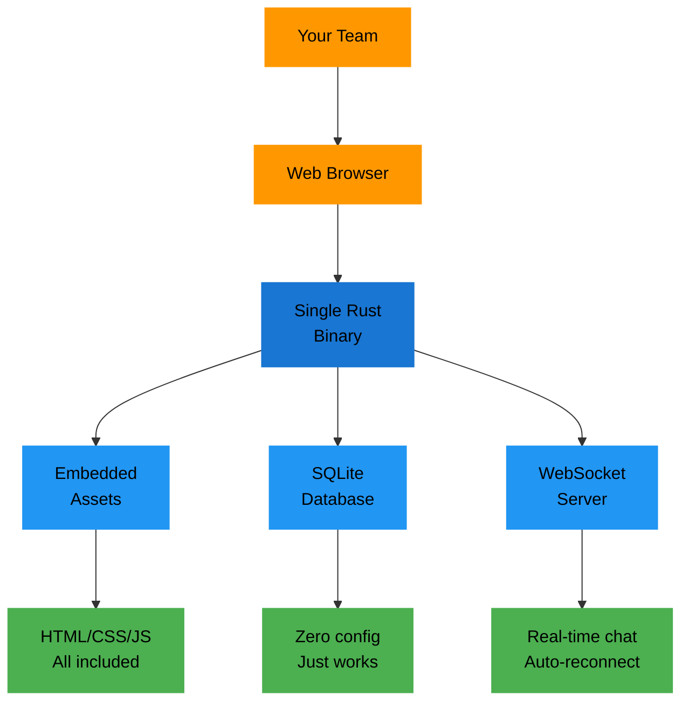
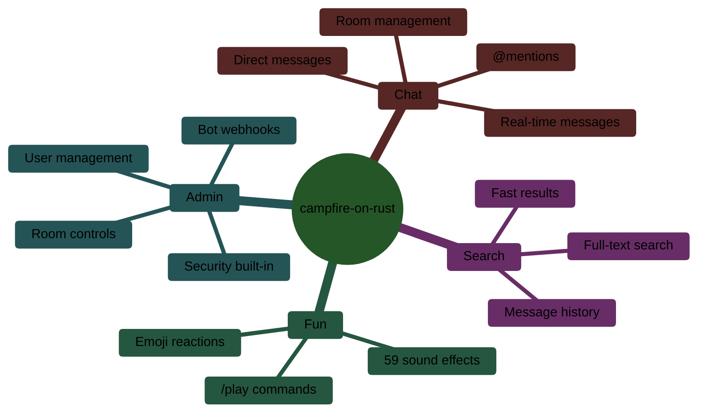

# campfire-on-rust 🔥

> Team chat that just works. No drama, no complexity, no monthly fees.

**Status**: Ready to ship 🚀 | **Version**: v0.1.0 | **Released**: Dec 26, 2024

## What's this?

Remember when Basecamp had Campfire and it was actually good? This is campfire-on-rust. Same clean vibes, same "it just works" energy, zero vendor lock-in.

```mermaid
%%{init: {'theme':'base', 'themeVariables': {'primaryColor':'#ff6b35','primaryTextColor':'#000000','primaryBorderColor':'#ff6b35','lineColor':'#333333','secondaryColor':'#f4f4f4','tertiaryColor':'#ffffff','background':'#ffffff','mainBkg':'#ff6b35','secondBkg':'#f8f9fa','tertiaryBkg':'#ffffff'}, 'flowchart': {'nodeSpacing': 75, 'rankSpacing': 75, 'wrappingWidth': 150}}}%%
flowchart TD
    A[Want team<br/>chat?] --> B{Try it<br/>first?}
    B -->|Yes| C[2min local<br/>install]
    B -->|Deploy now| D[3min Railway<br/>deploy]
    C --> E[localhost:3000<br/>✨]
    E --> F{Like it?}
    F -->|Yes| D
    F -->|No| G[No worries<br/>👋]
    D --> H[Team chat<br/>live 🎉]
    
    classDef startNode fill:#e3f2fd,stroke:#2196f3,stroke-width:2px,color:#000000
    classDef actionNode fill:#fff3e0,stroke:#ff9800,stroke-width:2px,color:#000000
    classDef successNode fill:#e8f5e8,stroke:#4caf50,stroke-width:2px,color:#000000
    classDef endNode fill:#fce4ec,stroke:#e91e63,stroke-width:2px,color:#000000
    
    class A startNode
    class C,D actionNode
    class E,H successNode
    class G endNode
```



## Quick start (pick one)

### 👀 Try it locally (2 minutes)
```bash
curl -sSL https://raw.githubusercontent.com/that-in-rust/campfire-on-rust/main/scripts/install.sh | bash
```
Then hit `http://localhost:3000` - boom, working chat with demo data.

### 🚀 Deploy for your team (3 minutes)
[](https://railway.app/template/campfire-rust)

Click → wait 3 minutes → get your team URL → start chatting.

## Architecture (the good stuff)



**Why this rocks:**
- Starts in <1 second, uses ~20MB RAM
- One file = entire app (no dependencies)
- SQLite = bulletproof, fast, zero setup
- WebSockets = instant messages, no polling

## Features (the essentials)



## Performance numbers

```mermaid
%%{init: {'theme':'base', 'themeVariables': {'primaryColor':'#ff6b35','primaryTextColor':'#000000','primaryBorderColor':'#ff6b35','lineColor':'#333333'}}}%%
xychart-beta
    title "campfire-on-rust vs Alternatives"
    x-axis [Startup, Memory, Cost/month, Setup time]
    y-axis "Performance (lower = better)" 0 --> 100
    bar [1, 20, 0, 2]
    bar [15, 200, 50, 15]
    bar [30, 500, 200, 30]
```

- **Startup**: <1s vs 15-30s for alternatives
- **Memory**: 20MB vs 200-500MB for others  
- **Cost**: $0 (self-hosted) vs $50-200/month
- **Setup**: 2-3 minutes vs 15-30 minutes

## Honest comparison

**What campfire-on-rust nails:**
- ⚡ Actually fast (not "enterprise fast")
- 💸 Zero recurring costs
- 🎯 Does chat, doesn't try to be Slack
- 🔧 One binary, zero config hell

**What it doesn't have:**
- File uploads (coming in v0.2)
- Video calls (not planned - use Zoom)
- Native mobile apps (web works great)
- Enterprise buzzword compliance

**Sweet spot**: Teams who want reliable chat without the complexity tax.

## Deployment flow

```mermaid
%%{init: {'theme':'base', 'themeVariables': {'primaryColor':'#9c27b0','primaryTextColor':'#000000','primaryBorderColor':'#9c27b0','lineColor':'#333333'}}}%%
sequenceDiagram
    participant You
    participant Railway
    participant Campfire
    participant Team
    
    You->>Railway: Click deploy button
    Railway->>Railway: Build Rust binary
    Railway->>Railway: Provision database
    Railway->>Campfire: Deploy & start
    Campfire->>Railway: Health check ✅
    Railway->>You: Here's your URL
    You->>Team: Send invite links
    Team->>Campfire: Start chatting 🎉
```



## Need help?

**Quick fixes:**
- 🐛 **Issues**: [GitHub Issues](https://github.com/that-in-rust/campfire-on-rust/issues)
- 💬 **Questions**: [Discussions](https://github.com/that-in-rust/campfire-on-rust/discussions)
- 📖 **Docs**: Check the `docs/` folder

**Contributing:**
- Fork it, hack it, PR it
- See `archive/project-docs/CONTRIBUTING.md` for details

## Roadmap

```mermaid
%%{init: {'theme':'base', 'themeVariables': {'primaryColor':'#607d8b','primaryTextColor':'#000000','primaryBorderColor':'#607d8b','lineColor':'#333333'}}}%%
timeline
    title campfire-on-rust Roadmap
    
    section v0.1 ✅
        Dec 2024 : Core chat
                 : WebSocket messaging
                 : Room management
                 : Search & @mentions
                 : Sound effects
    
    section v0.2 🚧
        Q1 2025 : File attachments
                : Avatar uploads
                : Better mobile UX
    
    section v0.3 📋
        Q2 2025 : Advanced search
                : Usage analytics
                : API improvements
    
    section v1.0 🎯
        Q3 2025 : Enterprise features
                : SSO integration
                : Advanced admin tools
```



## Troubleshooting

**Port 3000 busy?**
```bash
# Change port in ~/.campfire-on-rust/.env
echo "CAMPFIRE_PORT=3001" >> ~/.campfire-on-rust/.env
```

**Database issues?**
```bash
# Reset everything
rm ~/.campfire-on-rust/campfire.db
# Restart campfire-on-rust - it'll recreate the DB
```

**Railway deploy failing?**
- Check the build logs in Railway dashboard
- Try a different region
- Hit "Redeploy" - sometimes it just works™

## Thanks

Huge props to **DHH** and **Jason Fried** for the original Campfire. campfire-on-rust is just a love letter to that simplicity, written in Rust.

---

<div align="center">

**Ready to ditch the chat complexity?**

[Try locally](https://raw.githubusercontent.com/that-in-rust/campfire-on-rust/main/scripts/install.sh) • [Deploy now](https://railway.app/template/campfire-rust) • [Star on GitHub](https://github.com/that-in-rust/campfire-on-rust)

*Built with 🦀 Rust and ❤️ by people who miss simple software*

</div>