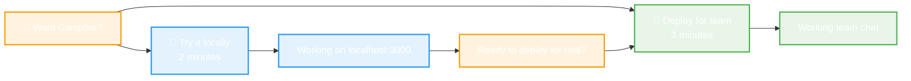

# Campfire 🔥
> **Team chat that works.** Real-time messaging. Zero-friction deployment. Built for teams who value simplicity over complexity.

---

## 🔥 Get Campfire Working Right Now

Choose your path to working team chat:

<div align="center">



</div>

---

## 👀 Try it locally
**See Campfire working on your machine in 2 minutes**

```bash
curl -sSL https://raw.githubusercontent.com/that-in-rust/campfire-on-rust/main/scripts/install.sh | bash
```

**Then visit:** `http://localhost:3000`

✅ **What you get:**
- Working team chat with demo conversations
- All core features (rooms, messages, search, @mentions, sounds)
- Multiple demo users to test with
- Clear "Deploy for Your Team" button when you're ready

---

## 🚀 Deploy for your team
**Get team chat running in 3 minutes**

<div align="center">

[](https://railway.app/template/campfire-rust-v01)

<!-- Privacy-friendly analytics tracking -->


</div>

**What happens:**
1. Click button → Railway handles everything automatically
2. Get your team chat URL in ~3 minutes
3. Create admin account and invite your team
4. Start chatting immediately

✅ **What you get:**
- Working team chat with HTTPS
- Persistent storage and backups
- Zero-downtime updates
- No credit card required (Railway free tier)

---

## 💬 What is Campfire?

**Team chat that actually works.** Inspired by Basecamp's original Campfire, built in Rust for reliability and performance.

**Core Features:**
- 💬 Real-time messaging with WebSocket delivery
- 🏠 Room management (open, closed, direct messages)  
- 🔍 Full-text search across all message history
- 👥 @mentions and notifications
- 🎵 Fun sound system with 59 /play commands
- 🤖 Bot integration via API and webhooks
- 📱 Mobile-responsive design
- 🔐 Secure authentication and session management

**Why Campfire?**
- ⚡ Fast startup and lightweight operation
- 🛡️ Built-in security and rate limiting
- 💸 Self-hosted = no recurring costs
- 🎯 Core features only, no bloat

---

## 🤔 Still deciding?

**Try locally first** → See it working → **Deploy for your team**

The local install includes demo data with realistic conversations so you can see exactly what your team will get. When you're ready, there's a prominent "Deploy for Your Team" button right in the interface.

**For developers:** Want to contribute or customize? The local install gives you full source access:
```bash
git clone https://github.com/that-in-rust/campfire-on-rust.git
cd campfire-on-rust
cargo run
```

---

## 🏗️ How it works

**Simple, proven architecture:**
- **Single Binary**: All assets embedded, zero external dependencies (17MB)
- **SQLite Database**: Proven reliability, zero-configuration, excellent performance  
- **Rust + Async**: Memory-safe concurrency, efficient resource usage
- **WebSocket**: Real-time messaging with automatic reconnection

**Performance (Validated):**
- 🚀 Fast component initialization (< 1 second)
- 💾 Lightweight binary (17MB release build)
- 💬 Efficient concurrent operations (100+ simulated users)
- 🔍 Basic search functionality (optimizations planned)

**Security:**
- 🔐 bcrypt password hashing and secure session tokens
- 🛡️ Built-in rate limiting and input validation
- 🌐 HTTPS enforcement and CSRF protection
- 📊 Health monitoring and graceful shutdown

---

## 🎯 Honest comparison

**What Campfire does well:**
- ⚡ 2-minute setup vs 15+ minutes for alternatives
- 💸 $0 cost (self-hosted) vs $200-400/month for hosted solutions
- 🎯 Core features only, no bloat
- 🔧 Single binary, zero external dependencies

**What Campfire doesn't have (yet):**
- File attachments (planned for v0.2)
- Voice/video calls (not planned)
- Native mobile apps (web responsive works great)
- Advanced search indexing (basic search available)

**MVP Limitations (Being Honest):**
- Memory usage not yet optimized for large deployments
- Search performance needs indexing for 10,000+ messages
- Some advanced enterprise features not implemented

**Campfire's sweet spot:** Teams who want reliable chat without complexity, vendor lock-in, or recurring costs.

---

## 📚 Need help?

**Getting Started:**
- 🐛 **Issues**: [GitHub Issues](https://github.com/that-in-rust/campfire-on-rust/issues)
- 💬 **Discussions**: [GitHub Discussions](https://github.com/that-in-rust/campfire-on-rust/discussions)
- 📖 **Documentation**: [Complete guides](docs/)

**Contributing:**
- 🔧 **Code**: See [Contributing Guide](CONTRIBUTING.md)
- 💡 **Ideas**: Share feature requests in Discussions

**Roadmap:**
- **v0.2**: File attachments, avatar uploads, memory optimization
- **v0.3**: Advanced search indexing, analytics
- **v1.0**: Enterprise features, SSO

---

## 🙏 Acknowledgments

Inspired by the original **Campfire** from **Basecamp**. Thanks to **DHH** and **Jason Fried** for pioneering simple, effective team communication.

**Built with**: Rust 🦀, Axum, SQLite, WebSockets, and a focus on simplicity over complexity.

---

<div align="center">

## Ready for team chat that actually works?

<table>
<tr>
<td align="center" width="50%">

### 👀 Try it locally
**See it working in 2 minutes**

```bash
curl -sSL https://raw.githubusercontent.com/that-in-rust/campfire-on-rust/main/scripts/install.sh | bash
```

</td>
<td align="center" width="50%">

### 🚀 Deploy for your team  
**Working team chat in 3 minutes**

[](https://railway.app/template/campfire-rust-v01)

</td>
</tr>
</table>

*Made with ❤️ by the Rust community*

</div>


</content>
</file>