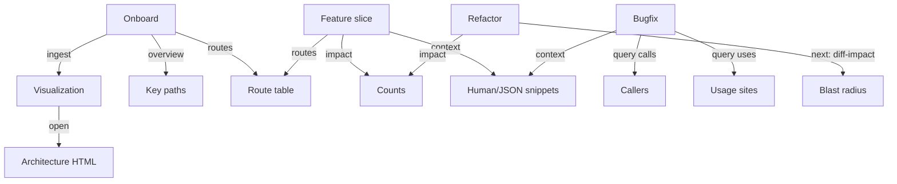

# Slate Insights Till Now — 2025-09-23 23:30:40

Purpose
- Capture the full flow of work so far: decisions, artifacts, scripts, and methods.
- Provide a repeatable, rigorous path for future contributors that’s token-efficient and aligned with our Design101 principles (TDD-first, layered architecture, safety, observability).

Chronological narrative (what we did and why)
1) Baseline documentation and architecture snapshot
- Created multiple SlateTIMESTAMP.md snapshots to document the system (routes, pages, handlers, services, feature flags).
- Produced parseltongue artifacts (architecture HTML visualization, context packs).
- Renamed all Slate*.md to a keyworded scheme Slate-Keyword-TIMESTAMP.md for discoverability.

2) All-in-one doc and impact focus
- Authored a comprehensive Slate-AllInOne snapshot with:
  - Route inventory (methods, paths, handlers, feature flags)
  - Screen-to-handler/template mapping with request/response shapes
  - Deeper parseltongue call-chain summaries for key components
  - CI-ready PR impact gate script (documented, not yet committed as scripts/pr-impact.sh at that time)
  - Parseltongue value assessment and user journeys

3) Developer journeys (JTBD) first, then scripts
- The user asked for developer journeys before building scripts.
- Created SlateUserJourneyTIMESTAMP.md capturing personas, JTBD flows, success metrics, and a scripts plan mapped to journeys.
- Grounded everything in .kiro/steering/design101-tdd-architecture-principles.md (executable specs, TDD, layered, safety, observability).

4) Parseltongue toolkit MVP (scripts/pt)
- Implemented a single entrypoint scripts/pt with subcommands:
  - ingest, latest, open, overview, query (uses|calls|grep), context, impact, routes
- Standardized outputs under ./parseltongue_workspace with a latest symlink.
- Documented usage inside Slate-AllInOne-20250923212530.md (appended a Toolkit usage section).

5) Troubleshooting and hardening
- Fixed shell syntax issues:
  - Heredoc operator: replaced cat <<EOF (resolved HTML-escaped operator issue that broke bash).
  - Routes extractor awk block: replaced partial/incomplete insertions with a clean, validated awk snippet.
- Validated syntax via bash -n and re-tested.
- Ran scripts/pt ingest successfully, generating a fresh analysis and visualization.

6) MVP definition and acceptance criteria
- Agreed on an MVP cut with executable acceptance criteria (WHEN…THEN…SHALL) for ingest, query, context, overview/routes, impact, and idempotence expectations.
- Captured performance budgets and a minimal backlog.

Key highlights and findings
- Parseltongue value in this repo
  - Orientation: architecture.html + generate-context give fast mental models.
  - Impact clarity: uses/calls counts quantify blast radius pre-PR/refactor.
  - Repeatability: scripted workflows for onboarding, bugfix tracing, and review.

- Hot path worthy of tests and guardrails
  - create_message_with_deduplication is a frequent entry-point with many callers (identified as a risk surface worth extra tests).

- Route and feature surface
  - Core APIs for auth, rooms, messages, search; optional sub-systems (sounds, push, bot); websocket real-time flow.
  - Demo-mode pages/templates and endpoints.

- Naming and discoverability
  - Keyworded Slate files reduce cognitive load. New docs are easy to spot by purpose.

JTBD-based toolkit mapping (how scripts fit into dev journeys)
- Onboard quickly
  - scripts/pt ingest → scripts/pt open → scripts/pt overview → scripts/pt routes
- Build a small feature slice
  - scripts/pt impact → scripts/pt context <Entity> → scripts/pt routes --format table
- Fix a bug
  - scripts/pt query calls <function> → scripts/pt query uses <Type> → scripts/pt context <Entity>
- Refactor safely
  - scripts/pt impact for high-signal pre-checks (uses/calls), pending next-iteration: pt diff-impact
- Review more confidently
  - scripts/pt impact + context excerpts + link to architecture.html

Toolkit summary (MVP delivered)
- scripts/pt subcommands
  - ingest: Build FILE:-header dump, ingest, generate viz/contexts under parseltongue_workspace/.
  - latest: Print latest analysis directory.
  - open: Print path to latest architecture.html (with optional --open).
  - overview: Pointers to key code areas and latest artifacts.
  - query uses|calls|grep: Token-efficient discovery of usage/callers + name search over entity graph.
  - context <Entity>: Human or JSON snippets for prompts/review.
  - impact: Quick uses/calls table for common entities/functions.
  - routes: Best-effort extraction from src/main.rs for method/path/handler (table or plain).
- Outputs
  - parseltongue_workspace/analysis_TIMESTAMP/{architecture.html, all_entities.txt, context_*.{txt,json}}
  - latest symlink for convenience
  - parseltongue_workspace/dumps/campfire_TIMESTAMP.dump

Reproducible command examples
- Ingest and visualize
  - scripts/pt ingest
  - scripts/pt open --open
- Trace usage and callers
  - scripts/pt query uses MessageService
  - scripts/pt query calls create_message_with_deduplication
- Grab compact context for prompting
  - scripts/pt context MessageService --out
- Summarize routes
  - scripts/pt routes --format table
- Quick impact
  - scripts/pt impact

Troubleshooting notes (what we fixed and how)
- Heredoc operator
  - Symptom: bash syntax error near unexpected token `;&` at the heredoc start.
  - Cause: HTML-escaped operator in the script (<< became &lt;&lt;).
  - Fix: Replace with cat <<EOF and revalidate with bash -n scripts/pt.

- sub_routes awk block
  - Symptom: syntax error near unexpected token line, due to duplicate/stray fragment lines after earlier partial edits.
  - Fix: Replace the entire function with a single clean awk block; validate; rerun ingest.

MVP acceptance criteria (executable)
1) Ingestion
- WHEN scripts/pt ingest runs
- THEN it SHALL create parseltongue_workspace/analysis_TIMESTAMP with architecture.html and all_entities.txt, and update parseltongue_workspace/latest

2) Query (uses/calls)
- WHEN scripts/pt query uses MessageService runs
- THEN it SHALL print usage sites (or empty) without error

3) Context export
- WHEN scripts/pt context MessageService --out runs
- THEN it SHALL write context_MessageService.txt into parseltongue_workspace/latest and print the file path

4) Overview and routes
- WHEN scripts/pt overview runs
- THEN it SHALL print key paths including latest viz and entities list
- WHEN scripts/pt routes --format table runs
- THEN it SHALL print method/path/handler rows (best-effort, no crash if patterns are missing)

5) Impact snapshot
- WHEN scripts/pt impact runs
- THEN it SHALL print a table of symbols with uses/callers counts in under 5 seconds on this repo

6) Safety and idempotence
- WHEN scripts/pt ingest runs multiple times without --force
- THEN it SHALL generate new analysis_TIMESTAMP directories and update latest without mutating prior snapshots

Performance budget (MVP)
- Ingest time: <= 30s (observed ~0.06s here)
- query/context/impact: <= 5s per command in this repo

Backlog (next iteration after MVP)
- pt pr and pt diff-impact (CI-friendly PR gate and diff-based blast radius)
- Routes coverage improvements (nested routers, composed Router patterns)
- pt context extras (e.g., --callers <fn>, --deps)
- Structured outputs (--out json for impact) for machine consumption
- Optional index doc linking all Slate-* docs and latest visualization

Artifacts index (current state)
- Slate-AllInOne-20250923212530.md (now with Toolkit usage)
- Slate-Initial-20250923192202.md
- Slate-Overview-20250923194000.md
- Slate-Routes-20250923195030.md
- Slate-Executive-20250923210108.md
- Slate-Impact-20250923210245.md
- Slate-Assessment-20250923211326.md
- Slate-Hotspots-20250923211438.md
- Slate-Signals-20250923211700.md
- Slate-Journey-20250923212000.md
- SlateUserJourney20250923211756.md
- Parseltongue workspace: parseltongue_workspace/analysis_20250923232534 (latest symlinked), dumps/

Mermaid overview (dev flow and scripts)

Closing note
- The process was intentionally JTBD-first: clarify journeys, then build token-efficient scripts that slot into those journeys with high signal and low friction. The pragmatic fixes (heredoc, awk) and validation steps (bash -n, reruns) aim to keep the toolkit robust and friendly for contributors.