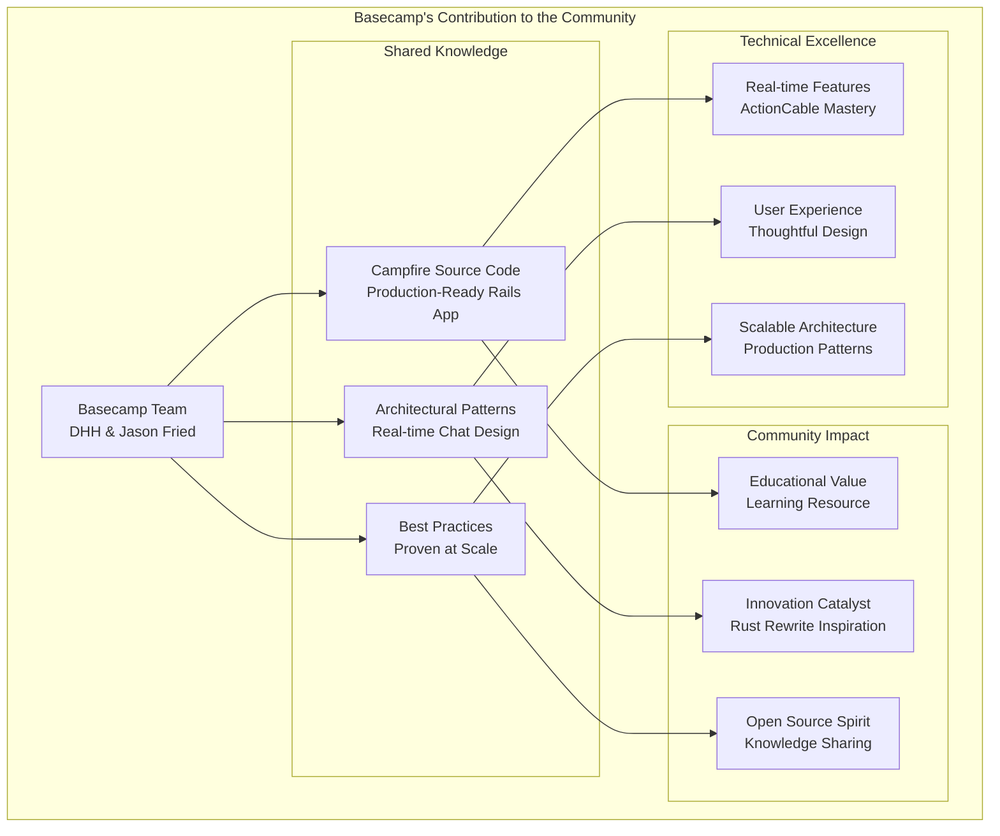
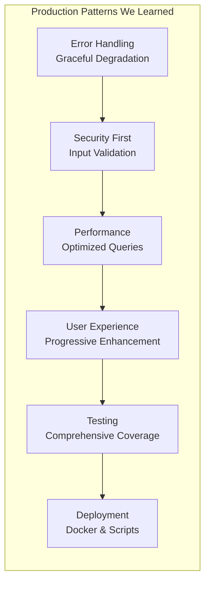
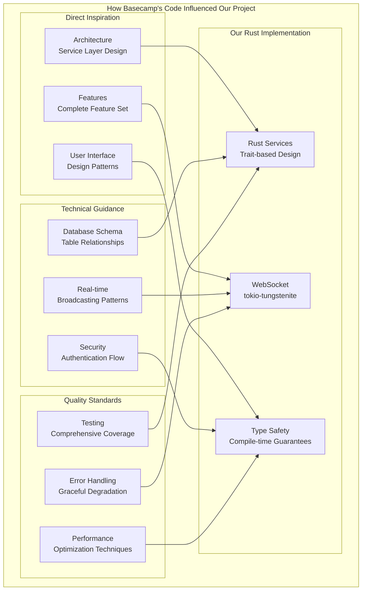
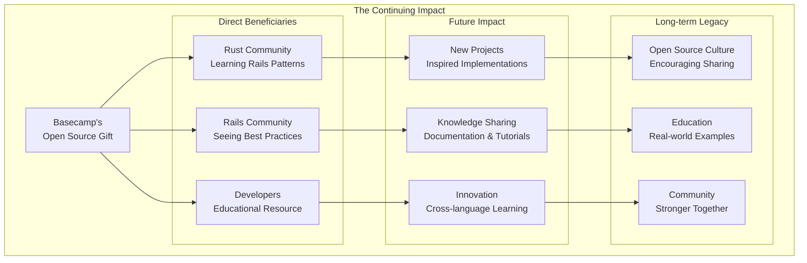

# Thank You to Basecamp: A Heartfelt Appreciation

## IMPORTANT FOR VISUALS AND DIAGRAMS

ALL DIAGRAMS WILL BE IN MERMAID ONLY TO ENSURE EASE WITH GITHUB - DO NOT SKIP THAT

## To DHH, Jason Fried, and the Entire Basecamp Team

We extend our deepest gratitude for sharing the **Campfire** source code with the world. This extraordinary act of generosity has provided invaluable insights into building real-world, production-quality chat applications and has served as the foundation for our Rust rewrite project.

## The Gift of Open Source Excellence



## What We Learned from Your Brilliant Code

### 1. **Architectural Excellence**

Your Campfire implementation demonstrates masterful software architecture:

- **Clean MVC Separation**: Perfect demonstration of Rails conventions
- **Real-time Communication**: ActionCable implementation that "just works"
- **Scalable Design**: Patterns that handle real-world usage gracefully
- **User Experience Focus**: Every detail crafted for actual humans

### 2. **Production-Ready Patterns**

The codebase reveals the difference between toy projects and production software:



### 3. **Real-World Complexity Handling**

Your code taught us how to handle the messy realities of production applications:

- **File Upload Management**: ActiveStorage integration done right
- **Rich Text Processing**: ActionText with proper sanitization
- **Push Notifications**: Web Push implementation with VAPID keys
- **Bot Integration**: Webhook system for external services
- **Search Functionality**: FTS5 integration with proper indexing
- **Presence Tracking**: Real-time user status with ActionCable

## Specific Technical Insights That Shaped Our Rust Implementation

### 1. **Message Deduplication Strategy**

Your approach to handling duplicate messages through database constraints inspired our "Critical Gap #1" solution:

**Rails Pattern (Your Code):**
```ruby
validates :client_message_id, presence: true, uniqueness: { scope: :room_id }
```

**Our Rust Adaptation:**
```rust
// UNIQUE constraint on (client_message_id, room_id)
// Returns existing message if duplicate detected
pub async fn create_message_with_deduplication(
    &self,
    content: String,
    room_id: RoomId,
    user_id: UserId,
    client_message_id: Uuid,
) -> Result<Message<Persisted>, MessageError>
```

### 2. **Real-time Broadcasting Architecture**

Your ActionCable channel design provided the blueprint for our WebSocket implementation:

**Rails Pattern (Your Code):**
```ruby
class RoomChannel < ApplicationCable::Channel
  def subscribed
    if @room = find_room
      stream_for @room
    else
      reject
    end
  end
end
```

**Our Rust Adaptation:**
```rust
#[async_trait]
pub trait ConnectionManager: Send + Sync {
    async fn broadcast_to_room(
        &self,
        room_id: RoomId,
        message: WebSocketMessage,
    ) -> Result<(), BroadcastError>;
}
```

### 3. **Session Management Simplicity**

Your straightforward session-based authentication showed us that simple solutions often work best:

**Rails Pattern (Your Code):**
```ruby
def authenticated_as(session)
  Current.user = session.user
  cookies.signed.permanent[:session_token] = { 
    value: session.token, 
    httponly: true, 
    same_site: :lax 
  }
end
```

This inspired our trait-based authentication system in Rust while maintaining the same security principles.

## The Educational Value of Your Generosity

### For Individual Developers

Your code serves as a masterclass in:
- **Rails Best Practices**: How to structure a real Rails application
- **Real-time Features**: Practical WebSocket implementation
- **User Interface Design**: Thoughtful UX decisions throughout
- **Testing Strategies**: Comprehensive test coverage patterns

### For the Rust Community

Your Rails implementation provided:
- **Architecture Patterns**: Proven designs to adapt to Rust
- **Feature Requirements**: Clear specifications for chat functionality
- **Performance Baselines**: Metrics to compare against
- **User Experience Standards**: Quality bar for our implementation

### For Open Source

Your decision to open-source Campfire demonstrates:
- **Knowledge Sharing**: How established companies can give back
- **Community Building**: Fostering learning and innovation
- **Technical Leadership**: Setting examples for others to follow

## Impact on Our Rust Rewrite Project



## Lessons That Transcend Technology Stacks

### 1. **Simplicity Over Complexity**

Your code consistently chooses simple, understandable solutions over clever complexity. This philosophy guided our Rust implementation to avoid over-engineering.

### 2. **User Experience First**

Every technical decision in your codebase serves the user experience. This reminded us that technology is a means to an end, not the end itself.

### 3. **Production Readiness**

Your attention to error handling, edge cases, and operational concerns taught us the difference between "working code" and "production code."

### 4. **Progressive Enhancement**

Your approach to building features that work without JavaScript and enhance with it influenced our decision to use server-rendered HTML with HTMX.

## A Model for the Industry

Your decision to open-source Campfire sets a powerful example for the entire software industry:

- **Established Companies Can Give Back**: Showing that successful businesses can contribute to the commons
- **Real Code, Not Toys**: Sharing actual production code, not simplified examples
- **Complete Applications**: Providing full context, not isolated snippets
- **Learning Opportunities**: Creating educational resources for the next generation

## Our Commitment to Continuing This Legacy

Inspired by your generosity, we commit to:

1. **Open Source Our Rust Implementation**: Making our code freely available
2. **Document Our Learnings**: Sharing insights about adapting Rails patterns to Rust
3. **Educational Content**: Creating resources for others learning Rust web development
4. **Community Contribution**: Giving back to both Rails and Rust communities

## Personal Reflections

As developers who have spent countless hours studying your code, we want to share what this means to us personally:

- **Professional Growth**: Your code elevated our understanding of web application architecture
- **Technical Inspiration**: Seeing how masters of the craft approach complex problems
- **Community Spirit**: Experiencing the generosity that makes open source special
- **Quality Standards**: Learning what production-ready code actually looks like

## The Ripple Effect



Your gift keeps giving, inspiring not just our project but countless others who will learn from your example.

## In Closing

To **DHH**, **Jason Fried**, and the entire **Basecamp team**: Thank you for showing us what generosity looks like in the software world. Your decision to share Campfire's source code has enriched our understanding, elevated our skills, and inspired our contribution to the open source community.

Your code is more than just Ruby and Rails—it's a masterclass in software craftsmanship, a testament to thoughtful design, and a gift to developers everywhere who strive to build better software.

We hope our Rust implementation honors the excellence of your original work while demonstrating how great ideas can transcend technology boundaries. The patterns you established in Rails translate beautifully to Rust, proving that good architecture is language-agnostic.

**Thank you for making the software world a little more open, a little more generous, and a lot more educational.**

---

*With deep appreciation and respect,*

*The Campfire Rust Rewrite Team*

---

## Technical Acknowledgments

**Original Campfire by Basecamp:**
- **Architecture**: Ruby on Rails with ActionCable
- **Real-time**: WebSocket broadcasting via ActionCable
- **Database**: SQLite with FTS5 search
- **Frontend**: ERB templates with Stimulus.js
- **Deployment**: Docker with single-container architecture

**Our Rust Implementation:**
- **Architecture**: Axum with tokio-tungstenite
- **Real-time**: Direct WebSocket handling with async/await
- **Database**: SQLite with rusqlite and FTS5
- **Frontend**: Askama templates with HTMX
- **Deployment**: Single binary with embedded assets

**Shared Principles:**
- Session-based authentication
- RESTful API design
- Real-time message broadcasting
- Rich text processing
- File attachment handling
- Push notification support
- Bot integration via webhooks

Your architectural decisions provided the roadmap; Rust's type system and performance characteristics provided the implementation advantages. Together, they create something greater than the sum of their parts.

**Thank you for lighting the way.**