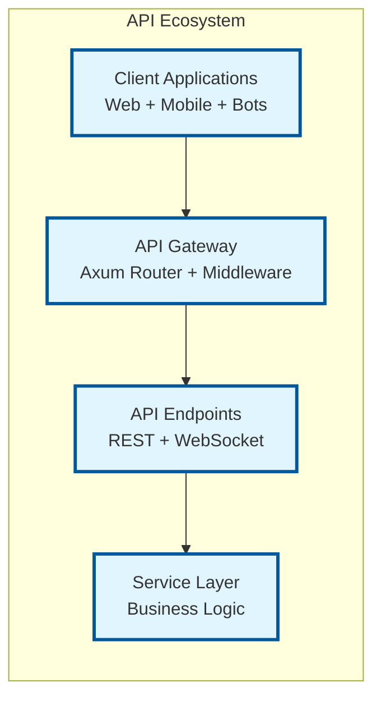
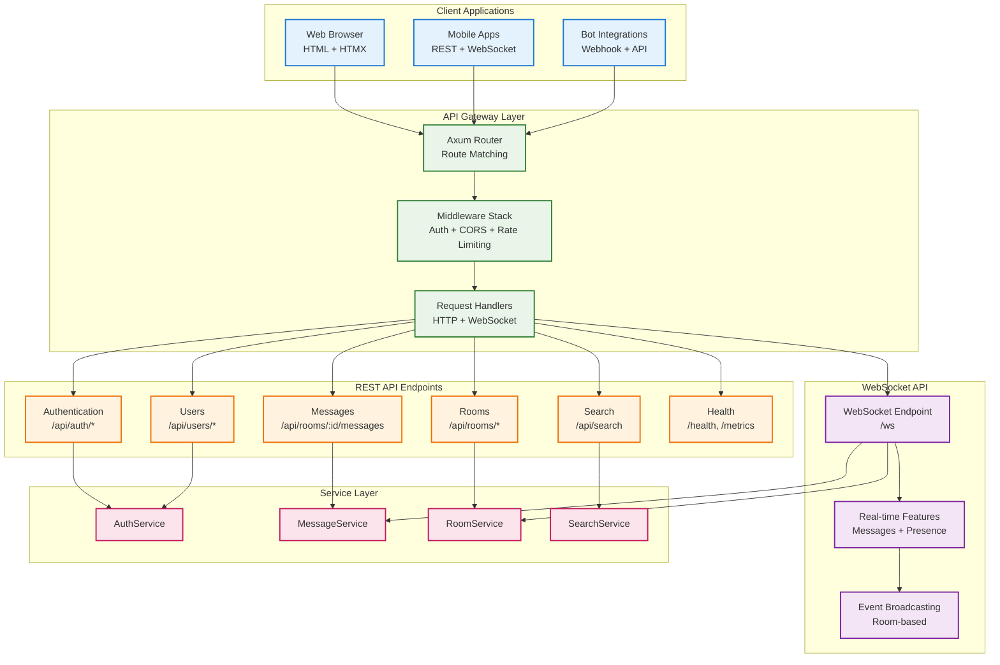
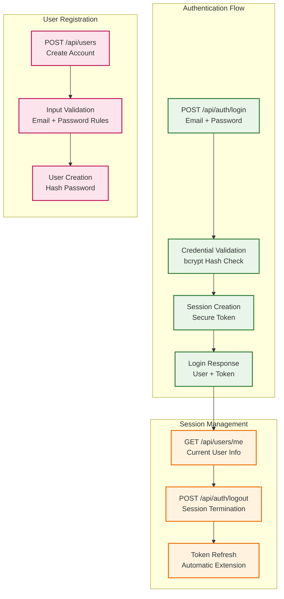
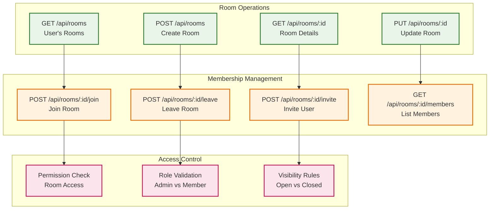
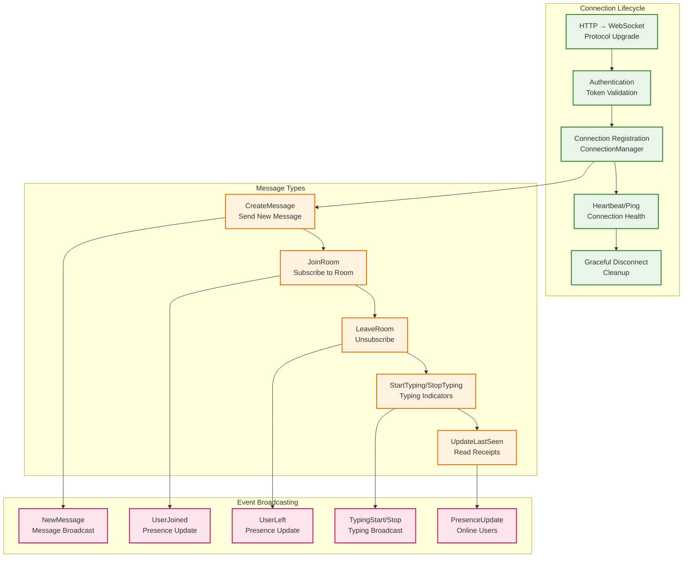
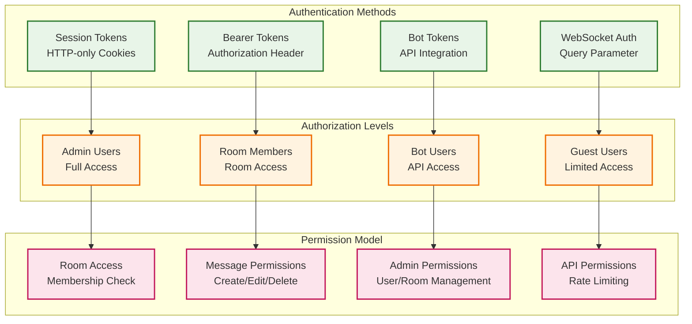
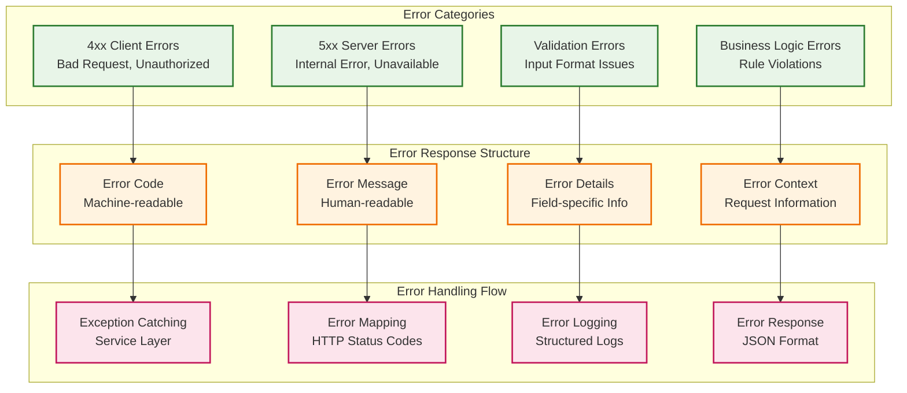
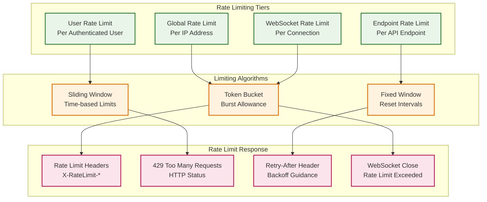
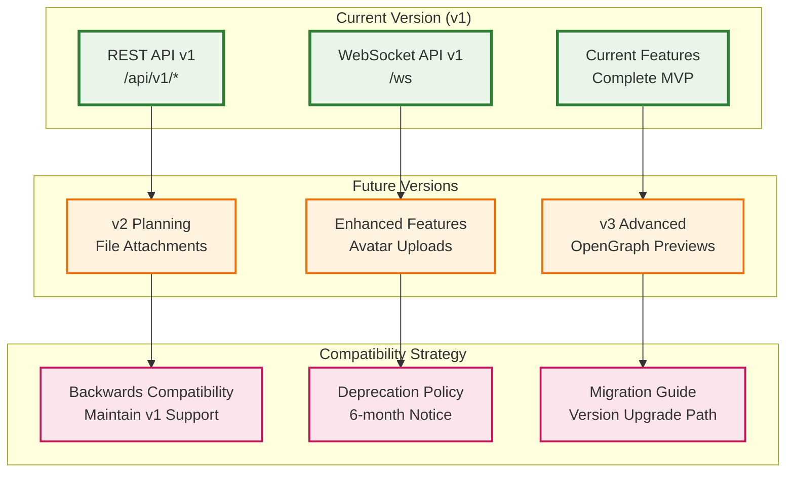
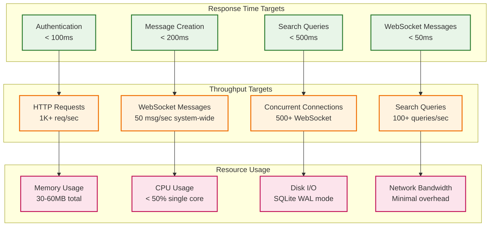

# API Overview

## API Architecture

The Campfire Rust API provides both REST endpoints and WebSocket connections for complete chat functionality.

## API Structure Overview



### Detailed API Architecture



## REST API Endpoints

### Authentication Endpoints



### Room Management Endpoints



### Message Endpoints

```mermaid
graph TD
    subgraph "Message Operations"
        direction TB
        SEND[POST /api/rooms/:id/messages<br/>Send Message]
        HISTORY[GET /api/rooms/:id/messages<br/>Message History]
        EDIT[PUT /api/messages/:id<br/>Edit Message]
        DELETE[DELETE /api/messages/:id<br/>Delete Message]
    end
    
    subgraph "Message Processing"
        direction TB
        VALIDATE[Content Validation<br/>Length + HTML Sanitization]
        DEDUP[Deduplication Check<br/>client_message_id]
        PERSIST[Database Persistence<br/>Atomic Transaction]
        BROADCAST[WebSocket Broadcast<br/>Room Subscribers]
    end
    
    subgraph "Message Features"
        direction TB
        MENTIONS[@ Mentions<br/>User Notifications]
        SOUNDS[Sound Commands<br/>/play integration]
        FORMATTING[Rich Text<br/>HTML Support]
        PAGINATION[History Pagination<br/>Cursor-based]
    end
    
    SEND --> VALIDATE
    HISTORY --> DEDUP
    EDIT --> PERSIST
    DELETE --> BROADCAST
    
    VALIDATE --> MENTIONS
    DEDUP --> SOUNDS
    PERSIST --> FORMATTING
    BROADCAST --> PAGINATION
    
    classDef operations fill:#e8f5e8,stroke:#2e7d32,stroke-width:2px
    classDef processing fill:#fff3e0,stroke:#ef6c00,stroke-width:2px
    classDef features fill:#fce4ec,stroke:#c2185b,stroke-width:2px
    
    class SEND,HISTORY,EDIT,DELETE operations
    class VALIDATE,DEDUP,PERSIST,BROADCAST processing
    class MENTIONS,SOUNDS,FORMATTING,PAGINATION features
```

## WebSocket API

### Connection Management



## Authentication & Authorization

### Security Model



## Error Handling

### Error Response Format



## Rate Limiting

### Rate Limiting Strategy



## API Versioning

### Versioning Strategy



## Performance Characteristics

### API Performance Metrics



## API Documentation Links

- **[Search API](search-api.md)** - Full-text search functionality
- **[WebSocket API](websocket-api.md)** - Real-time communication
- **[Architecture](architecture.md)** - System architecture overview
- **[Deployment](deployment.md)** - Deployment and operations guide
- **[Development](development.md)** - Development workflow and guidelines

## Quick Reference

### Base URLs
- **REST API**: `http://localhost:3000/api`
- **WebSocket**: `ws://localhost:3000/ws`
- **Health Check**: `http://localhost:3000/health`
- **Metrics**: `http://localhost:3000/metrics`

### Authentication
```bash
# Login and get session token
curl -X POST http://localhost:3000/api/auth/login \
  -H "Content-Type: application/json" \
  -d '{"email": "user@example.com", "password": "password"}'

# Use session token in subsequent requests
curl -H "Authorization: Bearer <session_token>" \
  http://localhost:3000/api/users/me
```

### WebSocket Connection
```javascript
const ws = new WebSocket('ws://localhost:3000/ws?token=<session_token>');
ws.onmessage = (event) => {
  const message = JSON.parse(event.data);
  console.log('Received:', message);
};
```

This API overview provides a comprehensive understanding of the Campfire Rust API architecture, endpoints, and usage patterns.