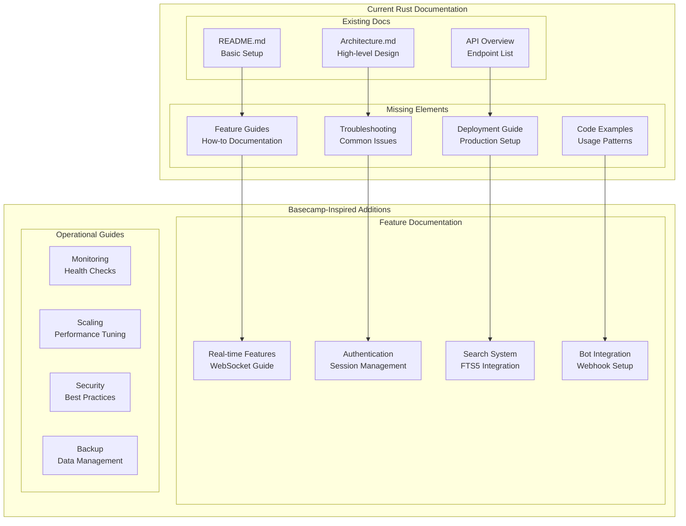
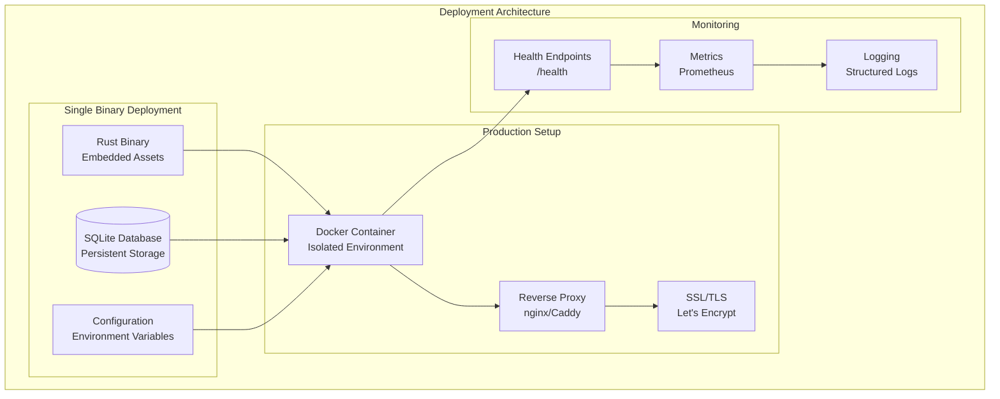
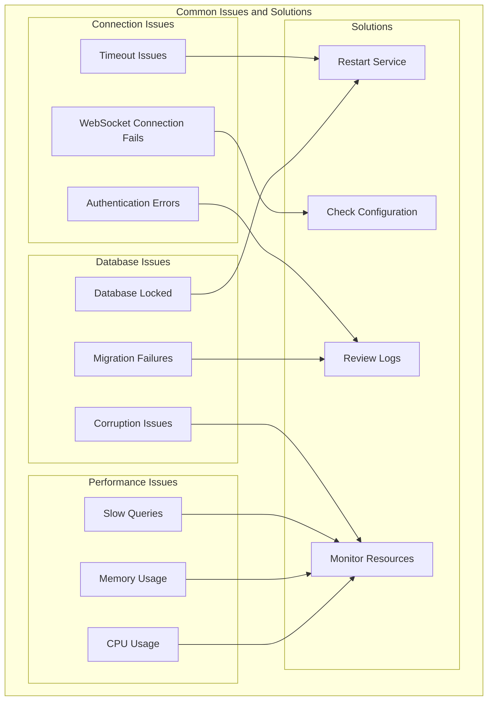

# Documentation Improvements Inspired by Basecamp's Campfire

## IMPORTANT FOR VISUALS AND DIAGRAMS

ALL DIAGRAMS WILL BE IN MERMAID ONLY TO ENSURE EASE WITH GITHUB - DO NOT SKIP THAT

## Executive Summary

After studying 21,000+ lines of the original Basecamp Campfire source code, this document outlines specific improvements we can make to our Rust implementation's documentation, inspired by the excellent patterns, organization, and attention to detail found in the original Rails codebase.

## Key Insights from Basecamp's Documentation Approach

### 1. **Comprehensive Feature Documentation**

Basecamp's code reveals a systematic approach to documenting features through:
- Clear controller organization with specific responsibilities
- Helper modules that document UI patterns
- Model concerns that explain business logic
- Channel documentation for real-time features

### 2. **Production-Ready Patterns**

The original code demonstrates documentation patterns for:
- Error handling strategies
- Security considerations
- Performance optimizations
- Deployment configurations

## Recommended Documentation Structure Improvements

### Current Documentation Gap Analysis



## 1. Enhanced Feature Documentation

### Real-time Features Guide

Based on Basecamp's ActionCable implementation, we should document:

```rust
// Example: WebSocket Connection Management
// Inspired by app/channels/room_channel.rb

/// WebSocket Connection Lifecycle
/// 
/// This guide explains how real-time features work in our Rust implementation,
/// inspired by Rails ActionCable patterns.
/// 
/// ## Connection Flow
/// 1. Client connects to /ws endpoint
/// 2. Authentication via session token
/// 3. Room subscription with access validation
/// 4. Message broadcasting to room subscribers
/// 
/// ## Error Handling
/// - Invalid session: Connection rejected
/// - Room access denied: Subscription rejected
/// - Network issues: Automatic reconnection with missed message delivery
pub struct WebSocketGuide;
```

### Authentication System Guide

Inspired by `app/controllers/concerns/authentication.rb`:

```rust
/// Authentication System Documentation
/// 
/// Our authentication system mirrors Rails session-based auth while
/// leveraging Rust's type safety for additional security.
/// 
/// ## Session Flow
/// 1. User submits credentials
/// 2. Password verification with bcrypt
/// 3. Secure session token generation
/// 4. Cookie-based session storage
/// 
/// ## Security Features
/// - CSRF protection via SameSite cookies
/// - Secure token generation with cryptographic randomness
/// - Session expiration and cleanup
/// - Bot authentication via API keys
pub struct AuthenticationGuide;
```

## 2. Operational Documentation

### Deployment Guide

Inspired by Basecamp's Docker and deployment scripts:



### Performance Tuning Guide

Based on patterns found in the Rails implementation:

```rust
/// Performance Optimization Guide
/// 
/// This guide covers performance tuning strategies inspired by
/// production patterns found in the original Campfire.
/// 
/// ## Database Optimization
/// - SQLite WAL mode for better concurrency
/// - Proper indexing for common queries
/// - Connection pooling strategies
/// 
/// ## WebSocket Optimization
/// - Connection limits and backpressure handling
/// - Message batching for high-throughput scenarios
/// - Memory usage monitoring
/// 
/// ## Caching Strategies
/// - Static asset caching with embedded resources
/// - Session data caching
/// - Query result caching where appropriate
pub struct PerformanceGuide;
```

## 3. Developer Experience Improvements

### Code Examples and Patterns

Inspired by Basecamp's helper modules and concerns:

```rust
/// Common Usage Patterns
/// 
/// This section provides code examples for common operations,
/// inspired by Rails helper patterns.

// Message Creation Pattern
pub async fn create_message_example() -> Result<(), Box<dyn std::error::Error>> {
    let message_service = MessageService::new(db_pool);
    
    let message = message_service.create_message_with_deduplication(
        "Hello, world!".to_string(),
        room_id,
        user_id,
        Uuid::new_v4(), // client_message_id for deduplication
    ).await?;
    
    println!("Created message: {:?}", message);
    Ok(())
}

// Room Management Pattern
pub async fn room_management_example() -> Result<(), Box<dyn std::error::Error>> {
    let room_service = RoomService::new(db_pool);
    
    // Create room
    let room = room_service.create_room(
        "General Discussion".to_string(),
        Some("Welcome to our chat!".to_string()),
        RoomType::Open,
        creator_id,
    ).await?;
    
    // Add members
    room_service.add_member(
        room.id,
        user_id,
        creator_id,
        InvolvementLevel::Member,
    ).await?;
    
    Ok(())
}
```

### Testing Documentation

Inspired by Basecamp's comprehensive test suite:

```rust
/// Testing Guide
/// 
/// Our testing strategy combines unit tests, integration tests,
/// and property-based tests for comprehensive coverage.

#[cfg(test)]
mod example_tests {
    use super::*;
    
    /// Unit Test Example
    /// Tests individual service methods in isolation
    #[tokio::test]
    async fn test_message_validation() {
        let service = create_test_message_service().await;
        
        // Test valid message
        let result = service.validate_message_content("Valid message").await;
        assert!(result.is_ok());
        
        // Test invalid message (too long)
        let long_message = "x".repeat(10001);
        let result = service.validate_message_content(&long_message).await;
        assert!(result.is_err());
    }
    
    /// Integration Test Example
    /// Tests complete workflows with real dependencies
    #[tokio::test]
    async fn test_complete_message_flow() {
        let test_app = create_test_app().await;
        
        // Create user and room
        let user = test_app.create_test_user().await;
        let room = test_app.create_test_room(user.id).await;
        
        // Send message
        let response = test_app
            .post_message(room.id, "Test message")
            .await;
        
        assert_eq!(response.status(), 201);
        
        // Verify message was created
        let messages = test_app.get_room_messages(room.id).await;
        assert_eq!(messages.len(), 1);
        assert_eq!(messages[0].content, "Test message");
    }
}
```

## 4. API Documentation Improvements

### Enhanced Endpoint Documentation

Inspired by Basecamp's RESTful controller organization:

```rust
/// API Endpoint Documentation
/// 
/// Complete API reference with examples, inspired by Rails routing patterns.

/// POST /api/rooms/:id/messages
/// 
/// Creates a new message in the specified room.
/// 
/// ## Authentication
/// Requires valid session token in Authorization header or session cookie.
/// 
/// ## Parameters
/// - `room_id` (path): UUID of the target room
/// - `body` (json): Message content (1-10000 characters)
/// - `client_message_id` (json): UUID for deduplication
/// - `attachment` (optional): File attachment
/// 
/// ## Response
/// - `201 Created`: Message created successfully
/// - `400 Bad Request`: Invalid input data
/// - `401 Unauthorized`: Authentication required
/// - `403 Forbidden`: No access to room
/// - `404 Not Found`: Room not found
/// 
/// ## Example Request
/// ```json
/// {
///   "body": "Hello, everyone!",
///   "client_message_id": "550e8400-e29b-41d4-a716-446655440000"
/// }
/// ```
/// 
/// ## Example Response
/// ```json
/// {
///   "id": "123e4567-e89b-12d3-a456-426614174000",
///   "room_id": "550e8400-e29b-41d4-a716-446655440000",
///   "creator_id": "6ba7b810-9dad-11d1-80b4-00c04fd430c8",
///   "content": "Hello, everyone!",
///   "created_at": "2023-12-07T10:30:00Z"
/// }
/// ```
pub struct MessageEndpointDocs;
```

## 5. Troubleshooting and FAQ

### Common Issues Guide

Based on patterns found in Basecamp's error handling:



### FAQ Section

```markdown
## Frequently Asked Questions

### Q: How do I handle WebSocket disconnections?
A: Our implementation includes automatic reconnection with missed message delivery. 
   The client will automatically reconnect and receive any messages sent while disconnected.

### Q: Can I scale to multiple instances?
A: The current implementation is designed for single-instance deployment. 
   For multi-instance scaling, you would need to implement distributed session storage 
   and WebSocket connection coordination.

### Q: How do I backup the database?
A: Since we use SQLite, you can simply copy the database file while the application 
   is stopped, or use SQLite's backup API for online backups.

### Q: How do I add custom authentication?
A: Implement the `AuthService` trait with your custom authentication logic. 
   The session management will work with any authentication provider.
```

## 6. Migration and Upgrade Guides

### From Rails to Rust Migration

```rust
/// Migration Guide: Rails to Rust
/// 
/// This guide helps teams migrate from the original Rails Campfire
/// to our Rust implementation.

/// Data Migration
/// 
/// 1. Export data from Rails application:
///    - Users table
///    - Rooms and memberships
///    - Messages and attachments
///    - Sessions (optional - users can re-login)
/// 
/// 2. Transform data format:
///    - Convert Rails timestamps to RFC3339
///    - Map Rails IDs to UUIDs
///    - Migrate file attachments
/// 
/// 3. Import into Rust application:
///    - Use provided migration scripts
///    - Verify data integrity
///    - Test functionality

pub struct MigrationGuide;
```

## 7. Security Documentation

### Security Best Practices

Inspired by Basecamp's security-conscious implementation:

```rust
/// Security Guide
/// 
/// Security considerations and best practices for production deployment.

/// Authentication Security
/// - Session tokens use cryptographically secure random generation
/// - Passwords hashed with bcrypt (cost factor 12)
/// - Session cookies marked HttpOnly and SameSite
/// - CSRF protection via SameSite cookies
/// 
/// Input Validation
/// - All user input validated and sanitized
/// - HTML content sanitized with ammonia crate
/// - File uploads validated by type and size
/// - SQL injection prevented by parameterized queries
/// 
/// Network Security
/// - TLS required for production deployment
/// - WebSocket connections authenticated
/// - Rate limiting on authentication endpoints
/// - Security headers (CSP, HSTS, etc.)

pub struct SecurityGuide;
```

## Implementation Plan

### Phase 1: Core Documentation (Week 1)
1. Enhanced README with quick start guide
2. Complete API documentation with examples
3. Deployment guide with Docker setup
4. Basic troubleshooting section

### Phase 2: Feature Guides (Week 2)
1. Real-time features documentation
2. Authentication system guide
3. Search functionality guide
4. Bot integration tutorial

### Phase 3: Advanced Topics (Week 3)
1. Performance tuning guide
2. Security best practices
3. Migration documentation
4. Scaling considerations

### Phase 4: Developer Experience (Week 4)
1. Code examples and patterns
2. Testing guide with examples
3. Contributing guidelines
4. FAQ and troubleshooting expansion

## Conclusion

The original Basecamp Campfire codebase demonstrates exceptional attention to documentation through code organization, clear patterns, and comprehensive feature coverage. By applying these lessons to our Rust implementation, we can create documentation that not only explains how to use the system but also teaches best practices for building similar applications.

The key insight from studying Basecamp's code is that great documentation is not just about explaining what the code does—it's about sharing the wisdom and patterns that make the code maintainable, scalable, and production-ready.

Our enhanced documentation will serve as both a user guide and a learning resource, continuing the tradition of knowledge sharing that Basecamp exemplified by open-sourcing their excellent Campfire implementation.