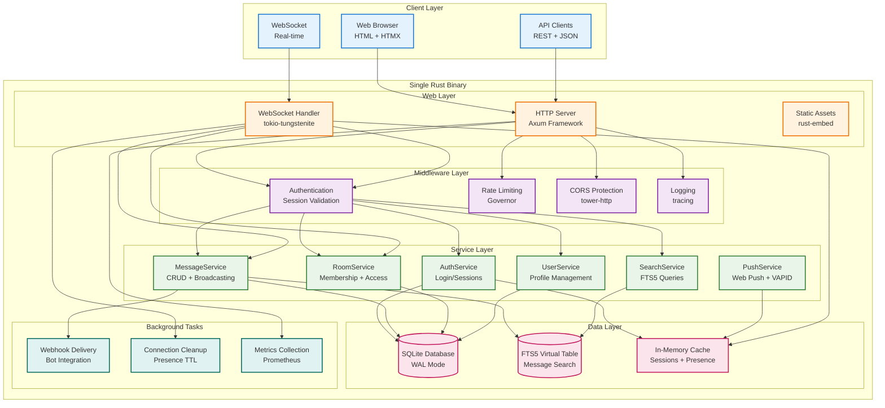
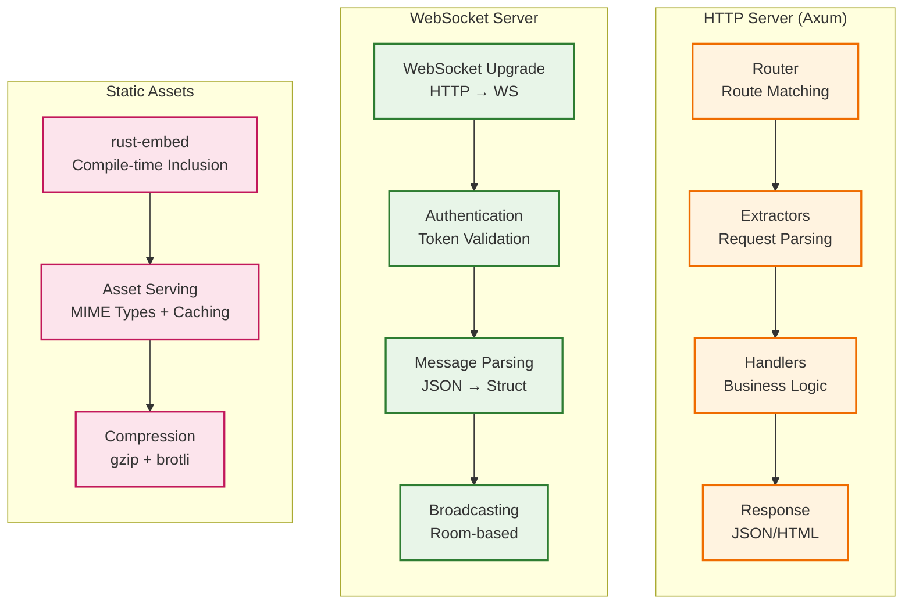
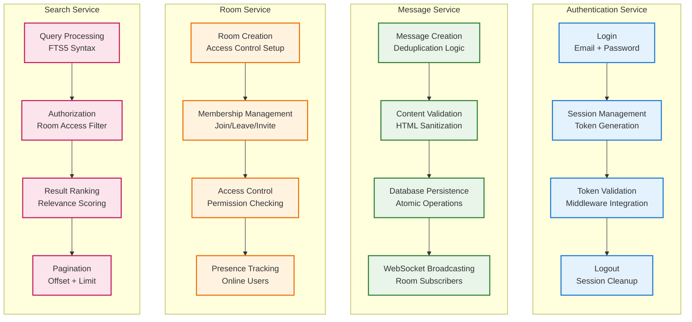
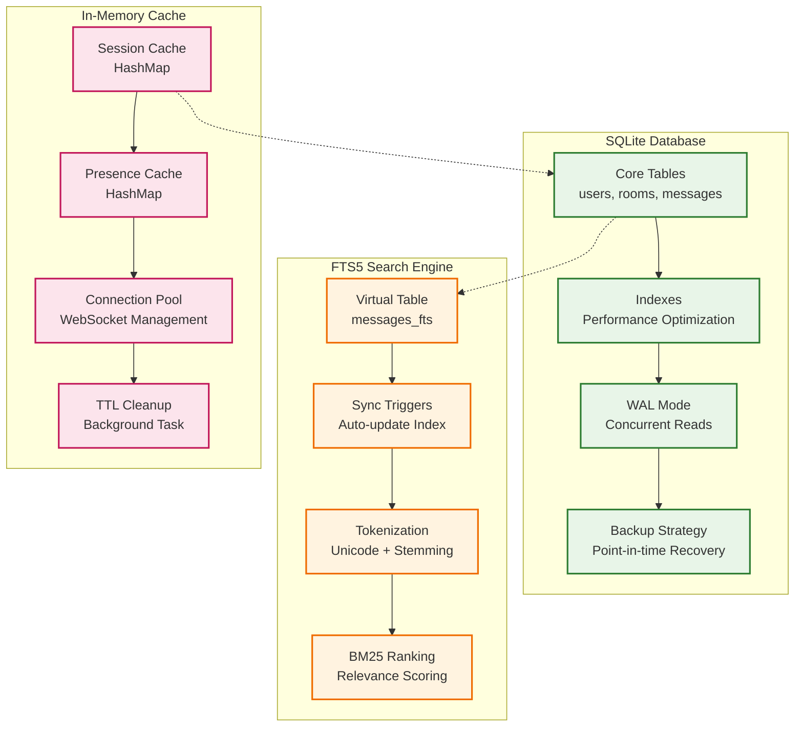
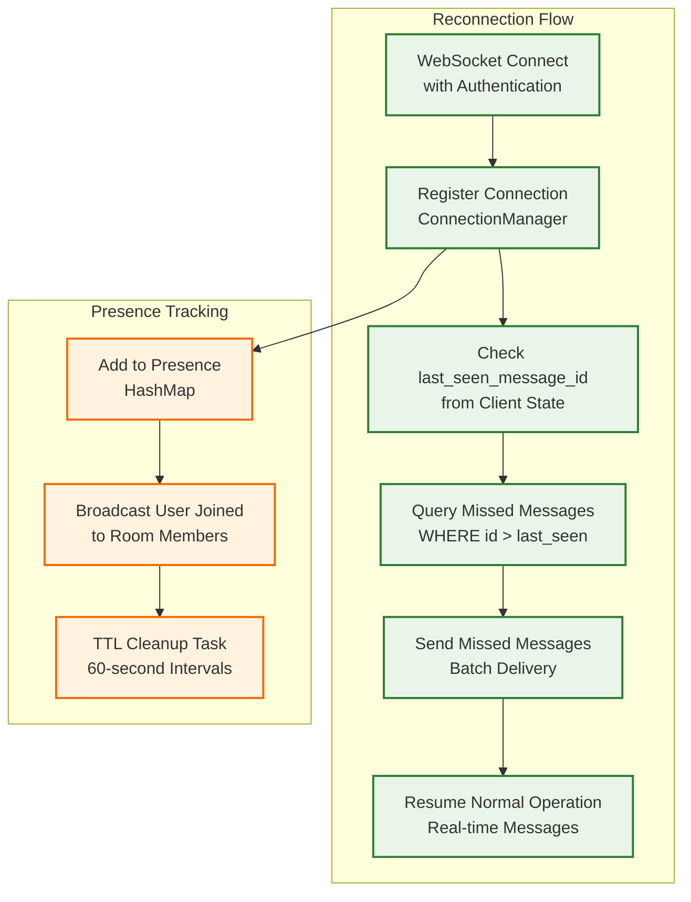
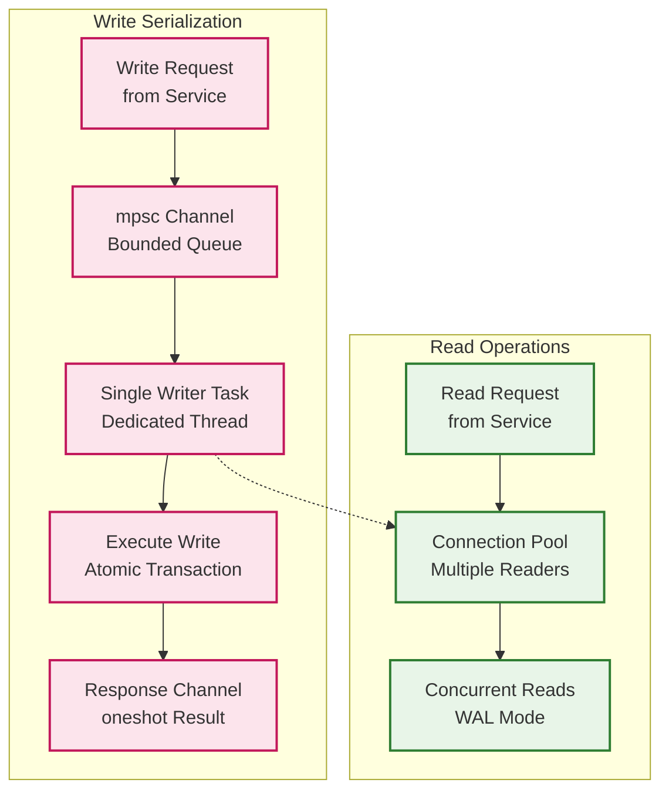
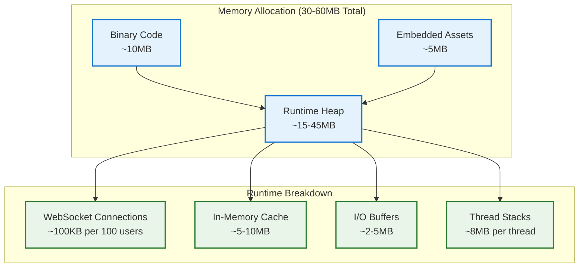
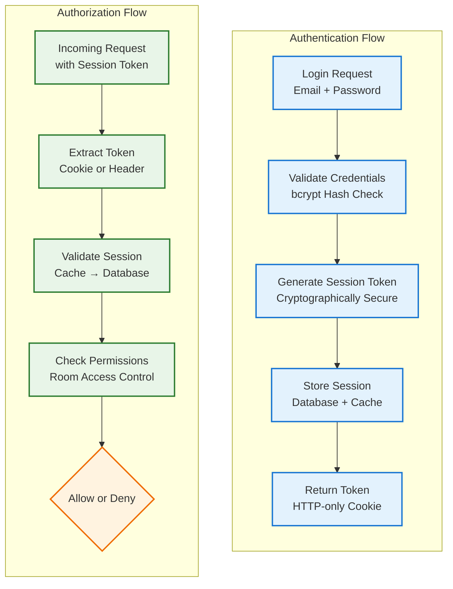
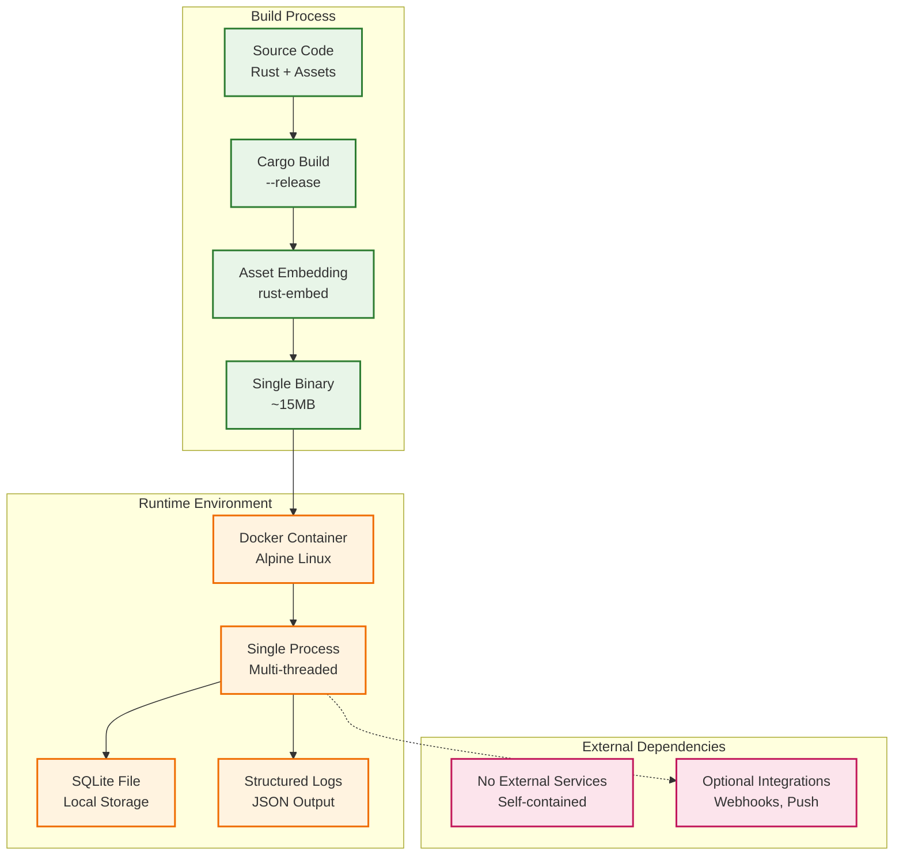

# Architecture Documentation

## System Architecture Overview

This document provides a comprehensive view of the Campfire Rust rewrite architecture, following Rails-compatible patterns with Rust performance benefits.

## High-Level Architecture



## Core Components Deep Dive

### Web Layer Architecture



### Service Layer Architecture



### Data Layer Architecture



## Critical Design Patterns

### Message Deduplication Pattern (Critical Gap #1)

```mermaid
graph TD
    subgraph "Message Creation Flow"
        direction TB
        CLIENT[Client Sends Message<br/>with client_message_id]
        VALIDATE[Validate Content<br/>Length + HTML Sanitization]
        CHECK[Check Deduplication<br/>UNIQUE(client_message_id, room_id)]
        EXISTS{Message Exists?}
        RETURN_EXISTING[Return Existing Message<br/>No Database Write]
        CREATE_NEW[Create New Message<br/>Insert + Broadcast]
        BROADCAST[Broadcast to Room<br/>WebSocket Subscribers]
    end
    
    CLIENT --> VALIDATE
    VALIDATE --> CHECK
    CHECK --> EXISTS
    EXISTS -->|Yes| RETURN_EXISTING
    EXISTS -->|No| CREATE_NEW
    CREATE_NEW --> BROADCAST
    
    classDef process fill:#e8f5e8,stroke:#2e7d32,stroke-width:2px
    classDef decision fill:#fff3e0,stroke:#ef6c00,stroke-width:2px
    classDef action fill:#fce4ec,stroke:#c2185b,stroke-width:2px
    
    class CLIENT,VALIDATE,CHECK,BROADCAST process
    class EXISTS decision
    class RETURN_EXISTING,CREATE_NEW action
```

### WebSocket Reconnection Pattern (Critical Gap #2)



### SQLite Write Serialization Pattern (Critical Gap #3)



## Performance Characteristics

### Memory Usage Profile



### Throughput Characteristics

```mermaid
graph TD
    subgraph "Request Processing"
        direction LR
        HTTP_REQ[HTTP Requests<br/>1K+ req/sec]
        WS_MSG[WebSocket Messages<br/>50 msg/sec system-wide]
        SEARCH_QRY[Search Queries<br/>Sub-millisecond FTS5]
    end
    
    subgraph "Database Operations"
        direction LR
        READS[Concurrent Reads<br/>No Limit (WAL)]
        WRITES[Serialized Writes<br/>Single Writer Queue]
        FTS_SEARCH[FTS5 Search<br/>~500μs per query]
    end
    
    subgraph "WebSocket Broadcasting"
        direction LR
        ROOM_CAST[Room Broadcasting<br/>100 users per room]
        PRESENCE[Presence Updates<br/>Real-time sync]
        TYPING[Typing Indicators<br/>10s timeout]
    end
    
    HTTP_REQ --> READS
    HTTP_REQ --> WRITES
    WS_MSG --> ROOM_CAST
    SEARCH_QRY --> FTS_SEARCH
    
    ROOM_CAST --> PRESENCE
    PRESENCE --> TYPING
    
    classDef request fill:#e8f5e8,stroke:#2e7d32,stroke-width:2px
    classDef database fill:#fff3e0,stroke:#ef6c00,stroke-width:2px
    classDef websocket fill:#fce4ec,stroke:#c2185b,stroke-width:2px
    
    class HTTP_REQ,WS_MSG,SEARCH_QRY request
    class READS,WRITES,FTS_SEARCH database
    class ROOM_CAST,PRESENCE,TYPING websocket
```

## Security Architecture

### Authentication & Authorization Flow



## Deployment Architecture

### Single Binary Deployment



## Monitoring & Observability

### Health Check & Metrics

```mermaid
graph TD
    subgraph "Health Monitoring"
        direction TB
        HEALTH[/health Endpoint<br/>Basic Liveness]
        DB_CHECK[Database Connectivity<br/>Simple Query]
        READY[/ready Endpoint<br/>Readiness Check]
        STATUS[Service Status<br/>Component Health]
    end
    
    subgraph "Metrics Collection"
        direction TB
        PROMETHEUS[/metrics Endpoint<br/>Prometheus Format]
        REQUEST_METRICS[Request Metrics<br/>Count, Duration, Status]
        WS_METRICS[WebSocket Metrics<br/>Connections, Messages]
        SYSTEM_METRICS[System Metrics<br/>Memory, CPU, Disk]
    end
    
    subgraph "Logging"
        direction TB
        STRUCTURED[Structured Logging<br/>JSON Format]
        LEVELS[Log Levels<br/>ERROR, WARN, INFO, DEBUG]
        CONTEXT[Request Context<br/>Trace IDs]
        ROTATION[Log Rotation<br/>Size-based]
    end
    
    HEALTH --> DB_CHECK
    DB_CHECK --> READY
    READY --> STATUS
    
    PROMETHEUS --> REQUEST_METRICS
    REQUEST_METRICS --> WS_METRICS
    WS_METRICS --> SYSTEM_METRICS
    
    STRUCTURED --> LEVELS
    LEVELS --> CONTEXT
    CONTEXT --> ROTATION
    
    classDef health fill:#e8f5e8,stroke:#2e7d32,stroke-width:2px
    classDef metrics fill:#fff3e0,stroke:#ef6c00,stroke-width:2px
    classDef logging fill:#fce4ec,stroke:#c2185b,stroke-width:2px
    
    class HEALTH,DB_CHECK,READY,STATUS health
    class PROMETHEUS,REQUEST_METRICS,WS_METRICS,SYSTEM_METRICS metrics
    class STRUCTURED,LEVELS,CONTEXT,ROTATION logging
```

## Technology Stack Summary

**Core Framework**: Axum (HTTP) + tokio-tungstenite (WebSocket) + SQLite (Database)
**Templates**: Askama (compile-time HTML)
**Authentication**: bcrypt + secure sessions
**Search**: SQLite FTS5
**Push Notifications**: web-push + VAPID
**Assets**: rust-embed (compile-time)
**Testing**: tokio-test + proptest
**Monitoring**: tracing + prometheus

This architecture provides a solid foundation for a production-ready chat application with Rails-equivalent functionality and significant performance improvements through Rust's type safety and zero-cost abstractions.