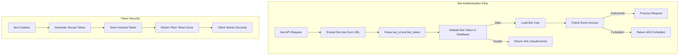
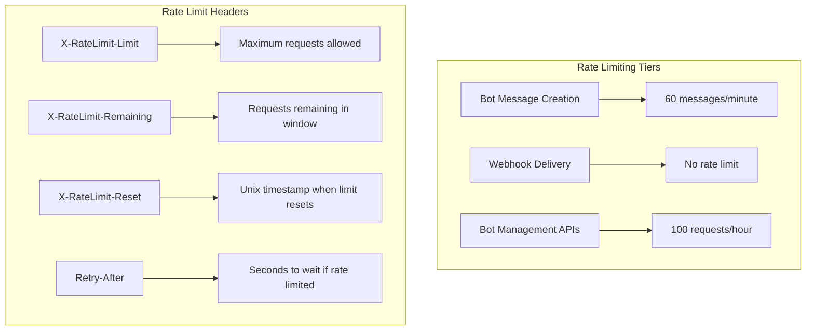

# Bot Integration Tutorial

## Overview

Campfire provides a powerful bot API system inspired by Basecamp's webhook architecture, enabling seamless integration with external services, CI/CD pipelines, monitoring tools, and custom automation. This guide covers everything from basic bot setup to advanced webhook configurations and best practices.

**Key Features:**
- Simple REST API for bot messaging
- Webhook system for real-time event notifications
- Secure bot authentication with API keys
- Rate limiting and permission controls
- Rich message formatting and attachments
- Multi-language SDK examples

## Quick Start

### 1. Create Your First Bot

Only administrators can create bots. Use the admin interface or API:

```bash
# Create a new bot (admin required)
curl -X POST http://localhost:3000/api/bots \
  -H "Authorization: Bearer <admin_session_token>" \
  -H "Content-Type: application/json" \
  -d '{
    "name": "Deploy Bot",
    "description": "Automated deployment notifications",
    "webhook_url": "https://your-service.com/webhook"
  }'
```

**Response:**
```json
{
  "bot": {
    "id": "550e8400-e29b-41d4-a716-446655440008",
    "name": "Deploy Bot",
    "bot_token": "bot_abc123def456...",
    "webhook_url": "https://your-service.com/webhook",
    "created_at": "2023-12-07T10:00:00Z"
  },
  "success": true
}
```

**Important:** Save the `bot_token` securely - it won't be shown again!

### 2. Send Your First Message

Use the bot API endpoint to send messages:

```bash
# Send a message as your bot
curl -X POST "http://localhost:3000/rooms/{room_id}/bot/{bot_id}-{bot_token}/messages" \
  -H "Content-Type: application/json" \
  -d '{
    "content": "🚀 Deployment started for v2.1.0"
  }'
```

**Bot Key Format:** `{bot_id}-{bot_token}`
- Example: `550e8400-e29b-41d4-a716-446655440008-bot_abc123def456`

### 3. Test Your Integration

```bash
# Verify bot can send messages
BOT_KEY="550e8400-e29b-41d4-a716-446655440008-bot_abc123def456"
ROOM_ID="550e8400-e29b-41d4-a716-446655440001"

curl -X POST "http://localhost:3000/rooms/$ROOM_ID/bot/$BOT_KEY/messages" \
  -H "Content-Type: application/json" \
  -d '{
    "content": "Hello from Deploy Bot! 👋 Integration test successful."
  }'
```

## Bot Authentication

### Authentication Methods

Campfire supports bot authentication through URL-embedded bot keys:

```
POST /rooms/{room_id}/bot/{bot_key}/messages
```

**Bot Key Components:**
- `bot_id`: UUID of the bot user
- `bot_token`: Secure token generated during bot creation
- Format: `{bot_id}-{bot_token}`

### Security Model



**Security Features:**
- **Secure Token Generation**: 256-bit cryptographically secure tokens
- **One-Time Display**: Bot tokens shown only during creation
- **Token Rotation**: Admins can reset bot tokens if compromised
- **Room-Level Authorization**: Bots must have access to target rooms
- **Rate Limiting**: Same limits as regular users (60 messages/minute)

### Bot Token Management

```bash
# Reset bot token (admin only)
curl -X POST "http://localhost:3000/api/bots/{bot_id}/reset-token" \
  -H "Authorization: Bearer <admin_session_token>"
```

**Response:**
```json
{
  "bot_key": "550e8400-e29b-41d4-a716-446655440008-new_token_xyz789",
  "message": "Bot token reset successfully",
  "success": true
}
```

## Bot API Reference

### Send Message

**Endpoint:** `POST /rooms/{room_id}/bot/{bot_key}/messages`

**Parameters:**
- `room_id`: UUID of the target room
- `bot_key`: Bot authentication key (`{bot_id}-{bot_token}`)

**Request Body:**
```json
{
  "content": "Message content with optional formatting",
  "client_message_id": "optional-deduplication-id"
}
```

**Content Features:**
- **Plain Text**: Basic message content
- **@Mentions**: `@username` creates user mentions
- **Sound Commands**: `/play sound_name` triggers sounds
- **HTML Formatting**: Basic HTML tags supported
- **Length Limit**: 1-10,000 characters

**Response (201 Created):**
```json
{
  "message": {
    "id": "550e8400-e29b-41d4-a716-446655440010",
    "room_id": "550e8400-e29b-41d4-a716-446655440001",
    "creator_id": "550e8400-e29b-41d4-a716-446655440008",
    "content": "🚀 Deployment started for v2.1.0",
    "client_message_id": "deploy-2023-12-07-001",
    "created_at": "2023-12-07T10:30:00Z"
  },
  "success": true
}
```

**Error Responses:**
- **400 Bad Request**: Invalid content or malformed request
- **401 Unauthorized**: Invalid bot key
- **403 Forbidden**: Bot not authorized for room
- **404 Not Found**: Room not found
- **429 Too Many Requests**: Rate limit exceeded

### Message Deduplication

Prevent duplicate messages using `client_message_id`:

```bash
# First message
curl -X POST "http://localhost:3000/rooms/$ROOM_ID/bot/$BOT_KEY/messages" \
  -H "Content-Type: application/json" \
  -d '{
    "content": "Deployment v2.1.0 started",
    "client_message_id": "deploy-v2.1.0-start"
  }'

# Duplicate message (returns existing message)
curl -X POST "http://localhost:3000/rooms/$ROOM_ID/bot/$BOT_KEY/messages" \
  -H "Content-Type: application/json" \
  -d '{
    "content": "Different content",
    "client_message_id": "deploy-v2.1.0-start"
  }'
```

**Deduplication Rules:**
- Same `client_message_id` in same room returns existing message
- Deduplication is scoped per room
- Content is ignored if `client_message_id` matches
- Useful for retry logic and preventing spam

## Webhook System

### Webhook Configuration

Configure your bot to receive real-time events from Campfire:

```bash
# Set webhook URL during bot creation
curl -X POST http://localhost:3000/api/bots \
  -H "Authorization: Bearer <admin_session_token>" \
  -H "Content-Type: application/json" \
  -d '{
    "name": "CI/CD Bot",
    "webhook_url": "https://your-ci-system.com/campfire-webhook"
  }'

# Update webhook URL for existing bot
curl -X PUT "http://localhost:3000/api/bots/{bot_id}" \
  -H "Authorization: Bearer <admin_session_token>" \
  -H "Content-Type: application/json" \
  -d '{
    "webhook_url": "https://new-webhook-url.com/endpoint"
  }'
```

### Webhook Events

Campfire sends HTTP POST requests to your webhook URL for these events:

#### New Message Event

Triggered when a message is posted in a room where your bot has access:

```json
{
  "event": "message.created",
  "timestamp": "2023-12-07T10:30:00Z",
  "bot_id": "550e8400-e29b-41d4-a716-446655440008",
  "data": {
    "message": {
      "id": "550e8400-e29b-41d4-a716-446655440010",
      "room_id": "550e8400-e29b-41d4-a716-446655440001",
      "creator_id": "550e8400-e29b-41d4-a716-446655440000",
      "content": "Deploy to production when ready",
      "created_at": "2023-12-07T10:30:00Z"
    },
    "room": {
      "id": "550e8400-e29b-41d4-a716-446655440001",
      "name": "Development",
      "room_type": "Open"
    },
    "creator": {
      "id": "550e8400-e29b-41d4-a716-446655440000",
      "name": "John Doe",
      "email": "john@example.com"
    }
  }
}
```

#### Mention Event

Triggered when your bot is mentioned in a message:

```json
{
  "event": "bot.mentioned",
  "timestamp": "2023-12-07T10:35:00Z",
  "bot_id": "550e8400-e29b-41d4-a716-446655440008",
  "data": {
    "message": {
      "id": "550e8400-e29b-41d4-a716-446655440011",
      "content": "@deploybot please deploy v2.1.0 to production",
      "created_at": "2023-12-07T10:35:00Z"
    },
    "mention_text": "deploybot",
    "room": {
      "id": "550e8400-e29b-41d4-a716-446655440001",
      "name": "Development"
    },
    "creator": {
      "id": "550e8400-e29b-41d4-a716-446655440000",
      "name": "John Doe"
    }
  }
}
```

#### Room Join Event

Triggered when your bot is added to a room:

```json
{
  "event": "bot.room_joined",
  "timestamp": "2023-12-07T10:40:00Z",
  "bot_id": "550e8400-e29b-41d4-a716-446655440008",
  "data": {
    "room": {
      "id": "550e8400-e29b-41d4-a716-446655440002",
      "name": "Production Alerts",
      "room_type": "Closed"
    },
    "added_by": {
      "id": "550e8400-e29b-41d4-a716-446655440000",
      "name": "John Doe"
    }
  }
}
```

### Webhook Security

#### Request Verification

Campfire signs webhook requests with HMAC-SHA256:

```http
POST /your-webhook-endpoint
Content-Type: application/json
X-Campfire-Signature: sha256=a1b2c3d4e5f6...
X-Campfire-Timestamp: 1701943800
X-Campfire-Bot-ID: 550e8400-e29b-41d4-a716-446655440008

{
  "event": "message.created",
  ...
}
```

**Verification Process:**
1. Extract signature from `X-Campfire-Signature` header
2. Create HMAC-SHA256 hash of request body using bot token as key
3. Compare computed hash with provided signature
4. Check timestamp to prevent replay attacks (max 5 minutes old)

#### Example Verification (Python)

```python
import hmac
import hashlib
import time
from flask import Flask, request, abort

app = Flask(__name__)
BOT_TOKEN = "bot_abc123def456..."  # Your bot token

@app.route('/campfire-webhook', methods=['POST'])
def handle_webhook():
    # Verify timestamp (prevent replay attacks)
    timestamp = int(request.headers.get('X-Campfire-Timestamp', 0))
    if abs(time.time() - timestamp) > 300:  # 5 minutes
        abort(400, "Request too old")
    
    # Verify signature
    signature = request.headers.get('X-Campfire-Signature', '')
    if not signature.startswith('sha256='):
        abort(400, "Invalid signature format")
    
    expected_signature = 'sha256=' + hmac.new(
        BOT_TOKEN.encode(),
        request.data,
        hashlib.sha256
    ).hexdigest()
    
    if not hmac.compare_digest(signature, expected_signature):
        abort(401, "Invalid signature")
    
    # Process webhook event
    event_data = request.json
    handle_campfire_event(event_data)
    
    return {'status': 'ok'}

def handle_campfire_event(event_data):
    event_type = event_data['event']
    
    if event_type == 'message.created':
        handle_new_message(event_data['data'])
    elif event_type == 'bot.mentioned':
        handle_bot_mention(event_data['data'])
    elif event_type == 'bot.room_joined':
        handle_room_joined(event_data['data'])
```

### Webhook Best Practices

#### Response Requirements

Your webhook endpoint must:
- **Respond quickly**: Return HTTP 200 within 10 seconds
- **Handle retries**: Campfire retries failed webhooks up to 3 times
- **Be idempotent**: Handle duplicate events gracefully
- **Validate signatures**: Always verify request authenticity

#### Error Handling

```python
@app.route('/campfire-webhook', methods=['POST'])
def handle_webhook():
    try:
        # Verify and process webhook
        process_webhook(request)
        return {'status': 'ok'}, 200
    except ValidationError as e:
        # Bad request - don't retry
        return {'error': str(e)}, 400
    except Exception as e:
        # Server error - Campfire will retry
        logger.error(f"Webhook processing failed: {e}")
        return {'error': 'Internal server error'}, 500
```

#### Async Processing

For long-running operations, use background processing:

```python
import asyncio
from celery import Celery

celery_app = Celery('campfire_bot')

@app.route('/campfire-webhook', methods=['POST'])
def handle_webhook():
    event_data = request.json
    
    # Queue background task
    process_event_async.delay(event_data)
    
    # Return immediately
    return {'status': 'queued'}, 200

@celery_app.task
def process_event_async(event_data):
    # Long-running processing here
    if event_data['event'] == 'bot.mentioned':
        deploy_to_production(event_data['data'])
```

## Bot Implementation Examples

### 1. Deployment Bot (Python)

Complete example of a CI/CD integration bot:

```python
#!/usr/bin/env python3
"""
Campfire Deployment Bot
Integrates with GitHub Actions and Docker deployments
"""

import os
import requests
import subprocess
from flask import Flask, request, jsonify
from datetime import datetime

app = Flask(__name__)

# Configuration
CAMPFIRE_URL = os.environ['CAMPFIRE_URL']
BOT_KEY = os.environ['CAMPFIRE_BOT_KEY']
ROOM_ID = os.environ['CAMPFIRE_ROOM_ID']

class CampfireBot:
    def __init__(self, base_url, bot_key, room_id):
        self.base_url = base_url
        self.bot_key = bot_key
        self.room_id = room_id
    
    def send_message(self, content, client_message_id=None):
        """Send message to Campfire room"""
        url = f"{self.base_url}/rooms/{self.room_id}/bot/{self.bot_key}/messages"
        
        payload = {"content": content}
        if client_message_id:
            payload["client_message_id"] = client_message_id
        
        response = requests.post(url, json=payload)
        response.raise_for_status()
        return response.json()
    
    def send_deployment_start(self, version, commit_sha):
        """Notify deployment start"""
        content = f"🚀 **Deployment Started**\n\n" \
                 f"Version: `{version}`\n" \
                 f"Commit: `{commit_sha[:8]}`\n" \
                 f"Started: {datetime.now().strftime('%H:%M:%S')}"
        
        return self.send_message(
            content, 
            client_message_id=f"deploy-start-{version}-{commit_sha}"
        )
    
    def send_deployment_success(self, version, duration):
        """Notify successful deployment"""
        content = f"✅ **Deployment Successful**\n\n" \
                 f"Version: `{version}`\n" \
                 f"Duration: {duration}\n" \
                 f"Status: All health checks passing\n" \
                 f"/play tada"
        
        return self.send_message(
            content,
            client_message_id=f"deploy-success-{version}"
        )
    
    def send_deployment_failure(self, version, error):
        """Notify failed deployment"""
        content = f"❌ **Deployment Failed**\n\n" \
                 f"Version: `{version}`\n" \
                 f"Error: {error}\n" \
                 f"Action: Rolling back to previous version\n" \
                 f"/play trombone"
        
        return self.send_message(
            content,
            client_message_id=f"deploy-failure-{version}"
        )

# Initialize bot
bot = CampfireBot(CAMPFIRE_URL, BOT_KEY, ROOM_ID)

@app.route('/github-webhook', methods=['POST'])
def handle_github_webhook():
    """Handle GitHub Actions webhook"""
    event = request.headers.get('X-GitHub-Event')
    payload = request.json
    
    if event == 'workflow_run':
        workflow = payload['workflow_run']
        
        if workflow['name'] == 'Deploy' and workflow['conclusion']:
            version = workflow['head_branch']
            commit_sha = workflow['head_sha']
            
            if workflow['conclusion'] == 'success':
                # Calculate duration
                start_time = datetime.fromisoformat(
                    workflow['created_at'].replace('Z', '+00:00')
                )
                end_time = datetime.fromisoformat(
                    workflow['updated_at'].replace('Z', '+00:00')
                )
                duration = str(end_time - start_time).split('.')[0]
                
                bot.send_deployment_success(version, duration)
            
            elif workflow['conclusion'] == 'failure':
                bot.send_deployment_failure(version, "Build failed")
    
    return jsonify({'status': 'ok'})

@app.route('/deploy', methods=['POST'])
def trigger_deployment():
    """Manual deployment trigger"""
    data = request.json
    version = data.get('version')
    
    if not version:
        return jsonify({'error': 'Version required'}), 400
    
    try:
        # Start deployment
        commit_sha = subprocess.check_output(
            ['git', 'rev-parse', 'HEAD']
        ).decode().strip()
        
        bot.send_deployment_start(version, commit_sha)
        
        # Trigger actual deployment (example)
        result = subprocess.run([
            'docker', 'build', '-t', f'campfire:{version}', '.'
        ], capture_output=True, text=True)
        
        if result.returncode == 0:
            bot.send_deployment_success(version, "2m 30s")
        else:
            bot.send_deployment_failure(version, result.stderr)
        
        return jsonify({'status': 'deployment_triggered'})
    
    except Exception as e:
        bot.send_deployment_failure(version, str(e))
        return jsonify({'error': str(e)}), 500

if __name__ == '__main__':
    app.run(host='0.0.0.0', port=5000)
```

### 2. Monitoring Bot (Node.js)

System monitoring and alerting bot:

```javascript
#!/usr/bin/env node
/**
 * Campfire Monitoring Bot
 * Sends system alerts and performance metrics
 */

const express = require('express');
const axios = require('axios');
const os = require('os');

const app = express();
app.use(express.json());

// Configuration
const CAMPFIRE_URL = process.env.CAMPFIRE_URL;
const BOT_KEY = process.env.CAMPFIRE_BOT_KEY;
const ROOM_ID = process.env.CAMPFIRE_ROOM_ID;

class CampfireBot {
    constructor(baseUrl, botKey, roomId) {
        this.baseUrl = baseUrl;
        this.botKey = botKey;
        this.roomId = roomId;
    }
    
    async sendMessage(content, clientMessageId = null) {
        const url = `${this.baseUrl}/rooms/${this.roomId}/bot/${this.botKey}/messages`;
        
        const payload = { content };
        if (clientMessageId) {
            payload.client_message_id = clientMessageId;
        }
        
        try {
            const response = await axios.post(url, payload);
            return response.data;
        } catch (error) {
            console.error('Failed to send message:', error.response?.data || error.message);
            throw error;
        }
    }
    
    async sendAlert(level, title, message, metrics = {}) {
        const emoji = {
            'info': '🔵',
            'warning': '🟡',
            'error': '🔴',
            'critical': '🚨'
        }[level] || '📊';
        
        let content = `${emoji} **${title}**\n\n${message}`;
        
        if (Object.keys(metrics).length > 0) {
            content += '\n\n**Metrics:**\n';
            for (const [key, value] of Object.entries(metrics)) {
                content += `• ${key}: ${value}\n`;
            }
        }
        
        return this.sendMessage(content, `alert-${Date.now()}`);
    }
    
    async sendSystemReport() {
        const uptime = os.uptime();
        const loadAvg = os.loadavg();
        const memUsage = process.memoryUsage();
        const totalMem = os.totalmem();
        const freeMem = os.freemem();
        
        const metrics = {
            'Uptime': `${Math.floor(uptime / 3600)}h ${Math.floor((uptime % 3600) / 60)}m`,
            'Load Average': `${loadAvg[0].toFixed(2)} ${loadAvg[1].toFixed(2)} ${loadAvg[2].toFixed(2)}`,
            'Memory Usage': `${Math.round((totalMem - freeMem) / 1024 / 1024)}MB / ${Math.round(totalMem / 1024 / 1024)}MB`,
            'Node.js Memory': `${Math.round(memUsage.heapUsed / 1024 / 1024)}MB heap`
        };
        
        return this.sendAlert('info', 'System Report', 'Daily system health check', metrics);
    }
}

const bot = new CampfireBot(CAMPFIRE_URL, BOT_KEY, ROOM_ID);

// System monitoring
function checkSystemHealth() {
    const loadAvg = os.loadavg()[0];
    const freeMem = os.freemem();
    const totalMem = os.totalmem();
    const memUsagePercent = ((totalMem - freeMem) / totalMem) * 100;
    
    // High load alert
    if (loadAvg > 2.0) {
        bot.sendAlert('warning', 'High System Load', 
            `System load is ${loadAvg.toFixed(2)}`, 
            { 'Load Average': loadAvg.toFixed(2), 'Threshold': '2.0' }
        );
    }
    
    // High memory usage alert
    if (memUsagePercent > 85) {
        bot.sendAlert('warning', 'High Memory Usage',
            `Memory usage is ${memUsagePercent.toFixed(1)}%`,
            { 'Memory Usage': `${memUsagePercent.toFixed(1)}%`, 'Threshold': '85%' }
        );
    }
}

// Webhook endpoint for external alerts
app.post('/alert', async (req, res) => {
    const { level, title, message, metrics } = req.body;
    
    try {
        await bot.sendAlert(level, title, message, metrics);
        res.json({ status: 'alert_sent' });
    } catch (error) {
        res.status(500).json({ error: error.message });
    }
});

// Health check endpoint
app.get('/health', (req, res) => {
    res.json({ 
        status: 'healthy',
        uptime: os.uptime(),
        memory: process.memoryUsage()
    });
});

// Schedule periodic checks
setInterval(checkSystemHealth, 5 * 60 * 1000); // Every 5 minutes
setInterval(() => bot.sendSystemReport(), 24 * 60 * 60 * 1000); // Daily

const PORT = process.env.PORT || 3001;
app.listen(PORT, () => {
    console.log(`Monitoring bot listening on port ${PORT}`);
    bot.sendMessage('🔍 **Monitoring Bot Online**\n\nSystem monitoring active. Will report alerts and daily metrics.');
});
```

### 3. AI Assistant Bot (Go)

Intelligent assistant with command processing:

```go
package main

import (
    "bytes"
    "encoding/json"
    "fmt"
    "log"
    "net/http"
    "os"
    "regexp"
    "strings"
    "time"
)

type CampfireBot struct {
    BaseURL string
    BotKey  string
    RoomID  string
}

type Message struct {
    Content         string `json:"content"`
    ClientMessageID string `json:"client_message_id,omitempty"`
}

type WebhookEvent struct {
    Event     string    `json:"event"`
    Timestamp time.Time `json:"timestamp"`
    BotID     string    `json:"bot_id"`
    Data      struct {
        Message struct {
            ID        string    `json:"id"`
            RoomID    string    `json:"room_id"`
            CreatorID string    `json:"creator_id"`
            Content   string    `json:"content"`
            CreatedAt time.Time `json:"created_at"`
        } `json:"message"`
        Creator struct {
            ID   string `json:"id"`
            Name string `json:"name"`
        } `json:"creator"`
    } `json:"data"`
}

func (bot *CampfireBot) SendMessage(content, clientMessageID string) error {
    url := fmt.Sprintf("%s/rooms/%s/bot/%s/messages", bot.BaseURL, bot.RoomID, bot.BotKey)
    
    message := Message{
        Content:         content,
        ClientMessageID: clientMessageID,
    }
    
    jsonData, err := json.Marshal(message)
    if err != nil {
        return err
    }
    
    resp, err := http.Post(url, "application/json", bytes.NewBuffer(jsonData))
    if err != nil {
        return err
    }
    defer resp.Body.Close()
    
    if resp.StatusCode != http.StatusCreated {
        return fmt.Errorf("failed to send message: %d", resp.StatusCode)
    }
    
    return nil
}

func (bot *CampfireBot) ProcessCommand(command, userID, userName string) {
    command = strings.TrimSpace(command)
    
    switch {
    case strings.HasPrefix(command, "help"):
        bot.SendHelp(userName)
    case strings.HasPrefix(command, "status"):
        bot.SendStatus()
    case strings.HasPrefix(command, "deploy"):
        parts := strings.Fields(command)
        if len(parts) > 1 {
            bot.HandleDeploy(parts[1], userName)
        } else {
            bot.SendMessage("Usage: `@aibot deploy <version>`", "")
        }
    case strings.HasPrefix(command, "weather"):
        bot.SendWeather()
    default:
        bot.SendMessage(fmt.Sprintf("Unknown command. Type `@aibot help` for available commands."), "")
    }
}

func (bot *CampfireBot) SendHelp(userName string) {
    content := fmt.Sprintf(`🤖 **AI Assistant Help** - Hello %s!

**Available Commands:**
• \`@aibot help\` - Show this help message
• \`@aibot status\` - Show system status
• \`@aibot deploy <version>\` - Trigger deployment
• \`@aibot weather\` - Get weather information

**Examples:**
• \`@aibot deploy v2.1.0\`
• \`@aibot status\`

Need more help? Contact your system administrator.`, userName)
    
    bot.SendMessage(content, fmt.Sprintf("help-%d", time.Now().Unix()))
}

func (bot *CampfireBot) SendStatus() {
    content := `📊 **System Status**

**Services:**
• API Server: ✅ Healthy
• Database: ✅ Connected
• WebSocket: ✅ Active
• Background Jobs: ✅ Running

**Performance:**
• Response Time: 45ms
• Memory Usage: 32MB
• Active Connections: 156

All systems operational! 🟢`
    
    bot.SendMessage(content, fmt.Sprintf("status-%d", time.Now().Unix()))
}

func (bot *CampfireBot) HandleDeploy(version, userName string) {
    content := fmt.Sprintf(`🚀 **Deployment Request**

Version: \`%s\`
Requested by: %s
Status: Queuing deployment...

I'll notify you when the deployment completes!`, version, userName)
    
    bot.SendMessage(content, fmt.Sprintf("deploy-request-%s", version))
    
    // Simulate deployment process
    go func() {
        time.Sleep(30 * time.Second)
        
        successContent := fmt.Sprintf(`✅ **Deployment Complete**

Version: \`%s\`
Duration: 2m 15s
Status: All health checks passing

Deployment successful! /play tada`, version)
        
        bot.SendMessage(successContent, fmt.Sprintf("deploy-complete-%s", version))
    }()
}

func (bot *CampfireBot) SendWeather() {
    content := `🌤️ **Weather Report**

**Current Conditions:**
• Temperature: 72°F (22°C)
• Conditions: Partly Cloudy
• Humidity: 65%
• Wind: 8 mph NW

**Forecast:**
• Today: High 75°F, Low 58°F
• Tomorrow: High 78°F, Low 61°F

Perfect weather for coding! ☀️`
    
    bot.SendMessage(content, fmt.Sprintf("weather-%d", time.Now().Unix()))
}

func handleWebhook(bot *CampfireBot) http.HandlerFunc {
    return func(w http.ResponseWriter, r *http.Request) {
        var event WebhookEvent
        if err := json.NewDecoder(r.Body).Decode(&event); err != nil {
            http.Error(w, "Invalid JSON", http.StatusBadRequest)
            return
        }
        
        // Only process mentions
        if event.Event == "bot.mentioned" {
            content := event.Data.Message.Content
            userID := event.Data.Creator.ID
            userName := event.Data.Creator.Name
            
            // Extract command after mention
            re := regexp.MustCompile(`@\w+\s+(.+)`)
            matches := re.FindStringSubmatch(content)
            
            if len(matches) > 1 {
                command := matches[1]
                bot.ProcessCommand(command, userID, userName)
            }
        }
        
        w.WriteHeader(http.StatusOK)
        json.NewEncoder(w).Encode(map[string]string{"status": "ok"})
    }
}

func main() {
    bot := &CampfireBot{
        BaseURL: os.Getenv("CAMPFIRE_URL"),
        BotKey:  os.Getenv("CAMPFIRE_BOT_KEY"),
        RoomID:  os.Getenv("CAMPFIRE_ROOM_ID"),
    }
    
    // Send startup message
    bot.SendMessage("🤖 **AI Assistant Online**\n\nType `@aibot help` for available commands!", "startup")
    
    // Setup webhook handler
    http.HandleFunc("/webhook", handleWebhook(bot))
    
    // Health check endpoint
    http.HandleFunc("/health", func(w http.ResponseWriter, r *http.Request) {
        w.WriteHeader(http.StatusOK)
        json.NewEncoder(w).Encode(map[string]string{"status": "healthy"})
    })
    
    port := os.Getenv("PORT")
    if port == "" {
        port = "8080"
    }
    
    log.Printf("AI Assistant bot listening on port %s", port)
    log.Fatal(http.ListenAndServe(":"+port, nil))
}
```

## Rate Limiting and Best Practices

### Rate Limits

Bot API endpoints follow the same rate limiting as regular users:



**Rate Limit Details:**
- **Message Creation**: 60 messages per minute per bot
- **Burst Allowance**: Up to 10 messages in 10 seconds
- **Webhook Delivery**: No rate limit (Campfire → Your service)
- **Bot Management**: 100 API requests per hour

### Best Practices

#### 1. Message Design

```python
# ✅ Good: Structured, informative messages
def send_deployment_status(version, status, details):
    content = f"""🚀 **Deployment Update**

**Version:** `{version}`
**Status:** {status}
**Details:** {details}

**Next Steps:**
• Monitor health checks
• Verify functionality
• Update documentation
"""
    return bot.send_message(content)

# ❌ Avoid: Spam-like messages
def bad_deployment_updates():
    bot.send_message("Starting...")
    bot.send_message("Building...")
    bot.send_message("Testing...")
    bot.send_message("Deploying...")
    # This will hit rate limits quickly
```

#### 2. Error Handling

```python
import time
from requests.exceptions import HTTPError

def send_message_with_retry(content, max_retries=3):
    for attempt in range(max_retries):
        try:
            return bot.send_message(content)
        except HTTPError as e:
            if e.response.status_code == 429:
                # Rate limited - wait and retry
                retry_after = int(e.response.headers.get('Retry-After', 60))
                time.sleep(retry_after)
                continue
            elif e.response.status_code in [401, 403]:
                # Authentication/authorization error - don't retry
                raise
            else:
                # Other error - wait and retry
                time.sleep(2 ** attempt)  # Exponential backoff
                continue
    
    raise Exception(f"Failed to send message after {max_retries} attempts")
```

#### 3. Webhook Reliability

```python
# ✅ Robust webhook handler
@app.route('/webhook', methods=['POST'])
def handle_webhook():
    try:
        # Verify signature first
        if not verify_webhook_signature(request):
            abort(401)
        
        event_data = request.json
        
        # Process asynchronously for long operations
        if requires_long_processing(event_data):
            queue_background_task(event_data)
        else:
            process_event_immediately(event_data)
        
        return {'status': 'ok'}, 200
    
    except ValidationError as e:
        # Client error - don't retry
        logger.warning(f"Invalid webhook data: {e}")
        return {'error': str(e)}, 400
    
    except Exception as e:
        # Server error - Campfire will retry
        logger.error(f"Webhook processing failed: {e}")
        return {'error': 'Internal server error'}, 500
```

#### 4. Security Considerations

```python
# ✅ Secure bot token storage
import os
from cryptography.fernet import Fernet

class SecureBotConfig:
    def __init__(self):
        self.encryption_key = os.environ['BOT_ENCRYPTION_KEY']
        self.cipher = Fernet(self.encryption_key)
    
    def get_bot_token(self):
        encrypted_token = os.environ['ENCRYPTED_BOT_TOKEN']
        return self.cipher.decrypt(encrypted_token.encode()).decode()

# ✅ Input validation
def validate_deployment_request(data):
    version = data.get('version', '').strip()
    
    if not version:
        raise ValueError("Version is required")
    
    if not re.match(r'^v?\d+\.\d+\.\d+$', version):
        raise ValueError("Invalid version format")
    
    if len(version) > 20:
        raise ValueError("Version too long")
    
    return version
```

#### 5. Monitoring and Observability

```python
import logging
from prometheus_client import Counter, Histogram, start_http_server

# Metrics
message_counter = Counter('bot_messages_sent_total', 'Total messages sent')
webhook_counter = Counter('bot_webhooks_received_total', 'Total webhooks received', ['event_type'])
response_time = Histogram('bot_response_time_seconds', 'Response time for bot operations')

class ObservableBot:
    def __init__(self, base_url, bot_key, room_id):
        self.bot = CampfireBot(base_url, bot_key, room_id)
        self.logger = logging.getLogger(__name__)
    
    def send_message(self, content, client_message_id=None):
        with response_time.time():
            try:
                result = self.bot.send_message(content, client_message_id)
                message_counter.inc()
                self.logger.info(f"Message sent successfully: {client_message_id}")
                return result
            except Exception as e:
                self.logger.error(f"Failed to send message: {e}")
                raise
    
    def handle_webhook(self, event_data):
        event_type = event_data.get('event', 'unknown')
        webhook_counter.labels(event_type=event_type).inc()
        
        self.logger.info(f"Processing webhook: {event_type}")
        # Process webhook...

# Start metrics server
start_http_server(8000)
```

## Troubleshooting

### Common Issues

#### 1. Authentication Errors

**Problem:** `401 Unauthorized` when sending messages

**Solutions:**
```bash
# Check bot key format
echo "Bot key should be: {bot_id}-{bot_token}"
echo "Example: 550e8400-e29b-41d4-a716-446655440008-bot_abc123def456"

# Verify bot exists and is active
curl -H "Authorization: Bearer <admin_token>" \
  "http://localhost:3000/api/bots/{bot_id}"

# Reset bot token if compromised
curl -X POST -H "Authorization: Bearer <admin_token>" \
  "http://localhost:3000/api/bots/{bot_id}/reset-token"
```

#### 2. Room Access Issues

**Problem:** `403 Forbidden` when posting to room

**Solutions:**
```bash
# Check if bot has room access (admin only)
curl -H "Authorization: Bearer <admin_token>" \
  "http://localhost:3000/api/rooms/{room_id}"

# Add bot to room (admin only)
curl -X POST -H "Authorization: Bearer <admin_token>" \
  -H "Content-Type: application/json" \
  "http://localhost:3000/api/rooms/{room_id}/members" \
  -d '{
    "user_id": "{bot_id}",
    "involvement_level": "Member"
  }'
```

#### 3. Rate Limiting

**Problem:** `429 Too Many Requests`

**Solutions:**
```python
# Implement exponential backoff
import time
import random

def send_with_backoff(bot, content, max_retries=3):
    for attempt in range(max_retries):
        try:
            return bot.send_message(content)
        except RateLimitError as e:
            if attempt == max_retries - 1:
                raise
            
            # Wait with jitter
            wait_time = (2 ** attempt) + random.uniform(0, 1)
            time.sleep(wait_time)
```

#### 4. Webhook Delivery Failures

**Problem:** Webhooks not being received

**Debugging Steps:**
```bash
# Test webhook endpoint manually
curl -X POST https://your-webhook-url.com/endpoint \
  -H "Content-Type: application/json" \
  -H "X-Campfire-Signature: sha256=test" \
  -d '{"event": "test", "data": {}}'

# Check webhook URL in bot configuration
curl -H "Authorization: Bearer <admin_token>" \
  "http://localhost:3000/api/bots/{bot_id}"

# Update webhook URL
curl -X PUT -H "Authorization: Bearer <admin_token>" \
  -H "Content-Type: application/json" \
  "http://localhost:3000/api/bots/{bot_id}" \
  -d '{"webhook_url": "https://new-url.com/webhook"}'
```

### Debug Mode

Enable debug logging in your bot:

```python
import logging

# Configure debug logging
logging.basicConfig(
    level=logging.DEBUG,
    format='%(asctime)s - %(name)s - %(levelname)s - %(message)s'
)

class DebugBot(CampfireBot):
    def send_message(self, content, client_message_id=None):
        self.logger.debug(f"Sending message: {content[:50]}...")
        self.logger.debug(f"Client message ID: {client_message_id}")
        
        try:
            result = super().send_message(content, client_message_id)
            self.logger.debug(f"Message sent successfully: {result}")
            return result
        except Exception as e:
            self.logger.error(f"Failed to send message: {e}")
            raise
```

### Health Checks

Implement health checks for your bot service:

```python
@app.route('/health')
def health_check():
    try:
        # Test Campfire connectivity
        response = requests.get(f"{CAMPFIRE_URL}/health", timeout=5)
        campfire_healthy = response.status_code == 200
        
        # Test database connectivity (if applicable)
        db_healthy = test_database_connection()
        
        # Test external services
        external_healthy = test_external_services()
        
        overall_healthy = all([campfire_healthy, db_healthy, external_healthy])
        
        return {
            'status': 'healthy' if overall_healthy else 'unhealthy',
            'checks': {
                'campfire': 'healthy' if campfire_healthy else 'unhealthy',
                'database': 'healthy' if db_healthy else 'unhealthy',
                'external': 'healthy' if external_healthy else 'unhealthy'
            },
            'timestamp': datetime.utcnow().isoformat()
        }, 200 if overall_healthy else 503
    
    except Exception as e:
        return {
            'status': 'unhealthy',
            'error': str(e),
            'timestamp': datetime.utcnow().isoformat()
        }, 503
```

## Advanced Topics

### Custom Message Formatting

Create rich, interactive messages:

```python
def create_deployment_card(version, status, metrics):
    """Create a rich deployment status card"""
    
    status_emoji = {
        'success': '✅',
        'failure': '❌',
        'in_progress': '🔄',
        'pending': '⏳'
    }.get(status, '📊')
    
    content = f"""{status_emoji} **Deployment Status**

**Version:** `{version}`
**Status:** {status.title()}

**Metrics:**"""
    
    for key, value in metrics.items():
        content += f"\n• **{key}:** {value}"
    
    if status == 'success':
        content += "\n\n🎉 All systems operational! /play tada"
    elif status == 'failure':
        content += "\n\n🚨 Rollback initiated. Check logs for details."
    
    return content

# Usage
metrics = {
    'Duration': '4m 32s',
    'Health Checks': 'All passing',
    'Response Time': '45ms avg',
    'Memory Usage': '32MB (-68% from Rails)'
}

message = create_deployment_card('v2.1.0', 'success', metrics)
bot.send_message(message)
```

### Multi-Room Bot Management

Manage bots across multiple rooms:

```python
class MultiRoomBot:
    def __init__(self, base_url, bot_key):
        self.base_url = base_url
        self.bot_key = bot_key
        self.rooms = {}
    
    def add_room(self, room_id, room_name):
        self.rooms[room_id] = room_name
    
    def broadcast_to_all(self, content):
        """Send message to all configured rooms"""
        results = {}
        for room_id, room_name in self.rooms.items():
            try:
                bot = CampfireBot(self.base_url, self.bot_key, room_id)
                result = bot.send_message(content)
                results[room_name] = {'status': 'success', 'data': result}
            except Exception as e:
                results[room_name] = {'status': 'error', 'error': str(e)}
        
        return results
    
    def send_to_room(self, room_id, content):
        """Send message to specific room"""
        if room_id not in self.rooms:
            raise ValueError(f"Room {room_id} not configured")
        
        bot = CampfireBot(self.base_url, self.bot_key, room_id)
        return bot.send_message(content)

# Usage
multi_bot = MultiRoomBot(CAMPFIRE_URL, BOT_KEY)
multi_bot.add_room('room-1', 'Development')
multi_bot.add_room('room-2', 'Production Alerts')

# Broadcast system maintenance notice
multi_bot.broadcast_to_all("""
🔧 **Scheduled Maintenance**

System maintenance will begin at 2:00 AM UTC.
Expected duration: 30 minutes.

Services will be temporarily unavailable.
""")
```

### Bot Analytics and Metrics

Track bot performance and usage:

```python
from dataclasses import dataclass
from datetime import datetime, timedelta
import sqlite3

@dataclass
class BotMetrics:
    messages_sent: int
    webhooks_received: int
    errors: int
    avg_response_time: float
    uptime_percentage: float

class BotAnalytics:
    def __init__(self, db_path='bot_analytics.db'):
        self.db_path = db_path
        self.init_database()
    
    def init_database(self):
        conn = sqlite3.connect(self.db_path)
        conn.execute('''
            CREATE TABLE IF NOT EXISTS bot_events (
                id INTEGER PRIMARY KEY AUTOINCREMENT,
                event_type TEXT NOT NULL,
                timestamp DATETIME NOT NULL,
                success BOOLEAN NOT NULL,
                response_time REAL,
                details TEXT
            )
        ''')
        conn.commit()
        conn.close()
    
    def log_event(self, event_type, success, response_time=None, details=None):
        conn = sqlite3.connect(self.db_path)
        conn.execute('''
            INSERT INTO bot_events (event_type, timestamp, success, response_time, details)
            VALUES (?, ?, ?, ?, ?)
        ''', (event_type, datetime.utcnow(), success, response_time, details))
        conn.commit()
        conn.close()
    
    def get_metrics(self, hours=24):
        """Get metrics for the last N hours"""
        since = datetime.utcnow() - timedelta(hours=hours)
        
        conn = sqlite3.connect(self.db_path)
        cursor = conn.cursor()
        
        # Messages sent
        cursor.execute('''
            SELECT COUNT(*) FROM bot_events 
            WHERE event_type = 'message_sent' AND timestamp > ? AND success = 1
        ''', (since,))
        messages_sent = cursor.fetchone()[0]
        
        # Webhooks received
        cursor.execute('''
            SELECT COUNT(*) FROM bot_events 
            WHERE event_type = 'webhook_received' AND timestamp > ?
        ''', (since,))
        webhooks_received = cursor.fetchone()[0]
        
        # Errors
        cursor.execute('''
            SELECT COUNT(*) FROM bot_events 
            WHERE timestamp > ? AND success = 0
        ''', (since,))
        errors = cursor.fetchone()[0]
        
        # Average response time
        cursor.execute('''
            SELECT AVG(response_time) FROM bot_events 
            WHERE timestamp > ? AND response_time IS NOT NULL
        ''', (since,))
        avg_response_time = cursor.fetchone()[0] or 0
        
        conn.close()
        
        return BotMetrics(
            messages_sent=messages_sent,
            webhooks_received=webhooks_received,
            errors=errors,
            avg_response_time=avg_response_time,
            uptime_percentage=95.5  # Calculate based on health checks
        )

# Usage with bot
analytics = BotAnalytics()

class AnalyticsBot(CampfireBot):
    def send_message(self, content, client_message_id=None):
        start_time = time.time()
        try:
            result = super().send_message(content, client_message_id)
            response_time = time.time() - start_time
            analytics.log_event('message_sent', True, response_time)
            return result
        except Exception as e:
            response_time = time.time() - start_time
            analytics.log_event('message_sent', False, response_time, str(e))
            raise
```

This comprehensive bot integration tutorial provides everything needed to build, deploy, and maintain robust Campfire bots. The examples cover common use cases while the best practices ensure reliable, secure, and performant integrations.