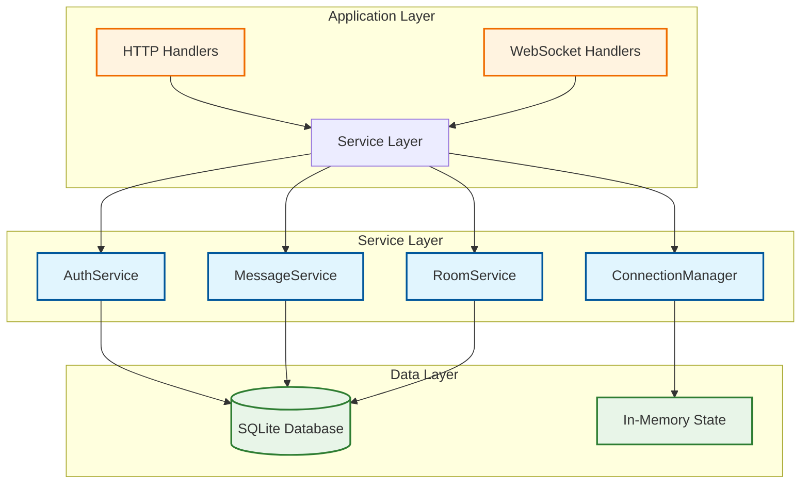

# Code Examples and Patterns

## IMPORTANT FOR VISUALS AND DIAGRAMS

ALL DIAGRAMS WILL BE IN MERMAID ONLY TO ENSURE EASE WITH GITHUB - DO NOT SKIP THAT

## Overview

This document provides comprehensive code examples and patterns for the Campfire Rust implementation, inspired by Rails helper modules and concerns. These examples demonstrate idiomatic Rust patterns adapted from Rails conventions, focusing on practical usage scenarios that developers will encounter when working with the codebase.

**Philosophy**: Show real-world usage patterns that leverage Rust's type system and ownership model while maintaining Rails-like simplicity and ergonomics.

## Core Architecture Pattern



## 1. Message Creation and Management

### Basic Message Creation Pattern

```rust
use campfire::{
    models::{Message, MessageId, RoomId, UserId},
    services::MessageService,
    errors::{MessageError, Result},
};
use uuid::Uuid;
use chrono::{DateTime, Utc};

// ✅ Type-safe message creation with deduplication
pub async fn create_message_example(
    message_service: &dyn MessageService,
    content: String,
    room_id: RoomId,
    user_id: UserId,
) -> Result<Message, MessageError> {
    // Generate client-side message ID for deduplication
    let client_message_id = Uuid::new_v4();
    
    // Create message with automatic deduplication
    let message = message_service
        .create_message_with_deduplication(
            content,
            room_id,
            user_id,
            client_message_id,
        )
        .await?;
    
    println!("Created message: {} in room: {}", message.id.0, room_id.0);
    Ok(message)
}

// ✅ Batch message creation with error handling
pub async fn create_multiple_messages(
    message_service: &dyn MessageService,
    messages: Vec<(String, RoomId, UserId)>,
) -> Vec<Result<Message, MessageError>> {
    let mut results = Vec::new();
    
    for (content, room_id, user_id) in messages {
        let client_id = Uuid::new_v4();
        let result = message_service
            .create_message_with_deduplication(content, room_id, user_id, client_id)
            .await;
        results.push(result);
    }
    
    results
}

// ✅ Message validation pattern
pub fn validate_message_content(content: &str) -> Result<(), MessageError> {
    if content.is_empty() {
        return Err(MessageError::ContentTooShort { length: 0, min: 1 });
    }
    
    if content.len() > 10_000 {
        return Err(MessageError::ContentTooLong { 
            length: content.len(), 
            max: 10_000 
        });
    }
    
    // Check for malicious content (basic example)
    if content.contains("<script>") {
        return Err(MessageError::InvalidContent { 
            reason: "Script tags not allowed".to_string() 
        });
    }
    
    Ok(())
}
```

### Message Retrieval Patterns

```rust
use campfire::models::{Message, MessageId, RoomId, UserId};

// ✅ Paginated message retrieval
pub async fn get_room_messages_paginated(
    message_service: &dyn MessageService,
    room_id: RoomId,
    user_id: UserId,
    page_size: u32,
    before_message: Option<MessageId>,
) -> Result<Vec<Message>, MessageError> {
    message_service
        .get_room_messages(room_id, user_id, page_size, before_message)
        .await
}

// ✅ Message search pattern
pub async fn search_user_messages(
    search_service: &dyn SearchService,
    user_id: UserId,
    query: &str,
    limit: u32,
) -> Result<Vec<Message>, SearchError> {
    search_service
        .search_messages(query, Some(user_id), limit, 0)
        .await
}

// ✅ Message filtering by content type
pub fn filter_messages_by_type(messages: &[Message]) -> (Vec<&Message>, Vec<&Message>) {
    let (text_messages, system_messages): (Vec<_>, Vec<_>) = messages
        .iter()
        .partition(|msg| !msg.content.starts_with("/"));
    
    (text_messages, system_messages)
}
```

## 2. Room Management Patterns

### Room Creation and Configuration

```rust
use campfire::{
    models::{Room, RoomId, RoomType, UserId, InvolvementLevel},
    services::RoomService,
    errors::{RoomError, Result},
};

// ✅ Create different types of rooms
pub async fn create_rooms_examples(
    room_service: &dyn RoomService,
    creator_id: UserId,
) -> Result<(Room, Room, Room), RoomError> {
    // Public room - anyone can join
    let public_room = room_service
        .create_room(
            "General Discussion".to_string(),
            Some("Open discussion for all team members".to_string()),
            RoomType::Open,
            creator_id,
        )
        .await?;
    
    // Private room - invitation only
    let private_room = room_service
        .create_room(
            "Leadership Team".to_string(),
            Some("Private discussions for leadership".to_string()),
            RoomType::Closed,
            creator_id,
        )
        .await?;
    
    // Direct message room
    let dm_room = room_service
        .create_room(
            "Direct Message".to_string(),
            None,
            RoomType::Direct,
            creator_id,
        )
        .await?;
    
    Ok((public_room, private_room, dm_room))
}

// ✅ Room membership management
pub async fn manage_room_membership(
    room_service: &dyn RoomService,
    room_id: RoomId,
    admin_user_id: UserId,
    new_members: Vec<(UserId, InvolvementLevel)>,
) -> Result<(), RoomError> {
    for (user_id, level) in new_members {
        room_service
            .add_member(room_id, user_id, admin_user_id, level)
            .await?;
        
        println!("Added user {} to room {} as {:?}", 
                user_id.0, room_id.0, level);
    }
    
    Ok(())
}

// ✅ Room access validation pattern
pub async fn check_user_room_access(
    room_service: &dyn RoomService,
    room_id: RoomId,
    user_id: UserId,
) -> Result<bool, RoomError> {
    match room_service.check_room_access(room_id, user_id).await? {
        Some(_involvement_level) => Ok(true),
        None => Ok(false),
    }
}
```

### Room Discovery and Listing

```rust
// ✅ Get user's accessible rooms
pub async fn get_user_rooms_organized(
    room_service: &dyn RoomService,
    user_id: UserId,
) -> Result<(Vec<Room>, Vec<Room>, Vec<Room>), RoomError> {
    let all_rooms = room_service.get_user_rooms(user_id).await?;
    
    let mut open_rooms = Vec::new();
    let mut closed_rooms = Vec::new();
    let mut direct_rooms = Vec::new();
    
    for room in all_rooms {
        match room.room_type {
            RoomType::Open => open_rooms.push(room),
            RoomType::Closed => closed_rooms.push(room),
            RoomType::Direct => direct_rooms.push(room),
        }
    }
    
    Ok((open_rooms, closed_rooms, direct_rooms))
}

// ✅ Room activity sorting
pub fn sort_rooms_by_activity(mut rooms: Vec<Room>) -> Vec<Room> {
    rooms.sort_by(|a, b| {
        match (a.last_message_at, b.last_message_at) {
            (Some(a_time), Some(b_time)) => b_time.cmp(&a_time), // Most recent first
            (Some(_), None) => std::cmp::Ordering::Less,          // Rooms with messages first
            (None, Some(_)) => std::cmp::Ordering::Greater,       // Rooms with messages first
            (None, None) => a.name.cmp(&b.name),                 // Alphabetical fallback
        }
    });
    rooms
}
```

## 3. WebSocket Connection and Broadcasting

### Connection Management Patterns

```rust
use campfire::{
    services::{ConnectionManager, ConnectionId},
    models::{UserId, RoomId, MessageId},
    websocket::{WebSocketMessage, WebSocketSender},
    errors::{ConnectionError, BroadcastError},
};
use tokio::sync::mpsc;
use uuid::Uuid;

// ✅ WebSocket connection lifecycle
pub async fn handle_websocket_connection(
    connection_manager: &dyn ConnectionManager,
    user_id: UserId,
    sender: WebSocketSender,
) -> Result<(), ConnectionError> {
    let connection_id = ConnectionId::new();
    
    // Add connection to manager
    connection_manager
        .add_connection(user_id, connection_id, sender)
        .await?;
    
    println!("User {} connected with connection {}", user_id.0, connection_id.0);
    
    // Connection will be automatically removed when sender is dropped
    Ok(())
}

// ✅ Broadcasting message to room
pub async fn broadcast_message_to_room(
    connection_manager: &dyn ConnectionManager,
    room_id: RoomId,
    message: &Message,
) -> Result<(), BroadcastError> {
    let ws_message = WebSocketMessage::NewMessage {
        message: message.clone(),
        room_id,
    };
    
    connection_manager
        .broadcast_to_room(room_id, ws_message)
        .await?;
    
    Ok(())
}

// ✅ Presence tracking pattern
pub async fn handle_presence_updates(
    connection_manager: &dyn ConnectionManager,
    room_id: RoomId,
) -> Result<Vec<UserId>, ConnectionError> {
    let present_users = connection_manager
        .get_room_presence(room_id)
        .await?;
    
    // Broadcast presence update to room
    let presence_message = WebSocketMessage::PresenceUpdate {
        room_id,
        present_users: present_users.clone(),
    };
    
    connection_manager
        .broadcast_to_room(room_id, presence_message)
        .await
        .map_err(|e| ConnectionError::SendFailed(e.to_string()))?;
    
    Ok(present_users)
}
```

### WebSocket Message Handling

```rust
use serde::{Serialize, Deserialize};

// ✅ WebSocket message types
#[derive(Debug, Clone, Serialize, Deserialize)]
#[serde(tag = "type")]
pub enum WebSocketMessage {
    NewMessage {
        message: Message,
        room_id: RoomId,
    },
    PresenceUpdate {
        room_id: RoomId,
        present_users: Vec<UserId>,
    },
    TypingStart {
        room_id: RoomId,
        user_id: UserId,
    },
    TypingStop {
        room_id: RoomId,
        user_id: UserId,
    },
    RoomJoined {
        room_id: RoomId,
        user_id: UserId,
    },
    RoomLeft {
        room_id: RoomId,
        user_id: UserId,
    },
    Error {
        message: String,
        code: String,
    },
}

// ✅ WebSocket message processing
pub async fn process_websocket_message(
    connection_manager: &dyn ConnectionManager,
    message: WebSocketMessage,
    sender_user_id: UserId,
) -> Result<(), ProcessingError> {
    match message {
        WebSocketMessage::TypingStart { room_id, user_id } => {
            if user_id == sender_user_id {
                let typing_message = WebSocketMessage::TypingStart { room_id, user_id };
                connection_manager
                    .broadcast_to_room(room_id, typing_message)
                    .await?;
            }
        }
        WebSocketMessage::TypingStop { room_id, user_id } => {
            if user_id == sender_user_id {
                let stop_message = WebSocketMessage::TypingStop { room_id, user_id };
                connection_manager
                    .broadcast_to_room(room_id, stop_message)
                    .await?;
            }
        }
        _ => {
            return Err(ProcessingError::UnsupportedMessage);
        }
    }
    
    Ok(())
}
```

### Reconnection and Missed Messages

```rust
// ✅ Handle reconnection with missed messages
pub async fn handle_reconnection(
    connection_manager: &dyn ConnectionManager,
    user_id: UserId,
    connection_id: ConnectionId,
    last_seen_message_id: Option<MessageId>,
) -> Result<(), ConnectionError> {
    // Send missed messages since last seen
    connection_manager
        .send_missed_messages(user_id, connection_id, last_seen_message_id)
        .await?;
    
    println!("Sent missed messages to user {} on reconnection", user_id.0);
    Ok(())
}

// ✅ Connection cleanup pattern
pub async fn cleanup_stale_connections(
    connection_manager: &dyn ConnectionManager,
) -> Result<usize, ConnectionError> {
    // This would typically be called by a background task
    // The actual cleanup is handled internally by the connection manager
    // with a 60-second TTL as specified in the design
    
    // For demonstration, we'll show how to get current presence
    let all_rooms = vec![]; // In real implementation, get from room service
    let mut total_cleaned = 0;
    
    for room_id in all_rooms {
        let _present_users = connection_manager
            .get_room_presence(room_id)
            .await?;
        // Cleanup happens automatically via TTL
    }
    
    Ok(total_cleaned)
}
```

## 4. Authentication and Authorization

### Session Management Patterns

```rust
use campfire::{
    services::AuthService,
    models::{User, UserId, Session},
    errors::{AuthError, Result},
};
use bcrypt::{hash, verify, DEFAULT_COST};

// ✅ User authentication flow
pub async fn authenticate_user(
    auth_service: &dyn AuthService,
    email: String,
    password: String,
) -> Result<(User, Session), AuthError> {
    // Authenticate user
    let session = auth_service
        .authenticate(email, password)
        .await?;
    
    // Get user details
    let user = auth_service
        .validate_session(session.token.clone())
        .await?;
    
    Ok((user, session))
}

// ✅ Session validation middleware pattern
pub async fn validate_session_token(
    auth_service: &dyn AuthService,
    token: Option<String>,
) -> Result<User, AuthError> {
    let token = token.ok_or(AuthError::SessionExpired)?;
    
    auth_service
        .validate_session(token)
        .await
}

// ✅ Password hashing utilities
pub fn hash_password(password: &str) -> Result<String, AuthError> {
    hash(password, DEFAULT_COST)
        .map_err(|e| AuthError::PasswordHash(e))
}

pub fn verify_password(password: &str, hash: &str) -> Result<bool, AuthError> {
    verify(password, hash)
        .map_err(|e| AuthError::PasswordHash(e))
}

// ✅ User creation with validation
pub async fn create_user_with_validation(
    auth_service: &dyn AuthService,
    name: String,
    email: String,
    password: String,
) -> Result<User, AuthError> {
    // Validate email format
    if !email.contains('@') || !email.contains('.') {
        return Err(AuthError::InvalidCredentials);
    }
    
    // Validate password strength
    if password.len() < 8 {
        return Err(AuthError::InvalidCredentials);
    }
    
    // Hash password
    let password_hash = hash_password(&password)?;
    
    // Create user (this would be implemented in the auth service)
    let user = User {
        id: UserId::new(),
        name,
        email,
        password_hash,
        bio: None,
        admin: false,
        bot_token: None,
        created_at: chrono::Utc::now(),
    };
    
    Ok(user)
}
```

### Authorization Patterns

```rust
use campfire::models::{InvolvementLevel, RoomType};

// ✅ Room access authorization
pub async fn authorize_room_access(
    room_service: &dyn RoomService,
    user_id: UserId,
    room_id: RoomId,
    required_level: InvolvementLevel,
) -> Result<(), AuthError> {
    let user_level = room_service
        .check_room_access(room_id, user_id)
        .await
        .map_err(|_| AuthError::InvalidCredentials)?;
    
    match user_level {
        Some(InvolvementLevel::Admin) => Ok(()), // Admin can do everything
        Some(InvolvementLevel::Member) if required_level == InvolvementLevel::Member => Ok(()),
        _ => Err(AuthError::InvalidCredentials),
    }
}

// ✅ Message authorization pattern
pub async fn authorize_message_creation(
    room_service: &dyn RoomService,
    user_id: UserId,
    room_id: RoomId,
) -> Result<(), MessageError> {
    let access = room_service
        .check_room_access(room_id, user_id)
        .await
        .map_err(|_| MessageError::Authorization { user_id, room_id })?;
    
    match access {
        Some(_) => Ok(()),
        None => Err(MessageError::Authorization { user_id, room_id }),
    }
}

// ✅ Admin authorization helper
pub fn require_admin(user: &User) -> Result<(), AuthError> {
    if user.admin {
        Ok(())
    } else {
        Err(AuthError::InvalidCredentials)
    }
}

// ✅ Bot token validation
pub async fn validate_bot_token(
    auth_service: &dyn AuthService,
    token: &str,
) -> Result<User, AuthError> {
    // In a real implementation, this would check the bot_token field
    // For now, we'll use the session validation as a placeholder
    auth_service
        .validate_session(token.to_string())
        .await
}
```

## 5. Testing Examples and Best Practices

### Unit Testing Patterns

```rust
#[cfg(test)]
mod tests {
    use super::*;
    use campfire::test_utils::{create_test_user, create_test_room, create_test_message};
    use tokio_test;
    
    // ✅ Message service testing
    #[tokio::test]
    async fn test_message_creation_with_deduplication() {
        let message_service = create_mock_message_service().await;
        let user = create_test_user();
        let room = create_test_room();
        let client_id = Uuid::new_v4();
        
        // First message should succeed
        let message1 = message_service
            .create_message_with_deduplication(
                "Test message".to_string(),
                room.id,
                user.id,
                client_id,
            )
            .await
            .expect("First message should succeed");
        
        // Second message with same client_id should return existing
        let message2 = message_service
            .create_message_with_deduplication(
                "Different content".to_string(),
                room.id,
                user.id,
                client_id,
            )
            .await
            .expect("Second message should return existing");
        
        assert_eq!(message1.id, message2.id);
        assert_eq!(message1.content, "Test message"); // Original content preserved
    }
    
    // ✅ Room access testing
    #[tokio::test]
    async fn test_room_access_authorization() {
        let room_service = create_mock_room_service().await;
        let user = create_test_user();
        let room = create_test_room();
        
        // Add user as member
        room_service
            .add_member(room.id, user.id, user.id, InvolvementLevel::Member)
            .await
            .expect("Should add member successfully");
        
        // Check access
        let access = room_service
            .check_room_access(room.id, user.id)
            .await
            .expect("Should check access successfully");
        
        assert_eq!(access, Some(InvolvementLevel::Member));
    }
    
    // ✅ WebSocket connection testing
    #[tokio::test]
    async fn test_websocket_connection_management() {
        let connection_manager = create_mock_connection_manager().await;
        let user = create_test_user();
        let (sender, _receiver) = tokio::sync::mpsc::unbounded_channel();
        let connection_id = ConnectionId::new();
        
        // Add connection
        connection_manager
            .add_connection(user.id, connection_id, sender)
            .await
            .expect("Should add connection successfully");
        
        // Check presence
        let room = create_test_room();
        let presence = connection_manager
            .get_room_presence(room.id)
            .await
            .expect("Should get presence successfully");
        
        // User should be present if they're in the room
        // (In real implementation, this would depend on room membership)
    }
}
```

### Integration Testing Patterns

```rust
#[cfg(test)]
mod integration_tests {
    use super::*;
    use campfire::test_utils::TestDatabase;
    
    // ✅ End-to-end message flow testing
    #[tokio::test]
    async fn test_complete_message_flow() {
        let test_db = TestDatabase::new().await;
        let message_service = create_message_service(&test_db).await;
        let room_service = create_room_service(&test_db).await;
        let connection_manager = create_connection_manager().await;
        
        // Create user and room
        let user = create_test_user();
        let room = room_service
            .create_room(
                "Test Room".to_string(),
                None,
                RoomType::Open,
                user.id,
            )
            .await
            .expect("Should create room");
        
        // Create message
        let message = message_service
            .create_message_with_deduplication(
                "Hello, world!".to_string(),
                room.id,
                user.id,
                Uuid::new_v4(),
            )
            .await
            .expect("Should create message");
        
        // Verify message was created
        let messages = message_service
            .get_room_messages(room.id, user.id, 10, None)
            .await
            .expect("Should get messages");
        
        assert_eq!(messages.len(), 1);
        assert_eq!(messages[0].content, "Hello, world!");
    }
    
    // ✅ Authentication flow testing
    #[tokio::test]
    async fn test_authentication_flow() {
        let test_db = TestDatabase::new().await;
        let auth_service = create_auth_service(&test_db).await;
        
        // Create user
        let user = create_user_with_validation(
            &*auth_service,
            "Test User".to_string(),
            "test@example.com".to_string(),
            "password123".to_string(),
        )
        .await
        .expect("Should create user");
        
        // Authenticate
        let session = auth_service
            .authenticate("test@example.com".to_string(), "password123".to_string())
            .await
            .expect("Should authenticate");
        
        // Validate session
        let validated_user = auth_service
            .validate_session(session.token)
            .await
            .expect("Should validate session");
        
        assert_eq!(user.id, validated_user.id);
    }
}
```

### Property-Based Testing

```rust
#[cfg(test)]
mod property_tests {
    use super::*;
    use proptest::prelude::*;
    
    proptest! {
        // ✅ Message content validation properties
        #[test]
        fn message_content_validation_properties(
            content in ".*",
            max_length in 1usize..20000
        ) {
            let result = validate_message_content(&content);
            
            if content.is_empty() {
                prop_assert!(result.is_err());
            } else if content.len() > 10000 {
                prop_assert!(result.is_err());
            } else if content.contains("<script>") {
                prop_assert!(result.is_err());
            } else {
                prop_assert!(result.is_ok());
            }
        }
        
        // ✅ User ID serialization roundtrip
        #[test]
        fn user_id_serialization_roundtrip(id in any::<u128>()) {
            let user_id = UserId(Uuid::from_u128(id));
            let serialized = serde_json::to_string(&user_id)
                .expect("Should serialize");
            let deserialized: UserId = serde_json::from_str(&serialized)
                .expect("Should deserialize");
            prop_assert_eq!(user_id, deserialized);
        }
    }
}
```

### Mock and Test Utilities

```rust
// ✅ Test utilities module
pub mod test_utils {
    use super::*;
    use std::sync::Arc;
    use tokio::sync::Mutex;
    use std::collections::HashMap;
    
    // Mock message service
    pub struct MockMessageService {
        messages: Arc<Mutex<HashMap<MessageId, Message>>>,
    }
    
    impl MockMessageService {
        pub fn new() -> Self {
            Self {
                messages: Arc::new(Mutex::new(HashMap::new())),
            }
        }
    }
    
    #[async_trait::async_trait]
    impl MessageService for MockMessageService {
        async fn create_message_with_deduplication(
            &self,
            content: String,
            room_id: RoomId,
            user_id: UserId,
            client_message_id: Uuid,
        ) -> Result<Message, MessageError> {
            let mut messages = self.messages.lock().await;
            
            // Check for existing message with same client_id
            for message in messages.values() {
                if message.client_message_id == client_message_id && message.room_id == room_id {
                    return Ok(message.clone());
                }
            }
            
            // Create new message
            let message = Message {
                id: MessageId::new(),
                room_id,
                creator_id: user_id,
                content,
                client_message_id,
                created_at: chrono::Utc::now(),
            };
            
            messages.insert(message.id, message.clone());
            Ok(message)
        }
        
        async fn get_room_messages(
            &self,
            room_id: RoomId,
            _user_id: UserId,
            limit: u32,
            _before: Option<MessageId>,
        ) -> Result<Vec<Message>, MessageError> {
            let messages = self.messages.lock().await;
            let room_messages: Vec<Message> = messages
                .values()
                .filter(|msg| msg.room_id == room_id)
                .take(limit as usize)
                .cloned()
                .collect();
            Ok(room_messages)
        }
        
        async fn broadcast_message(
            &self,
            _message: &Message,
            _room_id: RoomId,
        ) -> Result<(), BroadcastError> {
            // Mock implementation - just return success
            Ok(())
        }
    }
    
    // Test data creators
    pub fn create_test_user() -> User {
        User {
            id: UserId::new(),
            name: "Test User".to_string(),
            email: "test@example.com".to_string(),
            password_hash: "hashed_password".to_string(),
            bio: None,
            admin: false,
            bot_token: None,
            created_at: chrono::Utc::now(),
        }
    }
    
    pub fn create_test_room() -> Room {
        Room {
            id: RoomId::new(),
            name: "Test Room".to_string(),
            topic: Some("Test room for testing".to_string()),
            room_type: RoomType::Open,
            created_at: chrono::Utc::now(),
            last_message_at: None,
        }
    }
    
    pub fn create_test_message(room_id: RoomId, user_id: UserId) -> Message {
        Message {
            id: MessageId::new(),
            room_id,
            creator_id: user_id,
            content: "Test message content".to_string(),
            client_message_id: Uuid::new_v4(),
            created_at: chrono::Utc::now(),
        }
    }
}
```

## 6. Error Handling Patterns

### Comprehensive Error Hierarchies

```rust
use thiserror::Error;

// ✅ Application-level error aggregation
#[derive(Error, Debug)]
pub enum AppError {
    #[error("Authentication error: {0}")]
    Auth(#[from] AuthError),
    
    #[error("Message error: {0}")]
    Message(#[from] MessageError),
    
    #[error("Room error: {0}")]
    Room(#[from] RoomError),
    
    #[error("Connection error: {0}")]
    Connection(#[from] ConnectionError),
    
    #[error("Database error: {0}")]
    Database(#[from] sqlx::Error),
    
    #[error("Serialization error: {0}")]
    Serialization(#[from] serde_json::Error),
}

// ✅ Error context patterns
pub async fn handle_message_creation_with_context(
    message_service: &dyn MessageService,
    content: String,
    room_id: RoomId,
    user_id: UserId,
) -> anyhow::Result<Message> {
    let client_id = Uuid::new_v4();
    
    message_service
        .create_message_with_deduplication(content, room_id, user_id, client_id)
        .await
        .with_context(|| format!(
            "Failed to create message for user {} in room {}", 
            user_id.0, room_id.0
        ))
        .map_err(anyhow::Error::from)
}

// ✅ Error recovery patterns
pub async fn create_message_with_retry(
    message_service: &dyn MessageService,
    content: String,
    room_id: RoomId,
    user_id: UserId,
    max_retries: u32,
) -> Result<Message, MessageError> {
    let mut attempts = 0;
    let client_id = Uuid::new_v4();
    
    loop {
        match message_service
            .create_message_with_deduplication(
                content.clone(),
                room_id,
                user_id,
                client_id,
            )
            .await
        {
            Ok(message) => return Ok(message),
            Err(MessageError::Database(_)) if attempts < max_retries => {
                attempts += 1;
                tokio::time::sleep(tokio::time::Duration::from_millis(100 * attempts as u64)).await;
                continue;
            }
            Err(e) => return Err(e),
        }
    }
}
```

## 7. Performance Patterns

### Efficient Data Processing

```rust
// ✅ Zero-allocation message filtering
pub fn filter_messages_efficiently(
    messages: &[Message],
    user_id: UserId,
) -> impl Iterator<Item = &Message> {
    messages
        .iter()
        .filter(move |msg| msg.creator_id == user_id)
        .take(50)
}

// ✅ Batch processing pattern
pub async fn process_messages_in_batches(
    messages: Vec<Message>,
    batch_size: usize,
) -> Vec<Result<ProcessedMessage, ProcessingError>> {
    let mut results = Vec::with_capacity(messages.len());
    
    for batch in messages.chunks(batch_size) {
        let batch_results = futures::future::join_all(
            batch.iter().map(|msg| process_single_message(msg))
        ).await;
        
        results.extend(batch_results);
    }
    
    results
}

// ✅ Memory-efficient string processing
use std::borrow::Cow;

pub fn normalize_message_content(content: &str) -> Cow<str> {
    if content.contains('\r') {
        Cow::Owned(content.replace('\r', ""))
    } else {
        Cow::Borrowed(content)
    }
}
```

## 8. Concurrency Patterns

### Safe Concurrent Operations

```rust
use tokio::sync::{RwLock, Semaphore};
use std::sync::Arc;

// ✅ Reader-writer lock pattern for shared state
pub struct ConcurrentMessageCache {
    messages: Arc<RwLock<HashMap<MessageId, Message>>>,
    max_size: usize,
}

impl ConcurrentMessageCache {
    pub fn new(max_size: usize) -> Self {
        Self {
            messages: Arc::new(RwLock::new(HashMap::new())),
            max_size,
        }
    }
    
    pub async fn get(&self, id: &MessageId) -> Option<Message> {
        let messages = self.messages.read().await;
        messages.get(id).cloned()
    }
    
    pub async fn insert(&self, message: Message) {
        let mut messages = self.messages.write().await;
        
        // Evict oldest if at capacity
        if messages.len() >= self.max_size {
            if let Some(oldest_id) = messages.keys().next().copied() {
                messages.remove(&oldest_id);
            }
        }
        
        messages.insert(message.id, message);
    }
}

// ✅ Rate limiting with semaphore
pub struct RateLimitedProcessor {
    semaphore: Arc<Semaphore>,
}

impl RateLimitedProcessor {
    pub fn new(max_concurrent: usize) -> Self {
        Self {
            semaphore: Arc::new(Semaphore::new(max_concurrent)),
        }
    }
    
    pub async fn process_message(&self, message: Message) -> Result<(), ProcessingError> {
        let _permit = self.semaphore.acquire().await
            .map_err(|_| ProcessingError::RateLimited)?;
        
        // Process message with rate limiting
        expensive_message_processing(&message).await
    }
}
```

## 9. Configuration and Environment Patterns

### Environment-Based Configuration

```rust
use serde::{Deserialize, Serialize};
use std::env;

// ✅ Configuration structure
#[derive(Debug, Clone, Serialize, Deserialize)]
pub struct AppConfig {
    pub database_url: String,
    pub server_host: String,
    pub server_port: u16,
    pub session_secret: String,
    pub max_connections: usize,
    pub message_rate_limit: u32,
    pub enable_metrics: bool,
}

impl AppConfig {
    pub fn from_env() -> Result<Self, ConfigError> {
        Ok(Self {
            database_url: env::var("DATABASE_URL")
                .unwrap_or_else(|_| "sqlite:campfire.db".to_string()),
            server_host: env::var("HOST")
                .unwrap_or_else(|_| "127.0.0.1".to_string()),
            server_port: env::var("PORT")
                .unwrap_or_else(|_| "3000".to_string())
                .parse()
                .map_err(|_| ConfigError::InvalidPort)?,
            session_secret: env::var("SESSION_SECRET")
                .map_err(|_| ConfigError::MissingSessionSecret)?,
            max_connections: env::var("MAX_CONNECTIONS")
                .unwrap_or_else(|_| "1000".to_string())
                .parse()
                .unwrap_or(1000),
            message_rate_limit: env::var("MESSAGE_RATE_LIMIT")
                .unwrap_or_else(|_| "60".to_string())
                .parse()
                .unwrap_or(60),
            enable_metrics: env::var("ENABLE_METRICS")
                .unwrap_or_else(|_| "false".to_string())
                .parse()
                .unwrap_or(false),
        })
    }
}

#[derive(Error, Debug)]
pub enum ConfigError {
    #[error("Invalid port number")]
    InvalidPort,
    #[error("SESSION_SECRET environment variable is required")]
    MissingSessionSecret,
}
```

## 10. Logging and Observability Patterns

### Structured Logging

```rust
use tracing::{info, warn, error, debug, instrument};
use tracing_subscriber::{layer::SubscriberExt, util::SubscriberInitExt};

// ✅ Initialize logging
pub fn init_logging() -> Result<(), Box<dyn std::error::Error>> {
    tracing_subscriber::registry()
        .with(tracing_subscriber::EnvFilter::new(
            std::env::var("RUST_LOG").unwrap_or_else(|_| "campfire=info".into()),
        ))
        .with(tracing_subscriber::fmt::layer())
        .init();
    
    Ok(())
}

// ✅ Instrumented functions
#[instrument(skip(message_service))]
pub async fn create_message_with_logging(
    message_service: &dyn MessageService,
    content: String,
    room_id: RoomId,
    user_id: UserId,
) -> Result<Message, MessageError> {
    debug!("Creating message for user {} in room {}", user_id.0, room_id.0);
    
    let client_id = Uuid::new_v4();
    
    match message_service
        .create_message_with_deduplication(content, room_id, user_id, client_id)
        .await
    {
        Ok(message) => {
            info!("Successfully created message {}", message.id.0);
            Ok(message)
        }
        Err(e) => {
            error!("Failed to create message: {}", e);
            Err(e)
        }
    }
}

// ✅ Metrics collection
#[cfg(feature = "metrics")]
pub mod metrics {
    use prometheus::{Counter, Histogram, register_counter, register_histogram};
    use std::sync::OnceLock;
    
    static MESSAGE_COUNTER: OnceLock<Counter> = OnceLock::new();
    static MESSAGE_DURATION: OnceLock<Histogram> = OnceLock::new();
    
    pub fn init_metrics() -> Result<(), Box<dyn std::error::Error>> {
        MESSAGE_COUNTER.set(register_counter!(
            "campfire_messages_total",
            "Total number of messages created"
        )?).map_err(|_| "Failed to set message counter")?;
        
        MESSAGE_DURATION.set(register_histogram!(
            "campfire_message_duration_seconds",
            "Time spent creating messages"
        )?).map_err(|_| "Failed to set message duration")?;
        
        Ok(())
    }
    
    pub fn record_message_created() {
        if let Some(counter) = MESSAGE_COUNTER.get() {
            counter.inc();
        }
    }
    
    pub fn record_message_duration(duration: f64) {
        if let Some(histogram) = MESSAGE_DURATION.get() {
            histogram.observe(duration);
        }
    }
}
```

## Summary

These code examples demonstrate the core patterns used throughout the Campfire Rust implementation:

1. **Type Safety**: Using newtypes and enums to prevent bugs at compile time
2. **Error Handling**: Comprehensive error hierarchies with proper context
3. **Async Patterns**: Efficient concurrent operations with proper resource management
4. **Testing**: Unit, integration, and property-based testing strategies
5. **Performance**: Zero-allocation patterns and efficient data processing
6. **Observability**: Structured logging and metrics collection

Each pattern follows Rust idioms while maintaining Rails-like simplicity and ergonomics, ensuring the codebase is both safe and maintainable.

The examples are designed to be copy-pasteable and immediately useful for developers working on the Campfire implementation, providing clear guidance on how to implement common functionality correctly and efficiently.