# Production Deployment Guide

## IMPORTANT FOR VISUALS AND DIAGRAMS

ALL DIAGRAMS WILL BE IN MERMAID ONLY TO ENSURE EASE WITH GITHUB - DO NOT SKIP THAT

## Overview

This comprehensive guide covers deploying Campfire Rust to production environments, from single-server deployments to scalable cloud architectures. The guide follows Basecamp's proven deployment patterns adapted for modern containerized environments.


**Deployment Philosophy:**
- **Single Binary Simplicity**: Leverage Rust's static compilation for zero-dependency deployments
- **Container-First**: Docker containers for consistent environments across development and production
- **Infrastructure as Code**: Reproducible deployments with version-controlled configurations
- **Monitoring-First**: Built-in observability from day one
- **Security by Default**: Secure configurations with minimal attack surface

## Quick Start (5-Minute Deployment)

```bash
# 1. Clone and configure
git clone https://github.com/that-in-rust/campfire-on-rust.git
cd campfire-on-rust
cp .env.example .env.production

# 2. Deploy with Docker Compose
./scripts/deploy.sh deploy

# 3. Access application
open http://localhost:3000
```

## Deployment Architecture Overview


## Docker Deployment

### Single Container Deployment

The simplest production deployment uses a single Docker container with persistent volumes:


### Docker Compose Configuration

Create a production-ready `docker-compose.yml`:

```yaml
version: '3.8'

services:
  campfire:
    build:
      context: .
      dockerfile: Dockerfile
    image: campfire-rust:latest
    container_name: campfire
    restart: unless-stopped
    
    # Port mapping
    ports:
      - "3000:3000"
    
    # Environment configuration
    env_file:
      - .env.production
    
    # Volume mounts for persistent data
    volumes:
      - ./data:/app/data
      - ./logs:/app/logs
      - ./backups:/app/backups
    
    # Health check
    healthcheck:
      test: ["CMD", "/app/healthcheck.sh"]
      interval: 30s
      timeout: 10s
      retries: 3
      start_period: 10s
    
    # Resource limits
    deploy:
      resources:
        limits:
          memory: 512M
          cpus: '1.0'
        reservations:
          memory: 256M
          cpus: '0.5'
    
    # Security settings
    security_opt:
      - no-new-privileges:true
    read_only: false
    tmpfs:
      - /tmp:noexec,nosuid,size=100m
    
    # Logging configuration
    logging:
      driver: "json-file"
      options:
        max-size: "10m"
        max-file: "3"

  # Optional: Reverse proxy with automatic SSL
  caddy:
    image: caddy:2-alpine
    container_name: campfire-caddy
    restart: unless-stopped
    profiles:
      - proxy
    
    ports:
      - "80:80"
      - "443:443"
    
    volumes:
      - ./Caddyfile:/etc/caddy/Caddyfile
      - caddy_data:/data
      - caddy_config:/config
    
    depends_on:
      - campfire

volumes:
  caddy_data:
  caddy_config:
```

### Environment Configuration

Create `.env.production` with production settings:

```bash
# Server Configuration
CAMPFIRE_HOST=0.0.0.0
CAMPFIRE_PORT=3000
CAMPFIRE_REQUEST_TIMEOUT=30
CAMPFIRE_MAX_REQUEST_SIZE=16777216
CAMPFIRE_SHUTDOWN_TIMEOUT=30
CAMPFIRE_WORKER_THREADS=4

# Database Configuration
CAMPFIRE_DATABASE_URL=/app/data/campfire.db
CAMPFIRE_DB_MAX_CONNECTIONS=20
CAMPFIRE_DB_TIMEOUT=30
CAMPFIRE_DB_WAL_MODE=true
CAMPFIRE_BACKUP_DIR=/app/backups

# Logging Configuration
CAMPFIRE_LOG_LEVEL=info
CAMPFIRE_LOG_FORMAT=json
CAMPFIRE_LOG_FILE=/app/logs/campfire.log
CAMPFIRE_LOG_STRUCTURED=true
CAMPFIRE_TRACE_REQUESTS=false

# Security Configuration
CAMPFIRE_CORS_ORIGINS=https://your-domain.com
CAMPFIRE_RATE_LIMIT_RPM=120
CAMPFIRE_SESSION_TOKEN_LENGTH=32
CAMPFIRE_SESSION_EXPIRY_HOURS=24
CAMPFIRE_FORCE_HTTPS=true
CAMPFIRE_TRUST_PROXY=true

# Push Notifications
CAMPFIRE_PUSH_ENABLED=true
CAMPFIRE_VAPID_PRIVATE_KEY=<your-vapid-private-key>
CAMPFIRE_VAPID_PUBLIC_KEY=<your-vapid-public-key>
CAMPFIRE_VAPID_SUBJECT=mailto:admin@your-domain.com

# Metrics Configuration
CAMPFIRE_METRICS_ENABLED=true
CAMPFIRE_METRICS_DETAILED=true

# Rust Configuration
RUST_LOG=campfire_on_rust=info,tower_http=info
```

## Reverse Proxy Setup

### nginx Configuration

Create `/etc/nginx/sites-available/campfire`:

```nginx
# Campfire Rust Production Configuration
upstream campfire_backend {
    server 127.0.0.1:3000;
    # Add more servers for load balancing
    # server 127.0.0.1:3001;
    # server 127.0.0.1:3002;
}

# Rate limiting
limit_req_zone $binary_remote_addr zone=campfire_api:10m rate=10r/s;
limit_req_zone $binary_remote_addr zone=campfire_websocket:10m rate=5r/s;

# HTTP to HTTPS redirect
server {
    listen 80;
    server_name your-domain.com www.your-domain.com;
    return 301 https://$server_name$request_uri;
}

# Main HTTPS server
server {
    listen 443 ssl http2;
    server_name your-domain.com www.your-domain.com;
    
    # SSL Configuration
    ssl_certificate /etc/letsencrypt/live/your-domain.com/fullchain.pem;
    ssl_certificate_key /etc/letsencrypt/live/your-domain.com/privkey.pem;
    ssl_session_timeout 1d;
    ssl_session_cache shared:SSL:50m;
    ssl_session_tickets off;
    
    # Modern SSL configuration
    ssl_protocols TLSv1.2 TLSv1.3;
    ssl_ciphers ECDHE-ECDSA-AES128-GCM-SHA256:ECDHE-RSA-AES128-GCM-SHA256:ECDHE-ECDSA-AES256-GCM-SHA384:ECDHE-RSA-AES256-GCM-SHA384;
    ssl_prefer_server_ciphers off;
    
    # HSTS
    add_header Strict-Transport-Security "max-age=63072000" always;
    
    # Security headers
    add_header X-Frame-Options DENY always;
    add_header X-Content-Type-Options nosniff always;
    add_header X-XSS-Protection "1; mode=block" always;
    add_header Referrer-Policy "strict-origin-when-cross-origin" always;
    add_header Content-Security-Policy "default-src 'self'; script-src 'self' 'unsafe-inline'; style-src 'self' 'unsafe-inline'; img-src 'self' data: https:; connect-src 'self' wss:; font-src 'self'; object-src 'none'; media-src 'self'; frame-src 'none';" always;
    
    # Logging
    access_log /var/log/nginx/campfire_access.log;
    error_log /var/log/nginx/campfire_error.log;
    
    # Gzip compression
    gzip on;
    gzip_vary on;
    gzip_min_length 1024;
    gzip_types text/plain text/css text/xml text/javascript application/javascript application/xml+rss application/json;
    
    # Main application proxy
    location / {
        # Rate limiting
        limit_req zone=campfire_api burst=20 nodelay;
        
        proxy_pass http://campfire_backend;
        proxy_http_version 1.1;
        proxy_set_header Upgrade $http_upgrade;
        proxy_set_header Connection 'upgrade';
        proxy_set_header Host $host;
        proxy_set_header X-Real-IP $remote_addr;
        proxy_set_header X-Forwarded-For $proxy_add_x_forwarded_for;
        proxy_set_header X-Forwarded-Proto $scheme;
        proxy_cache_bypass $http_upgrade;
        
        # Timeouts
        proxy_connect_timeout 60s;
        proxy_send_timeout 60s;
        proxy_read_timeout 60s;
        
        # Buffer settings
        proxy_buffering on;
        proxy_buffer_size 128k;
        proxy_buffers 4 256k;
        proxy_busy_buffers_size 256k;
    }
    
    # WebSocket proxy with special handling
    location /ws {
        # Rate limiting for WebSocket connections
        limit_req zone=campfire_websocket burst=10 nodelay;
        
        proxy_pass http://campfire_backend;
        proxy_http_version 1.1;
        proxy_set_header Upgrade $http_upgrade;
        proxy_set_header Connection "upgrade";
        proxy_set_header Host $host;
        proxy_set_header X-Real-IP $remote_addr;
        proxy_set_header X-Forwarded-For $proxy_add_x_forwarded_for;
        proxy_set_header X-Forwarded-Proto $scheme;
        
        # WebSocket specific timeouts
        proxy_connect_timeout 60s;
        proxy_send_timeout 60s;
        proxy_read_timeout 3600s;  # 1 hour for long-lived connections
        
        # Disable buffering for WebSocket
        proxy_buffering off;
    }
    
    # Health check endpoint (no rate limiting)
    location /health {
        proxy_pass http://campfire_backend;
        proxy_set_header Host $host;
        access_log off;
    }
    
    # Metrics endpoint (restrict access)
    location /metrics {
        allow 127.0.0.1;
        allow 10.0.0.0/8;
        allow 172.16.0.0/12;
        allow 192.168.0.0/16;
        deny all;
        
        proxy_pass http://campfire_backend;
        proxy_set_header Host $host;
    }
    
    # Static assets caching (if serving static files)
    location ~* \.(js|css|png|jpg|jpeg|gif|ico|svg|woff|woff2|ttf|eot)$ {
        expires 1y;
        add_header Cache-Control "public, immutable";
        add_header X-Content-Type-Options nosniff;
    }
}
```

### Caddy Configuration (Alternative)

Create `Caddyfile` for automatic HTTPS:

```caddyfile
# Campfire Rust Production Configuration
your-domain.com {
    # Automatic HTTPS with Let's Encrypt
    
    # Security headers
    header {
        # Enable HSTS
        Strict-Transport-Security "max-age=63072000; includeSubDomains; preload"
        
        # Prevent clickjacking
        X-Frame-Options "DENY"
        
        # Prevent MIME type sniffing
        X-Content-Type-Options "nosniff"
        
        # XSS protection
        X-XSS-Protection "1; mode=block"
        
        # Referrer policy
        Referrer-Policy "strict-origin-when-cross-origin"
        
        # Content Security Policy
        Content-Security-Policy "default-src 'self'; script-src 'self' 'unsafe-inline'; style-src 'self' 'unsafe-inline'; img-src 'self' data: https:; connect-src 'self' wss:; font-src 'self'; object-src 'none'; media-src 'self'; frame-src 'none';"
    }
    
    # Rate limiting
    rate_limit {
        zone dynamic {
            key {remote_host}
            events 100
            window 1m
        }
    }
    
    # Gzip compression
    encode gzip
    
    # Main application proxy
    reverse_proxy campfire:3000 {
        # Health check
        health_uri /health
        health_interval 30s
        health_timeout 10s
        
        # Load balancing (if multiple instances)
        # lb_policy round_robin
    }
    
    # Logging
    log {
        output file /var/log/caddy/campfire.log {
            roll_size 100mb
            roll_keep 5
            roll_keep_for 720h
        }
        format json
    }
}

# Metrics endpoint (internal access only)
metrics.your-domain.com {
    # Restrict access to internal networks
    @internal {
        remote_ip 10.0.0.0/8 172.16.0.0/12 192.168.0.0/16 127.0.0.1/8
    }
    
    handle @internal {
        reverse_proxy campfire:3000
    }
    
    respond 403
}
```

## SSL Configuration

### Let's Encrypt with Certbot

```bash
# Install Certbot
sudo apt-get update
sudo apt-get install certbot python3-certbot-nginx

# Obtain SSL certificate
sudo certbot --nginx -d your-domain.com -d www.your-domain.com

# Test automatic renewal
sudo certbot renew --dry-run

# Set up automatic renewal (crontab)
echo "0 12 * * * /usr/bin/certbot renew --quiet" | sudo crontab -
```

### SSL Security Best Practices


## Monitoring and Health Checks

### Health Check Endpoints

Campfire provides multiple health check endpoints:

```bash
# Basic health check
curl http://localhost:3000/health
# Response: {"status": "healthy", "timestamp": "2024-01-01T12:00:00Z"}

# Detailed readiness check
curl http://localhost:3000/health/ready
# Response: {"status": "ready", "database": "connected", "services": "operational"}

# Liveness check
curl http://localhost:3000/health/live
# Response: {"status": "alive", "uptime": "3600s", "memory": "45MB"}
```

### Prometheus Metrics

Configure Prometheus to scrape metrics:

```yaml
# prometheus.yml
global:
  scrape_interval: 15s
  evaluation_interval: 15s

scrape_configs:
  - job_name: 'campfire'
    static_configs:
      - targets: ['localhost:3000']
    metrics_path: '/metrics'
    scrape_interval: 10s
    scrape_timeout: 5s
    
    # Relabel metrics for better organization
    metric_relabel_configs:
      - source_labels: [__name__]
        regex: 'campfire_(.*)'
        target_label: __name__
        replacement: 'campfire_${1}'
```

### Key Metrics to Monitor


### Grafana Dashboard Configuration

Create `grafana-dashboard.json`:

```json
{
  "dashboard": {
    "title": "Campfire Rust Production Dashboard",
    "panels": [
      {
        "title": "HTTP Request Rate",
        "type": "graph",
        "targets": [
          {
            "expr": "rate(campfire_http_requests_total[5m])",
            "legendFormat": "{{method}} {{status}}"
          }
        ]
      },
      {
        "title": "WebSocket Connections",
        "type": "singlestat",
        "targets": [
          {
            "expr": "campfire_websocket_connections_active",
            "legendFormat": "Active Connections"
          }
        ]
      },
      {
        "title": "Database Query Duration",
        "type": "graph",
        "targets": [
          {
            "expr": "histogram_quantile(0.95, rate(campfire_database_query_duration_seconds_bucket[5m]))",
            "legendFormat": "95th percentile"
          }
        ]
      }
    ]
  }
}
```

## Backup and Restore Procedures

### Automated Backup Strategy

```mermaid
graph TD
    subgraph "Backup Schedule"
        CONTINUOUS[Continuous Backup<br/>WAL File Streaming]
        HOURLY[Hourly Snapshots<br/>Incremental Changes]
        DAILY[Daily Full Backup<br/>Complete Database]
        WEEKLY[Weekly Archive<br/>Long-term Storage]
    end
    
    subgraph "Backup Storage"
        LOCAL[Local Storage<br/>Fast Recovery]
        REMOTE[Remote Storage<br/>S3/GCS/Azure]
        ENCRYPTED[Encryption<br/>AES-256]
        COMPRESSED[Compression<br/>gzip/lz4]
    end
    
    subgraph "Backup Verification"
        INTEGRITY[Integrity Check<br/>SQLite PRAGMA]
        RESTORE_TEST[Restore Test<br/>Automated Validation]
        MONITORING[Backup Monitoring<br/>Success/Failure Alerts]
    end
    
    CONTINUOUS --> LOCAL
    HOURLY --> LOCAL
    DAILY --> REMOTE
    WEEKLY --> REMOTE
    
    LOCAL --> ENCRYPTED
    REMOTE --> ENCRYPTED
    ENCRYPTED --> COMPRESSED
    
    COMPRESSED --> INTEGRITY
    INTEGRITY --> RESTORE_TEST
    RESTORE_TEST --> MONITORING
    
    classDef schedule fill:#e8f5e8,stroke:#2e7d32,stroke-width:2px
    classDef storage fill:#fff3e0,stroke:#ef6c00,stroke-width:2px
    classDef verification fill:#e3f2fd,stroke:#1976d2,stroke-width:2px
    
    class CONTINUOUS,HOURLY,DAILY,WEEKLY schedule
    class LOCAL,REMOTE,ENCRYPTED,COMPRESSED storage
    class INTEGRITY,RESTORE_TEST,MONITORING verification
```



### Backup Script Configuration

Create automated backup with cron:

```bash
# Add to crontab for automated backups
# Hourly incremental backups
0 * * * * /app/scripts/backup.sh --incremental

# Daily full backups at 2 AM
0 2 * * * /app/scripts/backup.sh --full

# Weekly cleanup of old backups
0 3 * * 0 /app/scripts/backup.sh --cleanup

# Monthly archive to remote storage
0 4 1 * * /app/scripts/backup.sh --archive
```

### Disaster Recovery Procedures


## Security Configuration

### Production Security Checklist


### Security Headers Configuration

Ensure these security headers are set:

```bash
# Security headers (set by reverse proxy or application)
Strict-Transport-Security: max-age=63072000; includeSubDomains; preload
X-Frame-Options: DENY
X-Content-Type-Options: nosniff
X-XSS-Protection: 1; mode=block
Referrer-Policy: strict-origin-when-cross-origin
Content-Security-Policy: default-src 'self'; script-src 'self' 'unsafe-inline'; style-src 'self' 'unsafe-inline'; img-src 'self' data: https:; connect-src 'self' wss:; font-src 'self'; object-src 'none'; media-src 'self'; frame-src 'none';
```

### Firewall Configuration

```bash
# UFW (Ubuntu Firewall) configuration
sudo ufw default deny incoming
sudo ufw default allow outgoing

# Allow SSH (change port if using non-standard)
sudo ufw allow 22/tcp

# Allow HTTP and HTTPS
sudo ufw allow 80/tcp
sudo ufw allow 443/tcp

# Allow specific monitoring ports (if needed)
sudo ufw allow from 10.0.0.0/8 to any port 9090  # Prometheus
sudo ufw allow from 10.0.0.0/8 to any port 3001  # Grafana

# Enable firewall
sudo ufw enable

# Check status
sudo ufw status verbose
```

## Performance Optimization

### Resource Allocation


### Performance Tuning Configuration

```bash
# Environment variables for performance tuning
CAMPFIRE_WORKER_THREADS=8                    # Match CPU cores
CAMPFIRE_DB_MAX_CONNECTIONS=50               # Database pool size
CAMPFIRE_REQUEST_TIMEOUT=30                  # Request timeout
CAMPFIRE_WEBSOCKET_PING_INTERVAL=30          # WebSocket keepalive
CAMPFIRE_COMPRESSION_LEVEL=6                 # gzip compression level
CAMPFIRE_CACHE_SIZE=100MB                    # In-memory cache size
CAMPFIRE_DB_CACHE_SIZE=64MB                  # SQLite cache size
CAMPFIRE_MAX_CONCURRENT_REQUESTS=1000        # Concurrent request limit
```

## Scaling Strategies

### Horizontal Scaling Architecture


### Database Scaling Considerations

For high-scale deployments, consider migrating from SQLite to PostgreSQL:

```sql
-- PostgreSQL configuration for scaled deployment
-- postgresql.conf optimizations

# Connection settings
max_connections = 200
shared_buffers = 256MB
effective_cache_size = 1GB
work_mem = 4MB
maintenance_work_mem = 64MB

# WAL settings
wal_buffers = 16MB
checkpoint_completion_target = 0.9
wal_writer_delay = 200ms

# Query planner
random_page_cost = 1.1  # For SSD storage
effective_io_concurrency = 200

# Logging
log_min_duration_statement = 1000  # Log slow queries
log_checkpoints = on
log_connections = on
log_disconnections = on
```

## Troubleshooting Guide

### Common Issues and Solutions


### Diagnostic Commands

```bash
# Application health and status
curl -f http://localhost:3000/health
docker logs -f campfire --tail 100
docker stats campfire

# Database diagnostics
sqlite3 /app/data/campfire.db "PRAGMA integrity_check;"
sqlite3 /app/data/campfire.db "PRAGMA table_info(messages);"
sqlite3 /app/data/campfire.db "SELECT COUNT(*) FROM messages;"

# System resource monitoring
htop
iotop
netstat -tulpn | grep 3000
ss -tuln | grep 3000

# Network connectivity testing
curl -I https://your-domain.com
curl -v wss://your-domain.com/ws
nslookup your-domain.com

# Log analysis
journalctl -u campfire -f
tail -f /var/log/nginx/campfire_error.log
grep -i error /app/logs/campfire.log | tail -20

# Metrics analysis
curl http://localhost:3000/metrics | grep campfire_http_requests_total
curl http://localhost:3000/metrics | grep campfire_websocket_connections
```

## Maintenance Procedures

### Regular Maintenance Tasks


### Update and Deployment Procedures

```bash
# Production update procedure
#!/bin/bash

# 1. Pre-deployment checks
./scripts/deploy.sh status
./scripts/backup.sh

# 2. Deploy to staging first
docker build -t campfire-rust:staging .
docker run --rm campfire-rust:staging cargo test

# 3. Deploy to production with zero downtime
./scripts/deploy.sh deploy --no-cache

# 4. Post-deployment verification
sleep 30
curl -f http://localhost:3000/health
./scripts/deploy.sh status

# 5. Monitor for issues
./scripts/deploy.sh logs --tail 100
```

## Cloud Platform Deployment

### AWS Deployment

```yaml
# docker-compose.aws.yml
version: '3.8'

services:
  campfire:
    image: your-account.dkr.ecr.region.amazonaws.com/campfire-rust:latest
    environment:
      - CAMPFIRE_DATABASE_URL=/app/data/campfire.db
      - CAMPFIRE_BACKUP_DIR=/app/backups
      - AWS_REGION=us-west-2
      - AWS_S3_BACKUP_BUCKET=campfire-backups
    volumes:
      - campfire_data:/app/data
      - campfire_logs:/app/logs
    deploy:
      replicas: 2
      resources:
        limits:
          memory: 512M
          cpus: '0.5'
      restart_policy:
        condition: on-failure
        delay: 5s
        max_attempts: 3
    healthcheck:
      test: ["CMD", "/app/healthcheck.sh"]
      interval: 30s
      timeout: 10s
      retries: 3

volumes:
  campfire_data:
    driver: local
    driver_opts:
      type: nfs
      o: addr=fs-12345.efs.region.amazonaws.com,rsize=1048576,wsize=1048576,hard,intr,nfsvers=4.1
      device: :/
```

### Google Cloud Platform Deployment

```yaml
# cloudbuild.yaml
steps:
  - name: 'gcr.io/cloud-builders/docker'
    args: ['build', '-t', 'gcr.io/$PROJECT_ID/campfire-rust:$COMMIT_SHA', '.']
  
  - name: 'gcr.io/cloud-builders/docker'
    args: ['push', 'gcr.io/$PROJECT_ID/campfire-rust:$COMMIT_SHA']
  
  - name: 'gcr.io/cloud-builders/gcloud'
    args:
      - 'run'
      - 'deploy'
      - 'campfire-rust'
      - '--image=gcr.io/$PROJECT_ID/campfire-rust:$COMMIT_SHA'
      - '--region=us-central1'
      - '--platform=managed'
      - '--allow-unauthenticated'
      - '--memory=512Mi'
      - '--cpu=1'
      - '--max-instances=10'
      - '--set-env-vars=CAMPFIRE_LOG_LEVEL=info'
```

### Azure Container Instances

```yaml
# azure-container-instance.yaml
apiVersion: 2019-12-01
location: eastus
name: campfire-rust
properties:
  containers:
  - name: campfire
    properties:
      image: your-registry.azurecr.io/campfire-rust:latest
      resources:
        requests:
          cpu: 1
          memoryInGb: 0.5
      ports:
      - port: 3000
        protocol: TCP
      environmentVariables:
      - name: CAMPFIRE_HOST
        value: 0.0.0.0
      - name: CAMPFIRE_PORT
        value: 3000
      - name: CAMPFIRE_LOG_LEVEL
        value: info
      volumeMounts:
      - name: campfire-data
        mountPath: /app/data
  osType: Linux
  restartPolicy: Always
  ipAddress:
    type: Public
    ports:
    - protocol: TCP
      port: 3000
  volumes:
  - name: campfire-data
    azureFile:
      shareName: campfire-data
      storageAccountName: your-storage-account
      storageAccountKey: your-storage-key
tags:
  environment: production
  application: campfire-rust
```

## Conclusion

This production deployment guide provides comprehensive coverage of deploying Campfire Rust in production environments, from simple single-server deployments to scalable cloud architectures. The guide emphasizes:

- **Security-first approach** with proper SSL, headers, and access controls
- **Monitoring and observability** with comprehensive metrics and alerting
- **Automated backup and recovery** procedures for data protection
- **Performance optimization** for production workloads
- **Scalability considerations** for growing user bases
- **Maintenance procedures** for long-term operational success

Following these patterns ensures a robust, secure, and maintainable production deployment that can scale with your organization's needs while maintaining the simplicity and performance benefits of the Rust implementation.

For additional support and advanced deployment scenarios, refer to the specific cloud platform documentation and consider engaging with the Campfire Rust community for deployment best practices and troubleshooting assistance.