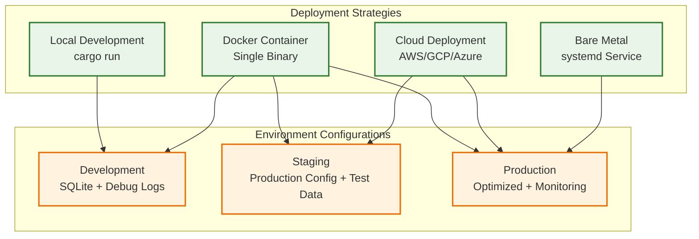
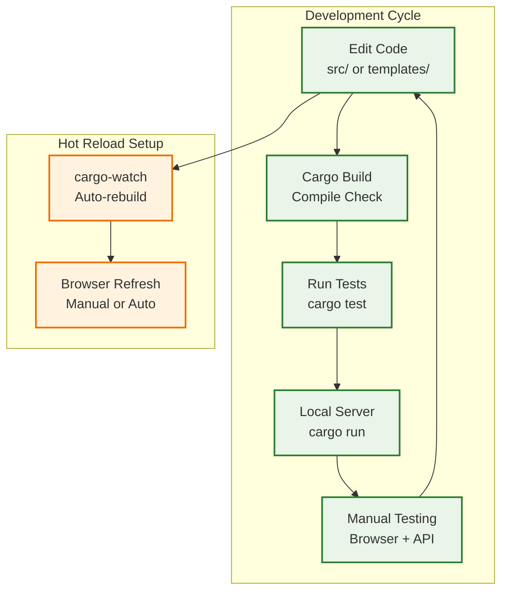
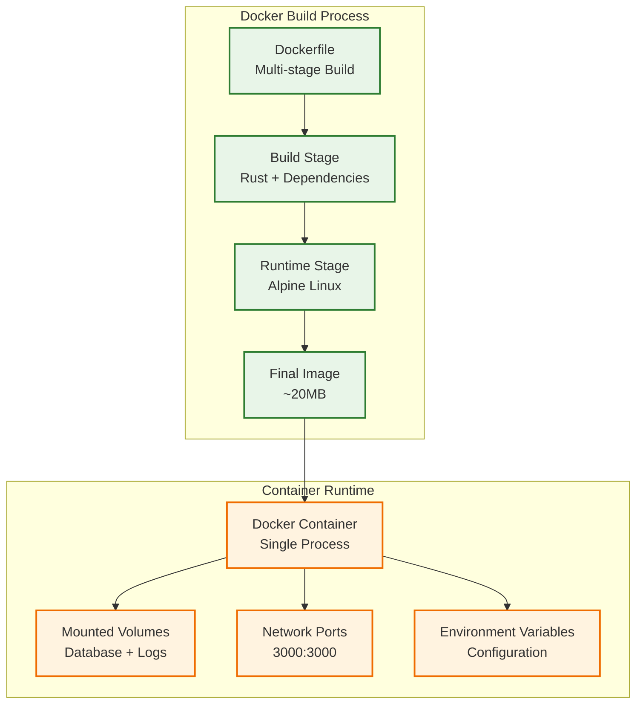
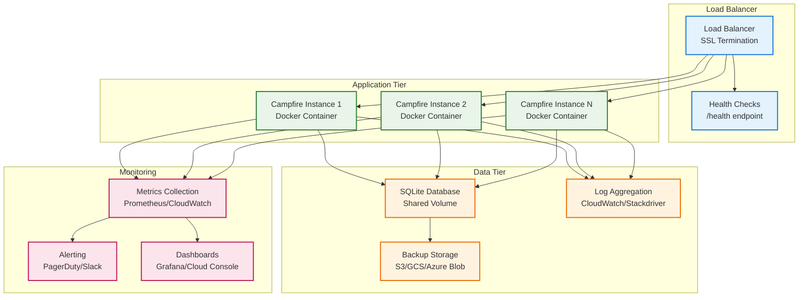
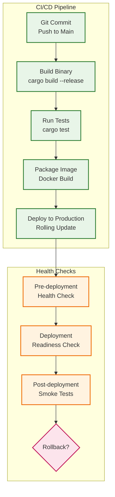
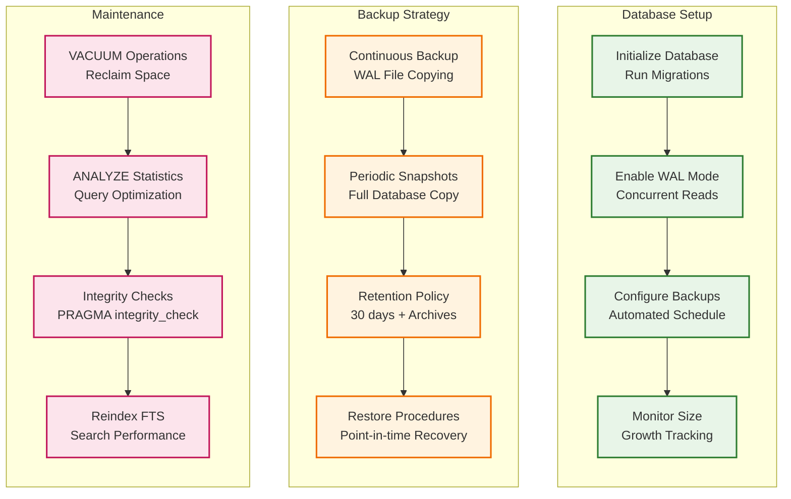
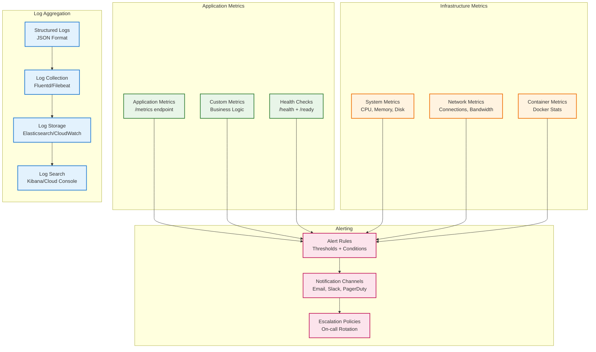
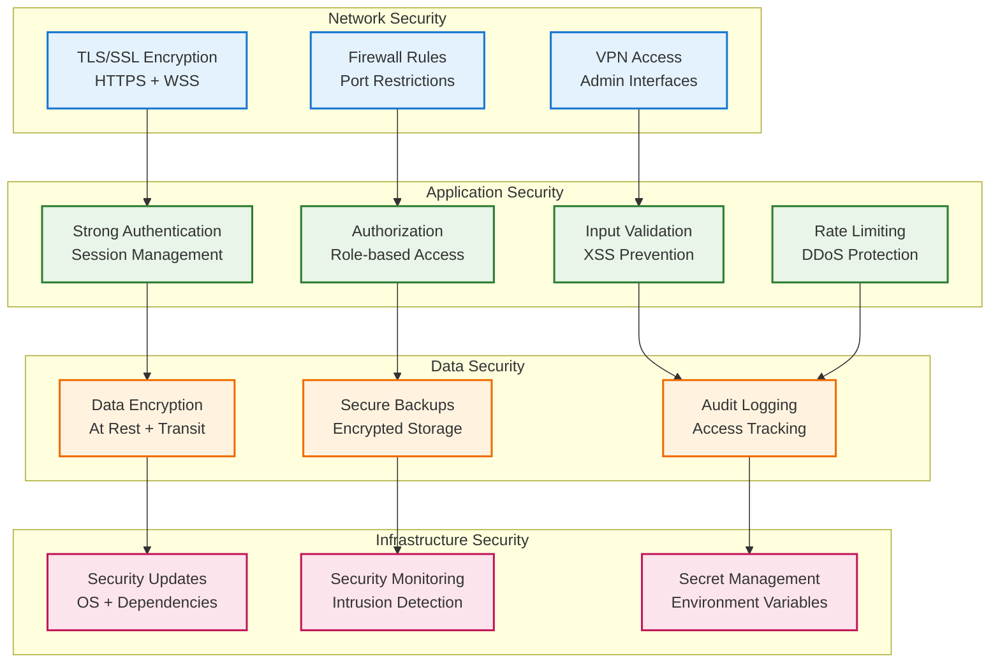
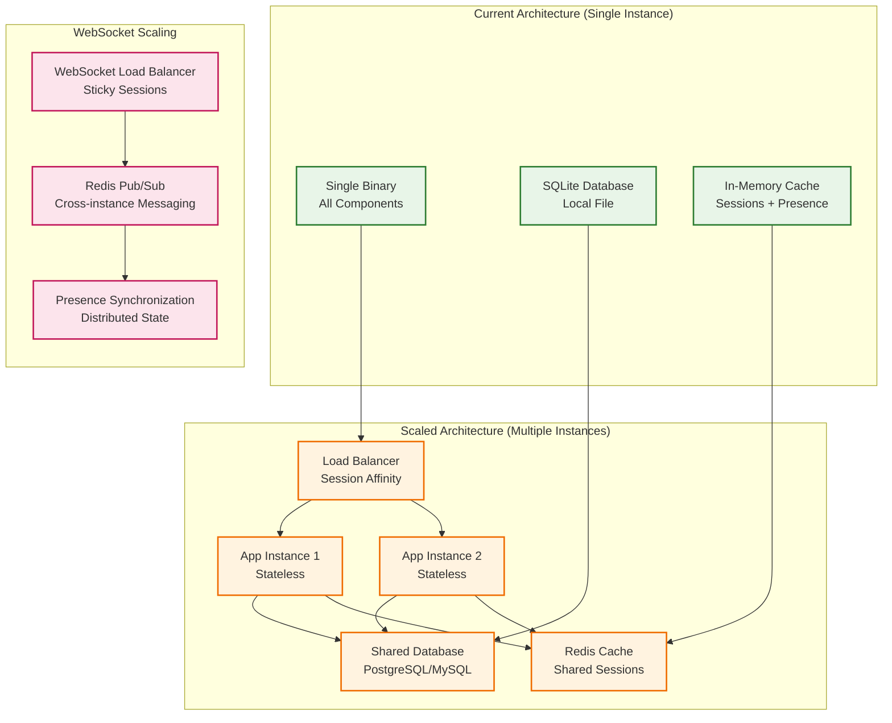
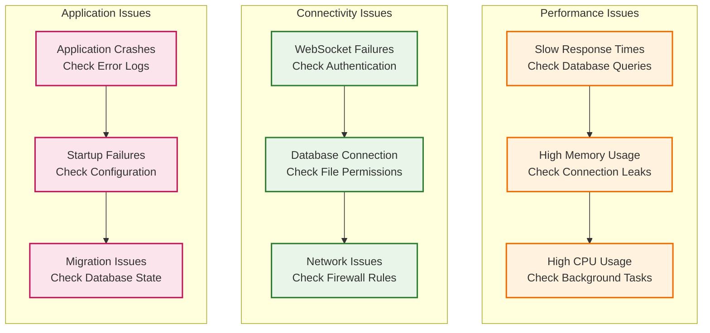

# Deployment Guide

## Deployment Overview

This guide covers deployment strategies for the Campfire Rust rewrite, from local development to production environments.

## Deployment Options



## Local Development Setup

### Quick Start

```bash
# Clone repository
git clone <repository-url>
cd campfire-rust-rewrite

# Build and run
cargo build
cargo run

# Access application
open http://localhost:3000
```

### Development Workflow



### Development Dependencies

```bash
# Install development tools
cargo install cargo-watch
cargo install cargo-audit
cargo install cargo-outdated

# Run with hot reload
cargo watch -x run

# Security audit
cargo audit

# Check for outdated dependencies
cargo outdated
```

## Docker Deployment

### Single Container Deployment



### Docker Commands

```bash
# Build image
docker build -t campfire-rust .

# Run container
docker run -d \
  --name campfire \
  -p 3000:3000 \
  -v $(pwd)/data:/app/data \
  -e RUST_LOG=info \
  campfire-rust

# View logs
docker logs -f campfire

# Stop container
docker stop campfire
```

### Docker Compose Setup

```yaml
# docker-compose.yml
version: '3.8'

services:
  campfire:
    build: .
    ports:
      - "3000:3000"
    volumes:
      - ./data:/app/data
      - ./logs:/app/logs
    environment:
      - RUST_LOG=info
      - DATABASE_URL=sqlite:/app/data/campfire.db
    restart: unless-stopped
    healthcheck:
      test: ["CMD", "curl", "-f", "http://localhost:3000/health"]
      interval: 30s
      timeout: 10s
      retries: 3

  # Optional: Reverse proxy
  nginx:
    image: nginx:alpine
    ports:
      - "80:80"
      - "443:443"
    volumes:
      - ./nginx.conf:/etc/nginx/nginx.conf
      - ./ssl:/etc/nginx/ssl
    depends_on:
      - campfire
    restart: unless-stopped
```

## Production Deployment

### Cloud Deployment Architecture



### Environment Configuration

```bash
# Production environment variables
export RUST_LOG=info
export DATABASE_URL=sqlite:/app/data/campfire.db
export BIND_ADDRESS=0.0.0.0:3000
export SESSION_SECRET=<secure-random-key>
export VAPID_PRIVATE_KEY=<vapid-private-key>
export VAPID_PUBLIC_KEY=<vapid-public-key>
export WEBHOOK_SECRET=<webhook-secret>
export MAX_CONNECTIONS=1000
export RATE_LIMIT_REQUESTS=100
export RATE_LIMIT_WINDOW=60
```

### Systemd Service (Bare Metal)

```ini
# /etc/systemd/system/campfire.service
[Unit]
Description=Campfire Rust Chat Application
After=network.target

[Service]
Type=simple
User=campfire
Group=campfire
WorkingDirectory=/opt/campfire
ExecStart=/opt/campfire/campfire-rust
Restart=always
RestartSec=5
Environment=RUST_LOG=info
Environment=DATABASE_URL=sqlite:/opt/campfire/data/campfire.db
Environment=BIND_ADDRESS=127.0.0.1:3000

# Security settings
NoNewPrivileges=true
PrivateTmp=true
ProtectSystem=strict
ProtectHome=true
ReadWritePaths=/opt/campfire/data /opt/campfire/logs

[Install]
WantedBy=multi-user.target
```

### Deployment Process



## Database Management

### SQLite in Production



### Migration Management

```bash
# Run database migrations
cargo run --bin migrate

# Create new migration
cargo run --bin migrate -- create add_user_preferences

# Check migration status
cargo run --bin migrate -- status

# Rollback migration (if supported)
cargo run --bin migrate -- rollback
```

## Monitoring and Observability

### Monitoring Stack



### Key Metrics to Monitor

```bash
# Application metrics
campfire_http_requests_total
campfire_websocket_connections_active
campfire_messages_sent_total
campfire_database_query_duration_seconds
campfire_memory_usage_bytes

# System metrics
cpu_usage_percent
memory_usage_percent
disk_usage_percent
network_connections_active

# Business metrics
active_users_count
messages_per_minute
rooms_active_count
search_queries_per_minute
```

## Security Considerations

### Production Security Checklist



## Scaling Considerations

### Horizontal Scaling Strategy



## Troubleshooting

### Common Issues and Solutions



### Diagnostic Commands

```bash
# Check application health
curl http://localhost:3000/health

# View application logs
docker logs -f campfire

# Check database integrity
sqlite3 campfire.db "PRAGMA integrity_check;"

# Monitor resource usage
docker stats campfire

# Check WebSocket connections
ss -tuln | grep 3000

# View system metrics
curl http://localhost:3000/metrics
```

This deployment guide provides comprehensive coverage of deployment strategies, from local development to production environments, with proper monitoring and security considerations.