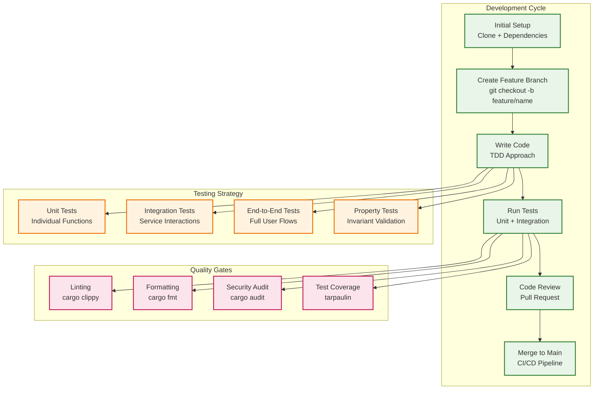
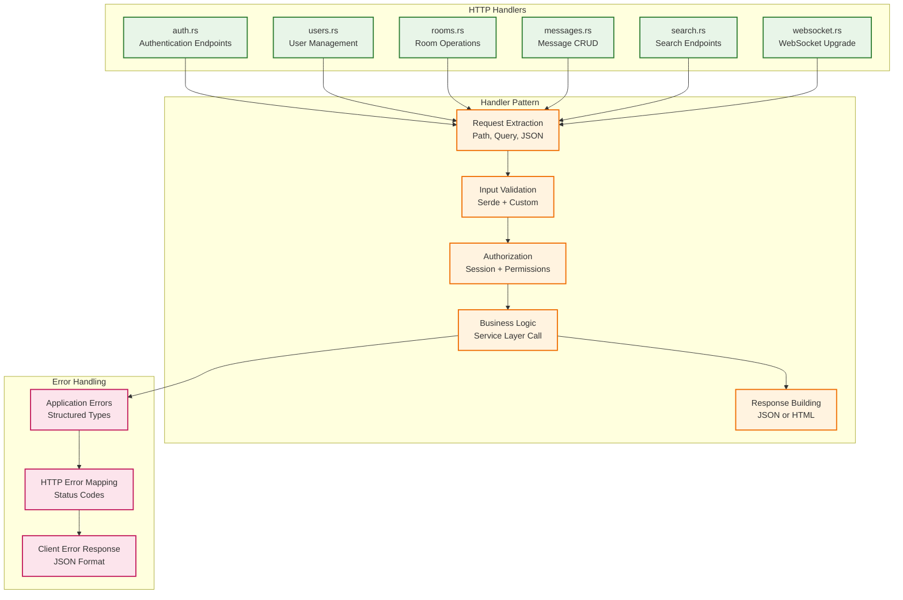
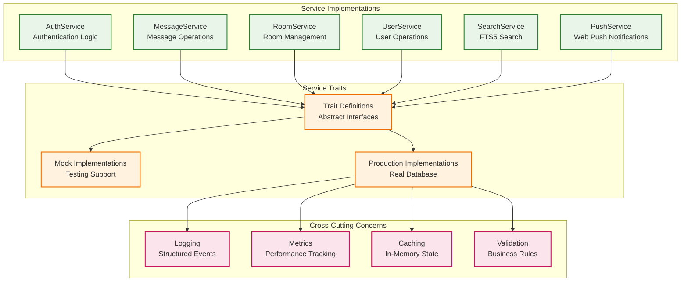
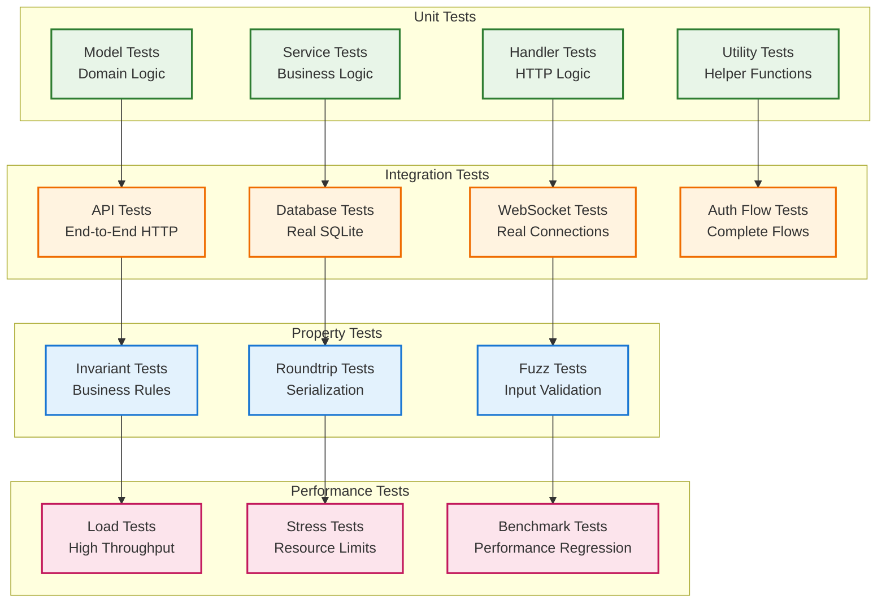
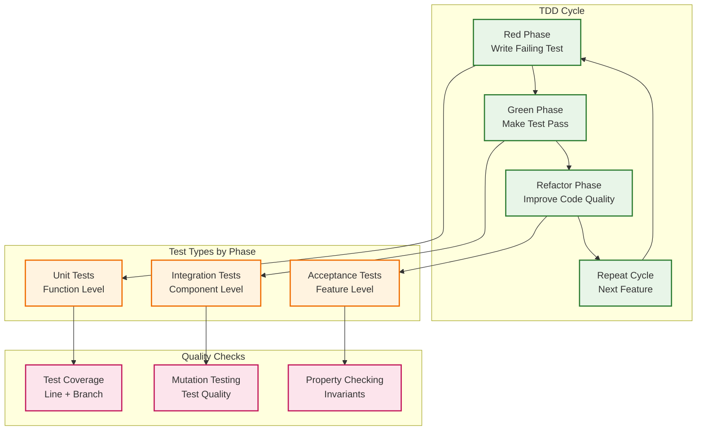
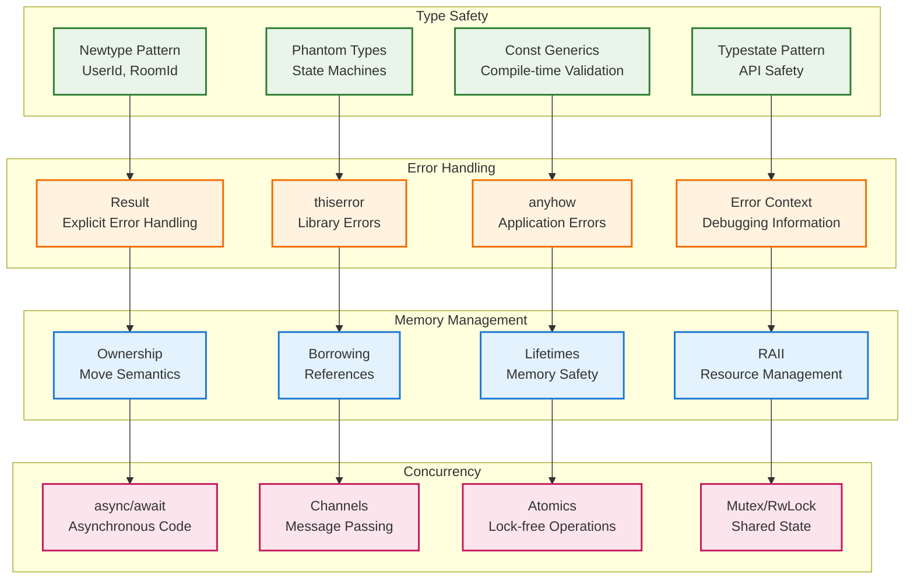
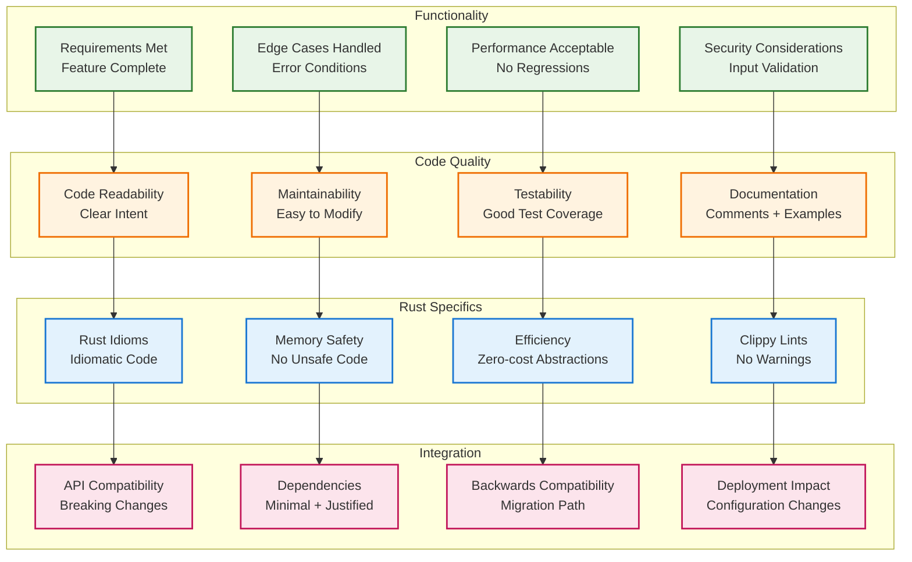
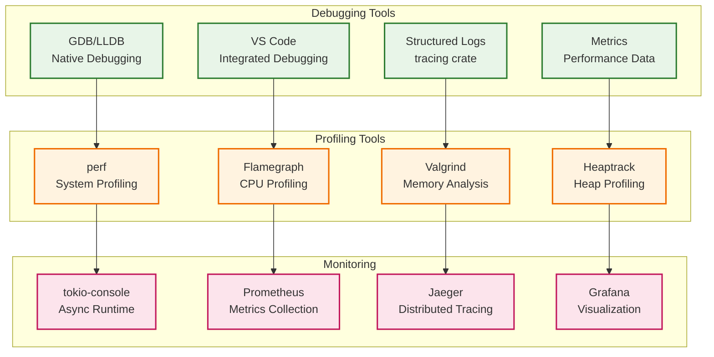
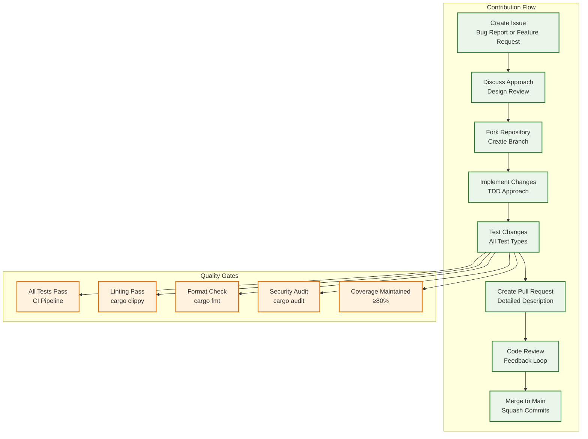

# Development Guide

## Development Overview

This guide covers the development workflow, testing strategies, and contribution guidelines for the Campfire Rust rewrite project.

## Development Workflow



## Project Structure Deep Dive

### Source Code Organization

```mermaid
graph TD
    subgraph "src/ Directory Structure"
        direction TB
        MAIN[main.rs<br/>Application Entry Point]
        LIB[lib.rs<br/>Library Root]
        CONFIG[config.rs<br/>Configuration Management]
        ERRORS[errors.rs<br/>Error Definitions]
    end
    
    subgraph "Core Modules"
        direction TB
        HANDLERS[handlers/<br/>HTTP Request Handlers]
        SERVICES[services/<br/>Business Logic]
        MODELS[models/<br/>Domain Models]
        MIDDLEWARE[middleware/<br/>Request Processing]
        DATABASE[database/<br/>Data Access]
    end
    
    subgraph "Supporting Modules"
        direction TB
        ASSETS[assets.rs<br/>Static Asset Serving]
        HEALTH[health.rs<br/>Health Checks]
        LOGGING[logging.rs<br/>Structured Logging]
        METRICS[metrics.rs<br/>Prometheus Metrics]
        SHUTDOWN[shutdown.rs<br/>Graceful Shutdown]
    end
    
    MAIN --> LIB
    LIB --> CONFIG
    LIB --> ERRORS
    
    LIB --> HANDLERS
    LIB --> SERVICES
    LIB --> MODELS
    LIB --> MIDDLEWARE
    LIB --> DATABASE
    
    LIB --> ASSETS
    LIB --> HEALTH
    LIB --> LOGGING
    LIB --> METRICS
    LIB --> SHUTDOWN
    
    classDef core fill:#e8f5e8,stroke:#2e7d32,stroke-width:2px
    classDef modules fill:#fff3e0,stroke:#ef6c00,stroke-width:2px
    classDef support fill:#fce4ec,stroke:#c2185b,stroke-width:2px
    
    class MAIN,LIB,CONFIG,ERRORS core
    class HANDLERS,SERVICES,MODELS,MIDDLEWARE,DATABASE modules
    class ASSETS,HEALTH,LOGGING,METRICS,SHUTDOWN support
```



### Handler Architecture



### Service Layer Architecture



## Testing Strategy

### Test Organization



### Test-Driven Development Flow



### Testing Commands

```bash
# Run all tests
cargo test

# Run specific test module
cargo test --test integration_test

# Run tests with output
cargo test -- --nocapture

# Run property tests
cargo test --features proptest

# Generate test coverage
cargo tarpaulin --out html

# Run benchmarks
cargo bench

# Mutation testing
cargo mutants

# Security audit
cargo audit
```

## Code Quality Standards

### Rust Idioms and Patterns



### Code Review Checklist



## Development Tools

### Essential Tools Setup

```bash
# Install Rust toolchain
curl --proto '=https' --tlsv1.2 -sSf https://sh.rustup.rs | sh

# Install development tools
cargo install cargo-watch      # Hot reload
cargo install cargo-audit      # Security audit
cargo install cargo-outdated   # Dependency updates
cargo install cargo-tarpaulin  # Code coverage
cargo install cargo-mutants    # Mutation testing
cargo install cargo-expand     # Macro expansion
cargo install cargo-bloat      # Binary size analysis

# Install IDE extensions (VS Code)
# - rust-analyzer
# - CodeLLDB (debugging)
# - Better TOML
# - Error Lens
```

### Development Workflow Commands

```bash
# Development server with hot reload
cargo watch -x run

# Run tests continuously
cargo watch -x test

# Format code
cargo fmt

# Lint code
cargo clippy -- -D warnings

# Check without building
cargo check

# Build optimized binary
cargo build --release

# Run specific test
cargo test test_message_creation

# Run integration tests
cargo test --test integration_test

# Generate documentation
cargo doc --open

# Analyze dependencies
cargo tree
```

## Debugging and Profiling

### Debugging Setup



### Performance Profiling

```bash
# CPU profiling with flamegraph
cargo install flamegraph
cargo flamegraph --bin campfire-rust

# Memory profiling with valgrind
valgrind --tool=massif target/debug/campfire-rust

# Async runtime monitoring
cargo install tokio-console
RUSTFLAGS="--cfg tokio_unstable" cargo run

# Benchmark specific functions
cargo bench --bench message_processing

# Profile binary size
cargo bloat --release
```

## Contributing Guidelines

### Contribution Process



### Commit Message Format

```
type(scope): brief description

Detailed explanation of the change, including:
- What was changed and why
- Any breaking changes
- References to issues

Examples:
feat(auth): add session token validation
fix(websocket): handle connection cleanup properly
docs(api): update search endpoint documentation
test(message): add property tests for deduplication
refactor(service): extract common validation logic
```

### Branch Naming Convention

```
feature/short-description    # New features
bugfix/issue-description     # Bug fixes
hotfix/critical-issue        # Critical production fixes
docs/documentation-update    # Documentation changes
refactor/code-improvement    # Code refactoring
test/test-improvements       # Test additions/improvements
```

## Environment Setup

### Local Development Environment

```bash
# Clone repository
git clone <repository-url>
cd campfire-rust-rewrite

# Set up environment
cp .env.example .env
# Edit .env with local configuration

# Install dependencies
cargo build

# Set up database
cargo run --bin migrate

# Run tests
cargo test

# Start development server
cargo run

# Or with hot reload
cargo watch -x run
```

### IDE Configuration

#### VS Code Settings

```json
{
  "rust-analyzer.cargo.features": "all",
  "rust-analyzer.checkOnSave.command": "clippy",
  "rust-analyzer.checkOnSave.extraArgs": ["--", "-D", "warnings"],
  "editor.formatOnSave": true,
  "editor.rulers": [100],
  "files.trimTrailingWhitespace": true,
  "files.insertFinalNewline": true
}
```

#### Debugging Configuration

```json
{
  "version": "0.2.0",
  "configurations": [
    {
      "type": "lldb",
      "request": "launch",
      "name": "Debug Campfire",
      "cargo": {
        "args": ["build", "--bin=campfire-rust"],
        "filter": {
          "name": "campfire-rust",
          "kind": "bin"
        }
      },
      "args": [],
      "cwd": "${workspaceFolder}",
      "env": {
        "RUST_LOG": "debug"
      }
    }
  ]
}
```

This development guide provides comprehensive coverage of the development workflow, testing strategies, code quality standards, and contribution guidelines for the Campfire Rust rewrite project.