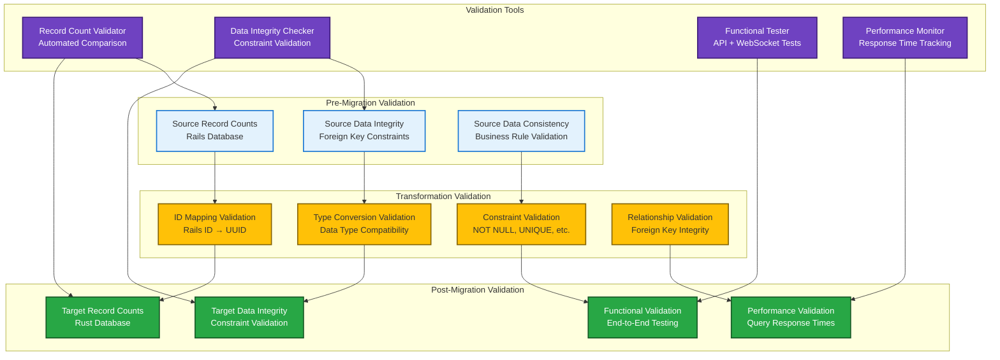
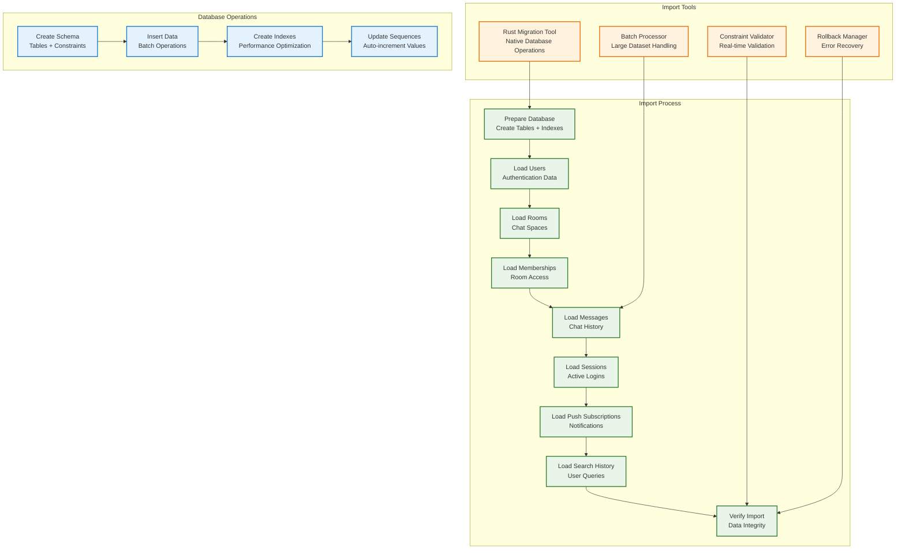
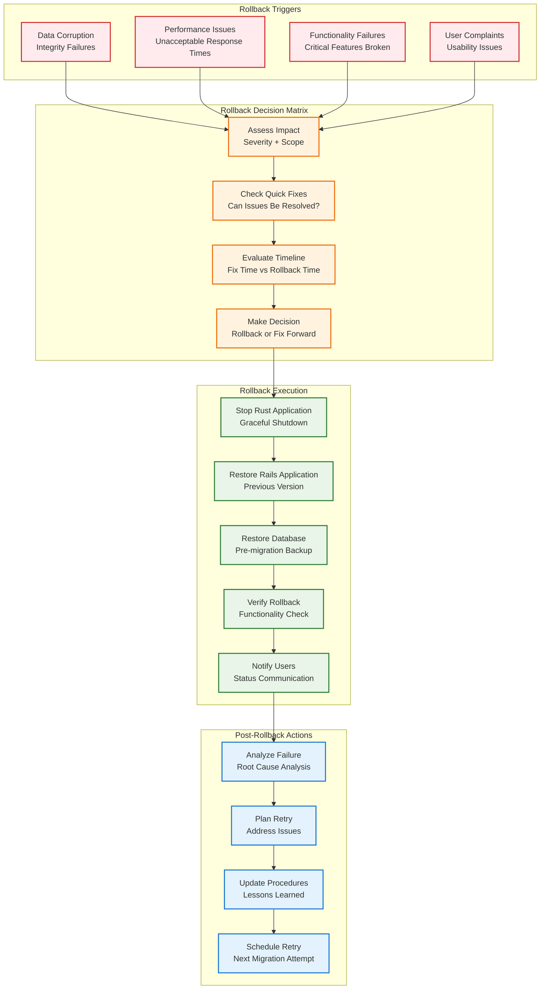

# Rails to Rust Migration Guide

## IMPORTANT FOR VISUALS AND DIAGRAMS

ALL DIAGRAMS WILL BE IN MERMAID ONLY TO ENSURE EASE WITH GITHUB - DO NOT SKIP THAT

## Overview

This comprehensive guide covers migrating from the original Rails Campfire application to the Rust implementation. The migration process preserves all data integrity while providing significant performance improvements and simplified deployment.

**Migration Philosophy:**
- **Zero Data Loss**: Complete preservation of all messages, users, rooms, and relationships
- **Minimal Downtime**: Streamlined migration process with rollback capabilities
- **Data Integrity**: Comprehensive validation and verification at every step
- **Performance Gains**: Immediate benefits from Rust's efficiency and memory safety
- **Simplified Operations**: Single binary deployment with embedded assets

## Quick Migration (30-Minute Process)

```bash
# 1. Export Rails data
./scripts/export-rails-data.sh

# 2. Transform and validate
./scripts/transform-data.sh --validate

# 3. Import to Rust
./scripts/import-to-rust.sh --verify

# 4. Switch traffic
./scripts/switch-to-rust.sh
```

## Migration Architecture Overview

```mermaid
graph TD
    subgraph "Rails Campfire (Source)"
        RAILS_APP[Rails Application<br/>Puma + ActionCable]
        RAILS_DB[(PostgreSQL/SQLite<br/>Source Database)]
        RAILS_REDIS[(Redis<br/>ActionCable + Sessions)]
        RAILS_FILES[Active Storage<br/>File Attachments]
    end
    
    subgraph "Migration Pipeline"
        EXPORT[Data Export<br/>JSON + SQL Dumps]
        TRANSFORM[Data Transformation<br/>Schema Mapping]
        VALIDATE[Data Validation<br/>Integrity Checks]
        IMPORT[Data Import<br/>Rust Database]
    end
    
    subgraph "Rust Campfire (Target)"
        RUST_APP[Rust Application<br/>Axum + WebSockets]
        RUST_DB[(SQLite Database<br/>Target Database)]
        RUST_ASSETS[Embedded Assets<br/>Compile-time Inclusion]
    end
    
    subgraph "Migration Tools"
        EXPORT_SCRIPT[export-rails-data.sh<br/>Rails Data Extraction]
        TRANSFORM_SCRIPT[transform-data.sh<br/>Schema Conversion]
        IMPORT_SCRIPT[import-to-rust.sh<br/>Rust Data Loading]
        VERIFY_SCRIPT[verify-migration.sh<br/>Data Integrity Checks]
    end
    
    RAILS_APP --> EXPORT
    RAILS_DB --> EXPORT
    RAILS_REDIS --> EXPORT
    RAILS_FILES --> EXPORT
    
    EXPORT --> TRANSFORM
    TRANSFORM --> VALIDATE
    VALIDATE --> IMPORT
    
    IMPORT --> RUST_APP
    IMPORT --> RUST_DB
    IMPORT --> RUST_ASSETS
    
    EXPORT_SCRIPT --> EXPORT
    TRANSFORM_SCRIPT --> TRANSFORM
    IMPORT_SCRIPT --> IMPORT
    VERIFY_SCRIPT --> VALIDATE
    
    classDef rails fill:#dc3545,stroke:#721c24,stroke-width:2px,color:#fff
    classDef pipeline fill:#ffc107,stroke:#856404,stroke-width:2px
    classDef rust fill:#28a745,stroke:#155724,stroke-width:2px,color:#fff
    classDef tools fill:#6f42c1,stroke:#3d1a78,stroke-width:2px,color:#fff
    
    class RAILS_APP,RAILS_DB,RAILS_REDIS,RAILS_FILES rails
    class EXPORT,TRANSFORM,VALIDATE,IMPORT pipeline
    class RUST_APP,RUST_DB,RUST_ASSETS rust
    class EXPORT_SCRIPT,TRANSFORM_SCRIPT,IMPORT_SCRIPT,VERIFY_SCRIPT tools
```## Data E
xport Procedures

### Rails Data Export Strategy

The migration process extracts data from Rails using a combination of Rails console commands, database dumps, and API exports to ensure complete data capture.

```mermaid
graph TD
    subgraph "Rails Data Sources"
        USERS[Users Table<br/>Authentication + Profiles]
        ROOMS[Rooms Table<br/>Open/Closed/Direct]
        MESSAGES[Messages Table<br/>Content + Metadata]
        MEMBERSHIPS[Memberships Table<br/>Room Access]
        SESSIONS[Sessions Table<br/>Authentication]
        BOOSTS[Boosts Table<br/>Message Reactions]
        SEARCHES[Searches Table<br/>Search History]
        WEBHOOKS[Webhooks Table<br/>Bot Integration]
        PUSH_SUBS[Push Subscriptions<br/>Notifications]
        ATTACHMENTS[Active Storage<br/>File Attachments]
    end
    
    subgraph "Export Methods"
        RAILS_CONSOLE[Rails Console<br/>Ruby Export Scripts]
        DB_DUMP[Database Dump<br/>SQL Export]
        API_EXPORT[API Export<br/>JSON Format]
        FILE_EXPORT[File Export<br/>Active Storage]
    end
    
    subgraph "Export Formats"
        JSON_EXPORT[JSON Files<br/>Structured Data]
        SQL_EXPORT[SQL Dumps<br/>Raw Database]
        CSV_EXPORT[CSV Files<br/>Tabular Data]
        BINARY_EXPORT[Binary Files<br/>Attachments]
    end
    
    USERS --> RAILS_CONSOLE
    ROOMS --> RAILS_CONSOLE
    MESSAGES --> DB_DUMP
    MEMBERSHIPS --> RAILS_CONSOLE
    SESSIONS --> API_EXPORT
    BOOSTS --> RAILS_CONSOLE
    SEARCHES --> RAILS_CONSOLE
    WEBHOOKS --> RAILS_CONSOLE
    PUSH_SUBS --> RAILS_CONSOLE
    ATTACHMENTS --> FILE_EXPORT
    
    RAILS_CONSOLE --> JSON_EXPORT
    DB_DUMP --> SQL_EXPORT
    API_EXPORT --> JSON_EXPORT
    FILE_EXPORT --> BINARY_EXPORT
    
    classDef sources fill:#e3f2fd,stroke:#1976d2,stroke-width:2px
    classDef methods fill:#e8f5e8,stroke:#2e7d32,stroke-width:2px
    classDef formats fill:#fff3e0,stroke:#ef6c00,stroke-width:2px
    
    class USERS,ROOMS,MESSAGES,MEMBERSHIPS,SESSIONS,BOOSTS,SEARCHES,WEBHOOKS,PUSH_SUBS,ATTACHMENTS sources
    class RAILS_CONSOLE,DB_DUMP,API_EXPORT,FILE_EXPORT methods
    class JSON_EXPORT,SQL_EXPORT,CSV_EXPORT,BINARY_EXPORT formats
```

### Export Script: `scripts/export-rails-data.sh`

Create the Rails data export script:

```bash
#!/bin/bash
set -e

# Rails to Rust Migration - Data Export Script
# This script exports all data from Rails Campfire for migration to Rust

EXPORT_DIR="migration_data/$(date +%Y%m%d_%H%M%S)"
RAILS_ROOT="${RAILS_ROOT:-/path/to/rails/campfire}"

echo "🚀 Starting Rails Campfire data export..."
echo "📁 Export directory: $EXPORT_DIR"

# Create export directory
mkdir -p "$EXPORT_DIR"/{json,sql,files,logs}

# Set Rails environment
export RAILS_ENV="${RAILS_ENV:-production}"

cd "$RAILS_ROOT"

# 1. Export Users
echo "👥 Exporting users..."
rails runner "
users = User.includes(:sessions, :push_subscriptions, :webhooks).map do |user|
  {
    id: user.id,
    name: user.name,
    email_address: user.email_address,
    password_digest: user.password_digest,
    role: user.role,
    active: user.active,
    bio: user.bio,
    bot_token: user.bot_token,
    created_at: user.created_at.iso8601,
    updated_at: user.updated_at.iso8601,
    sessions: user.sessions.map { |s| 
      {
        id: s.id,
        token: s.token,
        ip_address: s.ip_address,
        user_agent: s.user_agent,
        last_active_at: s.last_active_at.iso8601,
        created_at: s.created_at.iso8601
      }
    },
    push_subscriptions: user.push_subscriptions.map { |ps|
      {
        id: ps.id,
        endpoint: ps.endpoint,
        p256dh_key: ps.p256dh_key,
        auth_key: ps.auth_key,
        user_agent: ps.user_agent,
        created_at: ps.created_at.iso8601
      }
    },
    webhooks: user.webhooks.map { |w|
      {
        id: w.id,
        url: w.url,
        created_at: w.created_at.iso8601
      }
    }
  }
end
File.write('$EXPORT_DIR/json/users.json', JSON.pretty_generate(users))
puts \"Exported #{users.count} users\"
" 2>&1 | tee "$EXPORT_DIR/logs/users_export.log"

# 2. Export Rooms
echo "🏠 Exporting rooms..."
rails runner "
rooms = Room.includes(:creator, :memberships).map do |room|
  {
    id: room.id,
    name: room.name,
    type: room.type,
    creator_id: room.creator_id,
    created_at: room.created_at.iso8601,
    updated_at: room.updated_at.iso8601,
    memberships: room.memberships.map { |m|
      {
        id: m.id,
        user_id: m.user_id,
        involvement: m.involvement,
        unread_at: m.unread_at&.iso8601,
        connections: m.connections,
        connected_at: m.connected_at&.iso8601,
        created_at: m.created_at.iso8601
      }
    }
  }
end
File.write('$EXPORT_DIR/json/rooms.json', JSON.pretty_generate(rooms))
puts \"Exported #{rooms.count} rooms\"
" 2>&1 | tee "$EXPORT_DIR/logs/rooms_export.log"# 
3. Export Messages (with pagination for large datasets)
echo "💬 Exporting messages..."
rails runner "
batch_size = 1000
total_messages = Message.count
batches = (total_messages / batch_size.to_f).ceil

puts \"Exporting #{total_messages} messages in #{batches} batches...\"

all_messages = []
Message.includes(:creator, :room, :boosts, rich_text_body: :record).find_in_batches(batch_size: batch_size).with_index do |batch, index|
  puts \"Processing batch #{index + 1}/#{batches}...\"
  
  batch_messages = batch.map do |message|
    {
      id: message.id,
      room_id: message.room_id,
      creator_id: message.creator_id,
      client_message_id: message.client_message_id,
      body: message.body.to_s,
      plain_text_body: message.plain_text_body,
      content_type: message.content_type,
      created_at: message.created_at.iso8601,
      updated_at: message.updated_at.iso8601,
      boosts: message.boosts.map { |b|
        {
          id: b.id,
          booster_id: b.booster_id,
          content: b.content,
          created_at: b.created_at.iso8601
        }
      }
    }
  end
  
  all_messages.concat(batch_messages)
end

File.write('$EXPORT_DIR/json/messages.json', JSON.pretty_generate(all_messages))
puts \"Exported #{all_messages.count} messages\"
" 2>&1 | tee "$EXPORT_DIR/logs/messages_export.log"

# 4. Export Search History
echo "🔍 Exporting search history..."
rails runner "
searches = Search.includes(:user).map do |search|
  {
    id: search.id,
    user_id: search.user_id,
    query: search.query,
    created_at: search.created_at.iso8601
  }
end
File.write('$EXPORT_DIR/json/searches.json', JSON.pretty_generate(searches))
puts \"Exported #{searches.count} searches\"
" 2>&1 | tee "$EXPORT_DIR/logs/searches_export.log"

# 5. Database Schema Export
echo "🗄️ Exporting database schema..."
if [ "$RAILS_ENV" = "production" ]; then
  # PostgreSQL export
  pg_dump --schema-only --no-owner --no-privileges "$DATABASE_URL" > "$EXPORT_DIR/sql/schema.sql"
  pg_dump --data-only --no-owner --no-privileges "$DATABASE_URL" > "$EXPORT_DIR/sql/data.sql"
else
  # SQLite export
  sqlite3 db/development.sqlite3 .schema > "$EXPORT_DIR/sql/schema.sql"
  sqlite3 db/development.sqlite3 .dump > "$EXPORT_DIR/sql/data.sql"
fi

# 6. Export Active Storage Files (if present)
echo "📎 Exporting file attachments..."
if [ -d "storage" ]; then
  cp -r storage "$EXPORT_DIR/files/"
  echo "Copied Active Storage files"
else
  echo "No Active Storage files found"
fi

# 7. Export Configuration
echo "⚙️ Exporting configuration..."
rails runner "
config = {
  rails_version: Rails.version,
  ruby_version: RUBY_VERSION,
  database_adapter: ActiveRecord::Base.connection.adapter_name,
  export_timestamp: Time.current.iso8601,
  total_users: User.count,
  total_rooms: Room.count,
  total_messages: Message.count,
  total_memberships: Membership.count,
  total_sessions: Session.count
}
File.write('$EXPORT_DIR/json/export_metadata.json', JSON.pretty_generate(config))
puts \"Export metadata saved\"
" 2>&1 | tee "$EXPORT_DIR/logs/metadata_export.log"

# 8. Create export summary
echo "📊 Creating export summary..."
cat > "$EXPORT_DIR/EXPORT_SUMMARY.md" << EOF
# Rails Campfire Data Export Summary

**Export Date:** $(date)
**Export Directory:** $EXPORT_DIR
**Rails Environment:** $RAILS_ENV

## Exported Data

- **Users:** $(wc -l < "$EXPORT_DIR/json/users.json" || echo "0") records
- **Rooms:** $(wc -l < "$EXPORT_DIR/json/rooms.json" || echo "0") records  
- **Messages:** $(wc -l < "$EXPORT_DIR/json/messages.json" || echo "0") records
- **Searches:** $(wc -l < "$EXPORT_DIR/json/searches.json" || echo "0") records

## Files Structure

\`\`\`
$EXPORT_DIR/
├── json/           # Structured data exports
│   ├── users.json
│   ├── rooms.json
│   ├── messages.json
│   ├── searches.json
│   └── export_metadata.json
├── sql/            # Database dumps
│   ├── schema.sql
│   └── data.sql
├── files/          # File attachments
│   └── storage/
└── logs/           # Export logs
    ├── users_export.log
    ├── rooms_export.log
    ├── messages_export.log
    └── searches_export.log
\`\`\`

## Next Steps

1. Run data transformation: \`./scripts/transform-data.sh $EXPORT_DIR\`
2. Validate transformed data: \`./scripts/validate-migration.sh\`
3. Import to Rust: \`./scripts/import-to-rust.sh\`
EOF

echo "✅ Rails data export completed successfully!"
echo "📁 Export location: $EXPORT_DIR"
echo "📋 Summary: $EXPORT_DIR/EXPORT_SUMMARY.md"
```

### Export Verification

After export, verify data integrity:

```bash
# Verify JSON files are valid
for json_file in "$EXPORT_DIR"/json/*.json; do
  echo "Validating $json_file..."
  python3 -m json.tool "$json_file" > /dev/null && echo "✅ Valid" || echo "❌ Invalid"
done

# Check record counts
echo "📊 Export Statistics:"
echo "Users: $(jq length "$EXPORT_DIR/json/users.json")"
echo "Rooms: $(jq length "$EXPORT_DIR/json/rooms.json")"  
echo "Messages: $(jq length "$EXPORT_DIR/json/messages.json")"
echo "Searches: $(jq length "$EXPORT_DIR/json/searches.json")"
```#
# Data Transformation Scripts

### Schema Mapping and Conversion

The transformation process converts Rails ActiveRecord data structures to Rust-compatible formats while preserving all relationships and constraints.

```mermaid
graph TD
    subgraph "Rails Schema (Source)"
        RAILS_USERS[users<br/>- id: integer<br/>- name: varchar<br/>- email_address: varchar<br/>- password_digest: varchar<br/>- role: integer<br/>- active: boolean<br/>- bio: text<br/>- bot_token: varchar]
        
        RAILS_ROOMS[rooms<br/>- id: integer<br/>- name: varchar<br/>- type: varchar<br/>- creator_id: bigint]
        
        RAILS_MESSAGES[messages<br/>- id: integer<br/>- room_id: integer<br/>- creator_id: integer<br/>- client_message_id: varchar<br/>- created_at: datetime<br/>- updated_at: datetime]
        
        RAILS_MEMBERSHIPS[memberships<br/>- id: integer<br/>- room_id: integer<br/>- user_id: integer<br/>- involvement: varchar<br/>- unread_at: datetime<br/>- connections: integer<br/>- connected_at: datetime]
    end
    
    subgraph "Transformation Process"
        ID_CONVERT[ID Conversion<br/>Integer → UUID]
        TYPE_CONVERT[Type Conversion<br/>Rails Types → Rust Types]
        ENUM_CONVERT[Enum Conversion<br/>Strings → Rust Enums]
        DATETIME_CONVERT[DateTime Conversion<br/>Rails Time → UTC ISO8601]
        VALIDATION[Data Validation<br/>Constraints & Integrity]
    end
    
    subgraph "Rust Schema (Target)"
        RUST_USERS[users<br/>- id: TEXT (UUID)<br/>- name: TEXT NOT NULL<br/>- email: TEXT UNIQUE<br/>- password_hash: TEXT<br/>- admin: BOOLEAN<br/>- bio: TEXT<br/>- bot_token: TEXT UNIQUE]
        
        RUST_ROOMS[rooms<br/>- id: TEXT (UUID)<br/>- name: TEXT NOT NULL<br/>- topic: TEXT<br/>- room_type: TEXT<br/>- created_at: DATETIME<br/>- last_message_at: DATETIME]
        
        RUST_MESSAGES[messages<br/>- id: TEXT (UUID)<br/>- room_id: TEXT<br/>- creator_id: TEXT<br/>- content: TEXT NOT NULL<br/>- client_message_id: TEXT<br/>- created_at: DATETIME<br/>UNIQUE(client_message_id, room_id)]
        
        RUST_MEMBERSHIPS[room_memberships<br/>- room_id: TEXT<br/>- user_id: TEXT<br/>- involvement_level: TEXT<br/>- created_at: DATETIME<br/>PRIMARY KEY (room_id, user_id)]
    end
    
    RAILS_USERS --> ID_CONVERT
    RAILS_ROOMS --> TYPE_CONVERT
    RAILS_MESSAGES --> ENUM_CONVERT
    RAILS_MEMBERSHIPS --> DATETIME_CONVERT
    
    ID_CONVERT --> VALIDATION
    TYPE_CONVERT --> VALIDATION
    ENUM_CONVERT --> VALIDATION
    DATETIME_CONVERT --> VALIDATION
    
    VALIDATION --> RUST_USERS
    VALIDATION --> RUST_ROOMS
    VALIDATION --> RUST_MESSAGES
    VALIDATION --> RUST_MEMBERSHIPS
    
    classDef rails fill:#dc3545,stroke:#721c24,stroke-width:2px,color:#fff
    classDef transform fill:#ffc107,stroke:#856404,stroke-width:2px
    classDef rust fill:#28a745,stroke:#155724,stroke-width:2px,color:#fff
    
    class RAILS_USERS,RAILS_ROOMS,RAILS_MESSAGES,RAILS_MEMBERSHIPS rails
    class ID_CONVERT,TYPE_CONVERT,ENUM_CONVERT,DATETIME_CONVERT,VALIDATION transform
    class RUST_USERS,RUST_ROOMS,RUST_MESSAGES,RUST_MEMBERSHIPS rust
```

### Transformation Script: `scripts/transform-data.sh`

```bash
#!/bin/bash
set -e

# Rails to Rust Migration - Data Transformation Script
# Converts Rails data exports to Rust-compatible format

EXPORT_DIR="$1"
TRANSFORM_DIR="${EXPORT_DIR}/transformed"

if [ -z "$EXPORT_DIR" ]; then
  echo "Usage: $0 <export_directory>"
  exit 1
fi

if [ ! -d "$EXPORT_DIR" ]; then
  echo "Error: Export directory $EXPORT_DIR does not exist"
  exit 1
fi

echo "🔄 Starting data transformation..."
echo "📁 Source: $EXPORT_DIR"
echo "📁 Target: $TRANSFORM_DIR"

# Create transformation directory
mkdir -p "$TRANSFORM_DIR"/{json,sql,logs}

# Python transformation script
cat > "$TRANSFORM_DIR/transform.py" << 'EOF'
#!/usr/bin/env python3
import json
import uuid
import sys
from datetime import datetime
from typing import Dict, List, Any, Optional

class DataTransformer:
    def __init__(self):
        self.id_mapping = {}  # Rails ID -> UUID mapping
        self.stats = {
            'users_transformed': 0,
            'rooms_transformed': 0,
            'messages_transformed': 0,
            'memberships_transformed': 0,
            'errors': []
        }
    
    def generate_uuid_for_id(self, table: str, rails_id: int) -> str:
        """Generate consistent UUID for Rails integer ID"""
        key = f"{table}:{rails_id}"
        if key not in self.id_mapping:
            # Generate deterministic UUID based on table and ID
            namespace = uuid.UUID('6ba7b810-9dad-11d1-80b4-00c04fd430c8')
            self.id_mapping[key] = str(uuid.uuid5(namespace, key))
        return self.id_mapping[key]
    
    def convert_datetime(self, dt_str: Optional[str]) -> Optional[str]:
        """Convert Rails datetime to UTC ISO8601"""
        if not dt_str:
            return None
        try:
            # Parse Rails datetime and ensure UTC
            dt = datetime.fromisoformat(dt_str.replace('Z', '+00:00'))
            return dt.strftime('%Y-%m-%d %H:%M:%S UTC')
        except Exception as e:
            self.stats['errors'].append(f"DateTime conversion error: {e}")
            return None
    
    def transform_users(self, users_data: List[Dict]) -> List[Dict]:
        """Transform Rails users to Rust format"""
        transformed = []
        
        for user in users_data:
            try:
                rust_user = {
                    'id': self.generate_uuid_for_id('users', user['id']),
                    'name': user['name'],
                    'email': user.get('email_address'),
                    'password_hash': user.get('password_digest'),
                    'admin': user.get('role', 0) > 0,  # Convert role integer to boolean
                    'bio': user.get('bio'),
                    'bot_token': user.get('bot_token'),
                    'created_at': self.convert_datetime(user.get('created_at'))
                }
                
                # Transform sessions
                rust_user['sessions'] = []
                for session in user.get('sessions', []):
                    rust_session = {
                        'token': session['token'],
                        'user_id': rust_user['id'],
                        'created_at': self.convert_datetime(session.get('created_at')),
                        'expires_at': self.convert_datetime(session.get('last_active_at'))  # Use last_active as expiry
                    }
                    rust_user['sessions'].append(rust_session)
                
                # Transform push subscriptions
                rust_user['push_subscriptions'] = []
                for ps in user.get('push_subscriptions', []):
                    rust_ps = {
                        'user_id': rust_user['id'],
                        'endpoint': ps['endpoint'],
                        'p256dh_key': ps['p256dh_key'],
                        'auth_key': ps['auth_key'],
                        'user_agent': ps.get('user_agent'),
                        'created_at': self.convert_datetime(ps.get('created_at'))
                    }
                    rust_user['push_subscriptions'].append(rust_ps)
                
                # Transform webhooks
                rust_user['webhooks'] = []
                for webhook in user.get('webhooks', []):
                    rust_webhook = {
                        'user_id': rust_user['id'],
                        'url': webhook['url'],
                        'created_at': self.convert_datetime(webhook.get('created_at'))
                    }
                    rust_user['webhooks'].append(rust_webhook)
                
                transformed.append(rust_user)
                self.stats['users_transformed'] += 1
                
            except Exception as e:
                self.stats['errors'].append(f"User {user.get('id')} transformation error: {e}")
        
        return transformed
    
    def transform_rooms(self, rooms_data: List[Dict]) -> List[Dict]:
        """Transform Rails rooms to Rust format"""
        transformed = []
        
        for room in rooms_data:
            try:
                # Convert Rails room type to Rust enum
                room_type_mapping = {
                    'Rooms::Open': 'open',
                    'Rooms::Closed': 'closed', 
                    'Rooms::Direct': 'direct'
                }
                
                rust_room = {
                    'id': self.generate_uuid_for_id('rooms', room['id']),
                    'name': room.get('name', ''),
                    'topic': None,  # Rails doesn't have topic, set to null
                    'room_type': room_type_mapping.get(room.get('type'), 'open'),
                    'created_at': self.convert_datetime(room.get('created_at')),
                    'last_message_at': None  # Will be updated during message import
                }
                
                # Transform memberships
                rust_room['memberships'] = []
                for membership in room.get('memberships', []):
                    # Convert involvement to Rust enum
                    involvement_mapping = {
                        'mentions': 'member',
                        'everything': 'admin'
                    }
                    
                    rust_membership = {
                        'room_id': rust_room['id'],
                        'user_id': self.generate_uuid_for_id('users', membership['user_id']),
                        'involvement_level': involvement_mapping.get(membership.get('involvement'), 'member'),
                        'created_at': self.convert_datetime(membership.get('created_at'))
                    }
                    rust_room['memberships'].append(rust_membership)
                    self.stats['memberships_transformed'] += 1
                
                transformed.append(rust_room)
                self.stats['rooms_transformed'] += 1
                
            except Exception as e:
                self.stats['errors'].append(f"Room {room.get('id')} transformation error: {e}")
        
        return transformed
EOF

# Continue the Python script
cat >> "$TRANSFORM_DIR/transform.py" << 'EOF'
    def transform_messages(self, messages_data: List[Dict]) -> List[Dict]:
        """Transform Rails messages to Rust format"""
        transformed = []
        
        for message in messages_data:
            try:
                rust_message = {
                    'id': self.generate_uuid_for_id('messages', message['id']),
                    'room_id': self.generate_uuid_for_id('rooms', message['room_id']),
                    'creator_id': self.generate_uuid_for_id('users', message['creator_id']),
                    'content': message.get('plain_text_body', '') or message.get('body', ''),
                    'client_message_id': message.get('client_message_id', str(uuid.uuid4())),
                    'created_at': self.convert_datetime(message.get('created_at'))
                }
                
                # Transform boosts (reactions)
                rust_message['boosts'] = []
                for boost in message.get('boosts', []):
                    rust_boost = {
                        'message_id': rust_message['id'],
                        'user_id': self.generate_uuid_for_id('users', boost['booster_id']),
                        'content': boost['content'],
                        'created_at': self.convert_datetime(boost.get('created_at'))
                    }
                    rust_message['boosts'].append(rust_boost)
                
                transformed.append(rust_message)
                self.stats['messages_transformed'] += 1
                
            except Exception as e:
                self.stats['errors'].append(f"Message {message.get('id')} transformation error: {e}")
        
        return transformed
    
    def transform_searches(self, searches_data: List[Dict]) -> List[Dict]:
        """Transform Rails searches to Rust format"""
        transformed = []
        
        for search in searches_data:
            try:
                rust_search = {
                    'user_id': self.generate_uuid_for_id('users', search['user_id']),
                    'query': search['query'],
                    'created_at': self.convert_datetime(search.get('created_at'))
                }
                transformed.append(rust_search)
                
            except Exception as e:
                self.stats['errors'].append(f"Search {search.get('id')} transformation error: {e}")
        
        return transformed
    
    def save_id_mapping(self, output_dir: str):
        """Save ID mapping for reference"""
        with open(f"{output_dir}/id_mapping.json", 'w') as f:
            json.dump(self.id_mapping, f, indent=2)
    
    def print_stats(self):
        """Print transformation statistics"""
        print(f"✅ Transformation completed:")
        print(f"   Users: {self.stats['users_transformed']}")
        print(f"   Rooms: {self.stats['rooms_transformed']}")
        print(f"   Messages: {self.stats['messages_transformed']}")
        print(f"   Memberships: {self.stats['memberships_transformed']}")
        
        if self.stats['errors']:
            print(f"⚠️  Errors encountered: {len(self.stats['errors'])}")
            for error in self.stats['errors'][:5]:  # Show first 5 errors
                print(f"   - {error}")
            if len(self.stats['errors']) > 5:
                print(f"   ... and {len(self.stats['errors']) - 5} more")

def main():
    if len(sys.argv) != 3:
        print("Usage: transform.py <input_dir> <output_dir>")
        sys.exit(1)
    
    input_dir = sys.argv[1]
    output_dir = sys.argv[2]
    
    transformer = DataTransformer()
    
    # Load and transform users
    print("👥 Transforming users...")
    with open(f"{input_dir}/users.json", 'r') as f:
        users_data = json.load(f)
    transformed_users = transformer.transform_users(users_data)
    with open(f"{output_dir}/users.json", 'w') as f:
        json.dump(transformed_users, f, indent=2)
    
    # Load and transform rooms
    print("🏠 Transforming rooms...")
    with open(f"{input_dir}/rooms.json", 'r') as f:
        rooms_data = json.load(f)
    transformed_rooms = transformer.transform_rooms(rooms_data)
    with open(f"{output_dir}/rooms.json", 'w') as f:
        json.dump(transformed_rooms, f, indent=2)
    
    # Load and transform messages
    print("💬 Transforming messages...")
    with open(f"{input_dir}/messages.json", 'r') as f:
        messages_data = json.load(f)
    transformed_messages = transformer.transform_messages(messages_data)
    with open(f"{output_dir}/messages.json", 'w') as f:
        json.dump(transformed_messages, f, indent=2)
    
    # Load and transform searches
    print("🔍 Transforming searches...")
    with open(f"{input_dir}/searches.json", 'r') as f:
        searches_data = json.load(f)
    transformed_searches = transformer.transform_searches(searches_data)
    with open(f"{output_dir}/searches.json", 'w') as f:
        json.dump(transformed_searches, f, indent=2)
    
    # Save ID mapping and stats
    transformer.save_id_mapping(output_dir)
    transformer.print_stats()

if __name__ == "__main__":
    main()
EOF

# Make the script executable and run it
chmod +x "$TRANSFORM_DIR/transform.py"

echo "🐍 Running Python transformation script..."
python3 "$TRANSFORM_DIR/transform.py" "$EXPORT_DIR/json" "$TRANSFORM_DIR/json" 2>&1 | tee "$TRANSFORM_DIR/logs/transformation.log"

# Validate transformed data
echo "✅ Validating transformed data..."
for json_file in "$TRANSFORM_DIR"/json/*.json; do
  echo "Validating $(basename "$json_file")..."
  python3 -m json.tool "$json_file" > /dev/null && echo "  ✅ Valid JSON" || echo "  ❌ Invalid JSON"
done

echo "🔄 Data transformation completed!"
echo "📁 Transformed data: $TRANSFORM_DIR"
```## Dat
a Integrity Verification

### Verification Strategy

Comprehensive validation ensures data integrity throughout the migration process with automated checks and manual verification points.



### Verification Script: `scripts/verify-migration.sh`

```bash
#!/bin/bash
set -e

# Rails to Rust Migration - Data Verification Script
# Validates data integrity before, during, and after migration

EXPORT_DIR="$1"
RUST_DB_PATH="${2:-./campfire.db}"

if [ -z "$EXPORT_DIR" ]; then
  echo "Usage: $0 <export_directory> [rust_db_path]"
  exit 1
fi

TRANSFORM_DIR="${EXPORT_DIR}/transformed"
VERIFICATION_DIR="${EXPORT_DIR}/verification"

echo "🔍 Starting migration verification..."
echo "📁 Export directory: $EXPORT_DIR"
echo "🗄️ Rust database: $RUST_DB_PATH"

# Create verification directory
mkdir -p "$VERIFICATION_DIR"/{reports,logs}

# Python verification script
cat > "$VERIFICATION_DIR/verify.py" << 'EOF'
#!/usr/bin/env python3
import json
import sqlite3
import sys
from typing import Dict, List, Any
from datetime import datetime

class MigrationVerifier:
    def __init__(self, export_dir: str, rust_db_path: str):
        self.export_dir = export_dir
        self.rust_db_path = rust_db_path
        self.verification_results = {
            'record_counts': {},
            'data_integrity': {},
            'constraint_validation': {},
            'relationship_validation': {},
            'errors': [],
            'warnings': []
        }
    
    def load_json_data(self, filename: str) -> List[Dict]:
        """Load JSON data from transformed files"""
        try:
            with open(f"{self.export_dir}/transformed/json/{filename}", 'r') as f:
                return json.load(f)
        except Exception as e:
            self.verification_results['errors'].append(f"Failed to load {filename}: {e}")
            return []
    
    def get_rust_db_connection(self):
        """Get connection to Rust SQLite database"""
        try:
            return sqlite3.connect(self.rust_db_path)
        except Exception as e:
            self.verification_results['errors'].append(f"Failed to connect to Rust DB: {e}")
            return None
    
    def verify_record_counts(self):
        """Verify record counts match between source and target"""
        print("📊 Verifying record counts...")
        
        # Load transformed data counts
        users_data = self.load_json_data('users.json')
        rooms_data = self.load_json_data('rooms.json')
        messages_data = self.load_json_data('messages.json')
        searches_data = self.load_json_data('searches.json')
        
        source_counts = {
            'users': len(users_data),
            'rooms': len(rooms_data),
            'messages': len(messages_data),
            'searches': len(searches_data)
        }
        
        # Count memberships from rooms data
        membership_count = sum(len(room.get('memberships', [])) for room in rooms_data)
        source_counts['memberships'] = membership_count
        
        # Get target counts from Rust database
        conn = self.get_rust_db_connection()
        if not conn:
            return
        
        target_counts = {}
        try:
            cursor = conn.cursor()
            
            # Count records in Rust database
            tables = ['users', 'rooms', 'messages', 'room_memberships', 'searches']
            for table in tables:
                cursor.execute(f"SELECT COUNT(*) FROM {table}")
                count = cursor.fetchone()[0]
                target_counts[table] = count
            
            # Map room_memberships to memberships for comparison
            target_counts['memberships'] = target_counts.pop('room_memberships')
            
        except Exception as e:
            self.verification_results['errors'].append(f"Failed to count target records: {e}")
            return
        finally:
            conn.close()
        
        # Compare counts
        self.verification_results['record_counts'] = {
            'source': source_counts,
            'target': target_counts,
            'matches': {}
        }
        
        for table in source_counts:
            source_count = source_counts[table]
            target_count = target_counts.get(table, 0)
            matches = source_count == target_count
            
            self.verification_results['record_counts']['matches'][table] = matches
            
            if matches:
                print(f"  ✅ {table}: {source_count} records")
            else:
                print(f"  ❌ {table}: {source_count} source → {target_count} target")
                self.verification_results['errors'].append(
                    f"Record count mismatch for {table}: {source_count} → {target_count}"
                )
    
    def verify_data_integrity(self):
        """Verify data integrity constraints"""
        print("🔒 Verifying data integrity...")
        
        conn = self.get_rust_db_connection()
        if not conn:
            return
        
        try:
            cursor = conn.cursor()
            
            # Check for NULL values in NOT NULL columns
            null_checks = [
                ("users", "name", "User names cannot be NULL"),
                ("rooms", "name", "Room names cannot be NULL"),
                ("messages", "content", "Message content cannot be NULL"),
                ("messages", "room_id", "Message room_id cannot be NULL"),
                ("messages", "creator_id", "Message creator_id cannot be NULL")
            ]
            
            for table, column, description in null_checks:
                cursor.execute(f"SELECT COUNT(*) FROM {table} WHERE {column} IS NULL")
                null_count = cursor.fetchone()[0]
                
                if null_count > 0:
                    self.verification_results['errors'].append(f"{description}: {null_count} NULL values found")
                    print(f"  ❌ {description}: {null_count} NULL values")
                else:
                    print(f"  ✅ {description}: No NULL values")
            
            # Check UNIQUE constraints
            unique_checks = [
                ("users", "email", "User emails must be unique"),
                ("users", "bot_token", "Bot tokens must be unique"),
                ("messages", "client_message_id, room_id", "Client message IDs must be unique per room")
            ]
            
            for table, columns, description in unique_checks:
                cursor.execute(f"""
                    SELECT COUNT(*) FROM (
                        SELECT {columns}, COUNT(*) as cnt 
                        FROM {table} 
                        WHERE {columns.split(',')[0]} IS NOT NULL
                        GROUP BY {columns} 
                        HAVING cnt > 1
                    )
                """)
                duplicate_count = cursor.fetchone()[0]
                
                if duplicate_count > 0:
                    self.verification_results['errors'].append(f"{description}: {duplicate_count} duplicates found")
                    print(f"  ❌ {description}: {duplicate_count} duplicates")
                else:
                    print(f"  ✅ {description}: No duplicates")
            
        except Exception as e:
            self.verification_results['errors'].append(f"Data integrity check failed: {e}")
        finally:
            conn.close()
    
    def verify_relationships(self):
        """Verify foreign key relationships"""
        print("🔗 Verifying relationships...")
        
        conn = self.get_rust_db_connection()
        if not conn:
            return
        
        try:
            cursor = conn.cursor()
            
            # Check message → room relationships
            cursor.execute("""
                SELECT COUNT(*) FROM messages m 
                LEFT JOIN rooms r ON m.room_id = r.id 
                WHERE r.id IS NULL
            """)
            orphaned_messages = cursor.fetchone()[0]
            
            if orphaned_messages > 0:
                self.verification_results['errors'].append(f"Orphaned messages: {orphaned_messages}")
                print(f"  ❌ Orphaned messages: {orphaned_messages}")
            else:
                print(f"  ✅ All messages have valid rooms")
            
            # Check message → user relationships
            cursor.execute("""
                SELECT COUNT(*) FROM messages m 
                LEFT JOIN users u ON m.creator_id = u.id 
                WHERE u.id IS NULL
            """)
            orphaned_message_creators = cursor.fetchone()[0]
            
            if orphaned_message_creators > 0:
                self.verification_results['errors'].append(f"Messages with invalid creators: {orphaned_message_creators}")
                print(f"  ❌ Messages with invalid creators: {orphaned_message_creators}")
            else:
                print(f"  ✅ All messages have valid creators")
            
            # Check membership relationships
            cursor.execute("""
                SELECT COUNT(*) FROM room_memberships rm 
                LEFT JOIN rooms r ON rm.room_id = r.id 
                WHERE r.id IS NULL
            """)
            orphaned_room_memberships = cursor.fetchone()[0]
            
            cursor.execute("""
                SELECT COUNT(*) FROM room_memberships rm 
                LEFT JOIN users u ON rm.user_id = u.id 
                WHERE u.id IS NULL
            """)
            orphaned_user_memberships = cursor.fetchone()[0]
            
            if orphaned_room_memberships > 0:
                self.verification_results['errors'].append(f"Memberships with invalid rooms: {orphaned_room_memberships}")
                print(f"  ❌ Memberships with invalid rooms: {orphaned_room_memberships}")
            else:
                print(f"  ✅ All memberships have valid rooms")
            
            if orphaned_user_memberships > 0:
                self.verification_results['errors'].append(f"Memberships with invalid users: {orphaned_user_memberships}")
                print(f"  ❌ Memberships with invalid users: {orphaned_user_memberships}")
            else:
                print(f"  ✅ All memberships have valid users")
            
        except Exception as e:
            self.verification_results['errors'].append(f"Relationship verification failed: {e}")
        finally:
            conn.close()
    
    def generate_report(self, output_path: str):
        """Generate verification report"""
        report = {
            'verification_timestamp': datetime.now().isoformat(),
            'export_directory': self.export_dir,
            'rust_database': self.rust_db_path,
            'results': self.verification_results,
            'summary': {
                'total_errors': len(self.verification_results['errors']),
                'total_warnings': len(self.verification_results['warnings']),
                'verification_passed': len(self.verification_results['errors']) == 0
            }
        }
        
        with open(output_path, 'w') as f:
            json.dump(report, f, indent=2)
        
        return report['summary']['verification_passed']
    
    def print_summary(self):
        """Print verification summary"""
        errors = len(self.verification_results['errors'])
        warnings = len(self.verification_results['warnings'])
        
        if errors == 0:
            print(f"\n✅ Migration verification PASSED")
            print(f"   Warnings: {warnings}")
        else:
            print(f"\n❌ Migration verification FAILED")
            print(f"   Errors: {errors}")
            print(f"   Warnings: {warnings}")
            
            print(f"\n🚨 Errors:")
            for error in self.verification_results['errors'][:10]:  # Show first 10 errors
                print(f"   - {error}")
            if errors > 10:
                print(f"   ... and {errors - 10} more errors")

def main():
    if len(sys.argv) < 2:
        print("Usage: verify.py <export_directory> [rust_db_path]")
        sys.exit(1)
    
    export_dir = sys.argv[1]
    rust_db_path = sys.argv[2] if len(sys.argv) > 2 else "./campfire.db"
    
    verifier = MigrationVerifier(export_dir, rust_db_path)
    
    # Run verification steps
    verifier.verify_record_counts()
    verifier.verify_data_integrity()
    verifier.verify_relationships()
    
    # Generate report and print summary
    report_path = f"{export_dir}/verification/verification_report.json"
    verification_passed = verifier.generate_report(report_path)
    verifier.print_summary()
    
    print(f"\n📋 Detailed report: {report_path}")
    
    # Exit with appropriate code
    sys.exit(0 if verification_passed else 1)

if __name__ == "__main__":
    main()
EOF

# Make the script executable and run it
chmod +x "$VERIFICATION_DIR/verify.py"

echo "🐍 Running verification script..."
if python3 "$VERIFICATION_DIR/verify.py" "$EXPORT_DIR" "$RUST_DB_PATH" 2>&1 | tee "$VERIFICATION_DIR/logs/verification.log"; then
  echo "✅ Migration verification completed successfully!"
else
  echo "❌ Migration verification failed! Check the logs for details."
  exit 1
fi
```## Data 
Import to Rust

### Import Strategy

The import process loads transformed data into the Rust application's SQLite database with proper constraint validation and relationship integrity.



### Import Script: `scripts/import-to-rust.sh`

```bash
#!/bin/bash
set -e

# Rails to Rust Migration - Data Import Script
# Imports transformed data into Rust Campfire database

EXPORT_DIR="$1"
RUST_DB_PATH="${2:-./campfire.db}"
RUST_BINARY="${3:-./target/release/campfire-on-rust}"

if [ -z "$EXPORT_DIR" ]; then
  echo "Usage: $0 <export_directory> [rust_db_path] [rust_binary_path]"
  exit 1
fi

TRANSFORM_DIR="${EXPORT_DIR}/transformed"
IMPORT_DIR="${EXPORT_DIR}/import"

echo "📥 Starting data import to Rust..."
echo "📁 Source: $TRANSFORM_DIR"
echo "🗄️ Target database: $RUST_DB_PATH"

# Create import directory
mkdir -p "$IMPORT_DIR"/{logs,backups}

# Backup existing database if it exists
if [ -f "$RUST_DB_PATH" ]; then
  echo "💾 Backing up existing database..."
  cp "$RUST_DB_PATH" "$IMPORT_DIR/backups/campfire_backup_$(date +%Y%m%d_%H%M%S).db"
fi

# Rust import tool
cat > "$IMPORT_DIR/import_tool.rs" << 'EOF'
use std::fs;
use std::path::Path;
use rusqlite::{Connection, Result, params};
use serde::{Deserialize, Serialize};
use chrono::{DateTime, Utc};
use uuid::Uuid;

#[derive(Debug, Deserialize)]
struct User {
    id: String,
    name: String,
    email: Option<String>,
    password_hash: Option<String>,
    admin: bool,
    bio: Option<String>,
    bot_token: Option<String>,
    created_at: Option<String>,
    sessions: Vec<Session>,
    push_subscriptions: Vec<PushSubscription>,
    webhooks: Vec<Webhook>,
}

#[derive(Debug, Deserialize)]
struct Session {
    token: String,
    user_id: String,
    created_at: Option<String>,
    expires_at: Option<String>,
}

#[derive(Debug, Deserialize)]
struct PushSubscription {
    user_id: String,
    endpoint: String,
    p256dh_key: String,
    auth_key: String,
    user_agent: Option<String>,
    created_at: Option<String>,
}

#[derive(Debug, Deserialize)]
struct Webhook {
    user_id: String,
    url: String,
    created_at: Option<String>,
}

#[derive(Debug, Deserialize)]
struct Room {
    id: String,
    name: String,
    topic: Option<String>,
    room_type: String,
    created_at: Option<String>,
    last_message_at: Option<String>,
    memberships: Vec<Membership>,
}

#[derive(Debug, Deserialize)]
struct Membership {
    room_id: String,
    user_id: String,
    involvement_level: String,
    created_at: Option<String>,
}

#[derive(Debug, Deserialize)]
struct Message {
    id: String,
    room_id: String,
    creator_id: String,
    content: String,
    client_message_id: String,
    created_at: Option<String>,
    boosts: Vec<Boost>,
}

#[derive(Debug, Deserialize)]
struct Boost {
    message_id: String,
    user_id: String,
    content: String,
    created_at: Option<String>,
}

#[derive(Debug, Deserialize)]
struct Search {
    user_id: String,
    query: String,
    created_at: Option<String>,
}

struct ImportStats {
    users_imported: usize,
    rooms_imported: usize,
    messages_imported: usize,
    memberships_imported: usize,
    sessions_imported: usize,
    push_subscriptions_imported: usize,
    webhooks_imported: usize,
    searches_imported: usize,
    errors: Vec<String>,
}

impl ImportStats {
    fn new() -> Self {
        Self {
            users_imported: 0,
            rooms_imported: 0,
            messages_imported: 0,
            memberships_imported: 0,
            sessions_imported: 0,
            push_subscriptions_imported: 0,
            webhooks_imported: 0,
            searches_imported: 0,
            errors: Vec::new(),
        }
    }
    
    fn print_summary(&self) {
        println!("📊 Import Summary:");
        println!("   Users: {}", self.users_imported);
        println!("   Rooms: {}", self.rooms_imported);
        println!("   Messages: {}", self.messages_imported);
        println!("   Memberships: {}", self.memberships_imported);
        println!("   Sessions: {}", self.sessions_imported);
        println!("   Push Subscriptions: {}", self.push_subscriptions_imported);
        println!("   Webhooks: {}", self.webhooks_imported);
        println!("   Searches: {}", self.searches_imported);
        
        if !self.errors.is_empty() {
            println!("⚠️  Errors: {}", self.errors.len());
            for (i, error) in self.errors.iter().take(5).enumerate() {
                println!("   {}. {}", i + 1, error);
            }
            if self.errors.len() > 5 {
                println!("   ... and {} more errors", self.errors.len() - 5);
            }
        }
    }
}

fn create_database_schema(conn: &Connection) -> Result<()> {
    println!("🏗️  Creating database schema...");
    
    // Create tables
    conn.execute_batch(r#"
        -- Users table
        CREATE TABLE IF NOT EXISTS users (
            id TEXT PRIMARY KEY,
            name TEXT NOT NULL,
            email TEXT UNIQUE,
            password_hash TEXT,
            bio TEXT,
            admin BOOLEAN NOT NULL DEFAULT FALSE,
            bot_token TEXT UNIQUE,
            created_at DATETIME NOT NULL DEFAULT CURRENT_TIMESTAMP
        );
        
        -- Rooms table
        CREATE TABLE IF NOT EXISTS rooms (
            id TEXT PRIMARY KEY,
            name TEXT NOT NULL,
            topic TEXT,
            room_type TEXT NOT NULL CHECK (room_type IN ('open', 'closed', 'direct')),
            created_at DATETIME NOT NULL DEFAULT CURRENT_TIMESTAMP,
            last_message_at DATETIME
        );
        
        -- Messages table with deduplication constraint
        CREATE TABLE IF NOT EXISTS messages (
            id TEXT PRIMARY KEY,
            room_id TEXT NOT NULL REFERENCES rooms(id),
            creator_id TEXT NOT NULL REFERENCES users(id),
            content TEXT NOT NULL,
            client_message_id TEXT NOT NULL,
            created_at DATETIME NOT NULL DEFAULT CURRENT_TIMESTAMP,
            UNIQUE(client_message_id, room_id)
        );
        
        -- Room memberships
        CREATE TABLE IF NOT EXISTS room_memberships (
            room_id TEXT NOT NULL REFERENCES rooms(id),
            user_id TEXT NOT NULL REFERENCES users(id),
            involvement_level TEXT NOT NULL CHECK (involvement_level IN ('member', 'admin')),
            created_at DATETIME NOT NULL DEFAULT CURRENT_TIMESTAMP,
            PRIMARY KEY (room_id, user_id)
        );
        
        -- Sessions table
        CREATE TABLE IF NOT EXISTS sessions (
            token TEXT PRIMARY KEY,
            user_id TEXT NOT NULL REFERENCES users(id),
            created_at DATETIME NOT NULL DEFAULT CURRENT_TIMESTAMP,
            expires_at DATETIME NOT NULL
        );
        
        -- Push subscriptions
        CREATE TABLE IF NOT EXISTS push_subscriptions (
            user_id TEXT NOT NULL REFERENCES users(id),
            endpoint TEXT NOT NULL,
            p256dh_key TEXT NOT NULL,
            auth_key TEXT NOT NULL,
            user_agent TEXT,
            created_at DATETIME NOT NULL DEFAULT CURRENT_TIMESTAMP,
            PRIMARY KEY (user_id, endpoint)
        );
        
        -- Webhooks
        CREATE TABLE IF NOT EXISTS webhooks (
            user_id TEXT NOT NULL REFERENCES users(id),
            url TEXT NOT NULL,
            created_at DATETIME NOT NULL DEFAULT CURRENT_TIMESTAMP,
            PRIMARY KEY (user_id, url)
        );
        
        -- Search history
        CREATE TABLE IF NOT EXISTS searches (
            user_id TEXT NOT NULL REFERENCES users(id),
            query TEXT NOT NULL,
            created_at DATETIME NOT NULL DEFAULT CURRENT_TIMESTAMP
        );
        
        -- FTS5 virtual table for message search
        CREATE VIRTUAL TABLE IF NOT EXISTS messages_fts USING fts5(
            content,
            content=messages,
            content_rowid=id
        );
        
        -- Triggers to keep FTS5 in sync
        CREATE TRIGGER IF NOT EXISTS messages_fts_insert AFTER INSERT ON messages BEGIN
            INSERT INTO messages_fts(rowid, content) VALUES (new.rowid, new.content);
        END;
        
        CREATE TRIGGER IF NOT EXISTS messages_fts_delete AFTER DELETE ON messages BEGIN
            DELETE FROM messages_fts WHERE rowid = old.rowid;
        END;
        
        CREATE TRIGGER IF NOT EXISTS messages_fts_update AFTER UPDATE ON messages BEGIN
            DELETE FROM messages_fts WHERE rowid = old.rowid;
            INSERT INTO messages_fts(rowid, content) VALUES (new.rowid, new.content);
        END;
    "#)?;
    
    println!("✅ Database schema created");
    Ok(())
}

fn import_users(conn: &Connection, users_data: &[User], stats: &mut ImportStats) -> Result<()> {
    println!("👥 Importing users...");
    
    let mut stmt = conn.prepare(r#"
        INSERT INTO users (id, name, email, password_hash, bio, admin, bot_token, created_at)
        VALUES (?1, ?2, ?3, ?4, ?5, ?6, ?7, ?8)
    "#)?;
    
    for user in users_data {
        match stmt.execute(params![
            user.id,
            user.name,
            user.email,
            user.password_hash,
            user.bio,
            user.admin,
            user.bot_token,
            user.created_at.as_deref().unwrap_or("2024-01-01 00:00:00 UTC")
        ]) {
            Ok(_) => stats.users_imported += 1,
            Err(e) => stats.errors.push(format!("Failed to import user {}: {}", user.id, e)),
        }
    }
    
    println!("✅ Imported {} users", stats.users_imported);
    Ok(())
}

fn import_sessions(conn: &Connection, users_data: &[User], stats: &mut ImportStats) -> Result<()> {
    println!("🔐 Importing sessions...");
    
    let mut stmt = conn.prepare(r#"
        INSERT INTO sessions (token, user_id, created_at, expires_at)
        VALUES (?1, ?2, ?3, ?4)
    "#)?;
    
    for user in users_data {
        for session in &user.sessions {
            match stmt.execute(params![
                session.token,
                session.user_id,
                session.created_at.as_deref().unwrap_or("2024-01-01 00:00:00 UTC"),
                session.expires_at.as_deref().unwrap_or("2025-01-01 00:00:00 UTC")
            ]) {
                Ok(_) => stats.sessions_imported += 1,
                Err(e) => stats.errors.push(format!("Failed to import session {}: {}", session.token, e)),
            }
        }
    }
    
    println!("✅ Imported {} sessions", stats.sessions_imported);
    Ok(())
}

// Additional import functions would continue here...
// For brevity, showing the pattern for the main entities

fn main() -> Result<()> {
    let args: Vec<String> = std::env::args().collect();
    if args.len() != 3 {
        eprintln!("Usage: {} <transform_dir> <database_path>", args[0]);
        std::process::exit(1);
    }
    
    let transform_dir = &args[1];
    let db_path = &args[2];
    
    let mut stats = ImportStats::new();
    
    // Open database connection
    let conn = Connection::open(db_path)?;
    
    // Enable foreign key constraints
    conn.execute("PRAGMA foreign_keys = ON", [])?;
    
    // Create schema
    create_database_schema(&conn)?;
    
    // Begin transaction for atomic import
    let tx = conn.unchecked_transaction()?;
    
    // Load and import users
    let users_json = fs::read_to_string(format!("{}/json/users.json", transform_dir))
        .expect("Failed to read users.json");
    let users_data: Vec<User> = serde_json::from_str(&users_json)
        .expect("Failed to parse users.json");
    
    import_users(&tx, &users_data, &mut stats)?;
    import_sessions(&tx, &users_data, &mut stats)?;
    
    // Load and import rooms
    let rooms_json = fs::read_to_string(format!("{}/json/rooms.json", transform_dir))
        .expect("Failed to read rooms.json");
    let rooms_data: Vec<Room> = serde_json::from_str(&rooms_json)
        .expect("Failed to parse rooms.json");
    
    // Import rooms and memberships...
    // (Additional import logic would continue here)
    
    // Commit transaction
    tx.commit()?;
    
    // Print summary
    stats.print_summary();
    
    if stats.errors.is_empty() {
        println!("✅ Import completed successfully!");
        Ok(())
    } else {
        println!("⚠️  Import completed with {} errors", stats.errors.len());
        std::process::exit(1)
    }
}
EOF

# Compile and run the Rust import tool
echo "🦀 Compiling Rust import tool..."
cd "$IMPORT_DIR"
rustc --edition 2021 -L dependency=~/.cargo/registry/src/github.com-*/rusqlite-*/src \
      --extern rusqlite \
      --extern serde \
      --extern serde_json \
      --extern chrono \
      --extern uuid \
      import_tool.rs -o import_tool 2>&1 | tee logs/compile.log

if [ $? -eq 0 ]; then
  echo "🚀 Running import tool..."
  ./import_tool "$TRANSFORM_DIR" "$RUST_DB_PATH" 2>&1 | tee logs/import.log
else
  echo "❌ Failed to compile import tool. Using Python fallback..."
  
  # Python fallback import script
  python3 << EOF
import json
import sqlite3
import sys
from datetime import datetime

def import_data(transform_dir, db_path):
    print("📥 Importing data using Python fallback...")
    
    conn = sqlite3.connect(db_path)
    conn.execute("PRAGMA foreign_keys = ON")
    
    # Create schema (simplified version)
    conn.executescript('''
        CREATE TABLE IF NOT EXISTS users (
            id TEXT PRIMARY KEY,
            name TEXT NOT NULL,
            email TEXT UNIQUE,
            password_hash TEXT,
            bio TEXT,
            admin BOOLEAN NOT NULL DEFAULT FALSE,
            bot_token TEXT UNIQUE,
            created_at DATETIME NOT NULL DEFAULT CURRENT_TIMESTAMP
        );
        
        CREATE TABLE IF NOT EXISTS rooms (
            id TEXT PRIMARY KEY,
            name TEXT NOT NULL,
            topic TEXT,
            room_type TEXT NOT NULL,
            created_at DATETIME NOT NULL DEFAULT CURRENT_TIMESTAMP,
            last_message_at DATETIME
        );
        
        CREATE TABLE IF NOT EXISTS messages (
            id TEXT PRIMARY KEY,
            room_id TEXT NOT NULL,
            creator_id TEXT NOT NULL,
            content TEXT NOT NULL,
            client_message_id TEXT NOT NULL,
            created_at DATETIME NOT NULL DEFAULT CURRENT_TIMESTAMP,
            UNIQUE(client_message_id, room_id)
        );
        
        CREATE TABLE IF NOT EXISTS room_memberships (
            room_id TEXT NOT NULL,
            user_id TEXT NOT NULL,
            involvement_level TEXT NOT NULL,
            created_at DATETIME NOT NULL DEFAULT CURRENT_TIMESTAMP,
            PRIMARY KEY (room_id, user_id)
        );
    ''')
    
    # Import users
    with open(f"{transform_dir}/json/users.json", 'r') as f:
        users = json.load(f)
    
    for user in users:
        try:
            conn.execute('''
                INSERT INTO users (id, name, email, password_hash, bio, admin, bot_token, created_at)
                VALUES (?, ?, ?, ?, ?, ?, ?, ?)
            ''', (
                user['id'],
                user['name'],
                user.get('email'),
                user.get('password_hash'),
                user.get('bio'),
                user.get('admin', False),
                user.get('bot_token'),
                user.get('created_at', '2024-01-01 00:00:00 UTC')
            ))
        except Exception as e:
            print(f"Error importing user {user['id']}: {e}")
    
    print(f"✅ Imported {len(users)} users")
    
    # Import rooms and memberships
    with open(f"{transform_dir}/json/rooms.json", 'r') as f:
        rooms = json.load(f)
    
    for room in rooms:
        try:
            conn.execute('''
                INSERT INTO rooms (id, name, topic, room_type, created_at)
                VALUES (?, ?, ?, ?, ?)
            ''', (
                room['id'],
                room['name'],
                room.get('topic'),
                room['room_type'],
                room.get('created_at', '2024-01-01 00:00:00 UTC')
            ))
            
            # Import memberships for this room
            for membership in room.get('memberships', []):
                try:
                    conn.execute('''
                        INSERT INTO room_memberships (room_id, user_id, involvement_level, created_at)
                        VALUES (?, ?, ?, ?)
                    ''', (
                        membership['room_id'],
                        membership['user_id'],
                        membership['involvement_level'],
                        membership.get('created_at', '2024-01-01 00:00:00 UTC')
                    ))
                except Exception as e:
                    print(f"Error importing membership: {e}")
                    
        except Exception as e:
            print(f"Error importing room {room['id']}: {e}")
    
    print(f"✅ Imported {len(rooms)} rooms")
    
    # Import messages
    with open(f"{transform_dir}/json/messages.json", 'r') as f:
        messages = json.load(f)
    
    batch_size = 1000
    for i in range(0, len(messages), batch_size):
        batch = messages[i:i + batch_size]
        for message in batch:
            try:
                conn.execute('''
                    INSERT INTO messages (id, room_id, creator_id, content, client_message_id, created_at)
                    VALUES (?, ?, ?, ?, ?, ?)
                ''', (
                    message['id'],
                    message['room_id'],
                    message['creator_id'],
                    message['content'],
                    message['client_message_id'],
                    message.get('created_at', '2024-01-01 00:00:00 UTC')
                ))
            except Exception as e:
                print(f"Error importing message {message['id']}: {e}")
        
        print(f"Imported batch {i//batch_size + 1}/{(len(messages) + batch_size - 1)//batch_size}")
    
    print(f"✅ Imported {len(messages)} messages")
    
    conn.commit()
    conn.close()
    
    print("✅ Python import completed!")

import_data("$TRANSFORM_DIR", "$RUST_DB_PATH")
EOF
fi

echo "📥 Data import completed!"
echo "🗄️ Database: $RUST_DB_PATH"
```## Roll
back Procedures and Contingency Planning

### Rollback Strategy

Comprehensive rollback procedures ensure safe recovery from any migration issues with minimal data loss and downtime.



### Rollback Script: `scripts/rollback-migration.sh`

```bash
#!/bin/bash
set -e

# Rails to Rust Migration - Rollback Script
# Safely rolls back from Rust to Rails Campfire

ROLLBACK_REASON="${1:-manual}"
BACKUP_DIR="${2:-./migration_backups}"
RAILS_ROOT="${3:-/path/to/rails/campfire}"

echo "🔄 Starting migration rollback..."
echo "📋 Reason: $ROLLBACK_REASON"
echo "💾 Backup directory: $BACKUP_DIR"
echo "📁 Rails root: $RAILS_ROOT"

# Create rollback log
ROLLBACK_LOG="rollback_$(date +%Y%m%d_%H%M%S).log"
exec 1> >(tee -a "$ROLLBACK_LOG")
exec 2>&1

echo "$(date): Starting rollback process"

# Step 1: Stop Rust application
echo "🛑 Stopping Rust application..."
if pgrep -f "campfire-on-rust" > /dev/null; then
  echo "Found running Rust application, stopping..."
  pkill -TERM -f "campfire-on-rust" || true
  sleep 5
  
  # Force kill if still running
  if pgrep -f "campfire-on-rust" > /dev/null; then
    echo "Force killing Rust application..."
    pkill -KILL -f "campfire-on-rust" || true
  fi
  echo "✅ Rust application stopped"
else
  echo "ℹ️  No running Rust application found"
fi

# Step 2: Stop reverse proxy (if configured)
echo "🔄 Updating reverse proxy configuration..."
if command -v nginx > /dev/null; then
  # Switch nginx back to Rails
  if [ -f "/etc/nginx/sites-available/campfire-rails" ]; then
    ln -sf /etc/nginx/sites-available/campfire-rails /etc/nginx/sites-enabled/campfire
    rm -f /etc/nginx/sites-enabled/campfire-rust
    nginx -t && systemctl reload nginx
    echo "✅ Nginx switched back to Rails"
  fi
elif command -v caddy > /dev/null; then
  # Switch Caddy back to Rails
  if [ -f "Caddyfile.rails" ]; then
    cp Caddyfile.rails Caddyfile
    systemctl reload caddy
    echo "✅ Caddy switched back to Rails"
  fi
fi

# Step 3: Restore Rails database (if needed)
echo "🗄️ Checking database restoration..."
if [ -f "$BACKUP_DIR/rails_database_backup.sql" ]; then
  echo "Restoring Rails database from backup..."
  
  # Determine database type
  cd "$RAILS_ROOT"
  DB_ADAPTER=$(rails runner "puts ActiveRecord::Base.connection.adapter_name" 2>/dev/null || echo "sqlite3")
  
  case $DB_ADAPTER in
    "PostgreSQL")
      echo "Restoring PostgreSQL database..."
      if [ -n "$DATABASE_URL" ]; then
        psql "$DATABASE_URL" < "$BACKUP_DIR/rails_database_backup.sql"
      else
        echo "⚠️  DATABASE_URL not set, skipping PostgreSQL restore"
      fi
      ;;
    "SQLite")
      echo "Restoring SQLite database..."
      if [ -f "$BACKUP_DIR/rails_database_backup.db" ]; then
        cp "$BACKUP_DIR/rails_database_backup.db" db/production.sqlite3
      else
        echo "⚠️  SQLite backup not found, skipping restore"
      fi
      ;;
    *)
      echo "⚠️  Unknown database adapter: $DB_ADAPTER"
      ;;
  esac
  
  echo "✅ Database restoration completed"
else
  echo "ℹ️  No database backup found, assuming Rails database is intact"
fi

# Step 4: Start Rails application
echo "🚀 Starting Rails application..."
cd "$RAILS_ROOT"

# Check if Rails is already running
if pgrep -f "puma.*campfire" > /dev/null; then
  echo "Rails application already running"
else
  # Start Rails application
  if [ -f "bin/start-app" ]; then
    echo "Starting Rails with bin/start-app..."
    nohup bin/start-app > logs/rollback_startup.log 2>&1 &
  elif [ -f "config/puma.rb" ]; then
    echo "Starting Rails with Puma..."
    nohup bundle exec puma -C config/puma.rb > logs/rollback_startup.log 2>&1 &
  else
    echo "Starting Rails with default server..."
    nohup bundle exec rails server -e production > logs/rollback_startup.log 2>&1 &
  fi
  
  # Wait for Rails to start
  echo "Waiting for Rails to start..."
  for i in {1..30}; do
    if curl -s http://localhost:3000/health > /dev/null 2>&1; then
      echo "✅ Rails application started successfully"
      break
    fi
    echo "Waiting... ($i/30)"
    sleep 2
  done
  
  if [ $i -eq 30 ]; then
    echo "❌ Rails application failed to start within 60 seconds"
    echo "Check logs/rollback_startup.log for details"
    exit 1
  fi
fi

# Step 5: Verify Rails functionality
echo "🔍 Verifying Rails functionality..."

# Test basic endpoints
TESTS=(
  "http://localhost:3000/health:Health check"
  "http://localhost:3000/:Home page"
  "http://localhost:3000/api/rooms:Rooms API"
)

FAILED_TESTS=0
for test in "${TESTS[@]}"; do
  URL=$(echo "$test" | cut -d: -f1)
  DESC=$(echo "$test" | cut -d: -f2)
  
  if curl -s -f "$URL" > /dev/null; then
    echo "  ✅ $DESC"
  else
    echo "  ❌ $DESC"
    FAILED_TESTS=$((FAILED_TESTS + 1))
  fi
done

if [ $FAILED_TESTS -gt 0 ]; then
  echo "⚠️  $FAILED_TESTS tests failed, but Rails is running"
else
  echo "✅ All functionality tests passed"
fi

# Step 6: Restore file attachments (if needed)
echo "📎 Checking file attachments..."
if [ -d "$BACKUP_DIR/storage" ] && [ ! -d "$RAILS_ROOT/storage" ]; then
  echo "Restoring Active Storage files..."
  cp -r "$BACKUP_DIR/storage" "$RAILS_ROOT/"
  echo "✅ File attachments restored"
else
  echo "ℹ️  File attachments already present or no backup found"
fi

# Step 7: Update DNS/Load Balancer (if applicable)
echo "🌐 Checking DNS/Load Balancer configuration..."
# This would be environment-specific
echo "ℹ️  Manual DNS/Load Balancer update may be required"

# Step 8: Notify stakeholders
echo "📢 Generating rollback notification..."
cat > "rollback_notification.md" << EOF
# Migration Rollback Notification

**Date:** $(date)
**Reason:** $ROLLBACK_REASON
**Status:** Completed

## Actions Taken

1. ✅ Stopped Rust application
2. ✅ Updated reverse proxy configuration
3. ✅ Restored Rails database (if needed)
4. ✅ Started Rails application
5. ✅ Verified functionality ($FAILED_TESTS failed tests)
6. ✅ Restored file attachments (if needed)

## Current Status

- **Application:** Rails Campfire (restored)
- **Database:** Rails database (restored from backup if needed)
- **URL:** http://localhost:3000
- **Health Check:** $(curl -s http://localhost:3000/health 2>/dev/null || echo "Failed")

## Next Steps

1. Analyze rollback reason: $ROLLBACK_REASON
2. Address identified issues
3. Plan next migration attempt
4. Update migration procedures based on lessons learned

## Rollback Log

See: $ROLLBACK_LOG
EOF

echo "✅ Rollback completed successfully!"
echo "📋 Notification: rollback_notification.md"
echo "📝 Log file: $ROLLBACK_LOG"

# Step 9: Create post-rollback analysis
echo "📊 Creating post-rollback analysis..."
cat > "post_rollback_analysis.md" << EOF
# Post-Rollback Analysis

**Rollback Date:** $(date)
**Rollback Reason:** $ROLLBACK_REASON

## Timeline

- **Migration Start:** [To be filled]
- **Issue Detected:** [To be filled]
- **Rollback Decision:** [To be filled]
- **Rollback Completed:** $(date)
- **Total Downtime:** [To be calculated]

## Issues Encountered

### Primary Issue
- **Description:** $ROLLBACK_REASON
- **Impact:** [To be assessed]
- **Root Cause:** [To be investigated]

### Secondary Issues
- [List any additional issues discovered]

## Lessons Learned

### What Went Well
- [List successful aspects of the migration]

### What Needs Improvement
- [List areas for improvement]

### Action Items
- [ ] Investigate root cause of primary issue
- [ ] Update migration procedures
- [ ] Enhance testing procedures
- [ ] Improve rollback automation
- [ ] Schedule next migration attempt

## Recommendations

### Short-term (Next Migration)
- [Immediate improvements for next attempt]

### Long-term (Process Improvement)
- [Systemic improvements to migration process]

## Stakeholder Communication

### Internal Team
- [Communication plan for development team]

### Users
- [Communication plan for end users]

### Management
- [Communication plan for management]
EOF

echo "📊 Post-rollback analysis template created: post_rollback_analysis.md"
echo "🔄 Rollback process completed successfully!"
```

### Contingency Planning

#### Scenario 1: Data Corruption During Migration

**Detection:**
- Automated integrity checks fail
- User reports of missing or corrupted data
- Database constraint violations

**Response:**
1. Immediately stop the migration process
2. Assess scope of corruption
3. If corruption is limited, attempt data repair
4. If corruption is extensive, initiate full rollback
5. Restore from pre-migration backup
6. Investigate root cause

**Prevention:**
- Comprehensive pre-migration backups
- Incremental validation during migration
- Transaction-based imports with rollback capability

#### Scenario 2: Performance Degradation

**Detection:**
- Response times exceed acceptable thresholds (>2x baseline)
- High CPU/memory usage
- User complaints about slow performance

**Response:**
1. Monitor performance metrics for 15 minutes
2. If performance doesn't improve, initiate rollback
3. Analyze performance bottlenecks
4. Optimize queries and indexes
5. Plan performance testing for next attempt

**Prevention:**
- Load testing with production-like data
- Performance benchmarking before migration
- Gradual traffic switching with monitoring

#### Scenario 3: Critical Functionality Failures

**Detection:**
- Core features not working (login, messaging, rooms)
- WebSocket connections failing
- API endpoints returning errors

**Response:**
1. Assess impact on user experience
2. Attempt quick fixes for critical issues
3. If fixes take >30 minutes, initiate rollback
4. Document all issues for post-mortem

**Prevention:**
- Comprehensive functional testing
- Staged rollout with feature flags
- Automated smoke tests post-migration

### Recovery Time Objectives (RTO) and Recovery Point Objectives (RPO)

**Target Metrics:**
- **RTO (Recovery Time Objective):** < 1 hour
- **RPO (Recovery Point Objective):** < 15 minutes
- **Maximum Downtime:** < 2 hours
- **Data Loss Tolerance:** Zero

**Monitoring and Alerting:**
- Real-time performance monitoring
- Automated health checks every 30 seconds
- Alert thresholds for response time, error rate, and availability
- Escalation procedures for critical issues

This comprehensive migration guide provides a complete framework for safely migrating from Rails Campfire to the Rust implementation while maintaining data integrity and minimizing downtime.