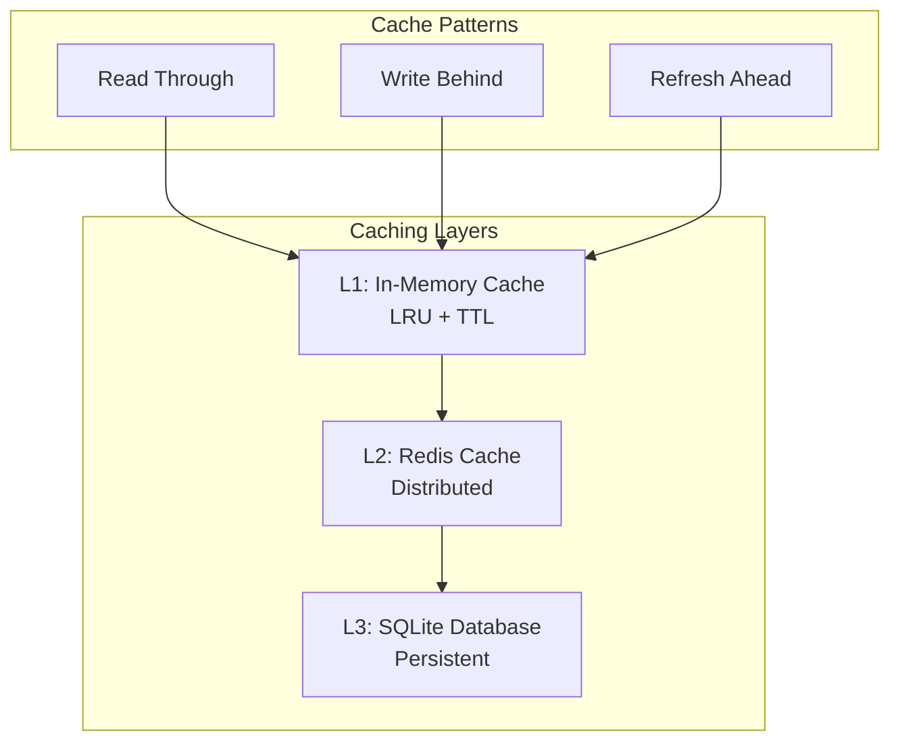

# Performance Tuning Guide

## Overview

This guide provides comprehensive performance optimization strategies for the Campfire Rust implementation, covering database optimization, WebSocket scaling, memory management, and monitoring techniques based on production patterns from the original Campfire.

**Performance Philosophy**: Leverage Rust's zero-cost abstractions and memory safety to achieve high performance while maintaining code clarity and correctness.

## Database Performance Optimization

### SQLite WAL Mode Configuration

SQLite Write-Ahead Logging (WAL) mode provides significant performance improvements for concurrent read/write workloads:

```rust
// src/database/mod.rs
use rusqlite::{Connection, OpenFlags};
use std::time::Duration;

pub struct DatabaseConfig {
    pub wal_mode: bool,
    pub synchronous: SynchronousMode,
    pub cache_size: i32,
    pub temp_store: TempStore,
    pub journal_size_limit: i64,
}

impl Default for DatabaseConfig {
    fn default() -> Self {
        Self {
            wal_mode: true,
            synchronous: SynchronousMode::Normal,
            cache_size: -64000, // 64MB cache
            temp_store: TempStore::Memory,
            journal_size_limit: 32 * 1024 * 1024, // 32MB
        }
    }
}

pub fn configure_sqlite_performance(conn: &Connection, config: &DatabaseConfig) -> Result<(), rusqlite::Error> {
    // Enable WAL mode for better concurrency
    if config.wal_mode {
        conn.execute("PRAGMA journal_mode = WAL", [])?;
        conn.execute(&format!("PRAGMA wal_autocheckpoint = {}", config.journal_size_limit / 1000), [])?;
    }
    
    // Optimize synchronization for performance vs durability trade-off
    let sync_mode = match config.synchronous {
        SynchronousMode::Off => "OFF",
        SynchronousMode::Normal => "NORMAL", 
        SynchronousMode::Full => "FULL",
    };
    conn.execute(&format!("PRAGMA synchronous = {}", sync_mode), [])?;
    
    // Set cache size (negative value = KB, positive = pages)
    conn.execute(&format!("PRAGMA cache_size = {}", config.cache_size), [])?;
    
    // Use memory for temporary tables
    let temp_store = match config.temp_store {
        TempStore::Default => "DEFAULT",
        TempStore::File => "FILE",
        TempStore::Memory => "MEMORY",
    };
    conn.execute(&format!("PRAGMA temp_store = {}", temp_store), [])?;
    
    // Enable memory-mapped I/O for large databases
    conn.execute("PRAGMA mmap_size = 268435456", [])?; // 256MB
    
    Ok(())
}

#[derive(Debug, Clone)]
pub enum SynchronousMode {
    Off,    // Fastest, risk of corruption on system crash
    Normal, // Good balance of speed and safety
    Full,   // Safest, slowest
}

#[derive(Debug, Clone)]
pub enum TempStore {
    Default,
    File,
    Memory,
}
```

### Connection Pool Optimization

```rust
// src/database/pool.rs
use r2d2::{Pool, PooledConnection};
use r2d2_sqlite::SqliteConnectionManager;
use std::time::Duration;

pub struct DatabasePool {
    pool: Pool<SqliteConnectionManager>,
}

impl DatabasePool {
    pub fn new(database_path: &str, config: DatabaseConfig) -> Result<Self, r2d2::Error> {
        let manager = SqliteConnectionManager::file(database_path)
            .with_init(move |conn| {
                configure_sqlite_performance(conn, &config)?;
                Ok(())
            });
        
        let pool = Pool::builder()
            .max_size(20)           // Maximum connections
            .min_idle(Some(5))      // Minimum idle connections
            .max_lifetime(Some(Duration::from_secs(3600))) // 1 hour max lifetime
            .idle_timeout(Some(Duration::from_secs(600)))  // 10 minute idle timeout
            .connection_timeout(Duration::from_secs(30))   // 30 second timeout
            .build(manager)?;
        
        Ok(Self { pool })
    }
    
    pub fn get_connection(&self) -> Result<PooledConnection<SqliteConnectionManager>, r2d2::Error> {
        self.pool.get()
    }
    
    pub fn status(&self) -> PoolStatus {
        let state = self.pool.state();
        PoolStatus {
            connections: state.connections,
            idle_connections: state.idle_connections,
        }
    }
}

#[derive(Debug)]
pub struct PoolStatus {
    pub connections: u32,
    pub idle_connections: u32,
}
```

### Database Indexing Strategy

```sql
-- Essential indexes for message queries
CREATE INDEX IF NOT EXISTS idx_messages_room_created 
ON messages(room_id, created_at DESC);

CREATE INDEX IF NOT EXISTS idx_messages_creator_created 
ON messages(creator_id, created_at DESC);

CREATE INDEX IF NOT EXISTS idx_messages_client_room 
ON messages(client_message_id, room_id);

-- Room membership queries
CREATE INDEX IF NOT EXISTS idx_memberships_user_room 
ON room_memberships(user_id, room_id);

CREATE INDEX IF NOT EXISTS idx_memberships_room_level 
ON room_memberships(room_id, involvement_level);

-- Session management
CREATE INDEX IF NOT EXISTS idx_sessions_user_expires 
ON sessions(user_id, expires_at);

-- FTS5 optimization
INSERT INTO messages_fts(messages_fts, rank) VALUES('rank', 'bm25(1.0, 0.5)');
```

### Query Optimization Patterns

```rust
// src/services/message.rs - Optimized message queries
impl MessageService {
    /// Optimized message retrieval with pagination
    pub async fn get_room_messages_optimized(
        &self,
        room_id: RoomId,
        limit: u32,
        before_id: Option<MessageId>,
    ) -> Result<Vec<Message>, MessageError> {
        let conn = self.db_pool.get_connection()?;
        
        let query = if let Some(before_id) = before_id {
            // Cursor-based pagination for consistent results
            "SELECT id, room_id, creator_id, content, client_message_id, created_at 
             FROM messages 
             WHERE room_id = ?1 AND created_at < (
                 SELECT created_at FROM messages WHERE id = ?2
             )
             ORDER BY created_at DESC 
             LIMIT ?3"
        } else {
            // Initial page load
            "SELECT id, room_id, creator_id, content, client_message_id, created_at 
             FROM messages 
             WHERE room_id = ?1 
             ORDER BY created_at DESC 
             LIMIT ?2"
        };
        
        let mut stmt = conn.prepare_cached(query)?;
        
        let messages = if let Some(before_id) = before_id {
            stmt.query_map([room_id.to_string(), before_id.to_string(), limit.to_string()], |row| {
                Ok(Message::from_row(row)?)
            })?
        } else {
            stmt.query_map([room_id.to_string(), limit.to_string()], |row| {
                Ok(Message::from_row(row)?)
            })?
        };
        
        messages.collect::<Result<Vec<_>, _>>()
            .map_err(MessageError::Database)
    }
    
    /// Batch message insertion for better performance
    pub async fn create_messages_batch(
        &self,
        messages: Vec<CreateMessageRequest>,
    ) -> Result<Vec<Message>, MessageError> {
        let conn = self.db_pool.get_connection()?;
        let tx = conn.transaction()?;
        
        let mut stmt = tx.prepare_cached(
            "INSERT INTO messages (id, room_id, creator_id, content, client_message_id, created_at)
             VALUES (?1, ?2, ?3, ?4, ?5, ?6)
             ON CONFLICT(client_message_id, room_id) DO NOTHING
             RETURNING id, room_id, creator_id, content, client_message_id, created_at"
        )?;
        
        let mut results = Vec::with_capacity(messages.len());
        
        for msg_req in messages {
            let message_id = MessageId::new();
            let now = Utc::now();
            
            if let Ok(message) = stmt.query_row([
                message_id.to_string(),
                msg_req.room_id.to_string(),
                msg_req.creator_id.to_string(),
                msg_req.content,
                msg_req.client_message_id.to_string(),
                now.to_rfc3339(),
            ], |row| Ok(Message::from_row(row)?)) {
                results.push(message);
            }
        }
        
        tx.commit()?;
        Ok(results)
    }
}
```

## WebSocket Performance Optimization

### Connection Limits and Backpressure

```rust
// src/services/connection.rs - WebSocket performance optimization
use tokio::sync::{mpsc, Semaphore};
use std::sync::Arc;

pub struct ConnectionManager {
    connections: Arc<RwLock<HashMap<ConnectionId, ConnectionInfo>>>,
    connection_semaphore: Arc<Semaphore>,
    broadcast_semaphore: Arc<Semaphore>,
    max_connections: usize,
    max_concurrent_broadcasts: usize,
}

impl ConnectionManager {
    pub fn new(max_connections: usize) -> Self {
        Self {
            connections: Arc::new(RwLock::new(HashMap::new())),
            connection_semaphore: Arc::new(Semaphore::new(max_connections)),
            broadcast_semaphore: Arc::new(Semaphore::new(50)), // Max 50 concurrent broadcasts
            max_connections,
            max_concurrent_broadcasts: 50,
        }
    }
    
    /// Add connection with backpressure control
    pub async fn add_connection_with_limits(
        &self,
        user_id: UserId,
        sender: mpsc::UnboundedSender<WebSocketMessage>,
    ) -> Result<ConnectionId, ConnectionError> {
        // Acquire connection permit (blocks if at limit)
        let _permit = self.connection_semaphore
            .acquire()
            .await
            .map_err(|_| ConnectionError::TooManyConnections)?;
        
        let connection_id = ConnectionId::new();
        let connection_info = ConnectionInfo {
            user_id,
            sender: sender.clone(),
            connected_at: Utc::now(),
            last_activity: Arc::new(AtomicU64::new(Utc::now().timestamp() as u64)),
            message_buffer: Arc::new(Mutex::new(VecDeque::with_capacity(100))),
        };
        
        // Configure backpressure for individual connections
        let (buffered_sender, mut buffered_receiver) = mpsc::channel::<WebSocketMessage>(1000);
        
        // Spawn task to handle backpressure
        let sender_clone = sender.clone();
        tokio::spawn(async move {
            while let Some(message) = buffered_receiver.recv().await {
                if sender_clone.send(message).is_err() {
                    break; // Connection closed
                }
            }
        });
        
        let mut connections = self.connections.write().await;
        connections.insert(connection_id, connection_info);
        
        // Don't drop the permit - it will be released when connection is removed
        std::mem::forget(_permit);
        
        Ok(connection_id)
    }
    
    /// Optimized room broadcasting with batching
    pub async fn broadcast_to_room_optimized(
        &self,
        room_id: RoomId,
        message: WebSocketMessage,
    ) -> Result<BroadcastStats, BroadcastError> {
        let _permit = self.broadcast_semaphore
            .acquire()
            .await
            .map_err(|_| BroadcastError::TooManyBroadcasts)?;
        
        let connections = self.connections.read().await;
        let room_connections: Vec<_> = connections
            .values()
            .filter(|conn| self.user_in_room(conn.user_id, room_id))
            .collect();
        
        let total_connections = room_connections.len();
        let mut successful_sends = 0;
        let mut failed_sends = 0;
        
        // Batch sends for better performance
        let batch_size = 100;
        for chunk in room_connections.chunks(batch_size) {
            let send_futures: Vec<_> = chunk
                .iter()
                .map(|conn| async {
                    match conn.sender.send(message.clone()) {
                        Ok(_) => {
                            conn.last_activity.store(
                                Utc::now().timestamp() as u64,
                                std::sync::atomic::Ordering::Relaxed
                            );
                            true
                        }
                        Err(_) => false,
                    }
                })
                .collect();
            
            let results = futures::future::join_all(send_futures).await;
            for success in results {
                if success {
                    successful_sends += 1;
                } else {
                    failed_sends += 1;
                }
            }
        }
        
        Ok(BroadcastStats {
            total_connections,
            successful_sends,
            failed_sends,
        })
    }
}

#[derive(Debug)]
pub struct BroadcastStats {
    pub total_connections: usize,
    pub successful_sends: usize,
    pub failed_sends: usize,
}

#[derive(Debug)]
pub struct ConnectionInfo {
    pub user_id: UserId,
    pub sender: mpsc::UnboundedSender<WebSocketMessage>,
    pub connected_at: DateTime<Utc>,
    pub last_activity: Arc<AtomicU64>,
    pub message_buffer: Arc<Mutex<VecDeque<WebSocketMessage>>>,
}
```

### WebSocket Message Batching

```rust
// src/handlers/websocket.rs - Message batching for performance
use tokio::time::{interval, Duration};

pub struct MessageBatcher {
    pending_messages: Arc<Mutex<HashMap<RoomId, Vec<WebSocketMessage>>>>,
    batch_interval: Duration,
    max_batch_size: usize,
}

impl MessageBatcher {
    pub fn new(batch_interval_ms: u64, max_batch_size: usize) -> Self {
        let batcher = Self {
            pending_messages: Arc::new(Mutex::new(HashMap::new())),
            batch_interval: Duration::from_millis(batch_interval_ms),
            max_batch_size,
        };
        
        // Start batch processing task
        let pending_clone = Arc::clone(&batcher.pending_messages);
        let interval_duration = batcher.batch_interval;
        tokio::spawn(async move {
            let mut interval = interval(interval_duration);
            loop {
                interval.tick().await;
                Self::process_batches(Arc::clone(&pending_clone)).await;
            }
        });
        
        batcher
    }
    
    pub async fn queue_message(&self, room_id: RoomId, message: WebSocketMessage) {
        let mut pending = self.pending_messages.lock().await;
        let room_messages = pending.entry(room_id).or_insert_with(Vec::new);
        room_messages.push(message);
        
        // Flush immediately if batch is full
        if room_messages.len() >= self.max_batch_size {
            let messages = std::mem::take(room_messages);
            drop(pending); // Release lock before async operation
            
            Self::send_batch(room_id, messages).await;
        }
    }
    
    async fn process_batches(pending_messages: Arc<Mutex<HashMap<RoomId, Vec<WebSocketMessage>>>>) {
        let mut pending = pending_messages.lock().await;
        let batches: Vec<_> = pending
            .drain()
            .filter(|(_, messages)| !messages.is_empty())
            .collect();
        drop(pending);
        
        // Send all batches concurrently
        let send_futures: Vec<_> = batches
            .into_iter()
            .map(|(room_id, messages)| Self::send_batch(room_id, messages))
            .collect();
        
        futures::future::join_all(send_futures).await;
    }
    
    async fn send_batch(room_id: RoomId, messages: Vec<WebSocketMessage>) {
        if messages.is_empty() {
            return;
        }
        
        // Create batched message
        let batch_message = WebSocketMessage::Batch {
            room_id,
            messages,
            timestamp: Utc::now(),
        };
        
        // Send to connection manager
        if let Err(e) = CONNECTION_MANAGER.broadcast_to_room(room_id, batch_message).await {
            eprintln!("Failed to send batch to room {}: {}", room_id, e);
        }
    }
}
```

## Memory Usage Monitoring and Optimization

### Memory Profiling Integration

```rust
// src/metrics/memory.rs - Memory monitoring
use std::sync::atomic::{AtomicU64, Ordering};

pub struct MemoryMetrics {
    allocated_bytes: AtomicU64,
    peak_allocated: AtomicU64,
    allocation_count: AtomicU64,
    deallocation_count: AtomicU64,
}

impl MemoryMetrics {
    pub fn new() -> Self {
        Self {
            allocated_bytes: AtomicU64::new(0),
            peak_allocated: AtomicU64::new(0),
            allocation_count: AtomicU64::new(0),
            deallocation_count: AtomicU64::new(0),
        }
    }
    
    pub fn record_allocation(&self, size: u64) {
        let current = self.allocated_bytes.fetch_add(size, Ordering::Relaxed) + size;
        self.allocation_count.fetch_add(1, Ordering::Relaxed);
        
        // Update peak if necessary
        let mut peak = self.peak_allocated.load(Ordering::Relaxed);
        while current > peak {
            match self.peak_allocated.compare_exchange_weak(
                peak, current, Ordering::Relaxed, Ordering::Relaxed
            ) {
                Ok(_) => break,
                Err(new_peak) => peak = new_peak,
            }
        }
    }
    
    pub fn record_deallocation(&self, size: u64) {
        self.allocated_bytes.fetch_sub(size, Ordering::Relaxed);
        self.deallocation_count.fetch_add(1, Ordering::Relaxed);
    }
    
    pub fn get_stats(&self) -> MemoryStats {
        MemoryStats {
            current_allocated: self.allocated_bytes.load(Ordering::Relaxed),
            peak_allocated: self.peak_allocated.load(Ordering::Relaxed),
            total_allocations: self.allocation_count.load(Ordering::Relaxed),
            total_deallocations: self.deallocation_count.load(Ordering::Relaxed),
        }
    }
}

#[derive(Debug, Clone)]
pub struct MemoryStats {
    pub current_allocated: u64,
    pub peak_allocated: u64,
    pub total_allocations: u64,
    pub total_deallocations: u64,
}

// Memory-efficient string interning for repeated strings
use std::collections::HashMap;
use std::sync::Arc;

pub struct StringInterner {
    strings: Arc<RwLock<HashMap<String, Arc<str>>>>,
    stats: Arc<InternerStats>,
}

impl StringInterner {
    pub fn new() -> Self {
        Self {
            strings: Arc::new(RwLock::new(HashMap::new())),
            stats: Arc::new(InternerStats::new()),
        }
    }
    
    pub async fn intern(&self, s: &str) -> Arc<str> {
        // Try read-only access first
        {
            let strings = self.strings.read().await;
            if let Some(interned) = strings.get(s) {
                self.stats.record_hit();
                return Arc::clone(interned);
            }
        }
        
        // Need to insert new string
        let mut strings = self.strings.write().await;
        
        // Double-check after acquiring write lock
        if let Some(interned) = strings.get(s) {
            self.stats.record_hit();
            return Arc::clone(interned);
        }
        
        let interned: Arc<str> = Arc::from(s);
        strings.insert(s.to_string(), Arc::clone(&interned));
        self.stats.record_miss();
        
        interned
    }
    
    pub fn stats(&self) -> InternerStatsSnapshot {
        self.stats.snapshot()
    }
}

struct InternerStats {
    hits: AtomicU64,
    misses: AtomicU64,
}

impl InternerStats {
    fn new() -> Self {
        Self {
            hits: AtomicU64::new(0),
            misses: AtomicU64::new(0),
        }
    }
    
    fn record_hit(&self) {
        self.hits.fetch_add(1, Ordering::Relaxed);
    }
    
    fn record_miss(&self) {
        self.misses.fetch_add(1, Ordering::Relaxed);
    }
    
    fn snapshot(&self) -> InternerStatsSnapshot {
        let hits = self.hits.load(Ordering::Relaxed);
        let misses = self.misses.load(Ordering::Relaxed);
        let total = hits + misses;
        
        InternerStatsSnapshot {
            hits,
            misses,
            hit_rate: if total > 0 { hits as f64 / total as f64 } else { 0.0 },
        }
    }
}

#[derive(Debug)]
pub struct InternerStatsSnapshot {
    pub hits: u64,
    pub misses: u64,
    pub hit_rate: f64,
}
```

### Memory-Efficient Data Structures

```rust
// src/models/optimized.rs - Memory-optimized data structures
use compact_str::CompactString; // More memory-efficient than String for small strings

#[derive(Debug, Clone)]
pub struct OptimizedMessage {
    pub id: MessageId,
    pub room_id: RoomId,
    pub creator_id: UserId,
    pub content: CompactString,        // More efficient for typical message sizes
    pub client_message_id: Uuid,
    pub created_at: DateTime<Utc>,
    pub metadata: Option<Box<MessageMetadata>>, // Box to reduce size when None
}

#[derive(Debug, Clone)]
pub struct MessageMetadata {
    pub mentions: Vec<UserId>,
    pub hashtags: Vec<CompactString>,
    pub urls: Vec<CompactString>,
    pub reply_to: Option<MessageId>,
}

// Memory pool for frequent allocations
use std::sync::Mutex;

pub struct MessagePool {
    pool: Mutex<Vec<Box<OptimizedMessage>>>,
    max_size: usize,
}

impl MessagePool {
    pub fn new(max_size: usize) -> Self {
        Self {
            pool: Mutex::new(Vec::with_capacity(max_size)),
            max_size,
        }
    }
    
    pub fn acquire(&self) -> Box<OptimizedMessage> {
        let mut pool = self.pool.lock().unwrap();
        pool.pop().unwrap_or_else(|| {
            Box::new(OptimizedMessage {
                id: MessageId::new(),
                room_id: RoomId::new(),
                creator_id: UserId::new(),
                content: CompactString::new(""),
                client_message_id: Uuid::new_v4(),
                created_at: Utc::now(),
                metadata: None,
            })
        })
    }
    
    pub fn release(&self, mut message: Box<OptimizedMessage>) {
        // Clear the message for reuse
        message.content.clear();
        message.metadata = None;
        
        let mut pool = self.pool.lock().unwrap();
        if pool.len() < self.max_size {
            pool.push(message);
        }
        // Otherwise let it drop
    }
}
```

## Performance Monitoring and Metrics

### Comprehensive Performance Dashboard

```rust
// src/metrics/dashboard.rs - Performance monitoring
use prometheus::{Counter, Histogram, Gauge, Registry};
use std::time::Instant;

pub struct PerformanceMetrics {
    // Database metrics
    db_query_duration: Histogram,
    db_connection_pool_size: Gauge,
    db_active_connections: Gauge,
    
    // WebSocket metrics
    ws_connections_total: Gauge,
    ws_messages_sent: Counter,
    ws_broadcast_duration: Histogram,
    
    // Memory metrics
    memory_allocated: Gauge,
    memory_peak: Gauge,
    
    // Application metrics
    request_duration: Histogram,
    active_users: Gauge,
    messages_per_second: Counter,
}

impl PerformanceMetrics {
    pub fn new(registry: &Registry) -> Result<Self, prometheus::Error> {
        let db_query_duration = Histogram::with_opts(
            prometheus::HistogramOpts::new(
                "db_query_duration_seconds",
                "Database query execution time"
            ).buckets(vec![0.001, 0.005, 0.01, 0.05, 0.1, 0.5, 1.0])
        )?;
        
        let ws_broadcast_duration = Histogram::with_opts(
            prometheus::HistogramOpts::new(
                "ws_broadcast_duration_seconds", 
                "WebSocket broadcast time"
            ).buckets(vec![0.001, 0.005, 0.01, 0.05, 0.1])
        )?;
        
        let request_duration = Histogram::with_opts(
            prometheus::HistogramOpts::new(
                "http_request_duration_seconds",
                "HTTP request processing time"
            ).buckets(vec![0.005, 0.01, 0.025, 0.05, 0.1, 0.25, 0.5, 1.0])
        )?;
        
        registry.register(Box::new(db_query_duration.clone()))?;
        registry.register(Box::new(ws_broadcast_duration.clone()))?;
        registry.register(Box::new(request_duration.clone()))?;
        
        Ok(Self {
            db_query_duration,
            db_connection_pool_size: Gauge::new("db_pool_size", "Database connection pool size")?,
            db_active_connections: Gauge::new("db_active_connections", "Active database connections")?,
            ws_connections_total: Gauge::new("ws_connections_total", "Total WebSocket connections")?,
            ws_messages_sent: Counter::new("ws_messages_sent_total", "Total WebSocket messages sent")?,
            ws_broadcast_duration,
            memory_allocated: Gauge::new("memory_allocated_bytes", "Currently allocated memory")?,
            memory_peak: Gauge::new("memory_peak_bytes", "Peak memory allocation")?,
            request_duration,
            active_users: Gauge::new("active_users", "Currently active users")?,
            messages_per_second: Counter::new("messages_per_second", "Messages processed per second")?,
        })
    }
    
    pub fn time_database_query<F, R>(&self, f: F) -> R 
    where 
        F: FnOnce() -> R,
    {
        let timer = self.db_query_duration.start_timer();
        let result = f();
        timer.observe_duration();
        result
    }
    
    pub async fn time_async_database_query<F, Fut, R>(&self, f: F) -> R
    where
        F: FnOnce() -> Fut,
        Fut: std::future::Future<Output = R>,
    {
        let start = Instant::now();
        let result = f().await;
        self.db_query_duration.observe(start.elapsed().as_secs_f64());
        result
    }
    
    pub fn update_connection_stats(&self, total: u64, active: u64) {
        self.ws_connections_total.set(total as f64);
        self.db_active_connections.set(active as f64);
    }
    
    pub fn record_broadcast(&self, duration: std::time::Duration, message_count: u64) {
        self.ws_broadcast_duration.observe(duration.as_secs_f64());
        self.ws_messages_sent.inc_by(message_count);
    }
}

// Performance monitoring middleware
use axum::{extract::Request, middleware::Next, response::Response};

pub async fn performance_middleware(
    request: Request,
    next: Next,
) -> Response {
    let start = Instant::now();
    let method = request.method().clone();
    let path = request.uri().path().to_string();
    
    let response = next.run(request).await;
    
    let duration = start.elapsed();
    let status = response.status().as_u16();
    
    // Record metrics
    METRICS.request_duration
        .with_label_values(&[&method.to_string(), &path, &status.to_string()])
        .observe(duration.as_secs_f64());
    
    response
}
```

## Caching Strategies

### Multi-Level Caching Architecture



```rust
// src/cache/mod.rs - Multi-level caching
use lru::LruCache;
use std::num::NonZeroUsize;
use tokio::time::{Duration, Instant};

pub struct MultiLevelCache<K, V> 
where 
    K: Clone + Eq + std::hash::Hash,
    V: Clone,
{
    l1_cache: Arc<Mutex<LruCache<K, CacheEntry<V>>>>,
    l2_cache: Option<Arc<dyn L2Cache<K, V>>>,
    ttl: Duration,
}

#[derive(Clone)]
struct CacheEntry<V> {
    value: V,
    inserted_at: Instant,
    access_count: u64,
}

impl<K, V> MultiLevelCache<K, V>
where
    K: Clone + Eq + std::hash::Hash + Send + Sync + 'static,
    V: Clone + Send + Sync + 'static,
{
    pub fn new(capacity: usize, ttl: Duration) -> Self {
        Self {
            l1_cache: Arc::new(Mutex::new(
                LruCache::new(NonZeroUsize::new(capacity).unwrap())
            )),
            l2_cache: None,
            ttl,
        }
    }
    
    pub async fn get(&self, key: &K) -> Option<V> {
        // Try L1 cache first
        {
            let mut cache = self.l1_cache.lock().await;
            if let Some(entry) = cache.get_mut(key) {
                if entry.inserted_at.elapsed() < self.ttl {
                    entry.access_count += 1;
                    return Some(entry.value.clone());
                } else {
                    cache.pop(key); // Remove expired entry
                }
            }
        }
        
        // Try L2 cache if available
        if let Some(l2) = &self.l2_cache {
            if let Some(value) = l2.get(key).await {
                // Promote to L1
                self.put_l1(key.clone(), value.clone()).await;
                return Some(value);
            }
        }
        
        None
    }
    
    pub async fn put(&self, key: K, value: V) {
        self.put_l1(key.clone(), value.clone()).await;
        
        if let Some(l2) = &self.l2_cache {
            l2.put(key, value).await;
        }
    }
    
    async fn put_l1(&self, key: K, value: V) {
        let mut cache = self.l1_cache.lock().await;
        cache.put(key, CacheEntry {
            value,
            inserted_at: Instant::now(),
            access_count: 1,
        });
    }
    
    pub async fn stats(&self) -> CacheStats {
        let cache = self.l1_cache.lock().await;
        let total_entries = cache.len();
        let capacity = cache.cap().get();
        
        CacheStats {
            l1_entries: total_entries,
            l1_capacity: capacity,
            l1_hit_rate: 0.0, // Would need to track hits/misses
        }
    }
}

#[derive(Debug)]
pub struct CacheStats {
    pub l1_entries: usize,
    pub l1_capacity: usize,
    pub l1_hit_rate: f64,
}

#[async_trait]
pub trait L2Cache<K, V>: Send + Sync {
    async fn get(&self, key: &K) -> Option<V>;
    async fn put(&self, key: K, value: V);
    async fn remove(&self, key: &K);
}
```

## Load Testing and Benchmarking

### Performance Benchmarks

```rust
// benches/performance.rs - Comprehensive benchmarks
use criterion::{black_box, criterion_group, criterion_main, Criterion, BenchmarkId};
use campfire::{MessageService, ConnectionManager, DatabasePool};
use tokio::runtime::Runtime;

fn benchmark_message_creation(c: &mut Criterion) {
    let rt = Runtime::new().unwrap();
    let service = rt.block_on(async { create_test_message_service().await });
    
    let mut group = c.benchmark_group("message_creation");
    
    for batch_size in [1, 10, 50, 100].iter() {
        group.bench_with_input(
            BenchmarkId::new("batch_size", batch_size),
            batch_size,
            |b, &batch_size| {
                b.to_async(&rt).iter(|| async {
                    let messages = create_test_messages(batch_size);
                    black_box(service.create_messages_batch(messages).await.unwrap())
                });
            },
        );
    }
    
    group.finish();
}

fn benchmark_websocket_broadcast(c: &mut Criterion) {
    let rt = Runtime::new().unwrap();
    let connection_manager = rt.block_on(async { create_test_connection_manager().await });
    
    let mut group = c.benchmark_group("websocket_broadcast");
    
    for connection_count in [10, 100, 1000, 5000].iter() {
        group.bench_with_input(
            BenchmarkId::new("connections", connection_count),
            connection_count,
            |b, &connection_count| {
                b.to_async(&rt).iter(|| async {
                    let room_id = setup_room_with_connections(&connection_manager, connection_count).await;
                    let message = create_test_websocket_message();
                    black_box(connection_manager.broadcast_to_room(room_id, message).await.unwrap())
                });
            },
        );
    }
    
    group.finish();
}

fn benchmark_database_queries(c: &mut Criterion) {
    let rt = Runtime::new().unwrap();
    let db_pool = rt.block_on(async { create_test_database_pool().await });
    
    c.bench_function("message_query_recent", |b| {
        b.to_async(&rt).iter(|| async {
            let room_id = RoomId::new();
            black_box(db_pool.get_room_messages(room_id, 50, None).await.unwrap())
        });
    });
    
    c.bench_function("message_query_paginated", |b| {
        b.to_async(&rt).iter(|| async {
            let room_id = RoomId::new();
            let before_id = MessageId::new();
            black_box(db_pool.get_room_messages(room_id, 50, Some(before_id)).await.unwrap())
        });
    });
}

criterion_group!(
    benches,
    benchmark_message_creation,
    benchmark_websocket_broadcast,
    benchmark_database_queries
);
criterion_main!(benches);
```

### Load Testing Scripts

```bash
#!/bin/bash
# scripts/load-test.sh - Comprehensive load testing

set -e

echo "Starting Campfire load testing..."

# Start the application in background
cargo build --release
./target/release/campfire &
APP_PID=$!

# Wait for application to start
sleep 5

echo "Running WebSocket connection test..."
# Test WebSocket connections
for i in {1..1000}; do
    wscat -c ws://localhost:3000/ws &
done

echo "Running HTTP API load test..."
# Test HTTP API with wrk
wrk -t12 -c400 -d30s --script=scripts/load-test.lua http://localhost:3000/api/rooms

echo "Running message throughput test..."
# Test message creation throughput
ab -n 10000 -c 100 -p scripts/message-payload.json -T application/json http://localhost:3000/api/rooms/test/messages

echo "Collecting performance metrics..."
curl http://localhost:3000/metrics > load-test-metrics.txt

# Cleanup
kill $APP_PID
wait $APP_PID 2>/dev/null || true

echo "Load testing complete. Check load-test-metrics.txt for results."
```

## Production Optimization Checklist

### Pre-Deployment Performance Validation

- [ ] **Database Configuration**
  - [ ] WAL mode enabled for SQLite
  - [ ] Appropriate cache size configured (64MB+)
  - [ ] Essential indexes created and analyzed
  - [ ] Connection pool sized for expected load

- [ ] **WebSocket Optimization**
  - [ ] Connection limits configured (max 10,000)
  - [ ] Backpressure handling implemented
  - [ ] Message batching enabled for broadcasts
  - [ ] Idle connection cleanup active

- [ ] **Memory Management**
  - [ ] String interning for repeated values
  - [ ] Object pooling for frequent allocations
  - [ ] Memory metrics monitoring enabled
  - [ ] Leak detection in place

- [ ] **Caching Strategy**
  - [ ] Multi-level cache implemented
  - [ ] Cache hit rates monitored (>80% target)
  - [ ] TTL values optimized for data patterns
  - [ ] Cache invalidation strategy defined

- [ ] **Monitoring and Alerting**
  - [ ] Performance metrics exported to Prometheus
  - [ ] Grafana dashboards configured
  - [ ] Alerting rules for performance degradation
  - [ ] Load testing results documented

### Performance Targets

| Metric | Target | Monitoring |
|--------|--------|------------|
| Message Creation | <10ms p95 | Histogram |
| WebSocket Broadcast | <50ms p95 | Histogram |
| Database Query | <5ms p95 | Histogram |
| Memory Usage | <512MB steady state | Gauge |
| Connection Limit | 10,000 concurrent | Gauge |
| Cache Hit Rate | >80% | Counter ratio |

### Scaling Considerations

**Vertical Scaling (Single Instance)**:
- CPU: 4-8 cores recommended
- Memory: 2-4GB for 10,000 connections
- Storage: SSD required for SQLite performance
- Network: 1Gbps for high message throughput

**Horizontal Scaling (Future)**:
- Database: Migrate to PostgreSQL with read replicas
- Cache: Redis cluster for distributed caching
- Load Balancer: Sticky sessions for WebSocket connections
- Message Queue: For cross-instance communication

This performance guide provides the foundation for running Campfire efficiently in production while maintaining the simplicity and reliability of the single-binary deployment model.