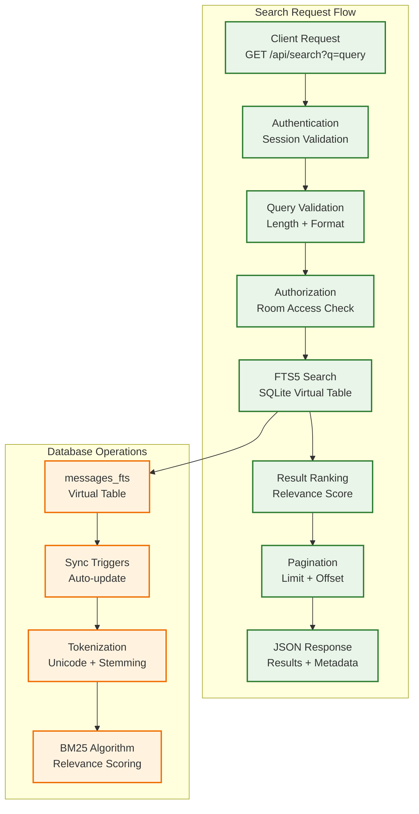
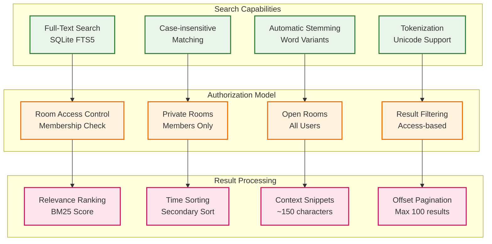

# Search API Documentation

## Overview

The Campfire Rust application provides full-text search functionality using SQLite FTS5 (Full-Text Search) for searching messages across rooms that the user has access to.

## Search Architecture



## Search Endpoint

### GET /api/search

Search messages with full-text search across user's accessible rooms.

#### Query Parameters

- `q` (required): Search query string (2-100 characters)
- `limit` (optional): Maximum number of results per page (default: 20, max: 100)
- `offset` (optional): Number of results to skip for pagination (default: 0)
- `room_id` (optional): UUID of specific room to search within

#### Authentication

Requires authentication via:
- Authorization header: `Authorization: Bearer <session_token>`
- Cookie: `session_token=<session_token>`

#### Response Format

```json
{
  "results": [
    {
      "message": {
        "id": "550e8400-e29b-41d4-a716-446655440000",
        "room_id": "550e8400-e29b-41d4-a716-446655440001",
        "creator_id": "550e8400-e29b-41d4-a716-446655440002",
        "content": "This is a test message with search terms",
        "client_message_id": "550e8400-e29b-41d4-a716-446655440003",
        "created_at": "2023-12-01T10:30:00Z"
      },
      "rank": 1.5,
      "snippet": "...test message with search terms..."
    }
  ],
  "total_count": 42,
  "query": "test search",
  "limit": 20,
  "offset": 0,
  "has_more": true
}
```

#### Response Fields

- `results`: Array of search results
  - `message`: Full message object
  - `rank`: FTS5 relevance score (lower is better)
  - `snippet`: Text snippet with context around search terms
- `total_count`: Total number of matching messages
- `query`: Original search query
- `limit`: Results per page limit used
- `offset`: Results offset used
- `has_more`: Whether more results are available

## Examples

### Basic Search

```bash
curl -H "Authorization: Bearer <token>" \
  "http://localhost:3000/api/search?q=hello"
```

### Search with Pagination

```bash
curl -H "Authorization: Bearer <token>" \
  "http://localhost:3000/api/search?q=hello&limit=10&offset=20"
```

### Search in Specific Room

```bash
curl -H "Authorization: Bearer <token>" \
  "http://localhost:3000/api/search?q=hello&room_id=550e8400-e29b-41d4-a716-446655440001"
```

## Error Responses

### 400 Bad Request

```json
{
  "error": "Search query too short: minimum 2 characters",
  "type": "query_too_short"
}
```

Error types:
- `invalid_query`: Query is empty or invalid format
- `query_too_short`: Query less than 2 characters
- `query_too_long`: Query more than 100 characters

### 401 Unauthorized

```json
{
  "error": "Missing authentication token",
  "code": 401
}
```

### 403 Forbidden

```json
{
  "error": "Room access denied",
  "type": "access_denied"
}
```

### 500 Internal Server Error

```json
{
  "error": "Database operation failed",
  "type": "database_error"
}
```

## Search Features



### Full-Text Search

- Uses SQLite FTS5 for fast, accurate text search
- Searches message content only
- Case-insensitive matching
- Automatic stemming and tokenization

### Authorization

- Only returns messages from rooms the user has access to
- Respects room membership and access controls
- Private rooms require membership
- Open rooms accessible to all users

### Ranking

- Results ranked by FTS5 relevance score
- More relevant matches appear first
- Secondary sort by message creation time (newest first)

### Snippets

- Contextual snippets around search terms
- Truncated with ellipsis (...) when needed
- Up to ~150 characters with search term context

### Pagination

- Efficient offset-based pagination
- `has_more` field indicates additional results
- Maximum 100 results per page

## Implementation Details

### Database Schema

The search functionality uses:

1. **messages_fts** - FTS5 virtual table with message content
2. **Triggers** - Automatically sync FTS5 table with messages table
3. **Authorization joins** - Filter results by room membership

### Query Validation

- Query length: 2-100 characters
- HTML/special character escaping
- FTS5 injection prevention

### Performance

- FTS5 provides sub-millisecond search on thousands of messages
- Indexed content for fast retrieval
- Efficient pagination with count queries

## Testing

Run search functionality tests:

```bash
cargo test --test simple_search_test
```

This tests:
- Basic search functionality
- Query validation
- Authorization filtering
- Pagination
- Error handling