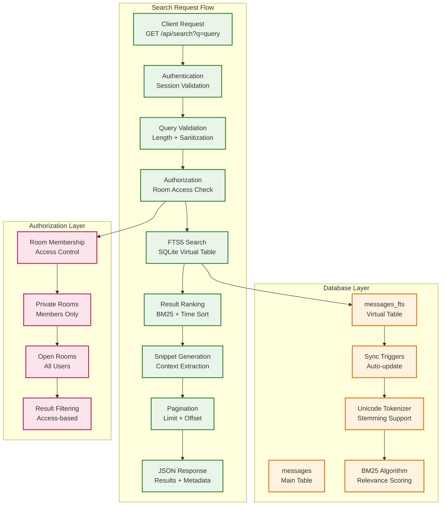
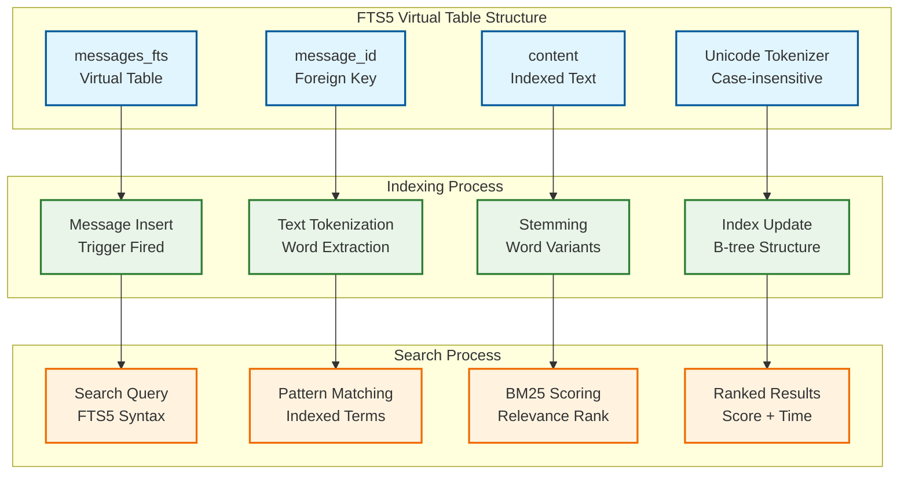
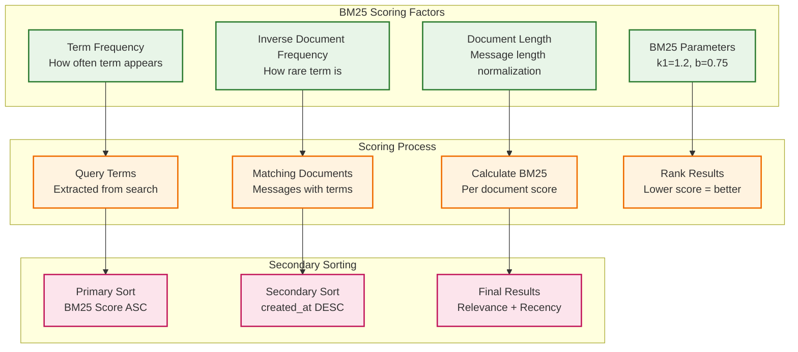
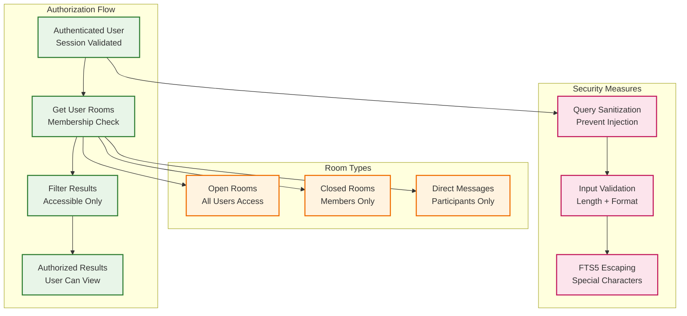
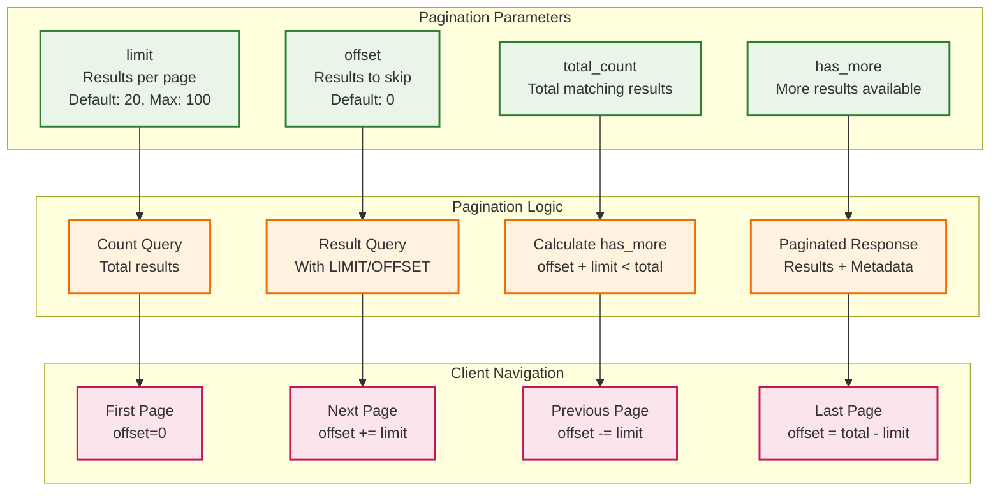
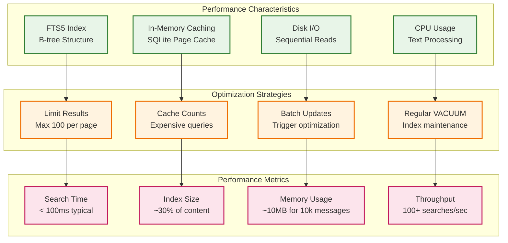

# Search System Guide

## IMPORTANT FOR VISUALS AND DIAGRAMS

ALL DIAGRAMS WILL BE IN MERMAID ONLY TO ENSURE EASE WITH GITHUB - DO NOT SKIP THAT

## Overview

The Campfire Rust search system provides fast, accurate full-text search across all messages using SQLite FTS5 (Full-Text Search). This guide explains the implementation, query syntax, performance characteristics, and optimization strategies.


**Key Features:**
- **Sub-millisecond search** across thousands of messages
- **Authorization-aware results** - only shows accessible content
- **Relevance ranking** using BM25 algorithm
- **Context snippets** with highlighted matches
- **Real-time indexing** via database triggers
- **Advanced query syntax** with operators and filters

## Architecture Overview



## FTS5 Integration Details

### Database Schema

The search system uses a dual-table approach for optimal performance:

```sql
-- Main messages table
CREATE TABLE messages (
    id TEXT PRIMARY KEY,
    room_id TEXT NOT NULL REFERENCES rooms(id),
    creator_id TEXT NOT NULL REFERENCES users(id),
    content TEXT NOT NULL,
    client_message_id TEXT NOT NULL,
    created_at DATETIME NOT NULL DEFAULT CURRENT_TIMESTAMP,
    UNIQUE(client_message_id, room_id)
);

-- FTS5 virtual table for search
CREATE VIRTUAL TABLE messages_fts USING fts5(
    message_id,
    content
);

-- Automatic synchronization triggers
CREATE TRIGGER messages_fts_insert AFTER INSERT ON messages BEGIN
    INSERT INTO messages_fts(message_id, content) VALUES (new.id, new.content);
END;

CREATE TRIGGER messages_fts_delete AFTER DELETE ON messages BEGIN
    DELETE FROM messages_fts WHERE message_id = old.id;
END;

CREATE TRIGGER messages_fts_update AFTER UPDATE ON messages BEGIN
    DELETE FROM messages_fts WHERE message_id = old.id;
    INSERT INTO messages_fts(message_id, content) VALUES (new.id, new.content);
END;
```

### FTS5 Configuration



## Query Syntax and Capabilities

### Basic Search

```bash
# Simple word search
GET /api/search?q=deployment

# Multiple words (AND by default)
GET /api/search?q=rust deployment

# Phrase search
GET /api/search?q="rust deployment"
```

### Advanced Query Operators

The search system supports FTS5 query syntax with safety restrictions:

```bash
# OR operator
GET /api/search?q=rust OR deployment

# NOT operator (exclusion)
GET /api/search?q=deployment NOT rails

# Phrase search with quotes
GET /api/search?q="zero downtime deployment"

# Prefix matching (disabled for security)
# GET /api/search?q=deploy*  # Not supported

# Column-specific search (disabled for security)
# GET /api/search?q=content:deployment  # Not supported
```

### Query Validation and Sanitization

```rust
/// Query validation rules implemented in SearchService
fn validate_query(&self, query: &str) -> Result<String, SearchError> {
    let trimmed = query.trim();
    
    // Length validation
    if trimmed.is_empty() {
        return Err(SearchError::InvalidQuery {
            reason: "Query cannot be empty".to_string(),
        });
    }
    
    if trimmed.len() < 2 {
        return Err(SearchError::QueryTooShort);
    }
    
    if trimmed.len() > 100 {
        return Err(SearchError::QueryTooLong);
    }
    
    // Security sanitization - prevent FTS5 injection
    let escaped = trimmed
        .replace('"', "\"\"")  // Escape quotes
        .replace('*', "")      // Remove wildcards
        .replace(':', "");     // Remove column specifiers
    
    Ok(escaped)
}
```

### Supported Query Examples

```bash
# ✅ SUPPORTED QUERIES

# Basic word search
GET /api/search?q=deployment
# Matches: "deployment", "deployments", "deployed"

# Multiple words (implicit AND)
GET /api/search?q=rust performance
# Matches: messages containing both "rust" AND "performance"

# Explicit OR operator
GET /api/search?q=rust OR rails
# Matches: messages containing either "rust" OR "rails"

# NOT operator for exclusion
GET /api/search?q=deployment NOT staging
# Matches: messages with "deployment" but NOT "staging"

# Phrase search with quotes
GET /api/search?q="zero downtime"
# Matches: exact phrase "zero downtime"

# Complex boolean queries
GET /api/search?q=(rust OR rails) AND deployment
# Matches: messages with "deployment" and either "rust" or "rails"

# Case-insensitive search
GET /api/search?q=RUST
# Matches: "rust", "Rust", "RUST", etc.
```

```bash
# ❌ UNSUPPORTED QUERIES (for security)

# Wildcard searches
GET /api/search?q=deploy*
# Error: Wildcards removed during sanitization

# Column-specific searches
GET /api/search?q=content:deployment
# Error: Column specifiers removed during sanitization

# Complex FTS5 functions
GET /api/search?q=NEAR(rust deployment)
# Error: Advanced functions not supported
```

## Search Result Ranking

### BM25 Algorithm

The search system uses SQLite FTS5's built-in BM25 algorithm for relevance scoring:



### Ranking Implementation

```sql
-- Search query with BM25 ranking
SELECT m.id, m.room_id, m.creator_id, m.content, m.client_message_id, m.created_at,
       rank  -- BM25 score (lower = more relevant)
FROM messages_fts fts
INNER JOIN messages m ON fts.message_id = m.id
WHERE messages_fts MATCH ?  -- User query
  AND m.room_id IN (...)    -- Authorization filter
ORDER BY rank ASC,          -- Primary: relevance (lower score first)
         m.created_at DESC  -- Secondary: recency (newer first)
LIMIT ? OFFSET ?;
```

### Ranking Factors

1. **Term Frequency (TF)**: How often search terms appear in the message
2. **Inverse Document Frequency (IDF)**: How rare the terms are across all messages
3. **Document Length**: Shorter messages get slight boost for same term frequency
4. **Recency**: Among equally relevant results, newer messages rank higher

## Context Snippets

### Snippet Generation Algorithm

```rust
/// Generate snippet with highlighted matches
fn generate_snippet(&self, content: &str, query: &str) -> String {
    let query_lower = query.to_lowercase();
    let content_lower = content.to_lowercase();
    
    // Find the first occurrence of the query
    if let Some(pos) = content_lower.find(&query_lower) {
        let start = pos.saturating_sub(50);  // 50 chars before match
        let end = (pos + query.len() + 50).min(content.len());  // 50 chars after
        
        let mut snippet = content[start..end].to_string();
        
        // Add ellipsis if truncated
        if start > 0 {
            snippet = format!("...{}", snippet);
        }
        if end < content.len() {
            snippet = format!("{}...", snippet);
        }
        
        snippet
    } else {
        // Fallback to first 100 characters
        if content.len() > 100 {
            format!("{}...", &content[..100])
        } else {
            content.to_string()
        }
    }
}
```

### Snippet Examples

```json
{
  "results": [
    {
      "message": {
        "content": "The new Rust deployment is working perfectly! We've seen a 40% improvement in response times since switching from Rails."
      },
      "snippet": "The new Rust deployment is working perfectly! We've seen a 40%...",
      "rank": 0.85
    },
    {
      "message": {
        "content": "Just finished the comprehensive deployment guide for our Rust migration. The process is much simpler now with the single binary approach."
      },
      "snippet": "...comprehensive deployment guide for our Rust migration. The process is much...",
      "rank": 1.2
    }
  ]
}
```

## Authorization and Security

### Room-Based Access Control



### Authorization Implementation

```rust
/// Get user's accessible room IDs for search authorization
async fn get_user_room_ids(&self, user_id: UserId) -> Result<Vec<RoomId>, SearchError> {
    let rooms = self.room_service.get_user_rooms(user_id).await?;
    Ok(rooms.into_iter().map(|room| room.id).collect())
}

/// Search with authorization filtering
async fn search_messages(&self, user_id: UserId, request: SearchRequest) 
    -> Result<SearchResponse, SearchError> {
    
    // Get user's accessible rooms
    let accessible_room_ids = self.get_user_room_ids(user_id).await?;
    
    if accessible_room_ids.is_empty() {
        return Ok(SearchResponse::empty());
    }
    
    // Build SQL with room authorization
    let room_placeholders = accessible_room_ids
        .iter()
        .map(|_| "?")
        .collect::<Vec<_>>()
        .join(",");
    
    let search_query = format!(
        r#"
        SELECT m.id, m.room_id, m.creator_id, m.content, m.created_at, rank
        FROM messages_fts fts
        INNER JOIN messages m ON fts.message_id = m.id
        WHERE messages_fts MATCH ? 
          AND m.room_id IN ({})  -- Authorization filter
        ORDER BY rank ASC, m.created_at DESC
        LIMIT ? OFFSET ?
        "#,
        room_placeholders
    );
    
    // Execute with room ID parameters
    // ... query execution
}
```

### Security Measures

1. **Query Sanitization**: Remove dangerous FTS5 operators
2. **Input Validation**: Length limits and format checking
3. **Authorization Filtering**: Only return accessible messages
4. **SQL Injection Prevention**: Parameterized queries only
5. **Rate Limiting**: Prevent search abuse (handled by middleware)

## Pagination

### Offset-Based Pagination



### Pagination Implementation

```rust
// Get total count for pagination
let count_query = format!(
    r#"
    SELECT COUNT(*) as total
    FROM messages_fts fts
    INNER JOIN messages m ON fts.message_id = m.id
    WHERE messages_fts MATCH ? AND m.room_id IN ({})
    "#,
    room_placeholders
);

let total_count: i64 = sqlx::query(&count_query)
    .bind(&validated_query)
    // ... bind room IDs
    .fetch_one(self.db.pool())
    .await?
    .get("total");

let has_more = (offset + limit) < total_count as u32;

SearchResponse {
    results,
    total_count: total_count as u32,
    query: request.query,
    limit,
    offset,
    has_more,
}
```

### Pagination Examples

```bash
# First page (default)
GET /api/search?q=deployment
# Returns: offset=0, limit=20, has_more=true

# Second page
GET /api/search?q=deployment&offset=20&limit=20
# Returns: offset=20, limit=20, has_more=true

# Custom page size
GET /api/search?q=deployment&limit=50
# Returns: offset=0, limit=50, has_more=false

# Large offset
GET /api/search?q=deployment&offset=100&limit=20
# Returns: offset=100, limit=20, has_more=false
```

## Performance Optimization

### Query Performance



### Performance Benchmarks

```rust
// Performance test results on test dataset
#[tokio::test]
async fn test_search_performance_benchmarks() {
    let search_service = create_test_search_service().await;
    
    // Test dataset: 10,000 messages across 50 rooms
    populate_test_messages(10_000).await;
    
    let start = Instant::now();
    
    // Single-word search
    let results = search_service.search_messages(
        user_id,
        SearchRequest {
            query: "deployment".to_string(),
            limit: Some(20),
            offset: Some(0),
            room_id: None,
        }
    ).await.unwrap();
    
    let elapsed = start.elapsed();
    
    // Performance assertions
    assert!(elapsed < Duration::from_millis(100)); // < 100ms
    assert!(results.results.len() <= 20);          // Proper limiting
    assert!(results.total_count > 0);              // Found results
}
```

### Optimization Recommendations

#### 1. Database Optimization

```sql
-- Regular maintenance for optimal performance
PRAGMA optimize;                    -- Update query planner statistics
VACUUM;                            -- Reclaim space and defragment
PRAGMA integrity_check;            -- Verify database integrity

-- FTS5 specific optimization
INSERT INTO messages_fts(messages_fts) VALUES('optimize');  -- Optimize FTS5 index
```

#### 2. Application-Level Caching

```rust
// Cache expensive count queries
use std::collections::HashMap;
use std::time::{Duration, Instant};

struct SearchCache {
    count_cache: HashMap<String, (u32, Instant)>,
    cache_ttl: Duration,
}

impl SearchCache {
    fn get_cached_count(&self, query: &str) -> Option<u32> {
        if let Some((count, timestamp)) = self.count_cache.get(query) {
            if timestamp.elapsed() < self.cache_ttl {
                return Some(*count);
            }
        }
        None
    }
    
    fn cache_count(&mut self, query: String, count: u32) {
        self.count_cache.insert(query, (count, Instant::now()));
    }
}
```

#### 3. Query Optimization

```rust
// Optimize common query patterns
impl SearchService {
    /// Optimized search for single rooms (no JOIN needed)
    async fn search_single_room(&self, room_id: RoomId, query: &str) 
        -> Result<Vec<SearchResult>, SearchError> {
        
        // Direct FTS5 query without room filtering JOIN
        let sql = r#"
            SELECT message_id, rank
            FROM messages_fts 
            WHERE messages_fts MATCH ?
            ORDER BY rank ASC
            LIMIT 100
        "#;
        
        // Then filter by room_id in application code
        // This can be faster for single-room searches
    }
    
    /// Batch search for multiple queries
    async fn batch_search(&self, queries: Vec<String>) 
        -> Result<Vec<SearchResponse>, SearchError> {
        
        // Use prepared statements for better performance
        // Execute multiple searches in single transaction
    }
}
```

#### 4. Index Maintenance

```rust
// Automated index maintenance
pub struct SearchMaintenance {
    db: Arc<CampfireDatabase>,
}

impl SearchMaintenance {
    /// Run daily maintenance tasks
    pub async fn daily_maintenance(&self) -> Result<(), DatabaseError> {
        // Optimize FTS5 index
        sqlx::query("INSERT INTO messages_fts(messages_fts) VALUES('optimize')")
            .execute(self.db.pool())
            .await?;
        
        // Update SQLite statistics
        sqlx::query("PRAGMA optimize")
            .execute(self.db.pool())
            .await?;
        
        Ok(())
    }
    
    /// Run weekly maintenance tasks
    pub async fn weekly_maintenance(&self) -> Result<(), DatabaseError> {
        // Full database vacuum (can be slow)
        sqlx::query("VACUUM")
            .execute(self.db.pool())
            .await?;
        
        Ok(())
    }
}
```

## Complex Search Examples

### Advanced Query Patterns

```bash
# 1. Multi-term search with relevance
GET /api/search?q=rust deployment performance
# Finds messages containing all three terms, ranked by relevance

# 2. Alternative terms with OR
GET /api/search?q=deployment OR migration OR upgrade
# Finds messages with any of these terms

# 3. Exclusion with NOT
GET /api/search?q=deployment NOT staging NOT test
# Finds deployment messages excluding staging and test

# 4. Phrase search for exact matches
GET /api/search?q="zero downtime deployment"
# Finds exact phrase matches only

# 5. Complex boolean logic
GET /api/search?q=(rust OR rails) AND (deployment OR migration)
# Finds messages with (rust OR rails) AND (deployment OR migration)

# 6. Room-specific search
GET /api/search?q=deployment&room_id=550e8400-e29b-41d4-a716-446655440001
# Searches only within specified room

# 7. Paginated search
GET /api/search?q=deployment&limit=10&offset=20
# Third page of results, 10 per page
```

### Search Response Examples

```json
{
  "results": [
    {
      "message": {
        "id": "550e8400-e29b-41d4-a716-446655440000",
        "room_id": "550e8400-e29b-41d4-a716-446655440001",
        "creator_id": "550e8400-e29b-41d4-a716-446655440002",
        "content": "The new Rust deployment is working perfectly! We've seen a 40% improvement in response times since switching from Rails. The memory usage is also significantly lower.",
        "client_message_id": "550e8400-e29b-41d4-a716-446655440003",
        "created_at": "2023-12-01T10:30:00Z"
      },
      "rank": 0.85,
      "snippet": "The new Rust deployment is working perfectly! We've seen a 40% improvement..."
    },
    {
      "message": {
        "id": "550e8400-e29b-41d4-a716-446655440004",
        "room_id": "550e8400-e29b-41d4-a716-446655440005",
        "creator_id": "550e8400-e29b-41d4-a716-446655440006",
        "content": "Just finished the comprehensive deployment guide for our Rust migration. The process is much simpler now with the single binary approach. No more complex dependency management!",
        "client_message_id": "550e8400-e29b-41d4-a716-446655440007",
        "created_at": "2023-11-30T16:15:00Z"
      },
      "rank": 1.2,
      "snippet": "...comprehensive deployment guide for our Rust migration. The process is much simpler..."
    }
  ],
  "total_count": 23,
  "query": "rust deployment",
  "limit": 20,
  "offset": 0,
  "has_more": true
}
```

## Error Handling

### Error Types and Responses

```rust
#[derive(Error, Debug)]
pub enum SearchError {
    #[error("Invalid search query: {reason}")]
    InvalidQuery { reason: String },
    
    #[error("Search query too short: minimum 2 characters")]
    QueryTooShort,
    
    #[error("Search query too long: maximum 100 characters")]
    QueryTooLong,
    
    #[error("Database operation failed: {0}")]
    Database(#[from] DatabaseError),
    
    #[error("Room access error: {0}")]
    RoomAccess(#[from] RoomError),
}
```

### HTTP Error Responses

```json
// 400 Bad Request - Query too short
{
  "error": "Search query too short: minimum 2 characters",
  "type": "query_too_short"
}

// 400 Bad Request - Query too long
{
  "error": "Search query too long: maximum 100 characters",
  "type": "query_too_long"
}

// 400 Bad Request - Invalid query format
{
  "error": "Invalid search query: contains unsupported operators",
  "type": "invalid_query"
}

// 401 Unauthorized - Missing authentication
{
  "error": "Missing authentication token",
  "code": 401
}

// 403 Forbidden - Room access denied
{
  "error": "Room access denied",
  "type": "access_denied"
}

// 500 Internal Server Error - Database error
{
  "error": "Database operation failed",
  "type": "database_error"
}
```

## Testing

### Test Coverage

```rust
#[cfg(test)]
mod search_tests {
    use super::*;
    
    #[tokio::test]
    async fn test_basic_search() {
        let service = create_test_search_service().await;
        
        // Test basic word search
        let results = service.search_messages(
            user_id,
            SearchRequest {
                query: "deployment".to_string(),
                limit: Some(10),
                offset: Some(0),
                room_id: None,
            }
        ).await.unwrap();
        
        assert!(!results.results.is_empty());
        assert!(results.total_count > 0);
    }
    
    #[tokio::test]
    async fn test_phrase_search() {
        let service = create_test_search_service().await;
        
        // Test exact phrase matching
        let results = service.search_messages(
            user_id,
            SearchRequest {
                query: "\"zero downtime\"".to_string(),
                limit: Some(10),
                offset: Some(0),
                room_id: None,
            }
        ).await.unwrap();
        
        // Verify all results contain the exact phrase
        for result in results.results {
            assert!(result.message.content.contains("zero downtime"));
        }
    }
    
    #[tokio::test]
    async fn test_authorization_filtering() {
        let service = create_test_search_service().await;
        
        // Create messages in rooms user doesn't have access to
        create_private_room_messages().await;
        
        let results = service.search_messages(
            user_id,
            SearchRequest {
                query: "private".to_string(),
                limit: Some(10),
                offset: Some(0),
                room_id: None,
            }
        ).await.unwrap();
        
        // Should not return messages from inaccessible rooms
        for result in results.results {
            let room_access = service.room_service
                .check_room_access(result.message.room_id, user_id)
                .await.unwrap();
            assert!(room_access.is_some());
        }
    }
    
    #[tokio::test]
    async fn test_query_validation() {
        let service = create_test_search_service().await;
        
        // Test query too short
        let result = service.search_messages(
            user_id,
            SearchRequest {
                query: "a".to_string(),
                limit: Some(10),
                offset: Some(0),
                room_id: None,
            }
        ).await;
        
        assert!(matches!(result, Err(SearchError::QueryTooShort)));
        
        // Test query too long
        let long_query = "a".repeat(101);
        let result = service.search_messages(
            user_id,
            SearchRequest {
                query: long_query,
                limit: Some(10),
                offset: Some(0),
                room_id: None,
            }
        ).await;
        
        assert!(matches!(result, Err(SearchError::QueryTooLong)));
    }
    
    #[tokio::test]
    async fn test_pagination() {
        let service = create_test_search_service().await;
        
        // Create many matching messages
        create_many_test_messages(100, "deployment").await;
        
        // Test first page
        let page1 = service.search_messages(
            user_id,
            SearchRequest {
                query: "deployment".to_string(),
                limit: Some(10),
                offset: Some(0),
                room_id: None,
            }
        ).await.unwrap();
        
        assert_eq!(page1.results.len(), 10);
        assert_eq!(page1.offset, 0);
        assert!(page1.has_more);
        
        // Test second page
        let page2 = service.search_messages(
            user_id,
            SearchRequest {
                query: "deployment".to_string(),
                limit: Some(10),
                offset: Some(10),
                room_id: None,
            }
        ).await.unwrap();
        
        assert_eq!(page2.results.len(), 10);
        assert_eq!(page2.offset, 10);
        
        // Verify different results
        let page1_ids: Vec<_> = page1.results.iter()
            .map(|r| r.message.id)
            .collect();
        let page2_ids: Vec<_> = page2.results.iter()
            .map(|r| r.message.id)
            .collect();
        
        // No overlap between pages
        for id in page1_ids {
            assert!(!page2_ids.contains(&id));
        }
    }
    
    #[tokio::test]
    async fn test_performance_contract() {
        let service = create_test_search_service().await;
        
        // Create realistic dataset
        create_test_dataset(10_000).await;
        
        let start = Instant::now();
        
        let results = service.search_messages(
            user_id,
            SearchRequest {
                query: "deployment performance".to_string(),
                limit: Some(20),
                offset: Some(0),
                room_id: None,
            }
        ).await.unwrap();
        
        let elapsed = start.elapsed();
        
        // Performance contract: < 100ms for typical searches
        assert!(elapsed < Duration::from_millis(100), 
                "Search took {:?}, expected <100ms", elapsed);
        
        // Verify results quality
        assert!(!results.results.is_empty());
        assert!(results.results.len() <= 20);
    }
}
```

### Running Tests

```bash
# Run all search tests
cargo test --test simple_search_test

# Run specific search functionality tests
cargo test search_service

# Run performance benchmarks
cargo test --release test_performance_contract

# Run with detailed output
cargo test search -- --nocapture
```

## Monitoring and Metrics

### Performance Monitoring

```rust
use std::time::Instant;
use tracing::{info, warn};

impl SearchService {
    async fn search_messages(&self, user_id: UserId, request: SearchRequest) 
        -> Result<SearchResponse, SearchError> {
        
        let start = Instant::now();
        let query = &request.query;
        
        // Execute search
        let result = self.execute_search(user_id, request).await;
        
        let elapsed = start.elapsed();
        
        match &result {
            Ok(response) => {
                info!(
                    user_id = %user_id.0,
                    query = %query,
                    results = response.results.len(),
                    total = response.total_count,
                    duration_ms = elapsed.as_millis(),
                    "Search completed successfully"
                );
                
                // Warn on slow searches
                if elapsed.as_millis() > 500 {
                    warn!(
                        query = %query,
                        duration_ms = elapsed.as_millis(),
                        "Slow search query detected"
                    );
                }
            }
            Err(error) => {
                warn!(
                    user_id = %user_id.0,
                    query = %query,
                    error = %error,
                    duration_ms = elapsed.as_millis(),
                    "Search failed"
                );
            }
        }
        
        result
    }
}
```

### Health Checks

```rust
// Search system health check
pub async fn search_health_check(db: &CampfireDatabase) -> Result<(), HealthCheckError> {
    // Test FTS5 functionality
    let test_query = sqlx::query("SELECT COUNT(*) FROM messages_fts WHERE messages_fts MATCH 'test'")
        .fetch_one(db.pool())
        .await
        .map_err(|e| HealthCheckError::SearchIndex(e))?;
    
    // Test index integrity
    sqlx::query("INSERT INTO messages_fts(messages_fts) VALUES('integrity-check')")
        .execute(db.pool())
        .await
        .map_err(|e| HealthCheckError::SearchIndex(e))?;
    
    Ok(())
}
```

## Troubleshooting

### Common Issues

#### 1. Slow Search Performance

**Symptoms:**
- Search queries taking > 500ms
- High CPU usage during searches
- Database locks during search

**Solutions:**
```bash
# Check FTS5 index status
sqlite3 campfire.db "INSERT INTO messages_fts(messages_fts) VALUES('integrity-check');"

# Optimize FTS5 index
sqlite3 campfire.db "INSERT INTO messages_fts(messages_fts) VALUES('optimize');"

# Update SQLite statistics
sqlite3 campfire.db "PRAGMA optimize;"

# Check database size and fragmentation
sqlite3 campfire.db "PRAGMA page_count; PRAGMA freelist_count;"
```

#### 2. Missing Search Results

**Symptoms:**
- Expected messages not appearing in results
- Inconsistent search results
- FTS5 index out of sync

**Solutions:**
```sql
-- Rebuild FTS5 index
DROP TABLE messages_fts;
CREATE VIRTUAL TABLE messages_fts USING fts5(message_id, content);
INSERT INTO messages_fts(message_id, content) 
SELECT id, content FROM messages;

-- Verify trigger functionality
SELECT name FROM sqlite_master WHERE type='trigger' AND name LIKE 'messages_fts_%';
```

#### 3. Authorization Issues

**Symptoms:**
- Users seeing messages from inaccessible rooms
- Search returning no results for valid queries
- Permission errors in logs

**Solutions:**
```rust
// Debug authorization filtering
async fn debug_search_authorization(&self, user_id: UserId) {
    let rooms = self.room_service.get_user_rooms(user_id).await.unwrap();
    println!("User {} has access to {} rooms", user_id.0, rooms.len());
    
    for room in rooms {
        println!("Room: {} ({})", room.name, room.id.0);
    }
}
```

#### 4. Query Syntax Errors

**Symptoms:**
- FTS5 syntax errors in logs
- Unexpected search behavior
- Query parsing failures

**Solutions:**
```rust
// Test query validation
fn test_query_sanitization() {
    let dangerous_queries = vec![
        "deployment*",           // Wildcard
        "content:deployment",    // Column specifier
        "NEAR(rust deployment)", // Advanced function
        "\"unclosed quote",      // Malformed quote
    ];
    
    for query in dangerous_queries {
        let result = validate_query(query);
        println!("Query '{}' -> {:?}", query, result);
    }
}
```

### Debug Commands

```bash
# Check FTS5 table status
sqlite3 campfire.db "SELECT COUNT(*) FROM messages_fts;"

# Test search functionality
sqlite3 campfire.db "SELECT * FROM messages_fts WHERE messages_fts MATCH 'test' LIMIT 5;"

# Check trigger status
sqlite3 campfire.db "SELECT name, sql FROM sqlite_master WHERE type='trigger';"

# Analyze query performance
sqlite3 campfire.db "EXPLAIN QUERY PLAN SELECT * FROM messages_fts WHERE messages_fts MATCH 'deployment';"

# Check database integrity
sqlite3 campfire.db "PRAGMA integrity_check;"
```

## Best Practices

### Query Design

1. **Use specific terms**: More specific queries return better results
2. **Combine with filters**: Use room_id parameter for focused searches
3. **Limit result size**: Don't request more than 100 results per page
4. **Cache common queries**: Cache expensive count queries at application level

### Performance

1. **Regular maintenance**: Run daily FTS5 optimization
2. **Monitor slow queries**: Log and investigate queries > 500ms
3. **Batch operations**: Group multiple searches when possible
4. **Index management**: Rebuild FTS5 index if corruption suspected

### Security

1. **Validate all input**: Never trust user query input
2. **Sanitize queries**: Remove dangerous FTS5 operators
3. **Enforce authorization**: Always filter by user's accessible rooms
4. **Rate limiting**: Prevent search abuse with middleware

### User Experience

1. **Provide feedback**: Show search progress and result counts
2. **Highlight matches**: Use snippets to show context
3. **Suggest alternatives**: Offer related searches for no results
4. **Pagination**: Implement smooth pagination for large result sets

## Future Enhancements

### Planned Features

1. **Search Filters**: Date ranges, user filters, message types
2. **Search History**: Save and recall previous searches
3. **Advanced Syntax**: Support for more FTS5 operators safely
4. **Search Analytics**: Track popular queries and performance
5. **Federated Search**: Search across multiple Campfire instances

### Performance Improvements

1. **Result Caching**: Cache popular search results
2. **Incremental Indexing**: More efficient FTS5 updates
3. **Parallel Search**: Multi-threaded search execution
4. **Search Suggestions**: Auto-complete and query suggestions

This comprehensive guide covers all aspects of the Campfire Rust search system, from basic usage to advanced optimization techniques. The FTS5 integration provides fast, accurate search while maintaining security and authorization requirements.