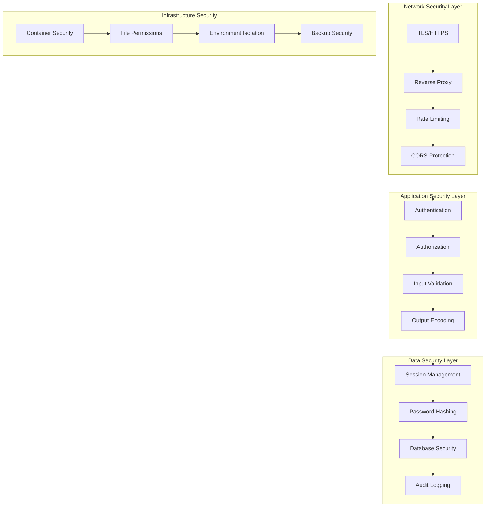

# Security Best Practices Guide

## Overview

This guide provides comprehensive security documentation for Campfire, covering authentication security, input validation, network security, and deployment best practices. The security model is inspired by Basecamp's security-conscious implementation while leveraging Rust's memory safety guarantees.

**Security Philosophy:**
- **Defense in Depth**: Multiple layers of security controls
- **Secure by Default**: Safe defaults that don't require configuration
- **Principle of Least Privilege**: Minimal permissions and access rights
- **Zero Trust**: Verify everything, trust nothing
- **Fail Securely**: Graceful degradation with security maintained

## Security Architecture



## Authentication Security

### Session Management Security

Campfire implements secure session management following industry best practices:

**Session Token Security:**
- **Cryptographically Secure**: 256 bits of entropy using `rand::thread_rng()`
- **URL-Safe Encoding**: Base64 URL-safe encoding prevents special character issues
- **Unpredictable**: No sequential or time-based patterns
- **Sufficient Length**: Minimum 32 characters after encoding

```rust
// Secure token generation (Critical Gap #4)
fn generate_secure_token() -> Result<String, AuthError> {
    let mut token_bytes = [0u8; 32];
    thread_rng().fill(&mut token_bytes);
    
    let token = base64::encode_config(&token_bytes, base64::URL_SAFE_NO_PAD);
    
    if token.len() < 32 {
        return Err(AuthError::TokenGeneration);
    }
    
    Ok(token)
}
```

**Session Storage Security:**
- **Database Storage**: Sessions stored in SQLite with automatic expiration
- **No Client-Side Storage**: Sensitive session data never stored in browser
- **Automatic Cleanup**: Expired sessions removed during validation
- **Secure Transmission**: Sessions only transmitted over HTTPS in production

**Session Lifecycle:**
1. **Creation**: Secure token generated on successful authentication
2. **Validation**: Token verified on each request with database lookup
3. **Expiration**: Configurable expiry (default: 24 hours)
4. **Revocation**: Immediate invalidation on logout or security events
5. **Cleanup**: Automatic removal of expired sessions

### Password Security

**Password Hashing:**
- **Algorithm**: bcrypt with cost factor 12 (Rails-compatible)
- **Salt**: Unique salt per password (built into bcrypt)
- **Timing Attack Protection**: Constant-time verification
- **Future-Proof**: Cost factor can be increased as hardware improves

```rust
use bcrypt::{hash, verify, DEFAULT_COST};

// Secure password hashing
let password_hash = hash(&password, DEFAULT_COST)?;

// Constant-time verification
if !verify(&password, &user.password_hash)? {
    return Err(AuthError::InvalidCredentials);
}
```

**Password Requirements:**
- **Minimum Length**: 8 characters (configurable)
- **No Maximum Length**: Passwords are hashed, length doesn't affect storage
- **Character Flexibility**: No forced complexity rules (user choice)
- **Common Password Protection**: Future enhancement planned

### Bot Authentication Security

**Bot Token Security:**
- **Format**: `{user_id}-{bot_token}` for easy identification
- **Token Generation**: 12 alphanumeric characters (62^12 combinations)
- **Scope Limitation**: Bot permissions limited to assigned rooms
- **Revocation**: Immediate token invalidation capability

**Bot Security Best Practices:**
- Treat bot tokens like passwords
- Rotate tokens regularly
- Use HTTPS for all bot API calls
- Implement rate limiting for bot requests
- Monitor bot activity for anomalies

## Input Validation and Sanitization

### Message Content Security

**HTML Sanitization:**
```rust
use ammonia::Builder;

fn sanitize_message_content(content: &str) -> String {
    Builder::default()
        .tags(hashset!["b", "i", "em", "strong", "a"])
        .link_rel(Some("nofollow noopener"))
        .clean(content)
        .to_string()
}
```

**Validation Rules:**
- **Length Limits**: 1-10,000 characters per message
- **HTML Sanitization**: Only safe tags allowed (b, i, em, strong, a)
- **Link Safety**: External links get `rel="nofollow noopener"`
- **Script Prevention**: All script tags and event handlers removed
- **XSS Protection**: Comprehensive output encoding

### API Input Validation

**Request Validation:**
- **JSON Schema**: Structured validation for all API endpoints
- **Type Safety**: Rust's type system prevents many injection attacks
- **Size Limits**: Maximum request body size (16MB default)
- **Rate Limiting**: Per-IP and per-user request limits

```rust
#[derive(Deserialize, Validate)]
pub struct CreateMessageRequest {
    #[validate(length(min = 1, max = 10000))]
    pub content: String,
    
    #[validate(custom = "validate_uuid")]
    pub client_message_id: String,
}
```

### File Upload Security (Future Feature)

**Planned Security Measures:**
- **File Type Validation**: Whitelist of allowed MIME types
- **Size Limits**: Maximum file size per upload and per user
- **Virus Scanning**: Integration with antivirus engines
- **Content Scanning**: Check for malicious content in files
- **Storage Isolation**: Uploaded files stored outside web root

## Network Security and TLS Configuration

### HTTPS/TLS Configuration

**TLS Requirements:**
- **Minimum Version**: TLS 1.2 (TLS 1.3 preferred)
- **Certificate Validation**: Valid certificates from trusted CAs
- **HSTS**: HTTP Strict Transport Security headers
- **Perfect Forward Secrecy**: Ephemeral key exchange

**Reverse Proxy Configuration (nginx example):**
```nginx
server {
    listen 443 ssl http2;
    server_name campfire.example.com;
    
    # TLS Configuration
    ssl_certificate /path/to/certificate.pem;
    ssl_certificate_key /path/to/private-key.pem;
    ssl_protocols TLSv1.2 TLSv1.3;
    ssl_ciphers ECDHE-ECDSA-AES128-GCM-SHA256:ECDHE-RSA-AES128-GCM-SHA256;
    ssl_prefer_server_ciphers off;
    
    # Security Headers
    add_header Strict-Transport-Security "max-age=31536000; includeSubDomains" always;
    add_header X-Content-Type-Options nosniff always;
    add_header X-Frame-Options DENY always;
    add_header X-XSS-Protection "1; mode=block" always;
    add_header Referrer-Policy "strict-origin-when-cross-origin" always;
    
    # Proxy to Campfire
    location / {
        proxy_pass http://127.0.0.1:3000;
        proxy_http_version 1.1;
        proxy_set_header Upgrade $http_upgrade;
        proxy_set_header Connection 'upgrade';
        proxy_set_header Host $host;
        proxy_set_header X-Real-IP $remote_addr;
        proxy_set_header X-Forwarded-For $proxy_add_x_forwarded_for;
        proxy_set_header X-Forwarded-Proto $scheme;
        proxy_cache_bypass $http_upgrade;
    }
}
```

### WebSocket Security

**WebSocket Protection:**
- **Origin Validation**: Check Origin header against allowed domains
- **Authentication**: Require valid session token for WebSocket connections
- **Rate Limiting**: Limit message frequency per connection
- **Connection Limits**: Maximum connections per user/IP

```rust
// WebSocket authentication
async fn authenticate_websocket(
    headers: &HeaderMap,
    auth_service: &AuthService,
) -> Result<User, AuthError> {
    let token = extract_session_token_from_headers(headers)?;
    auth_service.validate_session(token).await
}
```

## Security Headers and CSRF Protection

### Security Headers Implementation

Campfire automatically sets comprehensive security headers:

```rust
pub fn create_security_headers_layer() -> SetResponseHeaderLayer<HeaderValue> {
    // Multiple security headers would be set in a full implementation
    SetResponseHeaderLayer::overriding(
        header::X_CONTENT_TYPE_OPTIONS,
        HeaderValue::from_static("nosniff"),
    )
}
```

**Complete Security Headers:**
- **X-Content-Type-Options**: `nosniff` - Prevents MIME type sniffing
- **X-Frame-Options**: `DENY` - Prevents clickjacking attacks
- **X-XSS-Protection**: `1; mode=block` - Enables XSS filtering
- **Referrer-Policy**: `strict-origin-when-cross-origin` - Controls referrer information
- **Content-Security-Policy**: Restricts resource loading sources
- **Strict-Transport-Security**: Forces HTTPS connections

### CSRF Protection

**CSRF Mitigation Strategies:**
1. **SameSite Cookies**: `SameSite=Strict` for session cookies
2. **Origin Validation**: Check Origin/Referer headers
3. **Custom Headers**: Require X-Requested-With header for AJAX
4. **Token-Based**: CSRF tokens for state-changing operations (future)

```rust
// CSRF protection middleware (conceptual)
pub async fn csrf_protection(
    request: Request<Body>,
    next: Next<Body>,
) -> Result<Response, StatusCode> {
    if is_state_changing_request(&request) {
        validate_csrf_token(&request)?;
    }
    Ok(next.run(request).await)
}
```

## Rate Limiting and DDoS Protection

### Application-Level Rate Limiting

**Rate Limiting Configuration:**
```rust
pub struct SecurityConfig {
    pub rate_limit_rpm: u32,  // Requests per minute
    // ... other config
}
```

**Rate Limiting Strategies:**
- **Per-IP Limiting**: Prevent abuse from single IP addresses
- **Per-User Limiting**: Prevent authenticated user abuse
- **Endpoint-Specific**: Different limits for different operations
- **Sliding Window**: More accurate than fixed-window limiting

**Implementation with tower-governor:**
```rust
use tower_governor::{GovernorLayer, GovernorConfigBuilder};

let governor_conf = GovernorConfigBuilder::default()
    .per_minute(config.security.rate_limit_rpm)
    .burst_size(10)
    .finish()
    .unwrap();

app.layer(GovernorLayer {
    config: Arc::new(governor_conf),
})
```

### DDoS Protection

**Application-Level Protection:**
- **Connection Limits**: Maximum concurrent connections
- **Request Size Limits**: Prevent large payload attacks
- **Timeout Protection**: Request timeout to prevent slowloris attacks
- **Resource Limits**: Memory and CPU usage monitoring

**Infrastructure-Level Protection:**
- **Reverse Proxy**: nginx/Caddy for connection handling
- **CDN/WAF**: Cloudflare, AWS WAF for traffic filtering
- **Load Balancing**: Distribute traffic across instances
- **Geographic Filtering**: Block traffic from suspicious regions

## Database Security

### SQLite Security Configuration

**Database Security Settings:**
```rust
pub struct DatabaseConfig {
    pub enable_wal_mode: bool,  // Better concurrency and crash recovery
    pub connection_timeout_secs: u64,  // Prevent connection exhaustion
    pub max_connections: u32,  // Connection pool limits
}
```

**Security Measures:**
- **WAL Mode**: Better crash recovery and concurrent access
- **Connection Pooling**: Prevent connection exhaustion attacks
- **Prepared Statements**: All queries use prepared statements (SQL injection prevention)
- **File Permissions**: Database file readable only by application user
- **Backup Encryption**: Encrypted backups for sensitive data

### SQL Injection Prevention

**Rust's Built-in Protection:**
- **Type Safety**: Rust's type system prevents many injection attacks
- **Prepared Statements**: All database queries use prepared statements
- **Parameter Binding**: User input never concatenated into SQL strings

```rust
// Safe database query with parameter binding
sqlx::query_as!(
    Message,
    "SELECT * FROM messages WHERE room_id = ? AND creator_id = ?",
    room_id.0,
    user_id.0
)
.fetch_all(&db.pool)
.await
```

### Data Encryption

**Encryption at Rest:**
- **Database Encryption**: SQLite encryption extensions (future)
- **File System Encryption**: Full disk encryption recommended
- **Backup Encryption**: Encrypted backup storage
- **Key Management**: Secure key storage and rotation

**Encryption in Transit:**
- **TLS**: All network communication encrypted
- **WebSocket Security**: WSS (WebSocket Secure) for real-time communication
- **API Security**: HTTPS for all API endpoints

## Container and Deployment Security

### Docker Security

**Container Security Best Practices:**
```dockerfile
# Use non-root user
RUN useradd -m -u 1001 campfire
USER campfire

# Minimal base image
FROM debian:bookworm-slim

# Remove unnecessary packages
RUN apt-get update && apt-get install -y \
    ca-certificates \
    sqlite3 \
    curl \
    && rm -rf /var/lib/apt/lists/*

# Set secure file permissions
RUN chown -R campfire:campfire /app
```

**Security Features:**
- **Non-Root User**: Application runs as unprivileged user
- **Minimal Image**: Only necessary packages installed
- **Read-Only Filesystem**: Application files mounted read-only
- **Resource Limits**: CPU and memory limits set
- **Health Checks**: Regular health monitoring

### File System Security

**File Permissions:**
```bash
# Application binary
chmod 755 /app/campfire-on-rust

# Database file
chmod 600 /app/data/campfire.db

# Log files
chmod 644 /app/logs/*.log

# Configuration files
chmod 600 /app/.env.production
```

**Directory Structure:**
```
/app/
├── campfire-on-rust (755, campfire:campfire)
├── data/ (700, campfire:campfire)
│   └── campfire.db (600, campfire:campfire)
├── logs/ (755, campfire:campfire)
│   └── campfire.log (644, campfire:campfire)
└── backups/ (700, campfire:campfire)
```

### Environment Security

**Environment Variable Security:**
- **Sensitive Data**: Store secrets in environment variables, not code
- **Secret Management**: Use Docker secrets or Kubernetes secrets
- **Environment Isolation**: Separate environments for dev/staging/production
- **Access Control**: Limit access to production environment variables

**Secure Environment Configuration:**
```bash
# Production environment variables
CAMPFIRE_FORCE_HTTPS=true
CAMPFIRE_TRUST_PROXY=true
CAMPFIRE_CORS_ORIGINS=https://campfire.yourdomain.com
CAMPFIRE_LOG_LEVEL=info
CAMPFIRE_LOG_FORMAT=json
CAMPFIRE_TRACE_REQUESTS=false
```

## Monitoring and Incident Response

### Security Monitoring

**Audit Logging:**
- **Authentication Events**: Login attempts, failures, logouts
- **Authorization Events**: Permission denials, privilege escalations
- **Data Access**: Sensitive data access and modifications
- **System Events**: Configuration changes, errors, crashes

**Log Format:**
```json
{
  "timestamp": "2024-01-15T10:30:00Z",
  "level": "WARN",
  "event": "authentication_failure",
  "user_email": "user@example.com",
  "ip_address": "192.168.1.100",
  "user_agent": "Mozilla/5.0...",
  "reason": "invalid_password"
}
```

### Metrics and Alerting

**Security Metrics:**
- **Failed Login Attempts**: Rate of authentication failures
- **Rate Limit Violations**: Requests blocked by rate limiting
- **Error Rates**: Application and database errors
- **Response Times**: Performance degradation indicators

**Alerting Thresholds:**
- **High Error Rate**: >5% error rate for 5 minutes
- **Authentication Failures**: >10 failures per minute from single IP
- **Rate Limit Violations**: >100 violations per minute
- **Database Errors**: Any database connection failures

### Incident Response

**Security Incident Response Plan:**

1. **Detection**: Automated monitoring and manual reporting
2. **Assessment**: Determine severity and impact
3. **Containment**: Isolate affected systems
4. **Eradication**: Remove threats and vulnerabilities
5. **Recovery**: Restore normal operations
6. **Lessons Learned**: Post-incident review and improvements

**Emergency Procedures:**
- **Account Lockout**: Disable compromised user accounts
- **Session Revocation**: Invalidate all sessions for affected users
- **IP Blocking**: Block malicious IP addresses
- **Service Shutdown**: Emergency shutdown procedures

## Security Testing

### Automated Security Testing

**Static Analysis:**
```bash
# Rust security audit
cargo audit

# Dependency vulnerability scanning
cargo deny check

# Code quality and security lints
cargo clippy -- -D warnings
```

**Dynamic Testing:**
- **Penetration Testing**: Regular security assessments
- **Vulnerability Scanning**: Automated vulnerability detection
- **Fuzzing**: Input fuzzing for robustness testing
- **Load Testing**: Performance under stress conditions

### Security Test Cases

**Authentication Testing:**
- **Brute Force Protection**: Test rate limiting effectiveness
- **Session Management**: Test session timeout and revocation
- **Password Security**: Test password hashing and validation
- **Token Security**: Test token generation and validation

**Input Validation Testing:**
- **XSS Prevention**: Test HTML sanitization
- **SQL Injection**: Test prepared statement protection
- **File Upload**: Test file type and size validation
- **API Validation**: Test request validation and error handling

## Compliance and Standards

### Security Standards Compliance

**Industry Standards:**
- **OWASP Top 10**: Protection against common web vulnerabilities
- **NIST Cybersecurity Framework**: Comprehensive security controls
- **ISO 27001**: Information security management
- **SOC 2**: Security, availability, and confidentiality controls

**Privacy Regulations:**
- **GDPR**: European data protection regulation
- **CCPA**: California consumer privacy act
- **PIPEDA**: Canadian privacy legislation
- **Data Minimization**: Collect only necessary data

### Security Checklist

**Pre-Deployment Security Checklist:**

- [ ] **Authentication**: Secure session management implemented
- [ ] **Authorization**: Proper access controls in place
- [ ] **Input Validation**: All inputs validated and sanitized
- [ ] **Output Encoding**: All outputs properly encoded
- [ ] **HTTPS**: TLS configured with strong ciphers
- [ ] **Security Headers**: All security headers implemented
- [ ] **Rate Limiting**: Request rate limiting configured
- [ ] **Logging**: Security events logged and monitored
- [ ] **Error Handling**: Secure error messages (no information disclosure)
- [ ] **Dependencies**: All dependencies scanned for vulnerabilities
- [ ] **Configuration**: Secure configuration settings applied
- [ ] **Backup**: Secure backup and recovery procedures
- [ ] **Monitoring**: Security monitoring and alerting configured
- [ ] **Documentation**: Security procedures documented
- [ ] **Training**: Team trained on security procedures

## Security Configuration Examples

### Production Security Configuration

**Environment Variables:**
```bash
# Security settings
CAMPFIRE_FORCE_HTTPS=true
CAMPFIRE_TRUST_PROXY=true
CAMPFIRE_CORS_ORIGINS=https://campfire.yourdomain.com
CAMPFIRE_RATE_LIMIT_RPM=120
CAMPFIRE_SESSION_EXPIRY_HOURS=8

# Logging for security monitoring
CAMPFIRE_LOG_LEVEL=info
CAMPFIRE_LOG_FORMAT=json
CAMPFIRE_LOG_STRUCTURED=true
CAMPFIRE_TRACE_REQUESTS=false

# Database security
CAMPFIRE_DB_WAL_MODE=true
CAMPFIRE_DB_MAX_CONNECTIONS=20
```

**Docker Compose Security:**
```yaml
version: '3.8'
services:
  campfire:
    image: campfire:latest
    user: "1001:1001"
    read_only: true
    tmpfs:
      - /tmp
    volumes:
      - campfire_data:/app/data:rw
      - campfire_logs:/app/logs:rw
      - campfire_backups:/app/backups:rw
    environment:
      - CAMPFIRE_FORCE_HTTPS=true
      - CAMPFIRE_TRUST_PROXY=true
    deploy:
      resources:
        limits:
          memory: 512M
          cpus: '0.5'
    healthcheck:
      test: ["CMD", "/app/healthcheck.sh"]
      interval: 30s
      timeout: 10s
      retries: 3
```

### Development Security Configuration

**Development Environment:**
```bash
# Relaxed settings for development
CAMPFIRE_FORCE_HTTPS=false
CAMPFIRE_CORS_ORIGINS=
CAMPFIRE_RATE_LIMIT_RPM=300
CAMPFIRE_LOG_LEVEL=debug
CAMPFIRE_TRACE_REQUESTS=true
```

**Security Testing:**
```bash
# Enable additional security testing
CAMPFIRE_SECURITY_TESTING=true
CAMPFIRE_AUDIT_LOGGING=true
CAMPFIRE_VERBOSE_ERRORS=true
```

## Troubleshooting Security Issues

### Common Security Issues

**Authentication Problems:**
1. **Session Expired Errors**
   - Check system clock synchronization
   - Verify session expiry configuration
   - Ensure database timezone is UTC

2. **CORS Errors**
   - Configure `CAMPFIRE_CORS_ORIGINS` properly
   - Check preflight request handling
   - Verify Origin header in requests

3. **Rate Limiting Issues**
   - Check rate limit configuration
   - Verify IP address detection
   - Monitor rate limit metrics

**TLS/HTTPS Issues:**
1. **Certificate Errors**
   - Verify certificate validity and chain
   - Check certificate expiration
   - Ensure proper certificate installation

2. **Mixed Content Warnings**
   - Ensure all resources loaded over HTTPS
   - Check for HTTP links in content
   - Configure proper CSP headers

### Security Debugging

**Debug Logging:**
```bash
# Enable security debug logging
CAMPFIRE_LOG_LEVEL=debug
RUST_LOG=campfire_on_rust=debug,tower_http=debug
```

**Security Audit Commands:**
```bash
# Check for security vulnerabilities
cargo audit

# Scan dependencies
cargo deny check advisories

# Security-focused clippy lints
cargo clippy -- -W clippy::all -W clippy::pedantic -W clippy::security
```

**Database Security Check:**
```sql
-- Check session security
SELECT COUNT(*) as active_sessions FROM sessions WHERE expires_at > datetime('now');

-- Check for suspicious activity
SELECT user_id, COUNT(*) as login_attempts 
FROM auth_logs 
WHERE event = 'login_failure' 
  AND created_at > datetime('now', '-1 hour')
GROUP BY user_id 
HAVING COUNT(*) > 10;
```

---

**Security Contact**: For security issues, please contact the security team at security@campfire.local or create a private security advisory on GitHub.

**Security Updates**: This guide is updated regularly. Check the documentation for the latest security recommendations and best practices.