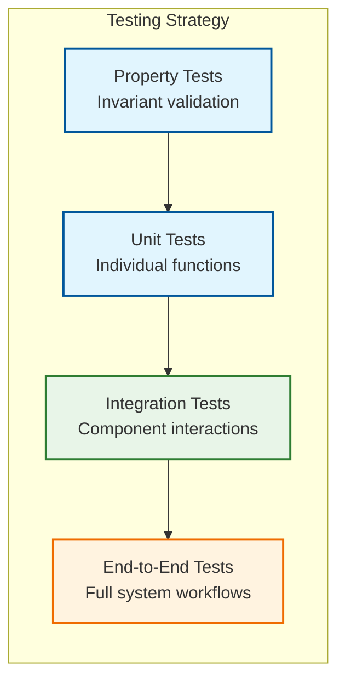

# Testing Guide

## Overview

This guide provides comprehensive testing strategies and examples for the Campfire Rust rewrite, inspired by Basecamp's thorough testing practices. Our testing philosophy emphasizes correctness through types, executable specifications, and comprehensive coverage of all system behaviors.

## Testing Philosophy

### Core Principles

- **Test-Driven Development**: Write tests before implementation to drive design
- **Executable Specifications**: Tests serve as living documentation of system behavior
- **Property-Based Testing**: Validate invariants across the entire input space
- **Integration Testing**: Test real system interactions, not just isolated units
- **Performance Contracts**: Validate timing and resource constraints

### Testing Pyramid



## Test Organization

### Directory Structure

```
tests/
├── unit/                    # Unit tests for individual components
│   ├── services/           # Service layer tests
│   ├── handlers/           # HTTP handler tests
│   └── models/             # Data model tests
├── integration/            # Integration tests with real dependencies
│   ├── database/           # Database integration tests
│   ├── websocket/          # WebSocket integration tests
│   └── api/                # API endpoint tests
├── property/               # Property-based tests
│   ├── message_invariants.rs
│   └── user_invariants.rs
└── fixtures/               # Test data and utilities
    ├── test_data.rs
    └── test_helpers.rs
```
## Unit Testing Examples

### Service Layer Testing

#### Message Service Tests

```rust
// tests/unit/services/message_service_test.rs
use campfire::{
    services::{MessageService, MessageServiceImpl},
    models::{Message, UserId, RoomId, MessageError},
    repositories::MockMessageRepository,
};
use uuid::Uuid;
use tokio_test;

#[tokio::test]
async fn test_create_message_success() {
    // Arrange
    let mock_repo = MockMessageRepository::new();
    let service = MessageServiceImpl::new(Arc::new(mock_repo));
    
    let user_id = UserId::new();
    let room_id = RoomId::new();
    let content = "Hello, world!".to_string();
    let client_message_id = Uuid::new_v4();
    
    // Act
    let result = service.create_message_with_deduplication(
        content.clone(),
        room_id,
        user_id,
        client_message_id,
    ).await;
    
    // Assert
    assert!(result.is_ok());
    let message = result.unwrap();
    assert_eq!(message.content, content);
    assert_eq!(message.creator_id, user_id);
    assert_eq!(message.room_id, room_id);
    assert_eq!(message.client_message_id, client_message_id);
}

#[tokio::test]
async fn test_create_message_deduplication() {
    // Arrange
    let mock_repo = MockMessageRepository::new();
    let service = MessageServiceImpl::new(Arc::new(mock_repo));
    
    let user_id = UserId::new();
    let room_id = RoomId::new();
    let client_message_id = Uuid::new_v4();
    
    // Act - Create first message
    let result1 = service.create_message_with_deduplication(
        "First message".to_string(),
        room_id,
        user_id,
        client_message_id,
    ).await.unwrap();
    
    // Act - Create second message with same client_message_id
    let result2 = service.create_message_with_deduplication(
        "Second message".to_string(),
        room_id,
        user_id,
        client_message_id,
    ).await.unwrap();
    
    // Assert - Should return the same message (deduplication)
    assert_eq!(result1.id, result2.id);
    assert_eq!(result1.content, "First message"); // Original content preserved
    assert_eq!(result2.content, "First message");
}

#[tokio::test]
async fn test_create_message_validation_errors() {
    let mock_repo = MockMessageRepository::new();
    let service = MessageServiceImpl::new(Arc::new(mock_repo));
    
    let user_id = UserId::new();
    let room_id = RoomId::new();
    let client_message_id = Uuid::new_v4();
    
    // Test empty content
    let result = service.create_message_with_deduplication(
        "".to_string(),
        room_id,
        user_id,
        client_message_id,
    ).await;
    
    assert!(matches!(result, Err(MessageError::ContentTooShort { .. })));
    
    // Test content too long
    let long_content = "a".repeat(10001);
    let result = service.create_message_with_deduplication(
        long_content,
        room_id,
        user_id,
        client_message_id,
    ).await;
    
    assert!(matches!(result, Err(MessageError::ContentTooLong { .. })));
}
```

#### Authentication Service Tests

```rust
// tests/unit/services/auth_service_test.rs
use campfire::{
    services::{AuthService, AuthServiceImpl},
    models::{User, AuthError, Session},
    repositories::MockUserRepository,
};
use bcrypt;

#[tokio::test]
async fn test_authenticate_success() {
    // Arrange
    let mock_repo = MockUserRepository::new();
    let service = AuthServiceImpl::new(Arc::new(mock_repo.clone()));
    
    let email = "test@example.com".to_string();
    let password = "secure_password".to_string();
    let password_hash = bcrypt::hash(&password, bcrypt::DEFAULT_COST).unwrap();
    
    let user = User {
        id: UserId::new(),
        name: "Test User".to_string(),
        email: email.clone(),
        password_hash,
        bio: None,
        admin: false,
        bot_token: None,
        created_at: Utc::now(),
    };
    
    mock_repo.add_user(user.clone()).await;
    
    // Act
    let result = service.authenticate(email, password).await;
    
    // Assert
    assert!(result.is_ok());
    let session = result.unwrap();
    assert_eq!(session.user_id, user.id);
    assert!(!session.token.is_empty());
}

#[tokio::test]
async fn test_authenticate_invalid_credentials() {
    let mock_repo = MockUserRepository::new();
    let service = AuthServiceImpl::new(Arc::new(mock_repo));
    
    // Act
    let result = service.authenticate(
        "nonexistent@example.com".to_string(),
        "wrong_password".to_string(),
    ).await;
    
    // Assert
    assert!(matches!(result, Err(AuthError::InvalidCredentials)));
}

#[tokio::test]
async fn test_session_token_security() {
    let mock_repo = MockUserRepository::new();
    let service = AuthServiceImpl::new(Arc::new(mock_repo));
    
    let user_id = UserId::new();
    
    // Create multiple sessions
    let session1 = service.create_session(user_id).await.unwrap();
    let session2 = service.create_session(user_id).await.unwrap();
    
    // Assert tokens are unique and sufficiently long
    assert_ne!(session1.token, session2.token);
    assert!(session1.token.len() >= 32); // Minimum entropy requirement
    assert!(session2.token.len() >= 32);
    
    // Assert tokens are cryptographically secure (basic entropy check)
    let token_bytes = session1.token.as_bytes();
    let unique_bytes: std::collections::HashSet<_> = token_bytes.iter().collect();
    assert!(unique_bytes.len() > token_bytes.len() / 4); // At least 25% unique characters
}
```#
## Handler Testing

#### HTTP Handler Tests

```rust
// tests/unit/handlers/message_handlers_test.rs
use axum::{
    body::Body,
    http::{Request, StatusCode},
    response::Response,
};
use axum_test::TestServer;
use campfire::{
    handlers::create_app,
    models::{AppState, CreateMessageRequest},
};
use serde_json;

#[tokio::test]
async fn test_create_message_handler_success() {
    // Arrange
    let app_state = create_test_app_state().await;
    let app = create_app(app_state);
    let server = TestServer::new(app).unwrap();
    
    let room_id = RoomId::new();
    let request_body = CreateMessageRequest {
        content: "Test message".to_string(),
        client_message_id: Uuid::new_v4(),
    };
    
    // Act
    let response = server
        .post(&format!("/api/rooms/{}/messages", room_id.0))
        .json(&request_body)
        .await;
    
    // Assert
    response.assert_status(StatusCode::CREATED);
    
    let message: Message = response.json();
    assert_eq!(message.content, request_body.content);
    assert_eq!(message.client_message_id, request_body.client_message_id);
}

#[tokio::test]
async fn test_create_message_handler_validation_error() {
    let app_state = create_test_app_state().await;
    let app = create_app(app_state);
    let server = TestServer::new(app).unwrap();
    
    let room_id = RoomId::new();
    let request_body = CreateMessageRequest {
        content: "".to_string(), // Empty content should fail validation
        client_message_id: Uuid::new_v4(),
    };
    
    // Act
    let response = server
        .post(&format!("/api/rooms/{}/messages", room_id.0))
        .json(&request_body)
        .await;
    
    // Assert
    response.assert_status(StatusCode::BAD_REQUEST);
    
    let error_response: ErrorResponse = response.json();
    assert!(error_response.message.contains("Content too short"));
}

#[tokio::test]
async fn test_get_messages_handler_pagination() {
    let app_state = create_test_app_state().await;
    let app = create_app(app_state.clone());
    let server = TestServer::new(app).unwrap();
    
    let room_id = RoomId::new();
    
    // Create test messages
    for i in 0..25 {
        let request_body = CreateMessageRequest {
            content: format!("Test message {}", i),
            client_message_id: Uuid::new_v4(),
        };
        
        server
            .post(&format!("/api/rooms/{}/messages", room_id.0))
            .json(&request_body)
            .await
            .assert_status(StatusCode::CREATED);
    }
    
    // Act - Get first page
    let response = server
        .get(&format!("/api/rooms/{}/messages?limit=10", room_id.0))
        .await;
    
    // Assert
    response.assert_status(StatusCode::OK);
    
    let messages: Vec<Message> = response.json();
    assert_eq!(messages.len(), 10);
    
    // Messages should be ordered by creation time (newest first)
    for i in 1..messages.len() {
        assert!(messages[i-1].created_at >= messages[i].created_at);
    }
}
```

#### Authentication Handler Tests

```rust
// tests/unit/handlers/auth_handlers_test.rs
use axum_test::TestServer;
use campfire::{
    handlers::create_app,
    models::{LoginRequest, LoginResponse, AppState},
};

#[tokio::test]
async fn test_login_handler_success() {
    // Arrange
    let app_state = create_test_app_state().await;
    let app = create_app(app_state.clone());
    let server = TestServer::new(app).unwrap();
    
    // Create test user
    let user = create_test_user(&app_state).await;
    
    let login_request = LoginRequest {
        email: user.email.clone(),
        password: "test_password".to_string(),
    };
    
    // Act
    let response = server
        .post("/api/auth/login")
        .json(&login_request)
        .await;
    
    // Assert
    response.assert_status(StatusCode::OK);
    
    let login_response: LoginResponse = response.json();
    assert_eq!(login_response.user.id, user.id);
    assert_eq!(login_response.user.email, user.email);
    assert!(!login_response.session_token.is_empty());
    
    // Verify session cookie is set
    let cookies = response.cookies();
    assert!(cookies.iter().any(|cookie| cookie.name() == "session_token"));
}

#[tokio::test]
async fn test_logout_handler() {
    let app_state = create_test_app_state().await;
    let app = create_app(app_state.clone());
    let server = TestServer::new(app).unwrap();
    
    // Login first to get session token
    let user = create_test_user(&app_state).await;
    let login_response = login_user(&server, &user).await;
    
    // Act - Logout
    let response = server
        .post("/api/auth/logout")
        .add_header("Authorization", format!("Bearer {}", login_response.session_token))
        .await;
    
    // Assert
    response.assert_status(StatusCode::OK);
    
    // Verify session is invalidated
    let protected_response = server
        .get("/api/users/me")
        .add_header("Authorization", format!("Bearer {}", login_response.session_token))
        .await;
    
    protected_response.assert_status(StatusCode::UNAUTHORIZED);
}
```## In
tegration Testing

### Database Integration Tests

```rust
// tests/integration/database/message_repository_test.rs
use campfire::{
    repositories::{MessageRepository, SqliteMessageRepository},
    models::{Message, UserId, RoomId},
    database::create_test_database,
};
use sqlx::SqlitePool;

#[tokio::test]
async fn test_message_repository_crud_operations() {
    // Arrange
    let pool = create_test_database().await;
    let repo = SqliteMessageRepository::new(pool.clone());
    
    let user_id = UserId::new();
    let room_id = RoomId::new();
    let client_message_id = Uuid::new_v4();
    
    let message = Message {
        id: MessageId::new(),
        room_id,
        creator_id: user_id,
        content: "Test message".to_string(),
        client_message_id,
        created_at: Utc::now(),
    };
    
    // Act & Assert - Create
    let saved_message = repo.save(&message).await.unwrap();
    assert_eq!(saved_message.id, message.id);
    assert_eq!(saved_message.content, message.content);
    
    // Act & Assert - Read
    let retrieved_message = repo.find_by_id(message.id).await.unwrap().unwrap();
    assert_eq!(retrieved_message.id, message.id);
    assert_eq!(retrieved_message.content, message.content);
    
    // Act & Assert - Update
    let updated_content = "Updated message".to_string();
    let mut updated_message = retrieved_message.clone();
    updated_message.content = updated_content.clone();
    
    repo.update(&updated_message).await.unwrap();
    let retrieved_updated = repo.find_by_id(message.id).await.unwrap().unwrap();
    assert_eq!(retrieved_updated.content, updated_content);
    
    // Act & Assert - Delete
    let deleted = repo.delete(message.id).await.unwrap();
    assert!(deleted);
    
    let not_found = repo.find_by_id(message.id).await.unwrap();
    assert!(not_found.is_none());
}

#[tokio::test]
async fn test_message_deduplication_constraint() {
    let pool = create_test_database().await;
    let repo = SqliteMessageRepository::new(pool);
    
    let user_id = UserId::new();
    let room_id = RoomId::new();
    let client_message_id = Uuid::new_v4();
    
    let message1 = Message {
        id: MessageId::new(),
        room_id,
        creator_id: user_id,
        content: "First message".to_string(),
        client_message_id,
        created_at: Utc::now(),
    };
    
    let message2 = Message {
        id: MessageId::new(),
        room_id,
        creator_id: user_id,
        content: "Second message".to_string(),
        client_message_id, // Same client_message_id
        created_at: Utc::now(),
    };
    
    // Act
    let saved1 = repo.save(&message1).await.unwrap();
    let result2 = repo.save(&message2).await;
    
    // Assert - Second save should return existing message due to deduplication
    match result2 {
        Ok(existing_message) => {
            assert_eq!(existing_message.id, saved1.id);
            assert_eq!(existing_message.content, "First message"); // Original content preserved
        }
        Err(_) => panic!("Expected deduplication to return existing message, not error"),
    }
}

#[tokio::test]
async fn test_message_search_integration() {
    let pool = create_test_database().await;
    let repo = SqliteMessageRepository::new(pool);
    
    let user_id = UserId::new();
    let room_id = RoomId::new();
    
    // Create test messages
    let messages = vec![
        "Hello world",
        "Rust is awesome",
        "Testing search functionality",
        "Hello Rust developers",
        "World peace through code",
    ];
    
    for (i, content) in messages.iter().enumerate() {
        let message = Message {
            id: MessageId::new(),
            room_id,
            creator_id: user_id,
            content: content.to_string(),
            client_message_id: Uuid::new_v4(),
            created_at: Utc::now() + chrono::Duration::seconds(i as i64),
        };
        repo.save(&message).await.unwrap();
    }
    
    // Act - Search for "Hello"
    let search_results = repo.search("Hello", room_id, 10).await.unwrap();
    
    // Assert
    assert_eq!(search_results.len(), 2);
    assert!(search_results.iter().any(|m| m.content.contains("Hello world")));
    assert!(search_results.iter().any(|m| m.content.contains("Hello Rust")));
    
    // Act - Search for "Rust"
    let rust_results = repo.search("Rust", room_id, 10).await.unwrap();
    
    // Assert
    assert_eq!(rust_results.len(), 2);
    assert!(rust_results.iter().any(|m| m.content.contains("Rust is awesome")));
    assert!(rust_results.iter().any(|m| m.content.contains("Hello Rust")));
}
```

### API Integration Tests

```rust
// tests/integration/api/message_api_test.rs
use axum_test::TestServer;
use campfire::{
    handlers::create_app,
    models::{AppState, CreateMessageRequest, Message},
    database::create_test_database,
};

#[tokio::test]
async fn test_complete_message_flow() {
    // Arrange - Set up real database and app
    let pool = create_test_database().await;
    let app_state = AppState::new(pool).await;
    let app = create_app(app_state.clone());
    let server = TestServer::new(app).unwrap();
    
    // Create test user and room
    let user = create_test_user(&app_state).await;
    let room = create_test_room(&app_state, user.id).await;
    let session = login_user(&server, &user).await;
    
    // Act - Create message via API
    let create_request = CreateMessageRequest {
        content: "Integration test message".to_string(),
        client_message_id: Uuid::new_v4(),
    };
    
    let create_response = server
        .post(&format!("/api/rooms/{}/messages", room.id.0))
        .add_header("Authorization", format!("Bearer {}", session.session_token))
        .json(&create_request)
        .await;
    
    // Assert - Message created successfully
    create_response.assert_status(StatusCode::CREATED);
    let created_message: Message = create_response.json();
    assert_eq!(created_message.content, create_request.content);
    assert_eq!(created_message.room_id, room.id);
    assert_eq!(created_message.creator_id, user.id);
    
    // Act - Retrieve messages via API
    let get_response = server
        .get(&format!("/api/rooms/{}/messages", room.id.0))
        .add_header("Authorization", format!("Bearer {}", session.session_token))
        .await;
    
    // Assert - Message appears in room messages
    get_response.assert_status(StatusCode::OK);
    let messages: Vec<Message> = get_response.json();
    assert_eq!(messages.len(), 1);
    assert_eq!(messages[0].id, created_message.id);
    assert_eq!(messages[0].content, create_request.content);
    
    // Act - Search for message via API
    let search_response = server
        .get(&format!("/api/search?q={}", "Integration"))
        .add_header("Authorization", format!("Bearer {}", session.session_token))
        .await;
    
    // Assert - Message found in search results
    search_response.assert_status(StatusCode::OK);
    let search_results: Vec<Message> = search_response.json();
    assert_eq!(search_results.len(), 1);
    assert_eq!(search_results[0].id, created_message.id);
}
```## We
bSocket Testing Strategies

### WebSocket Connection Testing

```rust
// tests/integration/websocket/connection_test.rs
use campfire::{
    websocket::{WebSocketHandler, WebSocketMessage, ConnectionManager},
    models::{UserId, RoomId, ConnectionId},
};
use tokio_tungstenite::{connect_async, tungstenite::Message};
use futures_util::{SinkExt, StreamExt};

#[tokio::test]
async fn test_websocket_connection_lifecycle() {
    // Arrange
    let server = start_test_server().await;
    let user = create_test_user(&server.app_state).await;
    let session = create_test_session(&server.app_state, user.id).await;
    
    let ws_url = format!("ws://localhost:{}/ws?token={}", server.port, session.token);
    
    // Act - Connect to WebSocket
    let (ws_stream, _) = connect_async(&ws_url).await.unwrap();
    let (mut ws_sender, mut ws_receiver) = ws_stream.split();
    
    // Assert - Connection established
    let welcome_msg = ws_receiver.next().await.unwrap().unwrap();
    let welcome: WebSocketMessage = serde_json::from_str(&welcome_msg.to_string()).unwrap();
    
    match welcome {
        WebSocketMessage::Welcome { user_id } => {
            assert_eq!(user_id, user.id);
        }
        _ => panic!("Expected Welcome message"),
    }
    
    // Act - Send ping
    let ping_msg = WebSocketMessage::Ping { timestamp: Utc::now() };
    let ping_json = serde_json::to_string(&ping_msg).unwrap();
    ws_sender.send(Message::Text(ping_json)).await.unwrap();
    
    // Assert - Receive pong
    let pong_msg = ws_receiver.next().await.unwrap().unwrap();
    let pong: WebSocketMessage = serde_json::from_str(&pong_msg.to_string()).unwrap();
    
    match pong {
        WebSocketMessage::Pong { .. } => {
            // Success
        }
        _ => panic!("Expected Pong message"),
    }
    
    // Act - Close connection
    ws_sender.close().await.unwrap();
    
    // Assert - Connection closed gracefully
    assert!(ws_receiver.next().await.is_none());
}

#[tokio::test]
async fn test_websocket_message_broadcasting() {
    // Arrange - Set up two WebSocket connections
    let server = start_test_server().await;
    let user1 = create_test_user(&server.app_state).await;
    let user2 = create_test_user(&server.app_state).await;
    let room = create_test_room(&server.app_state, user1.id).await;
    
    // Add both users to the room
    add_user_to_room(&server.app_state, room.id, user2.id).await;
    
    let session1 = create_test_session(&server.app_state, user1.id).await;
    let session2 = create_test_session(&server.app_state, user2.id).await;
    
    // Connect both users via WebSocket
    let ws1 = connect_websocket(&server, &session1.token).await;
    let ws2 = connect_websocket(&server, &session2.token).await;
    
    // Join room for both connections
    join_room_via_websocket(&ws1, room.id).await;
    join_room_via_websocket(&ws2, room.id).await;
    
    // Act - User1 sends message via WebSocket
    let message_content = "Hello from WebSocket!";
    let send_msg = WebSocketMessage::SendMessage {
        room_id: room.id,
        content: message_content.to_string(),
        client_message_id: Uuid::new_v4(),
    };
    
    ws1.send(send_msg).await;
    
    // Assert - User2 receives the message
    let received_msg = ws2.receive().await;
    match received_msg {
        WebSocketMessage::NewMessage { message } => {
            assert_eq!(message.content, message_content);
            assert_eq!(message.creator_id, user1.id);
            assert_eq!(message.room_id, room.id);
        }
        _ => panic!("Expected NewMessage, got {:?}", received_msg),
    }
    
    // Assert - User1 also receives confirmation
    let confirmation_msg = ws1.receive().await;
    match confirmation_msg {
        WebSocketMessage::MessageSent { message_id } => {
            // Success - message was sent and confirmed
        }
        _ => panic!("Expected MessageSent confirmation"),
    }
}

#[tokio::test]
async fn test_websocket_presence_tracking() {
    let server = start_test_server().await;
    let user1 = create_test_user(&server.app_state).await;
    let user2 = create_test_user(&server.app_state).await;
    let room = create_test_room(&server.app_state, user1.id).await;
    
    add_user_to_room(&server.app_state, room.id, user2.id).await;
    
    let session1 = create_test_session(&server.app_state, user1.id).await;
    let session2 = create_test_session(&server.app_state, user2.id).await;
    
    // Act - User1 connects and joins room
    let ws1 = connect_websocket(&server, &session1.token).await;
    join_room_via_websocket(&ws1, room.id).await;
    
    // Act - User2 connects and joins room
    let ws2 = connect_websocket(&server, &session2.token).await;
    join_room_via_websocket(&ws2, room.id).await;
    
    // Assert - User1 receives presence update for User2
    let presence_msg = ws1.receive().await;
    match presence_msg {
        WebSocketMessage::PresenceUpdate { room_id, user_id, status } => {
            assert_eq!(room_id, room.id);
            assert_eq!(user_id, user2.id);
            assert_eq!(status, PresenceStatus::Online);
        }
        _ => panic!("Expected PresenceUpdate"),
    }
    
    // Act - User2 disconnects
    ws2.close().await;
    
    // Wait for presence timeout (60 seconds in production, shorter in tests)
    tokio::time::sleep(Duration::from_millis(100)).await;
    
    // Assert - User1 receives offline presence update
    let offline_msg = ws1.receive().await;
    match offline_msg {
        WebSocketMessage::PresenceUpdate { room_id, user_id, status } => {
            assert_eq!(room_id, room.id);
            assert_eq!(user_id, user2.id);
            assert_eq!(status, PresenceStatus::Offline);
        }
        _ => panic!("Expected offline PresenceUpdate"),
    }
}

#[tokio::test]
async fn test_websocket_reconnection_with_missed_messages() {
    let server = start_test_server().await;
    let user = create_test_user(&server.app_state).await;
    let room = create_test_room(&server.app_state, user.id).await;
    let session = create_test_session(&server.app_state, user.id).await;
    
    // Act - Initial connection
    let ws1 = connect_websocket(&server, &session.token).await;
    join_room_via_websocket(&ws1, room.id).await;
    
    // Get initial last_seen_message_id
    let last_seen = get_last_seen_message_id(&ws1).await;
    
    // Simulate connection drop
    ws1.close().await;
    
    // Create messages while user is disconnected (via HTTP API)
    let missed_messages = vec![
        "Message 1 while offline",
        "Message 2 while offline", 
        "Message 3 while offline",
    ];
    
    for content in &missed_messages {
        create_message_via_api(&server, room.id, user.id, content).await;
    }
    
    // Act - Reconnect
    let ws2 = connect_websocket(&server, &session.token).await;
    join_room_via_websocket(&ws2, room.id).await;
    
    // Send last_seen_message_id to request missed messages
    let catch_up_msg = WebSocketMessage::CatchUp {
        room_id: room.id,
        last_seen_message_id: last_seen,
    };
    ws2.send(catch_up_msg).await;
    
    // Assert - Receive all missed messages
    for expected_content in &missed_messages {
        let received_msg = ws2.receive().await;
        match received_msg {
            WebSocketMessage::NewMessage { message } => {
                assert_eq!(message.content, *expected_content);
                assert_eq!(message.room_id, room.id);
            }
            _ => panic!("Expected NewMessage with missed content"),
        }
    }
    
    // Assert - Receive catch-up complete message
    let complete_msg = ws2.receive().await;
    match complete_msg {
        WebSocketMessage::CatchUpComplete { room_id, message_count } => {
            assert_eq!(room_id, room.id);
            assert_eq!(message_count, missed_messages.len() as u32);
        }
        _ => panic!("Expected CatchUpComplete"),
    }
}
```### WebSo
cket Load Testing

```rust
// tests/integration/websocket/load_test.rs
use campfire::websocket::{WebSocketHandler, ConnectionManager};
use tokio::task::JoinSet;
use std::sync::Arc;
use std::sync::atomic::{AtomicU64, Ordering};

#[tokio::test]
async fn test_websocket_concurrent_connections() {
    let server = start_test_server().await;
    let room = create_test_room(&server.app_state, UserId::new()).await;
    
    let connection_count = 100;
    let messages_per_connection = 10;
    
    let mut join_set = JoinSet::new();
    let total_messages_sent = Arc::new(AtomicU64::new(0));
    let total_messages_received = Arc::new(AtomicU64::new(0));
    
    // Spawn concurrent WebSocket connections
    for i in 0..connection_count {
        let server_clone = server.clone();
        let room_id = room.id;
        let sent_counter = Arc::clone(&total_messages_sent);
        let received_counter = Arc::clone(&total_messages_received);
        
        join_set.spawn(async move {
            let user = create_test_user(&server_clone.app_state).await;
            let session = create_test_session(&server_clone.app_state, user.id).await;
            add_user_to_room(&server_clone.app_state, room_id, user.id).await;
            
            let ws = connect_websocket(&server_clone, &session.token).await;
            join_room_via_websocket(&ws, room_id).await;
            
            // Send messages
            for j in 0..messages_per_connection {
                let content = format!("Message {} from connection {}", j, i);
                let send_msg = WebSocketMessage::SendMessage {
                    room_id,
                    content,
                    client_message_id: Uuid::new_v4(),
                };
                
                ws.send(send_msg).await;
                sent_counter.fetch_add(1, Ordering::Relaxed);
            }
            
            // Receive messages from other connections
            let mut received_count = 0;
            let timeout = Duration::from_secs(30);
            let start_time = Instant::now();
            
            while start_time.elapsed() < timeout {
                if let Ok(msg) = tokio::time::timeout(Duration::from_millis(100), ws.receive()).await {
                    match msg {
                        WebSocketMessage::NewMessage { .. } => {
                            received_count += 1;
                            received_counter.fetch_add(1, Ordering::Relaxed);
                        }
                        _ => {} // Ignore other message types
                    }
                }
            }
            
            received_count
        });
    }
    
    // Wait for all connections to complete
    let mut total_received_by_connections = 0;
    while let Some(result) = join_set.join_next().await {
        total_received_by_connections += result.unwrap();
    }
    
    // Assert - All messages were sent and received
    let expected_total_messages = connection_count * messages_per_connection;
    assert_eq!(total_messages_sent.load(Ordering::Relaxed), expected_total_messages);
    
    // Each message should be received by all other connections
    let expected_total_received = expected_total_messages * (connection_count - 1);
    assert!(total_messages_received.load(Ordering::Relaxed) >= expected_total_received * 80 / 100); // Allow 20% tolerance for timing
}

#[tokio::test]
async fn test_websocket_connection_cleanup() {
    let server = start_test_server().await;
    let connection_manager = server.app_state.connection_manager.clone();
    
    let user_count = 50;
    let mut connections = Vec::new();
    
    // Create many connections
    for _ in 0..user_count {
        let user = create_test_user(&server.app_state).await;
        let session = create_test_session(&server.app_state, user.id).await;
        let ws = connect_websocket(&server, &session.token).await;
        connections.push((user.id, ws));
    }
    
    // Verify all connections are tracked
    let initial_connection_count = connection_manager.get_total_connections().await;
    assert_eq!(initial_connection_count, user_count);
    
    // Close half the connections abruptly (simulate network issues)
    for i in 0..user_count/2 {
        connections[i].1.close_abruptly().await;
    }
    
    // Wait for cleanup task to run
    tokio::time::sleep(Duration::from_secs(2)).await;
    
    // Verify connections were cleaned up
    let remaining_connections = connection_manager.get_total_connections().await;
    assert_eq!(remaining_connections, user_count - user_count/2);
    
    // Close remaining connections gracefully
    for i in user_count/2..user_count {
        connections[i].1.close().await;
    }
    
    // Wait for cleanup
    tokio::time::sleep(Duration::from_secs(1)).await;
    
    // Verify all connections cleaned up
    let final_connections = connection_manager.get_total_connections().await;
    assert_eq!(final_connections, 0);
}
```

## Property-Based Testing

### Message Invariants

```rust
// tests/property/message_invariants.rs
use proptest::prelude::*;
use campfire::{
    services::{MessageService, MessageServiceImpl},
    models::{Message, UserId, RoomId, MessageError},
    repositories::MockMessageRepository,
};

proptest! {
    #[test]
    fn message_creation_idempotency(
        content in "[a-zA-Z0-9 ]{1,1000}",
        room_id in any::<u128>().prop_map(|n| RoomId(Uuid::from_u128(n))),
        user_id in any::<u128>().prop_map(|n| UserId(Uuid::from_u128(n))),
        client_id in any::<u128>().prop_map(Uuid::from_u128),
    ) {
        // Property: Creating the same message twice should return identical results
        let rt = tokio::runtime::Runtime::new().unwrap();
        rt.block_on(async {
            let mock_repo = MockMessageRepository::new();
            let service = MessageServiceImpl::new(Arc::new(mock_repo));
            
            let result1 = service.create_message_with_deduplication(
                content.clone(), room_id, user_id, client_id
            ).await;
            
            let result2 = service.create_message_with_deduplication(
                content, room_id, user_id, client_id
            ).await;
            
            // Both should succeed
            prop_assert!(result1.is_ok());
            prop_assert!(result2.is_ok());
            
            // Should return the same message ID (deduplication)
            let msg1 = result1.unwrap();
            let msg2 = result2.unwrap();
            prop_assert_eq!(msg1.id, msg2.id);
            prop_assert_eq!(msg1.content, msg2.content);
            prop_assert_eq!(msg1.client_message_id, msg2.client_message_id);
        });
    }
    
    #[test]
    fn message_content_validation_boundaries(
        content_length in 0usize..15000,
        fill_char in any::<char>().prop_filter("Valid Unicode", |c| c.is_alphanumeric()),
    ) {
        let content = fill_char.to_string().repeat(content_length);
        
        let rt = tokio::runtime::Runtime::new().unwrap();
        rt.block_on(async {
            let mock_repo = MockMessageRepository::new();
            let service = MessageServiceImpl::new(Arc::new(mock_repo));
            
            let result = service.create_message_with_deduplication(
                content.clone(),
                RoomId::new(),
                UserId::new(),
                Uuid::new_v4(),
            ).await;
            
            if content_length == 0 {
                prop_assert!(matches!(result, Err(MessageError::ContentTooShort { .. })));
            } else if content_length > 10000 {
                prop_assert!(matches!(result, Err(MessageError::ContentTooLong { .. })));
            } else {
                prop_assert!(result.is_ok());
                let message = result.unwrap();
                prop_assert_eq!(message.content, content);
            }
        });
    }
    
    #[test]
    fn message_serialization_roundtrip(
        id in any::<u128>().prop_map(|n| MessageId(Uuid::from_u128(n))),
        room_id in any::<u128>().prop_map(|n| RoomId(Uuid::from_u128(n))),
        creator_id in any::<u128>().prop_map(|n| UserId(Uuid::from_u128(n))),
        content in "[a-zA-Z0-9 ]{1,1000}",
        client_message_id in any::<u128>().prop_map(Uuid::from_u128),
    ) {
        let original_message = Message {
            id,
            room_id,
            creator_id,
            content,
            client_message_id,
            created_at: Utc::now(),
        };
        
        // Serialize to JSON
        let json = serde_json::to_string(&original_message).unwrap();
        
        // Deserialize back
        let deserialized: Message = serde_json::from_str(&json).unwrap();
        
        // Should be identical
        prop_assert_eq!(original_message.id, deserialized.id);
        prop_assert_eq!(original_message.room_id, deserialized.room_id);
        prop_assert_eq!(original_message.creator_id, deserialized.creator_id);
        prop_assert_eq!(original_message.content, deserialized.content);
        prop_assert_eq!(original_message.client_message_id, deserialized.client_message_id);
    }
}
```### Use
r Authentication Invariants

```rust
// tests/property/auth_invariants.rs
use proptest::prelude::*;
use campfire::{
    services::{AuthService, AuthServiceImpl},
    models::{User, AuthError, Session},
    repositories::MockUserRepository,
};

proptest! {
    #[test]
    fn session_token_uniqueness(
        user_count in 1usize..100,
        sessions_per_user in 1usize..10,
    ) {
        // Property: All session tokens should be unique
        let rt = tokio::runtime::Runtime::new().unwrap();
        rt.block_on(async {
            let mock_repo = MockUserRepository::new();
            let service = AuthServiceImpl::new(Arc::new(mock_repo));
            
            let mut all_tokens = std::collections::HashSet::new();
            
            for _ in 0..user_count {
                let user_id = UserId::new();
                
                for _ in 0..sessions_per_user {
                    let session = service.create_session(user_id).await.unwrap();
                    
                    // Token should be unique
                    prop_assert!(!all_tokens.contains(&session.token));
                    all_tokens.insert(session.token);
                }
            }
            
            // Total unique tokens should equal total sessions created
            prop_assert_eq!(all_tokens.len(), user_count * sessions_per_user);
        });
    }
    
    #[test]
    fn session_token_entropy(
        token_count in 1usize..50,
    ) {
        // Property: Session tokens should have sufficient entropy
        let rt = tokio::runtime::Runtime::new().unwrap();
        rt.block_on(async {
            let mock_repo = MockUserRepository::new();
            let service = AuthServiceImpl::new(Arc::new(mock_repo));
            
            for _ in 0..token_count {
                let user_id = UserId::new();
                let session = service.create_session(user_id).await.unwrap();
                
                // Token should be sufficiently long
                prop_assert!(session.token.len() >= 32);
                
                // Token should have good character distribution
                let token_bytes = session.token.as_bytes();
                let unique_bytes: std::collections::HashSet<_> = token_bytes.iter().collect();
                let entropy_ratio = unique_bytes.len() as f64 / token_bytes.len() as f64;
                
                // At least 25% unique characters (basic entropy check)
                prop_assert!(entropy_ratio >= 0.25);
            }
        });
    }
    
    #[test]
    fn password_hashing_consistency(
        password in "[a-zA-Z0-9!@#$%^&*()]{8,50}",
        hash_count in 1usize..10,
    ) {
        // Property: Same password should verify against any of its hashes
        let rt = tokio::runtime::Runtime::new().unwrap();
        rt.block_on(async {
            let mock_repo = MockUserRepository::new();
            let service = AuthServiceImpl::new(Arc::new(mock_repo));
            
            let mut hashes = Vec::new();
            
            // Create multiple hashes of the same password
            for _ in 0..hash_count {
                let hash = service.hash_password(&password).await.unwrap();
                hashes.push(hash);
            }
            
            // Each hash should be different (salt makes them unique)
            for i in 0..hashes.len() {
                for j in i+1..hashes.len() {
                    prop_assert_ne!(hashes[i], hashes[j]);
                }
            }
            
            // But the password should verify against all hashes
            for hash in &hashes {
                let verified = service.verify_password(&password, hash).await.unwrap();
                prop_assert!(verified);
            }
            
            // Wrong password should not verify against any hash
            let wrong_password = format!("{}wrong", password);
            for hash in &hashes {
                let verified = service.verify_password(&wrong_password, hash).await.unwrap();
                prop_assert!(!verified);
            }
        });
    }
}
```

### Connection Management Invariants

```rust
// tests/property/connection_invariants.rs
use proptest::prelude::*;
use campfire::{
    websocket::{ConnectionManager, ConnectionManagerImpl},
    models::{UserId, RoomId, ConnectionId},
};

proptest! {
    #[test]
    fn connection_tracking_consistency(
        user_count in 1usize..50,
        connections_per_user in 1usize..5,
    ) {
        // Property: Connection count should always match actual connections
        let rt = tokio::runtime::Runtime::new().unwrap();
        rt.block_on(async {
            let manager = ConnectionManagerImpl::new();
            let mut expected_total = 0;
            let mut user_connections = std::collections::HashMap::new();
            
            // Add connections
            for _ in 0..user_count {
                let user_id = UserId::new();
                let mut user_conn_count = 0;
                
                for _ in 0..connections_per_user {
                    let connection_id = ConnectionId::new();
                    let (sender, _receiver) = tokio::sync::mpsc::unbounded_channel();
                    
                    manager.add_connection(user_id, connection_id, sender).await.unwrap();
                    expected_total += 1;
                    user_conn_count += 1;
                }
                
                user_connections.insert(user_id, user_conn_count);
            }
            
            // Verify total connection count
            let actual_total = manager.get_total_connections().await;
            prop_assert_eq!(actual_total, expected_total);
            
            // Verify per-user connection counts
            for (user_id, expected_count) in &user_connections {
                let actual_count = manager.get_user_connection_count(*user_id).await;
                prop_assert_eq!(actual_count, *expected_count);
            }
            
            // Remove some connections
            let mut removed_count = 0;
            for (user_id, _) in user_connections.iter().take(user_count / 2) {
                let user_connection_ids = manager.get_user_connections(*user_id).await;
                for connection_id in user_connection_ids.iter().take(1) {
                    manager.remove_connection(*connection_id).await.unwrap();
                    removed_count += 1;
                }
            }
            
            // Verify counts after removal
            let final_total = manager.get_total_connections().await;
            prop_assert_eq!(final_total, expected_total - removed_count);
        });
    }
    
    #[test]
    fn presence_tracking_accuracy(
        room_count in 1usize..10,
        users_per_room in 1usize..20,
    ) {
        // Property: Presence should accurately reflect connected users
        let rt = tokio::runtime::Runtime::new().unwrap();
        rt.block_on(async {
            let manager = ConnectionManagerImpl::new();
            let mut room_users = std::collections::HashMap::new();
            
            for _ in 0..room_count {
                let room_id = RoomId::new();
                let mut users_in_room = std::collections::HashSet::new();
                
                for _ in 0..users_per_room {
                    let user_id = UserId::new();
                    let connection_id = ConnectionId::new();
                    let (sender, _receiver) = tokio::sync::mpsc::unbounded_channel();
                    
                    manager.add_connection(user_id, connection_id, sender).await.unwrap();
                    manager.join_room(connection_id, room_id).await.unwrap();
                    
                    users_in_room.insert(user_id);
                }
                
                room_users.insert(room_id, users_in_room);
            }
            
            // Verify presence for each room
            for (room_id, expected_users) in &room_users {
                let actual_presence = manager.get_room_presence(*room_id).await.unwrap();
                let actual_users: std::collections::HashSet<_> = actual_presence.into_iter().collect();
                
                prop_assert_eq!(actual_users, *expected_users);
            }
        });
    }
}
```

## Performance Testing

### Benchmark Tests

```rust
// tests/benchmarks/message_benchmarks.rs
use criterion::{black_box, criterion_group, criterion_main, Criterion, BenchmarkId};
use campfire::{
    services::{MessageService, MessageServiceImpl},
    repositories::SqliteMessageRepository,
    database::create_test_database,
};

fn benchmark_message_creation(c: &mut Criterion) {
    let rt = tokio::runtime::Runtime::new().unwrap();
    
    let pool = rt.block_on(create_test_database());
    let repo = SqliteMessageRepository::new(pool);
    let service = MessageServiceImpl::new(Arc::new(repo));
    
    let user_id = UserId::new();
    let room_id = RoomId::new();
    
    c.bench_function("create_message", |b| {
        b.to_async(&rt).iter(|| async {
            let content = black_box("Benchmark message content".to_string());
            let client_id = black_box(Uuid::new_v4());
            
            service.create_message_with_deduplication(
                content,
                room_id,
                user_id,
                client_id,
            ).await.unwrap()
        })
    });
}

fn benchmark_message_retrieval(c: &mut Criterion) {
    let rt = tokio::runtime::Runtime::new().unwrap();
    
    let pool = rt.block_on(create_test_database());
    let repo = SqliteMessageRepository::new(pool);
    let service = MessageServiceImpl::new(Arc::new(repo));
    
    let user_id = UserId::new();
    let room_id = RoomId::new();
    
    // Pre-populate with messages
    rt.block_on(async {
        for i in 0..1000 {
            let content = format!("Message {}", i);
            service.create_message_with_deduplication(
                content,
                room_id,
                user_id,
                Uuid::new_v4(),
            ).await.unwrap();
        }
    });
    
    let mut group = c.benchmark_group("message_retrieval");
    
    for limit in [10, 50, 100, 500].iter() {
        group.bench_with_input(
            BenchmarkId::new("get_room_messages", limit),
            limit,
            |b, &limit| {
                b.to_async(&rt).iter(|| async {
                    service.get_room_messages(
                        black_box(room_id),
                        black_box(user_id),
                        black_box(limit),
                        black_box(None),
                    ).await.unwrap()
                })
            },
        );
    }
    
    group.finish();
}

fn benchmark_search_performance(c: &mut Criterion) {
    let rt = tokio::runtime::Runtime::new().unwrap();
    
    let pool = rt.block_on(create_test_database());
    let repo = SqliteMessageRepository::new(pool);
    
    let user_id = UserId::new();
    let room_id = RoomId::new();
    
    // Pre-populate with searchable messages
    rt.block_on(async {
        let search_terms = vec!["rust", "programming", "async", "tokio", "database"];
        for i in 0..1000 {
            let term = &search_terms[i % search_terms.len()];
            let content = format!("This is a message about {} number {}", term, i);
            
            let message = Message {
                id: MessageId::new(),
                room_id,
                creator_id: user_id,
                content,
                client_message_id: Uuid::new_v4(),
                created_at: Utc::now(),
            };
            
            repo.save(&message).await.unwrap();
        }
    });
    
    c.bench_function("search_messages", |b| {
        b.to_async(&rt).iter(|| async {
            repo.search(
                black_box("rust"),
                black_box(room_id),
                black_box(50),
            ).await.unwrap()
        })
    });
}

criterion_group!(
    benches,
    benchmark_message_creation,
    benchmark_message_retrieval,
    benchmark_search_performance
);
criterion_main!(benches);
```### L
oad Testing

```rust
// tests/load/concurrent_load_test.rs
use campfire::{
    services::{MessageService, MessageServiceImpl},
    repositories::SqliteMessageRepository,
    database::create_test_database,
};
use tokio::task::JoinSet;
use std::sync::Arc;
use std::sync::atomic::{AtomicU64, Ordering};
use std::time::{Duration, Instant};

#[tokio::test]
async fn test_concurrent_message_creation_load() {
    let pool = create_test_database().await;
    let repo = SqliteMessageRepository::new(pool);
    let service = Arc::new(MessageServiceImpl::new(Arc::new(repo)));
    
    let concurrent_users = 50;
    let messages_per_user = 100;
    let room_id = RoomId::new();
    
    let success_count = Arc::new(AtomicU64::new(0));
    let error_count = Arc::new(AtomicU64::new(0));
    let total_duration = Arc::new(AtomicU64::new(0));
    
    let mut join_set = JoinSet::new();
    let start_time = Instant::now();
    
    // Spawn concurrent users
    for user_index in 0..concurrent_users {
        let service_clone = Arc::clone(&service);
        let success_counter = Arc::clone(&success_count);
        let error_counter = Arc::clone(&error_count);
        let duration_counter = Arc::clone(&total_duration);
        
        join_set.spawn(async move {
            let user_id = UserId::new();
            
            for message_index in 0..messages_per_user {
                let message_start = Instant::now();
                
                let content = format!("Load test message {} from user {}", message_index, user_index);
                let client_id = Uuid::new_v4();
                
                match service_clone.create_message_with_deduplication(
                    content,
                    room_id,
                    user_id,
                    client_id,
                ).await {
                    Ok(_) => {
                        success_counter.fetch_add(1, Ordering::Relaxed);
                    }
                    Err(_) => {
                        error_counter.fetch_add(1, Ordering::Relaxed);
                    }
                }
                
                let message_duration = message_start.elapsed();
                duration_counter.fetch_add(message_duration.as_micros() as u64, Ordering::Relaxed);
            }
        });
    }
    
    // Wait for all tasks to complete
    while let Some(result) = join_set.join_next().await {
        result.unwrap(); // Panic if any task panicked
    }
    
    let total_time = start_time.elapsed();
    let total_messages = concurrent_users * messages_per_user;
    let successful_messages = success_count.load(Ordering::Relaxed);
    let failed_messages = error_count.load(Ordering::Relaxed);
    let avg_duration_micros = total_duration.load(Ordering::Relaxed) / successful_messages;
    
    println!("Load Test Results:");
    println!("  Total messages: {}", total_messages);
    println!("  Successful: {}", successful_messages);
    println!("  Failed: {}", failed_messages);
    println!("  Success rate: {:.2}%", (successful_messages as f64 / total_messages as f64) * 100.0);
    println!("  Total time: {:?}", total_time);
    println!("  Messages/second: {:.2}", successful_messages as f64 / total_time.as_secs_f64());
    println!("  Average message duration: {}μs", avg_duration_micros);
    
    // Assert performance requirements
    assert!(successful_messages >= total_messages * 95 / 100); // 95% success rate
    assert!(avg_duration_micros < 1000); // Average < 1ms per message
    assert!(failed_messages == 0); // No failures expected in this test
}

#[tokio::test]
async fn test_websocket_connection_load() {
    let server = start_test_server().await;
    let connection_count = 200;
    let messages_per_connection = 50;
    let room_id = RoomId::new();
    
    let mut join_set = JoinSet::new();
    let messages_sent = Arc::new(AtomicU64::new(0));
    let messages_received = Arc::new(AtomicU64::new(0));
    
    // Create room and add all users
    for i in 0..connection_count {
        let user = create_test_user(&server.app_state).await;
        add_user_to_room(&server.app_state, room_id, user.id).await;
        
        let server_clone = server.clone();
        let sent_counter = Arc::clone(&messages_sent);
        let received_counter = Arc::clone(&messages_received);
        
        join_set.spawn(async move {
            let session = create_test_session(&server_clone.app_state, user.id).await;
            let ws = connect_websocket(&server_clone, &session.token).await;
            join_room_via_websocket(&ws, room_id).await;
            
            // Send messages
            for j in 0..messages_per_connection {
                let content = format!("Load test message {} from connection {}", j, i);
                let send_msg = WebSocketMessage::SendMessage {
                    room_id,
                    content,
                    client_message_id: Uuid::new_v4(),
                };
                
                ws.send(send_msg).await;
                sent_counter.fetch_add(1, Ordering::Relaxed);
            }
            
            // Receive messages (with timeout)
            let mut received_count = 0;
            let timeout = Duration::from_secs(60);
            let start_time = Instant::now();
            
            while start_time.elapsed() < timeout {
                if let Ok(msg) = tokio::time::timeout(Duration::from_millis(100), ws.receive()).await {
                    match msg {
                        WebSocketMessage::NewMessage { .. } => {
                            received_count += 1;
                            received_counter.fetch_add(1, Ordering::Relaxed);
                        }
                        _ => {} // Ignore other message types
                    }
                }
                
                // Stop receiving once we've got a reasonable sample
                if received_count >= messages_per_connection * 2 {
                    break;
                }
            }
            
            received_count
        });
    }
    
    // Wait for all connections to complete
    let mut total_received_by_connections = 0;
    while let Some(result) = join_set.join_next().await {
        total_received_by_connections += result.unwrap();
    }
    
    let total_sent = messages_sent.load(Ordering::Relaxed);
    let total_received = messages_received.load(Ordering::Relaxed);
    
    println!("WebSocket Load Test Results:");
    println!("  Connections: {}", connection_count);
    println!("  Messages sent: {}", total_sent);
    println!("  Messages received: {}", total_received);
    println!("  Average received per connection: {:.2}", total_received as f64 / connection_count as f64);
    
    // Assert basic functionality
    assert_eq!(total_sent, connection_count * messages_per_connection);
    assert!(total_received > 0); // At least some messages were broadcast
}
```

## Test Utilities and Fixtures

### Test Data Factories

```rust
// tests/fixtures/test_data.rs
use campfire::models::{User, Room, Message, Session, UserId, RoomId, MessageId};
use uuid::Uuid;
use chrono::{DateTime, Utc};
use bcrypt;

pub struct TestDataFactory;

impl TestDataFactory {
    pub fn create_user(name: &str, email: &str) -> User {
        User {
            id: UserId::new(),
            name: name.to_string(),
            email: email.to_string(),
            password_hash: bcrypt::hash("test_password", bcrypt::DEFAULT_COST).unwrap(),
            bio: Some(format!("Test bio for {}", name)),
            admin: false,
            bot_token: None,
            created_at: Utc::now(),
        }
    }
    
    pub fn create_admin_user(name: &str, email: &str) -> User {
        let mut user = Self::create_user(name, email);
        user.admin = true;
        user
    }
    
    pub fn create_bot_user(name: &str, email: &str) -> User {
        let mut user = Self::create_user(name, email);
        user.bot_token = Some(format!("bot_token_{}", Uuid::new_v4()));
        user
    }
    
    pub fn create_room(name: &str, creator_id: UserId) -> Room {
        Room {
            id: RoomId::new(),
            name: name.to_string(),
            topic: Some(format!("Test topic for {}", name)),
            room_type: RoomType::Open,
            created_at: Utc::now(),
            last_message_at: None,
        }
    }
    
    pub fn create_private_room(name: &str, creator_id: UserId) -> Room {
        let mut room = Self::create_room(name, creator_id);
        room.room_type = RoomType::Closed;
        room
    }
    
    pub fn create_direct_room(user1_id: UserId, user2_id: UserId) -> Room {
        Room {
            id: RoomId::new(),
            name: format!("DM-{}-{}", user1_id.0, user2_id.0),
            topic: None,
            room_type: RoomType::Direct,
            created_at: Utc::now(),
            last_message_at: None,
        }
    }
    
    pub fn create_message(content: &str, room_id: RoomId, creator_id: UserId) -> Message {
        Message {
            id: MessageId::new(),
            room_id,
            creator_id,
            content: content.to_string(),
            client_message_id: Uuid::new_v4(),
            created_at: Utc::now(),
        }
    }
    
    pub fn create_message_with_client_id(
        content: &str,
        room_id: RoomId,
        creator_id: UserId,
        client_message_id: Uuid,
    ) -> Message {
        Message {
            id: MessageId::new(),
            room_id,
            creator_id,
            content: content.to_string(),
            client_message_id,
            created_at: Utc::now(),
        }
    }
    
    pub fn create_session(user_id: UserId) -> Session {
        Session {
            token: format!("session_token_{}", Uuid::new_v4()),
            user_id,
            created_at: Utc::now(),
            expires_at: Utc::now() + chrono::Duration::hours(24),
        }
    }
    
    pub fn create_test_messages(count: usize, room_id: RoomId, creator_id: UserId) -> Vec<Message> {
        (0..count)
            .map(|i| Self::create_message(&format!("Test message {}", i), room_id, creator_id))
            .collect()
    }
}
```### 
Test Helpers

```rust
// tests/fixtures/test_helpers.rs
use campfire::{
    models::{AppState, User, Room, Session, UserId, RoomId},
    database::create_test_database,
    handlers::create_app,
};
use axum_test::TestServer;
use sqlx::SqlitePool;

pub struct TestContext {
    pub app_state: AppState,
    pub server: TestServer,
    pub pool: SqlitePool,
}

impl TestContext {
    pub async fn new() -> Self {
        let pool = create_test_database().await;
        let app_state = AppState::new(pool.clone()).await;
        let app = create_app(app_state.clone());
        let server = TestServer::new(app).unwrap();
        
        Self {
            app_state,
            server,
            pool,
        }
    }
    
    pub async fn create_user(&self, name: &str, email: &str) -> User {
        let user = TestDataFactory::create_user(name, email);
        self.app_state.user_service.create_user(user.clone()).await.unwrap();
        user
    }
    
    pub async fn create_room(&self, name: &str, creator_id: UserId) -> Room {
        let room = TestDataFactory::create_room(name, creator_id);
        self.app_state.room_service.create_room(room.clone()).await.unwrap();
        room
    }
    
    pub async fn login_user(&self, user: &User) -> Session {
        self.app_state.auth_service.authenticate(
            user.email.clone(),
            "test_password".to_string(),
        ).await.unwrap()
    }
    
    pub async fn add_user_to_room(&self, room_id: RoomId, user_id: UserId) {
        self.app_state.room_service.add_member(
            room_id,
            user_id,
            user_id, // Self-add for simplicity in tests
            InvolvementLevel::Member,
        ).await.unwrap();
    }
}

pub async fn create_test_app_state() -> AppState {
    let pool = create_test_database().await;
    AppState::new(pool).await
}

pub async fn create_test_user(app_state: &AppState) -> User {
    let user = TestDataFactory::create_user("Test User", "test@example.com");
    app_state.user_service.create_user(user.clone()).await.unwrap();
    user
}

pub async fn create_test_room(app_state: &AppState, creator_id: UserId) -> Room {
    let room = TestDataFactory::create_room("Test Room", creator_id);
    app_state.room_service.create_room(room.clone()).await.unwrap();
    room
}

pub async fn login_user(server: &TestServer, user: &User) -> Session {
    let login_request = LoginRequest {
        email: user.email.clone(),
        password: "test_password".to_string(),
    };
    
    let response = server
        .post("/api/auth/login")
        .json(&login_request)
        .await;
    
    response.assert_status(StatusCode::OK);
    let login_response: LoginResponse = response.json();
    
    Session {
        token: login_response.session_token,
        user_id: user.id,
        created_at: Utc::now(),
        expires_at: Utc::now() + chrono::Duration::hours(24),
    }
}

// WebSocket test helpers
pub struct WebSocketTestClient {
    sender: tokio_tungstenite::tungstenite::protocol::WebSocketStream<tokio::net::TcpStream>,
    receiver: tokio_tungstenite::tungstenite::protocol::WebSocketStream<tokio::net::TcpStream>,
}

impl WebSocketTestClient {
    pub async fn connect(server_url: &str, token: &str) -> Self {
        let ws_url = format!("{}/ws?token={}", server_url, token);
        let (ws_stream, _) = tokio_tungstenite::connect_async(&ws_url).await.unwrap();
        let (sender, receiver) = ws_stream.split();
        
        Self { sender, receiver }
    }
    
    pub async fn send(&mut self, message: WebSocketMessage) {
        let json = serde_json::to_string(&message).unwrap();
        self.sender.send(tokio_tungstenite::tungstenite::Message::Text(json)).await.unwrap();
    }
    
    pub async fn receive(&mut self) -> WebSocketMessage {
        let msg = self.receiver.next().await.unwrap().unwrap();
        serde_json::from_str(&msg.to_string()).unwrap()
    }
    
    pub async fn close(&mut self) {
        self.sender.close().await.unwrap();
    }
}

pub async fn connect_websocket(server: &TestServer, token: &str) -> WebSocketTestClient {
    WebSocketTestClient::connect(&server.base_url(), token).await
}

pub async fn join_room_via_websocket(ws: &mut WebSocketTestClient, room_id: RoomId) {
    let join_msg = WebSocketMessage::JoinRoom { room_id };
    ws.send(join_msg).await;
    
    // Wait for confirmation
    let response = ws.receive().await;
    match response {
        WebSocketMessage::RoomJoined { room_id: joined_room_id } => {
            assert_eq!(joined_room_id, room_id);
        }
        _ => panic!("Expected RoomJoined confirmation"),
    }
}
```

## Running Tests

### Test Commands

```bash
# Run all tests
cargo test

# Run specific test categories
cargo test unit
cargo test integration
cargo test property

# Run tests with output
cargo test -- --nocapture

# Run tests in parallel (default)
cargo test -- --test-threads=4

# Run tests serially (for database tests)
cargo test -- --test-threads=1

# Run specific test
cargo test test_message_creation_success

# Run tests with coverage
cargo tarpaulin --out Html

# Run benchmarks
cargo bench

# Run property tests with more cases
PROPTEST_CASES=10000 cargo test property

# Run load tests (tagged as ignored by default)
cargo test load -- --ignored
```

### Test Configuration

```toml
# Cargo.toml test configuration
[dev-dependencies]
tokio-test = "0.4"
axum-test = "14.0"
proptest = "1.0"
criterion = { version = "0.5", features = ["html_reports"] }
tarpaulin = "0.27"

[[bench]]
name = "message_benchmarks"
harness = false

[profile.test]
opt-level = 1  # Faster test compilation

[profile.bench]
opt-level = 3  # Maximum optimization for benchmarks
```

### Environment Variables for Testing

```bash
# .env.test
DATABASE_URL=sqlite::memory:
LOG_LEVEL=debug
RUST_BACKTRACE=1
PROPTEST_CASES=1000
BENCHMARK_DURATION=10s
```

## Best Practices Summary

### Test Design Principles

1. **Arrange-Act-Assert**: Clear test structure with setup, execution, and verification
2. **Test Isolation**: Each test should be independent and not affect others
3. **Descriptive Names**: Test names should clearly describe what is being tested
4. **Single Responsibility**: Each test should verify one specific behavior
5. **Fast Execution**: Tests should run quickly to enable frequent execution

### Testing Strategies

1. **Unit Tests**: Test individual functions and methods in isolation
2. **Integration Tests**: Test component interactions with real dependencies
3. **Property Tests**: Validate invariants across the entire input space
4. **Load Tests**: Verify system behavior under concurrent load
5. **End-to-End Tests**: Test complete user workflows

### Common Patterns

1. **Test Fixtures**: Use factories and builders for consistent test data
2. **Mock Objects**: Use trait-based mocking for external dependencies
3. **Test Helpers**: Create utilities to reduce test boilerplate
4. **Async Testing**: Use tokio-test for async test utilities
5. **Error Testing**: Verify both success and failure scenarios

### Performance Testing

1. **Benchmark Critical Paths**: Use Criterion for micro-benchmarks
2. **Load Testing**: Test concurrent usage patterns
3. **Memory Testing**: Verify memory usage and leak detection
4. **Timing Contracts**: Validate performance requirements with tests

This comprehensive testing guide provides the foundation for building reliable, well-tested Rust applications following Basecamp's thorough testing practices.