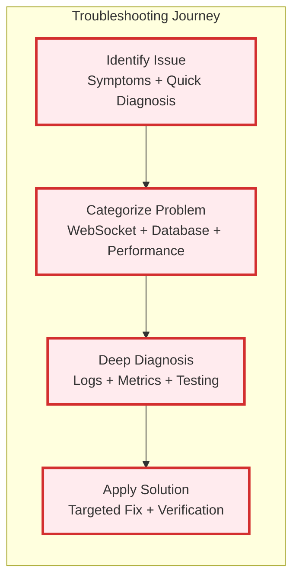
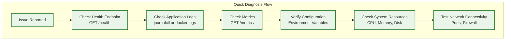
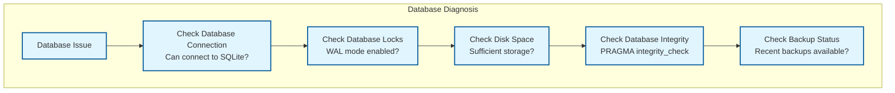
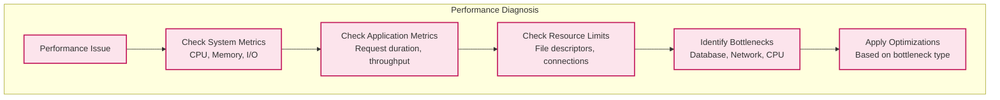

# Troubleshooting Guide

## IMPORTANT FOR VISUALS AND DIAGRAMS

ALL DIAGRAMS WILL BE IN MERMAID ONLY TO ENSURE EASE WITH GITHUB - DO NOT SKIP THAT

## Overview

This comprehensive troubleshooting guide helps diagnose and resolve common issues with Campfire Rust. The guide follows Basecamp's proven error handling patterns adapted for Rust-based systems, providing systematic approaches to identify and fix problems quickly.



**Troubleshooting Philosophy:**
- **Systematic Diagnosis**: Follow structured approaches to identify root causes
- **Observable Systems**: Use built-in logging and metrics for problem identification
- **Self-Healing**: Leverage Rust's safety guarantees and RAII patterns
- **Graceful Degradation**: Maintain service availability during partial failures
- **Clear Error Messages**: Actionable error information for quick resolution

### Troubleshooting Strategy Overview

```mermaid
graph TD
    subgraph "Issue Resolution Flow"
        ISSUE[Issue Reported<br/>User complaint or alert]
        TRIAGE[Quick Triage<br/>Health check, logs, metrics]
        CATEGORY[Categorize Issue<br/>WebSocket, Database, Performance]
        DIAGNOSE[Deep Diagnosis<br/>Systematic investigation]
        RESOLVE[Apply Resolution<br/>Targeted fix or workaround]
        VERIFY[Verify Fix<br/>Test and monitor]
        DOCUMENT[Document Solution<br/>Update knowledge base]
    end
    
    ISSUE --> TRIAGE
    TRIAGE --> CATEGORY
    CATEGORY --> DIAGNOSE
    DIAGNOSE --> RESOLVE
    RESOLVE --> VERIFY
    VERIFY --> DOCUMENT
    
    classDef issue fill:#ffebee,stroke:#d32f2f,stroke-width:2px
    classDef process fill:#e8f5e8,stroke:#2e7d32,stroke-width:2px
    classDef resolution fill:#e3f2fd,stroke:#1976d2,stroke-width:2px
    
    class ISSUE issue
    class TRIAGE,CATEGORY,DIAGNOSE process
    class RESOLVE,VERIFY,DOCUMENT resolution
```



## Quick Diagnosis Checklist

When experiencing issues, check these items in order:



### 1-Minute Health Check

```bash
# Quick system status
curl -f http://localhost:3000/health || echo "❌ Health check failed"
curl -f http://localhost:3000/metrics/summary || echo "❌ Metrics unavailable"

# Check if service is running
systemctl is-active campfire-rust || docker ps | grep campfire

# Check recent logs for errors
journalctl -u campfire-rust --since "5 minutes ago" | grep -i error
# OR for Docker
docker logs campfire-rust --since 5m | grep -i error
```

## WebSocket Connection Issues

WebSocket problems are the most common user-facing issues. Here's a systematic approach to diagnosis and resolution.

### Connection Troubleshooting Flow


### Common WebSocket Issues

#### Issue: Connection Refused (Connection Failed)

**Symptoms:**
- Browser shows "WebSocket connection failed"
- Network tab shows failed WebSocket upgrade
- Client receives connection error immediately

**Diagnosis:**
```bash
# Test WebSocket endpoint directly
curl -i -N -H "Connection: Upgrade" \
     -H "Upgrade: websocket" \
     -H "Sec-WebSocket-Version: 13" \
     -H "Sec-WebSocket-Key: x3JJHMbDL1EzLkh9GBhXDw==" \
     http://localhost:3000/ws

# Expected response: HTTP/1.1 101 Switching Protocols
```

**Solutions:**
1. **Server Not Running**: Start the Campfire service
   ```bash
   systemctl start campfire-rust
   # OR
   docker-compose up -d
   ```

2. **Wrong Port/URL**: Verify WebSocket URL matches server configuration
   ```bash
   # Check server configuration
   grep -i "bind_address" /etc/campfire/config.toml
   ```

3. **Firewall Blocking**: Open WebSocket port
   ```bash
   # For systemd systems
   sudo ufw allow 3000
   # OR check iptables
   sudo iptables -L | grep 3000
   ```

#### Issue: Authentication Failed (401 Unauthorized)

**Symptoms:**
- WebSocket upgrade returns 401 status
- "Authentication required" error in logs
- Connection drops immediately after upgrade attempt

**Diagnosis:**
```bash
# Check session token validity
curl -H "Authorization: Bearer YOUR_TOKEN" \
     http://localhost:3000/api/users/me

# Check authentication logs
journalctl -u campfire-rust | grep -i "auth\|session"
```

**Solutions:**
1. **Expired Session**: Re-authenticate to get new token
   ```bash
   curl -X POST http://localhost:3000/api/auth/login \
        -H "Content-Type: application/json" \
        -d '{"email":"user@example.com","password":"password"}'
   ```

2. **Invalid Token Format**: Ensure proper Bearer token format
   ```javascript
   // Correct WebSocket authentication
   const ws = new WebSocket('ws://localhost:3000/ws', [], {
     headers: {
       'Authorization': `Bearer ${sessionToken}`
     }
   });
   ```

3. **Session Configuration**: Check session timeout settings
   ```bash
   # Verify session configuration
   grep -i "session" /etc/campfire/config.toml
   ```

#### Issue: Connection Drops Frequently (Unstable Connection)

**Symptoms:**
- WebSocket connects but disconnects after short time
- Frequent reconnection attempts in client
- "Connection lost" messages in UI

**Diagnosis:**
```bash
# Check connection stability
ss -tuln | grep :3000  # Check if port is properly bound

# Monitor connection count
curl http://localhost:3000/metrics | grep websocket_connections_active

# Check for connection timeout logs
journalctl -u campfire-rust | grep -i "timeout\|disconnect"
```

**Solutions:**
1. **Network Timeout**: Implement proper keepalive
   ```javascript
   // Client-side keepalive
   setInterval(() => {
     if (ws.readyState === WebSocket.OPEN) {
       ws.send(JSON.stringify({type: 'ping'}));
     }
   }, 30000); // 30 second keepalive
   ```

2. **Server Resource Limits**: Check system resources
   ```bash
   # Check memory usage
   free -h
   # Check file descriptor limits
   ulimit -n
   # Check process limits
   cat /proc/$(pgrep campfire-rust)/limits
   ```

3. **Proxy/Load Balancer Issues**: Configure proxy timeouts
   ```nginx
   # nginx configuration
   location /ws {
       proxy_pass http://campfire-backend;
       proxy_http_version 1.1;
       proxy_set_header Upgrade $http_upgrade;
       proxy_set_header Connection "upgrade";
       proxy_read_timeout 86400;  # 24 hours
       proxy_send_timeout 86400;
   }
   ```

#### Issue: Messages Not Received (Broadcasting Problems)

**Symptoms:**
- WebSocket connected but messages don't appear
- Other users' messages not received in real-time
- Typing indicators not working

**Diagnosis:**
```bash
# Check message broadcasting metrics
curl http://localhost:3000/metrics | grep -E "websocket_messages|messages_created"

# Check room membership
curl -H "Authorization: Bearer YOUR_TOKEN" \
     http://localhost:3000/api/rooms

# Check connection manager logs
journalctl -u campfire-rust | grep -i "broadcast\|connection"
```

**Solutions:**
1. **Room Access Issues**: Verify user has room access
   ```bash
   # Check room membership
   curl -H "Authorization: Bearer YOUR_TOKEN" \
        http://localhost:3000/api/rooms/ROOM_ID/members
   ```

2. **Connection Manager Problems**: Restart service to reset connections
   ```bash
   systemctl restart campfire-rust
   ```

3. **Message Validation Failures**: Check message content validation
   ```bash
   # Check for validation errors in logs
   journalctl -u campfire-rust | grep -i "validation\|invalid"
   ```

## Database Issues

Database problems can cause various symptoms from slow responses to complete service failure.

### Database Troubleshooting Flow



### Common Database Issues

#### Issue: Database Locked (SQLITE_BUSY)

**Symptoms:**
- "Database is locked" errors in logs
- Slow response times for database operations
- HTTP 500 errors for API requests

**Diagnosis:**
```bash
# Check if WAL mode is enabled
sqlite3 /path/to/campfire.db "PRAGMA journal_mode;"
# Should return: wal

# Check for long-running transactions
sqlite3 /path/to/campfire.db "PRAGMA wal_checkpoint;"

# Check database file permissions
ls -la /path/to/campfire.db*
```

**Solutions:**
1. **Enable WAL Mode**: Configure Write-Ahead Logging
   ```bash
   # Enable WAL mode manually
   sqlite3 /path/to/campfire.db "PRAGMA journal_mode=WAL;"
   
   # Or ensure config enables it
   echo "enable_wal_mode = true" >> /etc/campfire/config.toml
   ```

2. **Fix File Permissions**: Ensure proper database file access
   ```bash
   # Fix ownership and permissions
   sudo chown campfire:campfire /path/to/campfire.db*
   sudo chmod 644 /path/to/campfire.db*
   ```

3. **Restart Service**: Clear any stuck transactions
   ```bash
   systemctl restart campfire-rust
   ```

#### Issue: Database Corruption

**Symptoms:**
- "Database disk image is malformed" errors
- Unexpected query results
- Service fails to start with database errors

**Diagnosis:**
```bash
# Check database integrity
sqlite3 /path/to/campfire.db "PRAGMA integrity_check;"

# Check for corruption in specific tables
sqlite3 /path/to/campfire.db "PRAGMA table_info(messages);"

# Verify database schema
sqlite3 /path/to/campfire.db ".schema" | head -20
```

**Solutions:**
1. **Restore from Backup**: Use most recent backup
   ```bash
   # Stop service
   systemctl stop campfire-rust
   
   # Restore from backup
   cp /backup/campfire-$(date -d yesterday +%Y%m%d).db /path/to/campfire.db
   
   # Start service
   systemctl start campfire-rust
   ```

2. **Repair Database**: Attempt automatic repair
   ```bash
   # Create backup first
   cp /path/to/campfire.db /path/to/campfire.db.backup
   
   # Attempt repair
   sqlite3 /path/to/campfire.db ".recover" > recovered.sql
   sqlite3 /path/to/campfire_new.db < recovered.sql
   
   # Replace if successful
   mv /path/to/campfire_new.db /path/to/campfire.db
   ```

3. **Rebuild from Scratch**: Last resort - lose recent data
   ```bash
   # Stop service
   systemctl stop campfire-rust
   
   # Remove corrupted database
   rm /path/to/campfire.db*
   
   # Start service (will create new database)
   systemctl start campfire-rust
   ```

#### Issue: Slow Database Performance

**Symptoms:**
- API requests taking >1 second
- High database query duration in metrics
- Users reporting slow message loading

**Diagnosis:**
```bash
# Check database metrics
curl http://localhost:3000/metrics | grep database_query_duration

# Check database size
ls -lh /path/to/campfire.db

# Check query performance
sqlite3 /path/to/campfire.db "EXPLAIN QUERY PLAN SELECT * FROM messages ORDER BY created_at DESC LIMIT 50;"
```

**Solutions:**
1. **Optimize Queries**: Ensure proper indexing
   ```sql
   -- Check existing indexes
   .indexes
   
   -- Add missing indexes if needed
   CREATE INDEX IF NOT EXISTS idx_messages_room_created 
   ON messages(room_id, created_at DESC);
   
   CREATE INDEX IF NOT EXISTS idx_messages_creator 
   ON messages(creator_id, created_at DESC);
   ```

2. **Vacuum Database**: Reclaim space and optimize
   ```bash
   # Stop service for maintenance
   systemctl stop campfire-rust
   
   # Vacuum database
   sqlite3 /path/to/campfire.db "VACUUM;"
   
   # Restart service
   systemctl start campfire-rust
   ```

3. **Archive Old Data**: Remove old messages
   ```sql
   -- Archive messages older than 1 year
   DELETE FROM messages 
   WHERE created_at < datetime('now', '-1 year');
   
   -- Update FTS index
   INSERT INTO messages_fts(messages_fts) VALUES('rebuild');
   ```

## Performance Issues

Performance problems can manifest as slow response times, high resource usage, or system instability.

### Performance Troubleshooting Flow



### Common Performance Issues

#### Issue: High Memory Usage

**Symptoms:**
- System running out of memory
- OOM killer terminating processes
- Swap usage increasing

**Diagnosis:**
```bash
# Check memory usage
free -h
ps aux | grep campfire-rust | head -5

# Check application metrics
curl http://localhost:3000/metrics | grep memory_usage_bytes

# Check for memory leaks
valgrind --tool=memcheck --leak-check=full ./target/release/campfire-rust
```

**Solutions:**
1. **Increase System Memory**: Add more RAM if possible
2. **Optimize Connection Limits**: Reduce concurrent connections
   ```toml
   # config.toml
   [database]
   max_connections = 10  # Reduce from default
   
   [server]
   max_request_size = 1048576  # 1MB limit
   ```

3. **Enable Memory Profiling**: Monitor memory usage patterns
   ```bash
   # Enable memory profiling in development
   RUST_LOG=debug cargo run --release
   ```

#### Issue: High CPU Usage

**Symptoms:**
- CPU usage consistently >80%
- System becomes unresponsive
- High load averages

**Diagnosis:**
```bash
# Check CPU usage
top -p $(pgrep campfire-rust)
htop

# Check application metrics
curl http://localhost:3000/metrics | grep cpu_usage_percent

# Profile CPU usage
perf record -g ./target/release/campfire-rust
perf report
```

**Solutions:**
1. **Optimize Hot Paths**: Profile and optimize frequently called code
2. **Reduce Worker Threads**: Lower thread count if over-provisioned
   ```toml
   # config.toml
   [server]
   worker_threads = 2  # Reduce from auto-detected
   ```

3. **Enable Request Rate Limiting**: Prevent CPU exhaustion
   ```toml
   # config.toml
   [security]
   rate_limit_per_minute = 60  # Limit requests per user
   ```

#### Issue: Slow Response Times

**Symptoms:**
- API requests taking >2 seconds
- WebSocket message delays
- User interface feels sluggish

**Diagnosis:**
```bash
# Check request duration metrics
curl http://localhost:3000/metrics | grep http_request_duration

# Test specific endpoints
time curl http://localhost:3000/api/rooms
time curl http://localhost:3000/api/users/me

# Check database query performance
curl http://localhost:3000/metrics | grep database_query_duration
```

**Solutions:**
1. **Database Optimization**: See database performance section above
2. **Enable Response Caching**: Cache frequently accessed data
3. **Optimize Serialization**: Reduce JSON payload sizes
4. **Connection Pooling**: Ensure proper database connection reuse

## Configuration Issues

Configuration problems can prevent the service from starting or cause runtime errors.

### Common Configuration Issues

#### Issue: Service Won't Start

**Symptoms:**
- systemctl start fails
- "Configuration error" in logs
- Service exits immediately

**Diagnosis:**
```bash
# Check service status
systemctl status campfire-rust

# Check configuration validation
campfire-rust --validate-config

# Check environment variables
env | grep CAMPFIRE
```

**Solutions:**
1. **Fix Configuration Syntax**: Validate TOML/environment variables
   ```bash
   # Test configuration parsing
   toml-cli check /etc/campfire/config.toml
   ```

2. **Set Required Environment Variables**:
   ```bash
   # Required variables
   export CAMPFIRE_DATABASE_URL="/var/lib/campfire/campfire.db"
   export CAMPFIRE_SERVER_BIND_ADDRESS="0.0.0.0:3000"
   ```

3. **Fix File Permissions**:
   ```bash
   sudo chown -R campfire:campfire /etc/campfire/
   sudo chmod 600 /etc/campfire/config.toml
   ```

#### Issue: SSL/TLS Certificate Problems

**Symptoms:**
- HTTPS connections fail
- Certificate warnings in browser
- "TLS handshake failed" errors

**Diagnosis:**
```bash
# Test certificate validity
openssl s_client -connect localhost:3000 -servername localhost

# Check certificate expiration
openssl x509 -in /path/to/cert.pem -text -noout | grep "Not After"

# Verify certificate chain
curl -vI https://localhost:3000/health
```

**Solutions:**
1. **Renew Certificates**: Update expired certificates
   ```bash
   # For Let's Encrypt
   certbot renew
   systemctl reload nginx
   ```

2. **Fix Certificate Paths**: Ensure correct file paths in configuration
3. **Update Certificate Chain**: Include intermediate certificates

## Frequently Asked Questions (FAQ)

### General Questions

**Q: How do I check if Campfire is running correctly?**

A: Use the health check endpoint:
```bash
curl http://localhost:3000/health
# Should return: {"status":"healthy","timestamp":"..."}
```

**Q: Where are the log files located?**

A: Logs are available through systemd journal:
```bash
# View recent logs
journalctl -u campfire-rust -f

# View logs from specific time
journalctl -u campfire-rust --since "1 hour ago"

# For Docker deployments
docker logs campfire-rust -f
```

**Q: How do I backup the database?**

A: Use the built-in backup script:
```bash
# Manual backup
./scripts/backup.sh

# Automated daily backups (add to crontab)
0 2 * * * /path/to/campfire/scripts/backup.sh
```

### WebSocket Questions

**Q: Why do WebSocket connections keep dropping?**

A: Common causes and solutions:
1. **Network timeouts**: Implement client-side keepalive (ping every 30s)
2. **Proxy configuration**: Configure proxy WebSocket timeouts
3. **Resource limits**: Check system file descriptor limits
4. **Authentication expiry**: Refresh session tokens before expiry

**Q: How do I test WebSocket connectivity?**

A: Use browser developer tools or command-line tools:
```bash
# Test with websocat
websocat ws://localhost:3000/ws -H "Authorization: Bearer YOUR_TOKEN"

# Test with curl (HTTP upgrade)
curl -i -N -H "Connection: Upgrade" \
     -H "Upgrade: websocket" \
     -H "Authorization: Bearer YOUR_TOKEN" \
     http://localhost:3000/ws
```

### Database Questions

**Q: How do I migrate data from the original Rails Campfire?**

A: Use the migration script:
```bash
# Export from Rails Campfire
rails runner scripts/export_data.rb > campfire_export.json

# Import to Rust Campfire
./scripts/migrate.sh import campfire_export.json
```

**Q: Can I use PostgreSQL instead of SQLite?**

A: Currently, only SQLite is supported in MVP 1.0. PostgreSQL support is planned for v2.0.

**Q: How do I optimize database performance?**

A: Follow these steps:
1. Enable WAL mode: `PRAGMA journal_mode=WAL;`
2. Regular VACUUM: `sqlite3 campfire.db "VACUUM;"`
3. Monitor query performance via `/metrics` endpoint
4. Archive old messages periodically

### Performance Questions

**Q: What are the recommended system requirements?**

A: Minimum requirements:
- **CPU**: 1 core (2+ recommended)
- **Memory**: 512MB RAM (1GB+ recommended)
- **Storage**: 1GB free space (more for message history)
- **Network**: 100Mbps (for WebSocket connections)

**Q: How many concurrent users can Campfire handle?**

A: Performance depends on system resources:
- **Small deployment**: 50-100 concurrent users (1GB RAM)
- **Medium deployment**: 500-1000 concurrent users (4GB RAM)
- **Large deployment**: 1000+ concurrent users (8GB+ RAM)

**Q: How do I monitor performance?**

A: Use the built-in metrics:
```bash
# Application metrics
curl http://localhost:3000/metrics/summary

# Prometheus metrics
curl http://localhost:3000/metrics

# System monitoring
htop
iotop
```

### Security Questions

**Q: How do I secure Campfire in production?**

A: Follow the security checklist:
1. **Use HTTPS**: Configure SSL/TLS certificates
2. **Firewall**: Restrict access to necessary ports only
3. **Authentication**: Use strong passwords and session timeouts
4. **Updates**: Keep system and dependencies updated
5. **Monitoring**: Enable security event logging

**Q: How do I reset a user's password?**

A: Use the admin CLI:
```bash
# Reset password for user
campfire-rust admin reset-password user@example.com

# Or update directly in database
sqlite3 campfire.db "UPDATE users SET password_hash = 'NEW_HASH' WHERE email = 'user@example.com';"
```

### Deployment Questions

**Q: How do I deploy Campfire with Docker?**

A: Use the provided Docker Compose configuration:
```bash
# Production deployment
docker-compose -f docker-compose.prod.yml up -d

# Development deployment
docker-compose up -d
```

**Q: How do I update to a new version?**

A: Follow the update procedure:
```bash
# Backup database first
./scripts/backup.sh

# Pull new version
git pull origin main

# Rebuild and restart
docker-compose build
docker-compose up -d

# Or for systemd
systemctl stop campfire-rust
cargo build --release
systemctl start campfire-rust
```

**Q: How do I scale Campfire horizontally?**

A: Currently, Campfire is designed as a single-instance application. Horizontal scaling is planned for v2.0 with:
- Shared database backend
- Redis for session storage
- Load balancer configuration

## Emergency Procedures

### Service Recovery

If Campfire becomes completely unresponsive:

1. **Immediate Recovery**:
   ```bash
   # Force restart service
   systemctl restart campfire-rust
   
   # Or for Docker
   docker-compose restart
   ```

2. **Database Recovery**:
   ```bash
   # Stop service
   systemctl stop campfire-rust
   
   # Restore from backup
   cp /backup/campfire-latest.db /var/lib/campfire/campfire.db
   
   # Start service
   systemctl start campfire-rust
   ```

3. **Complete System Recovery**:
   ```bash
   # Restore from full backup
   ./scripts/restore.sh /backup/campfire-full-backup.tar.gz
   ```

### Data Recovery

If data is lost or corrupted:

1. **Message Recovery**: Check database backups and WAL files
2. **User Recovery**: Restore from user backup or re-import
3. **Configuration Recovery**: Restore from configuration backup

## Advanced Troubleshooting Scenarios

### Memory Leak Detection and Resolution

Memory leaks in Rust applications are rare but can occur with unsafe code, circular references, or resource management issues.

#### Memory Leak Diagnosis Flow

```mermaid
graph TD
    subgraph "Memory Leak Detection"
        LEAK_SUSPECT[Suspected Memory Leak<br/>Growing memory usage]
        BASELINE[Establish Memory Baseline<br/>Fresh start measurements]
        LOAD_TEST[Run Load Test<br/>Simulate production traffic]
        MONITOR[Monitor Memory Growth<br/>Track RSS, heap, connections]
        PROFILE[Profile Memory Usage<br/>Identify allocation sources]
        ANALYZE[Analyze Leak Sources<br/>Circular refs, resource leaks]
        FIX[Apply Targeted Fixes<br/>Break cycles, fix resource cleanup]
    end
    
    LEAK_SUSPECT --> BASELINE
    BASELINE --> LOAD_TEST
    LOAD_TEST --> MONITOR
    MONITOR --> PROFILE
    PROFILE --> ANALYZE
    ANALYZE --> FIX
    
    classDef memory fill:#ffebee,stroke:#d32f2f,stroke-width:2px
    class LEAK_SUSPECT,BASELINE,LOAD_TEST,MONITOR,PROFILE,ANALYZE,FIX memory
```



#### Advanced Memory Leak Detection

**1. Establish Memory Baseline**
```bash
# Start fresh instance and record baseline
systemctl restart campfire-rust
sleep 30  # Allow startup to complete

# Record baseline memory usage
BASELINE_RSS=$(ps -o rss= -p $(pgrep campfire-rust))
BASELINE_HEAP=$(curl -s http://localhost:3000/metrics | grep memory_usage_bytes | cut -d' ' -f2)

echo "Baseline RSS: ${BASELINE_RSS}KB"
echo "Baseline Heap: ${BASELINE_HEAP} bytes"
```

**2. Continuous Memory Monitoring**
```bash
#!/bin/bash
# memory_monitor.sh - Track memory usage over time

LOG_FILE="/var/log/campfire/memory_usage.log"
INTERVAL=60  # Check every minute

while true; do
    TIMESTAMP=$(date '+%Y-%m-%d %H:%M:%S')
    PID=$(pgrep campfire-rust)
    
    if [ -n "$PID" ]; then
        # Get process memory info
        RSS=$(ps -o rss= -p $PID)
        VSZ=$(ps -o vsz= -p $PID)
        
        # Get application metrics
        HEAP=$(curl -s http://localhost:3000/metrics | grep memory_usage_bytes | cut -d' ' -f2)
        CONNECTIONS=$(curl -s http://localhost:3000/metrics | grep websocket_connections_active | cut -d' ' -f2)
        
        # Log memory usage
        echo "$TIMESTAMP,$RSS,$VSZ,$HEAP,$CONNECTIONS" >> $LOG_FILE
        
        # Alert if memory usage exceeds threshold (1GB RSS)
        if [ "$RSS" -gt 1048576 ]; then
            echo "ALERT: High memory usage detected: ${RSS}KB RSS" | logger -t campfire-memory
        fi
    fi
    
    sleep $INTERVAL
done
```

**3. Memory Profiling with Valgrind**
```bash
# Build debug version for profiling
cargo build --profile dev-debug

# Run with Valgrind memory profiler
valgrind --tool=memcheck \
         --leak-check=full \
         --show-leak-kinds=all \
         --track-origins=yes \
         --log-file=valgrind-memcheck.log \
         ./target/debug/campfire-rust

# Analyze results
grep -A 10 "LEAK SUMMARY" valgrind-memcheck.log
```

**4. Heap Profiling with jemalloc**
```bash
# Enable jemalloc profiling (add to Cargo.toml)
# [dependencies]
# jemallocator = "0.5"

# Set profiling environment variables
export MALLOC_CONF="prof:true,prof_active:true,prof_prefix:jeprof"

# Run application with profiling
./target/release/campfire-rust

# Generate heap profile
jeprof --show_bytes --pdf ./target/release/campfire-rust jeprof.*.heap > heap_profile.pdf
```

#### Common Memory Leak Patterns and Fixes

**1. WebSocket Connection Leaks**
```rust
// ❌ Problematic: Connections not properly cleaned up
impl ConnectionManager {
    async fn add_connection(&self, user_id: UserId, sender: WebSocketSender) {
        self.connections.lock().await.insert(user_id, sender);
        // Missing: cleanup on disconnect
    }
}

// ✅ Fixed: Proper cleanup with RAII
impl ConnectionManager {
    async fn add_connection(&self, user_id: UserId, sender: WebSocketSender) -> ConnectionGuard {
        self.connections.lock().await.insert(user_id, sender.clone());
        
        ConnectionGuard {
            user_id,
            manager: self.clone(),
            _sender: sender,
        }
    }
}

impl Drop for ConnectionGuard {
    fn drop(&mut self) {
        let manager = self.manager.clone();
        let user_id = self.user_id;
        
        tokio::spawn(async move {
            manager.connections.lock().await.remove(&user_id);
        });
    }
}
```

**2. Circular Reference Leaks**
```rust
// ❌ Problematic: Strong reference cycle
struct Room {
    members: Vec<Arc<User>>,
}

struct User {
    rooms: Vec<Arc<Room>>,  // Creates cycle: Room -> User -> Room
}

// ✅ Fixed: Use weak references to break cycles
struct Room {
    members: Vec<Arc<User>>,
}

struct User {
    rooms: Vec<Weak<Room>>,  // Weak reference breaks cycle
}
```

**3. Database Connection Pool Leaks**
```rust
// ❌ Problematic: Connections not returned to pool
async fn get_messages(pool: &Pool) -> Result<Vec<Message>, Error> {
    let conn = pool.get().await?;
    let messages = sqlx::query_as!(Message, "SELECT * FROM messages")
        .fetch_all(&conn)
        .await?;
    // Connection not explicitly returned (relies on Drop)
    Ok(messages)
}

// ✅ Fixed: Explicit connection management
async fn get_messages(pool: &Pool) -> Result<Vec<Message>, Error> {
    let messages = sqlx::query_as!(Message, "SELECT * FROM messages")
        .fetch_all(pool)  // Use pool directly, not individual connection
        .await?;
    Ok(messages)
}
```

### Database Corruption Recovery Procedures

Database corruption can occur due to hardware failures, power outages, or software bugs. Here's a comprehensive recovery strategy.

#### Database Corruption Recovery Flow

```mermaid
graph TD
    subgraph "Database Recovery Process"
        CORRUPTION[Database Corruption Detected]
        ASSESS[Assess Corruption Severity<br/>PRAGMA integrity_check]
        BACKUP_CHECK[Check Backup Availability<br/>Recent backups exist?]
        STOP_SERVICE[Stop Campfire Service<br/>Prevent further damage]
        ATTEMPT_REPAIR[Attempt Automatic Repair<br/>.recover command]
        RESTORE_BACKUP[Restore from Backup<br/>Most recent clean backup]
        REBUILD_INDEXES[Rebuild Search Indexes<br/>FTS5 reconstruction]
        VERIFY_INTEGRITY[Verify Data Integrity<br/>Test critical operations]
        RESTART_SERVICE[Restart Service<br/>Resume normal operations]
    end
    
    CORRUPTION --> ASSESS
    ASSESS --> BACKUP_CHECK
    BACKUP_CHECK --> STOP_SERVICE
    STOP_SERVICE --> ATTEMPT_REPAIR
    ATTEMPT_REPAIR --> RESTORE_BACKUP
    RESTORE_BACKUP --> REBUILD_INDEXES
    REBUILD_INDEXES --> VERIFY_INTEGRITY
    VERIFY_INTEGRITY --> RESTART_SERVICE
    
    classDef recovery fill:#e8f5e8,stroke:#2e7d32,stroke-width:2px
    class CORRUPTION,ASSESS,BACKUP_CHECK,STOP_SERVICE,ATTEMPT_REPAIR,RESTORE_BACKUP,REBUILD_INDEXES,VERIFY_INTEGRITY,RESTART_SERVICE recovery
```



#### Advanced Database Recovery Procedures

**1. Corruption Detection and Assessment**
```bash
#!/bin/bash
# db_health_check.sh - Comprehensive database health assessment

DB_PATH="/var/lib/campfire/campfire.db"
BACKUP_DIR="/var/backups/campfire"
LOG_FILE="/var/log/campfire/db_health.log"

echo "=== Database Health Check $(date) ===" | tee -a $LOG_FILE

# Check if database file exists and is accessible
if [ ! -f "$DB_PATH" ]; then
    echo "ERROR: Database file not found: $DB_PATH" | tee -a $LOG_FILE
    exit 1
fi

# Check file permissions
if [ ! -r "$DB_PATH" ] || [ ! -w "$DB_PATH" ]; then
    echo "ERROR: Insufficient permissions for database file" | tee -a $LOG_FILE
    exit 1
fi

# Check database integrity
echo "Checking database integrity..." | tee -a $LOG_FILE
INTEGRITY_RESULT=$(sqlite3 "$DB_PATH" "PRAGMA integrity_check;" 2>&1)

if [ "$INTEGRITY_RESULT" = "ok" ]; then
    echo "✅ Database integrity: OK" | tee -a $LOG_FILE
else
    echo "❌ Database integrity: FAILED" | tee -a $LOG_FILE
    echo "Integrity check result: $INTEGRITY_RESULT" | tee -a $LOG_FILE
    
    # Check specific table integrity
    echo "Checking individual tables..." | tee -a $LOG_FILE
    for table in users rooms messages sessions room_memberships; do
        TABLE_CHECK=$(sqlite3 "$DB_PATH" "PRAGMA integrity_check($table);" 2>&1)
        echo "Table $table: $TABLE_CHECK" | tee -a $LOG_FILE
    done
fi

# Check WAL file status
if [ -f "${DB_PATH}-wal" ]; then
    WAL_SIZE=$(stat -f%z "${DB_PATH}-wal" 2>/dev/null || stat -c%s "${DB_PATH}-wal" 2>/dev/null)
    echo "WAL file size: ${WAL_SIZE} bytes" | tee -a $LOG_FILE
    
    if [ "$WAL_SIZE" -gt 10485760 ]; then  # 10MB
        echo "⚠️  Large WAL file detected, consider checkpoint" | tee -a $LOG_FILE
    fi
fi

# Check database statistics
echo "Database statistics:" | tee -a $LOG_FILE
sqlite3 "$DB_PATH" "
SELECT 
    'Users: ' || COUNT(*) FROM users
UNION ALL
SELECT 
    'Rooms: ' || COUNT(*) FROM rooms
UNION ALL
SELECT 
    'Messages: ' || COUNT(*) FROM messages
UNION ALL
SELECT 
    'Sessions: ' || COUNT(*) FROM sessions;
" | tee -a $LOG_FILE

# Check FTS5 index integrity
echo "Checking FTS5 search index..." | tee -a $LOG_FILE
FTS_CHECK=$(sqlite3 "$DB_PATH" "INSERT INTO messages_fts(messages_fts) VALUES('integrity-check');" 2>&1)
if [ $? -eq 0 ]; then
    echo "✅ FTS5 index: OK" | tee -a $LOG_FILE
else
    echo "❌ FTS5 index: FAILED - $FTS_CHECK" | tee -a $LOG_FILE
fi

echo "=== Health Check Complete ===" | tee -a $LOG_FILE
```

**2. Automatic Database Repair**
```bash
#!/bin/bash
# db_repair.sh - Attempt automatic database repair

DB_PATH="/var/lib/campfire/campfire.db"
BACKUP_DIR="/var/backups/campfire"
REPAIR_LOG="/var/log/campfire/repair.log"

echo "=== Database Repair Started $(date) ===" | tee -a $REPAIR_LOG

# Stop Campfire service
echo "Stopping Campfire service..." | tee -a $REPAIR_LOG
systemctl stop campfire-rust

# Create emergency backup
EMERGENCY_BACKUP="${BACKUP_DIR}/emergency-$(date +%Y%m%d-%H%M%S).db"
echo "Creating emergency backup: $EMERGENCY_BACKUP" | tee -a $REPAIR_LOG
cp "$DB_PATH" "$EMERGENCY_BACKUP"

# Attempt SQLite recovery
echo "Attempting SQLite .recover operation..." | tee -a $REPAIR_LOG
RECOVERED_DB="${DB_PATH}.recovered"

sqlite3 "$DB_PATH" ".recover" > "${RECOVERED_DB}.sql" 2>&1
if [ $? -eq 0 ]; then
    echo "✅ Recovery SQL generated successfully" | tee -a $REPAIR_LOG
    
    # Create new database from recovered data
    rm -f "$RECOVERED_DB"
    sqlite3 "$RECOVERED_DB" < "${RECOVERED_DB}.sql"
    
    if [ $? -eq 0 ]; then
        echo "✅ Recovered database created successfully" | tee -a $REPAIR_LOG
        
        # Verify recovered database integrity
        RECOVERED_INTEGRITY=$(sqlite3 "$RECOVERED_DB" "PRAGMA integrity_check;")
        if [ "$RECOVERED_INTEGRITY" = "ok" ]; then
            echo "✅ Recovered database integrity verified" | tee -a $REPAIR_LOG
            
            # Replace original with recovered database
            mv "$DB_PATH" "${DB_PATH}.corrupted"
            mv "$RECOVERED_DB" "$DB_PATH"
            
            echo "✅ Database repair completed successfully" | tee -a $REPAIR_LOG
        else
            echo "❌ Recovered database failed integrity check" | tee -a $REPAIR_LOG
            echo "Integrity result: $RECOVERED_INTEGRITY" | tee -a $REPAIR_LOG
        fi
    else
        echo "❌ Failed to create recovered database" | tee -a $REPAIR_LOG
    fi
else
    echo "❌ SQLite recovery failed" | tee -a $REPAIR_LOG
fi

# Cleanup temporary files
rm -f "${RECOVERED_DB}.sql"

echo "=== Database Repair Completed $(date) ===" | tee -a $REPAIR_LOG
```

**3. Backup Restoration with Verification**
```bash
#!/bin/bash
# restore_backup.sh - Restore database from backup with verification

BACKUP_DIR="/var/backups/campfire"
DB_PATH="/var/lib/campfire/campfire.db"
RESTORE_LOG="/var/log/campfire/restore.log"

# Function to list available backups
list_backups() {
    echo "Available backups:"
    ls -la "$BACKUP_DIR"/*.db 2>/dev/null | while read -r line; do
        backup_file=$(echo "$line" | awk '{print $9}')
        backup_date=$(echo "$line" | awk '{print $6, $7, $8}')
        backup_size=$(echo "$line" | awk '{print $5}')
        echo "  $(basename "$backup_file") - $backup_date ($backup_size bytes)"
    done
}

# Function to verify backup integrity
verify_backup() {
    local backup_file="$1"
    echo "Verifying backup integrity: $backup_file" | tee -a $RESTORE_LOG
    
    # Check file accessibility
    if [ ! -f "$backup_file" ]; then
        echo "❌ Backup file not found: $backup_file" | tee -a $RESTORE_LOG
        return 1
    fi
    
    # Check SQLite integrity
    local integrity_result=$(sqlite3 "$backup_file" "PRAGMA integrity_check;" 2>&1)
    if [ "$integrity_result" = "ok" ]; then
        echo "✅ Backup integrity verified" | tee -a $RESTORE_LOG
        return 0
    else
        echo "❌ Backup integrity check failed: $integrity_result" | tee -a $RESTORE_LOG
        return 1
    fi
}

# Function to restore from backup
restore_backup() {
    local backup_file="$1"
    echo "=== Backup Restoration Started $(date) ===" | tee -a $RESTORE_LOG
    
    # Stop service
    echo "Stopping Campfire service..." | tee -a $RESTORE_LOG
    systemctl stop campfire-rust
    
    # Create backup of current (corrupted) database
    if [ -f "$DB_PATH" ]; then
        local corrupted_backup="${DB_PATH}.corrupted-$(date +%Y%m%d-%H%M%S)"
        echo "Backing up corrupted database to: $corrupted_backup" | tee -a $RESTORE_LOG
        cp "$DB_PATH" "$corrupted_backup"
    fi
    
    # Restore from backup
    echo "Restoring database from: $backup_file" | tee -a $RESTORE_LOG
    cp "$backup_file" "$DB_PATH"
    
    # Set proper permissions
    chown campfire:campfire "$DB_PATH"
    chmod 644 "$DB_PATH"
    
    # Verify restored database
    if verify_backup "$DB_PATH"; then
        echo "✅ Database restored successfully" | tee -a $RESTORE_LOG
        
        # Rebuild FTS5 index
        echo "Rebuilding FTS5 search index..." | tee -a $RESTORE_LOG
        sqlite3 "$DB_PATH" "INSERT INTO messages_fts(messages_fts) VALUES('rebuild');"
        
        # Start service
        echo "Starting Campfire service..." | tee -a $RESTORE_LOG
        systemctl start campfire-rust
        
        # Wait for service to start
        sleep 10
        
        # Verify service health
        if curl -f http://localhost:3000/health >/dev/null 2>&1; then
            echo "✅ Service restored and healthy" | tee -a $RESTORE_LOG
        else
            echo "❌ Service failed to start properly" | tee -a $RESTORE_LOG
        fi
    else
        echo "❌ Restored database failed verification" | tee -a $RESTORE_LOG
    fi
    
    echo "=== Backup Restoration Completed $(date) ===" | tee -a $RESTORE_LOG
}

# Main script logic
if [ $# -eq 0 ]; then
    echo "Usage: $0 [backup_file|list|latest]"
    echo ""
    echo "Options:"
    echo "  backup_file  - Restore from specific backup file"
    echo "  list        - List available backups"
    echo "  latest      - Restore from most recent backup"
    exit 1
fi

case "$1" in
    "list")
        list_backups
        ;;
    "latest")
        latest_backup=$(ls -t "$BACKUP_DIR"/*.db 2>/dev/null | head -1)
        if [ -n "$latest_backup" ]; then
            echo "Using latest backup: $latest_backup"
            if verify_backup "$latest_backup"; then
                restore_backup "$latest_backup"
            fi
        else
            echo "No backups found in $BACKUP_DIR"
        fi
        ;;
    *)
        if [ -f "$1" ]; then
            if verify_backup "$1"; then
                restore_backup "$1"
            fi
        else
            echo "Backup file not found: $1"
            exit 1
        fi
        ;;
esac
```

### Performance Debugging Techniques

Advanced performance debugging requires systematic analysis of bottlenecks and resource usage patterns.

#### Performance Debugging Flow

```mermaid
graph TD
    subgraph "Performance Debugging Process"
        PERF_ISSUE[Performance Issue Reported<br/>Slow response times]
        BASELINE[Establish Performance Baseline<br/>Normal operation metrics]
        REPRODUCE[Reproduce Issue<br/>Consistent test scenario]
        PROFILE[Profile Application<br/>CPU, memory, I/O analysis]
        IDENTIFY[Identify Bottlenecks<br/>Hot paths, resource contention]
        OPTIMIZE[Apply Optimizations<br/>Targeted improvements]
        VALIDATE[Validate Improvements<br/>Before/after comparison]
        MONITOR[Monitor Production<br/>Continuous performance tracking]
    end
    
    PERF_ISSUE --> BASELINE
    BASELINE --> REPRODUCE
    REPRODUCE --> PROFILE
    PROFILE --> IDENTIFY
    IDENTIFY --> OPTIMIZE
    OPTIMIZE --> VALIDATE
    VALIDATE --> MONITOR
    
    classDef performance fill:#fff8e1,stroke:#f57f17,stroke-width:2px
    class PERF_ISSUE,BASELINE,REPRODUCE,PROFILE,IDENTIFY,OPTIMIZE,VALIDATE,MONITOR performance
```



#### Advanced Performance Profiling Tools

**1. CPU Profiling with perf**
```bash
#!/bin/bash
# cpu_profile.sh - Comprehensive CPU profiling

PROFILE_DURATION=60  # Profile for 60 seconds
OUTPUT_DIR="/tmp/campfire-profile"
mkdir -p "$OUTPUT_DIR"

echo "Starting CPU profiling for ${PROFILE_DURATION} seconds..."

# Get Campfire process ID
CAMPFIRE_PID=$(pgrep campfire-rust)
if [ -z "$CAMPFIRE_PID" ]; then
    echo "Error: Campfire process not found"
    exit 1
fi

# Record CPU profile
perf record -g -p "$CAMPFIRE_PID" -o "$OUTPUT_DIR/perf.data" sleep "$PROFILE_DURATION"

# Generate reports
echo "Generating CPU profile reports..."

# Top functions by CPU usage
perf report -i "$OUTPUT_DIR/perf.data" --stdio > "$OUTPUT_DIR/cpu_hotspots.txt"

# Call graph analysis
perf report -i "$OUTPUT_DIR/perf.data" --stdio -g > "$OUTPUT_DIR/call_graph.txt"

# Flame graph generation (requires flamegraph tools)
if command -v flamegraph >/dev/null 2>&1; then
    perf script -i "$OUTPUT_DIR/perf.data" | flamegraph > "$OUTPUT_DIR/flamegraph.svg"
    echo "Flame graph generated: $OUTPUT_DIR/flamegraph.svg"
fi

echo "CPU profiling complete. Results in: $OUTPUT_DIR"
echo "Top CPU consumers:"
head -20 "$OUTPUT_DIR/cpu_hotspots.txt"
```

**2. Memory Profiling with heaptrack**
```bash
#!/bin/bash
# memory_profile.sh - Advanced memory profiling

OUTPUT_DIR="/tmp/campfire-memory-profile"
mkdir -p "$OUTPUT_DIR"

echo "Starting memory profiling..."

# Build with debug symbols for better profiling
cargo build --profile dev-debug

# Run with heaptrack
heaptrack --output "$OUTPUT_DIR/heaptrack.data" ./target/debug/campfire-rust &
HEAPTRACK_PID=$!

echo "Campfire running with memory profiling (PID: $HEAPTRACK_PID)"
echo "Let it run under normal load, then press Enter to stop profiling..."
read -r

# Stop profiling
kill -TERM "$HEAPTRACK_PID"
wait "$HEAPTRACK_PID"

# Generate memory analysis report
heaptrack_print "$OUTPUT_DIR/heaptrack.data" > "$OUTPUT_DIR/memory_analysis.txt"

echo "Memory profiling complete. Analysis in: $OUTPUT_DIR/memory_analysis.txt"
echo "Top memory allocators:"
grep -A 10 "MOST CALLS" "$OUTPUT_DIR/memory_analysis.txt"
```

**3. I/O Performance Analysis**
```bash
#!/bin/bash
# io_profile.sh - I/O performance profiling

PROFILE_DURATION=60
OUTPUT_DIR="/tmp/campfire-io-profile"
mkdir -p "$OUTPUT_DIR"

echo "Starting I/O profiling for ${PROFILE_DURATION} seconds..."

# Get Campfire process ID
CAMPFIRE_PID=$(pgrep campfire-rust)

# Monitor I/O with iotop
iotop -a -o -d 1 -p "$CAMPFIRE_PID" > "$OUTPUT_DIR/iotop.log" &
IOTOP_PID=$!

# Monitor file system activity with inotify
inotifywait -m -r /var/lib/campfire/ -e modify,create,delete \
    --format '%T %w%f %e' --timefmt '%Y-%m-%d %H:%M:%S' \
    > "$OUTPUT_DIR/fs_activity.log" &
INOTIFY_PID=$!

# Monitor database I/O specifically
strace -p "$CAMPFIRE_PID" -e trace=read,write,fsync,fdatasync -o "$OUTPUT_DIR/db_io.log" &
STRACE_PID=$!

# Wait for profiling duration
sleep "$PROFILE_DURATION"

# Stop monitoring
kill "$IOTOP_PID" "$INOTIFY_PID" "$STRACE_PID" 2>/dev/null

echo "I/O profiling complete. Results in: $OUTPUT_DIR"

# Analyze results
echo "Top I/O operations:"
grep -E "(read|write)" "$OUTPUT_DIR/db_io.log" | head -10

echo "File system activity summary:"
cut -d' ' -f3- "$OUTPUT_DIR/fs_activity.log" | sort | uniq -c | sort -nr | head -10
```

**4. Database Query Performance Analysis**
```bash
#!/bin/bash
# db_performance.sh - Database performance analysis

DB_PATH="/var/lib/campfire/campfire.db"
OUTPUT_DIR="/tmp/campfire-db-profile"
mkdir -p "$OUTPUT_DIR"

echo "Analyzing database performance..."

# Enable SQLite query profiling
sqlite3 "$DB_PATH" "
.timer on
.stats on

-- Analyze query performance for common operations
EXPLAIN QUERY PLAN SELECT * FROM messages WHERE room_id = 'test' ORDER BY created_at DESC LIMIT 50;
EXPLAIN QUERY PLAN SELECT * FROM messages WHERE creator_id = 'test' ORDER BY created_at DESC LIMIT 50;
EXPLAIN QUERY PLAN SELECT * FROM messages_fts WHERE messages_fts MATCH 'search term';

-- Check index usage
.indexes

-- Analyze table statistics
ANALYZE;

-- Check database statistics
PRAGMA table_info(messages);
PRAGMA index_info(idx_messages_room_created);

-- Check query planner statistics
SELECT * FROM sqlite_stat1;
" > "$OUTPUT_DIR/db_analysis.txt"

# Check for slow queries in application logs
echo "Checking for slow database queries in logs..."
journalctl -u campfire-rust --since "1 hour ago" | \
    grep -i "slow\|timeout\|database" > "$OUTPUT_DIR/slow_queries.log"

# Analyze database file statistics
echo "Database file statistics:" >> "$OUTPUT_DIR/db_analysis.txt"
ls -lh "$DB_PATH"* >> "$OUTPUT_DIR/db_analysis.txt"

# Check WAL file size and checkpoint frequency
if [ -f "${DB_PATH}-wal" ]; then
    echo "WAL file size: $(stat -f%z "${DB_PATH}-wal" 2>/dev/null || stat -c%s "${DB_PATH}-wal")" >> "$OUTPUT_DIR/db_analysis.txt"
fi

echo "Database performance analysis complete. Results in: $OUTPUT_DIR"
```

### Diagnostic Tools and Debugging Guides

#### Comprehensive System Diagnostic Tool

```bash
#!/bin/bash
# campfire_diagnostics.sh - Complete system diagnostic tool

DIAGNOSTIC_DIR="/tmp/campfire-diagnostics-$(date +%Y%m%d-%H%M%S)"
mkdir -p "$DIAGNOSTIC_DIR"

echo "=== Campfire System Diagnostics ==="
echo "Output directory: $DIAGNOSTIC_DIR"

# System Information
echo "Collecting system information..."
{
    echo "=== System Information ==="
    uname -a
    echo ""
    echo "=== CPU Information ==="
    lscpu
    echo ""
    echo "=== Memory Information ==="
    free -h
    echo ""
    echo "=== Disk Usage ==="
    df -h
    echo ""
    echo "=== Network Configuration ==="
    ip addr show
    echo ""
    echo "=== System Load ==="
    uptime
    echo ""
    echo "=== Process List ==="
    ps aux | head -20
} > "$DIAGNOSTIC_DIR/system_info.txt"

# Campfire Service Status
echo "Collecting Campfire service status..."
{
    echo "=== Service Status ==="
    systemctl status campfire-rust
    echo ""
    echo "=== Service Configuration ==="
    systemctl show campfire-rust
    echo ""
    echo "=== Environment Variables ==="
    systemctl show-environment
} > "$DIAGNOSTIC_DIR/service_status.txt"

# Application Logs
echo "Collecting application logs..."
journalctl -u campfire-rust --since "24 hours ago" > "$DIAGNOSTIC_DIR/application.log"
journalctl -u campfire-rust --since "1 hour ago" | grep -i error > "$DIAGNOSTIC_DIR/recent_errors.log"

# Configuration Files
echo "Collecting configuration files..."
if [ -f "/etc/campfire/config.toml" ]; then
    # Sanitize sensitive information
    sed 's/password = .*/password = "[REDACTED]"/g; s/secret = .*/secret = "[REDACTED]"/g' \
        /etc/campfire/config.toml > "$DIAGNOSTIC_DIR/config.toml"
fi

# Database Health
echo "Checking database health..."
DB_PATH="/var/lib/campfire/campfire.db"
if [ -f "$DB_PATH" ]; then
    {
        echo "=== Database Integrity ==="
        sqlite3 "$DB_PATH" "PRAGMA integrity_check;"
        echo ""
        echo "=== Database Statistics ==="
        sqlite3 "$DB_PATH" "
        SELECT 'Users: ' || COUNT(*) FROM users
        UNION ALL
        SELECT 'Rooms: ' || COUNT(*) FROM rooms
        UNION ALL
        SELECT 'Messages: ' || COUNT(*) FROM messages
        UNION ALL
        SELECT 'Sessions: ' || COUNT(*) FROM sessions;
        "
        echo ""
        echo "=== Database Schema Version ==="
        sqlite3 "$DB_PATH" "PRAGMA user_version;"
        echo ""
        echo "=== Database File Info ==="
        ls -lh "$DB_PATH"*
    } > "$DIAGNOSTIC_DIR/database_health.txt"
fi

# Network Connectivity
echo "Testing network connectivity..."
{
    echo "=== Port Binding ==="
    ss -tuln | grep :3000
    echo ""
    echo "=== Health Check ==="
    curl -v http://localhost:3000/health 2>&1 || echo "Health check failed"
    echo ""
    echo "=== Metrics Endpoint ==="
    curl -v http://localhost:3000/metrics 2>&1 | head -20 || echo "Metrics endpoint failed"
} > "$DIAGNOSTIC_DIR/network_connectivity.txt"

# Performance Metrics
echo "Collecting performance metrics..."
{
    echo "=== Current Resource Usage ==="
    CAMPFIRE_PID=$(pgrep campfire-rust)
    if [ -n "$CAMPFIRE_PID" ]; then
        ps -p "$CAMPFIRE_PID" -o pid,ppid,cmd,%mem,%cpu,etime
        echo ""
        echo "=== Memory Details ==="
        cat "/proc/$CAMPFIRE_PID/status" | grep -E "(VmRSS|VmSize|VmPeak|VmHWM)"
        echo ""
        echo "=== File Descriptors ==="
        ls /proc/"$CAMPFIRE_PID"/fd | wc -l
        echo "Open file descriptors: $(ls /proc/$CAMPFIRE_PID/fd | wc -l)"
        echo "File descriptor limit: $(cat /proc/$CAMPFIRE_PID/limits | grep 'Max open files')"
    else
        echo "Campfire process not running"
    fi
    echo ""
    echo "=== System Load Average ==="
    cat /proc/loadavg
} > "$DIAGNOSTIC_DIR/performance_metrics.txt"

# Security and Permissions
echo "Checking security and permissions..."
{
    echo "=== File Permissions ==="
    ls -la /var/lib/campfire/
    ls -la /etc/campfire/ 2>/dev/null || echo "No /etc/campfire directory"
    echo ""
    echo "=== Process Security ==="
    CAMPFIRE_PID=$(pgrep campfire-rust)
    if [ -n "$CAMPFIRE_PID" ]; then
        ps -p "$CAMPFIRE_PID" -o pid,user,group,comm
        echo ""
        echo "=== Process Capabilities ==="
        cat "/proc/$CAMPFIRE_PID/status" | grep Cap
    fi
    echo ""
    echo "=== Firewall Status ==="
    ufw status 2>/dev/null || iptables -L INPUT | head -10
} > "$DIAGNOSTIC_DIR/security_permissions.txt"

# Create summary report
echo "Generating summary report..."
{
    echo "=== Campfire Diagnostics Summary ==="
    echo "Generated: $(date)"
    echo "Hostname: $(hostname)"
    echo ""
    
    # Service status summary
    if systemctl is-active campfire-rust >/dev/null 2>&1; then
        echo "✅ Service Status: Running"
    else
        echo "❌ Service Status: Not Running"
    fi
    
    # Health check summary
    if curl -f http://localhost:3000/health >/dev/null 2>&1; then
        echo "✅ Health Check: Passing"
    else
        echo "❌ Health Check: Failing"
    fi
    
    # Database integrity summary
    if [ -f "$DB_PATH" ]; then
        DB_INTEGRITY=$(sqlite3 "$DB_PATH" "PRAGMA integrity_check;" 2>&1)
        if [ "$DB_INTEGRITY" = "ok" ]; then
            echo "✅ Database Integrity: OK"
        else
            echo "❌ Database Integrity: Failed"
        fi
    else
        echo "❌ Database: Not Found"
    fi
    
    # Resource usage summary
    CAMPFIRE_PID=$(pgrep campfire-rust)
    if [ -n "$CAMPFIRE_PID" ]; then
        MEMORY_MB=$(ps -p "$CAMPFIRE_PID" -o rss= | awk '{print int($1/1024)}')
        CPU_PERCENT=$(ps -p "$CAMPFIRE_PID" -o %cpu= | awk '{print $1}')
        echo "📊 Memory Usage: ${MEMORY_MB}MB"
        echo "📊 CPU Usage: ${CPU_PERCENT}%"
    fi
    
    # Recent errors summary
    ERROR_COUNT=$(grep -c "ERROR\|WARN" "$DIAGNOSTIC_DIR/recent_errors.log" 2>/dev/null || echo "0")
    echo "⚠️  Recent Errors: $ERROR_COUNT"
    
    echo ""
    echo "=== Recommendations ==="
    
    # Generate recommendations based on findings
    if [ "$ERROR_COUNT" -gt 10 ]; then
        echo "- High error rate detected, check application.log for details"
    fi
    
    if [ -n "$MEMORY_MB" ] && [ "$MEMORY_MB" -gt 1024 ]; then
        echo "- High memory usage detected, consider memory profiling"
    fi
    
    if [ ! -f "$DB_PATH" ]; then
        echo "- Database file missing, check configuration and permissions"
    fi
    
    if ! curl -f http://localhost:3000/health >/dev/null 2>&1; then
        echo "- Health check failing, service may not be responding"
    fi
    
} > "$DIAGNOSTIC_DIR/summary.txt"

# Create archive
echo "Creating diagnostic archive..."
tar -czf "${DIAGNOSTIC_DIR}.tar.gz" -C "$(dirname "$DIAGNOSTIC_DIR")" "$(basename "$DIAGNOSTIC_DIR")"

echo ""
echo "=== Diagnostics Complete ==="
echo "Archive created: ${DIAGNOSTIC_DIR}.tar.gz"
echo "Summary:"
cat "$DIAGNOSTIC_DIR/summary.txt"
echo ""
echo "To share diagnostics, send the archive file: ${DIAGNOSTIC_DIR}.tar.gz"
```

### Contact and Support

For issues not covered in this guide:

1. **Check GitHub Issues**: Search existing issues and solutions
2. **Create New Issue**: Provide logs, configuration, and reproduction steps
3. **Community Support**: Join the community chat for help
4. **Emergency Contact**: For critical production issues

#### Issue Reporting Template

When reporting issues, include the following information:

```bash
# Run diagnostics and include the archive
./scripts/campfire_diagnostics.sh

# Include system information
uname -a
free -h
df -h

# Include recent logs
journalctl -u campfire-rust --since "1 hour ago" | tail -100

# Include configuration (sanitized)
cat /etc/campfire/config.toml | sed 's/password = .*/password = "[REDACTED]"/'

# Include reproduction steps
echo "Steps to reproduce:"
echo "1. ..."
echo "2. ..."
echo "3. ..."
```

---

**Document Version**: 2.0  
**Last Updated**: December 2024  
**Next Review**: After 100+ production deployments