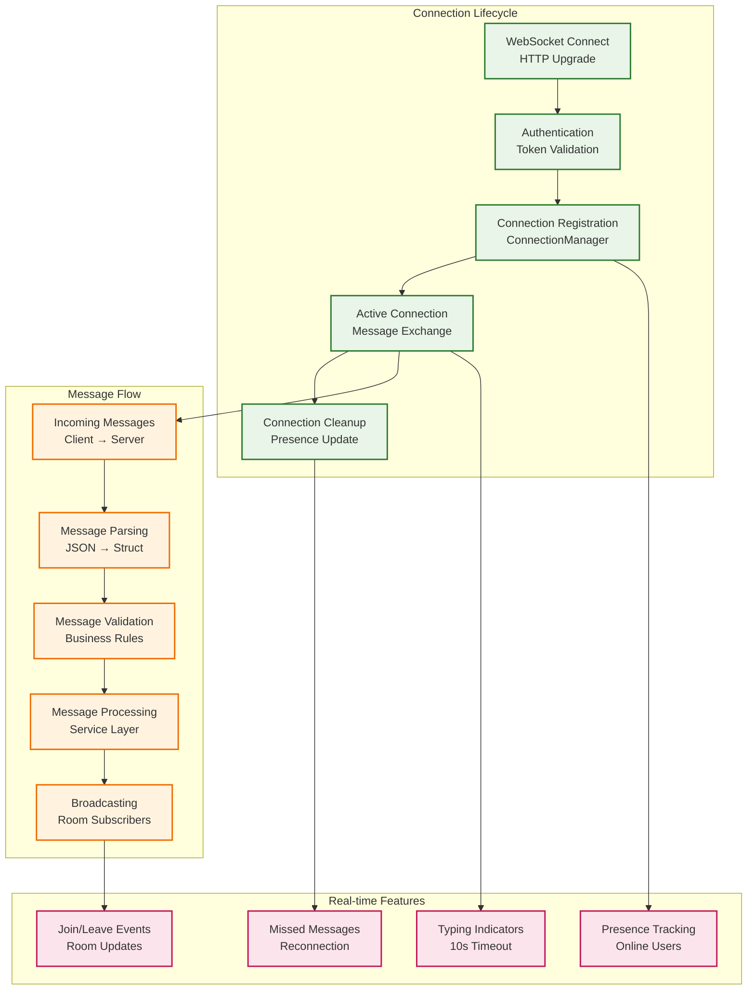
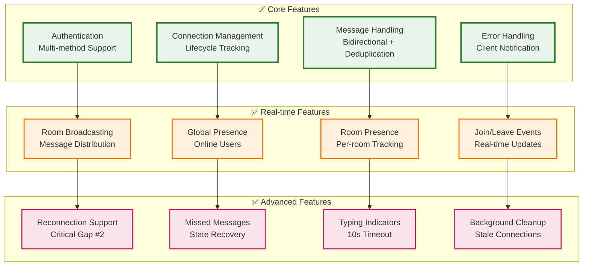

# WebSocket API Documentation

## Overview

The Campfire Rust WebSocket API provides real-time communication for chat functionality. The WebSocket endpoint is available at `/ws` and supports authentication via multiple methods.

## WebSocket Architecture



## Authentication

The WebSocket endpoint requires authentication before establishing a connection. Three authentication methods are supported:

### 1. Query Parameter
```
ws://localhost:3000/ws?token=<session_token>
```

### 2. Authorization Header
```
Authorization: Bearer <session_token>
```

### 3. Cookie
```
Cookie: session_token=<session_token>
```

## Connection Lifecycle

1. **Connection Request**: Client requests WebSocket upgrade with authentication
2. **Authentication**: Server validates session token
3. **Upgrade**: If authenticated, connection is upgraded to WebSocket
4. **Registration**: Connection is registered with ConnectionManager
5. **Message Handling**: Bidirectional message exchange begins
6. **Cleanup**: Connection is removed from ConnectionManager on disconnect

## Incoming Message Types (Client → Server)

### Create Message
```json
{
  "type": "CreateMessage",
  "room_id": "550e8400-e29b-41d4-a716-446655440000",
  "content": "Hello, world!",
  "client_message_id": "550e8400-e29b-41d4-a716-446655440001"
}
```

### Update Last Seen Message
```json
{
  "type": "UpdateLastSeen",
  "message_id": "550e8400-e29b-41d4-a716-446655440000"
}
```

### Join Room
```json
{
  "type": "JoinRoom",
  "room_id": "550e8400-e29b-41d4-a716-446655440000"
}
```

### Leave Room
```json
{
  "type": "LeaveRoom",
  "room_id": "550e8400-e29b-41d4-a716-446655440000"
}
```

### Start Typing
```json
{
  "type": "StartTyping",
  "room_id": "550e8400-e29b-41d4-a716-446655440000"
}
```

### Stop Typing
```json
{
  "type": "StopTyping",
  "room_id": "550e8400-e29b-41d4-a716-446655440000"
}
```

## Outgoing Message Types (Server → Client)

### New Message
```json
{
  "type": "NewMessage",
  "message": {
    "id": "550e8400-e29b-41d4-a716-446655440000",
    "room_id": "550e8400-e29b-41d4-a716-446655440001",
    "creator_id": "550e8400-e29b-41d4-a716-446655440002",
    "content": "Hello, world!",
    "client_message_id": "550e8400-e29b-41d4-a716-446655440003",
    "created_at": "2023-12-07T10:30:00Z"
  }
}
```

### User Joined
```json
{
  "type": "UserJoined",
  "user_id": "550e8400-e29b-41d4-a716-446655440000",
  "room_id": "550e8400-e29b-41d4-a716-446655440001"
}
```

### User Left
```json
{
  "type": "UserLeft",
  "user_id": "550e8400-e29b-41d4-a716-446655440000",
  "room_id": "550e8400-e29b-41d4-a716-446655440001"
}
```

### Typing Start
```json
{
  "type": "TypingStart",
  "user_id": "550e8400-e29b-41d4-a716-446655440000",
  "room_id": "550e8400-e29b-41d4-a716-446655440001"
}
```

### Typing Stop
```json
{
  "type": "TypingStop",
  "user_id": "550e8400-e29b-41d4-a716-446655440000",
  "room_id": "550e8400-e29b-41d4-a716-446655440001"
}
```

### Presence Update
```json
{
  "type": "PresenceUpdate",
  "room_id": "550e8400-e29b-41d4-a716-446655440000",
  "online_users": [
    "550e8400-e29b-41d4-a716-446655440001",
    "550e8400-e29b-41d4-a716-446655440002"
  ]
}
```

### Error
```json
{
  "type": "Error",
  "message": "Failed to create message: Invalid content",
  "code": "MESSAGE_CREATION_FAILED"
}
```

## Features Implemented



### ✅ Authentication
- Multiple authentication methods (query, header, cookie)
- Session validation before WebSocket upgrade
- Proper error responses for invalid authentication

### ✅ Connection Management
- Connection registration with ConnectionManager
- Automatic cleanup on disconnect
- Connection lifecycle tracking

### ✅ Message Handling
- Bidirectional message parsing and routing
- Message creation with deduplication support
- Error handling and client notification

### ✅ Real-time Features
- Room-based message broadcasting
- Global and room-specific presence tracking
- Typing indicators with automatic cleanup
- Join/leave notifications
- Enhanced presence updates

### ✅ Reconnection Support (Critical Gap #2)
- Last seen message tracking
- Missed message delivery on reconnection
- Connection state persistence

### ✅ Enhanced Presence Tracking
- Room-specific online user tracking
- Automatic presence updates on join/leave
- Presence cleanup for disconnected users
- Real-time presence broadcasting

### ✅ Typing Indicators System
- Start/stop typing notifications
- Automatic typing timeout (10 seconds)
- Room-specific typing user tracking
- Background cleanup of stale typing indicators

## Error Handling

The WebSocket handler includes comprehensive error handling:

- **Authentication Errors**: 401 Unauthorized responses
- **Message Parsing Errors**: Error messages sent to client
- **Service Errors**: Logged and error responses sent to client
- **Connection Errors**: Automatic cleanup and logging

## Testing

The WebSocket implementation includes:

- Unit tests for message parsing and serialization
- Integration tests for message handling
- Connection lifecycle tests
- Error handling tests

## Usage Example

```javascript
// Connect to WebSocket with authentication
const ws = new WebSocket('ws://localhost:3000/ws?token=your_session_token');

// Handle connection open
ws.onopen = function() {
    console.log('WebSocket connected');
    
    // Join a room
    ws.send(JSON.stringify({
        type: 'JoinRoom',
        room_id: 'your-room-id'
    }));
};

// Handle incoming messages
ws.onmessage = function(event) {
    const message = JSON.parse(event.data);
    console.log('Received:', message);
    
    switch(message.type) {
        case 'NewMessage':
            displayMessage(message.message);
            break;
        case 'UserJoined':
            showUserJoined(message.user_id);
            break;
        case 'TypingStart':
            showTypingIndicator(message.user_id);
            break;
        // ... handle other message types
    }
};

// Send a message
function sendMessage(roomId, content) {
    ws.send(JSON.stringify({
        type: 'CreateMessage',
        room_id: roomId,
        content: content,
        client_message_id: generateUUID()
    }));
}

// Handle connection close
ws.onclose = function() {
    console.log('WebSocket disconnected');
    // Implement reconnection logic here
};
```

## Enhanced Features Details

### Room-Specific Presence Tracking

The system now maintains separate presence information for each room:

- **Global Presence**: Tracks which users have active WebSocket connections
- **Room Presence**: Tracks which users are online in specific rooms
- **Automatic Updates**: Presence is updated when users join/leave rooms or connect/disconnect
- **Cleanup**: Offline users are automatically removed from room presence

### Typing Indicators System

Typing indicators provide real-time feedback about user activity:

- **Start Typing**: When a user starts typing, other room members are notified
- **Stop Typing**: When a user stops typing, the indicator is removed
- **Automatic Timeout**: Typing indicators automatically expire after 10 seconds
- **Background Cleanup**: Stale typing indicators are cleaned up every 5 seconds

### Presence Broadcasting

Enhanced presence updates keep all room members informed:

- **Join/Leave Events**: Broadcast when users join or leave rooms
- **Presence Updates**: Send complete online user lists for rooms
- **Real-time Updates**: Immediate notification of presence changes

## Implementation Notes

- The WebSocket handler is implemented in `src/handlers/websocket.rs`
- Connection management is handled by `ConnectionManagerImpl`
- Message broadcasting uses the existing `MessageService`
- Authentication reuses the existing `AuthService`
- All WebSocket messages are JSON-formatted
- The implementation follows the Rails ActionCable pattern adapted to Rust
- Room-specific presence is maintained in `HashMap<RoomId, RoomPresence>`
- Typing indicators use automatic cleanup with configurable timeouts
- Background tasks handle cleanup of stale connections and typing indicators