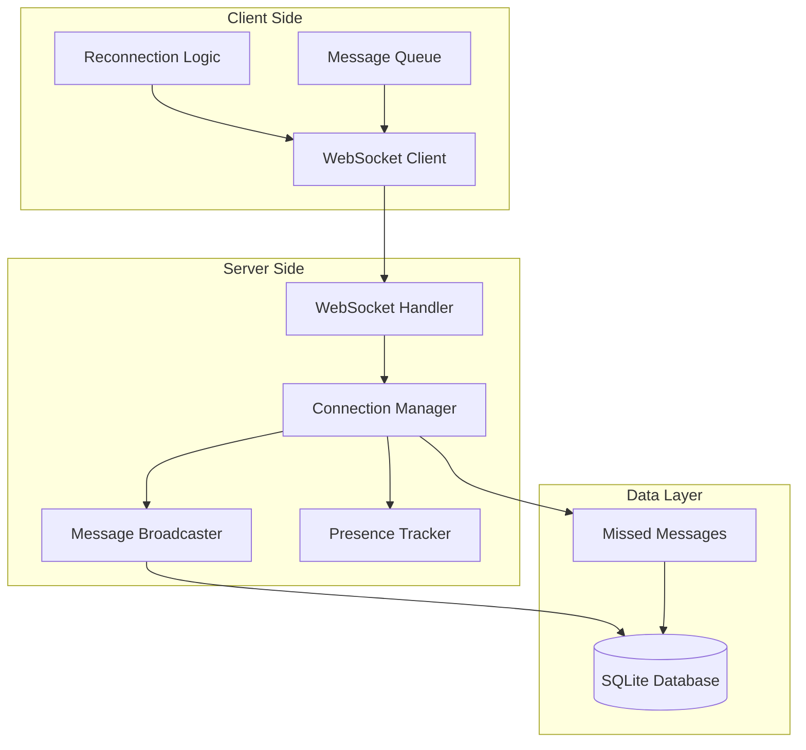
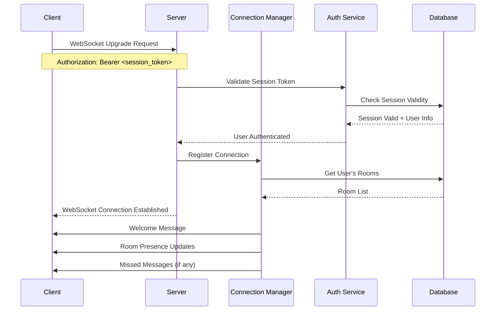
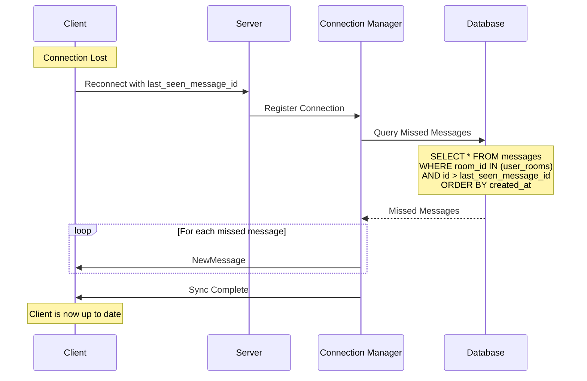

# WebSocket Real-Time Features Guide

## Overview

Campfire's real-time features are built on WebSocket connections that provide instant message delivery, presence tracking, and typing indicators. This implementation follows Rails ActionCable patterns adapted to Rust's async ecosystem using tokio-tungstenite.

**Core Philosophy**: Simple, reliable real-time communication with automatic reconnection and missed message recovery.

## Architecture Overview



## Connection Lifecycle

### 1. Initial Connection



### 2. Authentication Flow

WebSocket connections authenticate using session tokens from the HTTP authentication system:

```rust
// WebSocket authentication example
#[derive(Serialize, Deserialize)]
pub struct WebSocketAuth {
    pub session_token: String,
    pub last_seen_message_id: Option<MessageId>,
}

// Server-side authentication
pub async fn authenticate_websocket(
    auth: WebSocketAuth,
    auth_service: &AuthService,
) -> Result<User, AuthError> {
    auth_service.validate_session(auth.session_token).await
}
```

**Authentication Methods**:
1. **Header-based**: `Authorization: Bearer <session_token>`
2. **Query parameter**: `?token=<session_token>`
3. **Initial message**: Send auth message immediately after connection

### 3. Connection Registration

Once authenticated, connections are registered with the Connection Manager:

```rust
#[derive(Debug, Clone)]
pub struct ConnectionInfo {
    pub user_id: UserId,
    pub connection_id: ConnectionId,
    pub connected_at: DateTime<Utc>,
    pub last_seen_message_id: Option<MessageId>,
    pub rooms: HashSet<RoomId>,
}

// Connection registration
pub async fn register_connection(
    &self,
    user_id: UserId,
    connection_id: ConnectionId,
    sender: WebSocketSender,
    last_seen_message_id: Option<MessageId>,
) -> Result<(), ConnectionError> {
    // Add to active connections
    // Subscribe to user's rooms
    // Send missed messages if reconnecting
    // Update presence tracking
}
```

## WebSocket Message Types

### Core Message Structure

All WebSocket messages follow a consistent JSON structure:

```rust
#[derive(Serialize, Deserialize, Debug)]
#[serde(tag = "type", content = "data")]
pub enum WebSocketMessage {
    // Authentication
    Auth { session_token: String, last_seen_message_id: Option<MessageId> },
    AuthSuccess { user: User, rooms: Vec<Room> },
    AuthError { error: String },
    
    // Chat Messages
    NewMessage { message: Message, room_id: RoomId },
    MessageDelivered { client_message_id: Uuid, message_id: MessageId },
    MessageError { client_message_id: Uuid, error: String },
    
    // Presence Tracking
    UserJoined { user_id: UserId, room_id: RoomId },
    UserLeft { user_id: UserId, room_id: RoomId },
    PresenceUpdate { room_id: RoomId, online_users: Vec<UserId> },
    
    // Typing Indicators
    TypingStart { user_id: UserId, room_id: RoomId },
    TypingStop { user_id: UserId, room_id: RoomId },
    
    // Room Management
    RoomJoined { room: Room },
    RoomLeft { room_id: RoomId },
    RoomUpdated { room: Room },
    
    // System Messages
    Ping,
    Pong,
    Error { message: String },
    Disconnect { reason: String },
}
```

### Message Examples

#### 1. Sending a Chat Message

**Client → Server**:
```json
{
  "type": "NewMessage",
  "data": {
    "room_id": "550e8400-e29b-41d4-a716-446655440000",
    "content": "Hello everyone! 👋",
    "client_message_id": "123e4567-e89b-12d3-a456-426614174000"
  }
}
```

**Server → All Room Members**:
```json
{
  "type": "NewMessage",
  "data": {
    "message": {
      "id": "660e8400-e29b-41d4-a716-446655440001",
      "room_id": "550e8400-e29b-41d4-a716-446655440000",
      "creator_id": "770e8400-e29b-41d4-a716-446655440002",
      "content": "Hello everyone! 👋",
      "client_message_id": "123e4567-e89b-12d3-a456-426614174000",
      "created_at": "2024-01-15T10:30:00Z"
    },
    "room_id": "550e8400-e29b-41d4-a716-446655440000"
  }
}
```

#### 2. Typing Indicators

**Client → Server** (Start Typing):
```json
{
  "type": "TypingStart",
  "data": {
    "room_id": "550e8400-e29b-41d4-a716-446655440000"
  }
}
```

**Server → Other Room Members**:
```json
{
  "type": "TypingStart",
  "data": {
    "user_id": "770e8400-e29b-41d4-a716-446655440002",
    "room_id": "550e8400-e29b-41d4-a716-446655440000"
  }
}
```

#### 3. Presence Updates

**Server → Room Members** (User Joins):
```json
{
  "type": "UserJoined",
  "data": {
    "user_id": "770e8400-e29b-41d4-a716-446655440002",
    "room_id": "550e8400-e29b-41d4-a716-446655440000"
  }
}
```

**Server → Room Members** (Presence Summary):
```json
{
  "type": "PresenceUpdate",
  "data": {
    "room_id": "550e8400-e29b-41d4-a716-446655440000",
    "online_users": [
      "770e8400-e29b-41d4-a716-446655440002",
      "880e8400-e29b-41d4-a716-446655440003",
      "990e8400-e29b-41d4-a716-446655440004"
    ]
  }
}
```

## Reconnection Logic and Missed Messages

### Automatic Reconnection

The client implements exponential backoff reconnection:

```javascript
class CampfireWebSocket {
    constructor(url, sessionToken) {
        this.url = url;
        this.sessionToken = sessionToken;
        this.reconnectAttempts = 0;
        this.maxReconnectAttempts = 10;
        this.lastSeenMessageId = null;
        this.messageQueue = [];
    }
    
    connect() {
        this.ws = new WebSocket(this.url);
        
        this.ws.onopen = () => {
            console.log('WebSocket connected');
            this.reconnectAttempts = 0;
            this.authenticate();
            this.flushMessageQueue();
        };
        
        this.ws.onclose = (event) => {
            console.log('WebSocket disconnected:', event.code, event.reason);
            this.scheduleReconnect();
        };
        
        this.ws.onerror = (error) => {
            console.error('WebSocket error:', error);
        };
        
        this.ws.onmessage = (event) => {
            this.handleMessage(JSON.parse(event.data));
        };
    }
    
    scheduleReconnect() {
        if (this.reconnectAttempts >= this.maxReconnectAttempts) {
            console.error('Max reconnection attempts reached');
            return;
        }
        
        const delay = Math.min(1000 * Math.pow(2, this.reconnectAttempts), 30000);
        this.reconnectAttempts++;
        
        console.log(`Reconnecting in ${delay}ms (attempt ${this.reconnectAttempts})`);
        setTimeout(() => this.connect(), delay);
    }
    
    authenticate() {
        this.send({
            type: 'Auth',
            data: {
                session_token: this.sessionToken,
                last_seen_message_id: this.lastSeenMessageId
            }
        });
    }
}
```

### Missed Message Recovery

The server tracks the last seen message ID for each connection and delivers missed messages on reconnection:



**Server Implementation**:
```rust
pub async fn send_missed_messages(
    &self,
    user_id: UserId,
    connection_id: ConnectionId,
    last_seen_message_id: Option<MessageId>,
) -> Result<(), ConnectionError> {
    // Get user's rooms
    let user_rooms = self.get_user_rooms(user_id).await?;
    
    // Query missed messages
    let missed_messages = if let Some(last_seen_id) = last_seen_message_id {
        self.db.get_messages_since(user_rooms, last_seen_id).await?
    } else {
        // First connection - send recent messages
        self.db.get_recent_messages(user_rooms, 50).await?
    };
    
    // Send missed messages in order
    for message in missed_messages {
        let ws_message = WebSocketMessage::NewMessage {
            message: message.clone(),
            room_id: message.room_id,
        };
        
        self.send_to_connection(connection_id, ws_message).await?;
    }
    
    Ok(())
}
```

## Presence Tracking

### Real-Time Presence Updates

Presence tracking maintains a real-time view of who's online in each room:

```rust
#[derive(Debug, Clone)]
pub struct PresenceTracker {
    // user_id -> set of connection_ids
    user_connections: Arc<RwLock<HashMap<UserId, HashSet<ConnectionId>>>>,
    
    // room_id -> set of user_ids currently online
    room_presence: Arc<RwLock<HashMap<RoomId, HashSet<UserId>>>>,
    
    // connection_id -> user_id mapping
    connection_users: Arc<RwLock<HashMap<ConnectionId, UserId>>>,
    
    // Last activity timestamp for cleanup
    last_activity: Arc<RwLock<HashMap<UserId, DateTime<Utc>>>>,
}

impl PresenceTracker {
    pub async fn user_connected(
        &self,
        user_id: UserId,
        connection_id: ConnectionId,
        user_rooms: Vec<RoomId>,
    ) -> Result<(), PresenceError> {
        // Track connection
        self.user_connections.write().await
            .entry(user_id)
            .or_default()
            .insert(connection_id);
        
        self.connection_users.write().await
            .insert(connection_id, user_id);
        
        // Update room presence
        let mut room_presence = self.room_presence.write().await;
        for room_id in user_rooms {
            let was_empty = !room_presence
                .entry(room_id)
                .or_default()
                .insert(user_id);
            
            if was_empty {
                // User just came online in this room
                self.broadcast_presence_change(room_id, user_id, true).await?;
            }
        }
        
        // Update activity timestamp
        self.last_activity.write().await
            .insert(user_id, Utc::now());
        
        Ok(())
    }
    
    pub async fn user_disconnected(
        &self,
        connection_id: ConnectionId,
    ) -> Result<(), PresenceError> {
        let user_id = {
            let mut connection_users = self.connection_users.write().await;
            connection_users.remove(&connection_id)
        };
        
        if let Some(user_id) = user_id {
            // Remove connection
            let mut user_connections = self.user_connections.write().await;
            if let Some(connections) = user_connections.get_mut(&user_id) {
                connections.remove(&connection_id);
                
                // If user has no more connections, they're offline
                if connections.is_empty() {
                    user_connections.remove(&user_id);
                    
                    // Remove from all rooms
                    let mut room_presence = self.room_presence.write().await;
                    let rooms_to_update: Vec<RoomId> = room_presence
                        .iter_mut()
                        .filter_map(|(room_id, users)| {
                            if users.remove(&user_id) {
                                Some(*room_id)
                            } else {
                                None
                            }
                        })
                        .collect();
                    
                    // Broadcast offline status
                    for room_id in rooms_to_update {
                        self.broadcast_presence_change(room_id, user_id, false).await?;
                    }
                }
            }
        }
        
        Ok(())
    }
    
    pub async fn get_room_presence(&self, room_id: RoomId) -> Vec<UserId> {
        self.room_presence.read().await
            .get(&room_id)
            .map(|users| users.iter().copied().collect())
            .unwrap_or_default()
    }
}
```

### Presence Cleanup

A background task cleans up stale presence data:

```rust
pub async fn start_presence_cleanup_task(
    presence_tracker: Arc<PresenceTracker>,
) -> tokio::task::JoinHandle<()> {
    tokio::spawn(async move {
        let mut interval = tokio::time::interval(Duration::from_secs(60));
        
        loop {
            interval.tick().await;
            
            let cutoff = Utc::now() - Duration::from_secs(300); // 5 minutes
            
            if let Err(e) = presence_tracker.cleanup_stale_presence(cutoff).await {
                eprintln!("Presence cleanup error: {}", e);
            }
        }
    })
}
```

## Typing Indicators

### Typing State Management

Typing indicators show when users are actively composing messages:

```rust
#[derive(Debug, Clone)]
pub struct TypingIndicator {
    pub user_id: UserId,
    pub room_id: RoomId,
    pub started_at: DateTime<Utc>,
}

#[derive(Debug)]
pub struct TypingTracker {
    // room_id -> set of users currently typing
    typing_users: Arc<RwLock<HashMap<RoomId, HashMap<UserId, DateTime<Utc>>>>>,
}

impl TypingTracker {
    pub async fn start_typing(
        &self,
        user_id: UserId,
        room_id: RoomId,
    ) -> Result<bool, TypingError> {
        let mut typing_users = self.typing_users.write().await;
        let room_typing = typing_users.entry(room_id).or_default();
        
        let was_typing = room_typing.contains_key(&user_id);
        room_typing.insert(user_id, Utc::now());
        
        // Return true if this is a new typing session
        Ok(!was_typing)
    }
    
    pub async fn stop_typing(
        &self,
        user_id: UserId,
        room_id: RoomId,
    ) -> Result<bool, TypingError> {
        let mut typing_users = self.typing_users.write().await;
        
        if let Some(room_typing) = typing_users.get_mut(&room_id) {
            let was_typing = room_typing.remove(&user_id).is_some();
            
            if room_typing.is_empty() {
                typing_users.remove(&room_id);
            }
            
            Ok(was_typing)
        } else {
            Ok(false)
        }
    }
    
    pub async fn get_typing_users(&self, room_id: RoomId) -> Vec<UserId> {
        self.typing_users.read().await
            .get(&room_id)
            .map(|users| users.keys().copied().collect())
            .unwrap_or_default()
    }
}
```

### Automatic Typing Timeout

Typing indicators automatically expire after 5 seconds of inactivity:

```rust
pub async fn start_typing_cleanup_task(
    typing_tracker: Arc<TypingTracker>,
    connection_manager: Arc<ConnectionManager>,
) -> tokio::task::JoinHandle<()> {
    tokio::spawn(async move {
        let mut interval = tokio::time::interval(Duration::from_secs(1));
        
        loop {
            interval.tick().await;
            
            let cutoff = Utc::now() - Duration::from_secs(5);
            
            if let Err(e) = typing_tracker.cleanup_expired_typing(
                cutoff,
                &connection_manager
            ).await {
                eprintln!("Typing cleanup error: {}", e);
            }
        }
    })
}
```

## Client-Side Implementation Examples

### JavaScript WebSocket Client

```javascript
class CampfireClient {
    constructor(baseUrl, sessionToken) {
        this.baseUrl = baseUrl;
        this.sessionToken = sessionToken;
        this.ws = null;
        this.messageHandlers = new Map();
        this.typingTimer = null;
        this.lastSeenMessageId = localStorage.getItem('lastSeenMessageId');
    }
    
    connect() {
        const wsUrl = this.baseUrl.replace('http', 'ws') + '/ws';
        this.ws = new WebSocket(wsUrl);
        
        this.ws.onopen = () => this.handleOpen();
        this.ws.onmessage = (event) => this.handleMessage(event);
        this.ws.onclose = (event) => this.handleClose(event);
        this.ws.onerror = (error) => this.handleError(error);
    }
    
    handleOpen() {
        console.log('Connected to Campfire');
        this.authenticate();
    }
    
    authenticate() {
        this.send('Auth', {
            session_token: this.sessionToken,
            last_seen_message_id: this.lastSeenMessageId
        });
    }
    
    handleMessage(event) {
        const message = JSON.parse(event.data);
        
        switch (message.type) {
            case 'AuthSuccess':
                this.handleAuthSuccess(message.data);
                break;
                
            case 'NewMessage':
                this.handleNewMessage(message.data);
                break;
                
            case 'TypingStart':
                this.handleTypingStart(message.data);
                break;
                
            case 'TypingStop':
                this.handleTypingStop(message.data);
                break;
                
            case 'PresenceUpdate':
                this.handlePresenceUpdate(message.data);
                break;
                
            default:
                console.log('Unknown message type:', message.type);
        }
    }
    
    sendMessage(roomId, content) {
        const clientMessageId = this.generateUUID();
        
        this.send('NewMessage', {
            room_id: roomId,
            content: content,
            client_message_id: clientMessageId
        });
        
        return clientMessageId;
    }
    
    startTyping(roomId) {
        this.send('TypingStart', { room_id: roomId });
        
        // Auto-stop typing after 5 seconds
        clearTimeout(this.typingTimer);
        this.typingTimer = setTimeout(() => {
            this.stopTyping(roomId);
        }, 5000);
    }
    
    stopTyping(roomId) {
        this.send('TypingStop', { room_id: roomId });
        clearTimeout(this.typingTimer);
    }
    
    send(type, data) {
        if (this.ws && this.ws.readyState === WebSocket.OPEN) {
            this.ws.send(JSON.stringify({ type, data }));
        } else {
            console.warn('WebSocket not connected, queuing message');
            // Queue message for when connection is restored
        }
    }
    
    handleNewMessage(data) {
        const { message, room_id } = data;
        
        // Update last seen message ID
        this.lastSeenMessageId = message.id;
        localStorage.setItem('lastSeenMessageId', message.id);
        
        // Emit event for UI to handle
        this.emit('message', { message, roomId: room_id });
    }
    
    handleTypingStart(data) {
        this.emit('typingStart', data);
    }
    
    handleTypingStop(data) {
        this.emit('typingStop', data);
    }
    
    handlePresenceUpdate(data) {
        this.emit('presenceUpdate', data);
    }
}
```

## Error Handling and Recovery

### Connection Error Types

```rust
#[derive(Error, Debug)]
pub enum WebSocketError {
    #[error("Authentication failed: {reason}")]
    AuthenticationFailed { reason: String },
    
    #[error("Connection closed: {code} - {reason}")]
    ConnectionClosed { code: u16, reason: String },
    
    #[error("Message parsing failed: {0}")]
    MessageParsingFailed(#[from] serde_json::Error),
    
    #[error("Rate limit exceeded: {limit} messages per {window}")]
    RateLimitExceeded { limit: u32, window: String },
    
    #[error("Room access denied: {room_id}")]
    RoomAccessDenied { room_id: RoomId },
    
    #[error("Invalid message format: {reason}")]
    InvalidMessageFormat { reason: String },
    
    #[error("Server overloaded: {retry_after}")]
    ServerOverloaded { retry_after: Duration },
}
```

### Graceful Degradation

When WebSocket connections fail, the system gracefully degrades:

1. **Polling Fallback**: Client can fall back to HTTP polling for messages
2. **Offline Queue**: Messages are queued locally until connection is restored
3. **Presence Approximation**: Show "recently active" instead of real-time presence
4. **Typing Indicators**: Disabled when WebSocket is unavailable

## Performance Considerations

### Connection Limits

```rust
pub struct ConnectionLimits {
    pub max_connections_per_user: usize,      // Default: 5
    pub max_connections_total: usize,         // Default: 10,000
    pub max_rooms_per_connection: usize,      // Default: 100
    pub message_rate_limit: (u32, Duration), // Default: 60 per minute
    pub typing_rate_limit: (u32, Duration),  // Default: 10 per minute
}
```

### Memory Management

- **Connection Cleanup**: Automatic cleanup of stale connections
- **Message Buffering**: Limited buffer size for missed messages
- **Presence Expiry**: Automatic removal of inactive users
- **Typing Timeout**: Automatic cleanup of expired typing indicators

### Monitoring and Metrics

```rust
pub struct WebSocketMetrics {
    pub active_connections: AtomicUsize,
    pub messages_sent: AtomicU64,
    pub messages_received: AtomicU64,
    pub reconnections: AtomicU64,
    pub authentication_failures: AtomicU64,
    pub rate_limit_hits: AtomicU64,
}
```

## Testing WebSocket Features

### Integration Tests

```rust
#[tokio::test]
async fn test_websocket_message_flow() {
    let app = create_test_app().await;
    let client1 = create_websocket_client(&app, "user1_token").await;
    let client2 = create_websocket_client(&app, "user2_token").await;
    
    // User 1 sends message
    client1.send_message(room_id, "Hello from user 1").await;
    
    // User 2 should receive the message
    let received = client2.wait_for_message().await;
    assert_eq!(received.content, "Hello from user 1");
}

#[tokio::test]
async fn test_reconnection_with_missed_messages() {
    let app = create_test_app().await;
    let client = create_websocket_client(&app, "user_token").await;
    
    // Disconnect client
    client.disconnect().await;
    
    // Send messages while disconnected
    send_message_via_http(&app, room_id, "Message 1").await;
    send_message_via_http(&app, room_id, "Message 2").await;
    
    // Reconnect
    client.reconnect().await;
    
    // Should receive missed messages
    let messages = client.wait_for_messages(2).await;
    assert_eq!(messages.len(), 2);
    assert_eq!(messages[0].content, "Message 1");
    assert_eq!(messages[1].content, "Message 2");
}
```

## Troubleshooting

### Common Issues

1. **Connection Drops**: Check network stability and server load
2. **Missing Messages**: Verify last_seen_message_id tracking
3. **Duplicate Messages**: Check client-side deduplication logic
4. **Presence Issues**: Verify cleanup tasks are running
5. **Authentication Failures**: Check session token validity

### Debug Tools

```javascript
// Enable WebSocket debugging
localStorage.setItem('campfire_debug', 'websocket');

// Monitor connection state
window.campfire.ws.addEventListener('statechange', (event) => {
    console.log('WebSocket state:', event.detail);
});

// Log all messages
window.campfire.ws.addEventListener('message', (event) => {
    console.log('WS Message:', JSON.parse(event.data));
});
```

### Server-Side Debugging

```rust
// Enable WebSocket tracing
RUST_LOG=campfire::websocket=debug cargo run

// Monitor connection metrics
curl http://localhost:3000/metrics | grep websocket
```

## Security Considerations

### Authentication Security

- Session tokens are validated on every connection
- Tokens are transmitted securely (WSS in production)
- Invalid tokens result in immediate connection termination

### Rate Limiting

- Message sending: 60 messages per minute per user
- Typing indicators: 10 per minute per user
- Connection attempts: 5 per minute per IP

### Data Validation

- All incoming messages are validated against schemas
- Content is sanitized before broadcasting
- Room access is verified for every operation

## Conclusion

Campfire's WebSocket implementation provides reliable, real-time communication with automatic reconnection, missed message recovery, and comprehensive presence tracking. The system is designed to handle network instability gracefully while maintaining a responsive user experience.

For more information, see:
- [API Reference](api-reference.md) - HTTP API documentation
- [Architecture Guide](architecture.md) - System architecture overview
- [Deployment Guide](deployment-guide.md) - Production deployment instructions